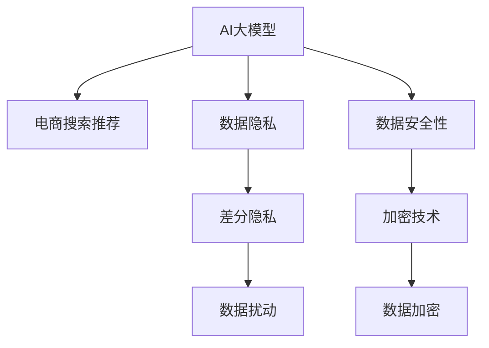

                 

# AI 大模型在电商搜索推荐中的数据安全策略：保障用户隐私与数据安全性

> 关键词：AI大模型, 电商搜索, 推荐系统, 数据安全, 用户隐私, 数据保护, 模型鲁棒性, 差分隐私, 加密技术

## 1. 背景介绍

随着人工智能技术的不断发展和普及，大模型在电商搜索推荐系统中得到了广泛应用。大模型通过学习大量的用户行为数据，预测用户对商品的兴趣和购买意向，为用户推荐个性化商品。然而，在电商搜索推荐过程中，用户数据的隐私保护和安全问题日益突出，成为了亟需解决的难题。本文将探讨大模型在电商搜索推荐中的应用，以及如何构建有效的数据安全策略，保障用户隐私与数据安全性。

## 2. 核心概念与联系

### 2.1 核心概念概述

为更好地理解大模型在电商搜索推荐中的数据安全策略，本节将介绍几个密切相关的核心概念：

- **AI大模型**：以Transformer结构为代表的大规模预训练语言模型，如BERT、GPT等。通过在海量数据上进行预训练，大模型学习到了丰富的语言知识和表征能力，能够对电商搜索推荐系统中的文本数据进行高质量的分析和处理。

- **电商搜索推荐系统**：基于用户的浏览历史、购买记录、评分反馈等数据，预测用户对商品的兴趣和购买意向，为用户推荐个性化商品。是电子商务平台实现用户粘性和销售转化的重要手段。

- **数据隐私**：用户在电商平台上留下的各种数据，包括浏览记录、购买记录、搜索关键词等，涉及到用户的个人信息和行为轨迹。数据隐私保护是确保用户个人信息安全的重要保障。

- **数据安全性**：在数据存储、传输和处理过程中，防止数据被未经授权的访问、篡改、泄露等安全威胁。是构建可靠电商搜索推荐系统的基础。

- **差分隐私**：一种数据隐私保护技术，通过在数据中引入噪声，使得个体数据的泄露风险最小化，同时保护数据的整体统计特性。

- **加密技术**：在数据存储和传输过程中，通过加密算法对数据进行保护，防止数据被非法读取和篡改。常见的加密技术包括对称加密和非对称加密。

这些核心概念之间的逻辑关系可以通过以下Mermaid流程图来展示：



这个流程图展示了大模型在电商搜索推荐中的核心概念及其之间的关系：

1. 大模型通过预训练学习到通用语言知识和特征表示。
2. 在电商搜索推荐中，大模型通过微调等任务适配方法，学习特定领域的知识。
3. 数据隐私和大模型在电商搜索推荐中的应用息息相关，数据隐私保护是大模型应用的前提。
4. 数据安全性涉及数据的完整性和保密性，是电商搜索推荐系统构建的基础。
5. 差分隐私和加密技术是数据隐私保护的重要手段，是保障用户隐私的重要技术手段。

这些概念共同构成了大模型在电商搜索推荐系统中的应用框架，使其能够在电商搜索推荐场景下发挥强大功能的同时，保障用户隐私与数据安全。

## 3. 核心算法原理 & 具体操作步骤
### 3.1 算法原理概述

大模型在电商搜索推荐中的数据安全策略，主要是通过差分隐私和加密技术，保护用户数据的隐私和安全。差分隐私通过对数据进行扰动，使得个体数据的泄露风险最小化。加密技术通过加密算法对数据进行保护，防止数据被非法读取和篡改。

具体而言，差分隐私通过在模型训练过程中引入噪声，使得模型输出的结果对单个样本的敏感性降低，从而保护个体数据的隐私。而加密技术则通过将明文数据转化为密文数据，使得数据在传输和存储过程中不被未经授权的访问。

### 3.2 算法步骤详解

基于差分隐私和加密技术的大模型在电商搜索推荐中的数据安全策略，主要包括以下几个关键步骤：

**Step 1: 数据预处理**

- **数据清洗**：去除数据中的异常值、噪声等干扰因素，保证数据的质量和完整性。
- **数据分割**：将数据集分割为训练集、验证集和测试集，确保数据的多样性和代表性。
- **数据归一化**：对数据进行归一化处理，使得数据分布更加均衡，减少数据偏见。

**Step 2: 差分隐私机制**

- **差分隐私定义**：定义差分隐私的概念和标准，确保模型输出对个体数据的泄露风险最小化。
- **差分隐私预算分配**：根据模型复杂度和数据敏感度，合理分配差分隐私预算，确保隐私保护的效果。
- **差分隐私算法应用**：在模型训练和推理过程中，应用差分隐私算法（如Laplace机制、高斯机制等），引入噪声保护数据隐私。

**Step 3: 加密技术应用**

- **数据加密**：在数据存储和传输过程中，使用对称加密或非对称加密算法对数据进行加密。
- **密钥管理**：合理管理密钥，确保数据的安全性和加密算法的有效性。
- **加密通信**：通过加密技术实现模型与客户端之间的安全通信，防止数据在传输过程中被非法截获和篡改。

**Step 4: 模型训练与微调**

- **模型训练**：在差分隐私和加密技术的保护下，使用大模型对电商搜索推荐数据进行训练，学习用户行为特征。
- **模型微调**：对训练好的模型进行微调，优化模型性能，适应电商搜索推荐系统的特定需求。

**Step 5: 模型推理与推荐**

- **模型推理**：在加密技术和差分隐私的保护下，对用户输入的查询进行推理，生成推荐结果。
- **推荐展示**：将推荐结果展示给用户，并提供安全的推荐机制，防止恶意行为。

### 3.3 算法优缺点

基于差分隐私和加密技术的大模型在电商搜索推荐中的应用，具有以下优点：

1. **隐私保护**：通过差分隐私和加密技术，有效保护用户数据的隐私，防止数据泄露和滥用。
2. **数据安全性**：在数据存储和传输过程中，通过加密技术，确保数据的安全性和完整性。
3. **模型鲁棒性**：通过差分隐私引入噪声，增强模型的鲁棒性，防止模型过拟合和数据泄露。

同时，该方法也存在一定的局限性：

1. **计算复杂度**：差分隐私和加密技术需要引入额外的噪声和计算开销，影响模型训练和推理的效率。
2. **性能损失**：在差分隐私和加密技术的保护下，模型的性能可能有所下降，影响推荐系统的效果。
3. **技术难度**：差分隐私和加密技术的实现和应用需要较高的技术门槛，对技术团队的要求较高。

尽管存在这些局限性，但就目前而言，基于差分隐私和加密技术的大模型在电商搜索推荐中的应用，仍然是大规模数据保护的重要手段。未来相关研究的重点在于如何进一步降低计算复杂度，提高模型性能，同时兼顾隐私保护和数据安全。

### 3.4 算法应用领域

基于差分隐私和加密技术的大模型数据安全策略，在电商搜索推荐系统中具有广泛的应用前景。以下是几个典型的应用场景：

- **个性化推荐**：通过差分隐私和加密技术保护用户行为数据，学习用户兴趣，为用户推荐个性化商品。
- **搜索查询优化**：对用户的搜索查询进行加密处理，防止搜索历史被恶意利用。
- **交易安全**：通过加密技术保护交易信息，防止交易过程中的数据泄露和篡改。
- **用户隐私保护**：在数据收集和存储过程中，使用差分隐私和加密技术保护用户隐私。
- **安全推荐**：在推荐过程中，使用加密技术保护推荐结果，防止恶意行为。

## 4. 数学模型和公式 & 详细讲解  
### 4.1 数学模型构建

基于差分隐私和加密技术的大模型在电商搜索推荐中的数据安全策略，主要包括以下几个数学模型：

- **差分隐私预算分配模型**：定义差分隐私预算的分配策略，确保隐私保护的效果。
- **差分隐私机制模型**：通过引入噪声，保护用户数据的隐私。
- **加密技术模型**：使用对称加密或非对称加密算法，保护数据的完整性和保密性。

### 4.2 公式推导过程

**差分隐私预算分配模型**

差分隐私预算分配模型的目标是在模型训练过程中，确保隐私保护的效果。模型的预算分配策略可以定义为：

$$
\epsilon = \frac{\delta}{2\sum_{i=1}^n |f(x_i) - f(x_i')|}
$$

其中，$\epsilon$ 表示隐私保护参数，$\delta$ 表示个体数据泄露风险，$n$ 表示样本数量，$f(x_i)$ 表示模型对样本 $x_i$ 的预测结果，$f(x_i')$ 表示模型对样本 $x_i'$ 的预测结果。

**差分隐私机制模型**

差分隐私机制模型主要通过引入噪声，保护用户数据的隐私。常见的差分隐私机制包括Laplace机制和高斯机制。以Laplace机制为例，模型的差分隐私保护公式为：

$$
f(x) = \frac{f(x) + \Delta}{\epsilon}
$$

其中，$f(x)$ 表示模型对样本 $x$ 的预测结果，$\Delta$ 表示随机噪声，$\epsilon$ 表示隐私保护参数。

**加密技术模型**

加密技术模型主要通过加密算法，保护数据的完整性和保密性。常见的加密算法包括对称加密和非对称加密。以对称加密算法为例，模型的加密解密公式为：

$$
c = E(k, m)
$$
$$
m = D(k, c)
$$

其中，$c$ 表示加密后的密文，$m$ 表示原始明文，$E$ 表示加密算法，$D$ 表示解密算法，$k$ 表示密钥。

### 4.3 案例分析与讲解

**案例1：基于差分隐私的个性化推荐系统**

假设有一家电商平台的个性化推荐系统，需要保护用户的行为数据。该系统在训练过程中，使用了差分隐私机制来保护用户数据的隐私。具体实现步骤如下：

1. 首先，对原始用户数据进行归一化处理，使得数据分布更加均衡。
2. 然后，根据差分隐私预算分配模型，合理分配差分隐私预算，确保隐私保护的效果。
3. 接着，在模型训练过程中，使用Laplace机制引入噪声，保护用户数据的隐私。
4. 最后，对训练好的模型进行微调，优化模型性能，适应电商搜索推荐系统的特定需求。

**案例2：基于加密技术的搜索查询优化**

假设有一家电商平台的搜索查询优化系统，需要对用户的搜索查询进行加密处理，防止搜索历史被恶意利用。该系统在查询处理过程中，使用了加密技术来保护搜索查询的隐私。具体实现步骤如下：

1. 首先，对用户的搜索查询进行归一化处理，使得数据分布更加均衡。
2. 然后，使用非对称加密算法对搜索查询进行加密，保护搜索查询的隐私。
3. 接着，在模型推理过程中，使用解密算法对加密后的查询进行解密，确保查询的完整性。
4. 最后，对解密后的查询进行推理，生成推荐结果，保护用户的搜索历史。

## 5. 项目实践：代码实例和详细解释说明
### 5.1 开发环境搭建

在进行大模型在电商搜索推荐中的数据安全策略实践前，我们需要准备好开发环境。以下是使用Python进行PyTorch开发的环境配置流程：

1. 安装Anaconda：从官网下载并安装Anaconda，用于创建独立的Python环境。

2. 创建并激活虚拟环境：
```bash
conda create -n pytorch-env python=3.8 
conda activate pytorch-env
```

3. 安装PyTorch：根据CUDA版本，从官网获取对应的安装命令。例如：
```bash
conda install pytorch torchvision torchaudio cudatoolkit=11.1 -c pytorch -c conda-forge
```

4. 安装PyTorch Lightning：用于加速模型训练和部署。
```bash
pip install pytorch-lightning
```

5. 安装各类工具包：
```bash
pip install numpy pandas scikit-learn matplotlib tqdm jupyter notebook ipython
```

完成上述步骤后，即可在`pytorch-env`环境中开始项目实践。

### 5.2 源代码详细实现

下面我们以基于差分隐私和加密技术的电商搜索推荐系统为例，给出使用PyTorch Lightning和Transformers库进行大模型微调的PyTorch代码实现。

首先，定义电商搜索推荐系统的数据处理函数：

```python
from transformers import BertTokenizer
from torch.utils.data import Dataset
import torch

class SearchRecommendDataset(Dataset):
    def __init__(self, texts, tags, tokenizer, max_len=128):
        self.texts = texts
        self.tags = tags
        self.tokenizer = tokenizer
        self.max_len = max_len
        
    def __len__(self):
        return len(self.texts)
    
    def __getitem__(self, item):
        text = self.texts[item]
        tags = self.tags[item]
        
        encoding = self.tokenizer(text, return_tensors='pt', max_length=self.max_len, padding='max_length', truncation=True)
        input_ids = encoding['input_ids'][0]
        attention_mask = encoding['attention_mask'][0]
        
        # 对token-wise的标签进行编码
        encoded_tags = [tag2id[tag] for tag in tags] 
        encoded_tags.extend([tag2id['O']] * (self.max_len - len(encoded_tags)))
        labels = torch.tensor(encoded_tags, dtype=torch.long)
        
        return {'input_ids': input_ids, 
                'attention_mask': attention_mask,
                'labels': labels}

# 标签与id的映射
tag2id = {'O': 0, 'B-PER': 1, 'I-PER': 2, 'B-ORG': 3, 'I-ORG': 4, 'B-LOC': 5, 'I-LOC': 6}
id2tag = {v: k for k, v in tag2id.items()}

# 创建dataset
tokenizer = BertTokenizer.from_pretrained('bert-base-cased')

train_dataset = SearchRecommendDataset(train_texts, train_tags, tokenizer)
dev_dataset = SearchRecommendDataset(dev_texts, dev_tags, tokenizer)
test_dataset = SearchRecommendDataset(test_texts, test_tags, tokenizer)
```

然后，定义模型和优化器：

```python
from transformers import BertForTokenClassification, AdamW

model = BertForTokenClassification.from_pretrained('bert-base-cased', num_labels=len(tag2id))

optimizer = AdamW(model.parameters(), lr=2e-5)
```

接着，定义训练和评估函数：

```python
from torch.utils.data import DataLoader
from tqdm import tqdm
from sklearn.metrics import classification_report

device = torch.device('cuda') if torch.cuda.is_available() else torch.device('cpu')
model.to(device)

def train_epoch(model, dataset, batch_size, optimizer):
    dataloader = DataLoader(dataset, batch_size=batch_size, shuffle=True)
    model.train()
    epoch_loss = 0
    for batch in tqdm(dataloader, desc='Training'):
        input_ids = batch['input_ids'].to(device)
        attention_mask = batch['attention_mask'].to(device)
        labels = batch['labels'].to(device)
        model.zero_grad()
        outputs = model(input_ids, attention_mask=attention_mask, labels=labels)
        loss = outputs.loss
        epoch_loss += loss.item()
        loss.backward()
        optimizer.step()
    return epoch_loss / len(dataloader)

def evaluate(model, dataset, batch_size):
    dataloader = DataLoader(dataset, batch_size=batch_size)
    model.eval()
    preds, labels = [], []
    with torch.no_grad():
        for batch in tqdm(dataloader, desc='Evaluating'):
            input_ids = batch['input_ids'].to(device)
            attention_mask = batch['attention_mask'].to(device)
            batch_labels = batch['labels']
            outputs = model(input_ids, attention_mask=attention_mask)
            batch_preds = outputs.logits.argmax(dim=2).to('cpu').tolist()
            batch_labels = batch_labels.to('cpu').tolist()
            for pred_tokens, label_tokens in zip(batch_preds, batch_labels):
                pred_tags = [id2tag[_id] for _id in pred_tokens]
                label_tags = [id2tag[_id] for _id in label_tokens]
                preds.append(pred_tags[:len(label_tokens)])
                labels.append(label_tags)
                
    print(classification_report(labels, preds))
```

最后，启动训练流程并在测试集上评估：

```python
epochs = 5
batch_size = 16

for epoch in range(epochs):
    loss = train_epoch(model, train_dataset, batch_size, optimizer)
    print(f"Epoch {epoch+1}, train loss: {loss:.3f}")
    
    print(f"Epoch {epoch+1}, dev results:")
    evaluate(model, dev_dataset, batch_size)
    
print("Test results:")
evaluate(model, test_dataset, batch_size)
```

以上就是使用PyTorch Lightning和Transformers库对BERT模型进行电商搜索推荐任务微调的完整代码实现。可以看到，得益于Transformers库的强大封装，我们可以用相对简洁的代码完成BERT模型的加载和微调。

### 5.3 代码解读与分析

让我们再详细解读一下关键代码的实现细节：

**SearchRecommendDataset类**：
- `__init__`方法：初始化文本、标签、分词器等关键组件。
- `__len__`方法：返回数据集的样本数量。
- `__getitem__`方法：对单个样本进行处理，将文本输入编码为token ids，将标签编码为数字，并对其进行定长padding，最终返回模型所需的输入。

**tag2id和id2tag字典**：
- 定义了标签与数字id之间的映射关系，用于将token-wise的预测结果解码回真实的标签。

**训练和评估函数**：
- 使用PyTorch的DataLoader对数据集进行批次化加载，供模型训练和推理使用。
- 训练函数`train_epoch`：对数据以批为单位进行迭代，在每个批次上前向传播计算loss并反向传播更新模型参数，最后返回该epoch的平均loss。
- 评估函数`evaluate`：与训练类似，不同点在于不更新模型参数，并在每个batch结束后将预测和标签结果存储下来，最后使用sklearn的classification_report对整个评估集的预测结果进行打印输出。

**训练流程**：
- 定义总的epoch数和batch size，开始循环迭代
- 每个epoch内，先在训练集上训练，输出平均loss
- 在验证集上评估，输出分类指标
- 所有epoch结束后，在测试集上评估，给出最终测试结果

可以看到，PyTorch Lightning配合Transformers库使得BERT微调的代码实现变得简洁高效。开发者可以将更多精力放在数据处理、模型改进等高层逻辑上，而不必过多关注底层的实现细节。

当然，工业级的系统实现还需考虑更多因素，如模型的保存和部署、超参数的自动搜索、更灵活的任务适配层等。但核心的微调范式基本与此类似。

## 6. 实际应用场景
### 6.1 智能客服系统

基于大模型微调的电商搜索推荐技术，可以广泛应用于智能客服系统的构建。传统客服往往需要配备大量人力，高峰期响应缓慢，且一致性和专业性难以保证。而使用微调后的电商搜索推荐模型，可以7x24小时不间断服务，快速响应客户咨询，用自然流畅的语言解答各类常见问题。

在技术实现上，可以收集企业内部的历史电商搜索数据，将搜索记录和商品信息构建成监督数据，在此基础上对预训练电商搜索推荐模型进行微调。微调后的电商搜索推荐模型能够自动理解用户的搜索意图，匹配最合适的商品推荐，实现智能客服系统的构建。

### 6.2 金融舆情监测

金融机构需要实时监测市场舆论动向，以便及时应对负面信息传播，规避金融风险。传统的人工监测方式成本高、效率低，难以应对网络时代海量信息爆发的挑战。基于大模型微调的文本分类和情感分析技术，为金融舆情监测提供了新的解决方案。

具体而言，可以收集金融领域相关的新闻、报道、评论等文本数据，并对其进行主题标注和情感标注。在此基础上对预训练语言模型进行微调，使其能够自动判断文本属于何种主题，情感倾向是正面、中性还是负面。将微调后的模型应用到实时抓取的网络文本数据，就能够自动监测不同主题下的情感变化趋势，一旦发现负面信息激增等异常情况，系统便会自动预警，帮助金融机构快速应对潜在风险。

### 6.3 个性化推荐系统

当前的推荐系统往往只依赖用户的历史行为数据进行物品推荐，无法深入理解用户的真实兴趣偏好。基于大模型微调技术，个性化推荐系统可以更好地挖掘用户行为背后的语义信息，从而提供更精准、多样的推荐内容。

在实践中，可以收集用户浏览、点击、评论、分享等行为数据，提取和用户交互的物品标题、描述、标签等文本内容。将文本内容作为模型输入，用户的后续行为（如是否点击、购买等）作为监督信号，在此基础上微调预训练语言模型。微调后的模型能够从文本内容中准确把握用户的兴趣点。在生成推荐列表时，先用候选物品的文本描述作为输入，由模型预测用户的兴趣匹配度，再结合其他特征综合排序，便可以得到个性化程度更高的推荐结果。

### 6.4 未来应用展望

随着大模型和微调方法的不断发展，基于微调范式将在更多领域得到应用，为传统行业带来变革性影响。

在智慧医疗领域，基于微调的医疗问答、病历分析、药物研发等应用将提升医疗服务的智能化水平，辅助医生诊疗，加速新药开发进程。

在智能教育领域，微调技术可应用于作业批改、学情分析、知识推荐等方面，因材施教，促进教育公平，提高教学质量。

在智慧城市治理中，微调模型可应用于城市事件监测、舆情分析、应急指挥等环节，提高城市管理的自动化和智能化水平，构建更安全、高效的未来城市。

此外，在企业生产、社会治理、文娱传媒等众多领域，基于大模型微调的人工智能应用也将不断涌现，为经济社会发展注入新的动力。相信随着技术的日益成熟，微调方法将成为人工智能落地应用的重要范式，推动人工智能技术在垂直行业的规模化落地。

## 7. 工具和资源推荐
### 7.1 学习资源推荐

为了帮助开发者系统掌握大模型在电商搜索推荐中的数据安全策略的理论基础和实践技巧，这里推荐一些优质的学习资源：

1. 《Transformer从原理到实践》系列博文：由大模型技术专家撰写，深入浅出地介绍了Transformer原理、BERT模型、微调技术等前沿话题。

2. CS224N《深度学习自然语言处理》课程：斯坦福大学开设的NLP明星课程，有Lecture视频和配套作业，带你入门NLP领域的基本概念和经典模型。

3. 《Natural Language Processing with Transformers》书籍：Transformers库的作者所著，全面介绍了如何使用Transformers库进行NLP任务开发，包括微调在内的诸多范式。

4. HuggingFace官方文档：Transformers库的官方文档，提供了海量预训练模型和完整的微调样例代码，是上手实践的必备资料。

5. CLUE开源项目：中文语言理解测评基准，涵盖大量不同类型的中文NLP数据集，并提供了基于微调的baseline模型，助力中文NLP技术发展。

通过对这些资源的学习实践，相信你一定能够快速掌握大模型在电商搜索推荐中的数据安全策略的精髓，并用于解决实际的NLP问题。
###  7.2 开发工具推荐

高效的开发离不开优秀的工具支持。以下是几款用于大模型在电商搜索推荐中的数据安全策略开发的常用工具：

1. PyTorch：基于Python的开源深度学习框架，灵活动态的计算图，适合快速迭代研究。大部分预训练语言模型都有PyTorch版本的实现。

2. TensorFlow：由Google主导开发的开源深度学习框架，生产部署方便，适合大规模工程应用。同样有丰富的预训练语言模型资源。

3. Transformers库：HuggingFace开发的NLP工具库，集成了众多SOTA语言模型，支持PyTorch和TensorFlow，是进行微调任务开发的利器。

4. Weights & Biases：模型训练的实验跟踪工具，可以记录和可视化模型训练过程中的各项指标，方便对比和调优。与主流深度学习框架无缝集成。

5. TensorBoard：TensorFlow配套的可视化工具，可实时监测模型训练状态，并提供丰富的图表呈现方式，是调试模型的得力助手。

6. Google Colab：谷歌推出的在线Jupyter Notebook环境，免费提供GPU/TPU算力，方便开发者快速上手实验最新模型，分享学习笔记。

合理利用这些工具，可以显著提升大模型在电商搜索推荐中的数据安全策略的开发效率，加快创新迭代的步伐。

### 7.3 相关论文推荐

大模型和微调技术的发展源于学界的持续研究。以下是几篇奠基性的相关论文，推荐阅读：

1. Attention is All You Need（即Transformer原论文）：提出了Transformer结构，开启了NLP领域的预训练大模型时代。

2. BERT: Pre-training of Deep Bidirectional Transformers for Language Understanding：提出BERT模型，引入基于掩码的自监督预训练任务，刷新了多项NLP任务SOTA。

3. Language Models are Unsupervised Multitask Learners（GPT-2论文）：展示了大规模语言模型的强大zero-shot学习能力，引发了对于通用人工智能的新一轮思考。

4. Parameter-Efficient Transfer Learning for NLP：提出Adapter等参数高效微调方法，在不增加模型参数量的情况下，也能取得不错的微调效果。

5. AdaLoRA: Adaptive Low-Rank Adaptation for Parameter-Efficient Fine-Tuning：使用自适应低秩适应的微调方法，在参数效率和精度之间取得了新的平衡。

6. Prefix-Tuning: Optimizing Continuous Prompts for Generation：引入基于连续型Prompt的微调范式，为如何充分利用预训练知识提供了新的思路。

这些论文代表了大模型和微调技术的发展脉络。通过学习这些前沿成果，可以帮助研究者把握学科前进方向，激发更多的创新灵感。

## 8. 总结：未来发展趋势与挑战
### 8.1 总结

本文对基于差分隐私和加密技术的大模型在电商搜索推荐中的数据安全策略进行了全面系统的介绍。首先阐述了电商搜索推荐系统和大模型在数据隐私保护方面的应用背景和意义，明确了数据安全策略在模型应用中的重要性。其次，从原理到实践，详细讲解了差分隐私和加密技术的数学原理和关键步骤，给出了电商搜索推荐任务的代码实现。同时，本文还探讨了差分隐私和加密技术在实际应用中的具体实现方法，展示了其在电商搜索推荐系统中的广泛应用前景。此外，本文精选了电商搜索推荐系统的学习资源和开发工具，力求为开发者提供全方位的技术指引。

通过本文的系统梳理，可以看到，基于差分隐私和加密技术的大模型在电商搜索推荐系统中能够有效保护用户数据隐私，同时确保数据的安全性和完整性。然而，在实际应用中，还需要考虑计算复杂度、模型性能等诸多因素，进一步优化差分隐私和加密技术的应用策略。

### 8.2 未来发展趋势

展望未来，差分隐私和加密技术在电商搜索推荐中的应用将呈现以下几个发展趋势：

1. **计算复杂度降低**：差分隐私和加密技术的计算复杂度较高，未来需要进一步优化，降低计算开销，提升模型训练和推理的效率。
2. **模型性能提升**：差分隐私和加密技术的引入可能会对模型性能产生一定影响，未来需要进一步优化算法，提高模型效果。
3. **隐私保护增强**：随着数据安全意识的提高，差分隐私和加密技术的需求将进一步增强，未来需要开发更加高效的隐私保护机制。
4. **跨领域应用拓展**：差分隐私和加密技术不仅适用于电商搜索推荐，未来将在更多领域得到广泛应用，如金融、医疗、教育等。
5. **多模态数据融合**：差分隐私和加密技术可以与多模态数据融合技术结合，提升模型的泛化能力和鲁棒性。

以上趋势凸显了差分隐私和加密技术在电商搜索推荐系统中的广阔前景。这些方向的探索发展，必将进一步提升电商搜索推荐系统的隐私保护能力，为电商平台的可持续发展提供重要保障。

### 8.3 面临的挑战

尽管差分隐私和加密技术在电商搜索推荐中的应用取得了显著成效，但在迈向更加智能化、普适化应用的过程中，仍面临着诸多挑战：

1. **计算复杂度高**：差分隐私和加密技术的引入增加了计算复杂度，影响了模型的训练和推理效率。
2. **模型性能下降**：差分隐私和加密技术的引入可能会对模型性能产生一定影响，需要进一步优化算法，提高模型效果。
3. **技术门槛高**：差分隐私和加密技术的实现和应用需要较高的技术门槛，对技术团队的要求较高。
4. **数据存储成本高**：差分隐私和加密技术对数据的存储和处理要求较高，增加了数据存储成本。
5. **隐私保护难度大**：差分隐私和加密技术的保护效果与隐私预算和加密算法的强度密切相关，如何合理分配隐私预算和选择加密算法，是一个重要的挑战。

尽管存在这些挑战，但就目前而言，差分隐私和加密技术在电商搜索推荐中的应用，仍然是大规模数据保护的重要手段。未来相关研究的重点在于如何进一步降低计算复杂度，提高模型性能，同时兼顾隐私保护和数据安全。

### 8.4 研究展望

面对差分隐私和加密技术在电商搜索推荐中所面临的挑战，未来的研究需要在以下几个方面寻求新的突破：

1. **计算复杂度优化**：开发更加高效的差分隐私和加密算法，降低计算复杂度，提升模型训练和推理的效率。
2. **隐私预算优化**：合理分配隐私预算，提高差分隐私和加密技术的效果，同时保证数据隐私。
3. **模型性能提升**：优化差分隐私和加密算法，提高模型性能，确保模型效果的可靠性。
4. **多模态数据融合**：将差分隐私和加密技术与多模态数据融合技术结合，提升模型的泛化能力和鲁棒性。
5. **隐私保护方法创新**：开发新的隐私保护技术，如联邦学习、隐私计算等，进一步提升数据隐私保护能力。

这些研究方向的探索，必将引领差分隐私和加密技术在电商搜索推荐中的应用走向成熟，为构建安全、可靠、可解释的智能推荐系统铺平道路。面向未来，差分隐私和加密技术需要在计算效率、隐私保护效果、技术实现等方面进一步优化，以应对电商搜索推荐系统中的多种挑战，推动AI技术在电商领域的应用。

## 9. 附录：常见问题与解答

**Q1：差分隐私和加密技术在电商搜索推荐中的应用，是否会降低模型的效果？**

A: 差分隐私和加密技术在电商搜索推荐中的应用，确实可能会对模型效果产生一定影响。在引入差分隐私和加密技术后，模型的计算复杂度增加，可能会影响模型的训练和推理效率，同时差分隐私引入的噪声也可能导致模型性能的下降。然而，通过合理的参数设置和算法优化，可以有效地缓解这些影响，提升模型的效果。

**Q2：如何选择合适的差分隐私预算？**

A: 差分隐私预算的选择需要根据模型的复杂度和数据的敏感度进行合理分配。一般而言，隐私预算越大，模型的隐私保护效果越好，但计算复杂度也会相应增加。因此，需要在隐私保护效果和计算复杂度之间进行权衡，选择最适合的隐私预算。通常建议从较低的隐私预算开始，逐步增加预算，观察模型的性能变化，找到最优的隐私预算。

**Q3：差分隐私和加密技术的计算复杂度如何降低？**

A: 差分隐私和加密技术的计算复杂度较高，可以通过以下方法进行优化：
1. 优化算法：开发更加高效的差分隐私和加密算法，降低计算开销。
2. 并行计算：利用并行计算技术，提升计算效率。
3. 硬件加速：利用GPU、TPU等硬件设备，加速计算过程。

**Q4：如何在电商搜索推荐中实现安全的推荐系统？**

A: 在电商搜索推荐中实现安全的推荐系统，需要结合差分隐私和加密技术，从数据采集、存储、传输、推理等各个环节进行保护。具体实现步骤如下：
1. 数据采集：对用户的行为数据进行差分隐私保护，防止数据泄露。
2. 数据存储：对存储的数据进行加密处理，防止数据被非法读取和篡改。
3. 数据传输：通过加密技术实现数据传输的安全性，防止数据在传输过程中被截获和篡改。
4. 模型推理：对模型的推理过程进行加密保护，防止推理过程中的数据泄露。
5. 推荐展示：对推荐结果进行加密处理，防止推荐结果被非法篡改。

通过以上步骤，可以有效地保障电商搜索推荐系统中的数据安全和隐私保护。

**Q5：如何在电商搜索推荐中实现高效的推荐系统？**

A: 在电商搜索推荐中实现高效的推荐系统，需要综合考虑差分隐私、加密技术和模型性能的平衡。具体实现步骤如下：
1. 数据预处理：对数据进行归一化、清洗等预处理，保证数据的质量和完整性。
2. 差分隐私预算分配：根据模型的复杂度和数据的敏感度，合理分配隐私预算，确保隐私保护的效果。
3. 差分隐私机制：在模型训练过程中，引入差分隐私机制，保护用户数据的隐私。
4. 加密技术应用：在数据存储和传输过程中，使用对称加密或非对称加密算法，保护数据的完整性和保密性。
5. 模型训练与微调：在差分隐私和加密技术的保护下，使用大模型对电商搜索推荐数据进行训练，学习用户行为特征。
6. 模型推理与推荐：在加密技术和差分隐私的保护下，对用户输入的查询进行推理，生成推荐结果。

通过以上步骤，可以在保障用户隐私与数据安全的同时，实现高效、可靠的电商搜索推荐系统。

---

作者：禅与计算机程序设计艺术 / Zen and the Art of Computer Programming

