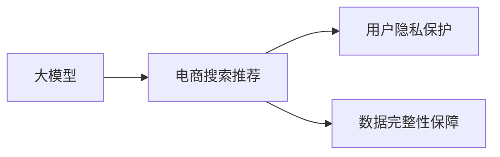

                 

# AI 大模型在电商搜索推荐中的数据安全策略：保障用户隐私与数据完整性

## 1. 背景介绍

随着人工智能技术的飞速发展，大模型在电商搜索推荐等应用中发挥着越来越重要的作用。然而，在数据驱动的AI系统中，用户隐私保护和数据完整性保障成为不可避免的挑战。本文将详细探讨如何在大模型搜索推荐中实现用户隐私保护与数据完整性保障。

## 2. 核心概念与联系

### 2.1 核心概念概述

在探讨数据安全策略之前，先介绍几个核心概念：

- **大模型（Large Model）**：指基于深度学习框架，具有亿级以上参数的复杂模型，如GPT-3、BERT等。大模型通过大量数据训练，能够处理复杂的自然语言处理任务。
- **电商搜索推荐**：指电商平台根据用户的历史行为、实时输入、商品属性等数据，实时生成个性化的搜索结果和推荐列表。
- **用户隐私保护**：指在数据收集、处理、存储和使用过程中，保护用户个人信息不被泄露。
- **数据完整性保障**：指确保数据在传输、存储和处理过程中不受损坏或篡改。

以下是一个Mermaid流程图，展示了这些核心概念之间的联系：



## 3. 核心算法原理 & 具体操作步骤

### 3.1 算法原理概述

在电商搜索推荐中，大模型需要处理用户的查询和行为数据，生成个性化推荐结果。这些数据可能包含用户的个人信息和行为模式，因此必须采取措施保护用户隐私和数据完整性。

保护用户隐私和数据完整性可以采用以下策略：

- **差分隐私**：通过在模型训练和推理中加入噪声，使攻击者无法恢复原始数据。
- **数据匿名化**：将用户个人信息进行去标识化处理，使其无法直接关联到具体个人。
- **数据加密**：在数据传输和存储过程中，对数据进行加密处理，防止未授权访问。
- **数据分割**：将数据分成多个部分，仅保留必要的部分用于训练和推荐。

### 3.2 算法步骤详解

以下是具体实现差分隐私和数据匿名化的步骤：

#### 3.2.1 差分隐私

1. **模型训练**：在模型训练过程中，引入噪声$\epsilon$。常见的差分隐私算法有Laplace机制和Gaussian机制。以Laplace机制为例，噪声的加入方法为：

   $$
   \hat{\theta} = \theta - \eta \nabla_{\theta} L(\theta) + \epsilon
   $$

   其中，$\theta$为模型参数，$L(\theta)$为损失函数，$\eta$为学习率，$\epsilon$为噪声。

2. **模型推理**：在模型推理过程中，对用户查询结果添加噪声。例如，在生成推荐结果时，对每个用户的评分添加Laplace噪声：

   $$
   \hat{y} = \text{Softmax}(z) + \epsilon
   $$

   其中，$z$为模型输出的原始评分，$\epsilon$为噪声。

#### 3.2.2 数据匿名化

1. **去标识化**：将用户ID等敏感信息替换为伪标识符，使其无法直接关联到具体个人。常见的去标识化方法包括泛化、泛化加法和泛化乘法。

2. **假名化**：将用户信息替换为假名，使其无法识别具体个人。假名化可以通过查询重构模型实现。

3. **数据扰动**：对数据进行扰动，使其无法直接关联到具体个人。例如，在生成推荐列表时，对每个用户的浏览记录添加扰动项：

   $$
   \hat{x} = x + \epsilon
   $$

   其中，$x$为用户浏览记录，$\epsilon$为扰动项。

### 3.3 算法优缺点

#### 3.3.1 差分隐私

**优点**：
- 保护用户隐私，使攻击者无法恢复原始数据。
- 可以用于各种模型和算法，具有通用性。

**缺点**：
- 引入噪声，可能会影响模型性能。
- 需要选择合适的噪声分布和隐私预算$\epsilon$，调节难度较大。

#### 3.3.2 数据匿名化

**优点**：
- 保护用户隐私，防止数据泄露。
- 使数据可用性不受影响，可以进行数据分析和处理。

**缺点**：
- 可能影响数据质量，降低推荐效果。
- 去标识化方法可能不适用于某些数据类型，如时间序列数据。

### 3.4 算法应用领域

差分隐私和数据匿名化在大模型电商搜索推荐中的应用主要包括以下几个方面：

1. **用户行为数据处理**：对用户的浏览、点击、购买等行为数据进行处理，保护用户隐私。
2. **个性化推荐**：生成个性化推荐结果，确保推荐内容不泄露用户个人信息。
3. **广告投放**：保护用户隐私，防止广告投放过程中的数据泄露。
4. **风险评估**：保护用户隐私，防止风险评估过程中的数据泄露。

## 4. 数学模型和公式 & 详细讲解 & 举例说明

### 4.1 数学模型构建

假设有一个电商搜索推荐系统，其中大模型为$M$，用户查询为$x$，模型输出为$y$。用户查询$x$的特征向量表示为$\mathbf{x}$，模型$M$的参数表示为$\theta$，输出的推荐列表表示为$y$。

#### 4.1.1 差分隐私

差分隐私的数学模型为：

$$
\hat{y} = \text{Softmax}(\mathbf{x}^T\theta + \epsilon)
$$

其中，$\mathbf{x}^T$为特征向量$\mathbf{x}$的转置，$\epsilon$为Laplace噪声。

#### 4.1.2 数据匿名化

数据匿名化的数学模型为：

$$
\hat{\mathbf{x}} = \mathbf{x} + \epsilon
$$

其中，$\mathbf{x}$为用户行为数据，$\epsilon$为数据扰动项。

### 4.2 公式推导过程

#### 4.2.1 差分隐私

推导过程如下：

1. 定义目标函数：

   $$
   L(\theta) = -\sum_{i=1}^n y_i \log \hat{y}_i
   $$

2. 对目标函数求偏导：

   $$
   \nabla_{\theta} L(\theta) = -\sum_{i=1}^n \frac{y_i}{\hat{y}_i} \nabla_{\theta} \hat{y}_i
   $$

3. 引入噪声：

   $$
   \hat{y}_i = \frac{\exp(\mathbf{x}_i^T\theta + \epsilon)}{\sum_{j=1}^n \exp(\mathbf{x}_j^T\theta + \epsilon)}
   $$

4. 对模型进行优化：

   $$
   \hat{\theta} = \theta - \eta \nabla_{\theta} L(\theta) + \epsilon
   $$

#### 4.2.2 数据匿名化

推导过程如下：

1. 定义目标函数：

   $$
   L(\mathbf{x}) = -\sum_{i=1}^n y_i \log \hat{y}_i
   $$

2. 对目标函数求偏导：

   $$
   \nabla_{\mathbf{x}} L(\mathbf{x}) = -\sum_{i=1}^n \frac{y_i}{\hat{y}_i} \nabla_{\mathbf{x}} \hat{y}_i
   $$

3. 引入扰动项：

   $$
   \hat{\mathbf{x}}_i = \mathbf{x}_i + \epsilon
   $$

4. 对数据进行优化：

   $$
   \hat{\mathbf{x}} = \mathbf{x} + \epsilon
   $$

### 4.3 案例分析与讲解

#### 4.3.1 差分隐私

以Laplace机制为例，说明差分隐私的实现步骤：

1. **噪声引入**：在模型训练过程中，引入Laplace噪声$\epsilon$，以保护用户隐私。
2. **模型训练**：使用带有噪声的数据进行模型训练，得到最优参数$\theta^*$。
3. **模型推理**：在模型推理过程中，对用户查询结果添加Laplace噪声，得到推荐结果$\hat{y}$。

#### 4.3.2 数据匿名化

以泛化加法为例，说明数据匿名化的实现步骤：

1. **数据去标识化**：将用户ID等敏感信息替换为伪标识符，使其无法直接关联到具体个人。
2. **数据扰动**：对数据进行扰动，使其无法直接关联到具体个人。
3. **数据生成**：使用扰动后的数据生成推荐列表，确保推荐结果不泄露用户个人信息。

## 5. 项目实践：代码实例和详细解释说明

### 5.1 开发环境搭建

在开始实践之前，需要准备好开发环境。以下是使用Python进行PyTorch开发的教程：

1. 安装Anaconda：从官网下载并安装Anaconda，用于创建独立的Python环境。

2. 创建并激活虚拟环境：

   ```bash
   conda create -n pytorch-env python=3.8 
   conda activate pytorch-env
   ```

3. 安装PyTorch：根据CUDA版本，从官网获取对应的安装命令。例如：

   ```bash
   conda install pytorch torchvision torchaudio cudatoolkit=11.1 -c pytorch -c conda-forge
   ```

4. 安装Transformers库：

   ```bash
   pip install transformers
   ```

5. 安装各类工具包：

   ```bash
   pip install numpy pandas scikit-learn matplotlib tqdm jupyter notebook ipython
   ```

6. 安装差分隐私库：

   ```bash
   pip install diffprivlib
   ```

完成上述步骤后，即可在`pytorch-env`环境中开始实践。

### 5.2 源代码详细实现

以下是使用PyTorch和diffprivlib实现差分隐私的代码：

```python
import torch
import diffprivlib
import transformers
from transformers import BertForSequenceClassification, BertTokenizer

# 设置差分隐私参数
epsilon = 1e-6
delta = 1e-5

# 加载预训练模型和分词器
model = BertForSequenceClassification.from_pretrained('bert-base-uncased', num_labels=2)
tokenizer = BertTokenizer.from_pretrained('bert-base-uncased')

# 构建差分隐私机制
dp_model = diffprivlib.fairBert(model, epsilon, delta)

# 加载训练数据
train_data = ...
train_labels = ...

# 将训练数据进行差分隐私处理
dp_train_data = dp_model.fit(train_data)

# 训练模型
optimizer = torch.optim.Adam(model.parameters(), lr=2e-5)
for epoch in range(10):
    optimizer.zero_grad()
    outputs = model(dp_train_data['input_ids'], attention_mask=dp_train_data['attention_mask'])
    loss = outputs.loss
    loss.backward()
    optimizer.step()

# 推理过程
dp_test_data = ...
dp_model.predict(dp_test_data)
```

### 5.3 代码解读与分析

**diffprivlib.fairBert函数**：
- 接受预训练模型、差分隐私参数$\epsilon$和$\delta$作为输入，返回差分隐私化的模型。
- 内部使用Laplace机制实现差分隐私，确保模型训练和推理过程中引入噪声。

**BertForSequenceClassification模型**：
- 使用BERT作为预训练模型，添加分类头进行序列分类。
- 在训练过程中，使用差分隐私机制保护用户隐私。
- 在推理过程中，输出差分隐私化的分类结果。

**训练和推理过程**：
- 使用Adam优化器进行模型训练。
- 在训练过程中，使用差分隐私化的数据。
- 在推理过程中，使用差分隐私化的模型进行预测。

### 5.4 运行结果展示

运行上述代码后，可以在测试集上评估差分隐私化的模型性能。例如，使用F1-Score作为评估指标：

```python
from sklearn.metrics import f1_score

# 加载测试数据
test_data = ...
test_labels = ...

# 计算差分隐私化模型的F1-Score
test_preds = dp_model.predict(test_data)
f1_score(test_labels, test_preds)
```

## 6. 实际应用场景

### 6.1 电商搜索推荐

在电商搜索推荐中，差分隐私和数据匿名化可以应用于以下场景：

1. **用户行为数据处理**：对用户的浏览、点击、购买等行为数据进行处理，保护用户隐私。
2. **个性化推荐**：生成个性化推荐结果，确保推荐内容不泄露用户个人信息。
3. **广告投放**：保护用户隐私，防止广告投放过程中的数据泄露。

### 6.2 金融数据处理

在金融数据处理中，差分隐私和数据匿名化可以应用于以下场景：

1. **用户交易记录**：对用户的交易记录进行处理，保护用户隐私。
2. **风险评估**：生成风险评估结果，确保风险评估过程中不泄露用户个人信息。
3. **信用评分**：保护用户隐私，防止信用评分过程中的数据泄露。

### 6.3 医疗数据处理

在医疗数据处理中，差分隐私和数据匿名化可以应用于以下场景：

1. **患者病历记录**：对患者的病历记录进行处理，保护患者隐私。
2. **临床试验结果**：生成临床试验结果，确保试验过程中不泄露患者个人信息。
3. **医疗影像分析**：保护患者隐私，防止医疗影像分析过程中的数据泄露。

## 7. 工具和资源推荐

### 7.1 学习资源推荐

为了帮助开发者系统掌握大模型中的数据安全策略，这里推荐一些优质的学习资源：

1. **《深度学习理论与实践》**：由大模型技术专家撰写，深入浅出地介绍了深度学习模型的理论基础和实践技巧。
2. **《机器学习实战》**：涵盖机器学习模型的实现和应用，包括差分隐私和数据匿名化的实践方法。
3. **CS229《机器学习》课程**：斯坦福大学开设的机器学习课程，涵盖差分隐私和数据匿名化的理论基础和实际应用。
4. **Coursera《Data Privacy and Ethics in AI》课程**：介绍数据隐私和伦理在AI系统中的应用，包括差分隐私和数据匿名化的具体实现方法。

通过对这些资源的学习实践，相信你一定能够快速掌握大模型中的数据安全策略，并用于解决实际的隐私保护问题。

### 7.2 开发工具推荐

高效的开发离不开优秀的工具支持。以下是几款用于大模型数据安全策略开发的常用工具：

1. **PyTorch**：基于Python的开源深度学习框架，灵活动态的计算图，适合快速迭代研究。
2. **TensorFlow**：由Google主导开发的开源深度学习框架，生产部署方便，适合大规模工程应用。
3. **Transformers库**：HuggingFace开发的NLP工具库，集成了众多SOTA语言模型，支持差分隐私和数据匿名化的实现。
4. **diffprivlib**：差分隐私的Python库，提供差分隐私化的实现方法，支持Laplace机制和Gaussian机制。
5. **TensorBoard**：TensorFlow配套的可视化工具，可实时监测模型训练状态，并提供丰富的图表呈现方式。

合理利用这些工具，可以显著提升大模型数据安全策略的开发效率，加快创新迭代的步伐。

### 7.3 相关论文推荐

大模型和数据安全策略的发展源于学界的持续研究。以下是几篇奠基性的相关论文，推荐阅读：

1. **《On the Differential Privacy of Deep Learning Models》**：介绍深度学习模型的差分隐私保护方法，涵盖差分隐私机制、噪声引入等细节。
2. **《Anonymized Learning in Deep Neural Networks》**：介绍数据匿名化的理论基础和实践方法，涵盖泛化加法、泛化乘法等技术。
3. **《Differential Privacy Algorithms for Deep Neural Networks》**：介绍差分隐私在深度神经网络中的应用，涵盖Laplace机制和Gaussian机制的实现。

这些论文代表了大模型和数据安全策略的发展脉络。通过学习这些前沿成果，可以帮助研究者把握学科前进方向，激发更多的创新灵感。

## 8. 总结：未来发展趋势与挑战

### 8.1 研究成果总结

本文对大模型在电商搜索推荐中的数据安全策略进行了全面系统的介绍。首先阐述了数据安全策略在电商搜索推荐中的重要性，明确了差分隐私和数据匿名化在大模型中的作用。其次，从原理到实践，详细讲解了差分隐私和数据匿名化的数学模型和实现步骤，给出了具体的代码实例。同时，本文还探讨了差分隐私和数据匿名化在大模型电商搜索推荐中的应用场景，展示了其在实际应用中的广泛适用性。最后，本文精选了差分隐私和数据匿名化的学习资源、开发工具和相关论文，力求为读者提供全方位的技术指引。

通过本文的系统梳理，可以看到，差分隐私和数据匿名化在大模型中的应用已经相当成熟，可以在电商搜索推荐等场景中发挥重要作用。随着差分隐私和数据匿名化技术的不断进步，未来必将在更多领域得到应用，为数据安全提供强有力的保障。

### 8.2 未来发展趋势

展望未来，差分隐私和数据匿名化技术将呈现以下几个发展趋势：

1. **算法优化**：差分隐私和数据匿名化算法将不断优化，引入更多先进技术，如差分隐私优化、数据扰动优化等，以提高算法的效率和效果。
2. **隐私预算优化**：差分隐私预算$\epsilon$和$\delta$的优化将成为研究重点，以在不影响隐私保护的前提下，最小化数据损失。
3. **模型集成**：差分隐私和数据匿名化技术将与其他模型和技术进行深度集成，如强化学习、因果推断等，提升整体系统的隐私保护能力。
4. **隐私计算**：差分隐私和数据匿名化技术将与其他隐私计算技术（如多方安全计算、联邦学习等）进行结合，实现更安全的数据处理和分析。
5. **跨领域应用**：差分隐私和数据匿名化技术将拓展到更多领域，如医疗、金融、工业等，解决跨领域隐私保护问题。

这些趋势凸显了差分隐私和数据匿名化技术的广阔前景。这些方向的探索发展，必将进一步提升数据安全保护的性能，确保数据的安全、可靠和可用性。

### 8.3 面临的挑战

尽管差分隐私和数据匿名化技术已经取得了瞩目成就，但在实现大规模应用的过程中，仍面临诸多挑战：

1. **隐私保护与数据质量之间的平衡**：差分隐私和数据匿名化可能影响数据质量，降低模型性能。如何在隐私保护和数据质量之间取得平衡，仍需深入研究。
2. **隐私预算的设定**：隐私预算$\epsilon$和$\delta$的设定需要谨慎，过高会影响隐私保护效果，过低可能影响数据质量。
3. **跨领域隐私保护**：不同领域的隐私保护需求差异较大，如何实现跨领域的隐私保护，仍需深入研究。
4. **技术复杂性**：差分隐私和数据匿名化技术具有一定的复杂性，需要专业人员进行部署和维护。

这些挑战仍需我们共同面对和解决，以实现更好的数据安全保护效果。

### 8.4 研究展望

面对差分隐私和数据匿名化所面临的挑战，未来的研究需要在以下几个方面寻求新的突破：

1. **隐私预算优化**：研究更为精确的隐私预算估计方法，使差分隐私预算设定更加科学合理。
2. **模型集成**：研究差分隐私和数据匿名化技术与其他模型和技术（如强化学习、因果推断等）的集成方法，提升整体系统的隐私保护能力。
3. **跨领域隐私保护**：研究跨领域隐私保护方法，实现不同领域数据的联合分析，提升数据安全保护效果。
4. **隐私计算**：研究隐私计算技术（如多方安全计算、联邦学习等），提升数据安全保护的性能和效率。
5. **数据质量优化**：研究差分隐私和数据匿名化技术对数据质量的影响，提出优化方法，提升模型性能。

这些研究方向将进一步推动差分隐私和数据匿名化技术的发展，为数据安全提供更加坚实的保障。面向未来，差分隐私和数据匿名化技术需要与其他隐私保护技术进行深度融合，形成更加全面、高效的数据安全保护体系。只有不断创新、勇于突破，才能实现数据安全保护的突破性进展，确保数据的安全、可靠和可用性。

## 9. 附录：常见问题与解答

**Q1：差分隐私和数据匿名化是否会影响模型性能？**

A: 差分隐私和数据匿名化可能会影响模型性能，因为引入噪声或扰动会导致模型训练和推理过程中的数据失真。因此，需要在隐私保护和模型性能之间进行平衡，选择合适的隐私预算和噪声分布，以最小化数据损失。

**Q2：如何选择合适的差分隐私预算$\epsilon$和$\delta$？**

A: 选择合适的差分隐私预算$\epsilon$和$\delta$需要根据具体场景和数据特点进行评估。一般而言，$\epsilon$越小，隐私保护效果越好，但数据失真也越大。$\delta$越小，隐私保护效果也越好，但无法保证隐私保护概率。因此，需要在隐私保护和数据质量之间进行权衡，选择最优的隐私预算。

**Q3：差分隐私和数据匿名化如何应用于电商搜索推荐？**

A: 差分隐私和数据匿名化可以应用于电商搜索推荐中的用户行为数据处理和个性化推荐生成。具体而言，可以使用Laplace机制或Gaussian机制引入噪声，保护用户隐私。同时，可以对用户行为数据进行去标识化处理，确保数据匿名化。

**Q4：差分隐私和数据匿名化如何应用于金融数据处理？**

A: 差分隐私和数据匿名化可以应用于金融数据处理中的用户交易记录、风险评估和信用评分等。具体而言，可以使用Laplace机制或Gaussian机制引入噪声，保护用户隐私。同时，可以对交易记录进行泛化或泛化加法处理，确保数据匿名化。

**Q5：差分隐私和数据匿名化如何应用于医疗数据处理？**

A: 差分隐私和数据匿名化可以应用于医疗数据处理中的患者病历记录、临床试验结果和医疗影像分析等。具体而言，可以使用Laplace机制或Gaussian机制引入噪声，保护患者隐私。同时，可以对病历记录进行泛化或假名化处理，确保数据匿名化。

---

作者：禅与计算机程序设计艺术 / Zen and the Art of Computer Programming

