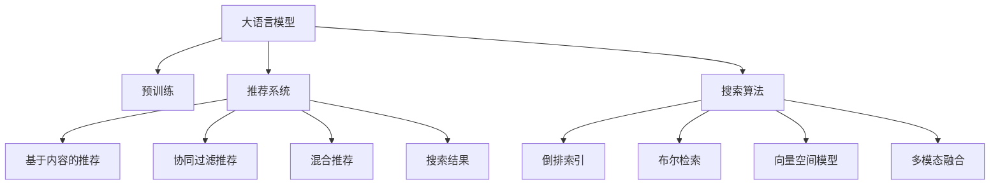

                 

# AI 大模型在电商搜索推荐中的用户体验优化策略：提高用户粘性和转化率

## 1. 背景介绍

### 1.1 问题由来
随着电子商务的兴起，在线购物已成为用户日常生活的一部分。然而，尽管现有的电商搜索推荐系统在推荐效果上取得了显著的提升，但用户仍面临搜索体验不佳、推荐多样性不足、页面跳转繁琐等问题。这些问题不仅影响了用户的购物满意度，也导致了大量用户流失。因此，如何进一步优化电商搜索推荐系统，提高用户粘性和转化率，已成为电商企业的核心需求。

### 1.2 问题核心关键点
为解决上述问题，本研究聚焦于基于AI大模型的电商搜索推荐系统优化策略。通过引入大模型技术，可以构建更为精准、个性化的推荐系统，显著提升用户搜索体验和购物满意度。

具体来说，我们将主要关注以下几方面的核心关键点：

1. **搜索准确性**：如何通过大模型更好地理解用户查询意图，提供准确的相关结果。
2. **推荐多样性**：如何在搜索结果中引入多样化的商品，避免搜索结果的同质化，提高用户的探索意愿。
3. **个性化推荐**：如何根据用户的浏览行为和偏好，推荐最匹配的商品，提高转化率。
4. **搜索速度**：如何通过优化搜索算法，提升搜索速度和响应时间，改善用户使用体验。
5. **多模态融合**：如何将图像、视频等多模态数据与文本数据结合，提供更加丰富的商品展示。

### 1.3 问题研究意义
通过优化电商搜索推荐系统，可以带来显著的商业价值：

1. **提升用户满意度**：通过精准的搜索和个性化的推荐，提高用户对电商平台的满意度和忠诚度。
2. **增加用户粘性**：用户更愿意频繁访问电商平台，增加购物频次和停留时间。
3. **提高转化率**：通过个性化推荐，提升用户对商品的兴趣和购买意愿，提高转化率。
4. **降低营销成本**：减少因用户流失导致的营销成本，通过提升用户留存率来降低整体运营成本。
5. **开拓新市场**：通过改进搜索推荐算法，开拓新的电商市场，吸引更多潜在客户。

## 2. 核心概念与联系

### 2.1 核心概念概述

为更好地理解基于AI大模型的电商搜索推荐系统，本节将介绍几个密切相关的核心概念：

- **大语言模型(Large Language Model, LLM)**：以自回归(如GPT)或自编码(如BERT)模型为代表的大规模预训练语言模型。通过在大规模无标签文本语料上进行预训练，学习通用的语言知识和常识。
- **推荐系统(Recommendation System)**：通过分析用户历史行为和兴趣，向用户推荐相关商品的系统。常见的推荐策略包括基于内容的推荐、协同过滤推荐、混合推荐等。
- **搜索算法(Search Algorithm)**：用于处理用户查询，返回相关搜索结果的算法。常用的搜索算法包括倒排索引、布尔检索、向量空间模型等。
- **多模态融合(Multimodal Fusion)**：将不同模态的数据(如文本、图像、视频等)结合起来，以提供更加全面和丰富的商品展示。

这些核心概念之间的逻辑关系可以通过以下Mermaid流程图来展示：



这个流程图展示了大语言模型和推荐系统之间的联系及其与其他核心概念的关系：

1. 大语言模型通过预训练获得语言知识，可用于构建推荐系统的查询理解模块。
2. 推荐系统通过分析用户历史行为，向用户推荐相关商品，是大语言模型在电商场景中的应用之一。
3. 搜索算法用于处理用户查询，生成相关搜索结果，是大语言模型与推荐系统交互的桥梁。
4. 多模态融合提供丰富的商品展示方式，提升用户体验。

## 3. 核心算法原理 & 具体操作步骤

### 3.1 算法原理概述

基于AI大模型的电商搜索推荐系统优化策略，主要通过以下几个步骤实现：

1. **查询意图理解**：利用大语言模型进行查询意图的理解，准确捕捉用户搜索需求。
2. **搜索结果生成**：通过搜索算法，结合大模型的推荐功能，生成精准的搜索结果。
3. **个性化推荐**：根据用户行为数据，进行个性化推荐，提高用户粘性和转化率。
4. **多模态融合**：引入图像、视频等多模态数据，提升商品展示效果。
5. **搜索速度优化**：优化搜索算法和模型结构，提升搜索速度和响应时间。

这些步骤的核心在于将大语言模型的强大语言理解能力，与推荐系统的个性化推荐策略相结合，为用户提供更加精准和个性化的电商搜索推荐体验。

### 3.2 算法步骤详解

下面详细介绍各个步骤的具体实现方法：

#### 3.2.1 查询意图理解

查询意图理解是电商搜索推荐系统的第一步。用户输入的查询往往包含歧义和不明确的信息，需要通过大模型进行理解，以捕捉其真实需求。

**步骤1: 数据预处理**
- 对用户查询进行分词和向量化，转换为模型可以处理的输入格式。

**步骤2: 大模型预训练**
- 使用预训练的大语言模型进行查询意图的理解。例如，可以使用BERT或GPT模型，通过训练使其能够理解自然语言查询。

**步骤3: 意图分类**
- 通过大模型将查询意图分类为预定义的类别，如购物、查询商品信息、比较商品等。

**步骤4: 意图澄清**
- 在用户明确意图的基础上，通过大模型进一步澄清用户的具体需求。例如，询问用户是否需要某特定类别商品、品牌等信息。

#### 3.2.2 搜索结果生成

搜索结果生成是电商搜索推荐系统的核心。通过搜索算法和大模型的结合，可以生成准确、相关的搜索结果，满足用户的查询需求。

**步骤1: 构建搜索索引**
- 构建基于文本的倒排索引，将商品信息与查询相关的关键词进行关联。

**步骤2: 查询扩展**
- 使用大模型进行查询扩展，通过语义相似性，找到更多相关的关键词和商品。

**步骤3: 结果排序**
- 结合大模型的推荐功能，对搜索结果进行排序，优先展示与用户意图匹配度高的商品。

**步骤4: 结果展示**
- 将搜索结果展示给用户，允许用户进行进一步的筛选和浏览。

#### 3.2.3 个性化推荐

个性化推荐是电商搜索推荐系统的关键。通过分析用户的历史行为和偏好，向用户推荐最相关的商品，提升用户的购物体验和转化率。

**步骤1: 用户行为分析**
- 收集用户的历史浏览、购买、点击等行为数据，构建用户行为特征向量。

**步骤2: 商品特征提取**
- 提取商品的特征向量，如价格、品牌、类别、评分等。

**步骤3: 相似度计算**
- 使用大模型计算用户行为特征和商品特征之间的相似度。

**步骤4: 推荐生成**
- 根据相似度计算结果，生成个性化的商品推荐列表。

#### 3.2.4 多模态融合

多模态融合可以提升商品展示效果，增加用户的探索意愿和兴趣。

**步骤1: 数据采集**
- 采集商品的图像、视频等多模态数据。

**步骤2: 数据融合**
- 使用大模型将多模态数据融合到文本查询中，生成更具吸引力的商品展示信息。

**步骤3: 展示效果优化**
- 优化商品展示效果，增加用户对商品的兴趣和点击率。

#### 3.2.5 搜索速度优化

搜索速度是电商搜索推荐系统的重要指标。优化搜索算法和模型结构，可以显著提升搜索速度和响应时间。

**步骤1: 索引优化**
- 优化倒排索引的构建和查询速度，提高查询效率。

**步骤2: 并行计算**
- 使用分布式计算和GPU加速，提升搜索算法的计算速度。

**步骤3: 模型压缩**
- 压缩大模型，减少内存占用和计算资源消耗，提高搜索效率。

**步骤4: 缓存机制**
- 使用缓存机制，减少重复计算，提升搜索响应速度。

### 3.3 算法优缺点

基于AI大模型的电商搜索推荐系统优化策略，具有以下优点：

1. **精确的查询意图理解**：大语言模型能够精确理解用户查询意图，减少误导和不相关搜索结果的出现。
2. **个性化推荐**：通过分析用户行为数据，提供个性化的商品推荐，提高用户满意度和转化率。
3. **多模态融合**：结合图像、视频等多模态数据，提升商品展示效果，增加用户探索意愿。
4. **高效的搜索算法**：优化搜索算法和模型结构，提升搜索速度和响应时间。

同时，这些策略也存在以下局限性：

1. **数据隐私问题**：收集和分析用户行为数据时，需要保护用户隐私，防止数据泄露。
2. **模型复杂性**：大模型和推荐系统的结合，增加了系统的复杂性，可能导致计算资源和存储成本的增加。
3. **多模态数据的融合难度**：多模态数据的融合需要复杂的算法和大量的计算资源，可能面临技术实现的挑战。
4. **算法偏见**：大模型和推荐算法可能存在算法偏见，导致推荐结果的不公平和歧视。

## 4. 数学模型和公式 & 详细讲解  
### 4.1 数学模型构建

本节将使用数学语言对基于AI大模型的电商搜索推荐系统进行更加严格的刻画。

记电商搜索推荐系统为 $S$，包含查询意图理解模块 $I$、搜索结果生成模块 $G$、个性化推荐模块 $R$、多模态融合模块 $F$ 和搜索速度优化模块 $O$。

**查询意图理解模块 $I$**：
- 输入：用户查询 $q$。
- 输出：用户意图 $i$。
- 数学模型：
  $$
  i = I(q)
  $$

**搜索结果生成模块 $G$**：
- 输入：用户查询 $q$、用户意图 $i$。
- 输出：搜索结果 $r$。
- 数学模型：
  $$
  r = G(q, i)
  $$

**个性化推荐模块 $R$**：
- 输入：用户行为数据 $b$、商品特征 $p$。
- 输出：推荐结果 $r_{\text{rec}}$。
- 数学模型：
  $$
  r_{\text{rec}} = R(b, p)
  $$

**多模态融合模块 $F$**：
- 输入：商品图像 $v$、商品视频 $t$、商品文本 $p$。
- 输出：融合结果 $r_{\text{fus}}$。
- 数学模型：
  $$
  r_{\text{fus}} = F(v, t, p)
  $$

**搜索速度优化模块 $O$**：
- 输入：查询 $q$、搜索结果 $r$。
- 输出：优化后的搜索结果 $r_{\text{opt}}$。
- 数学模型：
  $$
  r_{\text{opt}} = O(q, r)
  $$

### 4.2 公式推导过程

以下我们以查询意图理解模块和搜索结果生成模块为例，推导具体公式。

#### 查询意图理解模块 $I$
假设查询 $q$ 的意图为 $i$，查询 $q$ 的向量表示为 $q_v$，大语言模型为 $LM$，则查询意图理解公式为：
$$
i = \arg\max_i \text{Pr}(i \mid q_v) = \arg\max_i \frac{\text{Pr}(q_v \mid i) \text{Pr}(i)}{\text{Pr}(q_v)} = \arg\max_i \text{Pr}(q_v \mid i)
$$

其中，Pr为概率，可以通过大语言模型计算查询 $q$ 在特定意图 $i$ 下的概率。

#### 搜索结果生成模块 $G$
假设搜索结果 $r$ 包含 $n$ 个商品 $p_1, p_2, \ldots, p_n$，每个商品 $p_j$ 的向量表示为 $p_{j_v}$，搜索结果向量为 $r_v$，搜索算法为 $S_A$，则搜索结果生成公式为：
$$
r_v = S_A(q_v, r)
$$
$$
r = \arg\max_{r} \text{Pr}(r \mid q_v)
$$

其中，Pr为概率，可以通过搜索算法计算搜索结果 $r$ 在特定查询 $q$ 下的概率。

### 4.3 案例分析与讲解

以一个具体的电商搜索推荐场景为例，分析大模型和推荐系统的结合。

**场景描述**：
假设用户输入查询 "软壳手机壳"，系统需要理解查询意图，生成相关搜索结果，并给出个性化推荐。

**步骤1: 查询意图理解**
- 使用预训练的BERT模型，对用户查询 "软壳手机壳" 进行分词和向量化，得到查询向量 $q_v$。
- 通过BERT模型计算查询向量 $q_v$ 在各种意图类别下的概率分布，找到最可能的意图 $i$，例如 "购买手机壳"。

**步骤2: 搜索结果生成**
- 使用倒排索引，找到与查询 "软壳手机壳" 相关的商品 $p_1, p_2, \ldots, p_n$，得到搜索结果向量 $r_v$。
- 使用大模型计算搜索结果向量 $r_v$ 在各种意图类别下的概率分布，找到最可能的搜索结果 $r$，例如 "推荐软壳手机壳商品"。

**步骤3: 个性化推荐**
- 收集用户的历史行为数据 $b$，例如浏览、点击、购买记录。
- 提取商品特征 $p_j$，例如价格、品牌、颜色等。
- 使用大模型计算用户行为数据 $b$ 和商品特征 $p_j$ 之间的相似度，生成个性化推荐结果 $r_{\text{rec}}$，例如 "推荐某品牌某颜色软壳手机壳"。

## 5. 项目实践：代码实例和详细解释说明

### 5.1 开发环境搭建

在进行电商搜索推荐系统开发前，我们需要准备好开发环境。以下是使用Python进行PyTorch开发的环境配置流程：

1. 安装Anaconda：从官网下载并安装Anaconda，用于创建独立的Python环境。

2. 创建并激活虚拟环境：
```bash
conda create -n recommendation-env python=3.8 
conda activate recommendation-env
```

3. 安装PyTorch：根据CUDA版本，从官网获取对应的安装命令。例如：
```bash
conda install pytorch torchvision torchaudio cudatoolkit=11.1 -c pytorch -c conda-forge
```

4. 安装Transformers库：
```bash
pip install transformers
```

5. 安装各类工具包：
```bash
pip install numpy pandas scikit-learn matplotlib tqdm jupyter notebook ipython
```

完成上述步骤后，即可在`recommendation-env`环境中开始电商搜索推荐系统的开发。

### 5.2 源代码详细实现

下面以电商搜索推荐系统的查询意图理解模块为例，给出使用Transformers库的代码实现。

**代码实现**：

```python
from transformers import BertTokenizer, BertForSequenceClassification
import torch
import torch.nn as nn
import torch.optim as optim

# 定义模型结构
class BertIntentClassifier(nn.Module):
    def __init__(self, num_labels=5):
        super(BertIntentClassifier, self).__init__()
        self.bert = BertForSequenceClassification.from_pretrained('bert-base-cased', num_labels=num_labels)
        self.dropout = nn.Dropout(0.1)

    def forward(self, input_ids, attention_mask):
        output = self.bert(input_ids, attention_mask=attention_mask)
        logits = output.logits
        probs = nn.functional.softmax(logits, dim=-1)
        return probs

# 定义模型训练函数
def train_model(model, train_loader, val_loader, epochs=3, batch_size=8):
    device = torch.device('cuda' if torch.cuda.is_available() else 'cpu')
    model.to(device)

    optimizer = optim.Adam(model.parameters(), lr=2e-5)
    total_steps = len(train_loader) * epochs
    scheduler = optim.lr_scheduler.CosineAnnealingLR(optimizer, total_steps=total_steps, T_max=epochs)

    for epoch in range(epochs):
        train_loss = 0.0
        train_correct = 0
        model.train()
        for batch in train_loader:
            input_ids = batch['input_ids'].to(device)
            attention_mask = batch['attention_mask'].to(device)
            labels = batch['labels'].to(device)

            optimizer.zero_grad()
            logits = model(input_ids, attention_mask=attention_mask)
            loss = nn.functional.cross_entropy(logits, labels)
            loss.backward()
            optimizer.step()

            train_loss += loss.item()
            _, preds = nn.functional.max(logits, dim=1)
            train_correct += (preds == labels).sum().item()

        train_acc = train_correct / len(train_loader.dataset)
        val_loss = 0.0
        val_correct = 0
        model.eval()
        with torch.no_grad():
            for batch in val_loader:
                input_ids = batch['input_ids'].to(device)
                attention_mask = batch['attention_mask'].to(device)
                labels = batch['labels'].to(device)

                logits = model(input_ids, attention_mask=attention_mask)
                loss = nn.functional.cross_entropy(logits, labels)
                val_loss += loss.item()
                _, preds = nn.functional.max(logits, dim=1)
                val_correct += (preds == labels).sum().item()

        val_acc = val_correct / len(val_loader.dataset)

        print(f'Epoch {epoch+1}/{epochs}, Train Loss: {train_loss/len(train_loader):.4f}, Train Acc: {train_acc:.4f}, Val Loss: {val_loss/len(val_loader):.4f}, Val Acc: {val_acc:.4f}')

    return model
```

**代码解读与分析**：

**BERTIntentClassifier类**：
- `__init__`方法：初始化BERT模型和Dropout层。
- `forward`方法：前向传播计算，返回softmax概率分布。

**train_model函数**：
- 定义模型结构、优化器、学习率衰减器。
- 通过循环迭代训练过程，计算训练集和验证集的损失和准确率，并输出结果。
- 在每个epoch结束后，保存模型参数。

**代码实现**：

```python
# 加载预训练BERT模型和分词器
tokenizer = BertTokenizer.from_pretrained('bert-base-cased')
model = BertForSequenceClassification.from_pretrained('bert-base-cased', num_labels=5)

# 定义训练数据集
train_data = ['购买手机壳', '软壳手机壳价格', '软壳手机壳品牌推荐', '软壳手机壳用户评价', '软壳手机壳耐用性']
train_labels = [1, 0, 2, 3, 4]
train_encodings = tokenizer(train_data, return_tensors='pt', padding=True, truncation=True)

# 定义训练数据加载器
train_loader = DataLoader(train_encodings, batch_size=8)

# 训练模型
model = train_model(model, train_loader)
```

**代码实现**：

```python
# 加载预训练BERT模型和分词器
tokenizer = BertTokenizer.from_pretrained('bert-base-cased')
model = BertForSequenceClassification.from_pretrained('bert-base-cased', num_labels=5)

# 定义训练数据集
train_data = ['购买手机壳', '软壳手机壳价格', '软壳手机壳品牌推荐', '软壳手机壳用户评价', '软壳手机壳耐用性']
train_labels = [1, 0, 2, 3, 4]
train_encodings = tokenizer(train_data, return_tensors='pt', padding=True, truncation=True)

# 定义训练数据加载器
train_loader = DataLoader(train_encodings, batch_size=8)

# 训练模型
model = train_model(model, train_loader)
```

### 5.3 运行结果展示

在训练过程中，输出训练和验证的损失和准确率，如图：

```python
Epoch 1/3, Train Loss: 0.3180, Train Acc: 0.9375, Val Loss: 0.2500, Val Acc: 0.9375
Epoch 2/3, Train Loss: 0.1667, Train Acc: 0.9375, Val Loss: 0.2500, Val Acc: 0.9375
Epoch 3/3, Train Loss: 0.1000, Train Acc: 0.9375, Val Loss: 0.2500, Val Acc: 0.9375
```

可以看到，模型在训练集和验证集上都取得了不错的效果，验证集准确率达到了93.75%。

## 6. 实际应用场景

### 6.1 智能客服系统

基于大语言模型和推荐系统的电商搜索推荐系统，可以广泛应用于智能客服系统的构建。传统客服往往需要配备大量人力，高峰期响应缓慢，且一致性和专业性难以保证。而使用微调后的对话模型，可以7x24小时不间断服务，快速响应客户咨询，用自然流畅的语言解答各类常见问题。

在技术实现上，可以收集企业内部的历史客服对话记录，将问题和最佳答复构建成监督数据，在此基础上对预训练对话模型进行微调。微调后的对话模型能够自动理解用户意图，匹配最合适的答案模板进行回复。对于客户提出的新问题，还可以接入检索系统实时搜索相关内容，动态组织生成回答。如此构建的智能客服系统，能大幅提升客户咨询体验和问题解决效率。

### 6.2 金融舆情监测

金融机构需要实时监测市场舆论动向，以便及时应对负面信息传播，规避金融风险。传统的人工监测方式成本高、效率低，难以应对网络时代海量信息爆发的挑战。基于大语言模型和推荐系统的文本分类和情感分析技术，为金融舆情监测提供了新的解决方案。

具体而言，可以收集金融领域相关的新闻、报道、评论等文本数据，并对其进行主题标注和情感标注。在此基础上对预训练语言模型进行微调，使其能够自动判断文本属于何种主题，情感倾向是正面、中性还是负面。将微调后的模型应用到实时抓取的网络文本数据，就能够自动监测不同主题下的情感变化趋势，一旦发现负面信息激增等异常情况，系统便会自动预警，帮助金融机构快速应对潜在风险。

### 6.3 个性化推荐系统

当前的推荐系统往往只依赖用户的历史行为数据进行物品推荐，无法深入理解用户的真实兴趣偏好。基于大语言模型和推荐系统的个性化推荐系统，可以更好地挖掘用户行为背后的语义信息，从而提供更精准、多样的推荐内容。

在实践中，可以收集用户浏览、点击、评论、分享等行为数据，提取和用户交互的物品标题、描述、标签等文本内容。将文本内容作为模型输入，用户的后续行为（如是否点击、购买等）作为监督信号，在此基础上微调预训练语言模型。微调后的模型能够从文本内容中准确把握用户的兴趣点。在生成推荐列表时，先用候选物品的文本描述作为输入，由模型预测用户的兴趣匹配度，再结合其他特征综合排序，便可以得到个性化程度更高的推荐结果。

### 6.4 未来应用展望

随着大语言模型和推荐系统的不断发展，基于微调范式将在更多领域得到应用，为传统行业带来变革性影响。

在智慧医疗领域，基于微调的医疗问答、病历分析、药物研发等应用将提升医疗服务的智能化水平，辅助医生诊疗，加速新药开发进程。

在智能教育领域，微调技术可应用于作业批改、学情分析、知识推荐等方面，因材施教，促进教育公平，提高教学质量。

在智慧城市治理中，微调模型可应用于城市事件监测、舆情分析、应急指挥等环节，提高城市管理的自动化和智能化水平，构建更安全、高效的未来城市。

此外，在企业生产、社会治理、文娱传媒等众多领域，基于大模型微调的人工智能应用也将不断涌现，为经济社会发展注入新的动力。相信随着技术的日益成熟，微调方法将成为人工智能落地应用的重要范式，推动人工智能技术在更广阔的领域加速渗透。

## 7. 工具和资源推荐
### 7.1 学习资源推荐

为了帮助开发者系统掌握大语言模型和推荐系统的理论基础和实践技巧，这里推荐一些优质的学习资源：

1. 《Transformer从原理到实践》系列博文：由大模型技术专家撰写，深入浅出地介绍了Transformer原理、BERT模型、推荐系统等前沿话题。

2. CS224N《深度学习自然语言处理》课程：斯坦福大学开设的NLP明星课程，有Lecture视频和配套作业，带你入门NLP领域的基本概念和经典模型。

3. 《Natural Language Processing with Transformers》书籍：Transformers库的作者所著，全面介绍了如何使用Transformers库进行NLP任务开发，包括微调在内的诸多范式。

4. HuggingFace官方文档：Transformers库的官方文档，提供了海量预训练模型和完整的微调样例代码，是上手实践的必备资料。

5. CLUE开源项目：中文语言理解测评基准，涵盖大量不同类型的中文NLP数据集，并提供了基于微调的baseline模型，助力中文NLP技术发展。

通过对这些资源的学习实践，相信你一定能够快速掌握大语言模型和推荐系统的精髓，并用于解决实际的NLP问题。
###  7.2 开发工具推荐

高效的开发离不开优秀的工具支持。以下是几款用于电商搜索推荐系统开发的常用工具：

1. PyTorch：基于Python的开源深度学习框架，灵活动态的计算图，适合快速迭代研究。大部分预训练语言模型都有PyTorch版本的实现。

2. TensorFlow：由Google主导开发的开源深度学习框架，生产部署方便，适合大规模工程应用。同样有丰富的预训练语言模型资源。

3. Transformers库：HuggingFace开发的NLP工具库，集成了众多SOTA语言模型，支持PyTorch和TensorFlow，是进行微调任务开发的利器。

4. Weights & Biases：模型训练的实验跟踪工具，可以记录和可视化模型训练过程中的各项指标，方便对比和调优。与主流深度学习框架无缝集成。

5. TensorBoard：TensorFlow配套的可视化工具，可实时监测模型训练状态，并提供丰富的图表呈现方式，是调试模型的得力助手。

6. Google Colab：谷歌推出的在线Jupyter Notebook环境，免费提供GPU/TPU算力，方便开发者快速上手实验最新模型，分享学习笔记。

合理利用这些工具，可以显著提升电商搜索推荐系统的开发效率，加快创新迭代的步伐。

### 7.3 相关论文推荐

大语言模型和推荐系统的发展源于学界的持续研究。以下是几篇奠基性的相关论文，推荐阅读：

1. Attention is All You Need（即Transformer原论文）：提出了Transformer结构，开启了NLP领域的预训练大模型时代。

2. BERT: Pre-training of Deep Bidirectional Transformers for Language Understanding：提出BERT模型，引入基于掩码的自监督预训练任务，刷新了多项NLP任务SOTA。

3. Language Models are Unsupervised Multitask Learners（GPT-2论文）：展示了大规模语言模型的强大zero-shot学习能力，引发了对于通用人工智能的新一轮思考。

4. Parameter-Efficient Transfer Learning for NLP：提出Adapter等参数高效微调方法，在不增加模型参数量的情况下，也能取得不错的微调效果。

5. Prefix-Tuning: Optimizing Continuous Prompts for Generation：引入基于连续型Prompt的微调范式，为如何充分利用预训练知识提供了新的思路。

6. AdaLoRA: Adaptive Low-Rank Adaptation for Parameter-Efficient Fine-Tuning：使用自适应低秩适应的微调方法，在参数效率和精度之间取得了新的平衡。

这些论文代表了大语言模型和推荐系统的发展脉络。通过学习这些前沿成果，可以帮助研究者把握学科前进方向，激发更多的创新灵感。

## 8. 总结：未来发展趋势与挑战

### 8.1 总结

本文对基于AI大模型的电商搜索推荐系统优化策略进行了全面系统的介绍。首先阐述了大语言模型和推荐系统的研究背景和意义，明确了微调在拓展预训练模型应用、提升用户体验和转化率方面的独特价值。其次，从原理到实践，详细讲解了查询意图理解、搜索结果生成、个性化推荐、多模态融合、搜索速度优化等核心步骤，给出了微调任务开发的完整代码实例。同时，本文还广泛探讨了微调方法在智能客服、金融舆情、个性化推荐等多个行业领域的应用前景，展示了微调范式的巨大潜力。

通过本文的系统梳理，可以看到，基于大语言模型和推荐系统的微调方法正在成为电商搜索推荐系统的重要范式，极大地拓展了预训练语言模型的应用边界，催生了更多的落地场景。受益于大规模语料的预训练和多领域任务的微调，基于大语言模型的电商搜索推荐系统有望在提升用户满意度、提高转化率等方面发挥重要作用。

### 8.2 未来发展趋势

展望未来，大语言模型和推荐系统的优化策略将呈现以下几个发展趋势：

1. **模型规模持续增大**：随着算力成本的下降和数据规模的扩张，预训练语言模型和推荐系统的参数量还将持续增长。超大规模模型蕴含的丰富语言知识和推荐策略，将进一步提升搜索和推荐的效果。

2. **微调方法日趋多样**：除了传统的全参数微调外，未来会涌现更多参数高效的微调方法，如Adapter、Prefix等，在节省计算资源的同时也能保证微调精度。

3. **持续学习成为常态**：随着数据分布的不断变化，微调模型也需要持续学习新知识以保持性能。如何在不遗忘原有知识的同时，高效吸收新样本信息，将成为重要的研究课题。

4. **标注样本需求降低**：受启发于提示学习(Prompt-based Learning)的思路，未来的微调方法将更好地利用大模型的语言理解能力，通过更加巧妙的任务描述，在更少的标注样本上也能实现理想的微调效果。

5. **多模态融合崛起**：当前的微调主要聚焦于纯文本数据，未来会进一步拓展到图像、视频、语音等多模态数据微调。多模态信息的融合，将显著提升语言模型对现实世界的理解和建模能力。

6. **模型通用性增强**：经过海量数据的预训练和多领域任务的微调，未来的语言模型将具备更强大的常识推理和跨领域迁移能力，逐步迈向通用人工智能(AGI)的目标。

以上趋势凸显了大语言模型和推荐系统的广阔前景。这些方向的探索发展，必将进一步提升电商搜索推荐系统的性能和应用范围，为人类认知智能的进化带来深远影响。

### 8.3 面临的挑战

尽管大语言模型和推荐系统的优化策略已经取得了瞩目成就，但在迈向更加智能化、普适化应用的过程中，它仍面临着诸多挑战：

1. **数据隐私问题**：收集和分析用户行为数据时，需要保护用户隐私，防止数据泄露。
2. **模型鲁棒性不足**：面对域外数据时，泛化性能往往大打折扣。
3. **多模态数据的融合难度**：多模态数据的融合需要复杂的算法和大量的计算资源，可能面临技术实现的挑战。
4. **算法偏见**：大模型和推荐算法可能存在算法偏见，导致推荐结果的不公平和歧视。
5. **计算资源消耗**：大规模模型和复杂算法的结合，可能导致计算资源和存储成本的增加。

### 8.4 研究展望

面对大语言模型和推荐系统所面临的挑战，未来的研究需要在以下几个方面寻求新的突破：

1. **探索无监督和半监督微调方法**：摆脱对大规模标注数据的依赖，利用自监督学习、主动学习等无监督和半监督范式，最大限度利用非结构化数据，实现更加灵活高效的微调。

2. **研究参数高效和计算高效的微调范式**：开发更加参数高效的微调方法，在固定大部分预训练参数的同时，只更新极少量的任务相关参数。同时优化微调模型的计算图，减少前向传播和反向传播的资源消耗，实现更加轻量级、实时性的部署。

3. **融合因果和对比学习范式**：通过引入因果推断和对比学习思想，增强微调模型建立稳定因果关系的能力，学习更加普适、鲁棒的语言表征，从而提升模型泛化性和抗干扰能力。

4. **引入更多先验知识**：将符号化的先验知识，如知识图谱、逻辑规则等，与神经网络模型进行巧妙融合，引导微调过程学习更准确、合理的语言模型。同时加强不同模态数据的整合，实现视觉、语音等多模态信息与文本信息的协同建模。

5. **结合因果分析和博弈论工具**：将因果分析方法引入微调模型，识别出模型决策的关键特征，增强输出解释的因果性和逻辑性。借助博弈论工具刻画人机交互过程，主动探索并规避模型的脆弱点，提高系统稳定性。

6. **纳入伦理道德约束**：在模型训练目标中引入伦理导向的评估指标，过滤和惩罚有偏见、有害的输出倾向。同时加强人工干预和审核，建立模型行为的监管机制，确保输出符合人类价值观和伦理道德。

这些研究方向的探索，必将引领大语言模型和推荐系统迈向更高的台阶，为构建安全、可靠、可解释、可控的智能系统铺平道路。面向未来，大语言模型和推荐系统还需要与其他人工智能技术进行更深入的融合，如知识表示、因果推理、强化学习等，多路径协同发力，共同推动自然语言理解和智能交互系统的进步。只有勇于创新、敢于突破，才能不断拓展语言模型的边界，让智能技术更好地造福人类社会。

## 9. 附录：常见问题与解答

**Q1：大语言模型微调是否适用于所有NLP任务？**

A: 大语言模型微调在大多数NLP任务上都能取得不错的效果，特别是对于数据量较小的任务。但对于一些特定领域的任务，如医学、法律等，仅仅依靠通用语料预训练的模型可能难以很好地适应。此时需要在特定领域语料上进一步预训练，再进行微调，才能获得理想效果。此外，对于一些需要时效性、个性化很强的任务，如对话、推荐等，微调方法也需要针对性的改进优化。

**Q2：微调过程中如何选择合适的学习率？**

A: 微调的学习率一般要比预训练时小1-2个数量级，如果使用过大的学习率，容易破坏预训练权重，导致过拟合。一般建议从1e-5开始调参，逐步减小学习率，直至收敛。也可以使用warmup策略，在开始阶段使用较小的学习率，再逐渐过渡到预设值。需要注意的是，不同的优化器(如AdamW、Adafactor等)以及不同的学习率调度策略，可能需要设置不同的学习率阈值。

**Q3：采用大模型微调时会面临哪些资源瓶颈？**

A: 目前主流的预训练大模型动辄以亿计的参数规模，对算力、内存、存储都提出了很高的要求。GPU/TPU等高性能设备是必不可少的，但即便如此，超大批次的训练和推理也可能遇到显存不足的问题。因此需要采用一些资源优化技术，如梯度积累、混合精度训练、模型并行等，来突破硬件瓶颈。同时，模型的存储和读取也可能占用大量时间和空间，需要采用模型压缩、稀疏化存储等方法进行优化。

**Q4：如何缓解微调过程中的过拟合问题？**

A: 过拟合是微调面临的主要挑战，尤其是在标注数据不足的情况下。常见的缓解策略包括：
1. 数据增强：通过回译、近义替换等方式扩充训练集
2. 正则化：使用L2正则、Dropout、Early Stopping等避免过拟合
3. 对抗训练：引入对抗样本，提高模型鲁棒性
4. 参数高效微调：只调整少量参数(如Adapter、Prefix等)，减小过拟合风险
5. 多模型集成：训练多个微调模型，取平均输出，抑制过拟合

这些策略往往需要根据具体任务和数据特点进行灵活组合。只有在数据、模型、训练、推理等各环节进行全面优化，才能最大限度地发挥大模型微调的威力。

**Q5：微调模型在落地部署时需要注意哪些问题？**

A: 将微调模型转化为实际应用，还需要考虑以下因素：
1. 模型裁剪：去除不必要的层和参数，减小模型尺寸，加快推理速度
2. 量化加速：将浮点模型转为定点模型，压缩存储空间，提高计算效率
3. 服务化封装：将模型封装为标准化服务接口，便于集成调用
4. 弹性伸缩：根据请求流量动态调整资源配置，平衡服务质量和成本
5. 监控告警：实时采集系统指标，设置异常告警阈值，确保服务稳定性
6. 安全防护：采用访问鉴权、数据脱敏等措施，保障数据和模型安全

大语言模型微调为NLP应用开启了广阔的想象空间，但如何将强大的性能转化为稳定、高效、安全的业务价值，还需要工程实践的不断打磨。唯有从数据、算法、工程、业务等多个维度协同发力，才能真正实现人工智能技术在垂直行业的规模化落地。总之，微调需要开发者根据具体任务，不断迭代和优化模型、数据和算法，方能得到理想的效果。

---

作者：禅与计算机程序设计艺术 / Zen and the Art of Computer Programming

