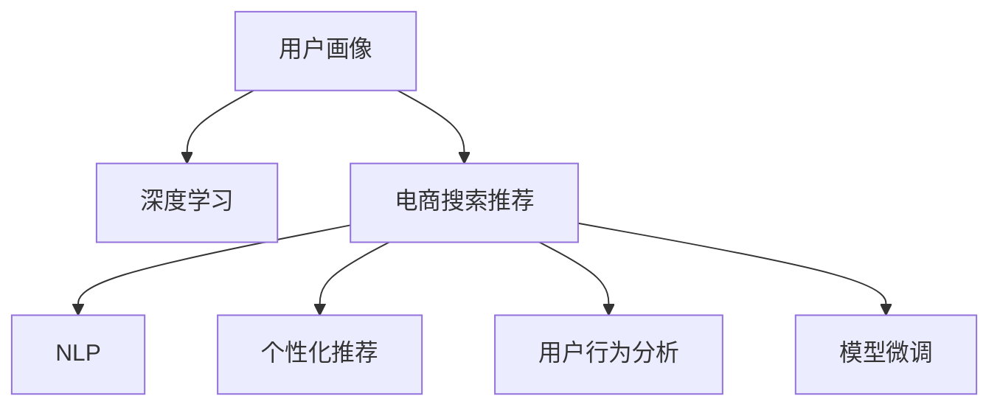

                 

# AI 大模型在电商搜索推荐中的用户画像应用：深度挖掘用户行为偏好

> 关键词：
- 用户画像(User Profiling)
- 深度学习(Deep Learning)
- 电商搜索推荐(E-Commerce Search & Recommendation)
- 自然语言处理(NLP)
- 个性化推荐(Personalized Recommendation)
- 用户行为分析(User Behavior Analysis)
- 模型微调(Fine-Tuning)

## 1. 背景介绍

### 1.1 问题由来
在当今数字化时代，电商平台已成为人们日常购物的重要渠道。用户通过搜索和浏览产品，形成丰富多样的行为数据。如何通过这些数据洞察用户需求，提升电商平台的搜索推荐体验，是电商行业一直追求的目标。

传统的推荐系统主要基于静态用户画像和简单的历史行为分析，难以捕捉用户真实偏好和行为模式。近年来，深度学习和大模型的兴起为电商搜索推荐带来了新的机遇，尤其是用户画像技术的应用，大幅提升了推荐效果。

本文将系统介绍AI大模型在电商搜索推荐中的应用，重点探讨用户画像的构建和深度挖掘技术，帮助读者了解用户行为偏好的高效分析方法，并应用到实际的电商推荐系统中。

### 1.2 问题核心关键点
本节将深入解析用户画像构建和深度学习技术在电商搜索推荐中的应用，明确其核心关键点：

1. 用户画像：通过分析用户历史行为和偏好，构建详细的用户画像，包括用户的兴趣、购买历史、搜索习惯等，为推荐算法提供数据支撑。

2. 深度学习：利用深度学习模型，如Transformer、BERT等，自动从用户数据中学习用户的深层次行为特征和偏好，提供更精准的个性化推荐。

3. 电商搜索推荐：结合用户画像和深度学习技术，提升电商平台的搜索推荐效果，增强用户体验，提升转化率和满意度。

4. 用户行为分析：通过对用户搜索、浏览、购买等行为的深入分析，识别用户行为模式和偏好变化，指导推荐策略的调整。

5. 模型微调：通过微调现有预训练模型，使其适应电商搜索推荐场景，提高推荐效果。

### 1.3 问题研究意义
利用AI大模型和深度学习技术，构建用户画像并深度挖掘用户行为偏好，对于电商平台的搜索推荐具有重要意义：

1. 提升个性化推荐精准度：深度学习模型能够从海量用户数据中自动学习用户行为特征，提供更精准的个性化推荐，满足用户多样化需求。

2. 增强用户体验：基于用户画像的推荐能够更好地满足用户偏好，提升浏览和购买的愉悦体验。

3. 优化搜索效果：通过深度学习模型，对用户查询进行语义理解，提高搜索结果的相关性，提升搜索体验。

4. 增加转化率和满意度：精准的个性化推荐能够增加用户购买意愿，提高电商平台的转化率和用户满意度。

5. 促进电商行业发展：深度学习技术的应用，能够提升电商平台的竞争力，推动整个行业的发展和创新。

## 2. 核心概念与联系

### 2.1 核心概念概述

为更好地理解AI大模型在电商搜索推荐中的应用，本节将介绍几个密切相关的核心概念：

- **用户画像(User Profiling)**：通过分析用户历史行为和偏好，构建详细的用户画像，包括用户的兴趣、购买历史、搜索习惯等，为推荐算法提供数据支撑。

- **深度学习(Deep Learning)**：利用深度神经网络模型，自动从用户数据中学习用户的深层次行为特征和偏好，提供更精准的个性化推荐。

- **电商搜索推荐(E-Commerce Search & Recommendation)**：结合用户画像和深度学习技术，提升电商平台的搜索推荐效果，增强用户体验，提升转化率和满意度。

- **自然语言处理(NLP)**：利用NLP技术，对用户搜索查询进行语义理解和处理，提高搜索效果。

- **个性化推荐(Personalized Recommendation)**：根据用户画像和行为特征，自动生成个性化的推荐结果，满足用户多样化需求。

- **用户行为分析(User Behavior Analysis)**：通过对用户搜索、浏览、购买等行为的深入分析，识别用户行为模式和偏好变化，指导推荐策略的调整。

- **模型微调(Fine-Tuning)**：通过微调现有预训练模型，使其适应电商搜索推荐场景，提高推荐效果。

这些核心概念之间的逻辑关系可以通过以下Mermaid流程图来展示：



这个流程图展示了大模型在电商搜索推荐中的应用框架：

1. 用户画像通过对用户历史行为和偏好的分析，为深度学习提供数据支撑。
2. 深度学习模型自动从用户数据中学习用户行为特征，提供精准的个性化推荐。
3. 电商搜索推荐结合用户画像和深度学习技术，提升搜索和推荐效果。
4. 自然语言处理对用户查询进行语义理解，提高搜索相关性。
5. 个性化推荐根据用户画像和行为特征，生成个性化推荐结果。
6. 用户行为分析识别用户行为模式和偏好变化，指导推荐策略调整。
7. 模型微调通过微调现有预训练模型，适应电商推荐场景，提升推荐效果。

## 3. 核心算法原理 & 具体操作步骤
### 3.1 算法原理概述

AI大模型在电商搜索推荐中的应用，核心在于通过深度学习模型自动从用户数据中学习用户行为特征，构建用户画像，并生成个性化的推荐结果。其核心算法原理如下：

1. **用户画像构建**：通过对用户历史行为数据（如浏览记录、购买历史、搜索查询等）的分析，构建详终的用户画像，包括用户的兴趣偏好、购买力、行为模式等。

2. **深度学习模型训练**：利用深度学习模型（如Transformer、BERT等），自动从用户画像数据中学习用户的深层次行为特征和偏好，生成用户行为特征向量。

3. **个性化推荐生成**：结合用户画像和深度学习模型，生成个性化的推荐结果，通过相似度计算和排序，给出最优推荐列表。

4. **模型微调**：通过微调现有预训练模型，使其适应电商搜索推荐场景，提高推荐效果。

### 3.2 算法步骤详解

基于上述原理，电商搜索推荐中的用户画像应用主要包括以下关键步骤：

**Step 1: 数据准备**
- 收集用户的历史行为数据，包括浏览记录、购买历史、搜索查询等。
- 对数据进行清洗和预处理，去除噪音和重复数据。
- 将数据划分为训练集、验证集和测试集，供后续模型训练和评估使用。

**Step 2: 用户画像构建**
- 使用NLP技术对用户搜索查询进行分词、词性标注等处理，提取关键词。
- 统计用户浏览记录、购买历史等行为数据，生成用户兴趣偏好和行为模式。
- 利用用户画像构建工具，如Apache Mahout、TensorFlow等，生成用户画像特征向量。

**Step 3: 深度学习模型训练**
- 选择合适的深度学习模型（如Transformer、BERT等），并加载预训练模型。
- 将用户画像特征向量作为模型的输入，训练深度学习模型。
- 调整模型超参数，如学习率、批大小、迭代轮数等。

**Step 4: 个性化推荐生成**
- 根据用户画像和深度学习模型生成的用户行为特征向量，生成推荐列表。
- 利用相似度计算和排序算法，对推荐结果进行排序，输出最优推荐列表。
- 对推荐结果进行A/B测试，评估推荐效果，不断优化推荐策略。

**Step 5: 模型微调**
- 选择合适的优化算法，如Adam、SGD等，设置合适的学习率。
- 在验证集上评估模型性能，根据性能指标决定是否进行微调。
- 根据评估结果，调整模型参数，微调模型，提高推荐效果。
- 在测试集上评估微调后的模型性能，对比微调前后的推荐效果。

### 3.3 算法优缺点

**优点**：
- 深度学习模型能够自动学习用户深层次行为特征，提供精准的个性化推荐。
- 用户画像能够全面刻画用户行为模式，提升推荐效果。
- 模型微调能够适应电商推荐场景，提高推荐效果。

**缺点**：
- 需要大量的用户数据和计算资源，数据收集和处理成本较高。
- 深度学习模型训练复杂，需要大量的调参和优化工作。
- 用户画像的构建需要时间积累，难以快速见效。
- 模型微调需要大量标注数据，标注成本较高。

### 3.4 算法应用领域

AI大模型在电商搜索推荐中的应用，主要体现在以下几个方面：

- **个性化推荐系统**：利用用户画像和深度学习模型，自动生成个性化的推荐结果，提升用户体验和转化率。
- **搜索推荐引擎**：结合NLP技术和深度学习模型，对用户查询进行语义理解，提高搜索结果的相关性。
- **用户行为分析**：通过对用户行为数据的深入分析，识别用户行为模式和偏好变化，指导推荐策略的调整。
- **模型微调优化**：通过微调现有预训练模型，适应电商推荐场景，提高推荐效果。

此外，AI大模型在电商推荐中的应用，还可以拓展到更多领域，如智能客服、营销自动化、风险控制等，提升电商平台的整体竞争力。

## 4. 数学模型和公式 & 详细讲解  
### 4.1 数学模型构建

在大模型应用电商推荐中的用户画像构建和深度学习模型训练，主要涉及以下几个数学模型：

- **用户画像模型**：将用户行为数据转化为用户画像特征向量，形式化表示为：
$$
U = (u_1, u_2, ..., u_n)
$$
其中，$u_i$表示用户$i$的兴趣偏好、行为模式等特征。

- **深度学习模型**：使用Transformer或BERT等模型，将用户画像特征向量作为输入，自动学习用户行为特征，形式化表示为：
$$
M_{\theta}(U) = (h_1, h_2, ..., h_m)
$$
其中，$h_i$表示用户行为特征向量中的第$i$个特征。

- **个性化推荐模型**：结合用户画像和深度学习模型生成的用户行为特征，生成个性化推荐列表，形式化表示为：
$$
R = (r_1, r_2, ..., r_n)
$$
其中，$r_i$表示推荐列表中的第$i$个推荐项。

### 4.2 公式推导过程

以下我们以BERT模型为例，推导其在电商推荐中的应用公式。

设用户$i$的历史行为数据为$U_i = (x_{i1}, x_{i2}, ..., x_{im})$，其中$x_{ij}$表示用户$i$对商品$j$的行为数据（如浏览、购买、评分等）。

- **用户画像特征向量生成**：将用户行为数据转化为用户画像特征向量$U_i$，可以使用以下公式：
$$
U_i = \text{UserProfile}(x_{i1}, x_{i2}, ..., x_{im})
$$
其中，$\text{UserProfile}$表示用户画像构建函数。

- **BERT模型输入**：将用户画像特征向量$U_i$作为BERT模型的输入，形式化表示为：
$$
H_i = BERT(U_i; \theta)
$$
其中，$H_i$表示用户$i$的行为特征向量，$\theta$表示BERT模型的参数。

- **个性化推荐生成**：结合用户画像和BERT模型生成的用户行为特征向量$H_i$，生成个性化推荐列表$R$，可以使用以下公式：
$$
R = \text{Recommendation}(H_i; \theta_R)
$$
其中，$\theta_R$表示个性化推荐模型的参数。

- **模型微调**：通过微调现有预训练模型，适应电商推荐场景，可以使用以下公式：
$$
\theta \leftarrow \theta - \eta \nabla_{\theta}\mathcal{L}(\theta)
$$
其中，$\mathcal{L}$表示电商推荐场景下的损失函数，$\eta$表示学习率，$\nabla_{\theta}\mathcal{L}(\theta)$表示损失函数对模型参数的梯度。

### 4.3 案例分析与讲解

**案例1：基于BERT的个性化推荐系统**
假设某电商平台收集到用户$i$的浏览记录$(x_{i1}, x_{i2}, ..., x_{im})$，其中$x_{ij}$表示用户$i$对商品$j$的浏览次数。使用BERT模型作为深度学习模型，通过用户画像构建函数$\text{UserProfile}$，将用户行为数据转化为用户画像特征向量$U_i$。

将$U_i$作为BERT模型的输入，得到用户行为特征向量$H_i$。根据用户画像和行为特征向量$H_i$，利用个性化推荐模型生成个性化推荐列表$R$。

最后，通过微调现有预训练模型，适应电商推荐场景，使用损失函数$\mathcal{L}$和优化算法（如Adam）更新模型参数$\theta$，提高推荐效果。

**案例2：基于Transformer的搜索推荐引擎**
假设用户输入搜索查询$q$，使用Transformer模型作为深度学习模型，将查询$q$转化为语义向量$Q$。通过用户画像构建函数$\text{UserProfile}$，将用户历史行为数据转化为用户画像特征向量$U_i$。

将$U_i$和$Q$作为Transformer模型的输入，得到用户行为特征向量$H_i$。根据用户画像和行为特征向量$H_i$，利用个性化推荐模型生成推荐列表$R$。

最后，通过微调现有预训练模型，适应电商推荐场景，使用损失函数$\mathcal{L}$和优化算法（如SGD）更新模型参数$\theta$，提高推荐效果。

## 5. 项目实践：代码实例和详细解释说明
### 5.1 开发环境搭建

在进行电商搜索推荐中的用户画像应用开发前，我们需要准备好开发环境。以下是使用Python进行TensorFlow开发的环境配置流程：

1. 安装Anaconda：从官网下载并安装Anaconda，用于创建独立的Python环境。

2. 创建并激活虚拟环境：
```bash
conda create -n tf-env python=3.8 
conda activate tf-env
```

3. 安装TensorFlow：根据CUDA版本，从官网获取对应的安装命令。例如：
```bash
pip install tensorflow-gpu==2.4.1
```

4. 安装其他工具包：
```bash
pip install pandas numpy matplotlib sklearn
```

完成上述步骤后，即可在`tf-env`环境中开始开发实践。

### 5.2 源代码详细实现

以下是使用TensorFlow实现基于BERT的个性化推荐系统的代码实现。

```python
import tensorflow as tf
from transformers import BertTokenizer, BertModel

# 初始化模型和分词器
model = BertModel.from_pretrained('bert-base-uncased')
tokenizer = BertTokenizer.from_pretrained('bert-base-uncased')

# 定义用户画像构建函数
def user_profile(data):
    # 将数据转化为分词后的token_ids
    tokenized_data = tokenizer(data, padding='max_length', truncation=True)
    # 转化为BERT模型所需的输入形式
    input_ids = tf.convert_to_tensor(tokenized_data['input_ids'])
    input_mask = tf.convert_to_tensor(tokenized_data['attention_mask'])
    return input_ids, input_mask

# 定义深度学习模型训练函数
def train_model(data, labels):
    # 将数据转化为模型所需的输入形式
    input_ids, input_mask = user_profile(data)
    with tf.GradientTape() as tape:
        # 将输入数据输入BERT模型，得到行为特征向量
        outputs = model(input_ids, input_mask=input_mask)
        # 获取BERT模型的输出
        logits = outputs[0]
        # 计算损失函数
        loss = tf.keras.losses.mean_squared_error(labels, logits)
    # 计算梯度并更新模型参数
    gradients = tape.gradient(loss, model.trainable_variables)
    optimizer.apply_gradients(zip(gradients, model.trainable_variables))

# 加载数据集
train_data = [(x1, x2, x3) for x1, x2, x3 in data_train]
train_labels = [y1, y2, y3 for y1, y2, y3 in labels_train]

# 训练模型
for epoch in range(num_epochs):
    train_model(train_data, train_labels)

# 定义个性化推荐生成函数
def recommend(data):
    # 将数据转化为模型所需的输入形式
    input_ids, input_mask = user_profile(data)
    # 将输入数据输入BERT模型，得到行为特征向量
    outputs = model(input_ids, input_mask=input_mask)
    # 获取BERT模型的输出
    logits = outputs[0]
    # 根据用户画像和行为特征向量生成推荐列表
    recommendation = generate_recommendation(logits)
    return recommendation

# 加载测试数据集
test_data = [(x1, x2, x3) for x1, x2, x3 in data_test]

# 生成个性化推荐列表
recommendations = recommend(test_data)
```

### 5.3 代码解读与分析

让我们再详细解读一下关键代码的实现细节：

**UserProfile函数**：
- 将用户行为数据转化为分词后的token_ids，并将其转化为BERT模型所需的输入形式。

**train_model函数**：
- 将用户行为数据转化为模型所需的输入形式。
- 将输入数据输入BERT模型，得到行为特征向量。
- 计算损失函数，并使用梯度下降算法更新模型参数。

**recommend函数**：
- 将用户行为数据转化为模型所需的输入形式。
- 将输入数据输入BERT模型，得到行为特征向量。
- 根据用户画像和行为特征向量生成个性化推荐列表。

**推荐系统代码**：
- 加载训练数据和测试数据。
- 训练深度学习模型，更新模型参数。
- 生成个性化推荐列表。

可以看到，TensorFlow结合BERT模型，能够高效地实现电商搜索推荐中的用户画像应用。通过将用户行为数据转化为BERT模型的输入形式，可以自动学习用户行为特征，生成个性化的推荐结果。

当然，工业级的系统实现还需考虑更多因素，如推荐策略的优化、推荐效果的评估、推荐系统的实时性等。但核心的应用范式基本与此类似。

## 6. 实际应用场景
### 6.1 智能客服系统

基于AI大模型和深度学习技术，构建智能客服系统，能够大幅提升客户服务效率和满意度。通过用户画像和个性化推荐，智能客服系统能够快速理解用户需求，提供个性化的服务。

在技术实现上，可以收集客户的历史查询记录、行为数据等，利用深度学习模型学习用户的深层次行为特征，生成用户画像。基于用户画像和深度学习模型，生成个性化的问答模板和推荐服务，提升客户服务体验。

### 6.2 金融舆情监测

在金融领域，舆情监测对于及时发现市场动向、规避风险至关重要。利用AI大模型和深度学习技术，构建金融舆情监测系统，能够实时监控金融市场舆情，预测市场趋势，指导投资决策。

在技术实现上，可以收集金融新闻、评论、公告等文本数据，利用深度学习模型学习用户的金融偏好和行为特征，生成用户画像。基于用户画像和深度学习模型，生成个性化的金融舆情分析和投资推荐，帮助金融机构及时应对市场变化。

### 6.3 个性化推荐系统

电商平台的个性化推荐系统，是提升用户体验和增加转化率的重要手段。通过用户画像和深度学习技术，构建个性化推荐系统，能够实现精准的个性化推荐，满足用户多样化需求。

在技术实现上，可以收集用户的历史浏览记录、购买历史、搜索查询等行为数据，利用深度学习模型学习用户的深层次行为特征，生成用户画像。基于用户画像和深度学习模型，生成个性化的商品推荐，提升电商平台的转化率和用户满意度。

### 6.4 未来应用展望

随着AI大模型和深度学习技术的不断发展，基于用户画像和深度学习技术的电商搜索推荐将呈现更广阔的应用前景：

1. **多模态推荐**：结合文本、图像、视频等多模态数据，提升推荐效果。

2. **跨领域推荐**：利用知识图谱和外部数据，拓展推荐应用场景，实现跨领域推荐。

3. **实时推荐**：结合实时数据，动态调整推荐策略，实现实时推荐。

4. **情感分析**：结合情感分析技术，提升推荐结果的情感色彩，增强用户体验。

5. **用户画像更新**：利用用户行为数据，定期更新用户画像，实现动态推荐。

6. **异常检测**：结合异常检测技术，识别异常行为，防止欺诈和恶意攻击。

7. **个性化内容生成**：结合生成对抗网络（GAN）等技术，生成个性化内容，提升推荐多样性。

## 7. 工具和资源推荐
### 7.1 学习资源推荐

为了帮助开发者系统掌握AI大模型和深度学习技术在电商搜索推荐中的应用，这里推荐一些优质的学习资源：

1. 《深度学习》系列教材：由深度学习领域的专家撰写，全面介绍深度学习的基本概念和经典模型。

2. 《TensorFlow深度学习》课程：谷歌提供的TensorFlow深度学习课程，涵盖TensorFlow的基本用法和深度学习模型的实现。

3. 《自然语言处理基础》课程：斯坦福大学提供的NLP入门课程，涵盖NLP的基本概念和常见任务。

4. 《Transformers理论与实践》博客系列：由深度学习领域的专家撰写，详细讲解Transformer模型原理和实践技巧。

5. 《AI大模型在电商中的应用》白皮书：由行业专家撰写，全面介绍AI大模型在电商领域的应用案例和未来趋势。

通过学习这些资源，相信你一定能够系统掌握AI大模型在电商搜索推荐中的应用，并应用到实际的电商推荐系统中。

### 7.2 开发工具推荐

高效的开发离不开优秀的工具支持。以下是几款用于AI大模型和深度学习技术开发的工具：

1. TensorFlow：由谷歌主导开发的深度学习框架，支持分布式计算和模型优化，适合大规模深度学习模型训练。

2. PyTorch：由Facebook主导开发的深度学习框架，动态计算图和自动微分功能强大，适合灵活的深度学习模型开发。

3. Keras：基于TensorFlow和Theano的高层API，简洁易用，适合快速原型开发。

4. Scikit-learn：Python机器学习库，提供了丰富的数据处理和模型评估工具，适合数据处理和模型评估。

5. Jupyter Notebook：开源的交互式笔记本环境，适合快速迭代实验，便于文档记录和共享。

合理利用这些工具，可以显著提升AI大模型在电商搜索推荐中的应用效率，加快创新迭代的步伐。

### 7.3 相关论文推荐

AI大模型和深度学习技术在电商搜索推荐中的应用，需要结合多领域的知识和技术。以下是几篇相关领域的经典论文，推荐阅读：

1. Attention is All You Need：提出Transformer模型，开启大模型预训练和微调的新时代。

2. BERT: Pre-training of Deep Bidirectional Transformers for Language Understanding：提出BERT模型，引入自监督预训练任务，提升NLP任务效果。

3. Deep Interest Network for Personalized Recommendation：提出Deep Interest Network模型，结合用户画像和深度学习技术，实现精准的个性化推荐。

4. Multifaceted Context-Aware Recommendation System：提出多维度上下文感知的推荐系统，结合用户画像和深度学习技术，提升推荐效果。

5. Personalized Recommendation via Deep Learning：系统介绍深度学习在推荐系统中的应用，涵盖模型选择和训练技巧。

这些论文代表了大模型在电商推荐领域的研究进展，通过学习这些前沿成果，可以帮助研究者把握学科前进方向，激发更多的创新灵感。

## 8. 总结：未来发展趋势与挑战
### 8.1 总结

本文对AI大模型在电商搜索推荐中的应用，特别是用户画像的构建和深度学习技术的应用，进行了全面系统的介绍。通过用户画像和深度学习模型，电商搜索推荐系统能够实现个性化推荐，提升用户体验和转化率，具有重要的实际意义。

### 8.2 未来发展趋势

展望未来，AI大模型在电商搜索推荐中的应用将呈现以下几个发展趋势：

1. **多模态推荐**：结合文本、图像、视频等多模态数据，提升推荐效果。

2. **跨领域推荐**：利用知识图谱和外部数据，拓展推荐应用场景，实现跨领域推荐。

3. **实时推荐**：结合实时数据，动态调整推荐策略，实现实时推荐。

4. **情感分析**：结合情感分析技术，提升推荐结果的情感色彩，增强用户体验。

5. **用户画像更新**：利用用户行为数据，定期更新用户画像，实现动态推荐。

6. **异常检测**：结合异常检测技术，识别异常行为，防止欺诈和恶意攻击。

7. **个性化内容生成**：结合生成对抗网络（GAN）等技术，生成个性化内容，提升推荐多样性。

以上趋势凸显了AI大模型在电商推荐领域的广阔前景。这些方向的探索发展，必将进一步提升电商平台的竞争力，推动电商行业的数字化转型。

### 8.3 面临的挑战

尽管AI大模型在电商搜索推荐中的应用已经取得了显著进展，但仍面临诸多挑战：

1. **数据隐私问题**：电商平台的个性化推荐系统需要大量的用户数据，如何在保障数据隐私和安全的同时，实现高效推荐，是亟待解决的问题。

2. **模型鲁棒性**：AI大模型在处理异常数据和噪声时，容易出现过拟合和泛化能力不足的问题，如何提升模型的鲁棒性，是未来需要关注的重要方向。

3. **计算资源需求高**：AI大模型需要大量的计算资源，如何在保证推荐效果的同时，降低计算成本，是实现大规模应用的难点。

4. **实时性要求高**：电商平台的个性化推荐系统需要实时响应，如何在保证推荐效果的同时，实现实时推荐，是提升用户体验的关键。

5. **模型复杂度**：AI大模型的结构复杂，难以解释和调试，如何提升模型的可解释性和可控性，是未来研究的重点。

6. **算法公平性**：AI大模型在处理用户数据时，需要避免偏见和歧视，如何设计公平的推荐算法，是实现用户满意度的关键。

### 8.4 研究展望

面向未来，AI大模型在电商搜索推荐中的应用需要在以下几个方向上取得新的突破：

1. **深度学习模型优化**：研究新的深度学习模型和训练方法，提升推荐效果和实时性。

2. **用户画像优化**：结合多模态数据和外部知识，构建更加精准的用户画像，提升推荐效果。

3. **推荐策略优化**：结合多种推荐策略，实现更加精准和多样化的推荐。

4. **计算资源优化**：研究新的模型压缩和加速技术，降低计算成本。

5. **模型可解释性**：研究新的可解释性技术，提升模型的可解释性和可控性。

6. **算法公平性**：设计公平和透明的推荐算法，避免偏见和歧视。

通过这些方向的探索，相信AI大模型在电商搜索推荐中的应用将实现新的突破，进一步提升电商平台的竞争力和用户体验。

## 9. 附录：常见问题与解答

**Q1：构建用户画像需要哪些关键数据？**

A: 构建用户画像需要以下关键数据：

1. **历史行为数据**：包括用户的浏览记录、购买历史、搜索查询等行为数据。
2. **用户基本信息**：包括用户的年龄、性别、地区等基本信息。
3. **社交媒体数据**：包括用户在社交媒体上的互动数据。
4. **个性化设置**：包括用户的偏好设置、收藏夹、评分等。

这些数据共同构成了用户画像，能够全面刻画用户的兴趣偏好和行为模式。

**Q2：如何评估电商搜索推荐的效果？**

A: 电商搜索推荐的效果评估，主要包括以下几个指标：

1. **点击率（Click-Through Rate, CTR）**：表示用户点击推荐结果的比例。
2. **转化率（Conversion Rate, CR）**：表示用户购买推荐商品的比例。
3. **平均点击率（Average Click-Through Rate, ACTR）**：表示每个推荐结果的平均点击率。
4. **平均点击花费（Average Click-Through Cost, ACTC）**：表示每个推荐结果的平均点击花费。
5. **用户满意度（User Satisfaction, US）**：通过用户反馈或问卷调查等方式，评估用户对推荐结果的满意度。

通过这些指标，可以全面评估电商搜索推荐的效果，指导模型优化和推荐策略调整。

**Q3：如何处理用户数据隐私问题？**

A: 处理用户数据隐私问题，主要包括以下几个方面：

1. **数据匿名化**：对用户数据进行匿名化处理，去除敏感信息。
2. **数据加密**：对用户数据进行加密存储和传输，防止数据泄露。
3. **差分隐私**：通过添加噪声，保证数据隐私的同时，仍然能够有效分析。
4. **访问控制**：限制对用户数据的访问权限，确保数据安全。

通过这些措施，可以在保障用户隐私的同时，实现高效的电商搜索推荐。

**Q4：如何提高模型的鲁棒性？**

A: 提高模型的鲁棒性，主要包括以下几个方面：

1. **数据增强**：通过对训练数据进行扩充和增强，提高模型的泛化能力。
2. **正则化**：使用L2正则、Dropout等正则化技术，防止模型过拟合。
3. **对抗训练**：引入对抗样本，提高模型的鲁棒性。
4. **多模型集成**：通过集成多个模型，提高模型的稳定性和鲁棒性。

这些措施可以显著提高模型的鲁棒性，提升电商搜索推荐的效果。

**Q5：如何提升模型的可解释性？**

A: 提升模型的可解释性，主要包括以下几个方面：

1. **模型可视化**：通过可视化技术，展示模型的决策过程和特征权重。
2. **解释模型**：使用解释模型（如LIME、SHAP），解释模型的决策依据。
3. **用户反馈**：通过用户反馈，收集用户对推荐结果的解释需求，指导模型优化。

通过这些措施，可以提升模型的可解释性，增强用户的信任和满意度。

---

作者：禅与计算机程序设计艺术 / Zen and the Art of Computer Programming

