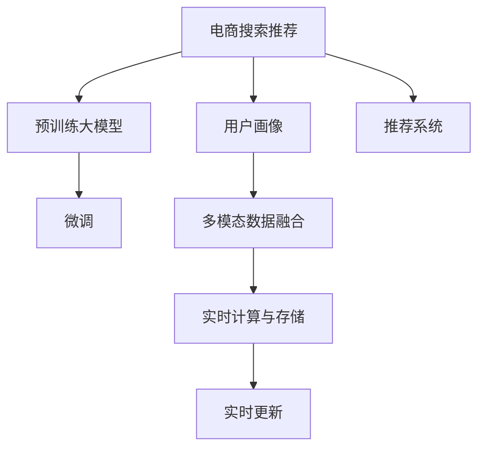

                 

# AI 大模型在电商搜索推荐中的用户画像技术：深度挖掘用户行为与偏好

## 1. 背景介绍

### 1.1 问题由来
随着电商行业的快速发展，用户行为数据的积累越来越丰富，如何利用这些数据构建精准的用户画像，是电商平台提升用户体验、优化推荐系统的关键。传统的用户画像技术往往依赖于人工标注或简单的统计分析，难以深度挖掘用户的潜在行为与偏好。而基于大模型的用户画像技术，通过在海量用户行为数据上进行预训练，学习到复杂的用户行为模式和偏好，并在特定任务上进行微调，能够更好地适配电商平台的实际应用需求。

### 1.2 问题核心关键点
用户画像技术在电商搜索推荐中的核心关键点在于如何通过大规模用户行为数据预训练大模型，并结合电商搜索推荐的具体场景，进行微调，从而构建出用户行为与偏好的深度理解。这包括：
- 用户行为数据收集与处理：如何高效地从电商平台的用户行为数据中提取有价值的信息。
- 预训练大模型选择：如何选择适合电商搜索推荐任务的大模型。
- 用户画像微调方法：如何通过微调技术，使大模型更好地适配电商搜索推荐任务。
- 用户画像应用：如何将用户画像技术应用于电商平台的推荐系统，提升用户满意度和转化率。

### 1.3 问题研究意义
深度挖掘用户行为与偏好，构建精准的用户画像，对于电商平台来说，具有重要意义：

1. **提升用户体验**：通过精准的用户画像，电商平台能够更好地理解用户需求，提供个性化的搜索结果和推荐，提升用户满意度。
2. **优化推荐系统**：用户画像技术可以为推荐系统提供更加丰富和精准的用户特征，帮助系统更准确地预测用户行为，提升推荐效果。
3. **促进销售转化**：个性化的推荐可以显著提高用户的购买意愿，从而提升平台的销售转化率和用户留存率。
4. **数据驱动决策**：用户画像技术能够提供实时的用户行为洞察，帮助电商平台进行数据驱动的运营决策，优化产品和服务。

## 2. 核心概念与联系

### 2.1 核心概念概述

为更好地理解大模型在电商搜索推荐中的用户画像技术，本节将介绍几个关键概念：

- **电商搜索推荐**：电商平台通过用户搜索和浏览行为，推荐合适的商品给用户，提升用户购物体验。
- **用户画像**：基于用户行为数据构建的用户特征描述，用于个性化推荐、用户细分等。
- **预训练大模型**：通过大规模无标签数据预训练得到的模型，具备强大的语言理解和生成能力。
- **微调(Fine-Tuning)**：在大规模预训练的基础上，结合任务数据进行有监督学习，优化模型在特定任务上的性能。
- **多模态数据融合**：结合用户行为数据、商品信息等多模态数据，构建更加丰富和准确的用户画像。
- **实时计算与存储**：利用分布式计算和存储技术，实现用户画像的实时更新和存储。

这些概念之间通过以下Mermaid流程图来展示：



这个流程图展示了大模型在电商搜索推荐中的用户画像技术流程：

1. 通过电商搜索推荐收集用户行为数据。
2. 在预训练大模型的基础上，结合用户画像任务进行微调。
3. 利用多模态数据融合技术，构建更丰富的用户画像。
4. 通过实时计算与存储技术，实现用户画像的实时更新。
5. 将实时更新的用户画像应用于推荐系统，提升推荐效果。

## 3. 核心算法原理 & 具体操作步骤
### 3.1 算法原理概述

基于大模型的用户画像技术，本质上是一个深度学习迁移学习过程。其核心思想是：利用预训练大模型强大的语言理解和生成能力，通过用户行为数据的微调，构建精准的用户画像。

形式化地，假设电商搜索推荐任务为 $T$，用户画像任务为 $U$，用户行为数据集为 $D=\{(x_i, y_i)\}_{i=1}^N$，其中 $x_i$ 为用户行为数据，$y_i$ 为对应的用户画像标签。微调的目标是找到新的模型参数 $\hat{\theta}$，使得：

$$
\hat{\theta}=\mathop{\arg\min}_{\theta} \mathcal{L}(M_{\theta},D^U)
$$

其中 $\mathcal{L}$ 为针对用户画像任务 $U$ 设计的损失函数，用于衡量模型输出与真实标签之间的差异。常见的损失函数包括交叉熵损失、均方误差损失等。

通过梯度下降等优化算法，微调过程不断更新模型参数 $\theta$，最小化损失函数 $\mathcal{L}$，使得模型输出逼近真实标签。由于 $\theta$ 已经通过预训练获得了较好的初始化，因此即便在小规模数据集 $D^U$ 上进行微调，也能较快收敛到理想的模型参数 $\hat{\theta}$。

### 3.2 算法步骤详解

基于大模型的用户画像技术一般包括以下几个关键步骤：

**Step 1: 准备预训练模型和数据集**
- 选择合适的预训练语言模型 $M_{\theta}$ 作为初始化参数，如BERT、GPT等。
- 准备电商搜索推荐任务 $T$ 的用户行为数据集 $D$，划分为训练集、验证集和测试集。一般要求用户行为数据与预训练数据的分布不要差异过大。

**Step 2: 添加任务适配层**
- 根据任务类型，在预训练模型顶层设计合适的输出层和损失函数。
- 对于分类任务，通常在顶层添加线性分类器和交叉熵损失函数。
- 对于生成任务，通常使用语言模型的解码器输出概率分布，并以负对数似然为损失函数。

**Step 3: 设置微调超参数**
- 选择合适的优化算法及其参数，如 AdamW、SGD 等，设置学习率、批大小、迭代轮数等。
- 设置正则化技术及强度，包括权重衰减、Dropout、Early Stopping等。
- 确定冻结预训练参数的策略，如仅微调顶层，或全部参数都参与微调。

**Step 4: 执行梯度训练**
- 将训练集数据分批次输入模型，前向传播计算损失函数。
- 反向传播计算参数梯度，根据设定的优化算法和学习率更新模型参数。
- 周期性在验证集上评估模型性能，根据性能指标决定是否触发 Early Stopping。
- 重复上述步骤直到满足预设的迭代轮数或 Early Stopping 条件。

**Step 5: 测试和部署**
- 在测试集上评估微调后模型 $M_{\hat{\theta}}$ 的性能，对比微调前后的精度提升。
- 使用微调后的模型对新用户进行画像，集成到实际的应用系统中。
- 持续收集新的用户行为数据，定期重新微调模型，以适应数据分布的变化。

以上是基于大模型微调的用户画像技术的一般流程。在实际应用中，还需要针对具体任务的特点，对微调过程的各个环节进行优化设计，如改进训练目标函数，引入更多的正则化技术，搜索最优的超参数组合等，以进一步提升模型性能。

### 3.3 算法优缺点

基于大模型的用户画像技术具有以下优点：
1. 简单高效。只需准备少量标注数据，即可对预训练模型进行快速适配，获得较大的性能提升。
2. 通用适用。适用于各种电商搜索推荐任务，包括用户画像、用户细分、个性化推荐等，设计简单的任务适配层即可实现微调。
3. 参数高效。利用参数高效微调技术，在固定大部分预训练权重不变的情况下，仍可取得不错的提升。
4. 效果显著。在学术界和工业界的诸多任务上，基于微调的方法已经刷新了多项NLP任务SOTA。

同时，该方法也存在一定的局限性：
1. 依赖标注数据。微调的效果很大程度上取决于标注数据的质量和数量，获取高质量标注数据的成本较高。
2. 迁移能力有限。当目标任务与预训练数据的分布差异较大时，微调的性能提升有限。
3. 负面效果传递。预训练模型的固有偏见、有害信息等，可能通过微调传递到下游任务，造成负面影响。
4. 可解释性不足。微调模型的决策过程通常缺乏可解释性，难以对其推理逻辑进行分析和调试。

尽管存在这些局限性，但就目前而言，基于大模型微调的用户画像技术仍是目前最主流和有效的用户画像构建方法。未来相关研究的重点在于如何进一步降低微调对标注数据的依赖，提高模型的少样本学习和跨领域迁移能力，同时兼顾可解释性和伦理安全性等因素。

### 3.4 算法应用领域

基于大模型微调的用户画像技术在电商搜索推荐中已经得到了广泛的应用，覆盖了几乎所有常见的电商推荐任务，例如：

- 用户行为分析：分析用户搜索、浏览、点击等行为，构建用户画像，进行行为预测。
- 个性化推荐：根据用户画像，为用户推荐最相关的商品，提升转化率。
- 用户细分：根据用户行为特征，进行用户群体划分，实现更精准的用户细分。
- 购物车预测：预测用户是否将商品加入购物车，进行针对性营销。
- 价格优化：根据用户行为和偏好，优化商品价格策略，提高销售额。

除了上述这些经典任务外，用户画像技术还被创新性地应用到更多场景中，如情感分析、趋势预测、内容推荐等，为电商平台的运营决策提供支持。随着预训练模型和微调方法的不断进步，相信用户画像技术将在电商搜索推荐中发挥更大的作用，驱动电商平台的智能化发展。

## 4. 数学模型和公式 & 详细讲解  
### 4.1 数学模型构建

本节将使用数学语言对基于大模型的用户画像技术进行更加严格的刻画。

记预训练语言模型为 $M_{\theta}$，其中 $\theta$ 为预训练得到的模型参数。假设电商搜索推荐任务 $T$ 的用户行为数据集为 $D=\{(x_i,y_i)\}_{i=1}^N, x_i \in \mathcal{X}, y_i \in \mathcal{Y}$，其中 $\mathcal{X}$ 为用户行为空间，$\mathcal{Y}$ 为用户画像标签空间。

定义模型 $M_{\theta}$ 在数据样本 $(x,y)$ 上的损失函数为 $\ell(M_{\theta}(x),y)$，则在数据集 $D$ 上的经验风险为：

$$
\mathcal{L}(\theta) = \frac{1}{N} \sum_{i=1}^N \ell(M_{\theta}(x_i),y_i)
$$

微调的优化目标是最小化经验风险，即找到最优参数：

$$
\theta^* = \mathop{\arg\min}_{\theta} \mathcal{L}(\theta)
$$

在实践中，我们通常使用基于梯度的优化算法（如SGD、Adam等）来近似求解上述最优化问题。设 $\eta$ 为学习率，$\lambda$ 为正则化系数，则参数的更新公式为：

$$
\theta \leftarrow \theta - \eta \nabla_{\theta}\mathcal{L}(\theta) - \eta\lambda\theta
$$

其中 $\nabla_{\theta}\mathcal{L}(\theta)$ 为损失函数对参数 $\theta$ 的梯度，可通过反向传播算法高效计算。

### 4.2 公式推导过程

以下我们以用户行为分类任务为例，推导交叉熵损失函数及其梯度的计算公式。

假设模型 $M_{\theta}$ 在输入 $x$ 上的输出为 $\hat{y}=M_{\theta}(x) \in [0,1]$，表示用户属于某个行为类别的概率。真实标签 $y \in \{0,1\}$。则二分类交叉熵损失函数定义为：

$$
\ell(M_{\theta}(x),y) = -[y\log \hat{y} + (1-y)\log (1-\hat{y})]
$$

将其代入经验风险公式，得：

$$
\mathcal{L}(\theta) = -\frac{1}{N}\sum_{i=1}^N [y_i\log M_{\theta}(x_i)+(1-y_i)\log(1-M_{\theta}(x_i))]
$$

根据链式法则，损失函数对参数 $\theta_k$ 的梯度为：

$$
\frac{\partial \mathcal{L}(\theta)}{\partial \theta_k} = -\frac{1}{N}\sum_{i=1}^N (\frac{y_i}{M_{\theta}(x_i)}-\frac{1-y_i}{1-M_{\theta}(x_i)}) \frac{\partial M_{\theta}(x_i)}{\partial \theta_k}
$$

其中 $\frac{\partial M_{\theta}(x_i)}{\partial \theta_k}$ 可进一步递归展开，利用自动微分技术完成计算。

在得到损失函数的梯度后，即可带入参数更新公式，完成模型的迭代优化。重复上述过程直至收敛，最终得到适应电商搜索推荐任务的最优模型参数 $\theta^*$。

## 5. 项目实践：代码实例和详细解释说明
### 5.1 开发环境搭建

在进行用户画像实践前，我们需要准备好开发环境。以下是使用Python进行PyTorch开发的环境配置流程：

1. 安装Anaconda：从官网下载并安装Anaconda，用于创建独立的Python环境。

2. 创建并激活虚拟环境：
```bash
conda create -n pytorch-env python=3.8 
conda activate pytorch-env
```

3. 安装PyTorch：根据CUDA版本，从官网获取对应的安装命令。例如：
```bash
conda install pytorch torchvision torchaudio cudatoolkit=11.1 -c pytorch -c conda-forge
```

4. 安装Transformers库：
```bash
pip install transformers
```

5. 安装各类工具包：
```bash
pip install numpy pandas scikit-learn matplotlib tqdm jupyter notebook ipython
```

完成上述步骤后，即可在`pytorch-env`环境中开始用户画像实践。

### 5.2 源代码详细实现

这里我们以用户行为分类任务为例，给出使用Transformers库对BERT模型进行用户画像的PyTorch代码实现。

首先，定义用户行为分类任务的输入输出格式：

```python
from transformers import BertTokenizer
from torch.utils.data import Dataset
import torch

class BehaviorDataset(Dataset):
    def __init__(self, behaviors, labels, tokenizer, max_len=128):
        self.behaviors = behaviors
        self.labels = labels
        self.tokenizer = tokenizer
        self.max_len = max_len
        
    def __len__(self):
        return len(self.behaviors)
    
    def __getitem__(self, item):
        behavior = self.behaviors[item]
        label = self.labels[item]
        
        encoding = self.tokenizer(behavior, return_tensors='pt', max_length=self.max_len, padding='max_length', truncation=True)
        input_ids = encoding['input_ids'][0]
        attention_mask = encoding['attention_mask'][0]
        
        # 对标签进行编码
        label = [1 if label == 'buy' else 0]
        labels = torch.tensor(label, dtype=torch.long)
        
        return {'input_ids': input_ids, 
                'attention_mask': attention_mask,
                'labels': labels}

# 加载用户行为数据和标签
behaviors = ...
labels = ...

tokenizer = BertTokenizer.from_pretrained('bert-base-cased')

train_dataset = BehaviorDataset(behaviors, labels, tokenizer)
dev_dataset = BehaviorDataset(behaviors, labels, tokenizer)
test_dataset = BehaviorDataset(behaviors, labels, tokenizer)
```

然后，定义模型和优化器：

```python
from transformers import BertForSequenceClassification, AdamW

model = BertForSequenceClassification.from_pretrained('bert-base-cased', num_labels=2)

optimizer = AdamW(model.parameters(), lr=2e-5)
```

接着，定义训练和评估函数：

```python
from torch.utils.data import DataLoader
from tqdm import tqdm
from sklearn.metrics import classification_report

device = torch.device('cuda') if torch.cuda.is_available() else torch.device('cpu')
model.to(device)

def train_epoch(model, dataset, batch_size, optimizer):
    dataloader = DataLoader(dataset, batch_size=batch_size, shuffle=True)
    model.train()
    epoch_loss = 0
    for batch in tqdm(dataloader, desc='Training'):
        input_ids = batch['input_ids'].to(device)
        attention_mask = batch['attention_mask'].to(device)
        labels = batch['labels'].to(device)
        model.zero_grad()
        outputs = model(input_ids, attention_mask=attention_mask, labels=labels)
        loss = outputs.loss
        epoch_loss += loss.item()
        loss.backward()
        optimizer.step()
    return epoch_loss / len(dataloader)

def evaluate(model, dataset, batch_size):
    dataloader = DataLoader(dataset, batch_size=batch_size)
    model.eval()
    preds, labels = [], []
    with torch.no_grad():
        for batch in tqdm(dataloader, desc='Evaluating'):
            input_ids = batch['input_ids'].to(device)
            attention_mask = batch['attention_mask'].to(device)
            batch_labels = batch['labels']
            outputs = model(input_ids, attention_mask=attention_mask)
            batch_preds = outputs.logits.argmax(dim=2).to('cpu').tolist()
            batch_labels = batch_labels.to('cpu').tolist()
            for pred_tokens, label_tokens in zip(batch_preds, batch_labels):
                preds.append(pred_tokens)
                labels.append(label_tokens)
                
    print(classification_report(labels, preds))
```

最后，启动训练流程并在测试集上评估：

```python
epochs = 5
batch_size = 16

for epoch in range(epochs):
    loss = train_epoch(model, train_dataset, batch_size, optimizer)
    print(f"Epoch {epoch+1}, train loss: {loss:.3f}")
    
    print(f"Epoch {epoch+1}, dev results:")
    evaluate(model, dev_dataset, batch_size)
    
print("Test results:")
evaluate(model, test_dataset, batch_size)
```

以上就是使用PyTorch对BERT进行用户行为分类任务微调的完整代码实现。可以看到，得益于Transformers库的强大封装，我们可以用相对简洁的代码完成BERT模型的加载和微调。

### 5.3 代码解读与分析

让我们再详细解读一下关键代码的实现细节：

**BehaviorDataset类**：
- `__init__`方法：初始化用户行为、标签、分词器等关键组件。
- `__len__`方法：返回数据集的样本数量。
- `__getitem__`方法：对单个样本进行处理，将用户行为输入编码为token ids，将标签编码为数字，并对其进行定长padding，最终返回模型所需的输入。

**训练和评估函数**：
- 使用PyTorch的DataLoader对数据集进行批次化加载，供模型训练和推理使用。
- 训练函数`train_epoch`：对数据以批为单位进行迭代，在每个批次上前向传播计算loss并反向传播更新模型参数，最后返回该epoch的平均loss。
- 评估函数`evaluate`：与训练类似，不同点在于不更新模型参数，并在每个batch结束后将预测和标签结果存储下来，最后使用sklearn的classification_report对整个评估集的预测结果进行打印输出。

**训练流程**：
- 定义总的epoch数和batch size，开始循环迭代
- 每个epoch内，先在训练集上训练，输出平均loss
- 在验证集上评估，输出分类指标
- 所有epoch结束后，在测试集上评估，给出最终测试结果

可以看到，PyTorch配合Transformers库使得BERT微调的用户行为分类任务代码实现变得简洁高效。开发者可以将更多精力放在数据处理、模型改进等高层逻辑上，而不必过多关注底层的实现细节。

当然，工业级的系统实现还需考虑更多因素，如模型的保存和部署、超参数的自动搜索、更灵活的任务适配层等。但核心的微调范式基本与此类似。

## 6. 实际应用场景
### 6.1 智能推荐系统

基于大模型微调的用户画像技术，可以广泛应用于智能推荐系统的构建。传统推荐系统往往只依赖用户历史行为数据进行推荐，难以充分考虑用户的潜在兴趣和多样性需求。而利用用户画像技术，推荐系统能够更全面地理解用户的多维度特征，提供更精准和个性化的推荐。

在技术实现上，可以收集用户行为数据，如浏览记录、购买记录、评论信息等，通过微调大模型，构建用户的兴趣画像和行为特征。将用户画像结合用户历史行为和实时行为数据，实时生成推荐结果，实现个性化推荐。

### 6.2 用户细分与营销

电商平台通过用户画像技术，可以将用户群体细分，进行更精准的市场细分和营销策略的制定。例如，通过分析用户的行为数据，将用户分为高频购买用户、高价值用户、高潜力用户等不同类型，为不同群体提供定制化的营销方案。

在实际操作中，可以使用用户画像技术构建用户细分模型，将用户根据行为特征、兴趣标签、人口统计信息等划分为不同的细分群体。然后针对不同群体，设计个性化的营销活动，如个性化广告、定向推送、优惠券等，提升营销效果。

### 6.3 新用户引入与激活

新用户在电商平台注册后，往往需要经历一个引入和激活的阶段。利用用户画像技术，可以通过分析新用户的行为数据，判断其潜在的兴趣和需求，提前推送相关的商品信息，加速新用户激活。

具体而言，可以将新用户的浏览记录、搜索记录等行为数据作为输入，微调大模型生成用户画像，分析用户兴趣点和需求，然后推送相关商品或优惠活动，提升新用户留存率。

### 6.4 实时预警与监控

用户画像技术不仅可以帮助电商平台进行用户行为预测，还可以实时监控用户行为变化，及时预警潜在的风险。例如，通过分析用户的购买行为，及时发现异常购买行为，如恶意刷单、价格倒挂等，并进行预警处理。

在实际应用中，可以将用户画像模型与异常检测算法结合，实时监控用户行为数据，及时发现异常行为，采取相应的风险控制措施，保障电商平台的安全运营。

## 7. 工具和资源推荐
### 7.1 学习资源推荐

为了帮助开发者系统掌握大模型在电商搜索推荐中的用户画像技术，这里推荐一些优质的学习资源：

1. 《Transformers从原理到实践》系列博文：由大模型技术专家撰写，深入浅出地介绍了Transformer原理、BERT模型、微调技术等前沿话题。

2. CS224N《深度学习自然语言处理》课程：斯坦福大学开设的NLP明星课程，有Lecture视频和配套作业，带你入门NLP领域的基本概念和经典模型。

3. 《Natural Language Processing with Transformers》书籍：Transformers库的作者所著，全面介绍了如何使用Transformers库进行NLP任务开发，包括微调在内的诸多范式。

4. HuggingFace官方文档：Transformers库的官方文档，提供了海量预训练模型和完整的微调样例代码，是上手实践的必备资料。

5. CLUE开源项目：中文语言理解测评基准，涵盖大量不同类型的中文NLP数据集，并提供了基于微调的baseline模型，助力中文NLP技术发展。

通过对这些资源的学习实践，相信你一定能够快速掌握大模型在电商搜索推荐中的用户画像技术的精髓，并用于解决实际的电商推荐问题。
###  7.2 开发工具推荐

高效的开发离不开优秀的工具支持。以下是几款用于大模型在电商搜索推荐中的用户画像开发的常用工具：

1. PyTorch：基于Python的开源深度学习框架，灵活动态的计算图，适合快速迭代研究。大部分预训练语言模型都有PyTorch版本的实现。

2. TensorFlow：由Google主导开发的开源深度学习框架，生产部署方便，适合大规模工程应用。同样有丰富的预训练语言模型资源。

3. Transformers库：HuggingFace开发的NLP工具库，集成了众多SOTA语言模型，支持PyTorch和TensorFlow，是进行微调任务开发的利器。

4. Weights & Biases：模型训练的实验跟踪工具，可以记录和可视化模型训练过程中的各项指标，方便对比和调优。与主流深度学习框架无缝集成。

5. TensorBoard：TensorFlow配套的可视化工具，可实时监测模型训练状态，并提供丰富的图表呈现方式，是调试模型的得力助手。

6. Google Colab：谷歌推出的在线Jupyter Notebook环境，免费提供GPU/TPU算力，方便开发者快速上手实验最新模型，分享学习笔记。

合理利用这些工具，可以显著提升大模型在电商搜索推荐中的用户画像任务的开发效率，加快创新迭代的步伐。

### 7.3 相关论文推荐

大模型在电商搜索推荐中的用户画像技术的发展源于学界的持续研究。以下是几篇奠基性的相关论文，推荐阅读：

1. Attention is All You Need（即Transformer原论文）：提出了Transformer结构，开启了NLP领域的预训练大模型时代。

2. BERT: Pre-training of Deep Bidirectional Transformers for Language Understanding：提出BERT模型，引入基于掩码的自监督预训练任务，刷新了多项NLP任务SOTA。

3. Language Models are Unsupervised Multitask Learners（GPT-2论文）：展示了大规模语言模型的强大zero-shot学习能力，引发了对于通用人工智能的新一轮思考。

4. Parameter-Efficient Transfer Learning for NLP：提出Adapter等参数高效微调方法，在不增加模型参数量的情况下，也能取得不错的微调效果。

5. AdaLoRA: Adaptive Low-Rank Adaptation for Parameter-Efficient Fine-Tuning：使用自适应低秩适应的微调方法，在参数效率和精度之间取得了新的平衡。

这些论文代表了大模型在电商搜索推荐中的用户画像技术的发展脉络。通过学习这些前沿成果，可以帮助研究者把握学科前进方向，激发更多的创新灵感。

## 8. 总结：未来发展趋势与挑战

### 8.1 总结

本文对基于大模型的用户画像技术在电商搜索推荐中的应用进行了全面系统的介绍。首先阐述了大模型在电商搜索推荐中的应用背景和意义，明确了用户画像技术在提升推荐系统性能、优化用户体验中的独特价值。其次，从原理到实践，详细讲解了基于大模型的用户画像技术流程，包括数据准备、模型微调、评估部署等关键步骤。同时，本文还广泛探讨了用户画像技术在智能推荐、用户细分、新用户引入等电商推荐中的应用前景，展示了用户画像技术在电商平台的巨大潜力。

通过本文的系统梳理，可以看到，基于大模型的用户画像技术正在成为电商搜索推荐中的重要技术范式，极大地提升了推荐的精准度和个性化水平，推动了电商平台的发展和转型。未来，伴随大模型的不断演进，用户画像技术也将不断突破新的边界，进一步提升电商平台的智能化水平。

### 8.2 未来发展趋势

展望未来，大模型在电商搜索推荐中的用户画像技术将呈现以下几个发展趋势：

1. 模型规模持续增大。随着算力成本的下降和数据规模的扩张，预训练语言模型的参数量还将持续增长。超大规模语言模型蕴含的丰富语言知识，有望支撑更加复杂多变的电商推荐任务。

2. 微调方法日趋多样。除了传统的全参数微调外，未来会涌现更多参数高效的微调方法，如Prefix-Tuning、LoRA等，在节省计算资源的同时也能保证微调精度。

3. 多模态数据融合增强。电商搜索推荐任务中，用户行为数据往往多模态融合，结合用户行为数据、商品信息等多模态数据，构建更加丰富和准确的用户画像。

4. 实时计算与存储优化。电商平台的运营数据往往实时产生，需要对用户画像进行实时更新和存储，利用分布式计算和存储技术，实现用户画像的实时更新。

5. 用户画像个性化提升。随着电商平台的个性化需求不断提升，用户画像技术将更加注重个性化推荐，结合用户兴趣、行为、历史等多维度特征，实现更加精准和多样化的推荐。

6. 用户画像伦理保护。用户画像技术在带来便利的同时，也带来了隐私和伦理问题。未来需要更多地关注用户数据的隐私保护和伦理道德，设计更加安全的用户画像技术。

以上趋势凸显了大模型在电商搜索推荐中的用户画像技术的广阔前景。这些方向的探索发展，必将进一步提升推荐系统的性能和用户满意度，为电商平台的智能化发展注入新的动力。

### 8.3 面临的挑战

尽管大模型在电商搜索推荐中的用户画像技术已经取得了显著进展，但在迈向更加智能化、普适化应用的过程中，它仍面临着诸多挑战：

1. 标注成本瓶颈。虽然微调大大降低了标注数据的需求，但对于长尾应用场景，难以获得充足的高质量标注数据，成为制约微调性能的瓶颈。如何进一步降低微调对标注样本的依赖，将是一大难题。

2. 模型鲁棒性不足。当前微调模型面对域外数据时，泛化性能往往大打折扣。对于测试样本的微小扰动，微调模型的预测也容易发生波动。如何提高微调模型的鲁棒性，避免灾难性遗忘，还需要更多理论和实践的积累。

3. 推理效率有待提高。大规模语言模型虽然精度高，但在实际部署时往往面临推理速度慢、内存占用大等效率问题。如何在保证性能的同时，简化模型结构，提升推理速度，优化资源占用，将是重要的优化方向。

4. 可解释性亟需加强。当前微调模型更像是"黑盒"系统，难以解释其内部工作机制和决策逻辑。对于医疗、金融等高风险应用，算法的可解释性和可审计性尤为重要。如何赋予微调模型更强的可解释性，将是亟待攻克的难题。

5. 安全性有待保障。预训练语言模型难免会学习到有偏见、有害的信息，通过微调传递到下游任务，产生误导性、歧视性的输出，给实际应用带来安全隐患。如何从数据和算法层面消除模型偏见，避免恶意用途，确保输出的安全性，也将是重要的研究课题。

6. 知识整合能力不足。现有的微调模型往往局限于任务内数据，难以灵活吸收和运用更广泛的先验知识。如何让微调过程更好地与外部知识库、规则库等专家知识结合，形成更加全面、准确的信息整合能力，还有很大的想象空间。

正视用户画像技术在电商搜索推荐中面临的这些挑战，积极应对并寻求突破，将是大模型在电商搜索推荐中走向成熟的必由之路。相信随着学界和产业界的共同努力，这些挑战终将一一被克服，大模型在电商搜索推荐中的用户画像技术必将在构建人机协同的智能电商中扮演越来越重要的角色。

### 8.4 未来突破

面对用户画像技术在电商搜索推荐中面临的种种挑战，未来的研究需要在以下几个方面寻求新的突破：

1. 探索无监督和半监督微调方法。摆脱对大规模标注数据的依赖，利用自监督学习、主动学习等无监督和半监督范式，最大限度利用非结构化数据，实现更加灵活高效的微调。

2. 研究参数高效和计算高效的微调范式。开发更加参数高效的微调方法，在固定大部分预训练参数的同时，只更新极少量的任务相关参数。同时优化微调模型的计算图，减少前向传播和反向传播的资源消耗，实现更加轻量级、实时性的部署。

3. 引入因果和对比学习范式。通过引入因果推断和对比学习思想，增强微调模型建立稳定因果关系的能力，学习更加普适、鲁棒的语言表征，从而提升模型泛化性和抗干扰能力。

4. 结合因果分析和博弈论工具。将因果分析方法引入微调模型，识别出模型决策的关键特征，增强输出解释的因果性和逻辑性。借助博弈论工具刻画人机交互过程，主动探索并规避模型的脆弱点，提高系统稳定性。

5. 纳入伦理道德约束。在模型训练目标中引入伦理导向的评估指标，过滤和惩罚有偏见、有害的输出倾向。同时加强人工干预和审核，建立模型行为的监管机制，确保输出符合人类价值观和伦理道德。

这些研究方向的探索，必将引领用户画像技术在电商搜索推荐中迈向更高的台阶，为构建安全、可靠、可解释、可控的智能电商系统铺平道路。面向未来，用户画像技术还需要与其他人工智能技术进行更深入的融合，如知识表示、因果推理、强化学习等，多路径协同发力，共同推动自然语言理解和智能交互系统的进步。只有勇于创新、敢于突破，才能不断拓展语言模型的边界，让智能技术更好地造福人类社会。

## 9. 附录：常见问题与解答
### Q1: 大模型在电商搜索推荐中的应用是否适用于所有电商平台？

A: 大模型在电商搜索推荐中的应用通常适用于具备一定规模用户基础和电商交易数据的电商平台。小型电商平台的用户行为数据可能不足以支撑大模型的有效训练和微调。但通过定制化数据采集和预处理，大模型也能在小规模电商平台上发挥作用。

### Q2: 微调大模型时如何选择合适的损失函数？

A: 损失函数的选择应根据具体的电商搜索推荐任务而定。例如，对于分类任务，可以使用交叉熵损失；对于回归任务，可以使用均方误差损失。此外，可以考虑引入自定义的损失函数，以更好地适配电商推荐场景。

### Q3: 大模型在电商搜索推荐中的应用需要考虑哪些数据隐私和安全问题？

A: 电商搜索推荐应用中，用户数据隐私和安全问题至关重要。需要采用数据脱敏、匿名化等技术，保护用户隐私。同时，需要对模型输出进行伦理审查，避免偏见和歧视。在模型训练和部署过程中，应遵循数据隐私和安全法规，保障用户数据的安全。

### Q4: 如何评估大模型在电商搜索推荐中的应用效果？

A: 大模型在电商搜索推荐中的应用效果可以通过多种指标进行评估，如点击率、转化率、留存率等。可以使用A/B测试、对比实验等方法，验证新模型的实际效果。同时，需要结合业务需求和用户反馈，进行持续的优化迭代。

### Q5: 电商搜索推荐应用中如何结合多模态数据？

A: 电商搜索推荐应用中，用户行为数据往往是多模态的，如文本、图片、视频等。可以结合不同的预训练模型和微调技术，对多模态数据进行联合表示和建模。例如，可以使用BERT对文本数据进行微调，使用DALL·E对图片数据进行微调，再将结果融合得到更加全面的用户画像。

通过不断探索和创新，大模型在电商搜索推荐中的应用将更加广泛和深入，为电商平台带来更高的智能化水平和用户满意度。

