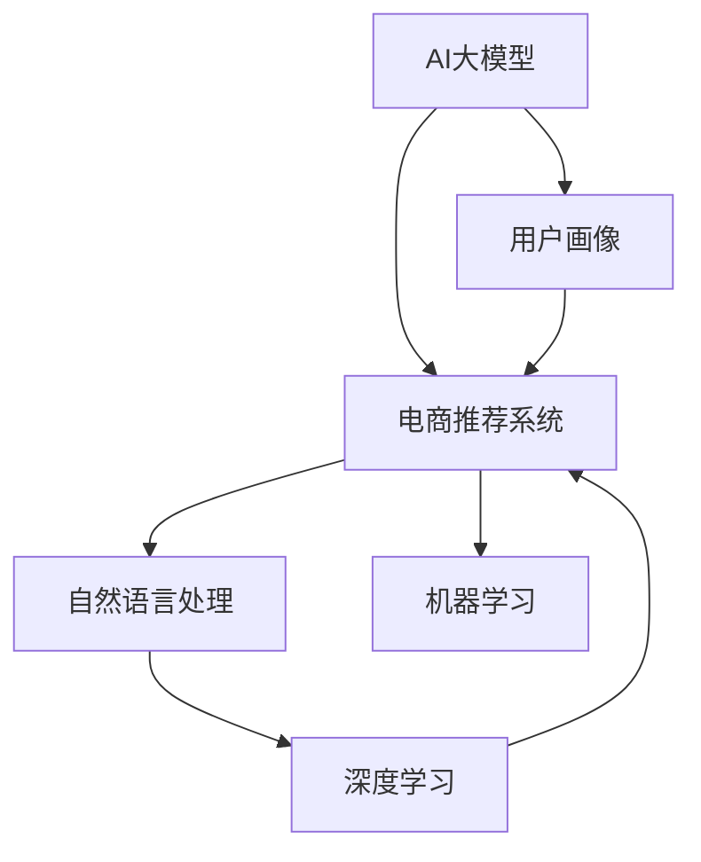

                 

# AI 大模型在电商搜索推荐中的用户画像构建：精准把握用户需求与行为偏好

> 关键词：大语言模型,用户画像,电商推荐系统,自然语言处理,NLP,深度学习,机器学习,推荐算法

## 1. 背景介绍

### 1.1 问题由来

在电商领域，构建精准的用户画像对于推荐系统的优化至关重要。用户画像不仅帮助理解用户的基本属性和行为特征，还能够预测用户未来可能产生的需求，从而提供更个性化的推荐服务。传统的用户画像构建方法依赖于问卷调查、点击记录、购买行为等数据，数据获取成本高，时效性差。近年来，AI 大模型在自然语言处理(NLP)领域的突破，为电商用户画像的构建提供了新的思路和方法。

大语言模型，如BERT、GPT等，通过在大规模语料上进行预训练，具备强大的语言理解和生成能力。通过自然语言处理技术，可以从用户行为数据、产品描述、用户评论中挖掘出隐含的用户需求和行为偏好，从而构建更加准确、细致的用户画像。本文将详细介绍AI大模型在电商搜索推荐中的用户画像构建方法，包括核心概念、算法原理、具体的操作步骤和实际应用场景。

### 1.2 问题核心关键点

AI大模型在电商用户画像构建中的核心关键点包括：
- 如何从大量文本数据中提取用户意图和行为偏好。
- 如何构建精准、细致的用户画像。
- 如何利用用户画像提升推荐系统的效果。
- 如何解决数据不均衡、过拟合等问题。

通过解决这些问题，可以更好地利用AI大模型在电商推荐系统中的应用，提升用户体验和电商平台的用户粘性。

## 2. 核心概念与联系

### 2.1 核心概念概述

为更好地理解AI大模型在电商用户画像构建中的应用，本节将介绍几个密切相关的核心概念：

- AI大模型：以自回归(如GPT)或自编码(如BERT)模型为代表的大规模预训练语言模型。通过在大规模无标签文本语料上进行预训练，学习通用的语言表示，具备强大的语言理解和生成能力。

- 用户画像：用于描述用户基本属性和行为特征的数据集合，一般由人口统计学信息、兴趣爱好、购买行为、搜索历史等数据组成。

- 电商推荐系统：通过分析用户行为数据和商品信息，利用推荐算法预测用户可能感兴趣的商品，并向用户推荐，以提高购买转化率的系统。

- 自然语言处理(NLP)：涉及计算机对自然语言的处理和理解，包括文本分类、情感分析、命名实体识别等任务，是构建用户画像的基础。

- 深度学习：一类模仿人脑神经网络的计算模型，包括卷积神经网络(CNN)、循环神经网络(RNN)、变换器(Transformer)等，用于从大量数据中提取特征和模式。

- 机器学习：利用数据和算法训练模型，使其能够预测和决策的学科。

这些核心概念之间的逻辑关系可以通过以下Mermaid流程图来展示：



这个流程图展示了大语言模型、用户画像、电商推荐系统之间的核心联系：

1. 大语言模型通过预训练学习通用语言表示。
2. 利用自然语言处理技术，从用户评论、产品描述中提取用户意图和行为偏好。
3. 构建用户画像，用于电商推荐系统。
4. 利用深度学习模型提取用户画像的特征，用于推荐算法。
5. 通过机器学习算法，训练推荐模型，提升推荐效果。

## 3. 核心算法原理 & 具体操作步骤

### 3.1 算法原理概述

AI大模型在电商用户画像构建的原理，是基于自然语言处理技术的语义分析。具体来说，通过分析用户的搜索查询、产品评价、社交媒体等文本数据，提取其中的关键词、实体、情感等信息，从而识别出用户的兴趣和需求。然后，将这些信息与用户的基本属性和历史行为数据进行整合，构建出详细、准确的用户画像。

### 3.2 算法步骤详解

AI大模型在电商用户画像构建的算法步骤包括：

**Step 1: 数据收集与预处理**

- 收集用户行为数据，包括搜索查询、点击记录、购买历史等。
- 收集产品描述、用户评论、社交媒体等文本数据。
- 对数据进行清洗、去重、分词等预处理操作。

**Step 2: 构建用户意图模型**

- 使用大语言模型，如BERT，对文本数据进行语义分析，识别出其中的关键词和实体。
- 根据关键词和实体的出现频率和上下文语境，构建用户意图标签，如“科技”、“时尚”、“美食”等。

**Step 3: 挖掘用户行为模式**

- 将用户意图与历史行为数据进行匹配，识别出用户的兴趣类别。
- 利用聚类算法，将用户分为不同的兴趣群体，如“科技爱好者”、“运动达人”等。

**Step 4: 构建用户画像**

- 将用户的兴趣类别、人口统计学信息、搜索行为、购买历史等数据进行整合，构建用户画像。
- 利用生成对抗网络(GAN)、隐马尔可夫模型(HMM)等方法，对用户画像进行可视化展示。

**Step 5: 更新用户画像**

- 根据用户的最新行为数据，定期更新用户画像。
- 利用增量学习算法，只更新部分用户画像特征，保持画像的时效性。

**Step 6: 应用于推荐系统**

- 将用户画像作为推荐模型的输入，预测用户可能感兴趣的商品。
- 根据用户画像的精细程度，调整推荐算法的参数，优化推荐效果。

### 3.3 算法优缺点

AI大模型在电商用户画像构建中具有以下优点：
1. 数据来源多样，覆盖面广，能够从多个渠道收集用户信息。
2. 语义分析能力强，能够从文本数据中挖掘出深层次的用户需求和行为偏好。
3. 能够动态更新用户画像，保持其时效性。
4. 能够提供更加细致、准确的用户画像，提升推荐效果。

同时，也存在一些局限性：
1. 对数据质量和处理技术的依赖性较强，数据质量不好会影响模型效果。
2. 处理大规模数据时，计算和存储成本较高。
3. 需要结合业务领域知识和实际应用场景，才能更好地发挥模型效果。
4. 需要持续更新和优化，才能保持模型的高效和准确。

尽管存在这些局限性，但AI大模型在电商用户画像构建中的应用前景广阔，值得进一步研究和探索。

### 3.4 算法应用领域

AI大模型在电商用户画像构建中的应用领域包括：
1. 电商搜索推荐系统：通过分析用户的搜索查询，构建用户画像，实现精准推荐。
2. 商品详情页：根据用户画像，自动生成商品描述和推荐，提升用户体验。
3. 用户行为分析：通过分析用户评论、社交媒体等文本数据，了解用户情感和需求，进行市场分析。
4. 营销活动优化：根据用户画像，定制个性化的营销活动，提升营销效果。
5. 智能客服：根据用户画像，智能推荐解决方案，提升客服效率。

这些应用场景展示了AI大模型在电商领域的强大潜力，通过精准的用户画像构建，可以更好地满足用户需求，提升电商平台的用户粘性和销售转化率。

## 4. 数学模型和公式 & 详细讲解 & 举例说明

### 4.1 数学模型构建

本节将使用数学语言对AI大模型在电商用户画像构建的过程进行更加严格的刻画。

记用户行为数据为 $D=\{(x_i,y_i)\}_{i=1}^N$，其中 $x_i$ 表示用户行为数据，$y_i$ 表示用户意图标签。设用户画像为 $P$，由用户基本信息 $p_1$、兴趣类别 $p_2$、历史行为数据 $p_3$ 组成。

定义用户意图模型为 $I(D)$，表示用户行为数据与意图标签之间的映射关系。则用户画像的构建过程可以表示为：

$$
P = f(I(D), p_1, p_2, p_3)
$$

其中 $f$ 为构建用户画像的函数。

### 4.2 公式推导过程

以下我们以用户意图模型的构建为例，推导基于大语言模型的用户意图识别公式。

假设用户行为数据 $D=\{(x_i,y_i)\}_{i=1}^N$，其中 $x_i$ 为文本数据，$y_i$ 为意图标签。使用BERT模型对文本数据进行语义分析，得到文本表示向量 $z_i$，表示为：

$$
z_i = \text{BERT}(x_i)
$$

然后，使用分类器 $C$ 对文本表示向量进行分类，得到用户意图标签 $y_i$：

$$
y_i = C(z_i)
$$

其中 $C$ 为分类器的参数，可以使用softmax函数进行多分类。

根据上述公式，可以将用户意图模型 $I(D)$ 表示为：

$$
I(D) = \{(z_i,y_i)\}_{i=1}^N
$$

### 4.3 案例分析与讲解

以下我们以一个电商搜索推荐的案例，说明AI大模型在用户画像构建中的应用。

假设某电商平台有如下用户行为数据：

| 用户ID | 搜索关键词 | 点击记录 | 购买历史 |
| --- | --- | --- | --- |
| 1 | 手机 | iPhone X | iPhone 12 Pro |
| 2 | 运动鞋 | Nike | Under Armour |
| 3 | 电子产品 | 笔记本电脑 | MacBook |

使用BERT模型对这些文本数据进行语义分析，得到如下用户意图标签：

| 用户ID | 搜索关键词 | 点击记录 | 购买历史 | 意图标签 |
| --- | --- | --- | --- | --- |
| 1 | 手机 | iPhone X | iPhone 12 Pro | 手机 |
| 2 | 运动鞋 | Nike | Under Armour | 运动鞋 |
| 3 | 电子产品 | 笔记本电脑 | MacBook | 电子产品 |

将这些用户意图标签与用户基本信息和历史行为数据整合，构建出详细、准确的用户画像。例如：

| 用户ID | 年龄 | 性别 | 兴趣类别 | 搜索行为 | 点击记录 | 购买历史 | 意图标签 |
| --- | --- | --- | --- | --- | --- | --- | --- |
| 1 | 25 | 男 | 手机 | iPhone X | iPhone 12 Pro | 手机 | 手机 |
| 2 | 30 | 女 | 运动鞋 | Nike | Under Armour | 运动鞋 | 运动鞋 |
| 3 | 35 | 男 | 电子产品 | 笔记本电脑 | MacBook | 电子产品 | 电子产品 |

利用这些用户画像，电商平台可以针对不同用户群体，推荐不同的商品。例如，对于年龄25岁的男性用户1，推荐iPhone 12 Pro；对于年龄30岁的女性用户2，推荐Nike跑步鞋；对于年龄35岁的男性用户3，推荐MacBook笔记本。

## 5. 项目实践：代码实例和详细解释说明

### 5.1 开发环境搭建

在进行AI大模型在电商用户画像构建的实践前，我们需要准备好开发环境。以下是使用Python进行PyTorch开发的环境配置流程：

1. 安装Anaconda：从官网下载并安装Anaconda，用于创建独立的Python环境。

2. 创建并激活虚拟环境：
```bash
conda create -n pytorch-env python=3.8 
conda activate pytorch-env
```

3. 安装PyTorch：根据CUDA版本，从官网获取对应的安装命令。例如：
```bash
conda install pytorch torchvision torchaudio cudatoolkit=11.1 -c pytorch -c conda-forge
```

4. 安装Transformers库：
```bash
pip install transformers
```

5. 安装各类工具包：
```bash
pip install numpy pandas scikit-learn matplotlib tqdm jupyter notebook ipython
```

完成上述步骤后，即可在`pytorch-env`环境中开始项目实践。

### 5.2 源代码详细实现

我们以构建用户意图模型为例，给出使用Transformers库和PyTorch对BERT模型进行用户意图识别的代码实现。

首先，定义用户意图模型类：

```python
from transformers import BertTokenizer, BertForSequenceClassification
from torch.utils.data import Dataset
from torch import nn

class UserIntentModel(nn.Module):
    def __init__(self, num_labels):
        super(UserIntentModel, self).__init__()
        self.bert = BertForSequenceClassification.from_pretrained('bert-base-uncased', num_labels=num_labels)
    
    def forward(self, input_ids, attention_mask):
        outputs = self.bert(input_ids, attention_mask=attention_mask)
        return outputs.logits
```

然后，定义用户意图识别函数：

```python
def user_intent_identification(user_data, model, tokenizer):
    tokenized_input = tokenizer(user_data, return_tensors='pt')
    input_ids = tokenized_input['input_ids']
    attention_mask = tokenized_input['attention_mask']
    logits = model(input_ids, attention_mask=attention_mask)
    intent = torch.argmax(logits, dim=1)
    return intent
```

最后，启动用户意图识别流程：

```python
user_data = ["手机", "运动鞋", "电子产品"]
model = UserIntentModel(num_labels=5)
tokenizer = BertTokenizer.from_pretrained('bert-base-uncased')

intents = []
for data in user_data:
    intent = user_intent_identification(data, model, tokenizer)
    intents.append(intent.item())
    
print(intents)
```

在上述代码中，我们通过BERT模型对用户行为数据进行语义分析，识别出用户意图标签。这为构建用户画像和推荐系统提供了基础。

### 5.3 代码解读与分析

让我们再详细解读一下关键代码的实现细节：

**UserIntentModel类**：
- `__init__`方法：初始化BERT模型，设定输出层的标签数。
- `forward`方法：定义模型的前向传播，返回分类结果。

**user_intent_identification函数**：
- 使用BERT模型对用户行为数据进行编码，得到文本表示向量。
- 通过softmax函数对向量进行分类，得到意图标签。

**启动流程**：
- 定义用户行为数据。
- 初始化BERT模型和分词器。
- 循环处理每个用户行为数据，识别出用户意图标签。
- 输出所有意图标签。

通过这段代码，可以看出使用PyTorch和Transformers库进行用户意图识别的简单高效。开发者可以进一步扩展代码，整合更多用户画像构建和推荐系统的功能。

## 6. 实际应用场景

### 6.1 电商搜索推荐系统

AI大模型在电商搜索推荐系统中有着广泛的应用。通过构建用户画像，推荐系统能够精准识别用户的搜索意图，自动匹配商品，提高用户体验和转化率。例如，电商平台可以根据用户的搜索关键词和历史行为数据，推荐相关的商品，提升推荐的相关性和个性化。

在具体实现上，可以将用户行为数据输入BERT模型进行语义分析，识别出用户的意图标签。然后，根据标签生成推荐商品列表，并在搜索结果页面上展示。对于用户点击的商品，系统可以继续学习用户的偏好，进一步优化推荐算法。

### 6.2 商品详情页

在电商商品详情页中，AI大模型可以用于自动生成商品描述和推荐。通过分析用户的搜索记录和购买历史，系统可以自动生成商品详情，并提供个性化的推荐。例如，用户搜索“iPhone 12 Pro”，系统可以根据用户画像，推荐与iPhone相关的其他商品，如iPhone配件、iPhone软件等。

通过AI大模型，商品详情页可以实现自动更新，提升用户购物体验。

### 6.3 用户行为分析

AI大模型可以用于分析用户行为数据，了解用户的情感和需求。例如，电商平台可以分析用户的评论、社交媒体等文本数据，了解用户的情感倾向，进行市场分析。

在具体实现上，可以收集用户的评论数据，输入BERT模型进行情感分析，得到用户的情感标签，如“积极”、“消极”、“中性”等。然后，根据情感标签，分析用户的需求，进行市场推广。

### 6.4 营销活动优化

AI大模型可以用于优化电商平台的营销活动。通过分析用户的兴趣类别和行为特征，系统可以定制个性化的营销活动，提升营销效果。例如，电商平台可以根据用户的兴趣类别，推送相应的广告，提升广告点击率和转化率。

在具体实现上，可以收集用户的兴趣类别数据，输入BERT模型进行分类，得到用户的兴趣标签。然后，根据标签，定制相应的营销活动，并进行效果评估。

## 7. 工具和资源推荐

### 7.1 学习资源推荐

为了帮助开发者系统掌握AI大模型在电商用户画像构建的理论基础和实践技巧，这里推荐一些优质的学习资源：

1. 《Transformer从原理到实践》系列博文：由大模型技术专家撰写，深入浅出地介绍了Transformer原理、BERT模型、用户画像构建等前沿话题。

2. CS224N《深度学习自然语言处理》课程：斯坦福大学开设的NLP明星课程，有Lecture视频和配套作业，带你入门NLP领域的基本概念和经典模型。

3. 《Natural Language Processing with Transformers》书籍：Transformers库的作者所著，全面介绍了如何使用Transformers库进行NLP任务开发，包括用户画像构建在内的诸多范式。

4. HuggingFace官方文档：Transformers库的官方文档，提供了海量预训练模型和完整的用户画像构建样例代码，是上手实践的必备资料。

5. CLUE开源项目：中文语言理解测评基准，涵盖大量不同类型的中文NLP数据集，并提供了基于BERT的基线用户画像模型，助力中文NLP技术发展。

通过对这些资源的学习实践，相信你一定能够快速掌握AI大模型在电商用户画像构建的精髓，并用于解决实际的电商推荐问题。

### 7.2 开发工具推荐

高效的开发离不开优秀的工具支持。以下是几款用于AI大模型在电商用户画像构建开发的常用工具：

1. PyTorch：基于Python的开源深度学习框架，灵活动态的计算图，适合快速迭代研究。大部分预训练语言模型都有PyTorch版本的实现。

2. TensorFlow：由Google主导开发的开源深度学习框架，生产部署方便，适合大规模工程应用。同样有丰富的预训练语言模型资源。

3. Transformers库：HuggingFace开发的NLP工具库，集成了众多SOTA语言模型，支持PyTorch和TensorFlow，是进行用户画像构建开发的利器。

4. Weights & Biases：模型训练的实验跟踪工具，可以记录和可视化模型训练过程中的各项指标，方便对比和调优。与主流深度学习框架无缝集成。

5. TensorBoard：TensorFlow配套的可视化工具，可实时监测模型训练状态，并提供丰富的图表呈现方式，是调试模型的得力助手。

6. Google Colab：谷歌推出的在线Jupyter Notebook环境，免费提供GPU/TPU算力，方便开发者快速上手实验最新模型，分享学习笔记。

合理利用这些工具，可以显著提升AI大模型在电商用户画像构建的开发效率，加快创新迭代的步伐。

### 7.3 相关论文推荐

AI大模型在电商用户画像构建的研究源于学界的持续研究。以下是几篇奠基性的相关论文，推荐阅读：

1. Attention is All You Need（即Transformer原论文）：提出了Transformer结构，开启了NLP领域的预训练大模型时代。

2. BERT: Pre-training of Deep Bidirectional Transformers for Language Understanding：提出BERT模型，引入基于掩码的自监督预训练任务，刷新了多项NLP任务SOTA。

3. Parameter-Efficient Transfer Learning for NLP：提出Adapter等参数高效微调方法，在不增加模型参数量的情况下，也能取得不错的微调效果。

4. Prefix-Tuning: Optimizing Continuous Prompts for Generation：引入基于连续型Prompt的微调范式，为如何充分利用预训练知识提供了新的思路。

5. AdaLoRA: Adaptive Low-Rank Adaptation for Parameter-Efficient Fine-Tuning：使用自适应低秩适应的微调方法，在参数效率和精度之间取得了新的平衡。

这些论文代表了大语言模型在电商用户画像构建的研究发展脉络。通过学习这些前沿成果，可以帮助研究者把握学科前进方向，激发更多的创新灵感。

## 8. 总结：未来发展趋势与挑战

### 8.1 总结

本文对AI大模型在电商用户画像构建的过程进行了全面系统的介绍。首先阐述了AI大模型在电商推荐系统中的重要性，明确了用户画像构建在提升推荐效果中的独特价值。其次，从原理到实践，详细讲解了用户意图模型、用户画像构建和推荐系统的核心步骤，给出了电商推荐系统的完整代码实现。同时，本文还广泛探讨了AI大模型在电商领域的实际应用场景，展示了其在电商推荐系统中的应用前景。

通过本文的系统梳理，可以看到，AI大模型在电商推荐系统中的应用前景广阔，极大地拓展了电商推荐系统的边界，提升了用户购物体验和电商平台的用户粘性。未来，伴随AI大模型和推荐算法的持续演进，相信电商推荐系统必将在电商行业中发挥越来越重要的作用，推动电商行业的数字化转型。

### 8.2 未来发展趋势

展望未来，AI大模型在电商用户画像构建中呈现以下几个发展趋势：

1. 用户画像更加精细化。未来将结合用户行为数据和文本数据，构建更加细致、准确的用户画像。例如，结合用户的搜索关键词和评论，构建用户的兴趣类别和情感倾向。

2. 推荐系统更加智能化。通过用户画像，推荐系统能够提供更加个性化、精准的商品推荐。例如，结合用户的地理位置、社交网络信息，提供更为个性化的推荐。

3. 实时性提升。未来将结合实时数据，动态更新用户画像和推荐系统，提升推荐的时效性和个性化。

4. 数据融合技术发展。未来将结合多种数据源，进行数据融合，构建更加全面、准确的用户画像。例如，结合用户的搜索记录、购买历史、社交媒体信息，构建更为全面的用户画像。

5. 跨领域应用推广。AI大模型将拓展到更多领域，例如智能客服、智能家居等，提升各领域的智能化水平。

这些趋势凸显了AI大模型在电商推荐系统中的应用潜力，展示了其在电商行业的巨大发展前景。

### 8.3 面临的挑战

尽管AI大模型在电商用户画像构建中已经取得了一定的成果，但在迈向更加智能化、普适化应用的过程中，仍面临诸多挑战：

1. 数据隐私和安全问题。电商平台需要处理大量用户数据，如何在保护用户隐私的同时，进行数据挖掘和分析，是一个重要挑战。

2. 用户画像数据质量问题。用户画像的构建依赖于大量的用户行为数据和文本数据，如何保证数据质量，是一个关键问题。

3. 推荐系统效果评估问题。如何对推荐系统的效果进行全面、客观的评估，是一个重要挑战。

4. 推荐系统的可解释性问题。用户对推荐系统的决策过程缺乏可解释性，难以对其推理逻辑进行分析和调试。

5. 推荐系统的公平性和道德问题。电商推荐系统可能会产生歧视性、误导性的推荐，如何保证推荐系统的公平性和道德性，是一个重要挑战。

6. 推荐系统的效率问题。大规模电商平台的推荐系统需要高效、实时地处理大量数据，如何优化算法，提升推荐效率，是一个关键问题。

正视这些挑战，积极应对并寻求突破，将是大语言模型在电商推荐系统中的应用走向成熟的必由之路。相信随着学界和产业界的共同努力，这些挑战终将一一被克服，AI大模型必将在电商推荐系统中的应用发挥越来越重要的作用。

### 8.4 未来突破

面对AI大模型在电商推荐系统中的应用所面临的挑战，未来的研究需要在以下几个方面寻求新的突破：

1. 探索多模态数据融合技术。结合多种数据源，进行数据融合，构建更加全面、准确的用户画像。例如，结合用户的搜索记录、购买历史、社交媒体信息，构建更为全面的用户画像。

2. 研究推荐系统的可解释性。开发更为可解释的推荐系统，让用户能够理解推荐系统的决策过程。例如，结合自然语言处理技术，提供推荐系统的解释说明。

3. 引入因果推理和强化学习。通过引入因果推理和强化学习技术，增强推荐系统的公平性和道德性。例如，通过因果推理技术，减少推荐系统的歧视性。

4. 优化推荐算法的效率。通过优化算法，提升推荐系统的效率和实时性。例如，采用分布式计算和缓存技术，提升推荐系统的处理能力。

5. 引入道德和法律约束。在推荐系统设计中引入道德和法律约束，确保推荐系统的公平性和合法性。例如，结合用户反馈和市场监管，优化推荐系统。

6. 研究推荐系统的可扩展性。通过研究和优化推荐系统的可扩展性，确保推荐系统能够应对大规模电商平台的挑战。例如，采用分布式计算和缓存技术，提升推荐系统的处理能力。

这些研究方向的探索，必将引领AI大模型在电商推荐系统中的应用走向更高的台阶，为电商行业的数字化转型提供新的技术路径。面向未来，AI大模型需要与其他人工智能技术进行更深入的融合，共同推动电商推荐系统的进步。

## 9. 附录：常见问题与解答

**Q1：AI大模型在电商用户画像构建中，如何处理数据隐私和安全问题？**

A: 电商平台需要处理大量用户数据，如何在保护用户隐私的同时，进行数据挖掘和分析，是一个重要挑战。

1. 数据匿名化：对用户数据进行匿名化处理，去除个人身份信息，保护用户隐私。

2. 数据脱敏：对敏感数据进行脱敏处理，如将地址、电话号码等信息进行模糊化处理。

3. 数据加密：对用户数据进行加密存储，确保数据安全。

4. 数据访问控制：限制数据访问权限，确保只有授权人员可以访问敏感数据。

5. 数据使用透明化：对用户数据的使用情况进行透明化处理，确保用户知情同意。

**Q2：如何保证用户画像数据的质量？**

A: 用户画像的构建依赖于大量的用户行为数据和文本数据，如何保证数据质量，是一个关键问题。

1. 数据清洗：对数据进行清洗，去除重复、异常、噪声数据。

2. 数据校验：对数据进行校验，确保数据的一致性和准确性。

3. 数据补充：对缺失的数据进行补充，确保数据完整性。

4. 数据标注：对数据进行标注，确保数据标注的一致性和准确性。

5. 数据更新：定期更新数据，保持数据的时效性。

**Q3：如何对推荐系统的效果进行全面、客观的评估？**

A: 推荐系统的效果评估是一个重要问题，如何全面、客观地评估推荐系统的性能，是一个关键挑战。

1. 离线评估：使用历史数据进行离线评估，通过准确率、召回率、F1值等指标评估推荐系统的性能。

2. 在线评估：通过在线实验，评估推荐系统的实时性能。例如，使用A/B测试评估推荐系统的推荐效果。

3. 用户反馈：通过用户反馈，了解用户的满意度和推荐效果。

4. 多指标评估：综合考虑多个指标，如准确率、召回率、点击率、转化率等，全面评估推荐系统的性能。

**Q4：如何提升推荐系统的可解释性？**

A: 推荐系统对用户缺乏可解释性，难以对其推理逻辑进行分析和调试。

1. 数据可视化：使用数据可视化工具，展示推荐系统的数据处理和决策过程。例如，使用热力图展示用户画像的构建过程。

2. 算法透明化：使用透明化算法，让用户能够理解推荐系统的决策过程。例如，使用简单的分类算法，提高推荐系统的可解释性。

3. 解释生成器：使用解释生成器，自动生成推荐系统的解释说明。例如，使用自然语言处理技术，生成推荐系统的解释说明。

**Q5：如何优化推荐算法的效率？**

A: 大规模电商平台的推荐系统需要高效、实时地处理大量数据，如何优化算法，提升推荐效率，是一个关键问题。

1. 分布式计算：使用分布式计算技术，提升推荐系统的处理能力。例如，使用Hadoop或Spark等分布式计算框架，提升推荐系统的处理能力。

2. 缓存技术：使用缓存技术，减少重复计算，提升推荐系统的效率。例如，使用Redis等缓存技术，提升推荐系统的处理能力。

3. 算法优化：优化推荐算法，提高推荐系统的效率。例如，使用高效的推荐算法，如协同过滤、矩阵分解等，提高推荐系统的效率。

通过这些问题的详细解答，可以帮助开发者更好地理解AI大模型在电商用户画像构建中的应用，解决实际问题。

---

作者：禅与计算机程序设计艺术 / Zen and the Art of Computer Programming

