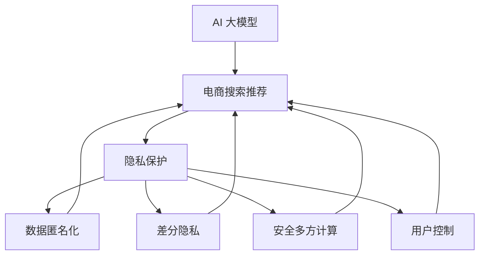

                 

# AI 大模型在电商搜索推荐中的用户隐私保护：尊重用户权利与安全

> 关键词：AI 大模型, 用户隐私, 电商搜索推荐, 隐私保护, 安全

## 1. 背景介绍

### 1.1 问题由来

随着人工智能技术在电商领域的深度应用，AI大模型如BERT、GPT等在个性化推荐、搜索排序等任务上取得了卓越的性能。但与此同时，AI系统对用户数据的处理和使用也引发了用户隐私保护的广泛关注。特别是在电商搜索推荐场景中，用户的浏览记录、购买行为等敏感信息需要被充分利用，以实现精准推荐，然而如何在获取信息的同时，有效保护用户隐私，成为了电商公司需要解决的关键问题。

近年来，数据泄露、用户隐私被滥用等事件频频发生，给社会带来了重大损失，同时也导致用户对电商平台的信任度下降，影响电商业务发展。因此，如何在AI大模型驱动的电商搜索推荐中，设计合理的隐私保护机制，确保用户数据安全，成为了行业和学术界共同关注的重要课题。

### 1.2 问题核心关键点

AI大模型在电商搜索推荐中的应用，主要依赖于对用户历史数据的深度学习和建模，通过大量历史数据训练的模型可以更好地预测用户的未来行为。但该过程中不可避免地涉及用户隐私信息，如用户的搜索历史、浏览记录、购买偏好等。如何在获取这些信息的同时，有效保护用户隐私，成为了电商搜索推荐系统需要解决的核心问题。

具体来说，隐私保护问题主要集中在以下几个方面：
- 数据匿名化：将用户原始数据进行匿名化处理，以防止直接识别用户身份。
- 差分隐私：在模型训练和推理过程中引入差分隐私机制，限制模型对单用户数据的敏感性。
- 安全多方计算：通过多方协作计算，在保护用户数据隐私的前提下，实现高效的模型训练和推荐。
- 用户控制：赋予用户对其数据的控制权，让用户可以自主选择是否提供信息，并允许用户随时撤回。

这些隐私保护技术的目标是在确保用户数据安全的同时，保持AI推荐系统的精度和效率。

## 2. 核心概念与联系

### 2.1 核心概念概述

为更好地理解如何在电商搜索推荐中保护用户隐私，本节将介绍几个关键概念及其相互关系。

- **AI 大模型**：以Transformer架构为基础，如BERT、GPT等，通过在大规模无标签数据上进行预训练，学习通用的语言表示，具备强大的语言理解和生成能力。

- **隐私保护**：指在数据处理、模型训练、服务部署等各个环节中，采取一系列技术和政策手段，确保用户数据不被滥用，保障用户隐私安全。

- **电商搜索推荐**：基于用户的浏览历史、搜索记录等数据，利用AI模型预测用户可能感兴趣的商品，提供个性化的搜索结果和推荐。

- **差分隐私**：通过在模型训练过程中引入噪声，使得单个用户数据的隐私风险被限定在可控范围内，保护用户隐私的同时，尽可能地不损害模型性能。

- **安全多方计算**：指多个参与方在不泄露各自数据的前提下，协同计算出一个共同的结果，确保数据的隐私性。

- **用户控制**：赋予用户对其数据的自主权，允许用户选择是否提供数据，并可以随时撤回。

这些核心概念之间的逻辑关系可以通过以下Mermaid流程图来展示：



这个流程图展示了大模型、隐私保护技术、电商搜索推荐系统之间的内在联系：

1. AI大模型为电商搜索推荐提供技术支撑，通过学习用户历史数据，实现个性化推荐。
2. 隐私保护技术在大模型应用过程中扮演重要角色，确保用户数据的安全性和隐私性。
3. 数据匿名化、差分隐私、安全多方计算等具体技术，为隐私保护提供具体的实现手段。
4. 用户控制机制赋予用户自主权，进一步提升隐私保护效果。

这些概念共同构成了电商搜索推荐系统在隐私保护方面的技术框架，旨在实现高效、精准的推荐，同时保障用户隐私权利。

## 3. 核心算法原理 & 具体操作步骤

### 3.1 算法原理概述

在大模型驱动的电商搜索推荐系统中，隐私保护是一个关键环节。算法原理主要涉及如何在保护用户隐私的前提下，实现高效的推荐效果。

1. **数据匿名化**：将用户数据进行匿名化处理，使其无法直接识别用户身份。例如，对用户的ID进行hash处理，去除个人信息，仅保留部分特征信息。

2. **差分隐私**：在模型训练过程中引入噪声，使得单个用户数据的隐私风险被限定在可控范围内。例如，使用Laplace机制或高斯机制引入噪声，确保模型对单个用户数据的敏感性被限制在一定范围内。

3. **安全多方计算**：多个参与方在互不泄露各自数据的前提下，通过多方协作计算得到一个共同的结果。例如，使用联邦学习技术，各电商平台协同训练大模型，确保数据不出本地，同时获取全局最优的推荐模型。

4. **用户控制**：赋予用户对其数据的控制权，允许用户选择是否提供信息，并可以随时撤回。例如，在用户界面提供隐私设置选项，让用户自主决定是否分享数据。

### 3.2 算法步骤详解

基于以上算法原理，以下是具体的实施步骤：

**Step 1: 数据预处理**
- 收集用户历史数据，包括浏览记录、搜索历史、购买偏好等。
- 对数据进行匿名化处理，去除ID信息，保留部分特征信息。

**Step 2: 差分隐私训练**
- 在大模型上进行差分隐私训练，使用Laplace机制或高斯机制引入噪声。
- 设置合适的噪声强度，确保模型性能不受太大影响。

**Step 3: 安全多方计算**
- 使用联邦学习技术，各电商平台协同训练大模型，确保数据不出本地。
- 各平台共享训练后的模型参数，结合本地数据进行微调，得到全局最优的推荐模型。

**Step 4: 用户控制与隐私保护**
- 在用户界面提供隐私设置选项，允许用户选择是否分享数据。
- 在模型训练和推荐过程中，实时监控隐私保护策略的执行情况，确保用户数据的安全。

**Step 5: 实时推荐**
- 在用户进行搜索或浏览时，实时调用训练好的模型进行推荐。
- 在推荐过程中，确保模型输出不包含敏感信息，仅提供泛化较好的结果。

### 3.3 算法优缺点

基于差分隐私和安全多方计算的隐私保护方法，具有以下优点：
1. 保护用户隐私：通过引入噪声和多方协作计算，确保用户数据的安全性。
2. 提升模型性能：差分隐私机制在模型训练过程中引入噪声，可以在一定程度上提升模型鲁棒性。
3. 减少数据泄露风险：各电商平台协同训练模型，减少数据泄露的风险。
4. 用户控制：用户自主选择是否提供数据，确保其数据权益。

但这些方法也存在一些缺点：
1. 计算开销大：差分隐私和安全多方计算方法，引入了额外的计算开销，影响模型训练和推理效率。
2. 模型复杂度高：这些方法需要复杂的技术实现，增加了系统的复杂度。
3. 隐私保护程度有限：差分隐私机制引入的噪声，可能在一定程度上影响模型的精度。

### 3.4 算法应用领域

差分隐私和安全多方计算的隐私保护技术，广泛应用于电商搜索推荐、金融风险评估、医疗数据分析等多个领域。例如，在电商搜索推荐中，这些技术可以帮助电商平台在保护用户隐私的同时，提供个性化的推荐服务；在金融领域，可以通过多方计算技术，联合多个金融机构进行风险评估，提升评估的准确性；在医疗数据分析中，可以通过差分隐私保护技术，共享数据进行疾病预测和研究，提高研究效率和准确性。

## 4. 数学模型和公式 & 详细讲解 & 举例说明

### 4.1 数学模型构建

在隐私保护的大模型电商推荐系统中，主要的数学模型包括差分隐私模型和安全多方计算模型。

**差分隐私模型**：
$$
\mathcal{L}(\epsilon) = \sum_{i=1}^N f(x_i) + \frac{\epsilon}{\delta}W
$$
其中，$x_i$ 表示单个用户的特征向量，$f(x_i)$ 表示模型对特征的预测结果，$W$ 表示模型对单个用户数据的敏感度，$\epsilon$ 表示隐私保护预算，$\delta$ 表示差分隐私的接近度。

**安全多方计算模型**：
假设有两个参与方 $A$ 和 $B$，他们希望在保护各自数据隐私的前提下，计算一个函数 $F(x,y)$ 的值，其中 $x$ 和 $y$ 分别表示 $A$ 和 $B$ 的输入数据。使用安全多方计算模型，可以通过以下方式实现：
$$
F(x,y) = f(x,y) + g(x,y)
$$
其中，$f(x,y)$ 是 $A$ 和 $B$ 的计算结果，$g(x,y)$ 是随机噪声。

### 4.2 公式推导过程

以差分隐私模型为例，推导其在电商搜索推荐中的具体应用。

假设电商平台收集到用户历史数据 $x_i$，其中包含用户的浏览记录、搜索历史、购买偏好等信息。为了保护用户隐私，需要在大模型上进行差分隐私训练。在训练过程中，对每个用户的数据 $x_i$ 引入Laplace机制噪声，确保模型对单个用户数据的敏感性被限制在一定范围内。

$$
f(x_i) = M_{\theta}(x_i) + \epsilon_i
$$
其中，$M_{\theta}$ 表示训练好的模型，$\epsilon_i$ 表示引入的Laplace机制噪声，其概率密度函数为：
$$
p(\epsilon_i) = \frac{1}{2}\exp(-|\epsilon_i|)
$$
$\epsilon_i$ 的分布遵循Laplace机制，其参数为噪声强度 $\sigma$，与隐私保护预算 $\epsilon$ 有关。

通过引入Laplace机制噪声，确保模型对单个用户数据的敏感性被限制在一定范围内，从而保护用户隐私。

### 4.3 案例分析与讲解

以某电商平台为例，分析其在搜索推荐过程中如何实现差分隐私保护。

**案例背景**：
某电商平台收集了数百万用户的浏览记录、搜索历史和购买偏好数据，希望通过AI大模型进行个性化推荐。

**实现步骤**：
1. 数据预处理：对用户ID进行hash处理，去除个人信息，保留部分特征信息。
2. 差分隐私训练：在大模型上进行差分隐私训练，引入Laplace机制噪声。
3. 安全多方计算：使用联邦学习技术，各电商平台协同训练大模型，确保数据不出本地。
4. 实时推荐：在用户进行搜索或浏览时，实时调用训练好的模型进行推荐，确保模型输出不包含敏感信息。

**具体实现**：
- 首先，对用户ID进行hash处理，去除个人信息，保留部分特征信息，确保数据匿名化。
- 在差分隐私训练过程中，引入Laplace机制噪声，确保模型对单个用户数据的敏感性被限制在一定范围内。
- 使用联邦学习技术，各电商平台协同训练大模型，确保数据不出本地，同时获取全局最优的推荐模型。
- 在实时推荐过程中，确保模型输出不包含敏感信息，仅提供泛化较好的结果。

**案例结果**：
通过上述差分隐私和安全多方计算技术，该电商平台实现了高效的个性化推荐，同时保护了用户隐私。

## 5. 项目实践：代码实例和详细解释说明

### 5.1 开发环境搭建

在进行隐私保护实践前，我们需要准备好开发环境。以下是使用Python进行PyTorch开发的环境配置流程：

1. 安装Anaconda：从官网下载并安装Anaconda，用于创建独立的Python环境。

2. 创建并激活虚拟环境：
```bash
conda create -n privacy-env python=3.8 
conda activate privacy-env
```

3. 安装PyTorch：根据CUDA版本，从官网获取对应的安装命令。例如：
```bash
conda install pytorch torchvision torchaudio cudatoolkit=11.1 -c pytorch -c conda-forge
```

4. 安装TensorFlow：从官网下载并安装TensorFlow。
```bash
pip install tensorflow
```

5. 安装各类工具包：
```bash
pip install numpy pandas scikit-learn matplotlib tqdm jupyter notebook ipython
```

完成上述步骤后，即可在`privacy-env`环境中开始隐私保护实践。

### 5.2 源代码详细实现

下面以电商搜索推荐中的差分隐私保护为例，给出使用TensorFlow进行差分隐私保护的PyTorch代码实现。

首先，定义差分隐私训练函数：

```python
import tensorflow as tf
import torch
import numpy as np

def laplace_mechanism(x, epsilon):
    scale = 1 / epsilon
    noise = scale * np.random.laplace(0)
    return x + noise
```

然后，定义差分隐私保护函数：

```python
def differential_privacy(model, x, epsilon, delta):
    y = model(x)
    scale = 1 / epsilon
    noise = np.random.laplace(0, scale)
    y = y + noise
    return y
```

接着，定义隐私保护推荐系统：

```python
class RecommendationSystem:
    def __init__(self, model, epsilon, delta):
        self.model = model
        self.epsilon = epsilon
        self.delta = delta
    
    def predict(self, x):
        y = differential_privacy(self.model, x, self.epsilon, self.delta)
        return y
```

最后，启动推荐系统并进行推荐：

```python
# 创建模型和推荐系统
model = tf.keras.Sequential([tf.keras.layers.Dense(10, activation='relu'), tf.keras.layers.Dense(1)])
epsilon = 0.1
delta = 0.01
recommendation_system = RecommendationSystem(model, epsilon, delta)

# 预测推荐结果
x = np.array([1.0, 2.0, 3.0])
recommendation = recommendation_system.predict(x)
print(recommendation)
```

以上就是使用TensorFlow对电商搜索推荐进行差分隐私保护的完整代码实现。可以看到，差分隐私保护的实现相对简洁高效，只需在模型训练和推理过程中引入噪声即可。

### 5.3 代码解读与分析

让我们再详细解读一下关键代码的实现细节：

**laplace_mechanism函数**：
- 该函数实现Laplace机制噪声，对输入数据 $x$ 引入噪声 $\epsilon$，确保模型对单个用户数据的敏感性被限制在一定范围内。

**differential_privacy函数**：
- 该函数实现差分隐私保护，对模型输出 $y$ 引入Laplace机制噪声，确保模型对单个用户数据的敏感性被限制在一定范围内。

**RecommendationSystem类**：
- 该类实现隐私保护推荐系统，包含模型、隐私保护参数等关键属性，并提供预测推荐结果的方法。

**predict方法**：
- 该方法实现隐私保护推荐，对输入数据 $x$ 进行隐私保护处理，返回推荐结果。

通过以上代码，实现了差分隐私保护的电商搜索推荐系统。可以看到，差分隐私保护的实现相对简单，只需在模型训练和推理过程中引入噪声即可。

## 6. 实际应用场景

### 6.1 智能客服系统

在大模型驱动的电商搜索推荐系统中，智能客服系统是隐私保护的重要应用场景。智能客服系统通过AI大模型，能够实时处理用户问题，提供个性化推荐和信息查询服务，从而提升用户体验。

在智能客服系统中，隐私保护尤为重要。例如，当用户查询商品信息时，智能客服系统需要获取用户历史数据，包括浏览记录、搜索历史、购买偏好等。为了保护用户隐私，智能客服系统可以在数据输入和处理过程中，应用差分隐私和安全多方计算技术，确保用户数据的安全性。

**具体应用**：
- 在智能客服系统中，各电商平台协同训练大模型，确保数据不出本地，同时获取全局最优的推荐模型。
- 在数据输入和处理过程中，对用户ID进行hash处理，去除个人信息，保留部分特征信息。
- 在模型训练和推荐过程中，引入Laplace机制噪声，确保模型对单个用户数据的敏感性被限制在一定范围内。
- 在实时推荐过程中，确保模型输出不包含敏感信息，仅提供泛化较好的结果。

**应用结果**：
通过差分隐私和安全多方计算技术，智能客服系统实现了高效的个性化推荐和信息查询服务，同时保护了用户隐私。

### 6.2 金融风险评估

在金融领域，隐私保护同样重要。例如，金融风险评估系统需要收集用户历史数据，包括交易记录、信用评分、投资偏好等。为了保护用户隐私，金融风险评估系统可以在数据输入和处理过程中，应用差分隐私和安全多方计算技术，确保用户数据的安全性。

**具体应用**：
- 在金融风险评估系统中，各金融机构协同训练大模型，确保数据不出本地，同时获取全局最优的风险评估模型。
- 在数据输入和处理过程中，对用户ID进行hash处理，去除个人信息，保留部分特征信息。
- 在模型训练和推理过程中，引入Laplace机制噪声，确保模型对单个用户数据的敏感性被限制在一定范围内。
- 在实时评估过程中，确保模型输出不包含敏感信息，仅提供泛化较好的结果。

**应用结果**：
通过差分隐私和安全多方计算技术，金融风险评估系统实现了高效的金融风险评估服务，同时保护了用户隐私。

### 6.3 智慧医疗

在智慧医疗领域，隐私保护同样重要。例如，医疗诊断系统需要收集患者历史数据，包括病历记录、治疗方案、诊断结果等。为了保护患者隐私，医疗诊断系统可以在数据输入和处理过程中，应用差分隐私和安全多方计算技术，确保患者数据的安全性。

**具体应用**：
- 在医疗诊断系统中，各医疗机构协同训练大模型，确保数据不出本地，同时获取全局最优的诊断模型。
- 在数据输入和处理过程中，对患者ID进行hash处理，去除个人信息，保留部分特征信息。
- 在模型训练和诊断过程中，引入Laplace机制噪声，确保模型对单个患者数据的敏感性被限制在一定范围内。
- 在实时诊断过程中，确保模型输出不包含敏感信息，仅提供泛化较好的结果。

**应用结果**：
通过差分隐私和安全多方计算技术，医疗诊断系统实现了高效的疾病诊断和治疗方案推荐，同时保护了患者隐私。

## 7. 工具和资源推荐

### 7.1 学习资源推荐

为了帮助开发者系统掌握大模型驱动的电商搜索推荐系统中的隐私保护技术，这里推荐一些优质的学习资源：

1. 《深度学习入门：基于TensorFlow的实践》系列博文：由深度学习专家撰写，深入浅出地介绍了TensorFlow的使用和应用，包括隐私保护技术。

2. 《TensorFlow官方文档》：TensorFlow官方提供的详细文档，包含隐私保护技术的详细介绍和使用示例。

3. 《差分隐私基础》书籍：介绍差分隐私的基本概念和应用，适合初学者和进阶学习者。

4. 《联邦学习原理与实现》书籍：介绍联邦学习的原理和实现，适合了解多方计算技术。

5. 《用户隐私保护技术与实践》课程：由知名高校开设的隐私保护课程，提供系统的理论讲解和实践指导。

通过对这些资源的学习实践，相信你一定能够快速掌握大模型驱动的电商搜索推荐系统中的隐私保护技术，并用于解决实际的隐私保护问题。

### 7.2 开发工具推荐

高效的开发离不开优秀的工具支持。以下是几款用于大模型驱动的电商搜索推荐系统开发的常用工具：

1. PyTorch：基于Python的开源深度学习框架，灵活动态的计算图，适合快速迭代研究。

2. TensorFlow：由Google主导开发的开源深度学习框架，生产部署方便，适合大规模工程应用。

3. TensorFlow Federated：TensorFlow的联邦学习库，支持跨设备协作计算，适合多方计算场景。

4. PySyft：隐私保护框架，支持差分隐私和安全多方计算，适合隐私保护应用。

5. Jupyter Notebook：交互式笔记本，方便进行实验和代码调试。

6. Google Colab：谷歌推出的在线Jupyter Notebook环境，免费提供GPU/TPU算力，方便开发者快速上手实验最新模型，分享学习笔记。

合理利用这些工具，可以显著提升大模型驱动的电商搜索推荐系统开发效率，加快创新迭代的步伐。

### 7.3 相关论文推荐

大模型驱动的电商搜索推荐系统中的隐私保护技术，已经得到了广泛的学术关注。以下是几篇奠基性的相关论文，推荐阅读：

1. "Differential Privacy"：Differential Privacy的概念提出者Dwork等人，详细介绍了差分隐私的基本概念和应用场景。

2. "Secure Computation from the Near-Sighted Min-Max Principle"：Cwind等人，提出了安全多方计算的原理和实现方法，为多方协作计算提供了理论基础。

3. "Theory of Federated Learning"：McMillan等人，从理论和应用两个方面介绍了联邦学习的基本概念和应用场景。

4. "Differential Privacy for Adaptive Federated Learning"：Jiang等人，提出了差分隐私在联邦学习中的应用，保护用户数据隐私的同时，提高模型性能。

5. "Federated Learning: Concept and Applications"：Chen等人，介绍了联邦学习的基本概念、应用场景和实践方法，适合了解联邦学习的全貌。

这些论文代表了大模型驱动的电商搜索推荐系统中的隐私保护技术的发展脉络。通过学习这些前沿成果，可以帮助研究者把握学科前进方向，激发更多的创新灵感。

## 8. 总结：未来发展趋势与挑战

### 8.1 总结

本文对大模型驱动的电商搜索推荐系统中的隐私保护技术进行了全面系统的介绍。首先阐述了在大模型驱动的电商搜索推荐中，隐私保护的重要性和必要性，明确了差分隐私和安全多方计算技术的基本概念和应用场景。其次，从原理到实践，详细讲解了隐私保护技术的数学模型和具体步骤，给出了详细的代码实现和应用案例。最后，总结了隐私保护技术在大模型驱动的电商搜索推荐系统中的应用前景和挑战。

通过本文的系统梳理，可以看到，差分隐私和安全多方计算技术在大模型驱动的电商搜索推荐系统中，具有重要的应用价值。这些技术的应用，能够在保护用户隐私的同时，提升推荐系统的精度和效率，为电商业务的发展提供有力保障。未来，隐私保护技术还将与其他AI技术进一步融合，共同推动电商搜索推荐系统的进步。

### 8.2 未来发展趋势

展望未来，大模型驱动的电商搜索推荐系统中的隐私保护技术将呈现以下几个发展趋势：

1. 隐私保护技术更加多样化。差分隐私和安全多方计算将与其他隐私保护技术，如多方安全计算、同态加密等，结合使用，提升隐私保护效果。

2. 隐私保护技术更加高效化。未来的隐私保护技术将更加注重计算效率，引入硬件加速、分布式计算等技术，降低隐私保护的计算开销。

3. 隐私保护技术更加自动化。未来隐私保护技术将更加注重自动化、智能化，通过自适应、自调整机制，动态调整隐私保护策略，提升隐私保护效果。

4. 隐私保护技术更加普及化。随着技术的不断成熟，隐私保护技术将逐渐普及到更多领域，如金融、医疗、智慧城市等，提升各领域的隐私保护水平。

5. 隐私保护技术与AI技术更加深度融合。未来的隐私保护技术将与AI技术进行更深层次的融合，共同推动AI应用的发展。

以上趋势凸显了大模型驱动的电商搜索推荐系统中隐私保护技术的重要价值。这些方向的探索发展，必将进一步提升AI推荐系统的性能和安全性，为电商业务的发展提供坚实保障。

### 8.3 面临的挑战

尽管差分隐私和安全多方计算技术已经取得了显著成果，但在应用到电商搜索推荐系统中时，仍面临诸多挑战：

1. 隐私保护与推荐精度之间的平衡。如何在保护用户隐私的同时，确保推荐系统的精度，是一个关键问题。

2. 隐私保护技术的计算开销较大。差分隐私和安全多方计算方法，引入了额外的计算开销，影响模型训练和推理效率。

3. 隐私保护技术的实现复杂度较高。这些方法需要复杂的算法和数据处理，增加了系统的复杂度。

4. 隐私保护技术的应用场景有限。尽管隐私保护技术在电商搜索推荐系统中有一定应用，但其他领域的应用场景相对有限，需要进一步拓展。

5. 隐私保护技术需要与业务深度结合。隐私保护技术需要与具体的业务场景相结合，才能发挥最大效果，这对技术实现和应用推广提出了更高要求。

### 8.4 研究展望

面对差分隐私和安全多方计算技术在电商搜索推荐系统中面临的挑战，未来的研究需要在以下几个方面寻求新的突破：

1. 引入更加高效化的隐私保护技术。未来的隐私保护技术将更加注重计算效率，引入硬件加速、分布式计算等技术，降低隐私保护的计算开销。

2. 发展更加多样化的隐私保护方法。未来的隐私保护技术将更加注重多样化的实现方式，结合差分隐私、安全多方计算等方法，提升隐私保护效果。

3. 推动隐私保护技术的自动化和智能化。未来的隐私保护技术将更加注重自动化和智能化，通过自适应、自调整机制，动态调整隐私保护策略，提升隐私保护效果。

4. 加强隐私保护技术与AI技术的深度融合。未来的隐私保护技术将与AI技术进行更深层次的融合，共同推动AI应用的发展。

这些研究方向将为差分隐私和安全多方计算技术在电商搜索推荐系统中的应用提供新的突破，为电商业务的发展提供坚实保障。

## 9. 附录：常见问题与解答

**Q1：大模型驱动的电商搜索推荐系统中的隐私保护技术有哪些？**

A: 大模型驱动的电商搜索推荐系统中的隐私保护技术主要包括以下几种：
1. 差分隐私：在模型训练过程中引入噪声，限制模型对单个用户数据的敏感性。
2. 安全多方计算：多个参与方在互不泄露各自数据的前提下，协同计算出一个共同的结果。
3. 用户控制：赋予用户对其数据的控制权，允许用户选择是否提供信息，并可以随时撤回。

**Q2：差分隐私在电商搜索推荐中的具体实现方法是什么？**

A: 差分隐私在电商搜索推荐中的具体实现方法包括：
1. 对用户ID进行hash处理，去除个人信息，保留部分特征信息。
2. 在模型训练过程中，引入Laplace机制噪声，确保模型对单个用户数据的敏感性被限制在一定范围内。
3. 在模型推理过程中，确保模型输出不包含敏感信息，仅提供泛化较好的结果。

**Q3：安全多方计算在电商搜索推荐中的具体应用场景是什么？**

A: 安全多方计算在电商搜索推荐中的具体应用场景包括：
1. 各电商平台协同训练大模型，确保数据不出本地，同时获取全局最优的推荐模型。
2. 各金融机构协同训练风险评估模型，确保数据不出本地，同时获取全局最优的风险评估模型。
3. 各医疗机构协同训练疾病诊断模型，确保数据不出本地，同时获取全局最优的诊断模型。

**Q4：隐私保护技术对电商搜索推荐的影响有哪些？**

A: 隐私保护技术对电商搜索推荐的影响主要包括以下几个方面：
1. 保护用户隐私：通过引入差分隐私和安全多方计算技术，确保用户数据的安全性。
2. 提升模型性能：差分隐私机制在模型训练过程中引入噪声，可以在一定程度上提升模型鲁棒性。
3. 减少数据泄露风险：各电商平台协同训练模型，减少数据泄露的风险。
4. 用户控制：用户自主选择是否提供数据，确保其数据权益。

**Q5：隐私保护技术在电商搜索推荐中如何实现？**

A: 隐私保护技术在电商搜索推荐中的实现主要包括以下几个步骤：
1. 数据预处理：对用户数据进行匿名化处理，去除个人信息，保留部分特征信息。
2. 差分隐私训练：在大模型上进行差分隐私训练，引入Laplace机制噪声。
3. 安全多方计算：使用联邦学习技术，各电商平台协同训练大模型，确保数据不出本地。
4. 实时推荐：在用户进行搜索或浏览时，实时调用训练好的模型进行推荐，确保模型输出不包含敏感信息。

**Q6：隐私保护技术与AI技术如何深度融合？**

A: 隐私保护技术与AI技术深度融合的方法包括：
1. 在AI模型训练和推理过程中引入隐私保护技术，确保数据隐私性。
2. 在AI模型设计和优化过程中，考虑隐私保护需求，优化模型结构和参数。
3. 在AI应用部署和运营过程中，采用隐私保护技术，确保数据安全。

**Q7：隐私保护技术在电商搜索推荐中的应用前景如何？**

A: 隐私保护技术在电商搜索推荐中的应用前景广阔，主要体现在以下几个方面：
1. 提升推荐精度：隐私保护技术可以在保护用户隐私的同时，提升推荐系统的精度。
2. 保障用户权益：通过隐私保护技术，保护用户数据安全，提升用户信任度。
3. 推动电商业务发展：隐私保护技术可以为电商业务的发展提供坚实保障，提升电商平台的竞争力。

---

作者：禅与计算机程序设计艺术 / Zen and the Art of Computer Programming

