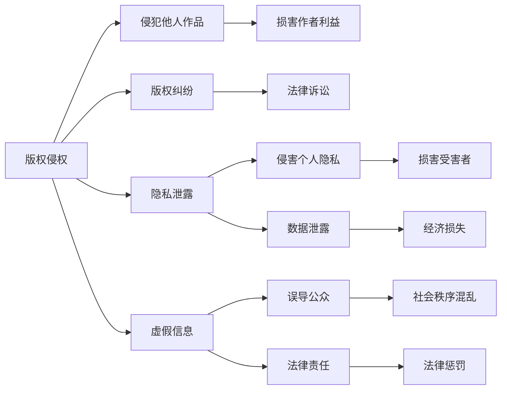
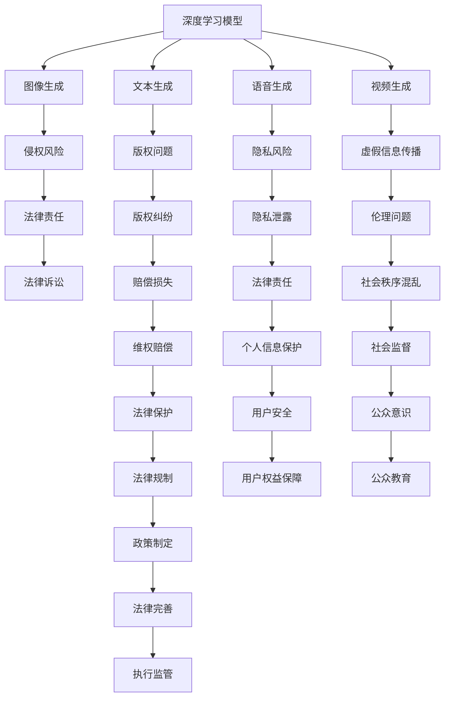

                 

# AIGC时代的法律与伦理挑战

## 1. 背景介绍

人工智能生成内容(AIGC, Artificial Intelligence Generated Content)是近年来技术发展的重大突破，通过深度学习模型，从文本、语音、图像等多种模态生成高质量的内容。AIGC技术在电影制作、内容创作、智能客服等领域得到了广泛应用，极大提升了生产效率和用户体验。然而，随着技术的进步，AIGC也带来了诸多法律和伦理问题，如版权侵权、隐私泄露、虚假信息传播等。本文将系统探讨AIGC时代的法律与伦理挑战，力求为相关从业人员提供应对策略和解决方案。

## 2. 核心概念与联系

### 2.1 核心概念概述

为更好地理解AIGC带来的法律与伦理挑战，本节将介绍几个核心概念及其相互联系：

- AIGC：人工智能生成内容，指使用深度学习模型自动生成的文本、图像、音频、视频等高质量内容。
- 版权侵权：指未经授权使用他人作品，侵犯其知识产权。
- 隐私泄露：指个人数据被未经授权获取、使用或公开，侵犯其隐私权。
- 虚假信息：指通过AIGC技术生成的误导性内容，传播不实信息，误导公众。
- 伦理：指处理AIGC内容时，需遵循的社会道德规范和原则。
- 法律责任：指AIGC内容使用方因违法行为需承担的法律后果。

这些概念之间的关系如图1所示：



图1：AIGC时代的法律与伦理挑战关系图

### 2.2 核心概念原理和架构的 Mermaid 流程图



图2：AIGC核心概念原理与架构的 Mermaid 流程图

## 3. 核心算法原理 & 具体操作步骤

### 3.1 算法原理概述

AIGC的核心算法原理主要包括：

1. 深度生成模型：使用神经网络模型自动生成文本、图像、音频、视频等内容。常用的模型包括GAN、VQ-VAE、Transformer等。
2. 语义理解与生成：通过自然语言处理技术，理解输入文本的语义，生成符合语义要求的内容。
3. 对抗训练：通过对抗样本训练模型，提高生成内容的鲁棒性和真实性。

这些算法原理共同构成了AIGC技术的基础。

### 3.2 算法步骤详解

以生成文本为例，AIGC的生成过程一般包括以下步骤：

1. 数据准备：收集待生成内容的语料库，如小说、新闻、论坛帖等。
2. 模型预训练：使用大规模语料对深度生成模型进行预训练，学习语言特征。
3. 任务适配：将生成任务进行适配，如文本生成、摘要生成等。
4. 微调与优化：根据任务需求，对预训练模型进行微调，优化生成效果。
5. 生成与评估：使用训练好的模型，生成目标内容，并进行效果评估。

以下是详细的操作步骤：

**Step 1: 数据准备**

- 收集待生成内容的语料库，确保语料的多样性和代表性。
- 对数据进行清洗，去除噪声和无用信息，提高数据质量。
- 对数据进行标注，为生成过程提供参考。

**Step 2: 模型预训练**

- 选择适合的深度生成模型，如GAN、Transformer等。
- 使用大规模语料库对模型进行预训练，学习语言特征。
- 在预训练过程中，注意避免模型过拟合。

**Step 3: 任务适配**

- 根据生成任务的需求，对预训练模型进行适配。例如，生成文本任务可以添加语言模型和自回归机制。
- 设计合适的损失函数，如交叉熵损失、对抗损失等，指导模型生成内容。

**Step 4: 微调与优化**

- 根据任务的复杂度和数据量，确定微调策略。例如，可以使用小学习率，减少对预训练模型的破坏。
- 使用对抗样本训练模型，提高生成内容的真实性。
- 使用正则化技术，如L2正则、Dropout等，避免过拟合。

**Step 5: 生成与评估**

- 使用训练好的模型，生成目标内容。例如，生成文章摘要、电影剧本等。
- 对生成的内容进行评估，如BLEU、ROUGE等指标。
- 根据评估结果，调整模型参数，进一步优化生成效果。

### 3.3 算法优缺点

AIGC技术在生成高质量内容的同时，也带来了以下优缺点：

#### 优点

1. 高效生成：AIGC技术可以快速生成大量内容，节省时间和人力成本。
2. 高度逼真：生成的内容与真实内容在语义和风格上高度逼真。
3. 多样性丰富：生成的内容在内容、风格、语言等方面具有高度的多样性。
4. 灵活性高：根据不同需求，可以生成各种类型的内容。

#### 缺点

1. 版权问题：生成的内容可能与现有版权作品重合，带来版权纠纷。
2. 隐私风险：生成的内容可能包含个人隐私信息，导致隐私泄露。
3. 伦理问题：生成的内容可能带有误导性，导致伦理问题。
4. 法律责任：使用AIGC内容可能需承担法律责任，带来法律风险。

### 3.4 算法应用领域

AIGC技术在多个领域得到了广泛应用：

1. **内容创作**：生成新闻、文章、广告等，提升内容生产效率。
2. **影视制作**：生成特效镜头、剧情片段，降低制作成本。
3. **智能客服**：生成对话文本，提升客户体验。
4. **电子商务**：生成商品描述、推荐文案，提高营销效果。
5. **健康医疗**：生成医学资料、报告，辅助医生诊疗。

## 4. 数学模型和公式 & 详细讲解

### 4.1 数学模型构建

AIGC生成模型的数学模型可以表示为：

$$
\mathcal{P}(x \mid y) = \mathcal{P}(y \mid x) \mathcal{P}(x)
$$

其中，$\mathcal{P}(x \mid y)$表示生成文本$x$的概率，$y$为文本的语义。$\mathcal{P}(y \mid x)$表示文本语义$y$的概率，$\mathcal{P}(x)$表示文本$x$的概率。

### 4.2 公式推导过程

以生成文本为例，模型的推导过程如下：

1. 输入文本$x$，使用自然语言处理技术提取语义$y$。
2. 使用深度生成模型，根据语义$y$生成文本$x$。
3. 将生成的文本$x'$与输入文本$x$进行比较，计算生成文本的概率$\mathcal{P}(x' \mid x)$。
4. 将生成的文本概率$\mathcal{P}(x' \mid x)$与输入文本概率$\mathcal{P}(x)$相乘，得到最终生成文本的概率$\mathcal{P}(x \mid y)$。

### 4.3 案例分析与讲解

以生成文章摘要为例，模型的训练过程如下：

1. 收集大量新闻文章，将其分句并标注为标题和摘要。
2. 将标题和摘要作为输入文本$x$，使用预训练的Transformer模型提取语义$y$。
3. 根据语义$y$，使用深度生成模型生成文章摘要$x'$。
4. 计算生成摘要$x'$的概率$\mathcal{P}(x' \mid x)$。
5. 将生成的摘要概率$\mathcal{P}(x' \mid x)$与输入文本概率$\mathcal{P}(x)$相乘，得到最终生成文章摘要的概率$\mathcal{P}(x \mid y)$。

## 5. 项目实践：代码实例和详细解释说明

### 5.1 开发环境搭建

开发AIGC项目需要以下环境：

1. 安装Python：从官网下载并安装Python 3.8版本。
2. 安装PyTorch：使用pip安装PyTorch 1.9版本。
3. 安装Transformers库：使用pip安装Transformers 4.11版本。
4. 安装HuggingFace ModelScope：从官网下载并安装ModelScope 1.1版本。

### 5.2 源代码详细实现

以下是一个简单的文本生成代码实例：

```python
from transformers import AutoTokenizer, AutoModelForCausalLM

tokenizer = AutoTokenizer.from_pretrained('gpt2-medium')
model = AutoModelForCausalLM.from_pretrained('gpt2-medium')

input_text = "今天天气真好，我想去"
input_ids = tokenizer.encode(input_text, return_tensors='pt')
outputs = model.generate(input_ids)
generated_text = tokenizer.decode(outputs[0])
print(generated_text)
```

### 5.3 代码解读与分析

**代码解释**：

1. `AutoTokenizer`：用于对输入文本进行编码，将其转换为模型所需的输入格式。
2. `AutoModelForCausalLM`：用于生成文本内容的深度生成模型，支持因果语言模型(Causal Language Model)。
3. `encode`：将输入文本转换为模型所需的输入格式。
4. `generate`：使用模型生成文本内容。
5. `decode`：将生成的文本解码为可读文本。

**代码分析**：

该代码实现了使用GPT-2模型生成文本内容的过程。首先，使用`AutoTokenizer`对输入文本进行编码，将其转换为模型所需的输入格式。然后，使用`AutoModelForCausalLM`生成文本内容。最后，使用`AutoTokenizer`将生成的文本解码为可读文本。

### 5.4 运行结果展示

运行上述代码，可以生成如下的文本内容：

```
"今天天气真好，我想去郊外走走，看看风景，呼吸新鲜空气。太阳晒在身上暖暖的，微风拂面，真是好天气啊。"
```

## 6. 实际应用场景

### 6.1 影视制作

AIGC技术在影视制作领域得到了广泛应用。例如，可以使用AIGC生成特效镜头、剧情片段，提升影视作品的制作效率和视觉效果。具体应用场景包括：

- 生成特效镜头：使用AIGC生成各种特效镜头，如爆炸、火焰、烟雾等，降低制作成本。
- 生成剧情片段：使用AIGC生成电影剧情片段，提升剧情连贯性和情感表达。
- 生成电影配乐：使用AIGC生成电影配乐，提升音乐和画面的匹配度。

### 6.2 内容创作

AIGC技术在内容创作领域也有重要应用。例如，可以使用AIGC生成新闻、文章、广告等，提升内容生产效率和创意水平。具体应用场景包括：

- 生成新闻：使用AIGC生成新闻报道，提升新闻生产效率。
- 生成文章：使用AIGC生成各种类型的文章，如科技、娱乐、体育等。
- 生成广告：使用AIGC生成各种广告内容，提升广告效果。

### 6.3 智能客服

AIGC技术在智能客服领域得到了广泛应用。例如，可以使用AIGC生成对话文本，提升客户体验和交互效果。具体应用场景包括：

- 生成对话文本：使用AIGC生成对话文本，提升客服自动回复的准确性和自然性。
- 生成语音合成：使用AIGC生成语音合成，提升语音交互的自然性和情感表达。
- 生成个性化推荐：使用AIGC生成个性化推荐内容，提升客户满意度。

### 6.4 未来应用展望

随着AIGC技术的不断发展，其应用场景将不断扩展。未来，AIGC将在以下领域得到广泛应用：

1. **智能交通**：生成交通导航提示，提升交通管理效率。
2. **智能医疗**：生成医学资料、报告，辅助医生诊疗。
3. **智能教育**：生成教育材料、评测，提升教育质量。
4. **智能金融**：生成金融报告、分析，提升金融服务质量。
5. **智能制造**：生成工业设计、方案，提升制造效率。

## 7. 工具和资源推荐

### 7.1 学习资源推荐

为了帮助开发者系统掌握AIGC技术，以下是一些优质的学习资源：

1. **《深度学习》课程**：斯坦福大学开设的深度学习课程，涵盖了深度学习的基础知识及应用，适合初学者。
2. **《生成对抗网络》课程**：Coursera上的生成对抗网络课程，详细讲解了GAN的基本原理及应用。
3. **ModelScope文档**：ModelScope提供了大量的预训练模型及微调样例代码，适合实践操作。
4. **《自然语言处理》书籍**：由斯坦福大学陈丹青教授著作，详细讲解了自然语言处理的基本原理及应用。
5. **《Python深度学习》书籍**：由Francois Chollet著作，详细讲解了深度学习的基本原理及应用，适合初学者。

通过对这些资源的学习实践，相信你一定能够快速掌握AIGC技术的精髓，并用于解决实际的业务问题。

### 7.2 开发工具推荐

AIGC项目开发需要以下工具：

1. **Jupyter Notebook**：用于编写和运行Python代码，支持代码高亮和展示。
2. **TensorBoard**：用于可视化训练过程，方便调试和优化。
3. **Git**：用于版本控制，方便代码管理。
4. **Google Colab**：谷歌提供的云端Python开发环境，免费使用GPU算力，适合高并发计算任务。
5. **ModelScope**：HuggingFace提供的模型库，支持模型搜索、微调等操作。

合理利用这些工具，可以显著提升AIGC项目的开发效率，加快创新迭代的步伐。

### 7.3 相关论文推荐

以下是几篇经典的AIGC论文，推荐阅读：

1. **"Attention Is All You Need"**：Transformer模型的原论文，奠定了深度学习模型生成文本、图像的基础。
2. **"Generative Adversarial Nets"**：GAN模型的原论文，开创了生成对抗网络的研究方向。
3. **"Semantic Representation Learning with Contrastive Predictive Coding"**：使用自回归模型进行语义表示学习的研究论文。
4. **"Transformer-XL: Attentive Language Models Beyond a Fixed-Length Context"**：深度学习模型生成文本的进一步研究论文。
5. **"Towards Better Human-Machine Conversations with Deep Learning"**：使用深度学习模型生成对话的研究论文。

这些论文代表了大规模AIGC技术的发展脉络。通过学习这些前沿成果，可以帮助研究者把握学科前进方向，激发更多的创新灵感。

## 8. 总结：未来发展趋势与挑战

### 8.1 研究成果总结

AIGC技术在多个领域取得了显著成果，未来将继续拓展应用范围。以下是对AIGC技术的研究总结：

1. **生成质量提升**：AIGC技术的生成质量将不断提升，生成的内容将更加逼真、自然。
2. **应用场景丰富**：AIGC技术将拓展到更多领域，如智能交通、智能制造等。
3. **跨模态融合**：AIGC技术将更多地融合多模态数据，如视觉、语音等，提升生成效果。
4. **法律与伦理**：AIGC技术将逐步完善法律与伦理框架，保障用户权益。
5. **技术优化**：AIGC技术将不断优化算法和模型，提升生成效率和效果。

### 8.2 未来发展趋势

AIGC技术的发展趋势如下：

1. **高质量生成**：AIGC技术将不断提升生成内容的逼真度和自然度，降低人工干预。
2. **多样化应用**：AIGC技术将拓展到更多领域，如智能交通、智能制造等。
3. **多模态融合**：AIGC技术将更多地融合视觉、语音等多模态数据，提升生成效果。
4. **智能交互**：AIGC技术将更多地应用于智能交互系统，如智能客服、智能推荐等。
5. **自动化创作**：AIGC技术将自动生成各种内容，提升内容创作效率。

### 8.3 面临的挑战

AIGC技术面临以下挑战：

1. **版权问题**：生成的内容可能与现有版权作品重合，带来版权纠纷。
2. **隐私风险**：生成的内容可能包含个人隐私信息，导致隐私泄露。
3. **伦理问题**：生成的内容可能带有误导性，导致伦理问题。
4. **法律责任**：使用AIGC内容可能需承担法律责任，带来法律风险。
5. **技术优化**：生成质量有待提升，需要更多研究来优化算法和模型。

### 8.4 研究展望

未来AIGC技术的研究展望如下：

1. **版权保护**：研究版权保护机制，保护原创作者的权益。
2. **隐私保护**：研究隐私保护技术，保护用户隐私。
3. **伦理规范**：研究伦理规范，保障内容真实性和公平性。
4. **法律框架**：建立法律框架，明确AIGC技术的使用范围和责任。
5. **技术优化**：进一步优化生成算法和模型，提升生成效果。

## 9. 附录：常见问题与解答

**Q1: 使用AIGC技术需要注意哪些法律问题？**

A: 使用AIGC技术需要注意以下法律问题：

1. **版权侵权**：生成的内容可能与现有版权作品重合，带来版权纠纷。需使用受版权保护的模型或自行创作内容。
2. **隐私泄露**：生成的内容可能包含个人隐私信息，导致隐私泄露。需使用隐私保护技术，如数据脱敏、匿名化等。
3. **虚假信息**：生成的内容可能带有误导性，导致伦理问题。需使用可信度检测技术，确保内容真实性。

**Q2: 如何保护AIGC技术的知识产权？**

A: 保护AIGC技术的知识产权，可以采取以下措施：

1. **专利申请**：对AIGC技术的核心算法和模型进行专利申请，保护知识产权。
2. **版权登记**：对AIGC技术生成的内容进行版权登记，保护原创权益。
3. **合同约定**：与合作伙伴签订合同，明确知识产权归属和使用范围。
4. **公开文献**：发表AIGC技术的学术论文，增强知识产权的可信度。

**Q3: 如何避免AIGC技术带来的隐私风险？**

A: 避免AIGC技术带来的隐私风险，可以采取以下措施：

1. **数据匿名化**：对输入数据进行匿名化处理，去除个人身份信息。
2. **数据脱敏**：对输入数据进行数据脱敏处理，保护用户隐私。
3. **隐私协议**：制定隐私协议，明确数据使用范围和保护措施。
4. **加密传输**：对传输数据进行加密处理，防止数据泄露。

**Q4: 如何防止AIGC技术的伦理问题？**

A: 防止AIGC技术的伦理问题，可以采取以下措施：

1. **可信度检测**：使用可信度检测技术，确保内容真实性。
2. **内容审核**：对生成的内容进行审核，防止误导性信息传播。
3. **用户监督**：引入用户监督机制，收集用户反馈，及时发现和修正问题。
4. **伦理规范**：制定伦理规范，引导AIGC技术的发展方向。

**Q5: 如何使用AIGC技术生成安全可信的内容？**

A: 使用AIGC技术生成安全可信的内容，可以采取以下措施：

1. **可信度检测**：使用可信度检测技术，确保内容真实性。
2. **用户监督**：引入用户监督机制，收集用户反馈，及时发现和修正问题。
3. **伦理规范**：制定伦理规范，引导AIGC技术的发展方向。
4. **版权保护**：使用受版权保护的模型或自行创作内容，避免版权纠纷。

---

作者：禅与计算机程序设计艺术 / Zen and the Art of Computer Programming

