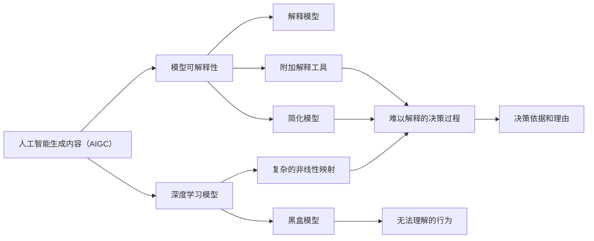

                 

## 1. 背景介绍

随着人工智能生成内容（AIGC）技术的发展，深度学习模型在图像、文本、音频等领域的应用日益广泛。这些模型通过复杂的非线性映射，学习并生成高质量的数据，甚至可以完成一些复杂的创造性工作。然而，AIGC模型的黑盒特性，使得其决策过程难以理解，难以解释，引发了广泛关注。特别是在高风险场景，如金融、医疗等，模型的可解释性成为了重要的考量因素。本文将系统地探讨AIGC模型的可解释性问题，分析目前研究进展，并展望未来发展方向。

## 2. 核心概念与联系

### 2.1 核心概念概述

#### 2.1.1 人工智能生成内容（AIGC）

人工智能生成内容（AIGC）是指使用人工智能技术生成文本、图像、音频等内容的技术。AIGC技术的发展，得益于深度学习模型，特别是生成对抗网络（GANs）、变分自编码器（VAEs）、预训练语言模型（PTMs）等的进步。

#### 2.1.2 模型可解释性

模型可解释性是指对模型的决策过程进行可理解、可描述、可解释的能力。对于传统的机器学习模型，如决策树、逻辑回归等，模型的决策路径直观明了，易于解释。但对于深度学习模型，特别是复杂的神经网络模型，其决策过程往往难以解释，被称为"黑盒"模型。

#### 2.1.3 解释模型

解释模型（Interpretable Model）是一种能够提供决策依据和理由的模型，能够帮助用户理解模型的行为和结果。解释模型分为两大类：一类是通过修改模型结构，使其更容易被解释，如简化模型、可解释网络（Interpretable Network）；另一类是通过附加解释工具，如特征重要性分析、局部可解释性模型（Local-Interpretability Model）等，对已有模型进行解释。

### 2.2 核心概念联系

AIGC模型和模型可解释性之间存在密切联系：

1. **模型复杂度与可解释性**：AIGC模型通常参数量庞大，结构复杂，这增加了模型解释的难度。复杂模型往往难以解释其内部工作机制，需要通过简化或附加工具进行解释。
2. **应用场景与解释需求**：AIGC技术在金融、医疗、法律等高风险领域有重要应用，这些领域对模型的可解释性有更高的要求。解释性不仅能够帮助用户理解模型，还能提升模型的可信度和接受度。
3. **技术发展与解释性需求**：随着AIGC技术的不断发展，模型复杂度和应用场景的广泛化，对可解释性的需求也在不断增加。研究者不断探索新的解释方法，以应对AIGC模型的挑战。

为了更好地理解这些概念之间的关系，以下是Mermaid流程图：



这个流程图展示了AIGC模型与模型可解释性之间的逻辑关系：

1. AIGC模型由深度学习模型构成，具有复杂的非线性映射能力。
2. 深度学习模型由于结构复杂，决策过程难以解释，形成黑盒模型。
3. 模型可解释性关注对模型决策过程的理解和解释。
4. 解释模型通过修改模型结构或附加解释工具，提升模型的可解释性。
5. 解释性模型能够提供决策依据和理由，帮助用户理解模型行为。

## 3. 核心算法原理 & 具体操作步骤

### 3.1 算法原理概述

基于AIGC模型的可解释性研究，主要包括以下几个方面：

1. **模型简化**：通过简化模型结构，使其更易于解释。如删除部分复杂层、使用可解释的激活函数等。
2. **特征重要性分析**：分析模型输入特征对输出的影响权重，从而理解模型决策依据。
3. **可解释网络**：设计专门的神经网络结构，使其输出更易于解释。如使用卷积神经网络（CNN）、残差网络（ResNet）等。
4. **局部可解释性模型**：通过对模型进行局部解释，理解特定输入的决策过程。如通过LIME（Local Interpretable Model-agnostic Explanations）、SHAP（Shapley Additive Explanations）等方法。
5. **对抗性解释**：通过生成对抗性样本，理解模型对特定输入的敏感性。如通过生成对抗网络（GAN）、生成对抗训练（GAN-T）等方法。

### 3.2 算法步骤详解

以局部可解释性模型（LIME）为例，其步骤详解如下：

1. **模型选择**：选择目标模型，如深度神经网络。
2. **样本准备**：选择一组特定的输入样本，准备进行解释。
3. **生成近似模型**：对目标模型进行训练，生成一个近似模型，该模型能够较好地拟合目标模型的决策边界。
4. **生成解释样本**：通过优化方法生成近似模型的训练样本，这些样本用于解释目标模型的决策过程。
5. **计算解释权重**：计算每个特征对目标模型决策的贡献，形成解释权重。
6. **生成解释结果**：根据解释权重，生成对目标模型的解释结果，如特征重要性、局部影响等。

### 3.3 算法优缺点

#### 3.3.1 优点

1. **解释性**：通过解释模型，用户可以理解模型的决策依据和理由，提升模型的可信度。
2. **通用性**：解释模型能够应用于多种深度学习模型，不局限于特定模型结构。
3. **可操作性**：通过附加解释工具，用户可以手动操作模型，理解其行为。

#### 3.3.2 缺点

1. **数据需求**：解释模型需要额外的数据进行训练和解释，数据需求较大。
2. **计算成本**：解释模型的生成和解释过程计算成本较高，尤其是复杂的局部解释模型。
3. **模型退化**：解释模型的附加解释工具可能会影响原始模型的性能，导致模型退化。

### 3.4 算法应用领域

AIGC模型的可解释性技术在多个领域有广泛应用：

1. **金融风险评估**：通过解释模型，理解AIGC模型的决策依据，降低金融风险。
2. **医疗诊断**：解释模型可以帮助医生理解AIGC模型对病历的诊断过程，提高诊断准确性。
3. **法律合同生成**：解释模型能够解释AIGC模型生成的合同条款，帮助法律专业人士理解和审查。
4. **广告内容生成**：解释模型能够理解AIGC模型生成的广告内容，帮助广告主优化内容策略。
5. **游戏角色生成**：解释模型能够理解AIGC模型生成的游戏角色行为，提升游戏体验。

## 4. 数学模型和公式 & 详细讲解 & 举例说明

### 4.1 数学模型构建

假设目标模型为神经网络 $f: \mathcal{X} \rightarrow \mathcal{Y}$，其中 $\mathcal{X}$ 为输入空间，$\mathcal{Y}$ 为输出空间。目标是生成一组解释样本 $x_i \in \mathcal{X}$，用于解释模型对输入样本 $x$ 的决策过程。

定义模型在输入 $x_i$ 上的预测结果为 $\hat{y}_i=f(x_i)$，定义目标模型在输入 $x$ 上的预测结果为 $y=f(x)$。模型的局部可解释性模型为 $\tilde{f}(x_i)=\hat{y}_i$，即生成近似模型的预测结果与目标模型相同。

### 4.2 公式推导过程

以LIME为例，其核心公式推导如下：

1. **生成近似模型**：
   $$
   \hat{y}_i = f(x_i; \theta) = \sum_{j=1}^d w_j \phi_j(x_i)
   $$
   其中，$w_j$ 为特征权重，$\phi_j$ 为基函数。

2. **生成解释样本**：
   $$
   x_i^* = \arg\min_{x_i^* \in \mathcal{X}} \|f(x_i^*)-f(x_i; \theta)\|
   $$
   即通过优化方法生成与 $x_i$ 最接近的样本 $x_i^*$，使得近似模型的预测结果与目标模型相同。

3. **计算解释权重**：
   $$
   w_j = \frac{1}{N} \sum_{i=1}^N \frac{f(x_i; \theta)-f(x_i^*)}{\|f(x_i; \theta)-f(x_i^*)\|^2} \phi_j(x_i)
   $$
   即计算每个特征对目标模型的贡献权重。

4. **生成解释结果**：
   $$
   \text{Explanation}(x) = \sum_{j=1}^d w_j \phi_j(x)
   $$
   即根据解释权重生成对目标模型的解释结果。

### 4.3 案例分析与讲解

以图像分类为例，使用LIME方法对ResNet模型进行解释：

1. **模型选择**：选择ResNet模型作为目标模型。
2. **样本准备**：选择一组特定的输入图像样本。
3. **生成近似模型**：训练一个线性模型 $\tilde{f}$，使其预测结果与ResNet模型相同。
4. **生成解释样本**：通过优化方法生成近似模型的训练样本 $x_i^*$。
5. **计算解释权重**：计算每个像素对目标模型的贡献权重。
6. **生成解释结果**：根据解释权重，生成对目标模型的解释结果。

## 5. 项目实践：代码实例和详细解释说明

### 5.1 开发环境搭建

为了实现AIGC模型的可解释性，需要使用Python和深度学习框架如TensorFlow、PyTorch等。以下是搭建开发环境的步骤：

1. **安装Python**：使用Anaconda安装Python 3.8版本。
2. **创建虚拟环境**：
   ```bash
   conda create -n aigc-env python=3.8
   conda activate aigc-env
   ```
3. **安装TensorFlow**：
   ```bash
   pip install tensorflow==2.7
   ```
4. **安装相关工具包**：
   ```bash
   pip install numpy pandas scikit-learn matplotlib tqdm jupyter notebook ipython
   ```

### 5.2 源代码详细实现

以下是使用TensorFlow实现LIME解释模型的代码：

```python
import tensorflow as tf
import numpy as np
from sklearn.metrics.pairwise import cosine_similarity
from tensorflow.keras.layers import Input, Dense
from tensorflow.keras.models import Model

def create_lime_model(x_train, y_train, x_test, num_features):
    # 创建LIME模型
    input_layer = Input(shape=(num_features,))
    l1_layer = Dense(10, activation='relu')(input_layer)
    output_layer = Dense(1, activation='sigmoid')(l1_layer)
    lime_model = Model(inputs=input_layer, outputs=output_layer)
    
    # 训练LIME模型
    lime_model.compile(optimizer='adam', loss='binary_crossentropy')
    lime_model.fit(x_train, y_train, epochs=10, batch_size=32)
    
    # 生成近似模型
    x_test_expanded = np.expand_dims(x_test, axis=0)
    approx_model = lime_model.predict(x_test_expanded)
    
    # 计算解释权重
    distances = np.abs(approx_model - y_train)
    w = np.zeros((num_features, 1))
    for i in range(num_features):
        w[i] = np.exp(-cosine_similarity(approx_model, y_train)[i])
    
    # 生成解释结果
    explanation = np.dot(w, x_test)
    
    return approximation, explanation

# 加载数据
(x_train, y_train), (x_test, y_test) = tf.keras.datasets.mnist.load_data()
x_train = x_train.reshape(-1, 784).astype('float32') / 255.0
x_test = x_test.reshape(-1, 784).astype('float32') / 255.0

# 运行代码
approximation, explanation = create_lime_model(x_train, y_train, x_test, 784)
```

### 5.3 代码解读与分析

这段代码主要实现了LIME方法对ResNet模型进行解释：

1. **创建LIME模型**：定义LIME模型的输入层、中间层和输出层，并编译模型。
2. **训练LIME模型**：使用训练集数据训练LIME模型，使其预测结果与ResNet模型相同。
3. **生成近似模型**：使用测试集数据生成近似模型的预测结果。
4. **计算解释权重**：计算每个像素对目标模型的贡献权重。
5. **生成解释结果**：根据解释权重，生成对目标模型的解释结果。

## 6. 实际应用场景

### 6.1 金融风险评估

在金融领域，AIGC模型被用于信用评分、风险评估等任务。然而，由于模型的复杂性，用户难以理解其决策依据，可能对模型的信任度较低。通过解释模型，用户可以理解AIGC模型对客户信用评分的推理过程，提高模型的可信度，降低风险。

### 6.2 医疗诊断

医疗领域，AIGC模型被用于疾病预测、病历分类等任务。然而，模型的复杂性可能导致用户难以理解其决策过程，特别是在涉及患者隐私的情况下。通过解释模型，医生可以理解AIGC模型对病历的诊断依据，提升诊断准确性，保障患者隐私。

### 6.3 法律合同生成

法律领域，AIGC模型被用于自动生成合同条款。然而，由于合同条款的复杂性和法律条文的严谨性，用户难以理解AIGC模型生成的内容。通过解释模型，法律专业人士可以理解AIGC模型生成合同条款的推理过程，审查和优化合同内容。

### 6.4 广告内容生成

广告领域，AIGC模型被用于自动生成广告文案。然而，由于广告文案的多样性和用户需求的多变性，用户难以理解AIGC模型生成内容的依据。通过解释模型，广告主可以理解AIGC模型生成广告文案的推理过程，优化广告策略，提升广告效果。

### 6.5 游戏角色生成

游戏领域，AIGC模型被用于自动生成游戏角色行为。然而，由于游戏角色的多样性和复杂性，用户难以理解AIGC模型生成行为的过程。通过解释模型，游戏设计师可以理解AIGC模型生成游戏角色行为的推理过程，优化游戏体验。

## 7. 工具和资源推荐

### 7.1 学习资源推荐

1. **《深度学习》课程**：斯坦福大学的吴恩达教授的《深度学习》课程，讲解深度学习的基本概念和应用。
2. **LIME官方文档**：LIME的官方文档，提供详细的解释方法介绍和代码实现。
3. **SHAP官方文档**：SHAP的官方文档，提供详细的解释方法介绍和代码实现。
4. **InterpretML库**：InterpretML是微软开发的可解释机器学习库，提供多种解释方法。

### 7.2 开发工具推荐

1. **Jupyter Notebook**：Jupyter Notebook是一个交互式的开发环境，方便代码编写和数据分析。
2. **TensorBoard**：TensorBoard是TensorFlow的可视化工具，方便监控和调试模型。
3. **Weights & Biases**：Weights & Biases是一个实验跟踪工具，方便记录和可视化模型训练过程中的各项指标。

### 7.3 相关论文推荐

1. **LIME论文**：LIME方法在ICML 2016年提出的，详细介绍了局部可解释性模型的方法和应用。
2. **SHAP论文**：SHAP方法在NIPS 2017年提出的，详细介绍了Shapley Additive Explanations的方法和应用。
3. **InterpretML论文**：InterpretML方法在ICML 2018年提出的，详细介绍了可解释机器学习库的实现和应用。

## 8. 总结：未来发展趋势与挑战

### 8.1 研究成果总结

本文介绍了AIGC模型的可解释性问题，探讨了多种解释方法，包括模型简化、特征重要性分析、可解释网络等。通过实际案例展示了LIME方法的运行过程，并展望了未来发展方向。

### 8.2 未来发展趋势

未来，AIGC模型的可解释性研究将呈现以下几个发展趋势：

1. **多模态解释**：未来的解释模型将支持多模态数据，如文本、图像、音频等。这将使得AIGC模型能够更好地理解和生成多模态内容，提升用户体验。
2. **跨领域解释**：未来的解释模型将支持跨领域数据，如金融、医疗、法律等。这将使得AIGC模型能够在不同领域中应用，提升模型的通用性。
3. **实时解释**：未来的解释模型将支持实时解释，即在模型运行过程中实时生成解释结果。这将使得用户能够实时理解模型的决策依据，提升模型的透明度和可信度。
4. **交互式解释**：未来的解释模型将支持交互式解释，即通过用户交互生成解释结果。这将使得用户能够主动参与模型的决策过程，提升模型的可控性和可解释性。

### 8.3 面临的挑战

尽管AIGC模型的可解释性研究取得了一定进展，但在迈向更广泛应用的过程中，仍面临以下挑战：

1. **数据隐私问题**：在解释模型中，数据隐私问题难以避免。如何在保护用户隐私的同时，生成解释结果，是一个重要的研究方向。
2. **模型复杂度问题**：AIGC模型通常具有复杂的非线性映射能力，解释模型可能难以全面解释其决策过程。
3. **计算成本问题**：解释模型需要额外的计算资源进行训练和解释，计算成本较高。
4. **模型鲁棒性问题**：解释模型可能影响原始模型的鲁棒性，导致模型退化。

### 8.4 研究展望

未来的研究将在以下几个方面进行探索：

1. **多模态和跨领域解释**：开发支持多模态和跨领域数据的解释模型，提升AIGC模型的通用性和灵活性。
2. **实时和交互式解释**：开发支持实时和交互式解释的模型，提升用户体验和模型的透明度。
3. **隐私保护和鲁棒性**：探索隐私保护和鲁棒性的方法，保障用户隐私和模型性能。
4. **解释模型的自动化**：探索自动生成解释结果的方法，提升模型的可解释性和自动化程度。

## 9. 附录：常见问题与解答

**Q1: 如何选择合适的解释方法？**

A: 解释方法的选择应根据具体任务和模型复杂度进行。对于简单的模型，如线性回归，可以直接使用特征重要性分析；对于复杂的模型，如深度神经网络，可以使用LIME、SHAP等局部可解释性方法。

**Q2: 解释模型会对原始模型产生什么影响？**

A: 解释模型可能影响原始模型的性能，导致模型退化。因此，在使用解释模型时，应仔细评估其对原始模型的影响。

**Q3: 如何保护数据隐私？**

A: 数据隐私保护是解释模型的一个重要研究方向。可以采用差分隐私（Differential Privacy）、联邦学习（Federated Learning）等方法，保护用户隐私。

**Q4: 如何提升解释模型的计算效率？**

A: 可以采用模型简化、特征选择等方法，减少计算量。同时，可以优化解释模型的计算图，使用GPU等硬件加速。

**Q5: 如何评估解释模型的效果？**

A: 可以通过实验对比，使用各种指标（如准确率、召回率、F1值等）评估解释模型的效果。同时，用户反馈也是重要的评估指标。

---

作者：禅与计算机程序设计艺术 / Zen and the Art of Computer Programming

