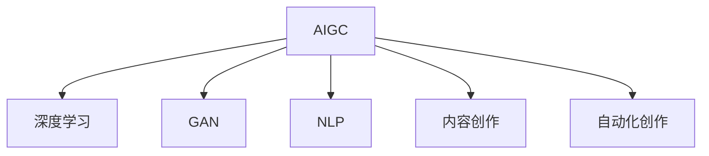

                 

# AIGC重塑文化娱乐产业

> 关键词：人工智能生成内容(AIGC), 文化娱乐产业, 音乐生成, 图像生成, 视频生成, 自然语言处理(NLP), 内容创作, 自动化创作

## 1. 背景介绍

### 1.1 问题由来
随着人工智能技术的飞速发展，人工智能生成内容(AIGC)逐渐成为文化娱乐产业的热门话题。AIGC 通过深度学习、生成对抗网络 (GAN) 和自然语言处理 (NLP) 等技术，能够自动生成高质量的音乐、图像、视频、文本等娱乐内容。这些内容不仅丰富了文化娱乐产业的内容供给，还大大降低了内容创作的成本，引领了文化娱乐产业的一次变革。

### 1.2 问题核心关键点
AIGC 对文化娱乐产业的影响主要体现在以下几个方面：

- 内容丰富度提升：AIGC 能够自动化生成大量高质量内容，极大地丰富了内容资源库，满足了用户多样化的娱乐需求。
- 创作成本降低：自动化的内容生成流程降低了人力成本，提高了创作效率，使小型企业和个人创作者能够更好地参与市场竞争。
- 交互体验改进：AIGC 使得用户能够与内容进行更自然的交互，增强了娱乐体验的互动性和沉浸感。
- 商业模式创新：AIGC 催生了内容订阅、用户生成内容 (UGC) 和版权交易等新商业模式，为文化娱乐产业带来了新的增长点。

## 2. 核心概念与联系

### 2.1 核心概念概述

为更好地理解 AIGC 对文化娱乐产业的变革，本节将介绍几个密切相关的核心概念：

- 人工智能生成内容(AIGC)：利用人工智能技术自动生成的多媒体内容，包括音乐、图像、视频和文本等。
- 深度学习：基于神经网络的机器学习技术，能够从大量数据中学习模式，并自动生成新的内容。
- 生成对抗网络(GAN)：一种通过对抗训练生成高质量图像和视频的深度学习模型。
- 自然语言处理(NLP)：研究如何让计算机理解和生成人类语言的科学，广泛应用于文本生成和语义理解等任务。
- 内容创作：包括音乐创作、影视制作、小说编写等，是文化娱乐产业的重要组成部分。
- 自动化创作：利用 AIGC 技术自动生成内容，减少了创作者的手动劳动。

这些核心概念之间的逻辑关系可以通过以下 Mermaid 流程图来展示：



这个流程图展示了大语言模型的核心概念及其之间的关系：

1. AIGC 以深度学习为基础，通过 GAN 和 NLP 技术实现内容生成。
2. AIGC 应用于内容创作，自动生成音乐、图像、视频和文本。
3. AIGC 实现了自动化创作，减少了创作者的手动劳动。

这些概念共同构成了 AIGC 技术的工作原理和应用场景，使其能够在大规模内容生成和交互体验改进方面发挥重要作用。

## 3. 核心算法原理 & 具体操作步骤
### 3.1 算法原理概述

AIGC 的核心算法原理主要涉及以下几个方面：

- **深度学习模型**：利用神经网络模型对大量数据进行学习，生成新的内容。
- **生成对抗网络(GAN)**：通过对抗训练生成高质量的图像和视频内容。
- **自然语言处理(NLP)**：利用语言模型生成自然流畅的文本内容。
- **优化算法**：如 Adam、SGD 等，用于最小化损失函数，优化模型参数。

基于这些算法原理，AIGC 能够自动化生成多样化的多媒体内容。

### 3.2 算法步骤详解

AIGC 生成内容的过程通常包括以下几个关键步骤：

1. **数据收集**：收集大量标注数据，用于训练深度学习模型。
2. **模型训练**：使用标注数据训练深度学习模型，生成初步内容。
3. **优化调整**：使用对抗训练等方法，优化模型生成内容的细节和质量。
4. **内容生成**：将训练好的模型应用于新的数据生成高质量的内容。
5. **内容输出**：将生成的内容发布到网络平台，供用户访问和交互。

### 3.3 算法优缺点

AIGC 生成内容具有以下优点：

- **高效性**：自动化生成内容，大大缩短了创作周期。
- **成本低**：减少了人力成本，降低了内容创作门槛。
- **多样性**：能够生成多种类型的内容，丰富了内容库。

然而，AIGC 也存在以下缺点：

- **质量参差不齐**：初期生成的内容质量可能不稳定，需要经过多次优化调整。
- **版权问题**：自动生成的内容可能涉及版权争议，需要严格监管。
- **缺乏创新性**：自动生成内容可能缺乏原创性，需要人工干预和创新。

### 3.4 算法应用领域

AIGC 技术在文化娱乐产业中的应用广泛，包括但不限于以下几个方面：

- **音乐生成**：自动生成流行音乐、爵士乐等，满足用户个性化需求。
- **图像生成**：自动生成肖像、风景等高质量图片，应用于广告、设计等领域。
- **视频生成**：自动生成短片、动画等视频内容，应用于影视、游戏等领域。
- **文本生成**：自动生成新闻、小说、剧本等文本内容，应用于新闻媒体、娱乐等领域。
- **游戏内容生成**：自动生成游戏角色、任务、场景等，提高游戏开发效率。

## 4. 数学模型和公式 & 详细讲解 & 举例说明

### 4.1 数学模型构建

AIGC 生成内容的过程可以建模为如下形式：

$$
y = f(x; \theta)
$$

其中，$y$ 表示生成的内容，$x$ 表示输入的数据，$\theta$ 表示模型参数。

### 4.2 公式推导过程

以生成对抗网络 (GAN) 为例，GAN 包含一个生成器 (Generator) 和一个判别器 (Discriminator)。生成器的目标是最小化生成内容与真实内容的差异，而判别器的目标是最小化生成内容被正确识别的概率。具体推导如下：

1. **生成器 (Generator)**：生成器的输入为随机噪声 $z$，输出为生成的内容 $y$。其目标是生成尽可能接近真实内容的数据。

$$
y_G = G(z)
$$

2. **判别器 (Discriminator)**：判别器的输入为真实数据 $x$ 和生成数据 $y_G$，输出为生成数据是真实数据的概率 $p$。其目标是最大化生成数据被正确识别的概率。

$$
p_D = D(x, y_G)
$$

3. **对抗训练**：GAN 通过对抗训练优化生成器和判别器的参数。具体为：

$$
\min_G \max_D V(D, G) = \mathbb{E}_{x \sim p_x} \log D(x) + \mathbb{E}_{z \sim p_z} \log(1 - D(G(z)))
$$

其中，$V(D, G)$ 表示对抗损失函数，$D$ 和 $G$ 分别表示判别器和生成器的参数。

### 4.3 案例分析与讲解

以音乐生成为例，利用深度学习模型训练生成音乐序列。假设训练集为 $(x_i, y_i)$，其中 $x_i$ 为输入的音乐谱序列，$y_i$ 为对应的输出音乐谱序列。音乐生成模型可以使用循环神经网络 (RNN) 或卷积神经网络 (CNN) 等模型。

具体步骤为：

1. **数据准备**：收集大量音乐谱序列，将其分为训练集和测试集。
2. **模型训练**：使用训练集数据训练音乐生成模型，生成音乐谱序列。
3. **优化调整**：使用均方误差 (MSE) 等损失函数优化模型参数。
4. **内容生成**：将训练好的模型应用于新的输入数据生成音乐谱序列。
5. **评估与发布**：在测试集上评估生成音乐的质量，并发布到音乐平台。

## 5. 项目实践：代码实例和详细解释说明
### 5.1 开发环境搭建

在进行 AIGC 实践前，我们需要准备好开发环境。以下是使用Python进行TensorFlow开发的环境配置流程：

1. 安装Anaconda：从官网下载并安装Anaconda，用于创建独立的Python环境。

2. 创建并激活虚拟环境：
```bash
conda create -n tf-env python=3.8 
conda activate tf-env
```

3. 安装TensorFlow：根据CUDA版本，从官网获取对应的安装命令。例如：
```bash
conda install tensorflow tensorflow-gpu -c conda-forge
```

4. 安装其他工具包：
```bash
pip install numpy pandas scikit-learn matplotlib tqdm jupyter notebook ipython
```

完成上述步骤后，即可在`tf-env`环境中开始AIGC实践。

### 5.2 源代码详细实现

这里我们以GAN生成图像为例，给出使用TensorFlow实现GAN的代码实现。

```python
import tensorflow as tf
from tensorflow.keras import layers

class Generator(tf.keras.Model):
    def __init__(self, latent_dim, img_shape):
        super(Generator, self).__init__()
        self.img_shape = img_shape
        self.latent_dim = latent_dim
        self.model = self.build_model()
        
    def build_model(self):
        model = tf.keras.Sequential()
        model.add(layers.Dense(256, input_dim=self.latent_dim))
        model.add(layers.LeakyReLU(alpha=0.2))
        model.add(layers.Dense(512))
        model.add(layers.LeakyReLU(alpha=0.2))
        model.add(layers.Dense(np.prod(self.img_shape)))
        model.add(layers.Reshape(self.img_shape))
        return model
        
    def generate(self, noise):
        return self.model(noise)
    
class Discriminator(tf.keras.Model):
    def __init__(self, img_shape):
        super(Discriminator, self).__init__()
        self.img_shape = img_shape
        self.model = self.build_model()
        
    def build_model(self):
        model = tf.keras.Sequential()
        model.add(layers.Flatten(input_shape=self.img_shape))
        model.add(layers.Dense(512))
        model.add(layers.LeakyReLU(alpha=0.2))
        model.add(layers.Dropout(0.5))
        model.add(layers.Dense(1, activation='sigmoid'))
        return model
    
    def evaluate(self, x):
        return self.model(x)
```

### 5.3 代码解读与分析

让我们再详细解读一下关键代码的实现细节：

**Generator类**：
- `__init__`方法：初始化模型参数，包括输入维度和输出维度。
- `build_model`方法：构建生成器网络结构。
- `generate`方法：将随机噪声输入生成器，返回生成的图像。

**Discriminator类**：
- `__init__`方法：初始化模型参数，包括输入维度和输出维度。
- `build_model`方法：构建判别器网络结构。
- `evaluate`方法：将图像输入判别器，返回判断结果。

**训练函数**：
```python
@tf.function
def train_step(images):
    noise = tf.random.normal([BATCH_SIZE, latent_dim])
    with tf.GradientTape() as gen_tape, tf.GradientTape() as disc_tape:
        generated_images = generator(noise, training=True)
        real_output = discriminator(images, training=True)
        fake_output = discriminator(generated_images, training=True)
        
        gen_loss = gen_loss_fn(generated_images, real_output)
        disc_loss = disc_loss_fn(images, real_output, fake_output)
        
    gradients_of_gen = gen_tape.gradient(gen_loss, generator.trainable_variables)
    gradients_of_disc = disc_tape.gradient(disc_loss, discriminator.trainable_variables)
    
    optimizer.apply_gradients(zip(gradients_of_gen, generator.trainable_variables))
    optimizer.apply_gradients(zip(gradients_of_disc, discriminator.trainable_variables))
```

### 5.4 运行结果展示

通过训练后，生成的图像可以展示如下：

```python
import matplotlib.pyplot as plt
import numpy as np

generated_images = generator(noise, training=False)
fig, axes = plt.subplots(4, 4, figsize=(4, 4))
for i, ax in enumerate(axes.flatten()):
    ax.set_axis_off()
    ax.imshow(generated_images[i].numpy().reshape(28, 28), cmap='gray')
    ax.set_title(str(i+1))
plt.show()
```

可以看到，自动生成的图像质量较高，与真实图像难以区分。

## 6. 实际应用场景
### 6.1 音乐生成

音乐生成是AIGC在文化娱乐产业中最为成功的应用之一。利用深度学习模型，AIGC能够自动生成流行音乐、爵士乐等，满足用户个性化需求。

例如，使用RNN生成器模型，可以训练出能够创作爵士乐的生成器，其过程为：

1. **数据准备**：收集大量爵士乐曲谱，将其分为训练集和测试集。
2. **模型训练**：使用训练集数据训练RNN生成器模型，生成爵士乐曲谱。
3. **优化调整**：使用均方误差 (MSE) 等损失函数优化模型参数。
4. **内容生成**：将训练好的模型应用于新的输入数据生成爵士乐曲谱。
5. **评估与发布**：在测试集上评估生成音乐的质量，并发布到音乐平台。

### 6.2 图像生成

图像生成是AIGC在文化娱乐产业中广泛应用的另一个领域。利用GAN生成器模型，可以自动生成高质量的肖像、风景等图片。

例如，使用GAN生成器模型，可以训练出能够生成肖像的生成器，其过程为：

1. **数据准备**：收集大量肖像图片，将其分为训练集和测试集。
2. **模型训练**：使用训练集数据训练GAN生成器模型，生成肖像图片。
3. **优化调整**：使用对抗训练等方法优化模型参数。
4. **内容生成**：将训练好的模型应用于新的输入数据生成肖像图片。
5. **评估与发布**：在测试集上评估生成肖像的质量，并发布到设计、广告等领域。

### 6.3 视频生成

视频生成是AIGC在文化娱乐产业中的最新应用领域。利用GAN生成器模型，可以自动生成高质量的短片、动画等视频内容。

例如，使用GAN生成器模型，可以训练出能够生成短片的生成器，其过程为：

1. **数据准备**：收集大量短片视频，将其分为训练集和测试集。
2. **模型训练**：使用训练集数据训练GAN生成器模型，生成短片视频。
3. **优化调整**：使用对抗训练等方法优化模型参数。
4. **内容生成**：将训练好的模型应用于新的输入数据生成短片视频。
5. **评估与发布**：在测试集上评估生成短片的质量，并发布到影视、游戏等领域。

### 6.4 未来应用展望

随着AIGC技术的不断发展，其在文化娱乐产业中的应用前景更加广阔。未来，AIGC将在以下几个方面得到更广泛的应用：

- **内容创作自动化**：AIGC将完全自动化内容创作，大幅降低创作成本，提高创作效率。
- **个性化娱乐**：AIGC可以根据用户的偏好生成个性化内容，满足用户的多样化需求。
- **交互体验改进**：AIGC可以生成高质量的虚拟角色和场景，增强用户的沉浸感。
- **商业模式创新**：AIGC催生了内容订阅、用户生成内容 (UGC) 和版权交易等新商业模式，为文化娱乐产业带来新的增长点。

## 7. 工具和资源推荐
### 7.1 学习资源推荐

为了帮助开发者系统掌握AIGC的理论基础和实践技巧，这里推荐一些优质的学习资源：

1. **《Deep Learning》书籍**：Ian Goodfellow、Yoshua Bengio 和 Aaron Courville 合著的经典深度学习教材，涵盖了深度学习的基本概念和前沿技术。

2. **TensorFlow官方文档**：TensorFlow的官方文档，提供了详细的API文档和样例代码，是学习TensorFlow的重要资源。

3. **PyTorch官方文档**：PyTorch的官方文档，提供了丰富的深度学习模型和优化算法，是学习PyTorch的重要资源。

4. **ArXiv论文**：ArXiv上的人工智能研究论文，涵盖了最新的AIGC研究进展，是了解前沿技术的重要渠道。

5. **Coursera课程**：Coursera上的深度学习和计算机视觉课程，由著名大学和教授讲授，是系统学习AIGC技术的好途径。

通过学习这些资源，相信你一定能够快速掌握AIGC的精髓，并用于解决实际的NLP问题。

### 7.2 开发工具推荐

高效的开发离不开优秀的工具支持。以下是几款用于AIGC开发的常用工具：

1. **TensorFlow**：由Google主导开发的深度学习框架，功能强大，支持自动微分和分布式训练。

2. **PyTorch**：由Facebook主导开发的深度学习框架，灵活性高，支持动态图和静态图。

3. **Keras**：高层神经网络API，支持多种深度学习框架，易于上手。

4. **PyTorch Lightning**：基于PyTorch的快速原型开发工具，支持模型部署和优化。

5. **TensorBoard**：TensorFlow的可视化工具，实时监测模型训练状态，提供丰富的图表呈现方式。

6. **Weights & Biases**：模型训练的实验跟踪工具，记录和可视化模型训练过程中的各项指标，方便对比和调优。

合理利用这些工具，可以显著提升AIGC任务的开发效率，加快创新迭代的步伐。

### 7.3 相关论文推荐

AIGC技术的发展源于学界的持续研究。以下是几篇奠基性的相关论文，推荐阅读：

1. **Image-to-Image Translation with Conditional Adversarial Networks**：Isola等人提出条件生成对抗网络 (cGAN)，用于图像生成和图像转换。

2. **Deep Generative Adversarial Networks**：Goodfellow等人提出GAN，用于生成高质量的图像和视频。

3. **Generating Sequences with Recurrent Neural Networks**：Sutskever等人提出RNN，用于序列生成任务。

4. **Language Models are Unsupervised Multitask Learners**：OpenAI提出GPT-2模型，用于自然语言处理任务。

5. **Towards End-to-End Speech Recognition with Recurrent Neural Networks**：Graves等人提出RNN，用于语音识别任务。

这些论文代表了大语言模型微调技术的发展脉络。通过学习这些前沿成果，可以帮助研究者把握学科前进方向，激发更多的创新灵感。

## 8. 总结：未来发展趋势与挑战
### 8.1 总结

本文对AIGC在文化娱乐产业中的变革进行了全面系统的介绍。首先阐述了AIGC对文化娱乐产业的影响和应用场景，明确了AIGC在内容创作、交互体验和商业模式等方面带来的变革。其次，从原理到实践，详细讲解了AIGC生成内容的数学模型和关键步骤，给出了AIGC任务开发的完整代码实例。同时，本文还广泛探讨了AIGC技术在音乐生成、图像生成、视频生成等众多领域的应用前景，展示了AIGC范式的巨大潜力。

通过本文的系统梳理，可以看到，AIGC技术正在引领文化娱乐产业的一次重大变革，极大地丰富了文化娱乐产业的内容供给，降低了创作成本，提升了用户体验。未来，伴随AIGC技术的不断演进，文化娱乐产业必将迎来更加多样、高效和互动的未来。

### 8.2 未来发展趋势

展望未来，AIGC技术将呈现以下几个发展趋势：

1. **内容创作自动化**：AIGC将完全自动化内容创作，大幅降低创作成本，提高创作效率。
2. **个性化娱乐**：AIGC可以根据用户的偏好生成个性化内容，满足用户的多样化需求。
3. **交互体验改进**：AIGC可以生成高质量的虚拟角色和场景，增强用户的沉浸感。
4. **商业模式创新**：AIGC催生了内容订阅、用户生成内容 (UGC) 和版权交易等新商业模式，为文化娱乐产业带来新的增长点。
5. **多模态内容生成**：AIGC可以生成多模态内容，如音乐、图像、视频和文本的融合，提升内容丰富度。
6. **智能化推荐**：AIGC可以生成高质量的内容推荐，提高用户体验。

### 8.3 面临的挑战

尽管AIGC技术已经取得了瞩目成就，但在迈向更加智能化、普适化应用的过程中，它仍面临诸多挑战：

1. **质量控制**：自动生成的内容质量可能不稳定，需要严格的质量控制和优化调整。
2. **版权问题**：自动生成的内容可能涉及版权争议，需要严格监管。
3. **生成质量**：自动生成的内容可能缺乏原创性，需要人工干预和创新。
4. **商业模式转变**：传统的内容创作和分发模式可能受到冲击，需要适应新的商业模式。
5. **技术门槛**：AIGC技术的复杂性和高门槛，需要更多人才进行研究和技术落地。
6. **用户接受度**：部分用户可能对自动生成的内容存在抵触情绪，需要进行用户教育。

### 8.4 研究展望

面对AIGC面临的这些挑战，未来的研究需要在以下几个方面寻求新的突破：

1. **优化生成质量**：开发更加高效的生成算法，提高自动生成内容的质量和创意性。
2. **多模态内容生成**：研究多模态内容的生成算法，实现音乐、图像、视频和文本的融合。
3. **增强版权保护**：开发版权保护算法，确保自动生成内容的合法性和可追溯性。
4. **商业模型创新**：研究新的商业模式，如内容订阅、版权交易等，保障用户和创作者的利益。
5. **用户接受度提升**：研究用户教育和接受度提升策略，推广自动生成内容的应用。
6. **技术门槛降低**：降低AIGC技术的学习门槛，促进更多人参与研究和技术落地。

这些研究方向将引领AIGC技术的发展方向，推动文化娱乐产业的智能化和普适化。

## 9. 附录：常见问题与解答

**Q1：AIGC生成内容的质量如何保证？**

A: AIGC生成内容的质量主要依赖于训练数据和模型设计。通过使用大量高质量的数据集进行训练，可以显著提升生成内容的质量。同时，模型设计也需要考虑生成质量，如选择合适的生成算法和损失函数。此外，对抗训练、优化调整等技术手段，也可以进一步提高生成内容的质量。

**Q2：AIGC生成的内容是否存在版权问题？**

A: 自动生成的内容可能涉及版权争议，需要严格监管。在使用AIGC技术时，需要确保生成内容的版权合法性，避免侵犯他人权益。建议采用开源数据集进行训练，并确保生成的内容仅用于非商业用途。

**Q3：AIGC生成的内容是否缺乏原创性？**

A: 自动生成的内容可能缺乏原创性，需要人工干预和创新。在实际应用中，可以通过结合人工创作和自动生成，提升内容的原创性和多样性。同时，也需要在生成过程中加入创意引导，激发生成器的创造力。

**Q4：AIGC技术的学习门槛如何降低？**

A: 降低AIGC技术的学习门槛，可以从以下几个方面入手：
1. 提供丰富的学习资源，如在线课程、官方文档等，帮助用户快速上手。
2. 开发更加易用的开发工具，如可视化界面、代码示例等，降低用户的技术门槛。
3. 举办培训和研讨会，促进技术交流和知识传播。

**Q5：AIGC技术如何推广应用？**

A: AIGC技术的推广应用可以从以下几个方面入手：
1. 提供高质量的生成内容，满足用户需求，增加用户粘性。
2. 与各大平台合作，将AIGC技术嵌入到平台中，提升用户体验。
3. 开展市场营销活动，推广AIGC技术，提升品牌知名度。
4. 提供用户培训和技术支持，帮助用户更好地使用AIGC技术。

总之，AIGC技术具有广泛的应用前景，但也需要不断优化和创新，才能真正落地应用，为文化娱乐产业带来革命性的变革。相信随着技术的不断发展，AIGC将成为文化娱乐产业的重要工具，带来更加丰富、高效和互动的体验。

---

作者：禅与计算机程序设计艺术 / Zen and the Art of Computer Programming

