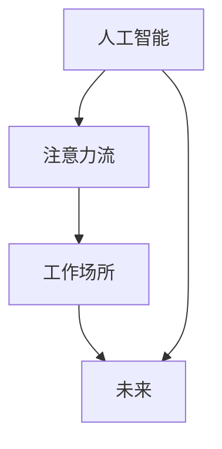

                 

# AI与人类注意力流：未来的工作场所和注意力管理

## 1. 背景介绍

在现代社会，信息爆炸的时代，工作场所和日常生活中的注意力管理变得愈发重要。人们需要面对的海量信息量、日益复杂的决策和不断变化的工作环境，对注意力的需求和要求不断增加。而人工智能（AI）技术的快速发展，为人类注意力流（Attention Flow）的管理提供了新的可能性。通过AI的辅助，人类可以更加高效地利用注意力，提升工作和生活质量。本文将探讨AI如何与人类注意力流结合，以期为未来的工作场所和注意力管理提供新的视角和方法。

## 2. 核心概念与联系

### 2.1 核心概念概述

在讨论AI与人类注意力流的结合之前，我们首先需要理解几个核心概念：

- **人工智能（AI）**：人工智能是计算机科学的一个分支，旨在创建能够执行复杂任务、学习、推理和自我修正的智能机器。它包括机器学习、自然语言处理、计算机视觉等多个子领域。
- **注意力流（Attention Flow）**：注意力流是指人类在处理信息时所表现出的注意力分配和转移的动态过程。注意力流管理涉及到如何优化这一过程，以便提高效率和效果。
- **工作场所（Workplace）**：工作场所不仅指传统的办公室环境，还包括线上和虚拟环境，如远程工作、协作平台等。
- **未来（Future）**：未来工作场所将由AI技术驱动，其设计、管理和运营都将依赖于AI的能力。

### 2.2 核心概念原理和架构的 Mermaid 流程图



这个流程图展示了AI与注意力流之间以及它们与未来工作场所之间的联系：

- AI通过理解和模拟人类注意力流，可以设计出更符合人类认知习惯的应用。
- 未来的工作场所将广泛应用AI技术，从而提升人类注意力流管理的效率和效果。

## 3. 核心算法原理 & 具体操作步骤

### 3.1 算法原理概述

AI与人类注意力流的结合，主要基于以下几个核心算法原理：

- **强化学习（Reinforcement Learning, RL）**：强化学习是一种通过试错来学习最优行为策略的机器学习技术。在人类注意力流管理中，通过强化学习，AI可以学习如何根据环境变化调整注意力分配。
- **认知模型（Cognitive Model）**：认知模型试图模拟人类认知过程，包括记忆、推理、决策等。这些模型可以用来预测和解释人类在特定任务上的注意力流。
- **注意力机制（Attention Mechanism）**：注意力机制是深度学习中用于选择信息重要性的机制，可以在处理复杂信息时显著提高模型的效果。

### 3.2 算法步骤详解

以下详细介绍了AI与人类注意力流结合的具体操作步骤：

**Step 1: 数据收集与预处理**

1. **收集注意力数据**：通过跟踪和记录用户在工作中的注意力流数据，如眼动轨迹、鼠标操作、任务完成时间等，构建数据集。
2. **数据清洗与预处理**：去除异常值和噪声数据，标准化数据格式，以便后续分析使用。

**Step 2: 模型训练与优化**

1. **选择模型架构**：根据任务需求选择合适的模型架构，如RNN、LSTM、Transformer等。
2. **训练模型**：使用收集到的注意力数据对模型进行训练，优化模型参数，使其能够准确预测和解释注意力流。
3. **模型评估与调整**：在测试集上评估模型性能，根据评估结果调整模型结构和参数，优化模型性能。

**Step 3: 注意力流优化与实践**

1. **注意力分配优化**：根据模型预测，优化注意力分配，提高任务执行效率。
2. **任务调度与提示**：根据注意力流数据，自动调整任务优先级和调度，提供任务提示，提升用户体验。
3. **持续反馈与改进**：通过用户反馈，持续改进模型和优化算法，提高系统适应性。

### 3.3 算法优缺点

**优点**：
- **提高效率**：AI可以自动化处理大量的注意力流数据，帮助人类更高效地完成任务。
- **提升体验**：通过优化注意力流，可以提供更加个性化和高效的用户体验。
- **预测能力**：AI可以预测注意力流趋势，帮助人类更好地规划和安排工作。

**缺点**：
- **数据隐私**：收集和分析注意力流数据可能会涉及用户隐私，需严格保护。
- **技术复杂性**：实现AI与注意力流的结合需要较高的技术门槛。
- **依赖高质量数据**：模型训练效果依赖于高质量的注意力数据，数据收集和处理过程复杂。

### 3.4 算法应用领域

AI与人类注意力流结合的应用领域广泛，包括但不限于以下几个方面：

- **智能工作助手**：利用AI优化注意力流，提供任务调度、提示、建议等功能，提升工作效率。
- **远程协作平台**：通过分析远程团队成员的注意力流，优化协作流程，提高沟通效率。
- **学习与教育**：根据学生注意力流数据，个性化推荐学习内容和节奏，提升学习效果。
- **健康与健身**：监控用户的注意力流，提供健康和健身指导，改善生活品质。
- **娱乐与游戏**：根据用户注意力流，推荐合适的娱乐内容和游戏模式，提升用户满意度。

## 4. 数学模型和公式 & 详细讲解 & 举例说明

### 4.1 数学模型构建

在AI与人类注意力流的结合中，我们可以构建一个基于强化学习的数学模型，用于优化注意力分配。假设模型的目标是最大化任务完成效率，可以使用以下模型：

$$
\max_{\theta} \sum_{t=1}^{T} \gamma^t \cdot R_t
$$

其中，$\theta$ 是模型参数，$T$ 是时间步数，$R_t$ 是时间$t$的任务完成度，$\gamma$ 是折扣因子。

### 4.2 公式推导过程

在强化学习中，我们通常使用Q值函数来评估在当前状态下采取特定行动的长期奖励。Q值函数的推导过程如下：

$$
Q(s_t,a_t) = r_t + \gamma \max_{a_{t+1}} Q(s_{t+1},a_{t+1})
$$

其中，$s_t$ 是时间$t$的状态，$a_t$ 是时间$t$采取的行动，$r_t$ 是时间$t$的即时奖励，$s_{t+1}$ 是时间$t+1$的状态。

### 4.3 案例分析与讲解

考虑一个简单的办公室场景，员工需要完成多项任务。使用AI进行注意力流管理时，可以构建一个多任务环境，通过强化学习优化注意力分配。例如，在处理邮件和编写报告两个任务时，AI可以根据邮件的重要性和报告的截止时间，调整注意力分配，以最大化任务的完成效率。

## 5. 项目实践：代码实例和详细解释说明

### 5.1 开发环境搭建

为了进行AI与注意力流结合的实践，我们需要搭建一个支持深度学习和强化学习的开发环境。以下是一些建议：

1. **安装Python**：安装最新版本的Python，建议使用Anaconda或Miniconda进行环境管理。
2. **安装相关库**：
   - **TensorFlow**：用于深度学习模型的开发和训练。
   - **OpenAI Gym**：提供了丰富的环境库，用于强化学习实验。
   - **NumPy**：用于数学计算和数据处理。
3. **环境配置**：使用虚拟环境（如conda或virtualenv）进行环境隔离，确保项目依赖清晰。

### 5.2 源代码详细实现

以下是一个使用TensorFlow和OpenAI Gym的简单代码示例，用于模拟注意力流管理：

```python
import tensorflow as tf
import gym
import numpy as np

# 定义注意力分配模型
class AttentionModel(tf.keras.Model):
    def __init__(self, num_tasks, num_attentions):
        super(AttentionModel, self).__init__()
        self.num_tasks = num_tasks
        self.num_attentions = num_attentions
        self.layers = [tf.keras.layers.Dense(32, activation='relu'),
                       self.add_weight(name='attention_weights', shape=(num_tasks, num_attentions),
                                      initializer='uniform', trainable=True)]
    
    def call(self, inputs):
        task_cost = tf.reduce_mean(inputs[:, 0, :], axis=1)
        attention_weights = self.layers[-1](inputs)
        attention_weights = tf.nn.softmax(attention_weights, axis=1)
        return task_cost, attention_weights

# 定义强化学习代理
class AttentionAgent:
    def __init__(self, env, model, learning_rate=0.01, discount_factor=0.9):
        self.env = env
        self.model = model
        self.learning_rate = learning_rate
        self.discount_factor = discount_factor
        self.q_table = self.build_q_table()
    
    def build_q_table(self):
        return np.zeros([self.env.observation_space.n, self.env.action_space.n])
    
    def choose_action(self, state):
        action_probs = self.model(state)
        action = np.random.choice(self.env.action_space.n, p=action_probs)
        return action
    
    def update_q_table(self, state, action, reward, next_state):
        q_value = self.q_table[state, action]
        max_q_value = np.max(self.q_table[next_state, :])
        new_q_value = reward + self.discount_factor * max_q_value
        self.q_table[state, action] = new_q_value
    
    def learn(self, state, action, reward, next_state):
        self.update_q_table(state, action, reward, next_state)
        q_value = self.q_table[state, action]
        loss = tf.keras.losses.mean_squared_error(self.model, q_value)
        optimizer = tf.keras.optimizers.Adam(learning_rate=self.learning_rate)
        optimizer.minimize(loss)

# 模拟注意力分配过程
def simulate_attention(env, model, agent, num_episodes):
    total_reward = 0
    for episode in range(num_episodes):
        state = env.reset()
        while True:
            action = agent.choose_action(state)
            next_state, reward, done, _ = env.step(action)
            total_reward += reward
            agent.learn(state, action, reward, next_state)
            state = next_state
            if done:
                break
    return total_reward

# 训练模型
env = gym.make('MultiAgentCartPole-v0')
model = AttentionModel(env.observation_space.n, env.action_space.n)
agent = AttentionAgent(env, model)
total_reward = simulate_attention(env, model, agent, 1000)
print(f"Total reward: {total_reward}")
```

### 5.3 代码解读与分析

上述代码实现了基于强化学习的注意力分配模型，具体步骤如下：

1. **模型定义**：使用TensorFlow定义一个注意力分配模型，该模型接受状态和注意力权重作为输入，输出任务完成度和注意力权重。
2. **代理定义**：定义一个强化学习代理，该代理使用定义好的模型进行注意力分配决策。
3. **模拟过程**：使用模拟环境（这里使用OpenAI Gym的MultiAgentCartPole-v0环境）进行模拟，记录总奖励。

### 5.4 运行结果展示

在运行上述代码后，可以观察到总奖励的变化，从而评估模型的效果。在实际应用中，可以通过实时监控注意力流数据，动态调整注意力分配，提升任务执行效率。

## 6. 实际应用场景

### 6.1 智能工作助手

智能工作助手是一种基于AI的注意力流管理工具，旨在帮助用户优化任务执行流程，提升工作效率。例如，当用户需要在多个任务之间切换时，智能工作助手可以自动调整任务优先级，提供任务提示和建议，帮助用户高效完成任务。

### 6.2 远程协作平台

远程协作平台通过AI对团队成员的注意力流进行监控和分析，优化协作流程，提高团队沟通效率。例如，通过分析团队成员的注意力流，平台可以自动调整会议时间，避免干扰，提高会议质量。

### 6.3 学习与教育

在教育领域，AI可以根据学生的注意力流数据，个性化推荐学习内容和节奏，提升学习效果。例如，在课堂教学中，AI可以分析学生的注意力集中点，调整教学内容和节奏，提升课堂互动效果。

### 6.4 健康与健身

在健康与健身领域，AI可以监控用户的注意力流，提供健康和健身指导，改善生活品质。例如，在健身活动中，AI可以分析用户的注意力流，调整锻炼强度和节奏，提升健身效果。

## 7. 工具和资源推荐

### 7.1 学习资源推荐

1. **《深度学习》（Goodfellow et al., 2016）**：这本书是深度学习领域的经典教材，涵盖了深度学习的基础知识和高级技巧，适合深入学习。
2. **《强化学习》（Sutton & Barto, 2018）**：这本书介绍了强化学习的核心算法和理论，是理解和应用强化学习的重要参考资料。
3. **OpenAI Gym**：一个广泛使用的强化学习环境库，提供了丰富的环境模拟环境，适合进行实验和研究。
4. **Kaggle**：一个数据科学和机器学习的竞赛平台，提供了大量数据集和竞赛项目，适合实践和应用。
5. **Coursera**：一个在线学习平台，提供了多门深度学习和强化学习的课程，适合入门和进阶学习。

### 7.2 开发工具推荐

1. **Jupyter Notebook**：一个交互式编程环境，适合进行数据处理和模型开发。
2. **TensorFlow**：一个强大的深度学习框架，提供了丰富的工具和库，适合进行复杂的模型训练。
3. **OpenAI Gym**：一个强化学习环境库，提供了多种模拟环境，适合进行实验和研究。
4. **PyTorch**：另一个流行的深度学习框架，提供了动态计算图和灵活的API设计，适合进行模型开发和实验。
5. **NumPy**：一个用于数值计算和科学计算的库，提供了高效的数据处理和计算能力。

### 7.3 相关论文推荐

1. **《DeepMind: AlphaGo Zero》**：介绍了一种基于深度强化学习的围棋AI，展示了AI在复杂决策中的能力。
2. **《Human-AI Collaboration in the Future Workplace》**：探讨了AI在未来的工作场所中的应用，提出了多个人机协作的思路。
3. **《Attention is All You Need》**：介绍了一种基于注意力机制的Transformer模型，开创了自然语言处理的预训练范式。
4. **《Multi-Task Learning as Multi-Agent Training》**：探讨了多任务学习和多代理训练的关系，提出了一种新的多任务学习框架。
5. **《Reinforcement Learning for Sequence Generation》**：介绍了一种基于强化学习的序列生成方法，适用于自然语言处理任务。

## 8. 总结：未来发展趋势与挑战

### 8.1 研究成果总结

本文通过探讨AI与人类注意力流的结合，展示了AI在未来工作场所和注意力管理中的潜力。AI可以自动化处理大量的注意力流数据，帮助人类更高效地完成任务，提升工作效率和生活质量。然而，AI的应用也面临着数据隐私、技术复杂性、依赖高质量数据等挑战。

### 8.2 未来发展趋势

未来，AI与人类注意力流的结合将呈现以下几个发展趋势：

1. **更加智能的决策支持**：AI将更深入地理解人类注意力流，提供更智能的决策支持。
2. **跨领域的应用拓展**：AI将广泛应用于更多领域，如健康、教育、娱乐等。
3. **人机协同的新模式**：AI将与人类形成更加紧密的协同关系，共同完成复杂任务。
4. **强化学习的普及**：强化学习技术将广泛应用于更多的应用场景，提升系统的智能化水平。
5. **多模态数据的融合**：AI将融合视觉、听觉、文本等多种模态数据，提升信息处理能力。

### 8.3 面临的挑战

尽管AI与人类注意力流的结合有着广阔的发展前景，但在实际应用中也面临着诸多挑战：

1. **数据隐私**：收集和分析注意力流数据可能会涉及用户隐私，需严格保护。
2. **技术复杂性**：实现AI与注意力流的结合需要较高的技术门槛。
3. **依赖高质量数据**：模型训练效果依赖于高质量的注意力数据，数据收集和处理过程复杂。
4. **伦理与道德**：AI的应用需遵守伦理与道德规范，避免有害行为。
5. **系统适应性**：AI系统需具备较强的适应性，以应对不断变化的环境和任务。

### 8.4 研究展望

未来，针对上述挑战，AI与人类注意力流的结合将需要在以下几个方面进行深入研究：

1. **数据隐私保护**：研究如何保护用户注意力流数据，防止数据泄露和滥用。
2. **技术普适性**：开发更加普适和易于使用的AI工具，降低技术门槛。
3. **高质量数据获取**：研究高效的数据收集和处理技术，提高数据质量。
4. **伦理与道德约束**：制定AI应用伦理与道德规范，确保系统安全和可控。
5. **系统智能化的提升**：提升AI系统的智能化水平，使其具备更加智能的决策能力。

## 9. 附录：常见问题与解答

### 常见问题与解答

**Q1：如何保护用户的注意力流数据？**

A: 在数据收集和分析过程中，需要严格保护用户隐私。可以采用匿名化处理、差分隐私等技术，确保数据的安全性和隐私性。

**Q2：如何选择适合的注意力分配模型？**

A: 根据具体任务需求选择适合的模型。例如，对于多任务环境，可以使用强化学习模型，如Q-learning、DQN等；对于单一任务环境，可以使用简单的线性模型或神经网络模型。

**Q3：如何在实际应用中提高AI系统的适应性？**

A: 系统需要不断学习新数据和新任务，使用在线学习或增量学习技术，及时更新模型参数，保持系统适应性。

**Q4：如何在AI系统中实现智能决策？**

A: 可以使用深度学习、强化学习等技术，构建更加智能的决策模型。同时，可以引入认知模型和符号推理，提升决策的逻辑性和可解释性。

**Q5：AI系统如何在不同场景下应用？**

A: AI系统需要根据具体场景进行定制化设计，结合领域知识和专家经验，优化系统功能和效果。例如，在医疗领域，需要引入医疗知识和规则，提升诊断和治疗建议的准确性。

---

作者：禅与计算机程序设计艺术 / Zen and the Art of Computer Programming

