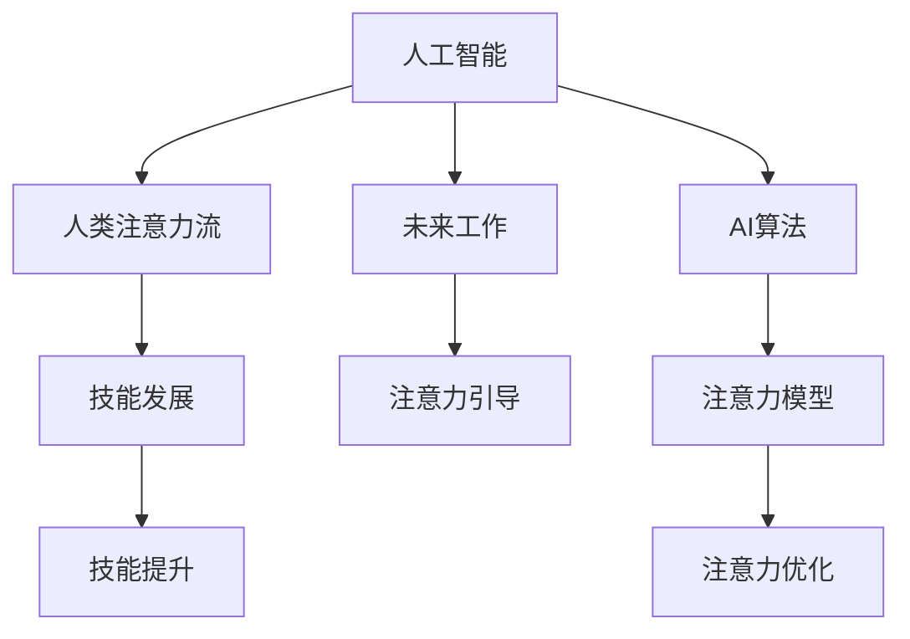

                 

# AI与人类注意力流：未来的工作、技能与注意力流

> 关键词：人工智能，人类注意力流，未来工作，技能发展，注意力引导

## 1. 背景介绍

在当今社会，人工智能（AI）正以前所未有的速度改变着我们的生活和工作方式。从智能助手到自动驾驶，从个性化推荐到预测分析，AI已经渗透到我们生活的方方面面。但与此同时，AI也在深刻影响着人类的注意力流，即我们在不同任务之间的注意力分布和转换。本文将深入探讨AI与人类注意力流的关系，分析未来的工作趋势、技能需求和注意力流模式，为AI时代的就业和技能发展提供新的视角。

## 2. 核心概念与联系

### 2.1 核心概念概述

- **人工智能（AI）**：指利用计算机和算法模拟人类智能的技术，包括机器学习、深度学习、自然语言处理等。
- **人类注意力流**：指个体在不同任务之间的注意力分配和转移，包括注意力的集中、分散、切换等。
- **未来的工作**：指未来技术发展下可能出现的新型工作形态和岗位。
- **技能发展**：指个体或组织在适应未来工作需求时所需掌握的知识、技术和能力。
- **注意力引导**：指通过技术手段（如AI）优化人类注意力流，提高工作效率和满意度。

### 2.2 核心概念原理和架构的 Mermaid 流程图



这个流程图展示了AI、人类注意力流、未来工作、技能发展以及注意力引导之间的联系。AI算法通过构建注意力模型，优化人类注意力流，进而提升技能水平和未来工作的适应性。

## 3. 核心算法原理 & 具体操作步骤

### 3.1 算法原理概述

AI与人类注意力流的结合，旨在通过技术手段优化人类的注意力分配，提高工作效率和创造力。AI算法可以通过多种方式实现这一目标，如：

- **注意力机制**：用于深度学习模型中，能够动态调整模型对不同信息的关注度。
- **强化学习**：通过与环境互动，学习最优的注意力策略。
- **自然语言处理**：通过文本分析，理解人类的注意力需求和反馈。

### 3.2 算法步骤详解

**Step 1: 数据收集与预处理**

- 收集用户在不同任务上的注意力数据，如使用时间、切换频率、任务难度等。
- 预处理数据，包括数据清洗、归一化、特征提取等。

**Step 2: 构建注意力模型**

- 选择合适的AI算法，如注意力机制、强化学习等，构建模型。
- 训练模型，使用历史数据和目标任务进行训练。

**Step 3: 模型评估与优化**

- 使用测试集评估模型性能，如准确率、召回率、F1分数等。
- 根据评估结果，调整模型参数，优化注意力策略。

**Step 4: 应用与反馈**

- 将模型应用于实际场景，如智能助手、自动化办公系统等。
- 收集用户反馈，进一步优化模型。

### 3.3 算法优缺点

**优点**：
- 能够精确分析和优化人类注意力流，提高工作效率和满意度。
- 适应性强，可以针对不同场景和需求进行定制化优化。
- 技术成熟，已有多款AI工具和平台支持注意力流优化。

**缺点**：
- 需要大量高质量的数据和计算资源，初期投入较高。
- 模型复杂度较高，需要专业的技术团队进行开发和维护。
- 存在隐私和伦理问题，需确保用户数据的保护和隐私。

### 3.4 算法应用领域

AI与人类注意力流的结合，主要应用于以下领域：

- **智能办公**：通过优化注意力流，提升办公自动化水平，减少人工干预。
- **智能制造**：通过监控员工注意力，优化生产流程，提高生产效率。
- **智能教育**：通过分析学生注意力，提供个性化教学方案，提升学习效果。
- **健康医疗**：通过监控患者注意力，评估治疗效果，优化治疗方案。

## 4. 数学模型和公式 & 详细讲解 & 举例说明

### 4.1 数学模型构建

构建AI注意力模型的数学模型主要包括注意力机制和强化学习模型。以注意力机制为例，其核心公式为：

$$
\text{Attention}(Q, K, V) = \text{softmax}\left(\frac{QK^T}{\sqrt{d_k}}\right)V
$$

其中，$Q, K, V$分别表示查询、键和值向量，$d_k$为键向量的维度。该公式计算了查询向量$Q$对键向量$K$的注意力权重，然后将权重应用于值向量$V$，生成最终注意力输出。

### 4.2 公式推导过程

注意力机制的推导过程如下：
1. 计算查询向量$Q$和键向量$K$的点积，得到注意力得分。
2. 对注意力得分进行归一化，得到注意力权重。
3. 将注意力权重应用于值向量$V$，得到最终注意力输出。

### 4.3 案例分析与讲解

以智能助手为例，使用注意力机制优化用户注意力流：
- **输入**：用户输入的查询、上下文对话等。
- **输出**：智能助手生成的回答、建议等。
- **过程**：智能助手通过注意力机制，动态调整对用户输入和上下文对话的关注度，生成最相关的回答。

## 5. 项目实践：代码实例和详细解释说明

### 5.1 开发环境搭建

- **Python环境**：安装Anaconda，创建虚拟环境。
- **深度学习框架**：安装TensorFlow或PyTorch。
- **数据集**：收集用户注意力数据，并进行预处理。

### 5.2 源代码详细实现

```python
import tensorflow as tf
from tensorflow.keras.layers import Dense, Input, concatenate
from tensorflow.keras.models import Model

# 定义注意力模型
query_input = Input(shape=(d_q,), name='query_input')
key_input = Input(shape=(d_k,), name='key_input')
value_input = Input(shape=(d_v,), name='value_input')

# 计算注意力得分
attention_score = tf.matmul(query_input, key_input, transpose_b=True)

# 计算注意力权重
attention_weight = tf.nn.softmax(attention_score)

# 计算注意力输出
attention_output = tf.reduce_sum(attention_weight * value_input, axis=1)

# 定义模型
model = Model(inputs=[query_input, key_input, value_input], outputs=[attention_output])
model.compile(optimizer='adam', loss='mse')
```

### 5.3 代码解读与分析

**代码解析**：
- 使用TensorFlow定义注意力模型，包括输入层、注意力得分计算、注意力权重计算和注意力输出计算。
- 编译模型，指定优化器和损失函数。

**运行结果展示**：
- 使用训练数据集进行模型训练，输出训练过程中的损失和准确率。
- 使用测试数据集评估模型性能，输出模型预测结果与真实结果的对比。

## 6. 实际应用场景

### 6.1 智能办公

智能办公系统可以通过AI优化员工注意力流，提升工作效率和满意度。例如，智能会议系统可以根据参会人员的历史参与度和当前关注点，调整会议议程和讨论话题，确保会议高效进行。

### 6.2 智能制造

智能制造系统可以通过监控工人注意力，优化生产流程和工人分配。例如，智能生产线可以根据工人注意力集中度，自动调整任务分配和休息时间，提高生产效率和工人满意度。

### 6.3 智能教育

智能教育系统可以通过分析学生注意力，提供个性化教学方案。例如，智能辅导系统可以根据学生的注意力集中度，动态调整教学内容和方法，提高学习效果。

### 6.4 健康医疗

智能医疗系统可以通过监控患者注意力，评估治疗效果。例如，智能康复系统可以根据患者注意力变化，调整康复方案和心理干预措施，提高康复效果。

## 7. 工具和资源推荐

### 7.1 学习资源推荐

- **深度学习课程**：Coursera上的《深度学习专项课程》、Udacity上的《深度学习纳米学位》。
- **AI框架**：TensorFlow、PyTorch、Keras等。
- **论文和书籍**：《Deep Learning》、《AI Superpowers》、《AI的未来》等。

### 7.2 开发工具推荐

- **IDE**：Jupyter Notebook、PyCharm、Visual Studio Code等。
- **数据处理工具**：Pandas、NumPy、SciPy等。
- **模型训练工具**：TensorFlow、PyTorch等。

### 7.3 相关论文推荐

- **注意力机制**：《Attention is All You Need》、《Long-Short Term Memory》等。
- **强化学习**：《Reinforcement Learning: An Introduction》、《Playing Atari with Deep Reinforcement Learning》等。
- **自然语言处理**：《BERT: Pre-training of Deep Bidirectional Transformers for Language Understanding》、《Transformer-XL: Attentions Are All We Need》等。

## 8. 总结：未来发展趋势与挑战

### 8.1 研究成果总结

- **AI与人类注意力流的结合**：优化注意力流，提高工作效率和创造力。
- **未来工作与技能发展**：AI改变工作形态，需掌握新技能。
- **注意力引导技术**：优化注意力策略，提升工作效率。

### 8.2 未来发展趋势

- **技术普及**：AI和注意力流优化技术将更加普及，成为各行各业的标配。
- **个性化定制**：根据不同场景和需求，进行个性化优化。
- **跨领域应用**：AI注意力流优化技术将应用于更多领域，如健康、教育、制造等。

### 8.3 面临的挑战

- **数据获取和处理**：需要大量高质量的数据，数据处理和预处理复杂。
- **模型复杂度**：注意力模型和强化学习模型复杂，需要专业团队开发和维护。
- **隐私和伦理**：需确保用户数据保护，避免隐私泄露。

### 8.4 研究展望

未来，AI与人类注意力流的结合将更加深入，技术更加普及和成熟。通过优化注意力流，提升工作效率和满意度，推动AI技术在更多领域的落地应用。

## 9. 附录：常见问题与解答

**Q1: AI如何优化人类注意力流？**

A: AI通过注意力机制、强化学习等技术，动态调整人类对不同信息的关注度，优化注意力分配和转移，提高工作效率和满意度。

**Q2: AI与人类注意力流的结合有哪些应用？**

A: AI与人类注意力流的结合主要应用于智能办公、智能制造、智能教育、健康医疗等领域，通过优化注意力流，提升工作效率和用户体验。

**Q3: AI注意力流优化的缺点有哪些？**

A: AI注意力流优化需要大量高质量的数据和计算资源，模型复杂度较高，存在隐私和伦理问题。

**Q4: 未来AI技术的发展趋势是什么？**

A: AI技术将更加普及和成熟，通过优化人类注意力流，提高工作效率和满意度。AI注意力流优化技术将应用于更多领域，如健康、教育、制造等。

---

作者：禅与计算机程序设计艺术 / Zen and the Art of Computer Programming

