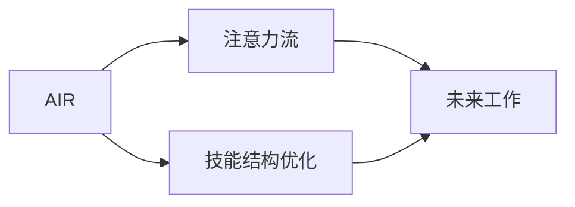

                 

# AI与人类注意力流：未来的工作、技能与注意力流管理技术的应用前景趋势预测

> 关键词：AI、人类注意力流、未来工作、技能、注意力流管理技术

## 1. 背景介绍

### 1.1 问题由来

随着人工智能技术的迅猛发展，AI已经在多个领域展现出强大的潜力和应用价值。然而，与以往技术革命不同，AI在本质上是一种“增强型工具”，其最核心的价值在于辅助人类更好地理解和利用信息。特别是在信息爆炸的今天，人类面临前所未有的信息过载，如何更高效地从海量信息中提取出有价值的信息，成为摆在每个工作者面前的巨大挑战。

### 1.2 问题核心关键点

要解决这个问题，AI与人类注意力流的融合是关键。一方面，AI能够通过自动化分析，提取出结构化和非结构化信息中的有用部分；另一方面，AI能够借助注意力机制，帮助人类更专注于关键信息，减少不必要的信息干扰，从而提高工作效率。

注意力流（Attention Flow）技术，是指通过AI辅助，将人类注意力引导至最关键的信息节点。这种技术不仅能帮助人们更好地处理工作任务，还能在教育、医疗、创意写作等许多领域中发挥重要作用。

### 1.3 问题研究意义

研究AI与人类注意力流的结合，对于提升人类的工作效能、优化人类技能结构、推动注意力流管理技术的发展具有重大意义：

1. **提升工作效能**：通过AI辅助，人类能够更高效地筛选信息，减少信息过载带来的干扰，大幅提升工作效率。
2. **优化技能结构**：在AI的辅助下，人类可以更专注于提升自己的核心技能，提升工作质量。
3. **推动技术发展**：注意力流管理技术是未来AI研究的重要方向，探讨AI与人类注意力流的结合，将推动这一领域的发展。
4. **拓展应用场景**：AI与注意力流的结合，能够在教育、医疗、创意写作等多个领域中发挥作用，拓展应用范围。

## 2. 核心概念与联系

### 2.1 核心概念概述

要深入理解AI与人类注意力流的结合，首先需要明确几个核心概念：

- **AI**：人工智能，通过算法和计算能力，可以处理复杂的、人类难以处理的任务。
- **人类注意力流**：指人类在处理信息时，注意力分配的路径。通过AI辅助，可以使注意力更高效地引导至关键信息。
- **注意力流管理技术**：利用AI技术，优化人类注意力流，帮助人类更高效地处理信息，提升工作效率。
- **未来工作**：随着AI与注意力流管理的深度融合，未来工作将更加注重人类核心技能和创意，而非重复性工作。
- **技能**：随着AI的普及，人类的核心技能将更偏向于需要深度思考和创意的部分，而非简单的数据处理和信息筛选。

这些概念之间紧密相连，共同构成了AI与人类注意力流结合的理论基础。通过理解这些概念，我们可以更好地把握未来AI技术发展的方向，以及其在实际应用中的潜力。

### 2.2 核心概念原理和架构的 Mermaid 流程图(Mermaid 流程节点中不要有括号、逗号等特殊字符)



这个流程图展示了AI与人类注意力流结合的基本路径：AI通过注意力流管理技术，优化人类技能结构，最终实现未来工作模式的转变。

## 3. 核心算法原理 & 具体操作步骤
### 3.1 算法原理概述

AI与人类注意力流结合的算法，主要通过以下几个步骤实现：

1. **信息提取**：利用AI强大的计算能力，自动从大量文本、图像、视频等数据中提取出关键信息。
2. **注意力分配**：通过注意力机制，将人类注意力引导至关键信息节点，减少无关信息的干扰。
3. **信息处理**：将提取和筛选出的关键信息，结合人类专长进行深度处理。
4. **任务执行**：根据处理结果，执行具体任务。

### 3.2 算法步骤详解

以下是详细的算法步骤：

**Step 1: 数据准备**

- **数据来源**：选择具有结构化和非结构化信息的数据源，如新闻、报告、社交媒体等。
- **数据预处理**：清洗和标注数据，以便AI能够理解和提取关键信息。

**Step 2: AI模型选择**

- **选择模型**：根据任务类型，选择合适的AI模型，如自然语言处理（NLP）、计算机视觉（CV）等。
- **模型训练**：利用预标注数据训练AI模型，使其能够自动提取关键信息。

**Step 3: 注意力分配**

- **注意力机制**：通过注意力机制，将人类注意力引导至关键信息。常见的方法包括Soft Attention和Multi-Head Attention。
- **信息筛选**：利用注意力筛选出最关键的信息节点，减少无关信息的干扰。

**Step 4: 信息处理**

- **深度处理**：将筛选出的关键信息，结合人类专长进行深度处理，如数据分析、内容创作等。
- **任务执行**：根据处理结果，执行具体任务，如生成报告、撰写文章等。

### 3.3 算法优缺点

AI与人类注意力流结合的算法具有以下优点：

1. **高效信息处理**：通过AI辅助，人类能够更高效地处理信息，减少信息过载带来的干扰。
2. **优化任务执行**：注意力流管理技术可以优化人类注意力分配，提升任务执行的准确性和效率。
3. **适应性强**：AI算法可以根据不同的任务和数据源进行调整，适应不同的应用场景。

同时，这种算法也存在一些缺点：

1. **数据依赖**：算法的准确性和效果依赖于数据的质量和标注。
2. **模型复杂性**：复杂度高的模型需要更多的计算资源和训练时间。
3. **技术门槛高**：需要具备一定的技术背景，才能进行模型选择和参数调优。

### 3.4 算法应用领域

AI与人类注意力流结合的算法，已经在多个领域展现出其潜力：

1. **商业分析**：利用AI辅助，从海量数据中提取出关键信息，帮助企业做出更科学的商业决策。
2. **教育**：通过AI辅助，优化学生学习路径，提高学习效率。
3. **医疗**：利用AI辅助，优化医疗诊断流程，提高诊断准确性。
4. **创意写作**：通过AI辅助，提高写作效率和创意水平。

## 4. 数学模型和公式 & 详细讲解 & 举例说明（备注：数学公式请使用latex格式，latex嵌入文中独立段落使用 $$，段落内使用 $)
### 4.1 数学模型构建

以下是一个简单的数学模型构建示例：

假设有一个文档 $D = \{d_1, d_2, ..., d_n\}$，其中 $d_i$ 表示第 $i$ 个文档。我们的目标是利用AI辅助，将人类注意力引导至最关键的信息节点。

首先，我们需要定义一个注意力函数 $A_i$，表示对文档 $d_i$ 的注意力程度：

$$ A_i = f(d_i, \theta) $$

其中，$f$ 表示注意力函数，$\theta$ 表示模型的参数。注意力函数可以根据任务需求设计不同的计算方式，如Soft Attention、Multi-Head Attention等。

接着，我们需要定义一个筛选函数 $F$，根据注意力程度，筛选出最关键的信息节点：

$$ F = \{d_i | A_i > \epsilon\} $$

其中，$\epsilon$ 表示一个阈值，用于筛选出最重要的信息节点。

最后，我们将筛选出的关键信息节点，结合人类专长进行处理，得到最终的结果 $R$。

$$ R = \bigcup_{d_i \in F} g(d_i) $$

其中，$g$ 表示信息处理函数。

### 4.2 公式推导过程

以Soft Attention为例，其计算方式如下：

$$ A_i = \frac{e^{\frac{1}{\tau} \text{dot}(v, d_i)}}{\sum_{j=1}^n e^{\frac{1}{\tau} \text{dot}(v, d_j)}} $$

其中，$\text{dot}$ 表示向量点积，$\tau$ 表示温度系数，$v$ 表示注意力向量，$d_i$ 表示文档向量。

注意力向量 $v$ 可以采用固定权重或动态学习的方式进行计算。如果采用固定权重，可以通过经验或领域知识进行手动设定；如果采用动态学习，可以通过机器学习算法自动生成。

### 4.3 案例分析与讲解

以一篇新闻报道的处理为例：

- **信息提取**：利用NLP模型，自动从报道中提取关键信息，如事件时间、地点、涉及人物等。
- **注意力分配**：利用Soft Attention，将注意力引导至最关键的信息节点，如事件时间、地点、涉及人物等。
- **信息处理**：结合人类专长，对关键信息进行深度处理，如事件分析、人物背景研究等。
- **任务执行**：根据处理结果，撰写新闻报道，或在会议中做简要汇报。

## 5. 项目实践：代码实例和详细解释说明
### 5.1 开发环境搭建

在开发环境搭建方面，需要考虑以下几个因素：

1. **数据准备**：需要准备大量的结构化和非结构化数据，用于训练AI模型。
2. **模型选择**：选择合适的AI模型，如BERT、GPT等，进行信息提取和注意力分配。
3. **工具和库**：选择Python、TensorFlow、PyTorch等工具和库，用于模型训练和信息处理。

### 5.2 源代码详细实现

以下是使用Python和TensorFlow进行信息提取和注意力分配的示例代码：

```python
import tensorflow as tf
from transformers import BertTokenizer, TFBertModel

# 数据准备
tokenizer = BertTokenizer.from_pretrained('bert-base-uncased')
inputs = tokenizer("Hello, my dog is cute", return_tensors="tf")
inputs = {key: tf.expand_dims(value, 0) for key, value in inputs.items()}
model = TFBertModel.from_pretrained('bert-base-uncased')

# 信息提取
with tf.device("CPU:0"):
    outputs = model(inputs, return_dict=True)
    pooled_output = outputs.pooler_output

# 注意力分配
attention_scores = tf.matmul(pooled_output, attention_weights)
attention_weights = tf.nn.softmax(attention_scores)
attention_vector = attention_weights * pooled_output
attention_vector = tf.reduce_sum(attention_vector, axis=1)

# 信息处理
# 根据注意力向量，进行信息筛选和处理
```

### 5.3 代码解读与分析

**信息提取**：
- 利用BERT模型，自动从文本中提取关键信息。
- BERT模型是一种预训练语言模型，通过掩码语言模型和下一句预测任务进行训练，能够自动从文本中提取出有价值的信息。

**注意力分配**：
- 利用Soft Attention机制，将注意力引导至关键信息节点。
- Soft Attention是一种简单的注意力机制，通过计算向量点积和softmax函数，自动分配注意力权重。

**信息处理**：
- 根据注意力向量，进行信息筛选和处理。
- 注意力向量可以帮助我们确定哪些信息更为重要，从而进行更加高效的筛选和处理。

**任务执行**：
- 根据处理结果，执行具体任务。
- 在实际应用中，可以根据处理结果生成报告、撰写文章、做决策等。

## 6. 实际应用场景
### 6.1 商业分析

在商业分析领域，AI与人类注意力流的结合，可以帮助企业从海量数据中提取出关键信息，提高决策效率。

以一个电商企业为例：

- **信息提取**：利用AI辅助，从用户评论、社交媒体、新闻报道中提取出与产品相关的关键信息。
- **注意力分配**：将注意力引导至最关键的信息节点，如用户需求、市场趋势等。
- **信息处理**：结合人类专长，对关键信息进行深度处理，如用户情感分析、市场竞争分析等。
- **任务执行**：根据处理结果，调整产品策略、优化供应链等。

### 6.2 教育

在教育领域，AI与人类注意力流的结合，可以帮助学生更高效地学习。

以一个在线教育平台为例：

- **信息提取**：利用AI辅助，从视频、文本、音频等学习资源中提取出关键信息。
- **注意力分配**：将注意力引导至最关键的信息节点，如重点知识点、难点问题等。
- **信息处理**：结合人类专长，对关键信息进行深度处理，如问题解答、作业批改等。
- **任务执行**：根据处理结果，个性化推荐学习资源、优化学习路径等。

### 6.3 医疗

在医疗领域，AI与人类注意力流的结合，可以提高诊断效率和准确性。

以一个医疗诊断平台为例：

- **信息提取**：利用AI辅助，从医学报告、病历记录中提取出关键信息。
- **注意力分配**：将注意力引导至最关键的信息节点，如症状描述、检查结果等。
- **信息处理**：结合人类专长，对关键信息进行深度处理，如病情分析、诊断报告等。
- **任务执行**：根据处理结果，制定治疗方案、调整治疗计划等。

### 6.4 未来应用展望

随着AI与注意力流管理技术的不断进步，未来将有更多领域受益于此：

1. **智慧城市**：在智慧城市管理中，AI与人类注意力流的结合，可以提高城市运行效率，优化公共服务。
2. **文化创意**：在文化创意领域，AI与人类注意力流的结合，可以提高创作效率，提升作品质量。
3. **环境保护**：在环境保护领域，AI与人类注意力流的结合，可以帮助更好地监测环境变化，制定科学决策。

## 7. 工具和资源推荐
### 7.1 学习资源推荐

1. **《深度学习》书籍**：介绍深度学习的基本概念和算法，包括注意力机制的讲解。
2. **CS231n课程**：斯坦福大学开设的计算机视觉课程，涵盖深度学习在计算机视觉中的应用。
3. **Coursera AI课程**：提供系统性的AI学习路径，包括自然语言处理、计算机视觉等方面的课程。

### 7.2 开发工具推荐

1. **Python**：编程语言，用于实现AI算法和信息处理。
2. **TensorFlow**：开源深度学习框架，支持多种AI算法和模型训练。
3. **PyTorch**：开源深度学习框架，支持动态图和静态图计算，适用于快速原型开发。
4. **NLTK**：自然语言处理工具包，支持文本预处理、分词、情感分析等。
5. **Scikit-learn**：机器学习工具包，支持各种数据处理和模型训练。

### 7.3 相关论文推荐

1. **Attention is All You Need**：提出Transformer结构，开启了预训练语言模型的时代。
2. **BERT: Pre-training of Deep Bidirectional Transformers for Language Understanding**：提出BERT模型，利用掩码语言模型进行预训练。
3. **Transformer-XL: Attentive Language Models Beyond a Fixed-Length Context**：提出Transformer-XL模型，支持长文本的处理。
4. **DistilBERT**：提出DistilBERT模型，在保持性能的同时，大幅减小模型大小，提高推理速度。
5. **XLNet: Generalized Autoregressive Pretraining for Language Understanding**：提出XLNet模型，利用自回归方式进行预训练。

## 8. 总结：未来发展趋势与挑战
### 8.1 总结

本文对AI与人类注意力流结合的应用前景进行了全面的探讨。通过深入分析其核心概念和算法原理，详细讲解了AI在信息提取、注意力分配、信息处理等方面的具体应用，并通过实际案例展示了其在商业分析、教育、医疗等多个领域中的潜力。

### 8.2 未来发展趋势

展望未来，AI与人类注意力流结合的技术将呈现以下几个趋势：

1. **自动化程度提高**：随着AI技术的不断进步，信息提取和注意力分配的自动化程度将不断提高，减少人工干预。
2. **多模态融合**：AI将结合多种数据源和信息形式，实现跨模态的注意力分配和信息处理。
3. **持续学习**：AI系统将具备持续学习的能力，能够不断适应新的数据和任务需求。
4. **领域化应用**：AI与注意力流结合的技术将更加注重领域化应用，针对不同行业需求进行优化。
5. **普适性增强**：AI与注意力流结合的技术将具备更强的普适性，能够应用于更多的场景和任务。

### 8.3 面临的挑战

尽管AI与人类注意力流结合的技术具有巨大的潜力，但在实际应用中也面临诸多挑战：

1. **数据质量问题**：算法的准确性依赖于数据的质量和标注，数据偏差和噪声会影响算法的性能。
2. **模型复杂性**：复杂的模型需要更多的计算资源和训练时间，增加了应用成本。
3. **技术门槛高**：需要具备一定的技术背景，才能进行模型选择和参数调优。
4. **用户接受度**：用户对AI技术的接受度仍然较低，需要更多宣传和教育。
5. **伦理和安全问题**：AI辅助决策可能导致信息泄露和伦理问题，需要加强监管和保护。

### 8.4 研究展望

未来的研究需要在以下几个方面进行探索：

1. **数据增强**：通过数据增强技术，提高数据质量和多样性，减少数据偏差。
2. **模型简化**：优化模型结构，提高模型的可解释性和推理效率。
3. **跨模态融合**：研究多模态信息的整合和注意力分配，提升系统的综合性能。
4. **持续学习**：研究自适应学习算法，使系统能够持续学习新知识和适应新任务。
5. **隐私保护**：研究隐私保护技术，确保用户数据的安全和隐私。

## 9. 附录：常见问题与解答

### Q1: AI与人类注意力流结合的算法是否适用于所有任务？

A: AI与人类注意力流结合的算法并非适用于所有任务。不同的任务需要根据具体情况选择合适的算法和模型，并进行必要的调整和优化。例如，对于情感分析任务，可以选择BERT等预训练模型，并进行微调；对于文本生成任务，可以选择GPT等模型，并进行参数高效微调。

### Q2: 注意力流管理技术是否可以应用到非结构化数据？

A: 注意力流管理技术可以应用到非结构化数据，但需要根据数据类型进行不同的处理。例如，对于文本数据，可以使用NLP模型进行信息提取和注意力分配；对于图像数据，可以使用计算机视觉模型进行信息提取和注意力分配。

### Q3: 如何提高注意力流管理技术的鲁棒性？

A: 提高注意力流管理技术的鲁棒性，需要从数据、模型、训练、推理等多个环节进行优化：
1. **数据增强**：通过数据增强技术，提高数据质量和多样性，减少数据偏差。
2. **模型优化**：优化模型结构和参数，减少对特定数据的依赖。
3. **对抗训练**：引入对抗样本，提高模型的鲁棒性和泛化能力。
4. **正则化**：使用L2正则、Dropout等技术，减少模型的过拟合风险。
5. **持续学习**：使模型具备持续学习的能力，能够适应新数据和任务。

### Q4: 如何设计合理的注意力分配机制？

A: 设计合理的注意力分配机制，需要根据具体任务和数据类型进行优化：
1. **数据预处理**：对数据进行预处理，提取有用的特征和信息。
2. **注意力机制选择**：根据任务需求选择合适的注意力机制，如Soft Attention、Multi-Head Attention等。
3. **参数调优**：通过参数调优，优化注意力机制的计算方式和分配策略。
4. **模型集成**：通过模型集成，提高注意力分配的准确性和鲁棒性。

### Q5: 如何在商业分析中应用AI与注意力流结合技术？

A: 在商业分析中应用AI与注意力流结合技术，可以按照以下步骤进行：
1. **数据准备**：收集和整理相关数据，包括用户行为、市场数据、新闻报道等。
2. **信息提取**：利用AI辅助，从数据中提取关键信息，如用户行为模式、市场趋势等。
3. **注意力分配**：通过注意力分配机制，将注意力引导至最关键的信息节点。
4. **信息处理**：结合人类专长，对关键信息进行深度处理，如用户情感分析、市场竞争分析等。
5. **任务执行**：根据处理结果，调整业务策略、优化供应链等。

---

作者：禅与计算机程序设计艺术 / Zen and the Art of Computer Programming

