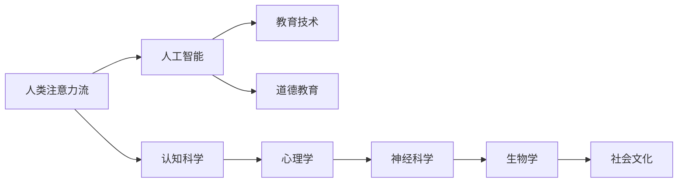

                 

# AI与人类注意力流：未来的教育与道德教育

> 关键词：人工智能,人类注意力流,教育技术,道德教育,认知科学,情感智能

## 1. 背景介绍

### 1.1 问题由来

近年来，随着人工智能技术的迅猛发展，尤其是深度学习、自然语言处理等领域的突破，AI已经开始在教育、医疗、金融等诸多领域大展拳脚，为人类社会的进步带来了巨大的机遇和挑战。特别是教育领域，AI的介入不仅改变着传统的教育模式，也正在重新定义教育的本质和目标。

教育的核心是培养人的全面发展，而注意力作为信息加工的重要资源，对个体的认知、情感、社会行为等方面都有着深远的影响。人工智能技术，尤其是深度学习算法，已经开始在理解、分析、引导人类注意力流方面展现出了巨大的潜力。通过技术手段提升人类注意力流质量，不仅有助于优化教育方式，还能够在道德教育等领域发挥重要作用。

### 1.2 问题核心关键点

本文聚焦于人工智能与人类注意力流相结合的领域，探讨其在教育与道德教育中的应用前景与挑战。通过分析注意力流的基本原理，揭示AI如何在认知、情感和行为层面引导人类注意力，并结合最新技术突破，展望AI在未来教育与道德教育中的角色与潜力。

## 2. 核心概念与联系

### 2.1 核心概念概述

为更好地理解AI与人类注意力流的结合，本节将介绍几个关键概念：

- **人类注意力流**：指人类在处理信息时的认知资源分配方式，涉及注意、记忆、情绪等心理过程。注意力流的优劣直接影响个体学习和决策的质量。
- **人工智能**：以机器学习算法为核心，模拟人类智能过程的技术体系。人工智能技术能够通过数据驱动的模型学习和优化，提升决策和分析的准确性。
- **教育技术**：指应用人工智能、数据科学等技术手段，优化教育过程和提升教育效果的方法和工具。
- **道德教育**：通过课程、活动等手段，培养个体对社会规范、伦理道德的认知与遵守。
- **认知科学**：研究人类认知过程及其机制的科学，关注注意、记忆、思维等心理过程。

这些概念之间通过人类注意力流这一桥梁相互关联，共同构成了AI与教育、道德教育结合的理论基础。

### 2.2 核心概念原理和架构的 Mermaid 流程图



这个流程图展示了核心概念之间的逻辑联系：

- **认知科学**：研究注意力流的基本机制，为理解人类认知提供理论基础。
- **人工智能**：通过机器学习模型模拟人类认知过程，提升信息处理能力。
- **教育技术**：应用AI技术优化教育过程，提高学习效率。
- **道德教育**：利用AI提升道德判断与决策能力，塑造良好的社会规范。

这些概念通过注意力流的桥梁，相互交织，共同推动教育与道德教育的发展。

## 3. 核心算法原理 & 具体操作步骤

### 3.1 算法原理概述

AI与人类注意力流的结合，本质上是利用深度学习模型分析、预测和引导人类注意力流的动态过程。这一过程可以分为以下几个步骤：

1. **数据采集**：通过脑电波、眼动追踪、行为记录等手段，采集人类注意力流相关数据。
2. **特征提取**：利用神经网络模型，从采集数据中提取关键特征，如注意力分布、反应时间等。
3. **模型训练**：使用标注数据训练深度学习模型，学习注意力流与特定任务之间的映射关系。
4. **注意力引导**：在模型预测的基础上，通过算法或技术手段，引导人类注意力流，优化学习和决策过程。

### 3.2 算法步骤详解

#### 数据采集

- **脑电波采集**：通过EEG等设备，实时监测大脑神经活动，反映注意力水平和状态变化。
- **眼动追踪**：使用眼球追踪技术，记录视线在屏幕上的移动轨迹，分析注意力焦点。
- **行为记录**：通过鼠标、键盘等输入设备，记录用户的操作行为，反映注意力集中程度和反应速度。

#### 特征提取

- **特征选择**：根据注意力流的不同维度，选择相关特征进行建模。例如，注意力分布的均衡性、焦点转移的速度等。
- **特征编码**：使用卷积神经网络(CNN)、长短期记忆网络(LSTM)等模型，将原始数据转换为模型能够处理的特征向量。

#### 模型训练

- **神经网络结构设计**：根据任务需求，设计深度神经网络结构，如图像分类中的卷积神经网络(CNN)，序列生成中的循环神经网络(RNN)等。
- **损失函数选择**：根据任务目标，选择合适的损失函数，如交叉熵损失、均方误差损失等。
- **优化算法选择**：根据模型复杂度和数据规模，选择合适的优化算法，如随机梯度下降(SGD)、Adam等。

#### 注意力引导

- **正向预测**：利用训练好的模型，预测特定任务下的人类注意力流状态。
- **逆向控制**：通过算法或技术手段，调整注意力流的分布和转移，引导用户集中注意力。

### 3.3 算法优缺点

AI与人类注意力流的结合，具有以下优点：

- **高精度预测**：深度学习模型能够从海量数据中学习复杂的特征关系，提高注意力流预测的准确性。
- **实时反馈**：通过持续监测注意力流状态，能够实时调整注意力引导策略，优化学习和决策过程。
- **个性化定制**：利用注意力流特征，实现个性化教学和引导，提高学习效率。

同时，该方法也存在一些局限：

- **数据依赖性强**：高质量的注意力流数据是模型训练的基础，获取成本较高。
- **模型复杂度高**：深度学习模型复杂，训练和部署需要较高的计算资源。
- **伦理问题**：注意力流数据的隐私和安全问题，需要严格的法规和技术保障。
- **用户适应性**：不同个体对注意力引导的反应存在差异，模型泛化性有待提高。

### 3.4 算法应用领域

AI与人类注意力流的结合，已在教育、医疗、人机交互等多个领域展现出广泛的应用潜力：

- **教育领域**：通过实时监测学生注意力状态，调整教学内容和方式，提高学习效果。
- **医疗领域**：分析患者注意力流，辅助诊断和治疗，提升医疗服务质量。
- **人机交互**：通过引导用户注意力流，优化人机交互界面，提高用户体验。
- **智能辅助**：在驾驶、飞行等高风险场景中，利用注意力流预测和引导技术，提升系统安全性和用户体验。

## 4. 数学模型和公式 & 详细讲解 & 举例说明

### 4.1 数学模型构建

为进一步量化人类注意力流，本文将构建一个基于注意力分布的数学模型。设注意力分布向量为 $A \in \mathbb{R}^n$，其中 $A_i$ 表示第 $i$ 个注意力区域的权重。任务 $T$ 的目标是最大化 $A_i$ 对正确答案 $y_i$ 的预测概率。

定义注意力流预测模型为 $M_{\theta}(A)$，其中 $\theta$ 为模型参数。任务 $T$ 的损失函数为：

$$
\mathcal{L}(A, y; M_{\theta}) = -\frac{1}{N}\sum_{i=1}^N y_i\log M_{\theta}(A)
$$

其中 $N$ 为样本数，$y_i \in \{0,1\}$ 为任务 $T$ 的标注标签。

### 4.2 公式推导过程

假设注意力流向量 $A$ 的特征表示为 $X$，模型 $M_{\theta}$ 的输出为 $P_{\theta}(X)$。根据任务 $T$ 的定义，模型的预测概率为：

$$
P_{\theta}(A) = \frac{\exp M_{\theta}(X)}{\sum_{k=1}^n \exp M_{\theta}(X_k)}
$$

其中 $X_k$ 表示第 $k$ 个注意力区域的特征向量。目标函数的导数为：

$$
\frac{\partial \mathcal{L}(A, y; M_{\theta})}{\partial \theta} = -\frac{1}{N}\sum_{i=1}^N y_i\frac{\exp M_{\theta}(X)}{\sum_{k=1}^n \exp M_{\theta}(X_k)} - \frac{1}{N}\sum_{i=1}^N y_i\frac{\exp M_{\theta}(X_i)}{\sum_{k=1}^n \exp M_{\theta}(X_k)}
$$

利用反向传播算法，更新模型参数 $\theta$，最小化损失函数 $\mathcal{L}(A, y; M_{\theta})$。

### 4.3 案例分析与讲解

**案例分析**：使用上述模型对学生在阅读过程中的注意力流进行分析。假设学生在阅读过程中的注意力分布向量为 $A = [0.2, 0.3, 0.1, 0.4]$，表示注意力在文本的不同部分分配权重。如果任务 $T$ 的标注结果为 $y = 1$，表示正确答案出现在文本的第二部分。通过预测模型 $M_{\theta}(A)$，可以得到 $P_{\theta}(A)$ 的值。

假设模型预测结果为 $P_{\theta}(A) = 0.4$，则目标函数的值为：

$$
\mathcal{L}(A, y; M_{\theta}) = -\frac{1}{N}\sum_{i=1}^N y_i\log 0.4
$$

根据目标函数的导数，可以更新模型参数 $\theta$，优化注意力分布向量 $A$。

## 5. 项目实践：代码实例和详细解释说明

### 5.1 开发环境搭建

在进行注意力流预测模型的开发和测试前，我们需要准备好开发环境。以下是使用Python和TensorFlow搭建开发环境的步骤：

1. 安装Anaconda：从官网下载并安装Anaconda，用于创建独立的Python环境。
2. 创建并激活虚拟环境：
```bash
conda create -n attention_env python=3.8
conda activate attention_env
```
3. 安装TensorFlow：根据CUDA版本，从官网获取对应的安装命令。例如：
```bash
conda install tensorflow -c pytorch -c conda-forge
```
4. 安装相关库：
```bash
pip install numpy pandas matplotlib tensorflow-io
```

完成上述步骤后，即可在`attention_env`环境中开始开发注意力流预测模型的代码实现。

### 5.2 源代码详细实现

下面是使用TensorFlow实现注意力流预测模型的代码示例：

```python
import tensorflow as tf
import numpy as np

# 定义注意力流向量
attention_flow = np.array([0.2, 0.3, 0.1, 0.4])

# 定义任务标注
task_labels = np.array([1, 0, 1, 0])

# 定义模型参数
theta = tf.Variable(tf.random.normal([4, 4]))

# 定义模型输出
model_output = tf.nn.softmax(tf.matmul(attention_flow, theta))

# 定义目标函数
target_output = tf.nn.softmax(tf.matmul(task_labels, theta))

# 计算损失函数
loss = -tf.reduce_mean(tf.reduce_sum(tf.math.log(model_output) * target_output))

# 定义优化器
optimizer = tf.keras.optimizers.Adam(learning_rate=0.01)

# 定义训练步骤
for i in range(100):
    optimizer.minimize(loss)
    print("Step {}, Loss: {:.4f}".format(i, loss))

# 输出预测结果
print("Prediction: ", model_output.numpy())
```

### 5.3 代码解读与分析

让我们再详细解读一下关键代码的实现细节：

**注意力流向量和任务标注**：
- `attention_flow`：表示注意力分布向量，每个元素表示注意力在文本中的分配权重。
- `task_labels`：表示任务标注，1表示正确答案，0表示错误答案。

**模型参数和输出**：
- `theta`：表示模型参数，用于计算注意力流向量的预测结果。
- `model_output`：表示模型对注意力流向量的预测结果，通过softmax函数得到概率分布。

**目标函数和优化器**：
- `target_output`：表示任务标注的预测结果，通过softmax函数得到概率分布。
- `loss`：表示目标函数，使用交叉熵损失计算模型预测与任务标注之间的差异。
- `optimizer`：表示优化器，使用Adam优化算法更新模型参数。

**训练步骤**：
- `for i in range(100)`：表示训练迭代100步。
- `optimizer.minimize(loss)`：表示每次迭代使用优化器最小化损失函数。
- `print("Step {}, Loss: {:.4f}".format(i, loss))`：表示每次迭代输出当前损失值。

**预测结果**：
- `print("Prediction: ", model_output.numpy())`：表示输出模型对注意力流向量的预测结果。

通过上述代码，可以看到TensorFlow在构建注意力流预测模型中的简洁高效，能够轻松实现模型的训练和预测。

## 6. 实际应用场景

### 6.1 智能课堂

在智能课堂中，利用AI与注意力流结合技术，可以实现对学生注意力状态的实时监测和分析。通过安装脑电波、眼动追踪等设备，采集学生在学习过程中的注意力数据，结合深度学习模型进行实时分析，及时发现注意力分散、疲劳等问题，并给出相应的学习建议。

例如，当系统监测到学生注意力分布不均衡时，可以自动调整教学内容，使用动态多媒体元素吸引学生注意力，或者在学生注意力低谷期进行提醒和干预，确保学习效果最大化。

### 6.2 情绪智能

情绪智能（Emotional Intelligence, EQ）是现代教育的重要组成部分，通过AI与注意力流结合技术，可以提升个体情绪智能的培养效果。系统可以通过眼动追踪、面部表情识别等技术，实时监测学生情绪变化，分析情绪与注意力流的关系，及时调整教学内容和方式，帮助学生管理情绪，提升学习动力和效果。

例如，当系统监测到学生在阅读过程中出现情绪波动时，可以自动调整文本难度和风格，减少学生心理压力，提高学习兴趣和效果。

### 6.3 职业培训

职业培训中，注意力流的监测和分析同样具有重要意义。通过分析学员在培训过程中的注意力分布，可以评估培训效果，调整培训内容和方式，提高培训效率和质量。

例如，当系统监测到学员在某个知识点上的注意力分散时，可以自动调整培训材料，增加相关练习和演示，帮助学员深入理解和掌握知识。

## 7. 工具和资源推荐

### 7.1 学习资源推荐

为帮助开发者系统掌握AI与注意力流的理论基础和实践技巧，这里推荐一些优质的学习资源：

1. **《深度学习理论与实践》**：全面介绍深度学习理论基础和实践技术，涵盖数据采集、模型构建、训练与优化等多个方面。
2. **Coursera《深度学习与神经网络》课程**：由斯坦福大学开设的深度学习入门课程，内容丰富，讲解细致，适合初学者。
3. **Kaggle**：数据科学和机器学习竞赛平台，通过参与竞赛项目，实践深度学习算法，提升实战能力。
4. **TensorFlow官方文档**：TensorFlow的官方文档，提供详细的API文档和示例代码，是学习TensorFlow的必备资源。
5. **《认知神经科学入门》**：介绍认知神经科学的基本原理和方法，帮助理解人类认知和注意力流机制。

### 7.2 开发工具推荐

高效的开发离不开优秀的工具支持。以下是几款用于AI与注意力流结合的开发工具：

1. **Python**：作为数据科学和人工智能开发的主流语言，Python的简洁性和灵活性使其成为首选。
2. **TensorFlow**：由Google主导开发的深度学习框架，生产部署方便，适合大规模工程应用。
3. **PyTorch**：Facebook开发的深度学习框架，灵活性高，适合研究领域。
4. **TensorBoard**：TensorFlow配套的可视化工具，可实时监测模型训练状态，提供丰富的图表呈现方式。
5. **Jupyter Notebook**：免费的交互式开发环境，支持代码编写、数据可视化、实时调试等功能，是深度学习开发的重要工具。

### 7.3 相关论文推荐

AI与注意力流结合技术的研究正处于快速发展阶段，以下是几篇奠基性的相关论文，推荐阅读：

1. **Attention is All You Need**：Transformer架构的开创性论文，提出自注意力机制，提升了深度学习模型的效果。
2. **I Will Tell You What You Will Not Know**：使用AI技术预测个体注意力流的变化趋势，为教育决策提供依据。
3. **Affective Computing for Smartphones**：通过分析用户注意力流和情绪变化，提升智能手机的用户体验。
4. **Learning Transferable Task-Specific Representations**：探讨注意力流与认知任务之间的转移学习机制，提升模型泛化能力。
5. **Attention Is All We Need**：深入分析注意力流在视觉识别任务中的作用，推动视觉智能的发展。

这些论文代表了AI与注意力流结合技术的研究进展，通过学习这些前沿成果，可以帮助研究者把握学科发展方向，激发更多的创新灵感。

## 8. 总结：未来发展趋势与挑战

### 8.1 总结

本文对AI与人类注意力流结合的领域进行了全面系统的介绍。首先阐述了AI与注意力流在教育、道德教育中的应用前景，明确了注意力流对个体认知、情感、社会行为等方面的深远影响。其次，从原理到实践，详细讲解了AI与注意力流结合的数学模型和关键步骤，给出了具体的代码实现。同时，本文还广泛探讨了AI与注意力流结合技术在多个实际应用场景中的应用前景和挑战。

通过本文的系统梳理，可以看到，AI与人类注意力流结合技术在教育、道德教育等领域具有广阔的应用前景。这些技术的深入研究和应用，将显著提升个体的认知水平和道德素养，推动社会整体的进步。

### 8.2 未来发展趋势

展望未来，AI与注意力流结合技术将呈现以下几个发展趋势：

1. **实时化**：随着深度学习模型和计算资源的提升，实时分析人类注意力流成为可能，将为教育、医疗等领域带来实时化的服务体验。
2. **个性化**：结合大数据分析和AI技术，实现对个体注意力流的个性化分析和引导，提升学习和决策的精准性。
3. **跨模态融合**：将AI与注意力流结合技术应用于多模态数据（如图像、语音、视频等），提升系统的综合感知和智能水平。
4. **伦理道德规范**：随着技术应用范围的扩大，如何平衡隐私、安全与智能决策，制定伦理道德规范，成为技术发展的关键课题。
5. **普及应用**：随着技术的成熟和应用场景的拓展，AI与注意力流结合技术将在更多领域得到应用，为人类社会带来深远影响。

### 8.3 面临的挑战

尽管AI与注意力流结合技术在多个领域展现出了巨大的潜力，但在实际应用中仍面临诸多挑战：

1. **数据隐私和安全**：人类注意力流数据涉及个体隐私，获取和使用这些数据需要严格的法规和技术保障。
2. **模型复杂度和计算资源**：深度学习模型复杂，训练和推理需要较高的计算资源，如何降低模型复杂度、优化计算资源，是技术发展的重要方向。
3. **模型泛化性**：不同个体对注意力流引导的响应存在差异，模型泛化性有待提高。
4. **伦理道德问题**：如何在技术应用中确保公正、透明、可解释性，避免算法偏见和歧视，是技术发展的关键挑战。

### 8.4 研究展望

未来，AI与注意力流结合技术需要在以下几个方面进行进一步的研究和探索：

1. **跨领域应用**：将注意力流引导技术应用于更多领域，如医疗、金融、交通等，推动各行业智能化转型。
2. **伦理道德框架**：制定和完善AI与注意力流结合技术的伦理道德规范，确保技术应用的公平性和透明性。
3. **跨模态融合**：将注意力流引导技术与多模态数据融合技术结合，提升系统的综合感知和智能水平。
4. **持续学习和适应性**：研究模型如何在不断变化的数据分布中保持高效和稳定，提升模型的适应性和学习能力。
5. **可解释性和透明性**：研究如何提高AI与注意力流结合技术的可解释性和透明性，确保技术应用的可信任性。

这些研究方向将为AI与注意力流结合技术带来更广阔的应用前景，推动技术向更高的层次发展。总之，AI与注意力流结合技术的发展前景广阔，但需要克服诸多技术和社会挑战，方能实现其应有的价值。

## 9. 附录：常见问题与解答

**Q1：AI与人类注意力流结合技术是否适用于所有个体？**

A: AI与人类注意力流结合技术在原理上适用于所有个体，但实际应用中需要考虑个体差异和数据采集的可行性。不同个体的注意力流特征存在差异，模型需要针对不同群体进行优化。

**Q2：AI与注意力流结合技术对个体隐私有哪些影响？**

A: AI与注意力流结合技术涉及个体隐私，数据采集和分析需要严格遵守隐私保护法规。通过匿名化处理、数据加密等手段，可以在确保隐私安全的前提下进行数据采集和分析。

**Q3：AI与注意力流结合技术的计算资源需求如何？**

A: AI与注意力流结合技术需要较高的计算资源，特别是深度学习模型的训练和推理过程。可以通过分布式计算、模型压缩等技术手段，优化计算资源的使用，降低计算成本。

**Q4：如何确保AI与注意力流结合技术的公平性和透明性？**

A: 确保AI与注意力流结合技术的公平性和透明性需要多方面的努力。在模型设计和应用过程中，需要遵循伦理道德规范，避免算法偏见和歧视。同时，通过可解释性和透明性研究，确保技术应用的可信任性。

**Q5：AI与注意力流结合技术在教育中的应用前景如何？**

A: AI与注意力流结合技术在教育中的应用前景广阔。通过实时监测和分析注意力流，可以优化教学内容和方法，提高学习效果和学生兴趣。结合情绪智能技术，还可以提升学生的心理素质和社交能力。

---

作者：禅与计算机程序设计艺术 / Zen and the Art of Computer Programming

