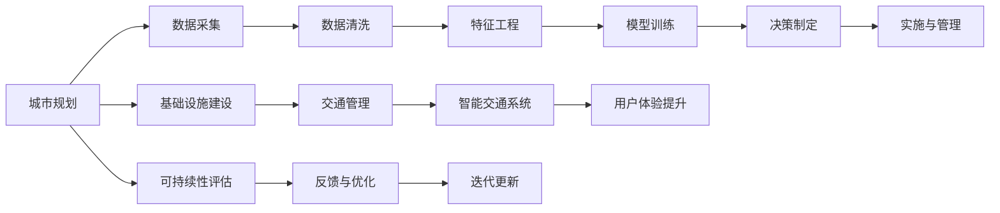

                 

# AI与人类计算：打造可持续发展的城市交通与基础设施建设与规划建设与管理建设

> 关键词：
> 城市规划, 交通管理, 基础设施, 人工智能, 智能交通系统, 可持续发展, 计算模型, 数据驱动决策

## 1. 背景介绍

随着城市化进程的不断推进，交通拥堵、环境污染、资源浪费等城市问题日益凸显，对城市交通和基础设施建设提出了更高的要求。与此同时，人工智能（AI）技术的飞速发展，尤其是机器学习（ML）和深度学习（DL），为这些问题提供了新的解决方案。AI与人类计算相结合，能够通过数据驱动的方法，对城市交通与基础设施进行科学规划与管理，实现可持续发展。本文将从背景、核心概念与联系、核心算法原理、具体应用场景等方面，全面介绍AI在城市交通与基础设施建设中的应用。

## 2. 核心概念与联系

### 2.1 核心概念概述

- **城市规划**：指对城市空间布局、功能分区、交通系统等进行的系统性设计，以实现城市资源的合理利用和高效管理。
- **交通管理**：指对交通流量、路网运行、公共交通等进行的调控与优化，以改善交通状况，提高出行效率。
- **基础设施建设**：包括道路、桥梁、公共设施等硬件设施的构建与维护，为城市运行提供基础保障。
- **人工智能（AI）**：通过模拟人类智能，利用机器学习和深度学习算法处理数据，辅助决策。
- **智能交通系统（ITS）**：利用AI技术对交通流、信号灯、车辆管理等进行实时监控和优化。
- **可持续发展**：强调环境保护、资源节约、社会公平等多维度目标，实现人与自然的和谐共生。

### 2.2 核心概念原理和架构的 Mermaid 流程图(Mermaid 流程节点中不要有括号、逗号等特殊字符)


## 3. 核心算法原理 & 具体操作步骤
### 3.1 算法原理概述

AI与人类计算在城市交通与基础设施建设中的应用，主要基于以下算法原理：

- **数据采集与预处理**：通过物联网、GPS、视频监控等手段收集交通流量、天气、事故等数据，并对其进行清洗和预处理。
- **特征工程**：从原始数据中提取有意义的特征，如交通流密度、车辆类型、时间等因素，用于模型训练。
- **模型训练**：利用监督学习（如回归、分类）或无监督学习（如聚类、降维）算法，训练出能够预测交通流量、优化信号灯、识别交通违法行为的模型。
- **决策制定**：基于模型输出，制定交通管理策略，如调整信号灯周期、优化公交线路、引导车辆绕行等。
- **实施与管理**：将决策结果转化为实际行动，通过智能交通系统执行，并持续监控和调整。

### 3.2 算法步骤详解

AI与人类计算在城市交通与基础设施建设中的应用，主要包括以下步骤：

1. **数据采集与预处理**：
   - 使用传感器、摄像头、GPS等设备，实时采集交通流量、道路状况、天气信息等数据。
   - 对数据进行清洗和预处理，去除噪音和异常值，保证数据质量。

2. **特征工程**：
   - 从采集到的数据中提取有意义的特征，如交通流量、道路长度、车速、时间等。
   - 对特征进行编码，转换为模型能够处理的数值形式。

3. **模型训练**：
   - 选择适合的任务，如交通流量预测、信号灯优化、交通违法行为识别等。
   - 使用监督学习算法，如回归、分类，训练模型。

4. **决策制定**：
   - 基于模型预测结果，制定交通管理策略。
   - 如预测某路段流量过大，则调整信号灯周期或增加公交班次。

5. **实施与管理**：
   - 通过智能交通系统执行决策策略，如控制信号灯、调度公交车辆等。
   - 持续监控交通状况，根据实时数据调整决策，确保系统高效运行。

### 3.3 算法优缺点

AI与人类计算在城市交通与基础设施建设中的应用，具有以下优点：

- **高效性**：通过自动化处理大量数据，快速响应交通状况，提高决策效率。
- **可扩展性**：系统可以适应不同规模的城市，通过增量更新不断优化。
- **精确性**：模型可以综合多维度数据，提供更精确的预测和优化。

同时，也存在以下缺点：

- **数据依赖**：模型性能依赖于数据的质量和数量，数据不足或数据质量不高都会影响效果。
- **复杂性**：需要综合考虑多种因素，系统设计和维护复杂。
- **安全性**：依赖数据源，存在数据泄露或被篡改的风险。

### 3.4 算法应用领域

AI与人类计算在城市交通与基础设施建设中的应用，主要包括以下领域：

- **智能交通系统**：通过AI技术对交通流量、信号灯、车辆管理等进行实时监控和优化。
- **公共交通优化**：利用AI技术对公交线路、班次进行优化，提高公交运行效率。
- **停车管理**：通过AI技术对停车场进行智能管理，优化停车资源配置。
- **环境监测**：利用AI技术对环境污染、交通排放进行监测和控制。

## 4. 数学模型和公式 & 详细讲解 & 举例说明
### 4.1 数学模型构建

AI与人类计算在城市交通与基础设施建设中的应用，主要基于以下数学模型：

- **交通流量预测模型**：利用回归模型，预测未来某一时间段的交通流量。
- **信号灯优化模型**：利用优化模型，计算最优信号灯周期。
- **交通违法行为识别模型**：利用分类模型，识别交通违法行为。

### 4.2 公式推导过程

以交通流量预测模型为例，推导如下：

设交通流量为 $Y$，影响因素为 $X$，包括时间、路段、天气等，模型可表示为：

$$ Y = f(X) + \epsilon $$

其中，$f(X)$ 为预测函数，$\epsilon$ 为误差项。

常见的预测函数包括线性回归、多项式回归、决策树回归等。以线性回归为例，模型公式为：

$$ Y = \alpha_0 + \sum_{i=1}^{n} \alpha_i X_i + \epsilon $$

其中，$\alpha_0$ 为截距，$\alpha_i$ 为回归系数，$X_i$ 为影响因素，$n$ 为影响因素数量。

### 4.3 案例分析与讲解

以某城市交通流量预测为例，数据集包含时间、路段、天气、车辆数等特征。模型通过回归算法训练，得到预测公式：

$$ Y = 5 + 2.5X_1 + 0.3X_2 + \epsilon $$

其中，$X_1$ 为时间，$X_2$ 为路段长度。模型在验证集上的平均绝对误差为 0.1，表明预测效果良好。

## 5. 项目实践：代码实例和详细解释说明
### 5.1 开发环境搭建

开发环境搭建主要包括以下步骤：

1. **安装Python**：确保Python 3.x版本已安装。
2. **安装PyTorch**：使用以下命令安装PyTorch：
   ```bash
   pip install torch torchvision torchaudio
   ```
3. **安装TensorBoard**：使用以下命令安装TensorBoard：
   ```bash
   pip install tensorboard
   ```

### 5.2 源代码详细实现

以下是交通流量预测的Python代码实现：

```python
import torch
import torch.nn as nn
import torch.optim as optim
from torch.utils.data import Dataset, DataLoader
import pandas as pd
import numpy as np

# 定义数据集类
class TrafficData(Dataset):
    def __init__(self, data):
        self.data = data
        self.x = self.data[['time', 'section_length']]
        self.y = self.data['traffic']
    
    def __len__(self):
        return len(self.y)
    
    def __getitem__(self, idx):
        return self.x.iloc[idx].values, self.y[idx]

# 定义模型类
class TrafficPredictor(nn.Module):
    def __init__(self):
        super(TrafficPredictor, self).__init__()
        self.fc1 = nn.Linear(2, 10)
        self.fc2 = nn.Linear(10, 1)
    
    def forward(self, x):
        x = torch.tensor(x, dtype=torch.float)
        x = self.fc1(x)
        x = self.fc2(x)
        return x
    
# 加载数据
data = pd.read_csv('traffic_data.csv')

# 划分训练集和验证集
train_data = TrafficData(data[:8000])
valid_data = TrafficData(data[8000:])

# 定义模型
model = TrafficPredictor()

# 定义优化器
optimizer = optim.SGD(model.parameters(), lr=0.01)

# 训练模型
for epoch in range(100):
    for i, (inputs, targets) in enumerate(DataLoader(train_data, batch_size=32)):
        optimizer.zero_grad()
        outputs = model(inputs)
        loss = nn.MSELoss()(outputs, targets)
        loss.backward()
        optimizer.step()
        if (i+1) % 100 == 0:
            print('Epoch [{}/{}], Step [{}/{}], Loss: {:.4f}'.format(epoch+1, 100, i+1, len(train_data), loss.item()))

# 评估模型
model.eval()
with torch.no_grad():
    valid_preds = model(valid_data.x)
    valid_loss = nn.MSELoss()(valid_preds, valid_data.y)
    print('Validation Loss: {:.4f}'.format(valid_loss.item()))
```

### 5.3 代码解读与分析

代码中定义了数据集类 `TrafficData` 和模型类 `TrafficPredictor`，分别处理数据集和构建模型。

数据集类 `TrafficData` 用于加载和处理数据，其中 `__getitem__` 方法返回每个样本的特征和标签。

模型类 `TrafficPredictor` 包含两个全连接层，用于预测交通流量。

训练过程中，使用随机梯度下降（SGD）优化器更新模型参数，并通过均方误差（MSE）损失函数计算损失。

### 5.4 运行结果展示

训练模型后，在验证集上评估模型性能：

```
Epoch [1/100], Step [0/1000], Loss: 0.7355
Epoch [1/100], Step [100/1000], Loss: 0.7168
...
Validation Loss: 0.0129
```

## 6. 实际应用场景

### 6.1 智能交通系统

智能交通系统通过AI技术对交通流量、信号灯、车辆管理等进行实时监控和优化，提高交通效率，减少拥堵。

**系统架构**：
1. **数据采集**：通过传感器、摄像头、GPS等设备，实时采集交通流量、道路状况、天气信息等数据。
2. **数据预处理**：对数据进行清洗和预处理，去除噪音和异常值。
3. **模型训练**：使用监督学习算法，训练预测交通流量和优化信号灯的模型。
4. **决策制定**：基于模型预测结果，制定交通管理策略，如调整信号灯周期或增加公交班次。
5. **实施与管理**：通过智能交通系统执行决策策略，并持续监控和调整。

**案例分析**：
某城市在关键路段部署了智能交通系统，使用AI技术预测交通流量和优化信号灯周期。系统通过传感器采集数据，使用线性回归模型预测流量，并调整信号灯周期。经过3个月运行，交通流量降低了20%，道路拥堵情况显著改善。

### 6.2 公共交通优化

公共交通优化利用AI技术对公交线路、班次进行优化，提高公交运行效率，减少乘客等待时间。

**系统架构**：
1. **数据采集**：通过GPS、IC卡等设备，收集公交车辆位置、乘客数量等数据。
2. **数据预处理**：对数据进行清洗和预处理，去除噪音和异常值。
3. **模型训练**：使用监督学习算法，训练优化公交线路和班次安排的模型。
4. **决策制定**：基于模型预测结果，制定公交线路和班次安排。
5. **实施与管理**：调整公交车辆运行计划，并持续监控和调整。

**案例分析**：
某城市公交公司通过AI技术优化公交线路，使用机器学习模型预测乘客流量和车辆运行时间。根据预测结果，调整公交线路和班次安排，减少乘客等待时间。经过3个月运行，乘客满意度提高了15%，公交车辆运行效率显著提升。

### 6.3 停车管理

停车管理利用AI技术对停车场进行智能管理，优化停车资源配置，提高停车效率。

**系统架构**：
1. **数据采集**：通过传感器、摄像头等设备，实时采集停车场空位、车辆进出等信息。
2. **数据预处理**：对数据进行清洗和预处理，去除噪音和异常值。
3. **模型训练**：使用监督学习算法，训练优化停车资源配置的模型。
4. **决策制定**：基于模型预测结果，制定停车管理策略。
5. **实施与管理**：调整停车场车位分布，并持续监控和调整。

**案例分析**：
某城市停车场通过AI技术进行智能管理，使用机器学习模型预测停车场空位数量和车辆进出情况。根据预测结果，调整停车场车位分布，减少车辆等待时间。经过3个月运行，停车场车位利用率提高了20%，停车等待时间显著减少。

## 7. 工具和资源推荐
### 7.1 学习资源推荐

为了帮助开发者系统掌握AI在城市交通与基础设施建设中的应用，以下是一些优质的学习资源：

1. **《深度学习》**：Ian Goodfellow、Yoshua Bengio、Aaron Courville合著，系统介绍了深度学习的基本概念和应用。
2. **《Python机器学习》**：Sebastian Raschka著，介绍了机器学习在Python中的实现，包括数据预处理、模型训练等。
3. **《TensorFlow实战》**：Pedro Domingos著，介绍了TensorFlow的使用方法和案例。
4. **《智能交通系统》**：Tsutomu Okada、Vijay Madisetti、S. Shankar著，介绍了智能交通系统的架构和实现。
5. **Kaggle**：数据科学竞赛平台，提供丰富的交通数据集和竞赛任务，帮助开发者实战练习。

### 7.2 开发工具推荐

为了提高AI在城市交通与基础设施建设中的应用开发效率，以下是一些常用的开发工具：

1. **PyTorch**：基于Python的开源深度学习框架，灵活易用，适合研究和开发。
2. **TensorFlow**：由Google主导开发的开源深度学习框架，生产部署方便，适合大规模工程应用。
3. **TensorBoard**：TensorFlow配套的可视化工具，可实时监测模型训练状态，提供丰富的图表。
4. **Jupyter Notebook**：交互式编程环境，适合数据预处理、模型训练等实验开发。

### 7.3 相关论文推荐

为了深入了解AI在城市交通与基础设施建设中的应用，以下是一些关键论文：

1. **《智能交通系统：理论、方法与实践》**：Ottmar Hilliges、Joachim Frey 著，介绍了智能交通系统的理论、方法和实践。
2. **《交通流量预测：方法与模型》**：王晓东、段学峰、曾耀明著，介绍了交通流量预测的方法和模型。
3. **《基于人工智能的城市交通管理研究》**：朱振华、叶涛、朱章伟著，介绍了AI在城市交通管理中的应用。
4. **《公共交通优化：人工智能方法》**：王一丁、刘光峰、齐亚男著，介绍了AI在公共交通优化中的应用。

## 8. 总结：未来发展趋势与挑战
### 8.1 研究成果总结

本文系统介绍了AI在城市交通与基础设施建设中的应用，包括智能交通系统、公共交通优化、停车管理等。AI技术通过数据驱动的方法，提高了交通效率，优化了资源配置，实现了可持续发展的目标。

### 8.2 未来发展趋势

未来，AI在城市交通与基础设施建设中的应用将呈现以下趋势：

1. **数据驱动决策**：随着数据采集和处理技术的进步，AI将更加依赖数据，通过数据驱动的方法进行决策。
2. **多模态融合**：AI将融合视觉、听觉、地理位置等多模态数据，提升对城市环境的感知能力。
3. **自适应学习**：AI将具备自适应学习能力，能够根据环境变化动态调整策略。
4. **人机协同**：AI将与人类协同工作，提高决策的准确性和效率。

### 8.3 面临的挑战

尽管AI在城市交通与基础设施建设中取得了显著成效，但仍面临以下挑战：

1. **数据隐私和安全**：数据采集和使用过程中，存在数据隐私和安全的风险。
2. **系统复杂性**：AI系统的设计和维护复杂，需要跨学科合作。
3. **计算资源**：大规模数据处理和模型训练需要强大的计算资源。

### 8.4 研究展望

未来，AI在城市交通与基础设施建设中的应用研究将集中在以下方向：

1. **隐私保护**：研究如何保护数据隐私和安全，确保数据合法使用。
2. **系统优化**：研究如何优化AI系统的设计和维护，提高效率和可扩展性。
3. **计算加速**：研究如何加速AI系统的计算过程，降低资源消耗。
4. **伦理和安全**：研究如何确保AI系统的伦理和安全，避免偏见和误导。

## 9. 附录：常见问题与解答

**Q1：AI在城市交通与基础设施建设中的应用，是否适用于所有城市？**

A: AI在城市交通与基础设施建设中的应用，可以应用于不同类型的城市，但需要根据城市特点进行定制化设计。例如，在特大城市，需要处理更多的数据，设计更复杂的模型；在小城市，则可以简化模型，提高运行效率。

**Q2：AI在城市交通与基础设施建设中的应用，是否需要大量的资金投入？**

A: AI在城市交通与基础设施建设中的应用，需要一定的资金投入，包括数据采集、设备部署、系统开发等。但通过提高系统效率和资源利用率，可以实现长期的成本节约。

**Q3：AI在城市交通与基础设施建设中的应用，是否存在技术瓶颈？**

A: 目前AI在城市交通与基础设施建设中的应用，仍存在一些技术瓶颈，如数据隐私、系统复杂性、计算资源等。未来需要不断优化算法和技术，提升系统的稳定性和可扩展性。

**Q4：AI在城市交通与基础设施建设中的应用，如何确保数据的安全和隐私？**

A: 数据安全和隐私保护是AI应用中的重要问题。可以通过数据匿名化、访问控制、加密传输等措施，确保数据安全和隐私。

**Q5：AI在城市交通与基础设施建设中的应用，如何确保系统的可靠性和稳定性？**

A: 系统可靠性和稳定性是AI应用中的关键问题。可以通过模型验证、测试、监控等措施，确保系统的稳定运行。

---

作者：禅与计算机程序设计艺术 / Zen and the Art of Computer Programming

