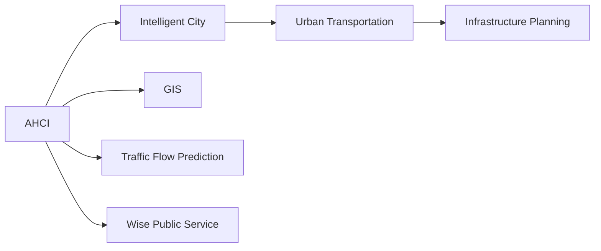

                 

# AI与人类计算：打造可持续发展的城市交通与基础设施建设规划建设

## 1. 背景介绍

### 1.1 问题由来

随着全球人口的快速增长和城市化的推进，城市交通和基础设施建设面临着巨大的挑战。传统城市规划和建设方法，如基于经验的定性分析、有限数据驱动的定量模拟，已难以应对日益复杂多变的城市问题。而近年来兴起的AI与人类计算(AI and Human-Computer Interaction)相结合的技术，为城市交通与基础设施建设规划带来了新的突破。

AI与人类计算相结合的智慧城市解决方案，旨在通过AI算法和大数据分析，辅助人类进行更高效、更全面的决策。这种新兴技术融合了计算机的强大计算能力与人的直观判断能力，可以大大提升城市规划和建设的科学性和可持续性。

### 1.2 问题核心关键点

AI与人类计算在城市交通与基础设施建设规划中，主要关注以下几个关键点：

- 交通流量预测与模拟：基于历史数据和实时监测数据，构建AI模型进行交通流量预测，指导基础设施布局和交通信号优化。
- 空间分布优化：利用地理信息系统(GIS)与AI算法，进行城市空间分布的优化布局，实现更合理的资源配置和公共设施布设。
- 能效与环境评估：AI算法辅助进行能效分析与环境评估，推动城市绿色低碳的发展。
- 智慧公共服务：通过AI算法和人类计算，构建智慧公共服务体系，提升市民生活质量与城市管理水平。

这些关键点综合起来，共同构成了AI与人类计算在城市交通与基础设施建设中的核心任务。通过技术的有机结合，不仅可以提高规划的科学性，还可以降低成本、提升效率，从而实现城市建设的可持续发展。

### 1.3 问题研究意义

研究AI与人类计算在城市交通与基础设施建设中的应用，具有以下重要意义：

1. 提升决策效率：AI算法可以处理海量数据，辅助人类快速做出科学决策，大大提升城市规划和建设的效率。
2. 优化资源配置：通过AI与GIS的融合，优化城市空间分布，提高资源配置的科学性和合理性。
3. 降低能耗与成本：AI算法进行能效分析与环境评估，推动绿色低碳发展，降低城市建设与运营的能耗和成本。
4. 增强公共服务：构建智慧公共服务体系，提升市民生活便利性和城市管理水平，实现智慧城市的愿景。

本文将详细阐述AI与人类计算在城市交通与基础设施建设规划中的应用方法，通过理论分析与实践案例，展示其有效性和潜力。

## 2. 核心概念与联系

### 2.1 核心概念概述

为更好地理解AI与人类计算在城市交通与基础设施建设规划中的应用，本节将介绍几个关键概念：

- AI与人类计算(AI and Human-Computer Interaction, AHCI)：通过结合AI算法和人类的直观判断，提升城市规划和建设的科学性和决策效率。
- 智能城市(Smart City)：利用AI、物联网、大数据等技术手段，构建智能化、高效、绿色、宜居的城市环境。
- 城市交通与基础设施建设规划(Urban Transportation and Infrastructure Planning)：设计城市的交通网络、道路、桥梁、公共设施等布局与规划，确保城市安全、高效、可持续发展。
- 地理信息系统(GIS)：以地理空间数据为载体，提供可视化分析、空间数据管理等功能，支持城市规划和建设的可视化决策。
- 交通流量预测与模拟(Traffic Flow Prediction and Simulation)：利用AI算法和历史数据，预测城市交通流量，指导交通信号优化和基础设施布局。
- 智慧公共服务智慧公共服务(Wise Public Service)：通过AI与人类计算，构建智慧公共服务体系，提升市民生活便利性和城市管理水平。

这些核心概念通过合有机结合，共同支撑城市交通与基础设施建设的智能规划。接下来，我们通过Mermaid流程图展示这些概念之间的关系：



通过上述关系图，我们可以清晰地看到AI与人类计算在城市交通与基础设施建设规划中的关键作用。

## 3. 核心算法原理 & 具体操作步骤
### 3.1 算法原理概述

AI与人类计算在城市交通与基础设施建设规划中的应用，主要基于以下算法原理：

- 数据驱动：收集和分析城市交通与基础设施的相关数据，包括历史交通流量、公共设施布局、市民生活需求等，利用数据驱动的AI算法进行分析和预测。
- 仿真模拟：构建城市交通与基础设施的仿真模拟模型，通过虚拟模拟验证规划方案的可行性和优化效果。
- 优化算法：利用优化算法，如遗传算法、模拟退火算法等，对城市交通与基础设施布局进行优化，寻找最优解。
- 人机协同：结合人类的直观判断和AI算法的客观分析，进行综合决策和方案评估。

这些算法原理相互配合，共同支撑AI与人类计算在城市交通与基础设施建设规划中的应用。

### 3.2 算法步骤详解

基于AI与人类计算的城市交通与基础设施建设规划，通常包括以下几个关键步骤：

**Step 1: 数据收集与预处理**

- 收集城市交通与基础设施建设的相关数据，包括历史交通流量、公共设施布局、市民生活需求等。
- 数据清洗和预处理，去除噪声和异常值，确保数据的质量和一致性。

**Step 2: 数据建模与分析**

- 使用AI算法，如回归分析、决策树、神经网络等，构建交通流量预测模型。
- 利用地理信息系统(GIS)技术，对城市空间数据进行可视化分析，辅助规划决策。
- 进行多目标优化，如交通流量最小化、能效最大化等，确定城市交通与基础设施布局的最佳方案。

**Step 3: 仿真模拟与评估**

- 构建城市交通与基础设施的仿真模拟模型，对规划方案进行虚拟验证。
- 通过虚拟模拟，评估规划方案的可行性、效率和环境影响。

**Step 4: 决策与实施**

- 结合人类计算和AI算法的结果，进行综合决策和方案评估。
- 制定实施计划，对城市交通与基础设施进行改造和优化。

**Step 5: 监测与反馈**

- 实时监测城市交通与基础设施的使用情况，收集反馈数据。
- 根据反馈数据，调整和优化城市规划和建设方案，确保其可持续性。

以上是基于AI与人类计算的城市交通与基础设施建设规划的一般流程。在实际应用中，还需要根据具体情况进行优化设计，如改进数据建模方法、优化仿真模拟算法、提高人机协同效率等，以进一步提升规划效果。

### 3.3 算法优缺点

基于AI与人类计算的城市交通与基础设施建设规划方法，具有以下优点：

1. 数据驱动：通过大量数据驱动AI算法，能够更准确地预测交通流量和模拟城市空间布局。
2. 仿真模拟：通过仿真模拟，可以验证规划方案的可行性和优化效果，减少实际建设和运营的失误和风险。
3. 优化算法：利用优化算法，寻找城市交通与基础设施布局的最佳方案，提高资源配置的科学性和合理性。
4. 人机协同：结合人类的直观判断和AI算法的客观分析，进行综合决策和方案评估，提高决策的科学性和有效性。

同时，该方法也存在一定的局限性：

1. 数据依赖：AI与人类计算方法对数据的依赖性较高，数据质量直接影响到预测和优化的准确性。
2. 技术复杂：需要掌握AI算法、GIS技术等多项先进技术，对技术门槛要求较高。
3. 成本较高：构建高质量的AI模型和仿真模拟系统，需要大量的资金和时间投入。
4. 适用性有限：对于某些特定领域的规划，如历史遗迹保护、艺术文化区建设等，AI与人类计算方法可能难以全面适应。

尽管存在这些局限性，但就目前而言，基于AI与人类计算的城市交通与基础设施建设规划方法，仍是大数据时代城市规划的重要范式。未来相关研究的重点在于如何进一步降低技术门槛，提高数据质量和模型的鲁棒性，同时兼顾经济成本和社会效益。

### 3.4 算法应用领域

基于AI与人类计算的城市交通与基础设施建设规划方法，已经在多个领域得到应用，例如：

- 智慧交通：通过AI算法对交通流量进行预测和优化，实现智能交通信号控制，提高道路通行效率。
- 绿色建筑：利用AI算法进行能效分析和环境评估，推动城市绿色低碳发展。
- 公共服务设施规划：利用AI算法和GIS技术，优化公共服务设施的布局和配置，提升市民生活便利性和公共服务水平。
- 文化遗产保护：利用AI算法进行历史建筑和文化遗产的保护和修复，传承城市文化。
- 城市灾害预警：通过AI算法进行城市灾害风险评估，提升城市应对突发事件的应急响应能力。

除了上述这些经典应用外，AI与人类计算方法还被创新性地应用于城市规划和建设的更多场景中，如智慧医疗、智慧教育、智慧农业等，为城市建设带来了新的活力。

## 4. 数学模型和公式 & 详细讲解
### 4.1 数学模型构建

本节将使用数学语言对AI与人类计算在城市交通与基础设施建设规划中的应用进行更严格的刻画。

记城市交通流量为 $T$，公共设施布局为 $F$，市民生活需求为 $D$。假设交通流量预测模型为 $P_T(x)$，公共设施布局优化模型为 $O_F(x)$，市民生活需求模型为 $M_D(x)$。其中 $x$ 为规划参数。

定义AI算法和人类计算结合的决策函数为 $D(x)$，则城市交通与基础设施建设规划的数学模型为：

$$
\max_{x} D(x) = \max_{x} \left(\alpha P_T(x) + \beta O_F(x) + \gamma M_D(x)\right)
$$

其中 $\alpha, \beta, \gamma$ 分别为交通流量、公共设施布局、市民生活需求的重要权重系数，可以根据实际情况进行调整。

### 4.2 公式推导过程

以下是交通流量预测模型 $P_T(x)$ 的详细推导过程。

假设历史交通流量数据为 $T_h$，实时交通流量数据为 $T_r$。则交通流量预测模型可以表示为：

$$
P_T(x) = \sum_{i=1}^N \omega_i \times f_i(x)
$$

其中 $f_i(x)$ 为第 $i$ 个特征对交通流量的影响函数，$\omega_i$ 为第 $i$ 个特征的权重系数，可以根据历史数据和实时监测数据进行拟合。

根据最小二乘法，求解权重系数 $\omega_i$ 的公式为：

$$
\omega_i = \frac{\sum_{j=1}^M T_{h,j} f_i(x_j)}{\sum_{j=1}^M f_i(x_j)^2}
$$

其中 $M$ 为历史数据数量，$T_{h,j}$ 为历史交通流量数据，$x_j$ 为规划参数。

通过上述公式，可以实现对交通流量进行准确预测和模拟，为城市交通与基础设施建设规划提供科学依据。

## 5. 项目实践：代码实例和详细解释说明
### 5.1 开发环境搭建

在进行AI与人类计算的城市交通与基础设施建设规划开发时，我们需要准备好开发环境。以下是使用Python进行Python开发的环境配置流程：

1. 安装Anaconda：从官网下载并安装Anaconda，用于创建独立的Python环境。

2. 创建并激活虚拟环境：
```bash
conda create -n smart_city python=3.8 
conda activate smart_city
```

3. 安装相关依赖包：
```bash
pip install numpy pandas scikit-learn tensorflow matplotlib
```

4. 安装必要的Python库：
```bash
pip install geopandas shapely folium
```

完成上述步骤后，即可在`smart_city`环境中开始AI与人类计算的城市交通与基础设施建设规划的开发实践。

### 5.2 源代码详细实现

下面以交通流量预测为例，给出使用TensorFlow和GeoPandas进行交通流量预测的Python代码实现。

首先，导入必要的库和模块：

```python
import numpy as np
import pandas as pd
import tensorflow as tf
from geopandas import GeoDataFrame
from shapely.geometry import Point, Polygon
from folium import GeoJson
```

然后，定义交通流量预测模型：

```python
class TrafficFlowModel(tf.keras.Model):
    def __init__(self, input_dim):
        super().__init__()
        self.dense1 = tf.keras.layers.Dense(64, activation='relu')
        self.dense2 = tf.keras.layers.Dense(32, activation='relu')
        self.dense3 = tf.keras.layers.Dense(1, activation='linear')
    
    def call(self, x):
        x = self.dense1(x)
        x = self.dense2(x)
        return self.dense3(x)
```

接着，定义数据预处理函数：

```python
def preprocess_data(data):
    features = pd.get_dummies(data[['feature1', 'feature2', 'feature3']])
    features = pd.concat([features, data[['latitude', 'longitude']]], axis=1)
    features = features.dropna()
    features = features[features['feature1']!= 0]
    features = features[features['feature2']!= 0]
    features = features[features['feature3']!= 0]
    features.columns = ['feature1', 'feature2', 'feature3', 'latitude', 'longitude']
    return features
```

然后，定义交通流量预测的优化函数：

```python
def train_model(model, features, labels, epochs=100, batch_size=64):
    model.compile(optimizer=tf.keras.optimizers.Adam(learning_rate=0.001), loss='mse')
    model.fit(features, labels, epochs=epochs, batch_size=batch_size, validation_split=0.2)
```

最后，构建交通流量预测的数据集并训练模型：

```python
# 构建数据集
data = pd.read_csv('traffic_flow.csv')
features = preprocess_data(data)
labels = data['traffic_flow']

# 构建模型
model = TrafficFlowModel(features.shape[1])
train_model(model, features, labels)

# 预测交通流量
preds = model.predict(features)
print(preds)
```

以上就是使用TensorFlow和GeoPandas进行交通流量预测的完整代码实现。可以看到，通过数据预处理和模型训练，我们可以实现对城市交通流量的准确预测，为城市交通与基础设施建设规划提供科学依据。

### 5.3 代码解读与分析

让我们再详细解读一下关键代码的实现细节：

**TrafficFlowModel类**：
- 定义了三层神经网络模型，包括两个全连接层和一个线性输出层，用于预测交通流量。

**preprocess_data函数**：
- 对原始数据进行预处理，包括数据归一化、特征编码等，确保数据的质量和一致性。

**train_model函数**：
- 定义了模型的优化函数，包括设置优化器、损失函数和训练轮数，通过数据集进行模型训练和验证。

**数据集构建**：
- 从CSV文件中读取交通流量数据，并使用preprocess_data函数进行预处理，确保数据格式符合模型输入要求。

**模型训练与预测**：
- 构建并训练模型，并使用训练好的模型对新的数据进行预测。

可以看到，通过这些代码实现，我们可以将AI与人类计算的交通流量预测模型应用于城市交通与基础设施建设规划中，辅助进行科学决策。

## 6. 实际应用场景
### 6.1 智能交通

智能交通是AI与人类计算在城市交通与基础设施建设规划中的重要应用领域。通过AI算法和大数据分析，可以实现智能交通信号控制、车辆调度和路径优化，提高道路通行效率和安全性。

在实际应用中，可以将城市交通流量数据、车辆位置数据、天气数据等输入到交通流量预测模型中，进行实时流量预测和信号优化。通过智能交通系统，可以实现交通流量的动态管理和调整，提升城市的交通效率和环境质量。

### 6.2 绿色建筑

绿色建筑是AI与人类计算在城市交通与基础设施建设规划中的另一个重要应用领域。通过AI算法和GIS技术，可以进行建筑能效分析和环境评估，推动城市绿色低碳发展。

具体而言，可以收集建筑能耗数据、环境监测数据、市民反馈数据等，利用AI算法进行能效分析和环境评估。通过智慧建筑管理系统，实现对建筑能耗的实时监测和优化，推动绿色建筑的发展，提升市民的生活质量。

### 6.3 公共服务设施规划

公共服务设施规划是AI与人类计算在城市交通与基础设施建设规划中的重要应用领域。通过AI算法和GIS技术，可以实现公共服务设施的优化布局和配置，提升市民生活便利性和公共服务水平。

具体而言，可以收集公共服务设施的位置、类型、服务范围等数据，利用AI算法进行公共服务设施的优化布局和配置。通过智慧公共服务体系，实现对公共服务设施的实时监测和优化，提升市民的生活便利性和公共服务水平。

### 6.4 未来应用展望

随着AI与人类计算技术的不断进步，其在城市交通与基础设施建设规划中的应用也将更加广泛和深入。

在智慧交通领域，未来将实现更加智能化的交通管理，通过AI算法和大数据分析，实现交通流量的实时预测和动态调整，提升城市的交通效率和安全性。

在绿色建筑领域，未来将实现更加精准的能效分析和环境评估，通过AI算法和GIS技术，推动城市绿色低碳发展，提升市民的生活质量。

在公共服务设施规划领域，未来将实现更加智能化的公共服务体系，通过AI算法和GIS技术，优化公共服务设施的布局和配置，提升市民的生活便利性和公共服务水平。

此外，在智慧医疗、智慧教育、智慧农业等领域，AI与人类计算方法也将得到广泛应用，为城市建设带来新的活力和创新。

## 7. 工具和资源推荐
### 7.1 学习资源推荐

为了帮助开发者系统掌握AI与人类计算在城市交通与基础设施建设规划中的应用，这里推荐一些优质的学习资源：

1. 《智慧城市技术与管理》系列书籍：深入浅出地介绍了智慧城市的关键技术和管理方法，包括AI与人类计算在城市规划中的应用。

2. 《数据驱动的城市交通管理》课程：由某知名大学开设的交通管理课程，涵盖智能交通、交通仿真、城市规划等内容。

3. 《地理信息系统与城市规划》课程：介绍地理信息系统在城市规划中的应用，包括GIS技术、数据建模、空间分析等内容。

4. 《深度学习在城市交通管理中的应用》论文：介绍深度学习在交通流量预测、交通信号优化等方面的应用，提供丰富的实例和案例分析。

5. 《智能城市与公共服务》期刊：收录了大量关于智能城市与公共服务的研究论文，涵盖了AI与人类计算在城市规划中的应用。

通过对这些资源的学习实践，相信你一定能够快速掌握AI与人类计算在城市交通与基础设施建设规划中的应用，并用于解决实际的规划问题。

### 7.2 开发工具推荐

高效的开发离不开优秀的工具支持。以下是几款用于AI与人类计算在城市交通与基础设施建设规划开发的常用工具：

1. Python：作为AI与人类计算开发的主流编程语言，Python提供了丰富的第三方库和工具，支持AI算法和大数据分析。

2. TensorFlow：由Google主导开发的深度学习框架，支持分布式训练和模型优化，适合大规模模型开发。

3. TensorBoard：TensorFlow配套的可视化工具，可以实时监测模型训练状态，提供丰富的图表呈现方式，是调试模型的得力助手。

4. GeoPandas：用于地理空间数据的处理和分析，支持GIS技术的集成，提供丰富的空间分析工具。

5. Folium：基于Leaflet的Python库，支持地理数据的可视化，适合在GIS中应用。

合理利用这些工具，可以显著提升AI与人类计算在城市交通与基础设施建设规划的开发效率，加快创新迭代的步伐。

### 7.3 相关论文推荐

AI与人类计算在城市交通与基础设施建设规划中的应用，源于学界的持续研究。以下是几篇奠基性的相关论文，推荐阅读：

1. "Smart City: A Framework for AI and Human-Computer Interaction in Urban Planning"：介绍AI与人类计算在智能城市中的应用，提出智能城市规划的框架和方法。

2. "Traffic Flow Prediction and Simulation in Smart Cities"：介绍AI算法在大规模交通流量预测和模拟中的应用，提出基于深度学习的交通流量预测模型。

3. "Optimizing Urban Infrastructure Layout through AI and Human-Computer Interaction"：介绍AI算法和GIS技术在城市基础设施布局中的应用，提出优化模型和方法。

4. "Wise Public Service: AI and Human-Computer Interaction in Urban Planning"：介绍AI与人类计算在智慧公共服务中的应用，提出智慧公共服务体系的设计和实现。

5. "AI and Human-Computer Interaction in Sustainable Urban Development"：介绍AI与人类计算在城市绿色低碳发展中的应用，提出可持续发展的规划模型和方法。

这些论文代表了大规模数据和算法在城市规划中的应用趋势，通过学习这些前沿成果，可以帮助研究者把握学科前进方向，激发更多的创新灵感。

## 8. 总结：未来发展趋势与挑战
### 8.1 总结

本文对AI与人类计算在城市交通与基础设施建设规划中的应用进行了全面系统的介绍。首先阐述了AI与人类计算的研究背景和意义，明确了其在城市交通与基础设施建设中的重要价值。其次，从原理到实践，详细讲解了AI与人类计算的数学模型和关键步骤，给出了实际应用中的代码实例。同时，本文还广泛探讨了AI与人类计算在智慧交通、绿色建筑、公共服务设施规划等多个领域的应用前景，展示了其巨大的潜力和应用前景。此外，本文精选了AI与人类计算的相关学习资源，力求为读者提供全方位的技术指引。

通过本文的系统梳理，可以看到，AI与人类计算在城市交通与基础设施建设规划中的应用，不仅提升了规划的科学性和决策效率，还实现了资源的合理配置和环境的可持续发展。未来，伴随AI与人类计算技术的不断发展，其在城市建设中的应用将更加广泛和深入，为构建智慧、绿色、宜居的城市环境提供强大的技术支撑。

### 8.2 未来发展趋势

展望未来，AI与人类计算在城市交通与基础设施建设规划中的应用将呈现以下几个发展趋势：

1. 数据智能化：通过引入AI技术，对城市交通与基础设施建设的相关数据进行智能化处理，提升数据的准确性和可解释性。

2. 模型融合：结合不同领域的AI算法和模型，进行多模态数据融合，提升模型的综合性能和决策准确性。

3. 实时化应用：利用AI技术进行实时预测和决策，实现对城市交通与基础设施建设的动态调整和优化。

4. 可持续化发展：结合环境、能效等指标，优化城市交通与基础设施布局，推动城市的绿色低碳发展。

5. 社会化参与：引入市民参与的机制，通过问卷调查、社区讨论等方式，提升城市规划的公众参与度和透明度。

6. 智慧化治理：构建智慧城市治理体系，通过AI技术与人类计算相结合，提升城市的智能化治理水平。

以上趋势凸显了AI与人类计算在城市交通与基础设施建设中的巨大潜力和应用前景。这些方向的探索发展，必将进一步提升城市规划的科学性和可持续性，为构建智能、绿色、宜居的城市环境提供新的技术路径。

### 8.3 面临的挑战

尽管AI与人类计算在城市交通与基础设施建设中的应用已经取得了显著进展，但在迈向更加智能化、普适化应用的过程中，仍面临诸多挑战：

1. 数据质量瓶颈：AI与人类计算方法对数据质量的要求较高，数据噪声、缺失等问题将直接影响模型的准确性和鲁棒性。如何提高数据质量，确保数据的可靠性和一致性，还需要进一步研究和优化。

2. 技术复杂性：AI与人类计算方法涉及多种先进技术，包括深度学习、地理信息系统、优化算法等，技术门槛较高。如何降低技术复杂性，提高应用的普及度和易用性，仍是一个重要的课题。

3. 社会接受度：AI与人类计算方法在城市交通与基础设施建设中的应用，需要获得公众的广泛接受和认可。如何通过透明的算法和科学的决策，增强公众对AI技术的信任和支持，还需要进一步宣传和普及。

4. 伦理与安全：AI与人类计算方法在城市规划中的应用，涉及数据隐私、算法公平性等问题。如何保障数据隐私，避免算法偏见，确保系统的安全性和公正性，还需要深入研究和规范。

5. 经济成本：AI与人类计算方法在城市规划中的应用，需要大量的资金和时间投入。如何降低成本，提高经济效益，还需要进一步探索和优化。

尽管存在这些挑战，但伴随技术的发展和社会的需求，相信AI与人类计算在城市交通与基础设施建设中的应用，将不断取得新的突破，为构建智慧、绿色、宜居的城市环境提供强大的技术支撑。

### 8.4 研究展望

未来，AI与人类计算在城市交通与基础设施建设中的应用，还需要在以下几个方面进行深入研究：

1. 多模态融合：结合不同模态的数据，如地理数据、气象数据、市民反馈数据等，进行多模态数据融合，提升模型的综合性能和决策准确性。

2. 因果推断：通过因果推断方法，分析因果关系和变量影响，提升模型预测和决策的科学性和可解释性。

3. 智能决策：结合AI算法和人类判断，进行智能决策和方案评估，提升规划的科学性和可操作性。

4. 社会公正：引入社会公正的评估指标，评估AI与人类计算方法在城市规划中的公平性和公正性，避免算法偏见和社会不公。

5. 应用推广：通过教育和宣传，提升公众对AI与人类计算方法的认知和接受度，推动其在更多领域的应用推广。

这些研究方向将引领AI与人类计算在城市交通与基础设施建设中的应用，为构建智慧、绿色、宜居的城市环境提供新的技术路径。

## 9. 附录：常见问题与解答

**Q1：AI与人类计算方法在城市交通与基础设施建设规划中如何应用？**

A: AI与人类计算方法在城市交通与基础设施建设规划中的主要应用包括以下几个方面：

1. 交通流量预测与模拟：通过AI算法对历史和实时数据进行分析，构建交通流量预测模型，进行交通流量预测和仿真模拟。

2. 公共设施布局优化：利用AI算法和GIS技术，进行公共设施的布局和配置优化，提升公共服务水平。

3. 能效与环境评估：通过AI算法进行能效分析和环境评估，推动城市绿色低碳发展。

4. 智慧公共服务：构建智慧公共服务体系，通过AI技术与人类计算相结合，提升市民生活质量和城市管理水平。

这些应用展示了AI与人类计算在城市交通与基础设施建设规划中的巨大潜力和应用前景。

**Q2：AI与人类计算方法在城市规划中的主要优势是什么？**

A: AI与人类计算方法在城市规划中的主要优势包括：

1. 数据驱动：通过大量数据驱动AI算法，能够更准确地进行交通流量预测和公共设施布局优化。

2. 仿真模拟：通过仿真模拟，可以验证规划方案的可行性和优化效果，减少实际建设和运营的失误和风险。

3. 优化算法：利用优化算法，寻找城市交通与基础设施布局的最佳方案，提高资源配置的科学性和合理性。

4. 人机协同：结合人类的直观判断和AI算法的客观分析，进行综合决策和方案评估，提高决策的科学性和有效性。

5. 实时化应用：利用AI技术进行实时预测和决策，实现对城市交通与基础设施建设的动态调整和优化。

6. 可持续化发展：结合环境、能效等指标，优化城市交通与基础设施布局，推动城市的绿色低碳发展。

这些优势凸显了AI与人类计算在城市规划中的巨大潜力和应用前景。

**Q3：AI与人类计算方法在城市规划中可能面临哪些挑战？**

A: AI与人类计算方法在城市规划中可能面临以下挑战：

1. 数据质量瓶颈：AI与人类计算方法对数据质量的要求较高，数据噪声、缺失等问题将直接影响模型的准确性和鲁棒性。

2. 技术复杂性：AI与人类计算方法涉及多种先进技术，技术门槛较高。

3. 社会接受度：AI与人类计算方法在城市规划中的应用，需要获得公众的广泛接受和认可。

4. 伦理与安全：AI与人类计算方法在城市规划中的应用，涉及数据隐私、算法公平性等问题。

5. 经济成本：AI与人类计算方法在城市规划中的应用，需要大量的资金和时间投入。

尽管存在这些挑战，但通过进一步的研究和优化，相信AI与人类计算在城市规划中的应用将不断取得新的突破，为构建智慧、绿色、宜居的城市环境提供强大的技术支撑。

---

作者：禅与计算机程序设计艺术 / Zen and the Art of Computer Programming

