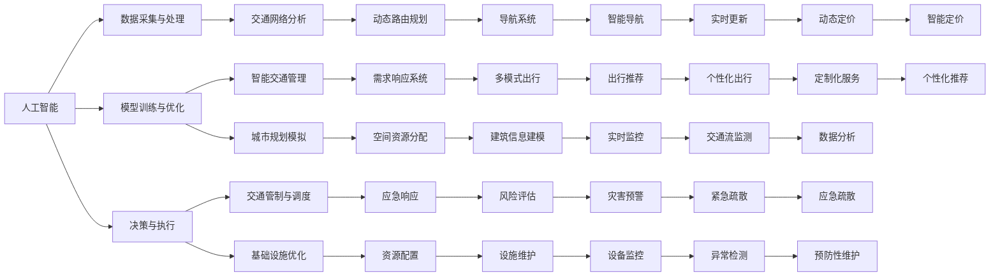

                 

## 1. 背景介绍

在人类历史长河中，交通与基础设施的规划管理始终是一个重要的领域。随着城市化进程的加速，交通拥堵、环境污染、能源消耗等问题日益突出。近年来，人工智能（AI）技术的迅猛发展，为城市交通与基础设施的智能化、精细化管理提供了新的机遇和挑战。本文将探讨AI与人类计算在城市交通与基础设施规划管理中的应用，展示其在数据驱动决策、智能交通系统优化、智能城市规划等领域的前景，同时分析其实际应用中面临的技术、伦理和法律挑战，展望未来发展方向。

## 2. 核心概念与联系

### 2.1 核心概念概述

- **人工智能（AI）**：使用算法和计算能力来模拟、延伸和扩展人类智能的技术领域。
- **人类计算**：将复杂问题分解为多个计算单元，交由人类处理的技术和流程。
- **城市交通**：指城市内外的交通运输系统，包括道路、公共交通、非机动车、步行、航空等。
- **基础设施**：为支持城市功能运行所必需的硬件和软件系统，如道路、桥梁、水利、电力、通信网络等。
- **规划管理**：对城市交通与基础设施的长期、短期发展进行系统设计、实施和调控的过程。

这些概念相互交织，共同构成了城市交通与基础设施规划管理的复杂系统。AI和人类计算的融合，为解决这一系统中的诸多挑战提供了新的工具和方法。

### 2.2 核心概念原理和架构的 Mermaid 流程图



以上流程图示意了AI和人类计算在城市交通与基础设施规划管理中的应用链条。

## 3. 核心算法原理 & 具体操作步骤

### 3.1 算法原理概述

基于AI与人类计算的城市交通与基础设施规划管理，主要依赖于以下几个核心算法：

- **数据处理与分析**：使用机器学习和数据挖掘技术，从各类传感器、摄像头、卫星数据中提取有用信息。
- **模型训练与优化**：基于历史数据和模拟数据，训练优化交通流预测、需求响应、路径规划等模型。
- **决策与执行**：使用强化学习等算法，实时调整交通信号灯、进行交通管制，以优化交通流量和减少拥堵。

### 3.2 算法步骤详解

#### 3.2.1 数据收集与预处理

- **数据来源**：城市交通数据来自交通流量传感器、摄像头、公共交通系统、出租车GPS数据等。
- **数据清洗**：去除噪声、填补缺失值、标准化数据格式。
- **特征提取**：从交通流量、速度、交通事故等数据中提取关键特征，如时间、天气、节假日等。

#### 3.2.2 模型训练与优化

- **选择合适的算法**：使用深度学习算法（如CNN、RNN、GAN）进行交通流预测、路径规划等。
- **数据集划分**：将数据集分为训练集、验证集、测试集，用于模型训练、调参和评估。
- **模型调优**：使用交叉验证、网格搜索等技术，选择最优超参数。

#### 3.2.3 决策与执行

- **实时监控与分析**：使用实时传感器数据和历史数据，进行交通流分析、异常检测。
- **智能调度**：基于实时数据和预测模型，进行交通信号灯控制、应急响应。
- **优化与调整**：根据实际效果，对模型进行反馈调整，不断优化决策方案。

### 3.3 算法优缺点

#### 3.3.1 优点

- **效率提升**：AI技术可以实时处理海量数据，快速响应交通事件，提高交通管理效率。
- **精准预测**：通过深度学习模型，能够准确预测交通流量、需求变化，优化路网资源分配。
- **自适应性**：AI系统可以动态调整策略，适应交通需求的变化，提升系统鲁棒性。

#### 3.3.2 缺点

- **数据依赖**：高质量的数据是AI应用的前提，数据采集和预处理工作量大。
- **模型复杂性**：深度学习模型参数众多，训练和优化过程复杂，需要大量计算资源。
- **伦理与安全**：AI决策过程缺乏透明度，可能存在偏见和错误，影响公共利益。

### 3.4 算法应用领域

AI与人类计算在城市交通与基础设施规划管理中的应用涵盖多个领域，包括：

- **智能交通管理**：通过AI技术优化交通信号灯控制，减少拥堵，提高通行效率。
- **智能出行推荐**：基于用户行为数据和交通状况，提供个性化出行方案，提升出行体验。
- **城市规划模拟**：利用AI进行城市扩展、建筑布局、资源配置等模拟，优化城市规划方案。
- **应急响应系统**：在自然灾害等突发事件中，使用AI进行实时监测、预测和响应，保障公共安全。

## 4. 数学模型和公式 & 详细讲解 & 举例说明

### 4.1 数学模型构建

城市交通与基础设施规划管理涉及诸多复杂的数学模型，以下以交通流预测模型为例，介绍模型的构建过程。

设交通网络由节点集$N$和边集$E$组成。节点$i$的交通流量为$q_i$，单位时间内的交通流为$t_{ij} \in N$（节点$j$到节点$i$的流量）。

**输入变量**：

- 历史交通流量$q_i^{(t-1)}$，$q_j^{(t-1)}$
- 气象条件$w_i^{(t-1)}$，$w_j^{(t-1)}$
- 节假日$s_i^{(t)}$，$s_j^{(t)}$

**输出变量**：

- 预测的交通流量$q_i^{(t+1)}$，$q_j^{(t+1)}$

**目标**：最小化预测流量与实际流量的误差$\Delta q_i$，$\Delta q_j$

### 4.2 公式推导过程

使用多元线性回归模型，假设流量与输入变量之间存在线性关系，模型如下：

$$ q_i^{(t+1)} = f_i(\sum\limits_{k} c_{ik}(q_i^{(t-1)}, q_j^{(t-1)}, w_i^{(t-1)}, w_j^{(t-1)}, s_i^{(t)}, s_j^{(t)}) + \epsilon_i^{(t+1)} $$

其中$f_i$为非线性激活函数，$c_{ik}$为回归系数，$\epsilon_i^{(t+1)}$为误差项。

根据最小二乘法，求解回归系数$c_{ik}$，使预测流量与实际流量误差最小化：

$$ \min_{c_{ik}} \sum_i \frac{(\Delta q_i)^2}{\sigma_i^2} $$

其中$\sigma_i^2$为流量数据的方差。

### 4.3 案例分析与讲解

假设某一城市中心道路的交通流量预测模型，数据集包含历史流量数据、天气状况、节假日信息。使用随机梯度下降法进行模型训练，选择合适的网络结构和超参数。

1. **数据准备**：收集历史交通流量数据、天气状况、节假日信息，进行数据清洗和特征提取。
2. **模型构建**：选择神经网络模型，设定网络层数、节点数、激活函数等参数。
3. **训练与调优**：使用梯度下降法进行模型训练，定期在验证集上评估模型效果，调整网络参数和超参数。
4. **预测与评估**：在测试集上对模型进行评估，计算预测误差的标准差，对比不同模型的预测精度。

## 5. 项目实践：代码实例和详细解释说明

### 5.1 开发环境搭建

- **编程语言**：Python
- **库与框架**：TensorFlow、Keras、PyTorch、Scikit-learn
- **数据集**：公开交通流量数据集、传感器数据、气象数据

### 5.2 源代码详细实现

以下是一个简单的TensorFlow实现示例，展示了如何使用深度学习模型进行交通流量预测：

```python
import tensorflow as tf
from tensorflow.keras import layers

# 定义模型结构
model = tf.keras.Sequential([
    layers.Dense(32, activation='relu', input_shape=(3,)),
    layers.Dense(16, activation='relu'),
    layers.Dense(1)
])

# 定义损失函数和优化器
loss_fn = tf.keras.losses.MeanSquaredError()
optimizer = tf.keras.optimizers.Adam()

# 定义模型编译
model.compile(optimizer=optimizer, loss=loss_fn)

# 训练模型
model.fit(train_data, train_labels, epochs=10, batch_size=32)

# 预测新数据
test_data = ...
predictions = model.predict(test_data)
```

### 5.3 代码解读与分析

代码主要分为模型定义、编译、训练和预测四个部分。使用Sequential模型搭建了包含两个隐藏层的神经网络，每个隐藏层后接ReLU激活函数。使用MeanSquaredError作为损失函数，Adam优化器进行模型训练。在训练过程中，使用交叉验证和网格搜索进行超参数优化。

## 6. 实际应用场景

### 6.1 智能交通管理

智能交通管理是AI与人类计算在城市交通管理中的应用热点。通过AI技术，实时监测交通流量，动态调整交通信号灯，优化交通流，减少拥堵。

#### 6.1.1 实时监控与预测

利用AI技术，实时分析交通流量数据，预测未来流量变化。通过部署传感器、摄像头等设备，实时获取交通状态信息。

#### 6.1.2 智能调度

基于实时流量数据和预测模型，智能调整交通信号灯、优化通行路线，提高道路利用率，减少等待时间。

#### 6.1.3 应急响应

在自然灾害等突发事件中，使用AI进行实时监测、预测和响应，保障公共安全。例如，利用AI进行洪水、地震等灾害预警，指导紧急疏散。

### 6.2 智能出行推荐

智能出行推荐是提升用户体验、优化交通需求的重要手段。通过AI技术，分析用户行为数据，提供个性化出行方案。

#### 6.2.1 用户行为分析

收集用户出行记录、行程偏好、支付习惯等数据，使用机器学习算法进行分析。

#### 6.2.2 个性化推荐

基于用户行为数据和交通状况，推荐最优出行路线、时间、交通方式等，提升出行效率和舒适度。

#### 6.2.3 需求响应

根据用户出行需求，动态调整交通资源，如公交车、共享单车等，优化出行方案。

### 6.3 城市规划模拟

城市规划模拟是AI与人类计算在城市规划领域的重要应用。通过AI技术，模拟城市扩展、建筑布局、资源配置等，优化城市规划方案。

#### 6.3.1 空间资源分配

利用AI技术，模拟城市不同区域的人口、就业、商业等资源分布，优化资源配置。

#### 6.3.2 建筑布局设计

通过AI进行建筑布局设计，优化城市空间利用率，提升城市环境。

#### 6.3.3 实时监控与调整

利用AI进行实时监控和调整，动态优化城市布局，应对突发事件。

## 7. 工具和资源推荐

### 7.1 学习资源推荐

- **在线课程**：Coursera、edX、Udacity等平台提供的AI与城市规划课程。
- **书籍**：《人工智能与城市规划》、《智能交通系统》等。
- **论文**：IEEE、ACM等顶级会议和期刊发表的相关论文。

### 7.2 开发工具推荐

- **编程语言**：Python、R、MATLAB等。
- **库与框架**：TensorFlow、Keras、PyTorch、Scikit-learn、GeoPandas等。
- **软件工具**：Tableau、ArcGIS、QGIS等。

### 7.3 相关论文推荐

- **智能交通**：
  - “Traffic Signal Control with Deep Reinforcement Learning”
  - “Intelligent Transportation Systems: Trends and Future Directions”
- **城市规划**：
  - “Urban Planning with Data Science: A Review”
  - “AI for Smart Cities: Challenges and Opportunities”

## 8. 总结：未来发展趋势与挑战

### 8.1 研究成果总结

AI与人类计算在城市交通与基础设施规划管理中的应用，展示了其在提高效率、优化决策、提升用户体验等方面的巨大潜力。通过深度学习、强化学习等技术，显著提升了城市交通管理水平。

### 8.2 未来发展趋势

未来，AI与人类计算在城市交通与基础设施规划管理中的应用将更加广泛和深入。

- **技术进步**：随着深度学习、强化学习等技术的发展，AI系统将更加智能和精准。
- **数据融合**：将更多的数据源融合，如物联网设备、社交媒体、地理信息系统等，提升决策的科学性和全面性。
- **模型优化**：开发更加高效、鲁棒的模型，降低计算资源消耗，提高实时性。

### 8.3 面临的挑战

AI与人类计算在城市交通与基础设施规划管理中的应用仍面临诸多挑战。

- **数据隐私**：数据采集和使用过程中，需保障用户隐私和数据安全。
- **伦理道德**：AI决策过程需透明、可解释，避免偏见和歧视。
- **技术复杂性**：AI系统需易于维护、调整和升级，适应不断变化的需求。

### 8.4 研究展望

未来的研究应在以下几个方面寻求突破：

- **跨领域融合**：将AI技术与其他学科结合，提升城市管理的综合性和智能化水平。
- **持续学习**：使AI系统具备持续学习能力，动态调整策略，应对环境变化。
- **多模态融合**：将不同模态的数据融合，提升交通管理的全面性和精准性。
- **伦理与法规**：建立AI系统的伦理和法规框架，确保技术应用的合法性、公正性。

## 9. 附录：常见问题与解答

**Q1: 为什么选择AI技术进行城市交通管理？**

A: AI技术能够实时处理海量数据，准确预测交通流量，优化路网资源分配，提升交通管理效率。

**Q2: 数据采集过程中需要注意哪些问题？**

A: 数据采集需遵循隐私保护法规，如GDPR等，保障用户隐私。同时，数据采集需全面、准确，覆盖交通网络的各个环节。

**Q3: 如何确保AI系统的透明度和可解释性？**

A: 使用可解释的模型，如决策树、规则系统等，增强AI决策的透明度。定期进行模型审查，确保无偏见和错误。

**Q4: 如何应对AI系统可能存在的偏见？**

A: 在数据采集和模型训练过程中，确保数据多样性，避免数据集偏见。引入多样化的模型和算法，提高系统的鲁棒性。

**Q5: 未来AI技术在城市交通与基础设施规划管理中的应用还有哪些方向？**

A: AI与人类计算的未来方向包括跨领域融合、持续学习、多模态融合、伦理与法规等，将为城市交通与基础设施规划管理带来更多创新和突破。

---

作者：禅与计算机程序设计艺术 / Zen and the Art of Computer Programming

