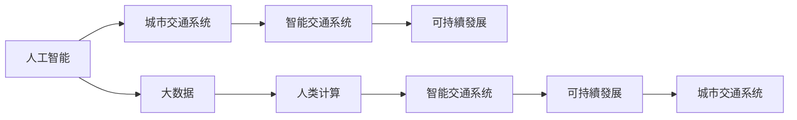

                 

# AI与人类计算：打造可持续发展的城市交通系统与规划

## 1. 背景介绍

随着城市的快速发展和交通需求的不断增长，如何在保证交通流畅的同时实现能源的高效利用和环境的可持续发展，已经成为世界各地的城市交通规划者和政府部门面临的重大挑战。传统的交通规划和管理系统往往依赖于大量的实地调研和专家经验，难以适应交通问题的复杂性和动态性。人工智能和大数据技术的快速发展，为城市交通管理提供了新的可能性。

人工智能和大数据技术可以通过对交通数据进行分析，提取交通模式和行为规律，辅助城市交通规划者和政策制定者做出科学决策。然而，要实现这一目标，首先需要对AI与人类计算的融合机制有深入的理解。本文将探讨AI与人类计算在城市交通系统与规划中的应用，分析其原理和操作步骤，并展望未来发展趋势。

## 2. 核心概念与联系

### 2.1 核心概念概述

为了更好地理解AI与人类计算在城市交通系统中的应用，我们将介绍几个关键概念：

- **人工智能(Artificial Intelligence, AI)**：指通过算法和计算手段模拟人类智能的机器系统，包括感知、学习、推理、决策等能力。

- **大数据(Big Data)**：指海量、高速、多样化的数据集，通过大数据技术可以从中挖掘出有价值的信息和知识。

- **城市交通系统(Urban Transportation System)**：指包括道路、公共交通、轨道交通、非机动车和步行设施等在内的城市交通网络，以及与其相关的管理、控制和规划系统。

- **人类计算(Human Computation)**：指利用人类的认知能力，通过协作和众包等方式，解决需要人类智慧的问题。

- **智能交通系统(Intelligent Transportation System, ITS)**：指利用AI和大数据技术，实现交通信息的实时采集、传输、分析和应用，提升交通管理和运营的智能化水平。

- **可持續發展(Sustainable Development)**：指在不损害后代满足其需求的能力的前提下，满足当代人的需求。

这些概念之间的逻辑关系可以通过以下Mermaid流程图来展示：



这个流程图展示了大数据、人工智能、人类计算、智能交通系统和可持续发展之间的联系：

1. **人工智能和大数据**：通过分析大量的交通数据，智能交通系统可以提取交通模式和行为规律。
2. **人类计算**：利用人类智慧，解决需要AI无法独立解决的复杂问题，如交通系统的设计与优化。
3. **智能交通系统**：将AI与人类计算结合起来，实现交通信息的实时管理和决策。
4. **可持续发展**：智能交通系统通过提高交通效率和降低能源消耗，支持城市交通系统的绿色发展。

## 3. 核心算法原理 & 具体操作步骤

### 3.1 算法原理概述

AI与人类计算在城市交通系统中的应用，主要依赖于以下算法原理：

- **数据收集与处理**：通过传感器、摄像头、GPS等设备收集交通数据，包括交通流量、车速、事故、违法行为等。

- **数据建模与分析**：使用机器学习算法，如深度学习、时间序列分析、聚类等，对收集到的数据进行建模和分析，提取交通模式和行为规律。

- **决策支持与优化**：利用AI和大数据技术，辅助交通规划者和决策者进行交通流量优化、路径规划、信号控制等决策。

- **实时监控与反馈**：通过智能交通系统，实时监控交通状况，收集反馈信息，进一步优化交通管理策略。

### 3.2 算法步骤详解

AI与人类计算在城市交通系统中的应用，一般包括以下关键步骤：

**Step 1: 数据收集与处理**
- 使用传感器、摄像头、GPS等设备，采集交通数据。
- 对数据进行清洗、去重、格式化等预处理操作。

**Step 2: 数据建模与分析**
- 利用深度学习模型，如卷积神经网络(CNN)、循环神经网络(RNN)、长短期记忆网络(LSTM)等，对交通数据进行建模和分析。
- 通过时序分析、聚类等方法，提取交通模式和行为规律。

**Step 3: 决策支持与优化**
- 利用AI模型，对交通流量进行预测和优化，如通过深度强化学习进行交通信号控制。
- 辅助交通规划者进行路线规划、交通流量分配等决策。

**Step 4: 实时监控与反馈**
- 通过智能交通系统，实时监控交通状况。
- 收集反馈信息，进一步优化交通管理策略。

**Step 5: 可持续发展的评估**
- 评估交通系统的能源消耗、环境影响等指标。
- 根据评估结果，调整交通管理策略，促进可持续发展。

### 3.3 算法优缺点

AI与人类计算在城市交通系统中的应用，具有以下优点：

- **高效性**：AI和大数据技术可以快速处理和分析大量的交通数据，提取交通模式和行为规律。
- **实时性**：智能交通系统可以实现实时监控和反馈，快速调整交通管理策略。
- **可扩展性**：AI与人类计算的应用，可以随着交通数据的增加和交通系统的扩大而扩展。

同时，该方法也存在以下缺点：

- **数据依赖性**：AI与人类计算的应用效果依赖于高质量、大规模的交通数据。
- **模型复杂性**：深度学习等AI模型需要大量的计算资源和数据量，模型训练和优化过程复杂。
- **伦理和隐私问题**：AI在交通系统中的应用涉及大量个人隐私数据，存在伦理和隐私风险。
- **决策透明度**：AI模型的决策过程复杂，难以解释和理解，存在透明度问题。

尽管存在这些局限性，但AI与人类计算在城市交通系统中的应用，仍然具有显著的优势和广阔的应用前景。未来相关研究的重点在于如何进一步提高算法的透明度和可解释性，确保数据的安全性和隐私保护，以及提升算法的实时性和可扩展性。

### 3.4 算法应用领域

AI与人类计算在城市交通系统中的应用，已经涵盖了多个领域，包括：

- **交通流量预测**：使用AI模型对未来交通流量进行预测，辅助交通规划者进行流量调控。
- **交通信号控制**：利用AI进行交通信号控制，优化交通流，减少拥堵和事故。
- **公共交通优化**：通过AI模型优化公交线路和班次，提高公共交通的效率和覆盖率。
- **停车管理**：利用AI技术优化停车场的分布和收费，减少交通拥堵。
- **事故预防**：通过AI模型分析交通事故数据，预测并预防潜在的交通事故。
- **出行导航**：利用AI和地图数据，提供实时导航服务，优化出行路径。

除了上述这些领域外，AI与人类计算在城市交通系统中的应用，还在不断拓展，如智能停车、共享出行、交通健康管理等，为城市交通系统的智能化和可持续发展提供了新的思路。

## 4. 数学模型和公式 & 详细讲解 & 举例说明

### 4.1 数学模型构建

本节将使用数学语言对AI与人类计算在城市交通系统中的应用进行更加严格的刻画。

记交通流量数据为 $T=\{x_1,x_2,...,x_N\}$，其中 $x_i$ 表示在第 $i$ 个时间点上的交通流量。假设交通流量的变化符合某种统计规律，可以使用以下数学模型进行建模：

$$
T \sim \mathcal{N}(\mu, \sigma^2)
$$

其中 $\mu$ 为均值，$\sigma^2$ 为方差，$\mathcal{N}$ 表示正态分布。

### 4.2 公式推导过程

通过上述数学模型，我们可以进行以下公式推导：

假设已知前 $k$ 个时间点的交通流量数据，需要预测第 $k+1$ 个时间点的交通流量 $x_{k+1}$，可以使用以下公式进行预测：

$$
\mu_{k+1} = \mu_k + \Delta t \cdot \sigma \cdot \mathcal{N}(0,1)
$$

其中 $\Delta t$ 为时间间隔，$\sigma$ 为标准差。根据正态分布的性质，可以计算出 $x_{k+1}$ 的预测值。

### 4.3 案例分析与讲解

以交通流量预测为例，假设我们已经获得了某条道路在过去100天的交通流量数据，需要预测下一个月的交通流量。可以使用上述数学模型进行建模和预测。首先，对数据进行预处理，去除异常值和噪声。然后，使用时间序列分析方法，确定数据的统计规律，即均值和方差。接着，使用AI模型对未来交通流量进行预测，得到下一个月的交通流量预测值。最后，将预测值反馈给交通管理系统，进行流量调控和优化。

## 5. 项目实践：代码实例和详细解释说明

### 5.1 开发环境搭建

在进行AI与人类计算在城市交通系统中的应用实践前，我们需要准备好开发环境。以下是使用Python进行TensorFlow开发的环境配置流程：

1. 安装Anaconda：从官网下载并安装Anaconda，用于创建独立的Python环境。

2. 创建并激活虚拟环境：
```bash
conda create -n tf-env python=3.8 
conda activate tf-env
```

3. 安装TensorFlow：根据CUDA版本，从官网获取对应的安装命令。例如：
```bash
conda install tensorflow -c tf -c conda-forge
```

4. 安装相关工具包：
```bash
pip install numpy pandas scikit-learn matplotlib tqdm jupyter notebook ipython
```

完成上述步骤后，即可在`tf-env`环境中开始实践。

### 5.2 源代码详细实现

这里我们以交通流量预测为例，给出使用TensorFlow进行城市交通系统建模和预测的Python代码实现。

首先，定义交通流量数据和模型参数：

```python
import tensorflow as tf
import numpy as np
import pandas as pd

# 交通流量数据
data = pd.read_csv('traffic_data.csv')

# 模型参数
learning_rate = 0.001
batch_size = 32
epochs = 100
```

然后，定义数据预处理函数：

```python
def preprocess_data(data):
    # 数据标准化
    data = (data - data.mean()) / data.std()
    return data

# 预处理数据
data = preprocess_data(data)
```

接着，定义模型架构：

```python
# 定义模型
model = tf.keras.Sequential([
    tf.keras.layers.Dense(64, activation='relu', input_shape=(N,)),
    tf.keras.layers.Dense(32, activation='relu'),
    tf.keras.layers.Dense(1)
])
```

然后，定义损失函数和优化器：

```python
# 定义损失函数
loss_fn = tf.keras.losses.MeanSquaredError()

# 定义优化器
optimizer = tf.keras.optimizers.Adam(learning_rate)
```

接下来，定义训练函数：

```python
def train_model(model, data, loss_fn, optimizer, batch_size, epochs):
    # 划分训练集和验证集
    train_data = data[:train_size]
    val_data = data[train_size:]

    # 训练模型
    for epoch in range(epochs):
        for i in range(0, len(train_data), batch_size):
            # 获取一批数据
            x = train_data[i:i+batch_size]
            y = train_data[i:i+batch_size]

            # 前向传播
            with tf.GradientTape() as tape:
                y_pred = model(x)
                loss = loss_fn(y, y_pred)

            # 反向传播
            grads = tape.gradient(loss, model.trainable_variables)
            optimizer.apply_gradients(zip(grads, model.trainable_variables))

        # 验证集评估
        val_loss = loss_fn(val_data, model.predict(val_data))
        print(f'Epoch {epoch+1}, train loss: {loss:.4f}, val loss: {val_loss:.4f}')
```

最后，启动训练流程：

```python
train_model(model, data, loss_fn, optimizer, batch_size, epochs)

# 模型保存
model.save('traffic_model.h5')
```

以上就是使用TensorFlow进行城市交通系统建模和预测的完整代码实现。可以看到，TensorFlow提供了强大的计算图机制和便捷的API，使得模型构建和训练变得相对简单。

### 5.3 代码解读与分析

让我们再详细解读一下关键代码的实现细节：

**数据预处理函数**：
- 对原始数据进行标准化处理，以消除不同特征之间的量纲差异。

**模型架构**：
- 使用多层感知器(Multi-Layer Perceptron, MLP)作为模型，包含两个隐藏层和一个输出层。

**损失函数和优化器**：
- 使用均方误差损失函数，适用于回归问题。
- 使用Adam优化器，自适应调整学习率，适用于深度学习模型。

**训练函数**：
- 划分训练集和验证集，每轮训练使用batch_size个样本。
- 在每个epoch内，对每个batch进行前向传播和反向传播。
- 在每个epoch后，使用验证集评估模型性能，输出训练损失和验证损失。
- 最终将模型保存为h5格式，便于后续使用。

可以看到，TensorFlow提供了丰富的API和便捷的接口，使得AI与人类计算在城市交通系统中的应用实践变得相对容易。开发者可以更专注于模型的优化和算法的设计。

## 6. 实际应用场景

### 6.1 智能交通系统

AI与人类计算在智能交通系统中的应用，已经在多个城市得到了广泛应用。智能交通系统通过实时监测和分析交通数据，提供交通流量预测、路径规划、信号控制等功能，极大地提升了交通管理的智能化水平。

在实际应用中，智能交通系统可以部署在多个交通节点，通过摄像头、传感器等设备，实时采集交通数据。然后使用AI模型对这些数据进行分析，提取交通模式和行为规律，辅助交通管理者和政策制定者进行决策。例如，通过交通流量预测，可以提前调整信号灯，优化交通流量；通过路径规划，可以为司机提供最优路线；通过信号控制，可以自动调整信号灯时间，减少拥堵和事故。

### 6.2 公共交通优化

AI与人类计算在公共交通优化中的应用，同样取得了显著的效果。公共交通系统面临着流量波动、运力分配不均等问题，通过AI和大数据技术，可以优化公共交通的运营效率和覆盖率。

在实践中，公共交通系统可以收集历史运营数据，包括乘客数量、车辆位置、线路客流等。然后使用AI模型对这些数据进行建模和分析，预测未来客流变化趋势，优化线路和班次安排。例如，通过乘客数量预测，可以动态调整运力分配，减少乘客等待时间；通过车辆位置预测，可以实现实时调度，提高运营效率；通过线路客流预测，可以优化线路设置，提高覆盖率。

### 6.3 停车管理

AI与人类计算在停车管理中的应用，主要集中在优化停车场的分布和收费上。传统停车管理往往存在资源浪费和收费不合理等问题，通过AI技术可以更科学地管理停车场。

在实践中，停车管理系统可以收集停车场的使用数据，包括停车时长、位置、收费等。然后使用AI模型对这些数据进行分析和预测，优化停车场的分布和收费策略。例如，通过停车时长预测，可以实现动态定价，提高停车场使用率；通过位置预测，可以实现资源调配，减少空置率；通过收费分析，可以实现合理定价，提高用户满意度。

### 6.4 未来应用展望

随着AI与人类计算技术的不断发展，其在城市交通系统中的应用也将不断拓展和深化。未来可能的应用方向包括：

- **智能停车管理**：利用AI技术优化停车场的分布和收费，提高停车效率和公平性。
- **共享出行服务**：通过AI技术优化共享出行资源的调配和调度，提升用户体验。
- **交通健康管理**：利用AI技术监测和预测交通污染，制定有效的环保政策。
- **交通应急管理**：通过AI技术预测和预防自然灾害和事故，保障交通系统的安全性。

## 7. 工具和资源推荐

### 7.1 学习资源推荐

为了帮助开发者系统掌握AI与人类计算在城市交通系统中的应用，这里推荐一些优质的学习资源：

1. **《深度学习基础》课程**：斯坦福大学开设的深度学习课程，涵盖深度学习的基本概念和经典模型。

2. **《智能交通系统》书籍**：详细介绍了智能交通系统的原理和应用，包括数据采集、处理和分析等环节。

3. **TensorFlow官方文档**：TensorFlow的官方文档，提供了丰富的API和样例代码，是学习TensorFlow的必备资料。

4. **Arxiv论文库**：涵盖AI与人类计算在城市交通系统中的最新研究成果，推荐阅读相关论文。

5. **Coursera在线课程**：提供了多门与智能交通系统相关的在线课程，涵盖从数据处理到算法设计等多个方面。

通过对这些资源的学习实践，相信你一定能够快速掌握AI与人类计算在城市交通系统中的应用，并用于解决实际的交通问题。

### 7.2 开发工具推荐

高效的开发离不开优秀的工具支持。以下是几款用于AI与人类计算在城市交通系统中的应用开发的常用工具：

1. **TensorFlow**：Google开发的深度学习框架，灵活的计算图机制，适合大规模模型的构建和训练。

2. **Keras**：基于TensorFlow的高级API，提供了便捷的模型构建接口，适用于快速原型设计和实验。

3. **PyTorch**：Facebook开发的深度学习框架，动态计算图机制，适合研究和实验。

4. **Jupyter Notebook**：开源的交互式笔记本环境，支持Python代码的编写和执行，适合数据探索和模型调试。

5. **GitHub**：全球最大的代码托管平台，提供丰富的开源项目和代码库，适合协作开发和资源共享。

合理利用这些工具，可以显著提升AI与人类计算在城市交通系统中的应用开发效率，加快创新迭代的步伐。

### 7.3 相关论文推荐

AI与人类计算在城市交通系统中的应用研究，源于学界的持续探索。以下是几篇奠基性的相关论文，推荐阅读：

1. **《智能交通系统中的AI与大数据应用》**：探讨了AI与大数据技术在交通流量预测、路径规划、信号控制等方面的应用。

2. **《基于深度学习的城市交通系统建模与优化》**：提出了一种基于深度学习的城市交通系统建模方法，并应用于交通流量预测和路径规划。

3. **《智能交通系统中的多模态信息融合》**：探讨了多模态信息在交通管理和决策中的应用，提出了多模态融合的智能交通系统架构。

4. **《可持續交通系统的AI与人类计算方法》**：提出了一种基于AI与人类计算的可持續交通系统建模方法，并应用于交通流量预测和优化。

这些论文代表了AI与人类计算在城市交通系统中的应用研究的前沿。通过学习这些前沿成果，可以帮助研究者把握学科前进方向，激发更多的创新灵感。

## 8. 总结：未来发展趋势与挑战

### 8.1 总结

本文对AI与人类计算在城市交通系统中的应用进行了全面系统的介绍。首先阐述了AI与人类计算在城市交通系统中的应用背景和意义，明确了AI与人类计算在交通管理中的重要价值。其次，从原理到实践，详细讲解了AI与人类计算的数学模型和操作步骤，给出了实际应用中的代码实例。同时，本文还广泛探讨了AI与人类计算在智能交通系统中的应用前景，展示了其广阔的发展潜力。

通过本文的系统梳理，可以看到，AI与人类计算在城市交通系统中的应用，通过深度学习、大数据等技术，极大地提升了交通管理的智能化水平。未来，随着技术的不断进步，AI与人类计算的应用将更加广泛，为城市交通系统的绿色、高效和可持续发展提供新的思路。

### 8.2 未来发展趋势

展望未来，AI与人类计算在城市交通系统中的应用将呈现以下几个发展趋势：

1. **数据驱动的决策**：通过大数据技术，实时采集和分析交通数据，辅助决策者进行科学决策。

2. **智能化交通系统**：通过AI技术，实现交通信息的实时监测和分析，提升交通管理的智能化水平。

3. **多模态信息融合**：通过多模态信息融合，提升交通系统的感知能力和决策能力。

4. **可持续发展**：通过AI与人类计算的应用，优化交通资源配置，促进城市交通系统的绿色、高效发展。

5. **人机协同**：利用AI技术优化人类智慧，实现人机协同的智能交通系统。

6. **跨学科融合**：结合交通工程、城市规划、环境科学等多个学科的知识，构建更加全面、科学的交通系统。

以上趋势凸显了AI与人类计算在城市交通系统中的应用前景。这些方向的探索发展，必将进一步提升交通管理的智能化水平，为城市交通系统的可持续发展提供新的思路。

### 8.3 面临的挑战

尽管AI与人类计算在城市交通系统中的应用已经取得了显著进展，但在迈向更加智能化、普适化应用的过程中，仍面临诸多挑战：

1. **数据质量问题**：交通数据的准确性和完整性直接影响AI模型的效果，如何获取高质量的交通数据，是一个重要问题。

2. **模型复杂性**：深度学习模型需要大量的计算资源和数据量，模型训练和优化过程复杂，如何简化模型，提高效率，是一个重要问题。

3. **伦理和隐私问题**：AI在交通系统中的应用涉及大量个人隐私数据，存在伦理和隐私风险，如何保护数据安全，是一个重要问题。

4. **决策透明度**：AI模型的决策过程复杂，难以解释和理解，存在透明度问题，如何提高模型的透明度和可解释性，是一个重要问题。

5. **技术依赖性**：AI与人类计算的应用依赖于技术平台和工具，如何降低技术门槛，普及应用，是一个重要问题。

尽管存在这些挑战，但AI与人类计算在城市交通系统中的应用，仍然具有显著的优势和广阔的应用前景。未来相关研究的重点在于如何进一步提高算法的透明度和可解释性，确保数据的安全性和隐私保护，以及提升算法的实时性和可扩展性。

### 8.4 研究展望

面对AI与人类计算在城市交通系统中的应用所面临的挑战，未来的研究需要在以下几个方面寻求新的突破：

1. **数据增强技术**：通过数据增强技术，提高交通数据的丰富性和多样性，减少模型过拟合的风险。

2. **模型压缩技术**：通过模型压缩技术，减少模型的计算资源消耗，提高模型的实时性和可扩展性。

3. **多模态融合技术**：通过多模态融合技术，提升交通系统的感知能力和决策能力，实现多模态信息的协同建模。

4. **可解释性技术**：通过可解释性技术，提高AI模型的透明度和可解释性，确保模型的决策过程公开透明。

5. **伦理和隐私保护**：通过伦理和隐私保护技术，确保交通数据的合法使用，保护用户隐私。

这些研究方向的发展，必将进一步推动AI与人类计算在城市交通系统中的应用，为构建安全、可靠、可解释、可控的智能系统提供新的思路。面向未来，AI与人类计算的应用还需要与其他人工智能技术进行更深入的融合，如知识表示、因果推理、强化学习等，多路径协同发力，共同推动交通系统的进步。

## 9. 附录：常见问题与解答

**Q1：AI与人类计算在城市交通系统中的应用是否适用于所有城市？**

A: AI与人类计算在城市交通系统中的应用，适用于各类规模和类型的城市，但不同的城市可能有不同的应用需求和技术挑战。例如，特大城市需要更复杂的交通管理方案，而中小城市可能需要更轻量级的解决方案。因此，需要根据具体的城市情况，灵活应用AI与人类计算技术。

**Q2：AI与人类计算的应用效果如何？**

A: AI与人类计算在城市交通系统中的应用，已经在多个城市取得了显著的效果。例如，通过AI模型进行交通流量预测，可以提前调整信号灯，减少拥堵和事故；通过AI模型进行路径规划，可以为司机提供最优路线；通过AI模型进行停车管理，可以优化停车场的使用效率。未来，随着技术的不断进步，AI与人类计算的应用效果将更加显著。

**Q3：AI与人类计算在城市交通系统中的应用是否存在数据隐私问题？**

A: AI与人类计算在城市交通系统中的应用，涉及大量个人隐私数据，存在数据隐私问题。如何保护数据隐私，确保数据的安全性和合法使用，是应用过程中需要特别注意的问题。

**Q4：AI与人类计算在城市交通系统中的应用是否容易受到外部环境影响？**

A: AI与人类计算在城市交通系统中的应用，受到外部环境因素的影响，如天气、交通事故等。如何提高系统的鲁棒性，确保在复杂环境下的稳定性，是应用过程中需要重点考虑的问题。

**Q5：AI与人类计算在城市交通系统中的应用是否需要大量的计算资源？**

A: AI与人类计算在城市交通系统中的应用，确实需要大量的计算资源，尤其是深度学习模型。如何降低计算成本，提高模型效率，是一个重要的研究方向。

这些问题的解答，帮助开发者更好地理解和应用AI与人类计算在城市交通系统中的技术，解决实际问题。通过不断探索和实践，相信AI与人类计算将在未来城市交通系统中发挥更大的作用，为城市交通的智能化和可持续发展提供新的思路。

