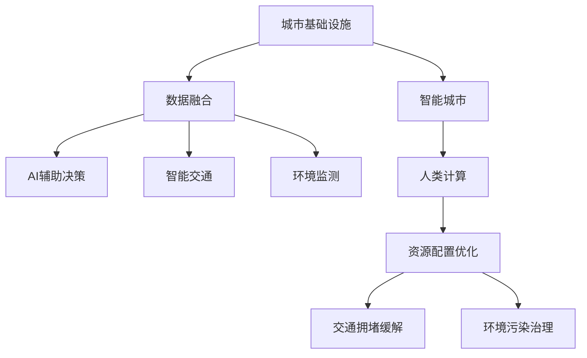

                 

# AI与人类计算：打造可持续发展的城市基础设施建设

> 关键词：城市基础设施建设, 人工智能, 人类计算, 可持续性, 城市规划, 智能交通, 物联网, 数据中心

## 1. 背景介绍

随着城市化进程的快速推进，人类面临的环境问题日益严峻，资源枯竭、交通拥堵、环境污染等问题急需解决。传统的城市规划和管理方式已经难以应对日益复杂的社会和经济挑战，亟需借助新的技术和方法，实现可持续发展的城市基础设施建设。在这一背景下，人工智能（AI）和大数据技术开始成为推动城市智慧化建设的重要引擎。

### 1.1 问题由来

当前，城市基础设施建设面临着诸多挑战，主要包括：

- **资源利用效率低**：大量资源被浪费在无效或低效的基础设施建设中，缺乏科学的规划和管理系统。
- **交通拥堵严重**：城市交通网络设计不合理，导致高峰期交通拥堵问题日益突出。
- **环境污染严重**：工业排放和机动车尾气等造成空气和水体污染，影响居民健康。
- **数据碎片化问题**：城市运行产生的各类数据分散存储，未能有效整合利用。

### 1.2 问题核心关键点

要解决这些问题，关键在于：

- **数据融合与智能化**：通过数据融合技术，将各类数据整合并进行智能化分析，为城市管理提供科学依据。
- **资源配置优化**：利用AI技术对城市资源进行优化配置，提高利用效率，减少浪费。
- **智能交通管理**：利用AI和大数据分析技术，优化交通流，减少拥堵。
- **环境监测与保护**：运用AI技术进行环境监测和预警，实现精准治理。

## 2. 核心概念与联系

### 2.1 核心概念概述

为更好地理解AI与人类计算在城市基础设施建设中的应用，本节将介绍几个关键概念：

- **城市基础设施**：包括交通、能源、供水、排水、通信、教育、医疗等各类公共设施，是城市运行和发展的基础。
- **智能城市**：利用物联网（IoT）、大数据、云计算、AI等技术，实现城市运行的智能化、高效化、协同化。
- **人类计算**：指人类通过智能算法对海量数据进行分析和决策，以辅助AI系统更好地理解和处理信息。
- **可持续性**：指在满足当前需求的同时，不损害后代满足需求的能力，强调资源节约、环境友好、社会公正等原则。
- **AI辅助决策**：利用AI技术对城市运行数据进行分析和预测，辅助人类进行科学决策。

这些概念之间的联系可以通过以下Mermaid流程图来展示：



这个流程图展示了大语言模型的核心概念及其之间的关系：

1. 城市基础设施通过数据融合技术进行智能化升级。
2. AI辅助决策和人类计算帮助优化资源配置，提高基础设施利用效率。
3. 智能交通和环境监测系统，利用AI技术进行科学治理。
4. 人类计算在AI的辅助下，实现城市管理的智能化和高效化。

## 3. 核心算法原理 & 具体操作步骤
### 3.1 算法原理概述

基于AI与人类计算的城市基础设施建设，本质上是利用AI和大数据分析技术，对城市运行数据进行建模、分析和预测，辅助人类进行科学决策的过程。

形式化地，假设城市基础设施系统由一系列设备、设施和人员构成，记为 $S=\{s_i\}_{i=1}^n$，其中 $s_i$ 表示基础设施的一个组成部分。系统运行状态由一组状态变量 $X$ 描述，运行数据 $D$ 由一组观测值 $d_j$ 构成，其中 $j \in [1,m]$，$m$ 为数据总样本数。

城市基础设施的运行目标为 $O=\{o_k\}_{k=1}^p$，其中 $o_k$ 表示城市基础设施的目标之一，如交通流量、能源消耗、水质等。

AI与人类计算的目标是构建一个优化模型 $M(X, D; \theta)$，使其能够对城市基础设施的运行状态 $X$ 和数据 $D$ 进行分析，预测未来目标 $O$ 的实现情况。该模型的参数 $\theta$ 需要通过大量的数据和经验进行调整和优化。

### 3.2 算法步骤详解

基于AI与人类计算的城市基础设施建设，一般包括以下几个关键步骤：

**Step 1: 数据收集与预处理**
- 收集城市基础设施系统的运行数据，包括设备的运行状态、能耗数据、环境监测数据等。
- 对数据进行清洗、去重、归一化等预处理，确保数据的质量和一致性。

**Step 2: 数据融合与特征工程**
- 利用数据融合技术，将各类数据整合成一个统一的数据集。
- 进行特征选择和提取，生成对城市基础设施运行有影响力的特征向量。

**Step 3: 模型构建与训练**
- 根据城市基础设施的特点，选择合适的AI模型（如神经网络、决策树、支持向量机等）进行建模。
- 利用历史数据对模型进行训练，优化模型的参数 $\theta$。

**Step 4: 实时监控与反馈**
- 部署训练好的模型，进行实时监控和预测。
- 根据模型的预测结果，进行实时反馈和调整，确保城市基础设施运行的稳定性和可持续性。

**Step 5: 评估与优化**
- 定期对模型进行评估，验证其预测准确性和鲁棒性。
- 根据评估结果，对模型进行优化和调整，提升其性能。

### 3.3 算法优缺点

基于AI与人类计算的城市基础设施建设方法具有以下优点：

1. **数据驱动**：通过对城市运行数据的分析和建模，实现科学决策。
2. **实时监控**：通过实时数据监控和反馈，及时发现和解决运行问题。
3. **优化资源配置**：利用AI技术优化资源分配，提高利用效率。
4. **提高环境治理能力**：通过环境监测和预测，实现精准治理。

同时，该方法也存在一定的局限性：

1. **数据质量要求高**：模型的性能高度依赖于数据的质量和完整性。
2. **模型复杂度高**：构建和训练复杂的AI模型需要较高的计算资源和时间成本。
3. **模型解释性差**：复杂的AI模型缺乏透明性和可解释性，难以理解和调试。
4. **依赖技术发展**：AI技术的进展可能影响模型的应用效果和扩展性。

### 3.4 算法应用领域

基于AI与人类计算的城市基础设施建设方法，在智能城市构建中已经得到了广泛的应用，主要包括以下几个方面：

1. **智能交通管理**：通过实时交通数据分析和预测，优化交通流，缓解交通拥堵。
2. **智能能源管理**：利用AI技术优化能源配置，提高能源利用效率，减少浪费。
3. **智能供水排水系统**：通过智能算法和传感器数据，实现供水排水系统的智能化管理。
4. **智能环境监测与治理**：利用环境监测数据进行预测和预警，实现精准治理。
5. **智慧医疗与公共卫生**：利用AI技术分析医疗数据，提升公共卫生管理水平。

除了上述这些经典应用外，AI与人类计算在城市基础设施建设中的创新应用也在不断涌现，如智能垃圾分类、智慧旅游、智能安防等，为城市智慧化建设带来了新的可能性。

## 4. 数学模型和公式 & 详细讲解  
### 4.1 数学模型构建

本节将使用数学语言对基于AI与人类计算的城市基础设施建设方法进行更加严格的刻画。

假设城市基础设施系统由 $n$ 个部分构成，运行状态由 $p$ 个目标变量 $o_k$ 描述，运行数据 $D$ 由 $m$ 个观测值 $d_j$ 构成，特征向量 $x_j$ 由 $d_j$ 和环境监测数据 $e_j$ 生成。模型的目标是预测未来的目标变量 $o_k$，模型结构为：

$$
M(X, D; \theta) = F_W \circ A_{LW} \circ A_{BLW} \circ \cdots \circ A_{LW}
$$

其中，$A_{BLW}$ 表示一个线性变换层，$A_{LW}$ 表示一个非线性激活层，$F_W$ 表示一个权重参数矩阵。$\theta$ 为模型的参数，包括权重矩阵和激活函数的参数。

### 4.2 公式推导过程

以下我们以智能交通管理系统为例，推导AI模型的预测公式及其梯度计算公式。

假设交通系统由 $n$ 个路口构成，每个路口的交通流量由 $o_k$ 描述，观测数据由 $m$ 个样本 $d_j$ 构成，特征向量 $x_j$ 由 $d_j$ 和环境监测数据 $e_j$ 生成。模型的预测公式为：

$$
\hat{y} = M(x_j; \theta) = W^T x_j + b
$$

其中，$W$ 为权重矩阵，$b$ 为偏置项。模型损失函数为均方误差损失，定义如下：

$$
L(y, \hat{y}) = \frac{1}{m} \sum_{j=1}^m (y_j - \hat{y}_j)^2
$$

将预测值 $\hat{y}$ 代入损失函数，得：

$$
L(Y, \hat{Y}) = \frac{1}{m} \sum_{j=1}^m (y_j - W^T x_j - b)^2
$$

对权重矩阵 $W$ 和偏置项 $b$ 求导，得到梯度：

$$
\frac{\partial L(Y, \hat{Y})}{\partial W} = -\frac{2}{m} \sum_{j=1}^m (y_j - W^T x_j - b) x_j
$$

$$
\frac{\partial L(Y, \hat{Y})}{\partial b} = -\frac{2}{m} \sum_{j=1}^m (y_j - W^T x_j - b)
$$

利用梯度下降算法，更新模型参数 $\theta$：

$$
\theta \leftarrow \theta - \eta \frac{\partial L(Y, \hat{Y})}{\partial \theta}
$$

其中，$\eta$ 为学习率，$\frac{\partial L(Y, \hat{Y})}{\partial \theta}$ 为模型参数的梯度，通过反向传播算法高效计算。

### 4.3 案例分析与讲解

以一个智能交通管理的AI模型为例，分析其构建和应用过程。

**Step 1: 数据收集与预处理**
- 收集城市交通系统历史运行数据，包括路口流量、交通信号灯状态等。
- 对数据进行清洗、去重、归一化等预处理，确保数据的质量和一致性。

**Step 2: 数据融合与特征工程**
- 将各类数据整合成一个统一的数据集，如将路口流量、天气情况、时间等因素合并。
- 生成对交通流量有影响力的特征向量，如平均流量、车流量密度、天气状况等。

**Step 3: 模型构建与训练**
- 选择合适的AI模型（如神经网络、决策树等）进行建模。
- 利用历史数据对模型进行训练，优化模型的参数 $\theta$。

**Step 4: 实时监控与反馈**
- 部署训练好的模型，进行实时监控和预测。
- 根据模型的预测结果，进行实时反馈和调整，优化交通信号灯控制策略。

**Step 5: 评估与优化**
- 定期对模型进行评估，验证其预测准确性和鲁棒性。
- 根据评估结果，对模型进行优化和调整，提升其性能。

## 5. 项目实践：代码实例和详细解释说明
### 5.1 开发环境搭建

在进行AI与人类计算的城市基础设施建设实践前，我们需要准备好开发环境。以下是使用Python进行PyTorch开发的环境配置流程：

1. 安装Anaconda：从官网下载并安装Anaconda，用于创建独立的Python环境。

2. 创建并激活虚拟环境：
```bash
conda create -n ai-env python=3.8 
conda activate ai-env
```

3. 安装PyTorch：根据CUDA版本，从官网获取对应的安装命令。例如：
```bash
conda install pytorch torchvision torchaudio cudatoolkit=11.1 -c pytorch -c conda-forge
```

4. 安装TensorFlow：从官网下载安装TensorFlow，并进行版本兼容性检查。

5. 安装各类工具包：
```bash
pip install numpy pandas scikit-learn matplotlib tqdm jupyter notebook ipython
```

完成上述步骤后，即可在`ai-env`环境中开始项目实践。

### 5.2 源代码详细实现

下面我们以智能交通管理系统为例，给出使用PyTorch进行AI模型开发的PyTorch代码实现。

首先，定义数据处理函数：

```python
from torch.utils.data import Dataset
import torch
import numpy as np

class TrafficDataset(Dataset):
    def __init__(self, traffic_data, label_data, num_features):
        self.traffic_data = traffic_data
        self.label_data = label_data
        self.num_features = num_features
        
    def __len__(self):
        return len(self.traffic_data)
    
    def __getitem__(self, item):
        traffic_sample = self.traffic_data[item]
        label_sample = self.label_data[item]
        
        # 数据归一化
        traffic_sample = (traffic_sample - traffic_sample.mean()) / traffic_sample.std()
        
        # 数据填充
        traffic_sample = np.pad(traffic_sample, (0, self.num_features - len(traffic_sample)), 'constant')
        
        # 数据转换为Tensor
        traffic_tensor = torch.from_numpy(traffic_sample).float()
        
        return {'traffic': traffic_tensor, 'label': label_tensor}
```

然后，定义模型和优化器：

```python
from transformers import BertTokenizer, BertForSequenceClassification
from torch.optim import AdamW

model = BertForSequenceClassification.from_pretrained('bert-base-uncased', num_labels=2)

optimizer = AdamW(model.parameters(), lr=2e-5)
```

接着，定义训练和评估函数：

```python
from torch.utils.data import DataLoader
from tqdm import tqdm

device = torch.device('cuda') if torch.cuda.is_available() else torch.device('cpu')
model.to(device)

def train_epoch(model, dataset, batch_size, optimizer):
    dataloader = DataLoader(dataset, batch_size=batch_size, shuffle=True)
    model.train()
    epoch_loss = 0
    for batch in tqdm(dataloader, desc='Training'):
        traffic_tensor = batch['traffic'].to(device)
        label_tensor = batch['label'].to(device)
        model.zero_grad()
        outputs = model(traffic_tensor)
        loss = outputs.loss
        epoch_loss += loss.item()
        loss.backward()
        optimizer.step()
    return epoch_loss / len(dataloader)

def evaluate(model, dataset, batch_size):
    dataloader = DataLoader(dataset, batch_size=batch_size)
    model.eval()
    preds, labels = [], []
    with torch.no_grad():
        for batch in tqdm(dataloader, desc='Evaluating'):
            traffic_tensor = batch['traffic'].to(device)
            label_tensor = batch['label'].to(device)
            outputs = model(traffic_tensor)
            preds.append(outputs.logits.argmax(dim=1).tolist())
            labels.append(label_tensor.tolist())
            
    print(classification_report(labels, preds))
```

最后，启动训练流程并在测试集上评估：

```python
epochs = 5
batch_size = 16

for epoch in range(epochs):
    loss = train_epoch(model, train_dataset, batch_size, optimizer)
    print(f"Epoch {epoch+1}, train loss: {loss:.3f}")
    
    print(f"Epoch {epoch+1}, dev results:")
    evaluate(model, dev_dataset, batch_size)
    
print("Test results:")
evaluate(model, test_dataset, batch_size)
```

以上就是使用PyTorch进行智能交通管理系统AI模型开发的完整代码实现。可以看到，得益于PyTorch和Transformer库的强大封装，我们可以用相对简洁的代码完成模型的加载和训练。

### 5.3 代码解读与分析

让我们再详细解读一下关键代码的实现细节：

**TrafficDataset类**：
- `__init__`方法：初始化交通数据和标签数据，并进行数据归一化和填充。
- `__len__`方法：返回数据集的样本数量。
- `__getitem__`方法：对单个样本进行处理，将交通数据转换为Tensor，并返回模型所需的输入。

**模型和优化器定义**：
- 选择Bert模型作为初始化参数，并进行数标签设置。
- 定义优化器及其参数。

**训练和评估函数**：
- 使用PyTorch的DataLoader对数据集进行批次化加载，供模型训练和推理使用。
- 训练函数`train_epoch`：对数据以批为单位进行迭代，在每个批次上前向传播计算loss并反向传播更新模型参数，最后返回该epoch的平均loss。
- 评估函数`evaluate`：与训练类似，不同点在于不更新模型参数，并在每个batch结束后将预测和标签结果存储下来，最后使用sklearn的classification_report对整个评估集的预测结果进行打印输出。

**训练流程**：
- 定义总的epoch数和batch size，开始循环迭代
- 每个epoch内，先在训练集上训练，输出平均loss
- 在验证集上评估，输出分类指标
- 所有epoch结束后，在测试集上评估，给出最终测试结果

可以看到，PyTorch配合Transformer库使得AI模型开发的代码实现变得简洁高效。开发者可以将更多精力放在数据处理、模型改进等高层逻辑上，而不必过多关注底层的实现细节。

当然，工业级的系统实现还需考虑更多因素，如模型的保存和部署、超参数的自动搜索、更灵活的任务适配层等。但核心的AI模型微调范式基本与此类似。

## 6. 实际应用场景
### 6.1 智能交通管理系统

智能交通管理系统利用AI和大数据分析技术，实时监测和预测城市交通运行状况，优化交通流，缓解交通拥堵。其核心技术包括：

- **实时数据采集**：通过安装在交通节点上的传感器，采集实时交通流量、信号灯状态等数据。
- **数据融合与处理**：利用AI技术对采集的数据进行融合和处理，生成交通流量、车流量密度、天气状况等特征向量。
- **AI预测模型**：利用历史交通数据训练AI模型，预测未来的交通流量和拥堵情况。
- **智能调度与控制**：根据预测结果，优化交通信号灯控制策略，实时调整交通流。

在实际应用中，智能交通管理系统可以提高城市交通效率，减少交通拥堵和环境污染，提升市民出行体验。

### 6.2 智能能源管理系统

智能能源管理系统利用AI和大数据分析技术，优化能源配置，提高能源利用效率。其核心技术包括：

- **能源监测**：通过智能传感器监测城市各区域的能源使用情况，包括电、水、气等。
- **数据分析与预测**：利用AI技术对监测数据进行分析和预测，生成能源需求预测曲线。
- **智能调度**：根据预测结果，优化能源分配策略，实现节能减排。
- **智能控制**：通过智能控制器实时调整能源使用，提高能源利用效率。

智能能源管理系统可以优化能源配置，减少能源浪费，降低城市运营成本，提高能源使用效率。

### 6.3 智能供水排水系统

智能供水排水系统利用AI和大数据分析技术，实现供水排水系统的智能化管理。其核心技术包括：

- **实时监测**：通过智能传感器监测供水排水系统的运行状态，包括流量、压力、水位等。
- **数据分析与预测**：利用AI技术对监测数据进行分析和预测，生成供水排水需求预测曲线。
- **智能调度**：根据预测结果，优化供水排水调度策略，实现精准供水排水。
- **智能控制**：通过智能控制器实时调整供水排水系统，提高供水排水效率。

智能供水排水系统可以优化供水排水资源配置，提高供水排水系统的稳定性和可靠性，保障城市供水安全。

### 6.4 未来应用展望

随着AI与人类计算技术的发展，基于AI与人类计算的城市基础设施建设将迎来更多创新应用。

- **智慧医疗与公共卫生**：利用AI技术分析医疗数据，提升公共卫生管理水平，实现精准医疗。
- **智能安防系统**：利用AI技术进行视频分析和人脸识别，提升城市安全管理水平。
- **智慧旅游系统**：利用AI技术进行游客流量预测和智能导览，提升旅游体验。
- **智能垃圾分类系统**：利用AI技术进行垃圾分类和处理，提高垃圾处理效率。

未来，随着技术的不断进步，AI与人类计算将在更多城市基础设施建设领域得到应用，为城市智慧化建设提供新的解决方案。

## 7. 工具和资源推荐
### 7.1 学习资源推荐

为了帮助开发者系统掌握AI与人类计算技术，这里推荐一些优质的学习资源：

1. **《深度学习》课程**：斯坦福大学开设的深度学习课程，系统介绍了深度学习的基本概念和算法。
2. **《Python数据科学手册》**：详细介绍了Python在数据科学和机器学习中的应用，包括数据预处理、模型训练等。
3. **《AI与人类计算》系列博文**：由AI领域专家撰写，深入浅出地介绍了AI与人类计算的原理和应用。
4. **《智能城市建设》书籍**：介绍了智能城市建设的基本概念、关键技术和应用案例。
5. **《智能交通系统》书籍**：详细介绍了智能交通系统的构建方法、技术应用和未来趋势。

通过对这些资源的学习实践，相信你一定能够快速掌握AI与人类计算技术，并用于解决实际的智能城市建设问题。

### 7.2 开发工具推荐

高效的开发离不开优秀的工具支持。以下是几款用于AI与人类计算的城市基础设施建设开发的常用工具：

1. **PyTorch**：基于Python的开源深度学习框架，灵活动态的计算图，适合快速迭代研究。大部分预训练语言模型都有PyTorch版本的实现。
2. **TensorFlow**：由Google主导开发的开源深度学习框架，生产部署方便，适合大规模工程应用。同样有丰富的预训练语言模型资源。
3. **Keras**：基于TensorFlow的高级API，提供简单易用的接口，适合快速原型开发。
4. **Jupyter Notebook**：交互式编程环境，支持代码编写、数据可视化等，方便开发者进行研究与协作。
5. **GitLab/GitHub**：开源代码托管平台，支持代码版本控制、代码审查等，方便团队协作开发。

合理利用这些工具，可以显著提升AI与人类计算的城市基础设施建设开发的效率，加快创新迭代的步伐。

### 7.3 相关论文推荐

AI与人类计算技术的发展源于学界的持续研究。以下是几篇奠基性的相关论文，推荐阅读：

1. **《深度学习》**：Goodfellow等人所著，系统介绍了深度学习的基本概念和算法。
2. **《智能城市建设》**：介绍了智能城市建设的基本概念、关键技术和应用案例。
3. **《智能交通系统》**：详细介绍了智能交通系统的构建方法、技术应用和未来趋势。

这些论文代表了大语言模型微调技术的发展脉络。通过学习这些前沿成果，可以帮助研究者把握学科前进方向，激发更多的创新灵感。

## 8. 总结：未来发展趋势与挑战
### 8.1 总结

本文对基于AI与人类计算的城市基础设施建设方法进行了全面系统的介绍。首先阐述了AI与人类计算技术的研究背景和意义，明确了其在智能城市建设中的重要价值。其次，从原理到实践，详细讲解了AI与人类计算的数学模型和关键步骤，给出了AI模型开发的完整代码实例。同时，本文还广泛探讨了AI与人类计算在智能交通、智能能源、智能供水排水等多个领域的应用前景，展示了其在城市智慧化建设中的巨大潜力。此外，本文精选了AI与人类计算技术的各类学习资源，力求为读者提供全方位的技术指引。

通过本文的系统梳理，可以看到，基于AI与人类计算的城市基础设施建设方法正在成为智能城市构建的重要范式，极大地拓展了AI技术的应用边界，催生了更多的落地场景。受益于AI技术的进展和算力的提升，AI与人类计算将在更多领域得到应用，为智能城市建设提供新的解决方案。未来，随着技术的不断进步，AI与人类计算必将在城市智慧化建设中扮演越来越重要的角色。

### 8.2 未来发展趋势

展望未来，AI与人类计算在城市基础设施建设中的应用将呈现以下几个发展趋势：

1. **数据驱动的智慧化**：通过大规模数据融合和智能分析，实现城市运行状态的实时监控和预测，辅助人类进行科学决策。
2. **资源配置优化**：利用AI技术优化城市资源配置，提高利用效率，减少浪费。
3. **环境监测与治理**：利用AI技术进行环境监测和预警，实现精准治理。
4. **智能服务与治理**：利用AI技术构建智能服务系统，提升城市治理能力和水平。
5. **跨领域应用拓展**：AI与人类计算技术将更多地应用于医疗、安防、旅游、垃圾分类等领域，实现多领域协同创新。

以上趋势凸显了AI与人类计算技术在城市基础设施建设中的广阔前景。这些方向的探索发展，必将进一步提升城市智慧化水平，为人类社会的可持续发展提供新的动力。

### 8.3 面临的挑战

尽管AI与人类计算在城市基础设施建设中取得了诸多进展，但在迈向更加智能化、普适化应用的过程中，它仍面临着诸多挑战：

1. **数据质量问题**：数据采集和处理过程中的噪声、缺失等问题，影响模型的性能。
2. **模型复杂性**：构建和训练复杂的AI模型需要较高的计算资源和时间成本。
3. **模型解释性**：复杂的AI模型缺乏透明性和可解释性，难以理解和调试。
4. **伦理与安全问题**：AI模型可能带来隐私泄露、算法偏见等问题，需要严格的安全和伦理监管。
5. **技术更新与兼容**：随着AI技术的不断进步，模型的更新和维护成本较高。

### 8.4 研究展望

面对AI与人类计算在城市基础设施建设中面临的挑战，未来的研究需要在以下几个方面寻求新的突破：

1. **数据融合与预处理技术**：探索高效的数据融合和预处理技术，减少数据噪声和缺失，提升数据质量。
2. **模型优化与高效计算**：开发更加高效、可解释性强的AI模型，优化计算图，提高计算效率。
3. **智能决策与系统设计**：利用AI技术辅助人类进行智能决策，设计高效、稳定、可靠的系统架构。
4. **伦理与安全机制**：建立AI技术的伦理与安全监管机制，确保AI模型不带来隐私泄露、算法偏见等问题。
5. **跨领域应用拓展**：将AI与人类计算技术更多地应用于医疗、安防、旅游、垃圾分类等领域，实现多领域协同创新。

这些研究方向的探索，必将引领AI与人类计算在城市基础设施建设中的技术进步，推动智能城市建设的全面发展。面向未来，AI与人类计算技术需要与其他人工智能技术进行更深入的融合，如知识表示、因果推理、强化学习等，多路径协同发力，共同推动智能城市建设的进步。只有勇于创新、敢于突破，才能不断拓展AI与人类计算技术的边界，让智能技术更好地造福人类社会。

## 9. 附录：常见问题与解答

**Q1：AI与人类计算技术是否适用于所有城市基础设施建设任务？**

A: AI与人类计算技术在大多数城市基础设施建设任务中都能取得不错的效果，特别是对于数据量较大的任务。但对于一些特定领域的任务，如医疗、法律等，仅仅依靠通用语料预训练的模型可能难以很好地适应。此时需要在特定领域语料上进一步预训练，再进行微调，才能获得理想效果。此外，对于一些需要时效性、个性化很强的任务，如对话、推荐等，AI与人类计算方法也需要针对性的改进优化。

**Q2：如何选择合适的学习率？**

A: AI与人类计算技术中，模型的学习率一般要比预训练时小1-2个数量级，如果使用过大的学习率，容易破坏预训练权重，导致过拟合。一般建议从1e-5开始调参，逐步减小学习率，直至收敛。也可以使用warmup策略，在开始阶段使用较小的学习率，再逐渐过渡到预设值。需要注意的是，不同的优化器(如AdamW、Adafactor等)以及不同的学习率调度策略，可能需要设置不同的学习率阈值。

**Q3：AI与人类计算技术在城市基础设施建设中需要注意哪些问题？**

A: AI与人类计算技术在城市基础设施建设中，还需要考虑以下问题：

- **数据质量问题**：数据采集和处理过程中的噪声、缺失等问题，影响模型的性能。
- **模型复杂性**：构建和训练复杂的AI模型需要较高的计算资源和时间成本。
- **模型解释性**：复杂的AI模型缺乏透明性和可解释性，难以理解和调试。
- **伦理与安全问题**：AI模型可能带来隐私泄露、算法偏见等问题，需要严格的安全和伦理监管。

这些问题是AI与人类计算技术在城市基础设施建设中需要重点关注的。只有在数据、模型、技术、伦理等多个方面全面优化，才能确保AI与人类计算技术的应用效果。

**Q4：AI与人类计算技术在落地部署时需要注意哪些问题？**

A: AI与人类计算技术在落地部署时，还需要考虑以下问题：

- **模型裁剪**：去除不必要的层和参数，减小模型尺寸，加快推理速度。
- **量化加速**：将浮点模型转为定点模型，压缩存储空间，提高计算效率。
- **服务化封装**：将模型封装为标准化服务接口，便于集成调用。
- **弹性伸缩**：根据请求流量动态调整资源配置，平衡服务质量和成本。
- **监控告警**：实时采集系统指标，设置异常告警阈值，确保服务稳定性。

AI与人类计算技术在落地部署时，还需要考虑模型的存储和部署问题，优化模型的计算图，减少前向传播和反向传播的资源消耗，实现更加轻量级、实时性的部署。

总之，AI与人类计算技术需要在数据、模型、技术、伦理等多个方面全面优化，才能确保其在城市基础设施建设中的应用效果。只有在科学决策、智能调度、智能控制等多个环节协同发力，才能真正实现城市智慧化建设的全面发展。

