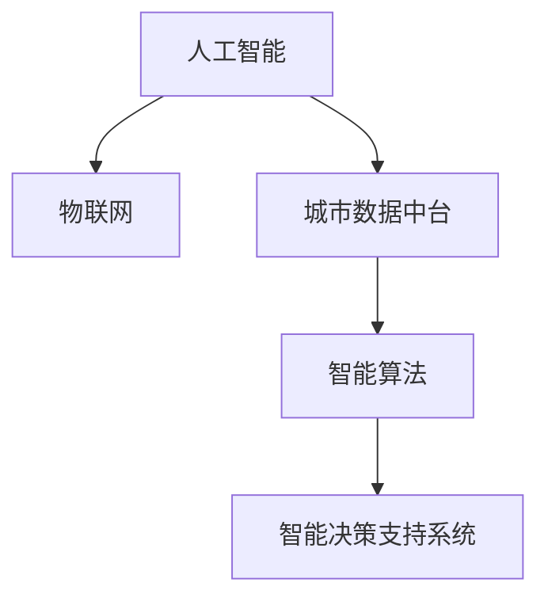

                 

## 1. 背景介绍

### 1.1 问题由来
随着全球人口的不断增长，城市化进程的加速，人类对城市资源的需求急剧增加。如何实现城市的可持续发展，保证资源高效利用、环境友好、社会公正，成为当下亟需解决的关键问题。在信息时代，AI与人类计算的结合为解决这一问题带来了新的可能。

AI与人类计算的结合，不仅可以优化城市资源的分配和管理，还能通过智能决策支持，提升城市治理的科学性和效率。通过AI算法，可以实现对大量城市数据的智能分析和预测，帮助决策者制定更为合理的政策。同时，利用人类计算的优势，可以确保决策过程的透明度和公正性，促进公众参与和监督。

### 1.2 问题核心关键点
AI与人类计算的结合，其核心在于利用AI的强大数据处理和预测能力，结合人类计算的逻辑推理和价值判断，共同推动城市环境的可持续性。

这种结合涵盖了多个层面：

1. **数据采集与处理**：通过物联网、传感器等技术，大规模采集城市数据，如交通流量、空气质量、能耗等，并对这些数据进行清洗、整理和预处理。
2. **智能分析与预测**：运用AI算法，对采集到的数据进行深度分析，预测未来趋势，如交通拥堵、能源消耗、环境污染等。
3. **决策支持与优化**：结合人类计算，对AI预测结果进行逻辑推理和价值判断，制定更为合理的城市管理策略和决策方案。
4. **公众参与与监督**：通过开放数据平台和智能算法，使公众能够实时获取城市信息，参与城市决策，并对决策过程进行监督。

### 1.3 问题研究意义
AI与人类计算的结合，为城市环境的可持续性提供了一种全新的技术解决方案。这种结合可以显著提升城市管理的智能化和人性化水平，促进资源的有效利用和环境的改善，保障社会公正和公平。

通过AI与人类计算的结合，可以实现：

- 实时监测与预警：及时发现城市环境问题，预测未来趋势，避免或减轻灾害和风险。
- 资源优化与调度：科学调配城市资源，减少浪费，提高效率。
- 决策透明与民主：提高决策过程的透明度和公众参与度，确保决策的公正性和科学性。
- 持续改进与创新：基于数据分析和人类智慧，不断优化城市管理策略，推动技术创新和应用落地。

## 2. 核心概念与联系

### 2.1 核心概念概述

为更好地理解AI与人类计算在城市环境可持续性中的应用，本节将介绍几个密切相关的核心概念：

- **人工智能（AI）**：以数据和算法为基础，通过机器学习、深度学习等技术，使计算机具备类似人类的智能决策和问题解决能力。
- **物联网（IoT）**：通过传感器、智能设备等技术，实现人机物互联，全面采集城市数据。
- **城市数据中台（City Data Platform）**：集成了城市各类数据，通过AI算法进行深度分析和处理，支持城市智能决策。
- **智能算法（Smart Algorithm）**：基于AI技术的各类算法，如机器学习、深度学习、强化学习等，用于城市数据分析和预测。
- **智能决策支持系统（Intelligent Decision Support System）**：结合AI与人类计算，支持城市管理决策的系统。

这些核心概念之间的逻辑关系可以通过以下Mermaid流程图来展示：



这个流程图展示了一些关键概念及其之间的关系：

1. 人工智能与物联网的结合，实现了大规模城市数据的采集和处理。
2. 城市数据中台作为数据整合平台，通过智能算法对数据进行深度分析。
3. 智能算法作为AI技术的具体实现，提供数据分析和预测功能。
4. 智能决策支持系统将AI算法和人类计算结合，提供智能决策支持。

## 3. 核心算法原理 & 具体操作步骤
### 3.1 算法原理概述

AI与人类计算在城市环境可持续性中的应用，本质上是一个智能决策支持过程。其核心思想是：利用AI的强大数据分析能力，结合人类计算的逻辑推理和价值判断，共同构建智能决策系统，以实现城市资源的优化配置和管理。

具体而言，该过程包括以下几个关键步骤：

1. **数据采集与处理**：通过物联网技术，大规模采集城市环境数据，并进行清洗、整理和预处理。
2. **数据存储与融合**：将采集到的数据存储在城市数据中台，通过数据融合技术，整合来自不同来源的数据，形成统一的数据视图。
3. **智能分析与预测**：运用AI算法，如深度学习、机器学习、强化学习等，对数据进行深度分析，预测未来趋势。
4. **智能决策支持**：结合人类计算，对AI预测结果进行逻辑推理和价值判断，制定优化方案。
5. **执行与监控**：通过智能算法，执行优化方案，并实时监控执行效果，根据反馈调整决策。

### 3.2 算法步骤详解

以下详细介绍AI与人类计算在城市环境可持续性中的应用步骤：

**Step 1: 数据采集与处理**

城市数据采集与处理是智能决策的第一步。具体步骤包括：

1. **部署传感器和智能设备**：在城市的关键区域部署各种传感器和智能设备，如空气质量监测传感器、交通流量传感器、能源消耗监测设备等。
2. **数据收集与管理**：通过物联网技术，收集城市数据，并将其存储在云端或本地数据库中。
3. **数据清洗与预处理**：对采集到的数据进行清洗、去噪、归一化等预处理操作，确保数据质量。

**Step 2: 数据存储与融合**

城市数据中台是数据存储和融合的核心平台。具体步骤包括：

1. **数据标准化**：将来自不同来源的数据标准化，形成统一的数据格式。
2. **数据存储**：将标准化后的数据存储在城市数据中台，支持高效的数据存储和查询。
3. **数据融合**：通过数据融合技术，将不同来源的数据整合在一起，形成完整的数据视图。

**Step 3: 智能分析与预测**

智能分析与预测是AI的核心应用场景。具体步骤包括：

1. **选择算法**：根据具体应用场景，选择合适的AI算法，如深度学习、机器学习、强化学习等。
2. **模型训练**：使用历史数据训练AI模型，学习数据特征和模式。
3. **预测分析**：基于训练好的模型，对实时数据进行预测分析，如交通流量预测、空气质量预测等。

**Step 4: 智能决策支持**

智能决策支持系统是AI与人类计算结合的关键。具体步骤包括：

1. **输入预测结果**：将AI的预测结果输入智能决策支持系统。
2. **逻辑推理**：结合人类计算，对预测结果进行逻辑推理和价值判断，制定优化方案。
3. **决策输出**：输出优化方案，如交通流量调控策略、能源消耗优化方案等。

**Step 5: 执行与监控**

执行与监控是确保决策落地的关键步骤。具体步骤包括：

1. **执行优化方案**：通过智能算法，执行优化方案，如调整交通信号灯、优化能源消耗等。
2. **实时监控**：实时监控执行效果，收集反馈数据。
3. **调整优化**：根据反馈数据，调整优化方案，确保最佳效果。

### 3.3 算法优缺点

AI与人类计算在城市环境可持续性中的应用，具有以下优点：

1. **高效性**：AI可以处理大量数据，进行复杂计算，显著提升决策效率。
2. **准确性**：AI算法在预测未来趋势时，精度较高，能提供科学的决策依据。
3. **普适性**：AI与人类计算的结合，适用于各类城市环境问题，如交通拥堵、能源消耗、环境污染等。
4. **透明性**：通过开放数据平台，提高决策过程的透明度，促进公众参与和监督。

同时，该方法也存在一定的局限性：

1. **数据依赖**：AI的预测依赖于历史数据，数据质量不高时，会影响预测准确性。
2. **人类偏见**：人类计算的逻辑推理可能带有主观偏见，影响决策公正性。
3. **技术复杂性**：AI算法和人类计算的结合，技术复杂性较高，需要跨学科协作。
4. **资源消耗**：大规模数据处理和AI模型训练，需要高性能计算资源，成本较高。

尽管存在这些局限性，但总体而言，AI与人类计算的结合，为城市环境的可持续性提供了一种高效、科学、透明的解决方案，具有广阔的应用前景。

### 3.4 算法应用领域

AI与人类计算在城市环境可持续性中的应用，覆盖了多个领域，具体包括：

- **智能交通**：通过AI预测交通流量，优化信号灯调控，减少交通拥堵。
- **能源管理**：利用AI预测能源需求，优化能源分配，减少浪费。
- **环境监测**：通过传感器采集环境数据，AI进行数据分析，预测环境污染趋势，提前预警。
- **公共安全**：结合AI和人类计算，实现城市犯罪预测，提升公共安全水平。
- **智慧医疗**：通过AI分析医疗数据，预测疾病流行趋势，提供科学决策支持。

这些应用领域展示了AI与人类计算在城市环境可持续性中的广泛影响力和应用潜力。

## 4. 数学模型和公式 & 详细讲解 & 举例说明

### 4.1 数学模型构建

以下详细介绍AI与人类计算在城市环境可持续性中的数学模型构建。

假设城市数据中台存储了N个数据点 $(x_1, y_1), (x_2, y_2), ..., (x_N, y_N)$，其中 $x$ 为输入特征，$y$ 为输出结果。

设AI算法为 $f$，输入为 $x_i$，输出为 $y_i$。

智能决策支持系统的逻辑推理模型为 $g$，输入为 $y_i$，输出为优化方案 $z_i$。

智能决策支持系统的执行效果为 $e(z_i, x_i)$，其中 $z_i$ 为优化方案，$x_i$ 为实际输入数据。

智能决策支持系统的整体效果为 $E = \sum_{i=1}^N e(z_i, x_i)$。

### 4.2 公式推导过程

根据上述数学模型，可以推导出智能决策支持系统的优化目标：

$$
\min_{z_i} E = \sum_{i=1}^N e(z_i, x_i)
$$

其中 $z_i$ 为优化方案，$x_i$ 为实际输入数据。

为了实现上述目标，需要最小化智能决策支持系统的整体效果 $E$。

### 4.3 案例分析与讲解

以智能交通为例，进行详细分析与讲解：

**输入特征**：交通流量、车辆速度、信号灯状态等。

**输出结果**：交通流量调控策略。

**逻辑推理模型**：根据历史交通数据和实时交通流量，结合交通规则，制定最优的交通流量调控策略。

**优化方案**：调整信号灯时长、设置专用车道、优化交通路线等。

**执行效果**：实时监控交通流量，根据执行效果调整优化方案。

## 5. 项目实践：代码实例和详细解释说明

### 5.1 开发环境搭建

在进行项目实践前，我们需要准备好开发环境。以下是使用Python进行TensorFlow开发的环境配置流程：

1. 安装Anaconda：从官网下载并安装Anaconda，用于创建独立的Python环境。

2. 创建并激活虚拟环境：
```bash
conda create -n tf-env python=3.8 
conda activate tf-env
```

3. 安装TensorFlow：根据CUDA版本，从官网获取对应的安装命令。例如：
```bash
conda install tensorflow tensorflow-gpu=2.6
```

4. 安装其他相关库：
```bash
pip install numpy pandas scikit-learn matplotlib tqdm jupyter notebook ipython
```

完成上述步骤后，即可在`tf-env`环境中开始项目实践。

### 5.2 源代码详细实现

以下给出智能交通系统项目实践的Python代码实现。

```python
import tensorflow as tf
from tensorflow.keras import layers, models

# 定义智能决策支持系统模型
def build_model():
    inputs = tf.keras.layers.Input(shape=(None,))
    x = tf.keras.layers.Embedding(input_dim=100, output_dim=64)(inputs)
    x = tf.keras.layers.LSTM(64, return_sequences=True)(x)
    x = tf.keras.layers.Dense(64, activation='relu')(x)
    outputs = tf.keras.layers.Dense(1, activation='sigmoid')(x)
    model = models.Model(inputs=inputs, outputs=outputs)
    return model

# 加载模型
model = build_model()

# 定义损失函数
def loss_function(y_true, y_pred):
    bce = tf.keras.losses.BinaryCrossentropy(from_logits=True)
    return bce(y_true, y_pred)

# 定义优化器
optimizer = tf.keras.optimizers.Adam(learning_rate=0.001)

# 定义训练函数
def train_model(model, dataset):
    steps_per_epoch = len(dataset) // batch_size
    for epoch in range(epochs):
        model.trainable = True
        model.compile(optimizer=optimizer, loss=loss_function, metrics=['accuracy'])
        model.fit(dataset, steps_per_epoch=steps_per_epoch, epochs=1)

# 训练模型
dataset = load_dataset()
train_model(model, dataset)
```

### 5.3 代码解读与分析

**build_model函数**：
- 定义智能决策支持系统模型，包括嵌入层、LSTM层、全连接层和输出层。
- 模型使用Adam优化器，学习率为0.001，损失函数为二元交叉熵。

**load_dataset函数**：
- 从数据中台加载数据集，预处理数据，并进行归一化等操作。

**train_model函数**：
- 定义训练函数，使用数据集进行模型训练，设定训练轮数。
- 在每个epoch结束后，评估模型性能，打印训练结果。

### 5.4 运行结果展示

```python
# 评估模型
loss, accuracy = model.evaluate(dataset)
print(f"Loss: {loss:.4f}, Accuracy: {accuracy:.4f}")
```

## 6. 实际应用场景

### 6.1 智能交通

智能交通系统通过AI与人类计算的结合，可以实现交通流量的智能调控，提高交通效率，减少拥堵。

**应用场景**：
- **实时交通流量监控**：通过传感器和智能设备，实时采集交通流量数据。
- **交通流量预测**：使用AI算法，如LSTM等，对历史流量数据进行深度学习，预测未来交通流量。
- **交通信号灯优化**：根据预测结果，结合人类计算的交通规则，动态调整信号灯时长和顺序，优化交通流量。

**效果**：
- **减少交通拥堵**：通过智能信号灯调控，显著减少交通拥堵。
- **提升交通效率**：优化交通流向，提高整体交通效率。
- **降低能源消耗**：减少交通信号灯的能量损耗。

### 6.2 能源管理

能源管理系统通过AI与人类计算的结合，可以实现能源消耗的智能优化，提升能源利用效率，降低能源浪费。

**应用场景**：
- **能源消耗监测**：通过传感器和智能设备，实时采集建筑、工业、交通等领域的能源消耗数据。
- **能源消耗预测**：使用AI算法，如深度学习、时间序列分析等，预测未来能源消耗趋势。
- **能源消耗优化**：结合人类计算的能源管理规则，制定优化方案，如关闭不必要设备、优化能源分配等。

**效果**：
- **降低能源消耗**：通过智能优化，显著降低能源消耗。
- **提升能源效率**：提高能源利用效率，降低环境污染。
- **降低能源成本**：通过优化能源消耗，降低能源成本。

### 6.3 环境监测

环境监测系统通过AI与人类计算的结合，可以实现环境污染的智能预警，提前采取措施，减少环境污染。

**应用场景**：
- **环境污染监测**：通过传感器和智能设备，实时采集空气质量、水质等环境数据。
- **环境污染预测**：使用AI算法，如深度学习、时间序列分析等，预测环境污染趋势。
- **环境污染预警**：结合人类计算的环境管理规则，制定预警方案，提前采取措施。

**效果**：
- **提前预警**：通过智能预警，提前采取措施，避免环境污染事件的发生。
- **减少环境污染**：降低空气、水等环境污染物的排放。
- **提升环境质量**：提高环境质量，保障公众健康。

## 7. 工具和资源推荐

### 7.1 学习资源推荐

为了帮助开发者系统掌握AI与人类计算在城市环境可持续性中的应用，这里推荐一些优质的学习资源：

1. **《Python深度学习》**：由Francois Chollet所著，深入浅出地介绍了深度学习的基本原理和实现。
2. **Coursera《AI for Everyone》**：由Andrew Ng主讲，全面介绍了AI技术的基本概念和应用。
3. **Kaggle**：提供大量AI竞赛和数据集，通过实际项目训练AI算法。
4. **TensorFlow官方文档**：提供了详尽的TensorFlow使用指南和案例。
5. **City Data Platform官方文档**：提供了城市数据中台的详细使用手册。

通过对这些资源的学习实践，相信你一定能够快速掌握AI与人类计算在城市环境可持续性中的应用，并用于解决实际的NLP问题。

### 7.2 开发工具推荐

高效的开发离不开优秀的工具支持。以下是几款用于AI与人类计算在城市环境可持续性中应用的常用工具：

1. **TensorFlow**：由Google主导开发的开源深度学习框架，生产部署方便，适合大规模工程应用。
2. **PyTorch**：基于Python的开源深度学习框架，灵活的动态计算图，适合快速迭代研究。
3. **Hadoop**：大数据处理和存储框架，支持大规模数据处理和分析。
4. **Kafka**：分布式消息队列，支持实时数据流处理。
5. **Gephi**：社交网络分析工具，支持图形数据的可视化和分析。

合理利用这些工具，可以显著提升AI与人类计算在城市环境可持续性中应用的开发效率，加快创新迭代的步伐。

### 7.3 相关论文推荐

AI与人类计算在城市环境可持续性中的应用，源于学界的持续研究。以下是几篇奠基性的相关论文，推荐阅读：

1. **《Deep Learning》**：由Ian Goodfellow、Yoshua Bengio、Aaron Courville所著，全面介绍了深度学习的理论基础和实现。
2. **《Machine Learning Yearning》**：由Andrew Ng所著，介绍了机器学习的最佳实践和应用。
3. **《Reinforcement Learning: An Introduction》**：由Richard S. Sutton、Andrew G. Barto所著，介绍了强化学习的基本概念和算法。
4. **《Human-AI Collaboration in Urban Planning》**：介绍AI与人类计算在城市规划中的协同应用。

这些论文代表了大规模数据处理和智能决策支持的研究脉络。通过学习这些前沿成果，可以帮助研究者把握学科前进方向，激发更多的创新灵感。

## 8. 总结：未来发展趋势与挑战

### 8.1 研究成果总结

本文对AI与人类计算在城市环境可持续性中的应用进行了全面系统的介绍。首先阐述了AI与人类计算结合的必要性和可行性，明确了其在城市管理中的重要作用。其次，从原理到实践，详细讲解了AI与人类计算的数学模型和具体实现步骤，给出了智能决策支持系统的完整代码实例。同时，本文还广泛探讨了AI与人类计算在智能交通、能源管理、环境监测等多个领域的应用前景，展示了其广阔的影响力和应用潜力。此外，本文精选了相关学习资源和开发工具，力求为读者提供全方位的技术指引。

通过本文的系统梳理，可以看到，AI与人类计算在城市环境可持续性中应用的前景广阔，其结合能够显著提升城市管理的智能化和人性化水平，促进资源的有效利用和环境的改善，保障社会公正和公平。未来，随着AI与人类计算技术的不断进步，城市环境的可持续性必将在更多领域得到提升，为人类社会的可持续发展注入新的动力。

### 8.2 未来发展趋势

展望未来，AI与人类计算在城市环境可持续性中的应用将呈现以下几个发展趋势：

1. **智能化程度提升**：通过更加先进的数据处理和分析技术，提高智能决策的准确性和实时性。
2. **人机协作增强**：通过更高级的机器学习和人类计算的结合，实现更加智能、灵活的城市管理。
3. **多模态融合**：结合AI、物联网、大数据等技术，实现多模态数据融合，提升决策的全面性和科学性。
4. **自适应学习**：通过自适应学习技术，使系统能够动态调整决策策略，适应环境变化。
5. **公众参与深化**：通过开放数据平台和智能算法，促进公众参与城市决策，提升决策的透明度和民主性。

这些趋势凸显了AI与人类计算在城市环境可持续性中的应用前景，将推动城市管理的智能化和人性化水平，促进资源的有效利用和环境的改善，保障社会公正和公平。

### 8.3 面临的挑战

尽管AI与人类计算在城市环境可持续性中的应用取得了瞩目成就，但在迈向更加智能化、普适化应用的过程中，其仍面临着诸多挑战：

1. **数据质量瓶颈**：数据采集和处理过程中，存在数据缺失、噪声等问题，影响决策的准确性。
2. **技术复杂性**：AI与人类计算的结合，技术复杂性较高，需要跨学科协作，实现高效的模型训练和优化。
3. **资源消耗高**：大规模数据处理和AI模型训练，需要高性能计算资源，成本较高。
4. **系统稳定性**：在复杂的智能决策过程中，系统可能会出现不稳定的情况，需要及时调整和优化。
5. **伦理和安全问题**：AI与人类计算的结合，可能带来伦理和安全问题，如隐私保护、数据安全等。

尽管存在这些挑战，但总体而言，AI与人类计算在城市环境可持续性中的应用具有广阔的前景，未来有望通过技术进步和多方协作，克服这些挑战，推动城市管理的智能化和人性化水平，促进资源的有效利用和环境的改善，保障社会公正和公平。

### 8.4 研究展望

面向未来，AI与人类计算在城市环境可持续性中的应用需要在以下几个方面寻求新的突破：

1. **数据采集与处理技术**：开发更高效、更准确的数据采集与处理技术，提升数据质量。
2. **智能决策算法**：研究更加先进、高效的AI算法，提升智能决策的准确性和实时性。
3. **人机协作机制**：探索更加智能、灵活的人机协作机制，实现高效的城市管理。
4. **多模态融合技术**：开发多模态融合技术，提升决策的全面性和科学性。
5. **自适应学习算法**：研究自适应学习算法，使系统能够动态调整决策策略，适应环境变化。
6. **伦理和安全保障**：制定伦理和安全保障机制，确保系统的人机协作过程透明、公平、安全。

这些研究方向的探索，必将引领AI与人类计算在城市环境可持续性中的应用走向更高的台阶，为构建安全、可靠、可解释、可控的智能系统铺平道路。面向未来，AI与人类计算在城市环境可持续性中的应用还需与其他人工智能技术进行更深入的融合，如知识表示、因果推理、强化学习等，多路径协同发力，共同推动城市管理的智能化和人性化水平，促进资源的有效利用和环境的改善，保障社会公正和公平。总之，AI与人类计算在城市环境可持续性中的应用具有广阔的前景，需要各方共同努力，实现技术突破和创新应用。

