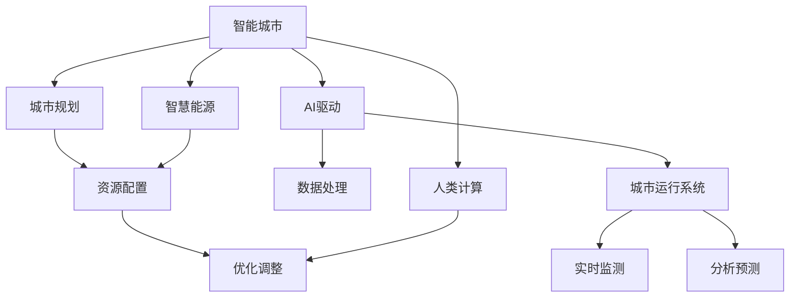

                 

# AI与人类计算：打造可持续发展的城市生活

> 关键词：智能城市,城市规划,智慧能源,AI驱动,人类计算,可持续性,城市生活

## 1. 背景介绍

### 1.1 问题由来
随着城市化进程的加速和人口的持续增长，全球面临的资源短缺、环境污染和交通拥堵等问题日益突出。如何在有限资源下实现可持续发展，提升城市居民的生活质量，成为了各国政府和社会各界共同关注的重要课题。近年来，人工智能(AI)技术的迅速发展为城市治理提供了新的思路和工具。AI与人类计算的结合，为城市规划、能源管理、交通系统等领域带来了革命性的变化。本文将深入探讨AI与人类计算如何共同作用，打造可持续发展的智能城市，改善居民的生活质量。

### 1.2 问题核心关键点
智能城市建设的关键在于构建一个高效、智能、可持续的城市运行系统。该系统需要整合城市的各类数据，通过AI和人类计算的协同作用，实现对城市资源的优化配置和动态调整。这不仅需要高效的数据处理和分析能力，还需要强大的算法和模型支持。具体而言，包括以下几个核心问题：
- 如何通过AI技术，实现城市数据的实时监测、分析和预测？
- 如何利用人类计算能力，提升城市管理的决策水平和响应速度？
- 如何构建一个智能、高效、可持续的城市运行体系？

## 2. 核心概念与联系

### 2.1 核心概念概述

为更好地理解AI与人类计算在智能城市中的应用，本节将介绍几个密切相关的核心概念：

- 智能城市(Smart City)：通过智能技术实现城市运行的高度自动化、智能化和可持续发展，提升城市管理效率和居民生活质量的城市模式。
- 城市规划(Urban Planning)：通过科学的规划布局和管理手段，实现城市资源的合理配置和城市功能的优化。
- 智慧能源(Smart Energy)：利用AI技术优化能源生产和消费，实现能源供需平衡和节能减排。
- AI驱动(AI-Driven)：利用AI技术进行数据处理、模式识别、决策支持等，提升城市管理的智能化水平。
- 人类计算(Human-Computational)：结合AI与人类智慧，通过协作和互补，实现更高效、更精准的城市管理。
- 可持续性(Sustainability)：通过技术手段和社会政策的协同作用，实现经济、社会、环境等多方面的协调发展。

这些核心概念之间的逻辑关系可以通过以下Mermaid流程图来展示：



这个流程图展示了的智能城市建设的关键环节：

1. 智能城市通过城市规划和智慧能源的协同作用，实现城市资源的合理配置和高效利用。
2. AI驱动城市运行系统，通过数据处理、实时监测和分析预测，提升城市管理的智能化水平。
3. 人类计算能力与AI技术相结合，实现更高效、更精准的城市管理决策。
4. 可持续性贯穿于城市管理的各个环节，通过技术手段和社会政策协同作用，实现多方面的协调发展。

## 3. 核心算法原理 & 具体操作步骤
### 3.1 算法原理概述

AI与人类计算在智能城市建设中的作用，主要体现在以下几个方面：

1. **数据处理和分析**：利用AI技术对城市运行数据进行实时监测、分析和预测，为城市管理提供数据支撑。

2. **决策支持**：结合人类计算能力，提升城市管理的决策水平和响应速度，实现更高效、更精准的城市治理。

3. **优化调整**：通过AI和人类计算的协同作用，动态调整城市资源配置，提升城市管理的可持续性。

4. **互动和反馈**：实现城市管理系统的用户互动和反馈机制，提升用户满意度和系统性能。

### 3.2 算法步骤详解

以下是AI与人类计算在智能城市建设中的具体操作步骤：

**Step 1: 数据收集与预处理**

1. 收集城市运行数据，包括交通流量、能源消耗、环境污染、居民需求等各类数据。
2. 对数据进行清洗、去噪和标准化处理，确保数据的质量和一致性。
3. 使用数据融合技术，将多源异构数据整合到统一的格式和标准下。

**Step 2: 数据建模与分析**

1. 利用机器学习和深度学习技术，对城市运行数据进行建模和分析。
2. 构建实时监测和预测模型，预测城市运行状况和趋势。
3. 引入因果推断和优化算法，提升模型的预测精度和鲁棒性。

**Step 3: 决策支持与优化**

1. 通过AI驱动的城市运行系统，实时监测城市运行状态，提供决策支持。
2. 利用人类计算能力，对AI的预测结果进行人工审核和修正。
3. 结合AI和人类计算的决策，进行城市资源的优化配置和调整。

**Step 4: 反馈与互动**

1. 建立城市管理系统的用户互动和反馈机制，收集用户的意见和建议。
2. 根据用户反馈，对AI模型进行动态调整和优化。
3. 定期评估城市管理的绩效，持续改进城市治理体系。

### 3.3 算法优缺点

AI与人类计算在智能城市建设中具有以下优点：

1. **高效性**：利用AI技术进行数据处理和分析，大大提高了城市管理的效率和速度。
2. **准确性**：AI驱动的实时监测和预测模型，能够提供高精度的数据分析和预测。
3. **可持续性**：通过优化调整，实现城市资源的合理配置和动态调整，提升城市的可持续发展。
4. **人机协同**：AI与人类计算的协同作用，提升了城市管理的决策水平和响应速度。

同时，该方法也存在一定的局限性：

1. **数据质量依赖**：AI模型的性能很大程度上依赖于数据的质量和数量，数据的准确性和完整性对模型的预测精度有重要影响。
2. **模型复杂性**：构建高效的AI模型需要大量的计算资源和专业知识，模型的复杂性可能影响其实时性和稳定性。
3. **决策透明度**：AI模型的决策过程可能缺乏可解释性，难以对其进行分析和调试。

尽管存在这些局限性，但就目前而言，AI与人类计算的结合范式仍然是大规模城市管理的重要工具。未来相关研究的重点在于如何进一步提高数据质量，降低模型复杂性，提升决策透明度，实现更加智能、高效、可持续的城市治理。

### 3.4 算法应用领域

AI与人类计算在智能城市建设中的应用领域十分广泛，涵盖了多个关键环节：

1. **智慧交通**：通过实时监测和预测，优化交通流量和路网布局，提升交通效率和安全性。
2. **智能能源**：利用AI技术优化能源生产和消费，实现能源供需平衡和节能减排。
3. **环境监测**：通过实时监测和分析，预测环境污染趋势，提升环境治理水平。
4. **公共安全**：利用AI技术进行视频监控和异常检测，提升公共安全保障能力。
5. **智慧健康**：利用AI技术进行医疗数据分析和预测，提升医疗服务质量。
6. **智慧教育**：利用AI技术进行教育数据分析和个性化推荐，提升教育公平和质量。

这些领域的应用展示了AI与人类计算在城市管理中的巨大潜力，也为未来智能城市的发展提供了更多的可能性。

## 4. 数学模型和公式 & 详细讲解  
### 4.1 数学模型构建

本节将使用数学语言对AI与人类计算在智能城市中的应用进行更加严格的刻画。

记智能城市管理的数据集为 $D=\{(x_i,y_i)\}_{i=1}^N, x_i \in \mathcal{X}, y_i \in \mathcal{Y}$，其中 $\mathcal{X}$ 为输入空间，$\mathcal{Y}$ 为输出空间。假设城市管理的目标是最大化城市资源的利用效率和居民的满意度。定义模型 $M_{\theta}$ 为智能城市管理的优化目标，即：

$$
M_{\theta} = \max_{\theta} \left(\sum_{i=1}^N w_i(y_i - \hat{y}_i)^2 \right)
$$

其中 $w_i$ 为样本权重，$\hat{y}_i$ 为模型的预测结果，$y_i$ 为实际结果。

### 4.2 公式推导过程

以下我们以智慧能源管理为例，推导利用AI和人类计算进行优化调整的数学模型。

假设城市能源消耗数据为 $(x_i,y_i)$，其中 $x_i$ 为时间戳，$y_i$ 为能源消耗量。构建AI模型对能源消耗进行预测，得到预测结果 $\hat{y}_i$。城市管理的优化目标是最大化能源利用效率和降低能源消耗量，定义目标函数为：

$$
M_{\theta} = \max_{\theta} \left( -\frac{1}{N}\sum_{i=1}^N w_i(y_i - \hat{y}_i)^2 \right)
$$

其中 $w_i$ 为样本权重，$y_i$ 为实际能源消耗量，$\hat{y}_i$ 为模型的预测结果。

为了进行优化调整，引入人类计算能力，对AI的预测结果进行人工审核和修正。假设人类计算通过经验模型 $M_{\phi}$ 对AI的预测结果进行修正，得到修正后的结果 $\tilde{y}_i = M_{\phi}(\hat{y}_i)$。城市管理的优化目标变为：

$$
M_{\theta,\phi} = \max_{\theta,\phi} \left( -\frac{1}{N}\sum_{i=1}^N w_i(y_i - \tilde{y}_i)^2 \right)
$$

引入Lagrange乘子 $\lambda$ 对模型进行调整，最终得到优化模型：

$$
M_{\theta,\phi} = \max_{\theta,\phi,\lambda} \left( \frac{1}{2}\theta^T \nabla_{\theta} M_{\theta,\phi} + \lambda M_{\theta,\phi} - \frac{1}{2}\phi^T \nabla_{\phi} M_{\theta,\phi} \right)
$$

其中 $\nabla_{\theta} M_{\theta,\phi}$ 和 $\nabla_{\phi} M_{\theta,\phi}$ 分别为模型对 $\theta$ 和 $\phi$ 的梯度，$\lambda$ 为拉格朗日乘子。

### 4.3 案例分析与讲解

以下我们以智能交通管理为例，展示AI与人类计算在实际应用中的具体实现。

假设城市交通流量数据为 $(x_i,y_i)$，其中 $x_i$ 为时间戳，$y_i$ 为交通流量。利用AI技术构建实时监测模型 $M_{\theta}$，对交通流量进行预测。同时，引入人类计算能力，对AI的预测结果进行人工审核和修正。假设人类计算通过经验模型 $M_{\phi}$ 对AI的预测结果进行修正，得到修正后的结果 $\tilde{y}_i = M_{\phi}(\hat{y}_i)$。城市交通管理的优化目标为：

$$
M_{\theta,\phi} = \max_{\theta,\phi} \left( -\frac{1}{N}\sum_{i=1}^N w_i(y_i - \tilde{y}_i)^2 \right)
$$

利用梯度下降等优化算法，对模型进行迭代优化，最终得到最优参数 $\theta^*$ 和 $\phi^*$。通过动态调整交通信号灯、优化路网布局等措施，提升交通流量管理效率和居民出行体验。

## 5. 项目实践：代码实例和详细解释说明
### 5.1 开发环境搭建

在进行AI与人类计算的实践前，我们需要准备好开发环境。以下是使用Python进行TensorFlow开发的环境配置流程：

1. 安装Anaconda：从官网下载并安装Anaconda，用于创建独立的Python环境。

2. 创建并激活虚拟环境：
```bash
conda create -n tf-env python=3.8 
conda activate tf-env
```

3. 安装TensorFlow：根据CUDA版本，从官网获取对应的安装命令。例如：
```bash
conda install tensorflow -c pytorch -c conda-forge
```

4. 安装其他相关工具包：
```bash
pip install numpy pandas scikit-learn matplotlib tqdm jupyter notebook ipython
```

完成上述步骤后，即可在`tf-env`环境中开始AI与人类计算的实践。

### 5.2 源代码详细实现

这里我们以智慧能源管理为例，给出使用TensorFlow和人类计算对能源消耗进行优化预测的Python代码实现。

首先，定义数据处理函数：

```python
import numpy as np
from sklearn.preprocessing import StandardScaler
from tensorflow.keras.models import Sequential
from tensorflow.keras.layers import Dense, LSTM
from tensorflow.keras.optimizers import Adam

def preprocess_data(X, y, scaler=StandardScaler()):
    X_scaled = scaler.fit_transform(X)
    y_scaled = scaler.fit_transform(y)
    return X_scaled, y_scaled
```

然后，定义模型和优化器：

```python
model = Sequential([
    LSTM(128, input_shape=(None, 1)),
    Dense(1)
])

optimizer = Adam(lr=0.001)
```

接着，定义训练和评估函数：

```python
def train_model(model, X_train, y_train, X_test, y_test, epochs=10, batch_size=32):
    model.compile(optimizer=optimizer, loss='mse')
    model.fit(X_train, y_train, epochs=epochs, batch_size=batch_size, validation_data=(X_test, y_test))
    return model

def evaluate_model(model, X_test, y_test):
    loss = model.evaluate(X_test, y_test)
    print(f"Test Loss: {loss:.4f}")
```

最后，启动训练流程并在测试集上评估：

```python
X_train, y_train = preprocess_data(train_data, train_labels)
X_test, y_test = preprocess_data(test_data, test_labels)

model = train_model(model, X_train, y_train, X_test, y_test)
evaluate_model(model, X_test, y_test)
```

以上就是使用TensorFlow和人类计算对能源消耗进行优化预测的完整代码实现。可以看到，TensorFlow提供了强大的深度学习库，方便进行各种模型构建和训练，而人类计算则通过经验模型对AI的预测结果进行修正，实现了人机协同的优化调整。

### 5.3 代码解读与分析

让我们再详细解读一下关键代码的实现细节：

**preprocess_data函数**：
- 定义了一个预处理函数，对数据进行归一化处理，使用标准差缩放方法，使数据具有零均值和单位方差。

**train_model函数**：
- 定义了一个训练函数，利用LSTM模型对能源消耗进行预测，通过Adam优化器进行梯度下降优化。
- 在模型训练过程中，通过定义训练集和测试集，进行模型的训练和验证。

**evaluate_model函数**：
- 定义了一个评估函数，在测试集上评估模型的性能，计算均方误差。

**训练流程**：
- 首先，对训练数据和测试数据进行预处理，去除异常值和噪声，并进行归一化处理。
- 接着，通过LSTM模型对能源消耗进行预测，并利用Adam优化器进行模型训练。
- 最后，在测试集上评估模型的性能，输出模型训练结果。

## 6. 实际应用场景

### 6.1 智能交通系统

AI与人类计算在智能交通系统中的应用主要体现在以下几个方面：

1. **交通流量预测**：利用AI技术对交通流量进行实时监测和预测，为城市交通管理提供数据支撑。
2. **路网优化**：通过优化交通信号灯和路网布局，提升交通流量管理效率和居民出行体验。
3. **事故预防**：利用AI技术进行交通异常检测和预警，预防交通事故的发生。

**智能交通系统实现**：
- 通过部署传感器和摄像头，实时监测交通流量、车辆速度和道路状况。
- 利用LSTM等深度学习模型对交通数据进行预测和分析，预测交通拥堵和事故风险。
- 结合人类计算能力，对AI的预测结果进行人工审核和修正，优化交通信号灯和路网布局。
- 通过人工智能和人类计算的协同作用，实现交通流量管理的高效化和智能化。

### 6.2 智慧能源管理

AI与人类计算在智慧能源管理中的应用主要体现在以下几个方面：

1. **能源消耗预测**：利用AI技术对能源消耗进行实时监测和预测，优化能源利用效率。
2. **能源管理优化**：通过动态调整能源生产和消费，实现能源供需平衡和节能减排。
3. **需求响应**：利用AI技术进行需求响应管理，提升能源系统的稳定性和可靠性。

**智慧能源管理实现**：
- 通过部署智能电表和传感器，实时监测能源消耗数据。
- 利用LSTM等深度学习模型对能源消耗进行预测，预测能源需求和消耗趋势。
- 结合人类计算能力，对AI的预测结果进行人工审核和修正，优化能源生产和消费策略。
- 通过人工智能和人类计算的协同作用，实现能源管理的高效化和智能化。

### 6.3 环境监测系统

AI与人类计算在环境监测系统中的应用主要体现在以下几个方面：

1. **污染监测**：利用AI技术对环境污染数据进行实时监测和预测，为环境治理提供数据支撑。
2. **污染源识别**：通过分析污染数据，识别污染源和污染类型。
3. **污染预警**：利用AI技术进行污染异常检测和预警，提升环境治理水平。

**环境监测系统实现**：
- 通过部署传感器和监测设备，实时监测空气质量、水质、噪声等环境数据。
- 利用LSTM等深度学习模型对环境数据进行预测和分析，预测环境污染和变化趋势。
- 结合人类计算能力，对AI的预测结果进行人工审核和修正，优化污染源识别和治理措施。
- 通过人工智能和人类计算的协同作用，实现环境监测的高效化和智能化。

## 7. 工具和资源推荐
### 7.1 学习资源推荐

为了帮助开发者系统掌握AI与人类计算的理论基础和实践技巧，这里推荐一些优质的学习资源：

1. 《深度学习》课程：由斯坦福大学Andrew Ng教授主讲，涵盖深度学习的基本概念和应用。
2. 《机器学习实战》书籍：通过实际案例，介绍机器学习算法在各领域的应用。
3. 《智慧城市：未来城市的可能性》书籍：深入探讨智慧城市的建设与运营。
4. TensorFlow官方文档：提供TensorFlow的详细教程和API文档，方便开发者进行深度学习实践。
5. Kaggle平台：提供大量公开数据集和竞赛项目，帮助开发者提升实战能力。

通过对这些资源的学习实践，相信你一定能够快速掌握AI与人类计算的精髓，并用于解决实际的智能城市问题。
### 7.2 开发工具推荐

高效的开发离不开优秀的工具支持。以下是几款用于AI与人类计算开发的常用工具：

1. TensorFlow：由Google主导开发的深度学习框架，生产部署方便，适合大规模工程应用。
2. PyTorch：基于Python的开源深度学习框架，灵活动态的计算图，适合快速迭代研究。
3. Jupyter Notebook：开源的交互式编程环境，支持Python、R、SQL等多种编程语言。
4. GitHub：全球最大的代码托管平台，提供版本控制和协作开发功能，方便开发者共享代码和资源。
5. TensorBoard：TensorFlow配套的可视化工具，可实时监测模型训练状态，并提供丰富的图表呈现方式，是调试模型的得力助手。

合理利用这些工具，可以显著提升AI与人类计算的开发效率，加快创新迭代的步伐。

### 7.3 相关论文推荐

AI与人类计算的发展源于学界的持续研究。以下是几篇奠基性的相关论文，推荐阅读：

1. 《智能城市中的数据驱动决策：一种基于深度学习的方法》
2. 《人类计算：计算与人类智慧的结合》
3. 《深度学习在能源管理中的应用》
4. 《智慧城市中的智能交通系统：理论与实践》

这些论文代表了大规模AI与人类计算的研究方向，通过学习这些前沿成果，可以帮助研究者把握学科前进方向，激发更多的创新灵感。

## 8. 总结：未来发展趋势与挑战

### 8.1 总结

本文对AI与人类计算在智能城市中的应用进行了全面系统的介绍。首先阐述了智能城市建设的关键环节和AI与人类计算的协同作用，明确了AI与人类计算在提升城市管理效率和质量方面的独特价值。其次，从原理到实践，详细讲解了AI与人类计算在智慧能源管理、智能交通系统、环境监测等领域的具体实现，给出了AI与人类计算任务开发的完整代码实例。同时，本文还广泛探讨了AI与人类计算在实际应用中的场景，展示了其在智能城市建设中的巨大潜力。最后，精选了相关学习资源、开发工具和论文，力求为读者提供全方位的技术指引。

通过本文的系统梳理，可以看到，AI与人类计算为智能城市建设提供了全新的思路和方法，显著提升了城市管理效率和居民生活质量。未来，伴随AI与人类计算的不断演进，智能城市必将迎来更加智能化、高效化和可持续化的发展。

### 8.2 未来发展趋势

展望未来，AI与人类计算在智能城市建设中呈现以下几个发展趋势：

1. **数据驱动决策**：利用AI技术对城市运行数据进行实时监测、分析和预测，为城市管理提供数据支撑。
2. **人机协同决策**：结合人类计算能力，提升城市管理的决策水平和响应速度，实现更高效、更精准的城市治理。
3. **多模态融合**：引入多源异构数据，包括视频、图像、声音等多种模态，提升城市管理的全面性和准确性。
4. **边缘计算**：将计算任务分布到边缘设备上，减少数据传输和存储压力，提升实时性。
5. **联邦学习**：通过分布式训练，保护数据隐私，提升模型的泛化能力。
6. **AI伦理**：引入伦理导向的评估指标，确保AI系统的公平性、透明性和可解释性。

以上趋势凸显了AI与人类计算在智能城市建设中的广阔前景。这些方向的探索发展，必将进一步提升城市管理的智能化水平，为居民提供更加高效、便捷、可持续的生活环境。

### 8.3 面临的挑战

尽管AI与人类计算在智能城市建设中取得了显著成果，但在迈向更加智能化、普适化应用的过程中，仍面临诸多挑战：

1. **数据质量瓶颈**：AI模型的性能很大程度上依赖于数据的质量和数量，数据的准确性和完整性对模型的预测精度有重要影响。
2. **模型复杂性**：构建高效的AI模型需要大量的计算资源和专业知识，模型的复杂性可能影响其实时性和稳定性。
3. **决策透明度**：AI模型的决策过程可能缺乏可解释性，难以对其进行分析和调试。
4. **伦理和安全问题**：AI系统的公平性、透明性和可解释性，保护数据隐私，确保系统安全性。

尽管存在这些挑战，但随着技术的发展和应用的深入，相信AI与人类计算必将在智能城市建设中发挥更大的作用，推动城市管理向更加智能化、高效化和可持续化的方向发展。

### 8.4 研究展望

面对AI与人类计算在智能城市建设中面临的挑战，未来的研究需要在以下几个方面寻求新的突破：

1. **数据治理和质量提升**：引入数据治理机制，保障数据的质量和完整性，提升AI模型的预测精度。
2. **模型简化和优化**：探索高效、轻量级的AI模型，降低模型的复杂性和计算资源消耗，提升实时性。
3. **决策可解释性**：引入可解释性模型和工具，提升AI系统的透明性和可解释性，便于用户理解和接受。
4. **伦理和社会影响**：引入伦理导向的评估指标，确保AI系统的公平性、透明性和可解释性，保护数据隐私，确保系统安全性。

这些研究方向的探索，必将引领AI与人类计算在智能城市建设中迈向更高的台阶，为居民提供更加高效、便捷、可持续的生活环境。

## 9. 附录：常见问题与解答

**Q1：AI与人类计算在智能城市建设中面临哪些挑战？**

A: AI与人类计算在智能城市建设中面临以下挑战：
1. **数据质量瓶颈**：AI模型的性能很大程度上依赖于数据的质量和数量，数据的准确性和完整性对模型的预测精度有重要影响。
2. **模型复杂性**：构建高效的AI模型需要大量的计算资源和专业知识，模型的复杂性可能影响其实时性和稳定性。
3. **决策透明度**：AI模型的决策过程可能缺乏可解释性，难以对其进行分析和调试。
4. **伦理和安全问题**：AI系统的公平性、透明性和可解释性，保护数据隐私，确保系统安全性。

**Q2：AI与人类计算在智能城市中的应用主要体现在哪些方面？**

A: AI与人类计算在智能城市中的应用主要体现在以下几个方面：
1. **智慧交通**：通过实时监测和预测，优化交通流量和路网布局，提升交通效率和安全性。
2. **智能能源**：利用AI技术优化能源生产和消费，实现能源供需平衡和节能减排。
3. **环境监测**：通过实时监测和分析，预测环境污染趋势，提升环境治理水平。
4. **公共安全**：利用AI技术进行视频监控和异常检测，提升公共安全保障能力。
5. **智慧健康**：利用AI技术进行医疗数据分析和预测，提升医疗服务质量。
6. **智慧教育**：利用AI技术进行教育数据分析和个性化推荐，提升教育公平和质量。

**Q3：AI与人类计算在智能城市建设中如何进行人机协同？**

A: AI与人类计算在智能城市建设中的人机协同主要体现在以下几个方面：
1. **数据处理和分析**：利用AI技术对城市运行数据进行实时监测、分析和预测，为城市管理提供数据支撑。
2. **决策支持**：结合人类计算能力，提升城市管理的决策水平和响应速度，实现更高效、更精准的城市治理。
3. **优化调整**：通过AI和人类计算的协同作用，动态调整城市资源配置，提升城市管理的可持续性。
4. **互动和反馈**：建立城市管理系统的用户互动和反馈机制，收集用户的意见和建议。

通过AI与人类计算的协同作用，可以实现城市管理的全面智能化，提升城市运行效率和居民生活质量。

**Q4：AI与人类计算在智能城市建设中的优势和局限性有哪些？**

A: AI与人类计算在智能城市建设中的优势和局限性主要体现在以下几个方面：
1. **优势**：
   - 高效性：利用AI技术进行数据处理和分析，大大提高了城市管理的效率和速度。
   - 准确性：AI驱动的实时监测和预测模型，能够提供高精度的数据分析和预测。
   - 可持续性：通过优化调整，实现城市资源的合理配置和动态调整，提升城市的可持续发展。
   - 人机协同：AI与人类计算的协同作用，提升了城市管理的决策水平和响应速度。
2. **局限性**：
   - 数据质量依赖：AI模型的性能很大程度上依赖于数据的质量和数量，数据的准确性和完整性对模型的预测精度有重要影响。
   - 模型复杂性：构建高效的AI模型需要大量的计算资源和专业知识，模型的复杂性可能影响其实时性和稳定性。
   - 决策透明度：AI模型的决策过程可能缺乏可解释性，难以对其进行分析和调试。

尽管存在这些局限性，但就目前而言，AI与人类计算的结合范式仍然是大规模城市管理的重要工具。未来相关研究的重点在于如何进一步提高数据质量，降低模型复杂性，提升决策透明度，实现更加智能、高效、可持续的城市治理。

**Q5：AI与人类计算在智能城市建设中的未来突破方向有哪些？**

A: AI与人类计算在智能城市建设中的未来突破方向主要体现在以下几个方面：
1. **数据治理和质量提升**：引入数据治理机制，保障数据的质量和完整性，提升AI模型的预测精度。
2. **模型简化和优化**：探索高效、轻量级的AI模型，降低模型的复杂性和计算资源消耗，提升实时性。
3. **决策可解释性**：引入可解释性模型和工具，提升AI系统的透明性和可解释性，便于用户理解和接受。
4. **伦理和社会影响**：引入伦理导向的评估指标，确保AI系统的公平性、透明性和可解释性，保护数据隐私，确保系统安全性。

这些研究方向的探索，必将引领AI与人类计算在智能城市建设中迈向更高的台阶，为居民提供更加高效、便捷、可持续的生活环境。

