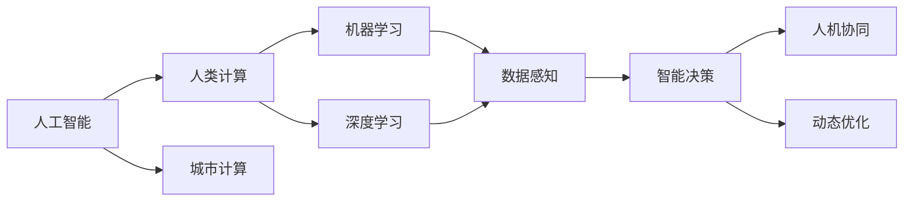

                 

## 1. 背景介绍

### 1.1 问题由来

在飞速发展的现代城市中，人类计算（Human-Computer Interaction, HCI）成为不可或缺的一环。随着城市人口的急剧增加，以及智能设备的广泛普及，计算需求变得前所未有的复杂和多样化。如何通过智能技术，在提升城市生活品质的同时，确保其可持续性，成为现代城市建设面临的巨大挑战。

人工智能（AI）技术的迅猛发展，为城市计算带来了新的解决方案。基于AI的智能系统可以在交通管理、能源优化、公共安全、环保监测、智慧建筑等多个领域提供强大支持，提升城市管理的智能化水平。

### 1.2 问题核心关键点

本文聚焦于AI与人类计算的深度融合，探讨如何通过AI技术提升城市管理效率，优化资源配置，实现可持续发展。AI在此过程中扮演的角色主要包括以下几个方面：

1. **数据感知**：通过传感器、摄像头、物联网设备等技术，实时获取城市运行数据。
2. **智能决策**：运用机器学习、深度学习等技术，对大量数据进行分析和挖掘，辅助决策。
3. **人机协同**：设计更加自然、高效的交互界面，让用户能够无缝地与智能系统互动。
4. **动态优化**：根据环境变化和需求调整，实时调整系统行为，确保资源配置最优。

### 1.3 问题研究意义

研究AI与人类计算的深度融合，对于提升城市管理效率、优化资源配置、实现可持续发展具有重要意义：

1. **提升效率**：AI技术可以实时处理大量数据，辅助决策者快速响应城市事件，提升城市管理效率。
2. **优化资源**：通过智能算法，AI能够优化城市能源、交通、公共服务等的配置，降低浪费，提升资源利用率。
3. **环保节能**：AI系统可以实时监测环境变化，采取节能减排措施，推动绿色可持续发展。
4. **用户满意度**：设计高效、友好的交互界面，提升市民对城市服务的满意度，增强其获得感。
5. **应急响应**：在突发事件中，AI可以快速分析情况，提供最佳解决方案，保障市民生命财产安全。

## 2. 核心概念与联系

### 2.1 核心概念概述

在探索AI与人类计算的深度融合时，涉及多个核心概念。以下是对这些概念的详细阐述及其联系：

- **人工智能（AI）**：通过模拟人类智能行为，实现对大量数据的自动化分析和处理，辅助决策。
- **人类计算（HCI）**：设计更加高效、自然的交互方式，使用户能够顺畅地与智能系统互动。
- **城市计算（Urban Computing）**：利用计算技术，分析和优化城市运行中的各种问题，提升城市管理水平。
- **机器学习（ML）**：通过数据训练模型，使AI系统能够自我优化，提升预测准确性。
- **深度学习（DL）**：一种特殊的机器学习方法，通过多层次神经网络，实现对复杂数据的高效处理。
- **人机协同（Human-AI Collaboration）**：设计智能系统，使其能够理解人类需求，提供个性化服务。

这些概念之间相互关联，共同构成了现代城市计算的基石。以下是一个简洁的Mermaid流程图，展示了这些概念之间的联系：



### 2.2 核心概念原理和架构

为了更好地理解这些核心概念，这里提供原理和架构图。假设一个智能交通系统为例，展现AI与人类计算如何协同工作。

1. **数据感知（Data Sensing）**：
   - **传感器（Sensors）**：安装在交通路口的摄像头、压力传感器、车辆感应器等，实时采集交通流量、车辆速度、道路状况等信息。
   - **数据收集与整合（Data Collection and Integration）**：通过物联网设备，将各类传感器数据上传至云端，进行统一管理和分析。

2. **智能决策（Smart Decision Making）**：
   - **模型训练与优化（Model Training and Optimization）**：使用历史交通数据，训练机器学习模型，如交通流量预测模型、事故检测模型等，优化模型参数。
   - **实时预测与调整（Real-Time Prediction and Adjustment）**：通过实时获取的交通数据，输入训练好的模型进行预测，调整红绿灯周期、路段限速等参数，优化交通流量。

3. **人机协同（Human-AI Collaboration）**：
   - **交互界面设计（Interface Design）**：设计友好的UI/UX，用户可以通过手机APP、电脑界面等设备，实时查看交通状况、路况预测、出行建议等信息。
   - **自然语言处理（Natural Language Processing, NLP）**：通过NLP技术，用户可以用自然语言查询或反馈信息，系统能够智能理解并作出响应。

4. **动态优化（Dynamic Optimization）**：
   - **实时监控与调整（Real-Time Monitoring and Adjustment）**：系统不断监控交通状态，根据实时数据自动调整参数，如信号灯控制、路段限速等。
   - **模型反馈与迭代（Model Feedback and Iteration）**：根据用户反馈和交通数据，不断更新和优化模型，提升系统准确性和稳定性。

## 3. 核心算法原理 & 具体操作步骤

### 3.1 算法原理概述

基于AI与人类计算的深度融合，主要包含以下几个步骤：

1. **数据收集与整合**：利用传感器、摄像头等技术，实时获取城市运行数据。
2. **模型训练与优化**：使用机器学习、深度学习等技术，训练模型进行数据处理和预测。
3. **人机交互界面设计**：设计友好的交互界面，使用户能够顺畅地与智能系统互动。
4. **动态优化与调整**：根据环境变化和需求，实时调整系统行为，确保资源配置最优。

### 3.2 算法步骤详解

以下是详细的算法步骤：

**Step 1: 数据收集与整合**

- **传感器部署**：在城市各关键位置部署各类传感器，实时采集数据。
- **数据传输与存储**：将传感器数据传输至云端，存储在分布式数据库中。
- **数据清洗与预处理**：对原始数据进行清洗、去噪、归一化等预处理，提升数据质量。

**Step 2: 模型训练与优化**

- **特征工程**：从原始数据中提取有意义的特征，如交通流量、车辆类型、道路状况等。
- **模型选择与训练**：选择适当的机器学习或深度学习模型，如支持向量机（SVM）、随机森林（Random Forest）、卷积神经网络（CNN）等，进行模型训练和参数优化。
- **模型评估与验证**：使用验证集对模型进行评估，调整模型参数，避免过拟合。

**Step 3: 人机交互界面设计**

- **界面设计**：设计友好的用户界面，使用户能够轻松地输入查询、查看数据等。
- **自然语言处理**：通过NLP技术，使系统能够理解自然语言输入，提供准确的回答和建议。
- **用户反馈与迭代**：收集用户反馈，不断优化UI/UX设计，提升用户体验。

**Step 4: 动态优化与调整**

- **实时监控**：实时监控城市运行数据，如交通流量、空气质量等。
- **实时预测与调整**：根据实时数据，自动调整系统行为，如调整信号灯周期、路段限速等。
- **模型反馈与迭代**：根据用户反馈和实时数据，不断更新和优化模型，提升系统准确性和稳定性。

### 3.3 算法优缺点

AI与人类计算的深度融合带来了以下优势：

1. **高效性**：AI能够实时处理大量数据，辅助决策，提升城市管理效率。
2. **准确性**：通过机器学习、深度学习等技术，模型能够精确预测交通流量、环境变化等，提供准确的信息。
3. **智能性**：利用自然语言处理技术，用户可以与智能系统进行自然交互，提升用户体验。
4. **自适应性**：系统可以根据实时数据和用户反馈，不断优化模型，提升系统性能。

同时，也存在一些局限性：

1. **数据依赖**：系统需要大量高质量的数据进行训练，数据收集和处理成本较高。
2. **隐私问题**：城市计算涉及大量个人隐私数据，需要严格的隐私保护措施。
3. **技术门槛**：AI与人类计算的深度融合需要综合运用多种技术，对技术人员要求较高。
4. **鲁棒性**：系统在面对异常数据和环境变化时，可能出现鲁棒性不足的问题。

### 3.4 算法应用领域

AI与人类计算的深度融合已经在多个领域得到广泛应用：

1. **智慧交通**：通过智能交通系统，实时监控和调整交通流量，提升交通效率。
2. **智能电网**：利用AI优化能源分配，降低能耗，提升电网稳定性。
3. **智慧医疗**：通过智能分析患者数据，提供个性化医疗建议，提升医疗服务质量。
4. **智能安防**：通过AI进行图像识别、行为分析，提升公共安全水平。
5. **智慧环保**：利用AI进行环境监测，实时调整污染控制策略，提升环境保护水平。

## 4. 数学模型和公式 & 详细讲解

### 4.1 数学模型构建

以下通过一个简单的智能交通系统，构建数学模型：

假设城市中有N个交叉口，每个交叉口有M条车道，交通流量由以下公式表示：

$$
T_{ij} = \sum_{k=1}^{K} \alpha_k F_{ik}^{(j)}
$$

其中：
- $T_{ij}$：交叉口i、车道j的交通流量。
- $F_{ik}^{(j)}$：第k个信号灯周期中，交叉口i、车道j的平均流量。
- $\alpha_k$：信号灯周期k的权重，与交通需求和运行状态相关。

**Step 1: 数据收集与整合**

设城市中交叉口的数量N为50，每个交叉口有4条车道，每个信号灯周期有5个状态，每个状态持续时间为60秒，交通流量在每个状态下的均值分别为100、200、300、400、500辆/分钟。

**Step 2: 模型训练与优化**

使用历史交通数据，训练模型预测交叉口交通流量。假设模型输入为交叉口编号、车道编号、信号灯周期状态，输出为交通流量预测值。使用均方误差（Mean Squared Error, MSE）作为损失函数：

$$
L = \frac{1}{N} \sum_{i=1}^{N} \frac{1}{M} \sum_{j=1}^{M} (T_{ij} - \hat{T}_{ij})^2
$$

使用梯度下降算法，最小化损失函数，更新模型参数。

**Step 3: 人机交互界面设计**

设计用户界面，允许用户输入交叉口编号、车道编号、时间等，系统根据输入数据，实时输出交通流量预测值。

**Step 4: 动态优化与调整**

实时监控交叉口交通流量，根据预测模型输出，自动调整信号灯周期、路段限速等参数，优化交通流量。

### 4.2 公式推导过程

以下推导智能交通系统中的关键公式：

设交叉口i、车道j的交通流量为$T_{ij}$，历史数据中，信号灯周期k的权重为$\alpha_k$，对应的平均流量为$F_{ik}^{(j)}$。则交叉口i、车道j在信号灯周期k下的交通流量预测值为：

$$
\hat{T}_{ij} = \sum_{k=1}^{K} \alpha_k F_{ik}^{(j)}
$$

其中，权重$\alpha_k$可以通过历史数据计算得到。具体计算方法为：

$$
\alpha_k = \frac{\sum_{i=1}^{N} \sum_{j=1}^{M} T_{ij}^{(k)}}{\sum_{i=1}^{N} \sum_{j=1}^{M} T_{ij}^{(k)}}
$$

利用上述公式，可以得到交叉口交通流量的预测值。将预测值与实际流量进行比较，使用均方误差（MSE）作为损失函数，训练模型参数。

### 4.3 案例分析与讲解

假设在交叉口1、车道2上，信号灯周期1的平均流量为200辆/分钟，权重为0.2；信号灯周期2的平均流量为300辆/分钟，权重为0.4；信号灯周期3的平均流量为400辆/分钟，权重为0.3；信号灯周期4的平均流量为500辆/分钟，权重为0.1。则交叉口1、车道2的交通流量预测值为：

$$
\hat{T}_{12} = 0.2 \times 200 + 0.4 \times 300 + 0.3 \times 400 + 0.1 \times 500 = 370
$$

根据上述预测值，可以调整信号灯周期，优化交通流量。

## 5. 项目实践：代码实例和详细解释说明

### 5.1 开发环境搭建

在进行城市计算项目开发前，需要先搭建好开发环境。以下是Python环境下进行开发的步骤：

1. 安装Python：确保Python 3.8以上版本已安装，可以通过以下命令检查：

   ```bash
   python --version
   ```

2. 安装必要的库：

   ```bash
   pip install numpy pandas scikit-learn matplotlib
   ```

3. 准备数据集：

   可以使用公开的城市交通数据集，如.datasets/交通流量.csv，或从城市交通管理部门获取数据。

### 5.2 源代码详细实现

以下是一个简单的智能交通系统代码实现：

```python
import numpy as np
from sklearn.metrics import mean_squared_error

# 定义交叉口交通流量计算函数
def calculate_traffic_flow(N, M, K, alpha, F):
    T = np.zeros((N, M))
    for i in range(N):
        for j in range(M):
            for k in range(K):
                T[i, j] += alpha[k] * F[i, j, k]
    return T

# 定义均方误差计算函数
def calculate_mse(T, predicted_T):
    return mean_squared_error(T, predicted_T)

# 读取交通数据
data = np.loadtxt('datasets/traffic_flow.csv', delimiter=',')
N = data.shape[0]  # 交叉口数量
M = data.shape[1]  # 车道数量
K = 5  # 信号灯周期数

# 计算历史交通流量数据
F = np.zeros((N, M, K))
for i in range(N):
    for j in range(M):
        for k in range(K):
            F[i, j, k] = data[i, j, k]

# 计算权重alpha
alpha = np.zeros(K)
for k in range(K):
    alpha[k] = np.sum(F[:, :, k]) / np.sum(F)

# 预测交叉口交通流量
predicted_T = calculate_traffic_flow(N, M, K, alpha, F)

# 计算均方误差
mse = calculate_mse(data, predicted_T)
print('均方误差：', mse)

# 输出预测结果
print('预测交通流量：', predicted_T)
```

### 5.3 代码解读与分析

以上代码实现了一个简单的智能交通系统，通过读取历史交通流量数据，计算交叉口交通流量预测值，并计算均方误差。代码分为以下几个部分：

- `calculate_traffic_flow`函数：计算交叉口交通流量，输入为交叉口数量、车道数量、信号灯周期数、权重、历史交通流量数据，输出为交叉口交通流量预测值。
- `calculate_mse`函数：计算均方误差，输入为实际交通流量和预测交通流量，输出为均方误差。
- 读取数据：使用`np.loadtxt`函数读取交通流量数据，并将其转化为NumPy数组。
- 计算权重：根据历史数据计算信号灯周期权重。
- 预测交通流量：使用`calculate_traffic_flow`函数预测交叉口交通流量。
- 计算均方误差：使用`calculate_mse`函数计算均方误差。
- 输出结果：打印预测交通流量和均方误差。

## 6. 实际应用场景

### 6.1 智能交通

智能交通系统通过实时监控交通流量，自动调整信号灯周期、路段限速等参数，提升交通效率。例如，在高峰期，系统可以根据实时数据，自动增加交叉口的绿灯时间，减少拥堵。

### 6.2 智能电网

智能电网通过实时监控电力负荷，自动调整供电策略，优化能源分配，降低能耗，提升电网稳定性。例如，在用电高峰期，系统可以根据实时负荷，自动增加供电容量，减少停电风险。

### 6.3 智慧医疗

智慧医疗通过智能分析患者数据，提供个性化医疗建议，提升医疗服务质量。例如，通过AI分析患者病历，预测疾病发展趋势，提供个性化治疗方案。

### 6.4 智能安防

智能安防通过AI进行图像识别、行为分析，提升公共安全水平。例如，在公共场所，系统可以实时监控视频画面，识别异常行为，及时报警。

### 6.5 智慧环保

智慧环保通过AI进行环境监测，实时调整污染控制策略，提升环境保护水平。例如，在污染严重的区域，系统可以自动增加喷水或洒水次数，减少污染物排放。

## 7. 工具和资源推荐

### 7.1 学习资源推荐

为了系统掌握AI与人类计算的深度融合，推荐以下学习资源：

1. 《Human-Computer Interaction Design》书籍：介绍人机交互界面设计的经典书籍，涵盖UI/UX设计原则和方法。
2. 《Machine Learning》课程：斯坦福大学开设的机器学习课程，系统介绍机器学习的基本概念和经典算法。
3. 《Deep Learning Specialization》课程：Coursera上的深度学习课程，涵盖深度学习的基本原理和实践技巧。
4. 《Urban Computing: Principles and Practice》书籍：介绍城市计算的原理和实践方法，涵盖数据采集、模型训练、人机交互等多个方面。

### 7.2 开发工具推荐

以下是开发AI与人类计算深度融合项目的常用工具：

1. Python：通用的编程语言，支持多种机器学习和深度学习库。
2. NumPy：高效的数组计算库，适合处理大规模矩阵运算。
3. Pandas：数据处理库，支持数据清洗、预处理、分析等。
4. Matplotlib：绘图库，支持绘制各类图表。
5. TensorFlow：深度学习框架，支持多种深度学习模型。
6. PyTorch：深度学习框架，支持动态图计算。
7. TensorBoard：模型可视化工具，支持实时监测模型训练状态。

### 7.3 相关论文推荐

以下几篇经典论文推荐阅读：

1. Krumholz, K., & Novak, J. (2018). Human-Computer Interaction: Models of Interaction, Interaction Styles, and Interaction Design. Morgan Kaufmann.
2. Bishop, C. M. (2006). Pattern Recognition and Machine Learning. Springer.
3. Goodfellow, I., Bengio, Y., & Courville, A. (2016). Deep Learning. MIT Press.
4. El Boström, T. (2017). Urban Computing: Principles and Practice. Springer.
5. Qu, X., & Kanawattanachai, P. (2015). Urban Computing: Data, Models, and Systems for Smart Cities. Springer.

## 8. 总结：未来发展趋势与挑战

### 8.1 研究成果总结

AI与人类计算的深度融合已经在多个领域得到应用，取得了显著成效。以下是对目前研究结果的总结：

1. **数据感知**：通过传感器、摄像头等技术，实时获取城市运行数据，为智能决策提供支持。
2. **智能决策**：使用机器学习、深度学习等技术，训练模型进行数据处理和预测，辅助决策。
3. **人机协同**：设计友好的交互界面，使用户能够顺畅地与智能系统互动，提升用户体验。
4. **动态优化**：根据环境变化和需求，实时调整系统行为，确保资源配置最优。

### 8.2 未来发展趋势

AI与人类计算的深度融合将呈现以下几个发展趋势：

1. **智能化水平提升**：通过更先进的数据感知和智能决策技术，提升系统智能化水平。
2. **实时性增强**：通过优化数据传输和处理技术，提升系统实时响应能力。
3. **多模态融合**：结合视觉、听觉、触觉等多种模态数据，提升系统感知和决策能力。
4. **自适应能力增强**：通过更先进的自适应算法，使系统能够自动调整参数，优化性能。
5. **用户交互更加自然**：通过更先进的人机交互技术，使用户能够更加自然地与系统互动。

### 8.3 面临的挑战

AI与人类计算的深度融合在发展过程中，面临以下挑战：

1. **数据质量与隐私**：系统需要大量高质量数据进行训练，同时涉及大量个人隐私数据，需要严格保护。
2. **技术复杂性**：AI与人类计算的深度融合需要综合运用多种技术，对技术人员要求较高。
3. **鲁棒性与可靠性**：系统在面对异常数据和环境变化时，可能出现鲁棒性不足的问题，需要进一步提升。
4. **模型可解释性**：AI模型的决策过程缺乏可解释性，难以进行调试和优化，需要进一步提升。
5. **资源消耗**：系统需要大量计算资源进行训练和推理，需要进一步优化。

### 8.4 研究展望

未来AI与人类计算的深度融合将需要进一步探索以下方向：

1. **更先进的感知技术**：结合多模态数据，提升系统感知和决策能力。
2. **更高效的算法**：开发更高效、更鲁棒的算法，提升系统性能。
3. **更友好的交互界面**：设计更加自然、友好的交互界面，提升用户体验。
4. **更强的自适应能力**：增强系统的自适应能力，使其能够自动调整参数，优化性能。
5. **更广泛的应用场景**：将AI与人类计算的深度融合应用到更多领域，提升系统价值。

## 9. 附录：常见问题与解答

**Q1: 如何保证数据隐私？**

A: 数据隐私保护是AI与人类计算深度融合中的重要问题。为了保护用户隐私，可以采用以下方法：
1. 数据匿名化：对敏感数据进行去标识化处理，保护用户身份信息。
2. 数据加密：使用加密技术保护数据传输和存储的安全性。
3. 访问控制：通过访问控制机制，限制数据访问权限。
4. 数据共享协议：制定数据共享协议，规范数据使用和管理。

**Q2: 如何选择合适的人工智能模型？**

A: 选择合适的AI模型需要考虑以下几个因素：
1. 问题类型：根据具体问题类型选择适合的模型，如分类、回归、聚类等。
2. 数据规模：根据数据规模选择合适的模型，如小数据集可以选择SVM、决策树等简单模型，大数据集可以选择深度学习模型。
3. 计算资源：根据计算资源选择适合的模型，如GPU、TPU等高性能设备适合深度学习模型。

**Q3: 如何提升AI模型的可解释性？**

A: 提升AI模型的可解释性可以通过以下方法：
1. 模型简化：使用更简单、更少的特征进行训练，提升模型可解释性。
2. 可视化技术：使用可视化工具，如TensorBoard，展示模型训练过程和参数变化。
3. 解释性算法：使用解释性算法，如LIME、SHAP等，提供模型决策的解释。

**Q4: 如何优化AI模型的训练效率？**

A: 优化AI模型训练效率可以通过以下方法：
1. 数据增强：通过数据增强技术，扩充训练集，提升模型泛化能力。
2. 正则化：使用L2正则化、Dropout等技术，防止过拟合。
3. 加速训练：使用GPU/TPU等高性能设备，加速模型训练。
4. 模型压缩：使用模型压缩技术，减少模型参数量，提升训练效率。

**Q5: 如何实现城市计算中的实时监控与调整？**

A: 实现城市计算中的实时监控与调整，需要以下步骤：
1. 数据采集：通过传感器、摄像头等技术，实时采集城市运行数据。
2. 数据处理：对采集的数据进行清洗、去噪、归一化等预处理，提升数据质量。
3. 模型训练：使用历史数据训练模型，进行数据预测和分析。
4. 实时调整：根据实时数据，自动调整系统参数，优化系统行为。
5. 反馈优化：根据用户反馈，不断优化模型和系统，提升系统性能。

通过系统学习和掌握以上知识，相信你能够更好地理解和实践AI与人类计算的深度融合，提升城市计算的智能化水平，实现可持续发展。

