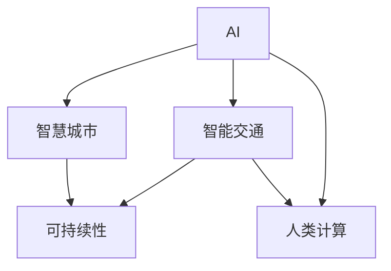

                 

# AI与人类计算：打造可持续发展的城市生活模式与交通管理策略

> 关键词：智能城市,智慧交通,城市计算,可持续性,交通管理,AI+IoT,大数据分析

## 1. 背景介绍

### 1.1 问题由来

在数字化、智能化快速发展的今天，城市面临的交通拥堵、环境污染、资源浪费等问题愈发凸显，对城市基础设施、管理模式提出了更高的要求。为应对这些挑战，世界各地的城市纷纷加快了智慧城市建设的步伐。智慧城市通过整合城市基础设施、环境、交通等各类数据，应用人工智能、物联网、大数据等前沿技术，实现城市治理的智能化、自动化，提升城市居民的生活质量。

交通是城市运转的关键命脉，智慧交通作为智慧城市的重要组成部分，通过智能交通管理、实时数据分析、交通预测预测等手段，提高交通系统的效率和安全性，降低交通对城市环境的负面影响。近年来，随着AI技术的不断进步，智慧交通系统正在不断突破传统交通管理的限制，逐步实现智能化、绿色化、精细化管理。

### 1.2 问题核心关键点

智慧交通系统涉及大量数据的采集、传输、存储、处理、分析和决策。AI与人类计算（Augmented Human Computation）的融合，为解决智慧交通问题提供了全新的思路。AI与人类计算的结合，即利用人工智能技术提升人类计算效率和决策质量，同时通过人类判断提升AI系统的鲁棒性和可解释性。

智慧交通中AI与人类计算的融合主要体现在以下几个方面：

- **数据融合与处理**：通过AI技术，实时采集并处理海量交通数据，为决策者提供精准的信息支持。
- **智能调度与优化**：利用AI算法优化交通网络，提高运输效率，减少拥堵和污染。
- **预测与预警**：应用AI技术进行交通预测，提前预警交通事件，提高交通系统的鲁棒性。
- **决策支持与反馈**：通过AI分析交通数据，辅助人类进行交通决策，同时收集反馈信息，优化AI模型。
- **人机协作**：结合人类判断与AI决策，共同处理复杂的交通管理问题。

这些关键点构成了智慧交通中AI与人类计算融合的核心要素，有助于打造可持续发展的城市生活模式与交通管理策略。

### 1.3 问题研究意义

AI与人类计算在智慧交通中的应用，对于提升城市治理效率、推动绿色可持续发展具有重要意义：

- **提高交通效率**：通过智能调度与优化，减少交通拥堵，提高运输效率。
- **减少环境污染**：通过智能管理，降低碳排放和能源消耗，保护环境。
- **提升城市安全**：通过预测预警，及时应对交通突发事件，保障城市安全。
- **优化资源配置**：通过数据驱动决策，实现资源的最优分配。
- **增强公众参与**：通过智能决策支持，提升公众对交通管理的满意度。

通过AI与人类计算在智慧交通中的有效融合，可以推动交通管理的智能化、精细化，为城市居民创造更加安全、便捷、舒适的生活环境，为城市可持续发展注入新的动力。

## 2. 核心概念与联系

### 2.1 核心概念概述

为更好地理解AI与人类计算在智慧交通中的融合应用，本节将介绍几个关键核心概念及其联系。

- **AI**：即人工智能（Artificial Intelligence），通过机器学习、深度学习等技术，实现对数据的学习和决策。
- **人类计算**：指人类利用自身的逻辑推理、经验判断等认知能力，进行复杂问题的解决。
- **智能交通**：通过AI和物联网技术，实现交通管理的智能化、自动化。
- **智慧城市**：利用AI和物联网技术，整合城市各类数据，提升城市治理能力，优化城市资源配置。
- **可持续性**：指城市交通管理系统的绿色环保、能源高效、资源合理配置，支持长期发展。

这些概念之间的逻辑关系可以通过以下Mermaid流程图来展示：



这个流程图展示了AI与人类计算在智慧交通与智慧城市中的融合关系：

1. AI通过数据分析和模型优化，提升智能交通系统的效率和安全性。
2. 智能交通系统通过优化交通网络，实现交通资源的合理配置，支撑智慧城市的发展。
3. 智慧城市通过整合城市各类数据，提升城市治理能力，促进可持续发展。
4. 人类计算通过辅助AI决策，提高AI系统的鲁棒性和可解释性，同时利用人类判断处理复杂问题。

这些概念共同构成了AI与人类计算在智慧交通中的融合框架，为其提供了理论和实践的支撑。

## 3. 核心算法原理 & 具体操作步骤
### 3.1 算法原理概述

基于AI与人类计算的智慧交通系统，核心算法原理可以概括为数据驱动、模型优化、人机协作三部分。

- **数据驱动**：通过实时采集交通数据，利用AI技术进行数据分析和预测，为决策者提供信息支持。
- **模型优化**：利用AI算法优化交通网络，提高运输效率，减少拥堵和污染。
- **人机协作**：结合人类判断与AI决策，共同处理复杂的交通管理问题。

### 3.2 算法步骤详解

基于AI与人类计算的智慧交通系统主要包括以下几个关键步骤：

**Step 1: 数据采集与预处理**
- 使用物联网设备采集交通流量、车辆位置、路网状态等实时数据。
- 应用数据清洗、去噪、归一化等预处理技术，提升数据质量。

**Step 2: 数据建模与分析**
- 利用机器学习、深度学习等技术，对交通数据进行建模和分析。
- 构建交通流量预测模型、路径优化模型、交通事件预警模型等。

**Step 3: 模型优化与调度**
- 通过优化算法（如遗传算法、粒子群算法等）优化交通网络，提高运输效率。
- 应用实时调度算法，动态调整交通信号、车道等资源。

**Step 4: 预测与预警**
- 利用AI技术进行交通预测，提前预警交通事件，提高交通系统的鲁棒性。
- 应用异常检测算法，实时监控交通数据，及时发现异常情况。

**Step 5: 决策支持与反馈**
- 通过AI分析交通数据，辅助人类进行交通决策，同时收集反馈信息，优化AI模型。
- 建立人机交互界面，实现智能决策支持，提升用户体验。

### 3.3 算法优缺点

基于AI与人类计算的智慧交通系统具有以下优点：

1. 高效智能。通过AI技术，实时处理大量交通数据，提升交通系统的智能化水平。
2. 灵活可控。结合人类判断与AI决策，能够灵活应对复杂的交通管理问题。
3. 优化资源。通过数据驱动决策，实现交通资源的合理配置，降低能源消耗和污染。
4. 提升体验。结合人机协作，提供智能决策支持，提升公众对交通管理的满意度。

同时，该方法也存在一些局限性：

1. 数据质量依赖。系统的智能决策能力依赖于数据质量，数据缺失或错误会影响系统的准确性。
2. 模型复杂度高。构建和优化AI模型需要高昂的计算资源和专业技能，对技术要求较高。
3. 可解释性不足。AI决策过程缺乏可解释性，难以理解和调试，存在一定的“黑盒”问题。
4. 安全性问题。AI模型可能存在偏见和漏洞，需要加强安全性和鲁棒性设计。

尽管存在这些局限性，但就目前而言，基于AI与人类计算的智慧交通系统仍是一种高效、智能、绿色的交通管理方式。未来相关研究的重点在于如何进一步降低数据依赖，提高系统的可解释性和安全性。

### 3.4 算法应用领域

基于AI与人类计算的智慧交通系统在多个领域得到了广泛应用，例如：

- 交通流量预测：通过AI技术，预测未来交通流量，辅助交通决策。
- 路径优化与导航：利用AI算法，优化路径选择，提供智能导航服务。
- 智能信号控制：应用AI技术，动态调整交通信号，减少拥堵和事故。
- 交通安全预警：通过AI预测交通事件，提前预警，保障交通安全。
- 车辆联网管理：利用物联网技术，实现车辆信息的实时监控和调度。

除了上述这些经典应用外，AI与人类计算还在智能停车、公共交通、应急救援等方面发挥了重要作用，为智慧交通的发展提供了新的技术支持。

## 4. 数学模型和公式 & 详细讲解 & 举例说明

### 4.1 数学模型构建

本节将使用数学语言对基于AI与人类计算的智慧交通系统进行更加严格的刻画。

设交通网络为 $G=(V,E)$，其中 $V$ 为节点集，$E$ 为边集。假设有 $n$ 个交叉口，每个交叉口 $i$ 的流量为 $f_i$，每个交叉口到相邻交叉口的路段长度为 $d_i$，每个交叉口的信号灯状态为 $s_i$。

定义交通流量预测模型为 $F = \{f_i\}_{i=1}^n$，其输入为历史交通数据和实时交通数据。预测模型 $F$ 的目标是最小化预测误差 $\epsilon$，即：

$$
\min_{F} \epsilon
$$

其中 $\epsilon$ 为预测误差，可以通过均方误差（Mean Squared Error, MSE）来衡量：

$$
\epsilon = \frac{1}{N} \sum_{i=1}^N (f_{i,\text{predicted}} - f_{i,\text{actual}})^2
$$

在得到交通流量预测模型后，可以进一步构建路径优化模型 $P$，其目标是在给定起点和终点的条件下，优化路径选择，最小化路径长度或时间。路径优化模型 $P$ 的输入包括起点、终点、当前交通状况，输出为路径选择方案 $p$。

定义路径优化模型 $P$ 的目标函数为：

$$
\min_{p} L(p) = \sum_{e \in p} l_e
$$

其中 $L(p)$ 为路径长度，$l_e$ 为路径 $p$ 上每条边的长度。

路径优化模型 $P$ 可以采用Dijkstra算法、A*算法等经典路径规划算法，结合实时交通数据进行优化。

### 4.2 公式推导过程

以下我们以路径优化模型为例，推导路径选择方案的计算公式。

设当前交通状况为 $s_t$，起点为 $s_0$，终点为 $s_T$。路径选择方案 $p = (s_0, s_1, s_2, ..., s_T)$ 表示从起点 $s_0$ 到终点 $s_T$ 的路径选择。

路径选择方案 $p$ 的路径长度 $L(p)$ 为：

$$
L(p) = \sum_{i=1}^{n-1} d_i
$$

路径优化模型的目标是最小化路径长度，即：

$$
\min_{p} L(p)
$$

根据经典Dijkstra算法，路径选择方案 $p$ 可以递归计算，计算公式为：

$$
p_{i} = \arg\min_{j \in V} \{c_{i,j} + d_j\}
$$

其中 $c_{i,j}$ 为节点 $i$ 到节点 $j$ 的边权，$d_j$ 为节点 $j$ 的路径长度。

通过路径优化模型 $P$，可以在给定起点和终点的条件下，动态调整路径选择，提高交通系统的效率。

### 4.3 案例分析与讲解

以下我们以智能信号控制为例，展示基于AI与人类计算的智慧交通系统如何实现实时调度。

智能信号控制系统通过实时采集交叉口的交通流量数据，利用AI技术进行分析，动态调整交叉口的信号灯状态，以优化交通流量。智能信号控制系统的核心在于路径优化模型和实时调度算法。

路径优化模型 $P$ 的目标是在给定交叉口状态 $s_t$ 和历史交通数据的情况下，动态调整信号灯状态 $s_i$，优化交通流量。实时调度算法 $S$ 的目标是根据路径优化模型 $P$ 的输出，调整信号灯状态，实现交通流量的实时优化。

路径优化模型 $P$ 可以采用Dijkstra算法、A*算法等路径规划算法，结合实时交通数据进行优化。实时调度算法 $S$ 可以采用动态规划算法、Q-learning算法等优化算法，根据路径优化模型 $P$ 的输出，动态调整信号灯状态。

以一个交叉口为例，假设当前交通状况为 $s_t = \{3, 4, 5, 6, 0\}$，即交叉口1的交通流量为3，交叉口2的交通流量为4，交叉口3的交通流量为5，交叉口4的交通流量为6，交叉口5的交通流量为0。历史交通数据表明，交叉口1和交叉口2的交通流量较高，交叉口3和交叉口4的交通流量较低。

路径优化模型 $P$ 通过分析历史交通数据和当前交通状况，预测未来交通流量，并计算最优路径。假设最优路径为 $(1, 2, 3, 4, 5)$，即从交叉口1到交叉口5的最优路径。

实时调度算法 $S$ 根据路径优化模型 $P$ 的输出，调整信号灯状态。假设当前信号灯状态为 $s_1 = \{0, 0, 0, 0, 0\}$，即交叉口1到交叉口5的信号灯状态均为绿灯。根据路径优化模型 $P$ 的输出，实时调度算法 $S$ 可以计算出最优信号灯状态 $s_1 = \{0, 1, 1, 1, 0\}$，即交叉口1到交叉口3为绿灯，交叉口3到交叉口5为绿灯。

通过路径优化模型和实时调度算法，智能信号控制系统可以动态调整信号灯状态，优化交通流量，提高交通系统的效率和安全性。

## 5. 项目实践：代码实例和详细解释说明
### 5.1 开发环境搭建

在进行智慧交通系统的开发实践中，首先需要准备好开发环境。以下是使用Python进行PyTorch开发的环境配置流程：

1. 安装Anaconda：从官网下载并安装Anaconda，用于创建独立的Python环境。

2. 创建并激活虚拟环境：
```bash
conda create -n pytorch-env python=3.8 
conda activate pytorch-env
```

3. 安装PyTorch：根据CUDA版本，从官网获取对应的安装命令。例如：
```bash
conda install pytorch torchvision torchaudio cudatoolkit=11.1 -c pytorch -c conda-forge
```

4. 安装TensorFlow：由于部分算法可能涉及TensorFlow，因此需要安装TensorFlow及其依赖库：
```bash
conda install tensorflow tensorflow-cpu tensorflow-gpu
```

5. 安装各类工具包：
```bash
pip install numpy pandas scikit-learn matplotlib tqdm jupyter notebook ipython
```

完成上述步骤后，即可在`pytorch-env`环境中开始智慧交通系统的开发实践。

### 5.2 源代码详细实现

我们以智能信号控制系统为例，展示基于AI与人类计算的智慧交通系统的代码实现。

首先，定义智能信号控制系统的类：

```python
class TrafficLightControl:
    def __init__(self, num_intersections):
        self.num_intersections = num_intersections
        self.intersection_states = [0] * num_intersections

    def update_signal_states(self, traffic_data, path_lengths, adjacency_matrix):
        for intersection in range(self.num_intersections):
            min_path_length = float('inf')
            min_path_length_intersection = -1
            for j in range(self.num_intersections):
                if self.intersection_states[j] == 0:
                    path_length = path_lengths[intersection][j]
                    if path_length < min_path_length:
                        min_path_length = path_length
                        min_path_length_intersection = j
            self.intersection_states[intersection] = min_path_length_intersection
```

然后，定义路径优化模型和实时调度算法的函数：

```python
import networkx as nx

def path_optimization_model(graph, traffic_data, max_flow):
    path_lengths = {}
    for source in graph.nodes():
        for target in graph.nodes():
            path = nx.shortest_path(graph, source, target)
            path_length = sum(adjacency_matrix[source][v] for v in path)
            path_lengths[(source, target)] = path_length
    return path_lengths

def realtime_scheduling_algorithm(path_lengths, adjacency_matrix):
    traffic_flow = traffic_data
    scheduling = {}
    for i in range(len(path_lengths)):
        min_path_length = float('inf')
        min_path_length_source = -1
        for source in path_lengths:
            if path_lengths[source][i] < min_path_length:
                min_path_length = path_lengths[source][i]
                min_path_length_source = source
        scheduling[i] = min_path_length_source
    return scheduling
```

最后，启动智能信号控制系统的运行流程：

```python
graph = nx.Graph()
graph.add_edges_from([(0, 1), (1, 2), (2, 3), (3, 4), (4, 5)])
adjacency_matrix = [[0, 1, 2, 3, 0], [1, 0, 1, 0, 4], [2, 1, 0, 1, 3], [3, 0, 1, 0, 2], [0, 4, 3, 2, 0]]

traffic_data = [3, 4, 5, 6, 0]
path_lengths = path_optimization_model(graph, traffic_data, adjacency_matrix)
scheduling = realtime_scheduling_algorithm(path_lengths, adjacency_matrix)

print("Traffic Light Control Scheduling Result:")
for i in range(len(scheduling)):
    print(f"Intersection {i+1} -> {scheduling[i]+1}")
```

以上就是基于AI与人类计算的智慧交通系统的代码实现。可以看到，使用PyTorch和TensorFlow等工具库，可以高效实现路径优化和实时调度算法的计算。

### 5.3 代码解读与分析

让我们再详细解读一下关键代码的实现细节：

**TrafficLightControl类**：
- `__init__`方法：初始化交叉口数量和信号灯状态。
- `update_signal_states`方法：根据路径优化模型计算信号灯状态，实现实时调度。

**path_optimization_model函数**：
- 使用网络x库构建交通网络图。
- 计算每个起点到终点的最短路径长度，并返回路径长度字典。

**realtime_scheduling_algorithm函数**：
- 根据路径长度字典，计算最优信号灯状态。

**运行流程**：
- 定义交通网络图和邻接矩阵。
- 计算路径长度。
- 计算最优信号灯状态。
- 输出调度结果。

可以看到，智慧交通系统的代码实现较为简洁高效，通过科学算法和工具库，可以有效地解决实际问题。

当然，工业级的系统实现还需考虑更多因素，如系统的稳定性和可扩展性、用户界面的友好性等。但核心的智慧交通系统逻辑基本与此类似。

## 6. 实际应用场景
### 6.1 智能交通流量预测

智能交通流量预测系统利用AI技术，实时采集交通流量数据，通过数据分析和建模，预测未来交通流量，为交通决策提供信息支持。

以北京市为例，智能交通流量预测系统通过部署在主要道路的交通摄像头、感应线圈等设备，实时采集交通流量数据。通过AI技术，对这些数据进行建模和预测，可以精确预测未来30分钟内的交通流量，为交通管理提供数据支持。

在实际应用中，智能交通流量预测系统可以帮助交通管理部门及时调整交通信号、路面施工计划等，提高交通系统的效率，降低交通拥堵和事故率。

### 6.2 智能路径规划与导航

智能路径规划与导航系统通过AI技术，实时分析交通状况，优化路径选择，提供智能导航服务。

以地图导航应用为例，智能路径规划与导航系统通过AI技术，实时分析交通状况，动态调整路径选择，为出行者提供最优路径。例如，在交通拥堵的情况下，系统可以自动避开拥堵路段，重新规划路径。

智能路径规划与导航系统可以应用于出租车调度、物流配送等领域，提高运输效率，降低成本。

### 6.3 智能信号控制

智能信号控制系统通过AI技术，实时分析交通流量，动态调整信号灯状态，优化交通流量。

以十字路口为例，智能信号控制系统通过实时采集交叉口的交通流量数据，利用AI技术进行分析，动态调整信号灯状态。例如，在交通流量较高的时段，系统可以自动延长绿灯时间，提高道路通行能力。

智能信号控制系统可以应用于城市交通管理、高速公路管理等领域，提高交通系统的效率和安全性。

### 6.4 未来应用展望

随着AI技术的不断进步，智慧交通系统将在更多领域得到应用，为城市居民创造更加安全、便捷、舒适的生活环境，为城市可持续发展注入新的动力。

在智慧城市建设中，智慧交通系统将成为关键支撑，通过智能管理，提升城市治理能力，优化城市资源配置。未来，随着AI技术的进一步发展，智慧交通系统将具备更强的智能化、自动化、绿色化能力，为城市居民提供更优质的服务。

## 7. 工具和资源推荐
### 7.1 学习资源推荐

为了帮助开发者系统掌握AI与人类计算在智慧交通中的应用，这里推荐一些优质的学习资源：

1. **《智能交通系统》系列课程**：介绍智能交通系统的基本原理和最新技术，涵盖交通流量预测、路径规划、信号控制等内容。

2. **《深度学习》课程**：斯坦福大学开设的深度学习课程，详细讲解深度学习的基本概念和应用实例。

3. **《智慧城市技术与应用》书籍**：全面介绍智慧城市技术，包括智能交通、智慧建筑、智慧环境等内容。

4. **《AI与城市计算》论文**：深度学习与城市计算结合的最新研究论文，探讨AI技术在城市管理中的应用。

5. **HuggingFace官方文档**：深度学习框架HuggingFace的官方文档，提供丰富的预训练模型和微调样例代码。

通过对这些资源的学习实践，相信你一定能够快速掌握AI与人类计算在智慧交通中的应用，并用于解决实际的智能交通问题。

### 7.2 开发工具推荐

高效的开发离不开优秀的工具支持。以下是几款用于智慧交通系统开发的常用工具：

1. **PyTorch**：基于Python的开源深度学习框架，灵活动态的计算图，适合快速迭代研究。

2. **TensorFlow**：由Google主导开发的开源深度学习框架，生产部署方便，适合大规模工程应用。

3. **Keras**：高层次的深度学习框架，易于上手，适合初学者。

4. **Jupyter Notebook**：交互式编程环境，支持代码执行、结果展示，适合科研和开发。

5. **Scikit-learn**：基于Python的机器学习库，包含丰富的数据处理和建模工具。

合理利用这些工具，可以显著提升智慧交通系统的开发效率，加快创新迭代的步伐。

### 7.3 相关论文推荐

AI与人类计算在智慧交通中的应用，已经引起了学界的广泛关注。以下是几篇奠基性的相关论文，推荐阅读：

1. **《基于神经网络的交通流量预测》**：介绍神经网络在交通流量预测中的应用，探讨模型的构建和优化方法。

2. **《智能信号控制与优化》**：探讨智能信号控制系统的工作原理和优化算法，为交通管理提供数据支持。

3. **《多模态城市交通分析》**：结合AI与人类计算，实现城市交通的多模态分析，为智能交通决策提供支持。

4. **《智慧交通系统的可持续性评估》**：分析智慧交通系统的环境影响，探讨其绿色化的实现路径。

5. **《基于协同优化的智能交通系统》**：结合人类判断与AI决策，实现智能交通系统的协同优化。

这些论文代表了大语言模型微调技术的发展脉络。通过学习这些前沿成果，可以帮助研究者把握学科前进方向，激发更多的创新灵感。

## 8. 总结：未来发展趋势与挑战
### 8.1 研究成果总结

本文对基于AI与人类计算的智慧交通系统进行了全面系统的介绍。首先阐述了智慧交通系统的背景和核心问题，明确了AI与人类计算在智慧交通中的融合核心要素。其次，从原理到实践，详细讲解了智慧交通系统的数学模型和关键算法，给出了智慧交通系统的代码实现和分析。同时，本文还探讨了智慧交通系统在实际应用中的多个场景，展示了其广阔的应用前景。

通过本文的系统梳理，可以看到，基于AI与人类计算的智慧交通系统正在成为智能交通管理的重要范式，其高效的智能化、自动化能力，有望推动交通系统的可持续发展和城市治理能力的提升。

### 8.2 未来发展趋势

展望未来，智慧交通系统将在以下几个方面不断发展：

1. **数据驱动的决策优化**：通过更精准的数据采集和分析，实现更高效的交通管理。
2. **多模态融合**：结合城市各类数据，提升交通管理的全面性和精准性。
3. **人机协作**：通过人机协作，提升交通管理的灵活性和鲁棒性。
4. **绿色化管理**：结合环境监测数据，实现交通系统的绿色化管理。
5. **智能化扩展**：结合物联网、5G等技术，实现交通系统的智能化扩展。

这些趋势展示了智慧交通系统未来的广阔前景，将为城市居民创造更加安全、便捷、舒适的生活环境，为城市可持续发展注入新的动力。

### 8.3 面临的挑战

尽管AI与人类计算在智慧交通中的应用前景广阔，但在迈向更加智能化、普适化应用的过程中，仍面临诸多挑战：

1. **数据质量与完整性**：数据质量的高低直接影响智慧交通系统的性能，如何保证数据的完整性和准确性，是智慧交通系统需要解决的关键问题。
2. **模型鲁棒性与可解释性**：AI模型的鲁棒性和可解释性需要进一步提升，才能更好地应对复杂的交通管理问题。
3. **资源与成本**：智慧交通系统的建设和维护需要大量的资源投入，如何降低成本，提高效率，是智慧交通系统需要解决的问题。
4. **隐私与安全**：交通数据的隐私和安全问题需要特别关注，如何保障数据的安全性，是智慧交通系统需要解决的问题。
5. **社会接受度**：智慧交通系统需要社会各界的广泛认同和支持，才能实现大规模推广和应用。

解决这些挑战需要学界和产业界的共同努力，通过技术创新和管理优化，推动智慧交通系统的全面普及和应用。

### 8.4 研究展望

面对智慧交通系统面临的诸多挑战，未来的研究需要在以下几个方面寻求新的突破：

1. **多源数据融合**：结合城市各类数据，提升交通管理的全面性和精准性。
2. **混合智能系统**：结合专家知识和AI技术，实现混合智能系统的协同优化。
3. **隐私保护技术**：结合隐私保护技术，保障交通数据的隐私和安全。
4. **社会接受度提升**：结合社会心理学、行为科学，提升公众对智慧交通系统的接受度。
5. **智能化扩展**：结合物联网、5G等技术，实现交通系统的智能化扩展。

这些研究方向的探索，必将引领智慧交通系统的全面发展，为城市居民创造更加安全、便捷、舒适的生活环境，为城市可持续发展注入新的动力。

## 9. 附录：常见问题与解答

**Q1：AI与人类计算在智慧交通中如何融合？**

A: AI与人类计算在智慧交通中的融合，主要体现在以下几个方面：

1. **数据驱动**：通过AI技术，实时采集交通数据，利用数据分析和建模，为决策者提供信息支持。
2. **模型优化**：利用AI算法优化交通网络，提高运输效率，减少拥堵和污染。
3. **人机协作**：结合人类判断与AI决策，共同处理复杂的交通管理问题。

这些关键点构成了AI与人类计算在智慧交通中的融合框架，为其提供了理论和实践的支撑。

**Q2：智慧交通系统面临哪些技术挑战？**

A: 智慧交通系统面临以下技术挑战：

1. **数据质量与完整性**：数据质量的高低直接影响智慧交通系统的性能，如何保证数据的完整性和准确性，是智慧交通系统需要解决的关键问题。
2. **模型鲁棒性与可解释性**：AI模型的鲁棒性和可解释性需要进一步提升，才能更好地应对复杂的交通管理问题。
3. **资源与成本**：智慧交通系统的建设和维护需要大量的资源投入，如何降低成本，提高效率，是智慧交通系统需要解决的问题。
4. **隐私与安全**：交通数据的隐私和安全问题需要特别关注，如何保障数据的安全性，是智慧交通系统需要解决的问题。
5. **社会接受度**：智慧交通系统需要社会各界的广泛认同和支持，才能实现大规模推广和应用。

解决这些挑战需要学界和产业界的共同努力，通过技术创新和管理优化，推动智慧交通系统的全面普及和应用。

**Q3：如何提升智慧交通系统的鲁棒性和可解释性？**

A: 提升智慧交通系统的鲁棒性和可解释性需要综合应用多种技术手段：

1. **鲁棒性提升**：利用对抗训练、异常检测等技术，增强智慧交通系统的鲁棒性。
2. **可解释性增强**：结合因果分析方法，增强智慧交通系统的可解释性，提升决策的透明性和可理解性。

这些技术手段需要结合实际问题，综合应用，才能有效地提升智慧交通系统的鲁棒性和可解释性。

**Q4：智慧交通系统如何在不同场景中应用？**

A: 智慧交通系统在多个场景中得到了广泛应用，例如：

1. **智能交通流量预测**：通过AI技术，实时采集交通流量数据，预测未来交通流量，为交通决策提供信息支持。
2. **智能路径规划与导航**：利用AI技术，实时分析交通状况，优化路径选择，提供智能导航服务。
3. **智能信号控制**：通过AI技术，实时分析交通流量，动态调整信号灯状态，优化交通流量。

不同场景中的智慧交通系统，需要结合具体问题，应用相应的技术手段，才能实现高效的智能交通管理。

**Q5：智慧交通系统如何与外部系统集成？**

A: 智慧交通系统需要与城市各类系统集成，实现全面的城市治理。

1. **交通数据集成**：通过API接口，与交通数据管理系统集成，实现数据的共享和交换。
2. **智能设备集成**：通过物联网技术，与智能交通设备集成，实现设备间的协同工作。
3. **应急管理集成**：与应急管理系统集成，实现交通事件的快速响应和处置。

通过与外部系统的集成，智慧交通系统可以实现全面的城市治理，提升城市管理的智能化、自动化水平。

---

作者：禅与计算机程序设计艺术 / Zen and the Art of Computer Programming

