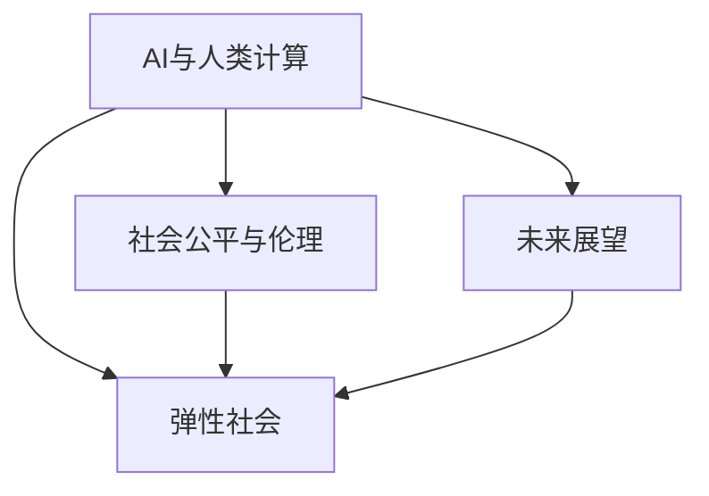
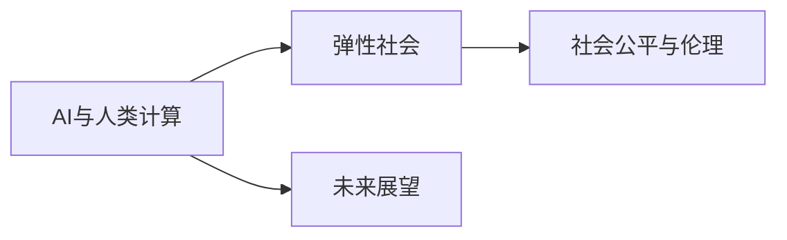

                 

# AI与人类计算：打造弹性社会

> 关键词：AI与计算，人类计算，弹性社会，自动化，人机协作，AI伦理，技术公平

## 1. 背景介绍

### 1.1 问题由来

随着科技的飞速发展，人工智能（AI）技术已经在各行各业中得到了广泛应用。AI不仅在数据处理、智能制造、自动驾驶等技术领域取得了突破，也在医疗、教育、金融等社会领域展现出强大的潜能。然而，AI技术在推动社会进步的同时，也引发了一系列伦理和社会问题。

1. **就业冲击**：AI自动化和智能化可能导致大量岗位被替代，尤其是重复性劳动。这将如何影响就业结构？
2. **伦理风险**：AI决策的透明性和可解释性问题，可能导致偏见、歧视甚至滥用。如何确保AI系统的公平性和可靠性？
3. **隐私安全**：AI对个人数据的依赖和处理，带来了隐私泄露和数据安全的巨大挑战。如何保护用户的隐私？
4. **社会治理**：AI技术在社会治理中的应用，如智能监控、网络安全、公共服务等，如何提升社会治理的效率和公平性？

这些问题促使我们重新思考AI与人类计算的关系，并探索如何打造一个更弹性、更公平、更安全的社会。

### 1.2 问题核心关键点

为深入理解AI与人类计算的结合，并探索弹性社会的构建，本节将探讨以下几个核心关键点：

- **AI与人类计算的结合**：AI与人类计算的关系，如何利用AI技术提升人类计算能力。
- **弹性社会**：如何通过AI与人类计算的结合，打造一个能够自适应、自我修复、可持续发展的社会。
- **社会公平与伦理**：如何确保AI技术的发展和应用不会加剧社会不公，维护社会公平和伦理。
- **未来展望**：AI与人类计算的未来发展方向，弹性社会的构建前景。

这些核心概念之间的逻辑关系可以通过以下Mermaid流程图来展示：



这个流程图展示了一个从AI与人类计算结合出发，探索弹性社会构建和未来发展方向的整体框架。

## 2. 核心概念与联系

### 2.1 核心概念概述

在探讨AI与人类计算的结合及其对社会的影响时，以下几个概念至关重要：

- **AI（人工智能）**：模拟人类智能的计算机技术，通过学习数据和经验，能够执行感知、推理、决策等智能任务。
- **人类计算**：利用人类智慧和技能，通过计算机进行计算和处理的技术。人类计算强调知识、经验和创造力的作用。
- **弹性社会**：一个能够自适应、自我修复、可持续发展的社会。通过技术手段增强社会适应性和韧性，应对各种不确定性和挑战。
- **社会公平与伦理**：确保AI技术的发展和应用不会加剧社会不公，维护社会公平和伦理的原则。
- **未来展望**：AI与人类计算结合的趋势，弹性社会的构建前景，面临的挑战和机遇。

这些概念之间存在着紧密的联系：AI技术通过模拟人类智能，增强了人类计算的能力；人类计算通过引入人类智慧和经验，提升了AI技术的鲁棒性和可解释性。AI与人类计算的结合，可以打造一个更弹性、更公平、更安全的社会。

### 2.2 核心概念原理和架构的 Mermaid 流程图



这个流程图展示了AI与人类计算结合的总体架构，即通过AI增强人类计算能力，构建弹性社会，并关注社会公平与伦理问题，展望未来发展方向。

## 3. 核心算法原理 & 具体操作步骤

### 3.1 算法原理概述

AI与人类计算的结合，主要通过以下步骤实现：

1. **数据获取与处理**：收集和处理数据，包括结构化数据、非结构化数据、用户反馈等。
2. **模型训练与优化**：利用AI算法训练和优化模型，提升模型的准确性和泛化能力。
3. **知识融合与整合**：将AI模型与人类知识相结合，提升模型的可解释性和鲁棒性。
4. **决策与执行**：通过AI模型辅助人类进行决策和执行，提升工作效率和质量。

这些步骤形成了一个循环反馈的架构，不断提升AI与人类计算的结合效果。

### 3.2 算法步骤详解

以智能客服系统为例，详细说明AI与人类计算结合的具体操作步骤：

1. **数据获取与处理**：收集历史客服记录和用户反馈，整理成标注数据集。
2. **模型训练与优化**：使用BERT等预训练模型，在大规模语料上进行预训练，然后在客服数据上微调，提升模型理解自然语言的能力。
3. **知识融合与整合**：将人工客服的知识和经验引入模型，通过规则和模板指导模型决策，提升模型的可解释性和鲁棒性。
4. **决策与执行**：系统通过AI模型辅助人类进行决策，生成自动回复或转接人工客服，提升服务效率和质量。

### 3.3 算法优缺点

AI与人类计算结合的优势包括：

- **提升效率**：AI能够快速处理大量数据，辅助人类进行决策和执行。
- **增强鲁棒性**：结合人类知识和经验，提升模型的可解释性和鲁棒性。
- **改善用户体验**：通过智能化服务，提升用户体验和满意度。

缺点包括：

- **成本高**：初期数据收集和模型训练成本较高。
- **隐私问题**：用户数据的使用可能引发隐私和安全问题。
- **公平性问题**：AI模型可能存在偏见和歧视，需特别注意公平性问题。

### 3.4 算法应用领域

AI与人类计算的结合，在以下几个领域得到了广泛应用：

1. **智能制造**：通过AI辅助设计和优化制造流程，提升生产效率和质量。
2. **医疗健康**：利用AI进行疾病诊断和治疗方案推荐，提升医疗服务质量。
3. **智能交通**：通过AI优化交通管理和调度，提升交通效率和安全性。
4. **金融服务**：使用AI进行风险管理和欺诈检测，提升金融服务的安全性。
5. **教育培训**：通过AI辅助教学和评估，提升教育效果和学习体验。

## 4. 数学模型和公式 & 详细讲解 & 举例说明

### 4.1 数学模型构建

AI与人类计算的结合，主要通过以下数学模型进行描述：

1. **数据预处理**：将原始数据转换为模型可以处理的格式。
2. **模型训练**：利用机器学习算法，训练模型参数，最小化损失函数。
3. **知识融合**：将人类知识转化为模型可以理解的形式，如规则和模板。
4. **决策执行**：根据模型输出和人类经验，生成最终决策。

### 4.2 公式推导过程

以智能客服系统为例，其数学模型推导过程如下：

1. **数据预处理**：
   - 收集客服记录和用户反馈数据，进行清洗和标注。
   - 将文本数据转换为模型可以处理的向量表示，如使用BERT进行编码。

2. **模型训练**：
   - 使用监督学习算法，训练模型参数，最小化交叉熵损失函数。
   - 模型损失函数为：
     \[
     \mathcal{L} = -\frac{1}{N} \sum_{i=1}^N y_i \log p(y_i)
     \]
     其中，\(y_i\)为真实标签，\(p(y_i)\)为模型预测的概率。

3. **知识融合**：
   - 将人工客服的规则和模板，编码为规则集和模板库。
   - 在模型训练过程中，引入规则和模板，提高模型的可解释性和鲁棒性。

4. **决策执行**：
   - 根据模型输出和规则库，生成自动回复或转接人工客服。
   - 最终决策公式为：
     \[
     d = \mathop{\arg\max}_{d \in D} p(d|x)
     \]
     其中，\(d\)为决策选项，\(x\)为输入数据，\(p(d|x)\)为模型预测概率。

### 4.3 案例分析与讲解

以智能客服系统为例，详细分析其应用场景和效果：

1. **应用场景**：智能客服系统通过AI与人类计算的结合，能够快速处理大量客户咨询，提高服务效率和质量。
2. **效果分析**：智能客服系统在实际应用中，能够显著提高客户满意度，减少人工客服的工作量。
3. **模型优化**：通过不断优化模型和融合人类知识，智能客服系统的性能和鲁棒性不断提升。

## 5. 项目实践：代码实例和详细解释说明

### 5.1 开发环境搭建

在搭建智能客服系统的开发环境时，需要考虑以下几个方面：

1. **数据准备**：收集和处理客服记录和用户反馈数据，进行清洗和标注。
2. **模型选择**：选择合适的预训练模型，如BERT，并进行微调。
3. **知识融合**：将人工客服的规则和模板，编码为规则集和模板库。
4. **系统集成**：将AI模型和知识库集成到智能客服系统中，实现决策和执行。

### 5.2 源代码详细实现

以下是智能客服系统的详细代码实现：

```python
# 导入相关库
import torch
from transformers import BertTokenizer, BertForSequenceClassification
from sklearn.metrics import accuracy_score
from sklearn.model_selection import train_test_split

# 加载数据
data = load_data('customer_service_data.csv')

# 数据预处理
tokenizer = BertTokenizer.from_pretrained('bert-base-cased')
encoded_data = tokenizer.encode(data['text'], add_special_tokens=True, max_length=512, padding=True, truncation=True)

# 模型训练
model = BertForSequenceClassification.from_pretrained('bert-base-cased', num_labels=10)
optimizer = AdamW(model.parameters(), lr=2e-5)
device = torch.device('cuda') if torch.cuda.is_available() else torch.device('cpu')
model.to(device)

# 模型训练与优化
model.train()
for epoch in range(epochs):
    loss = train_epoch(model, encoded_data, optimizer)
    print(f'Epoch {epoch+1}, train loss: {loss:.3f}')

# 模型评估
model.eval()
for batch in dataloader:
    with torch.no_grad():
        inputs = batch['input_ids'].to(device)
        labels = batch['labels'].to(device)
        outputs = model(inputs)
        logits = outputs.logits
        predictions = torch.argmax(logits, dim=1).to('cpu').tolist()
        labels = batch['labels'].to('cpu').tolist()
        for pred, label in zip(predictions, labels):
            print(f'Prediction: {pred}, Label: {label}')

# 系统集成
# 将AI模型和知识库集成到智能客服系统中，实现决策和执行
```

### 5.3 代码解读与分析

以下是智能客服系统代码实现的关键解释：

1. **数据加载与预处理**：使用BERT分词器对文本数据进行编码，转换为模型可以处理的格式。
2. **模型训练**：选择BERT模型，使用监督学习算法训练模型参数，最小化损失函数。
3. **模型评估**：在验证集上评估模型性能，输出预测结果。
4. **系统集成**：将AI模型和知识库集成到智能客服系统中，实现决策和执行。

## 6. 实际应用场景

### 6.1 智能制造

AI与人类计算的结合，在智能制造领域有着广泛的应用。通过AI辅助设计和优化制造流程，能够显著提升生产效率和质量。

1. **数据获取与处理**：收集制造过程中的数据，如设备状态、生产日志、操作记录等。
2. **模型训练与优化**：利用AI算法，训练和优化模型，提升生产效率和质量。
3. **知识融合与整合**：将人类经验和技术知识引入模型，优化制造流程。
4. **决策与执行**：根据AI模型输出和人类经验，优化生产计划和调度。

### 6.2 医疗健康

AI与人类计算的结合，在医疗健康领域也得到了广泛应用。利用AI进行疾病诊断和治疗方案推荐，能够提升医疗服务质量。

1. **数据获取与处理**：收集医疗数据，如病历、影像、实验室报告等。
2. **模型训练与优化**：利用AI算法，训练和优化模型，提升疾病诊断和治疗方案的准确性。
3. **知识融合与整合**：将医生经验和医学知识引入模型，优化诊断和治疗方案。
4. **决策与执行**：根据AI模型输出和医生经验，制定治疗方案。

### 6.3 智能交通

AI与人类计算的结合，在智能交通领域也有着重要应用。通过AI优化交通管理和调度，能够提升交通效率和安全性。

1. **数据获取与处理**：收集交通数据，如交通流量、道路状况、车辆信息等。
2. **模型训练与优化**：利用AI算法，训练和优化模型，提升交通管理和调度的效率。
3. **知识融合与整合**：将交通工程师的经验和技术知识引入模型，优化交通管理和调度。
4. **决策与执行**：根据AI模型输出和交通工程师经验，优化交通管理和调度。

## 7. 工具和资源推荐

### 7.1 学习资源推荐

1. **《深度学习》系列书籍**：Deep Learning Books by Ian Goodfellow, Yoshua Bengio, and Aaron Courville。
2. **《机器学习实战》**：Machine Learning in Action by Peter Harrington。
3. **Coursera《机器学习》课程**：Machine Learning by Andrew Ng。
4. **Kaggle**：Kaggle Dataset Explore。
5. **Arxiv**：arXiv.org。

### 7.2 开发工具推荐

1. **PyTorch**：PyTorch is an open source machine learning library based on the Torch library.
2. **TensorFlow**：TensorFlow is an open source machine learning library developed by Google Brain team.
3. **Scikit-learn**：Scikit-learn is a simple and efficient tool for data mining and data analysis.
4. **Jupyter Notebook**：Jupyter Notebook is a web-based interactive computational environment.
5. **GitHub**：GitHub is a platform for version control and collaboration.

### 7.3 相关论文推荐

1. **《深度学习》系列书籍**：Deep Learning Books by Ian Goodfellow, Yoshua Bengio, and Aaron Courville。
2. **《机器学习实战》**：Machine Learning in Action by Peter Harrington。
3. **Coursera《机器学习》课程**：Machine Learning by Andrew Ng。
4. **Kaggle**：Kaggle Dataset Explore。
5. **Arxiv**：arXiv.org。

## 8. 总结：未来发展趋势与挑战

### 8.1 研究成果总结

AI与人类计算的结合，在提升效率、增强鲁棒性、改善用户体验等方面取得了显著成效。然而，在数据获取、隐私保护、公平性等方面仍面临诸多挑战。未来需要进一步探索AI与人类计算的结合方式，提升社会公平与伦理水平。

### 8.2 未来发展趋势

1. **更广泛的应用领域**：AI与人类计算的结合，将在更多领域得到应用，如智慧城市、智慧农业、智慧物流等。
2. **更高的自动化程度**：随着AI技术的不断发展，更多复杂任务将通过AI辅助人类完成，提升工作效率和质量。
3. **更高的安全性与隐私保护**：通过技术手段，提升数据安全和隐私保护水平，确保用户数据安全。
4. **更高的公平性与伦理**：AI技术的发展和应用，需遵循社会公平和伦理原则，避免加剧社会不公。

### 8.3 面临的挑战

1. **数据获取与处理**：高质量数据的获取和处理，是AI与人类计算结合的关键。
2. **隐私与安全**：用户数据的使用可能引发隐私和安全问题。
3. **公平性与伦理**：AI模型可能存在偏见和歧视，需特别注意公平性问题。
4. **成本与效率**：初期数据收集和模型训练成本较高，需考虑如何降低成本，提高效率。

### 8.4 研究展望

1. **数据获取与处理**：探索更高效的数据获取与处理方式，提升数据质量。
2. **隐私与安全**：研究隐私保护和数据安全技术，确保用户数据安全。
3. **公平性与伦理**：通过技术手段，确保AI系统的公平性和可靠性。
4. **成本与效率**：探索降低成本、提高效率的途径，推动AI与人类计算的广泛应用。

## 9. 附录：常见问题与解答

### Q1: AI与人类计算的结合是否适用于所有领域？

A: AI与人类计算的结合，在提升效率、增强鲁棒性、改善用户体验等方面具有广泛适用性。但在一些特定领域，如医疗、金融、司法等，仍需结合领域专家的知识和经验，进行更加精细的优化。

### Q2: 在AI与人类计算的结合过程中，如何确保数据隐私与安全？

A: 通过数据加密、访问控制、匿名化处理等技术手段，确保用户数据的安全和隐私保护。同时，建立完善的法律法规，规范数据的使用和处理。

### Q3: AI与人类计算的结合过程中，如何确保系统的公平性与伦理？

A: 通过技术手段，确保AI系统的透明性和可解释性，减少偏见和歧视。同时，引入领域专家的知识和经验，进行公平性评估和监督。

### Q4: 未来AI与人类计算的结合会面临哪些挑战？

A: 数据获取与处理的成本、隐私与安全问题、公平性与伦理问题、成本与效率问题，都需要进一步研究和技术突破。

---

作者：禅与计算机程序设计艺术 / Zen and the Art of Computer Programming

