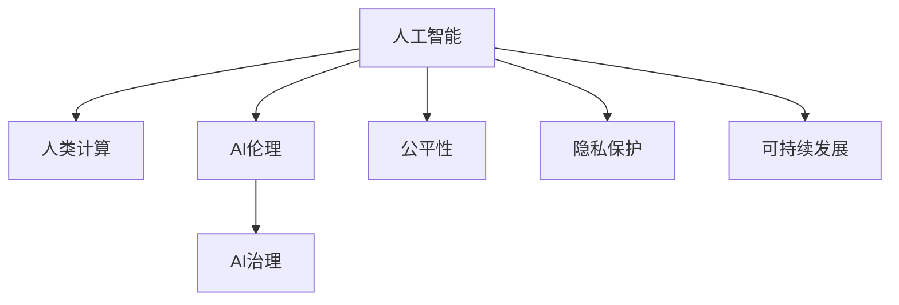

                 

# AI与人类计算：未来的道德考虑

> 关键词：人工智能(AI),人类计算,伦理道德,社会责任,技术治理,公平性,隐私保护,可持续发展

## 1. 背景介绍

### 1.1 问题由来

随着人工智能(AI)技术的快速发展，其在各个领域的广泛应用引发了公众的关注。AI的进步一方面带来了巨大的社会和经济效益，另一方面也带来了新的道德和社会问题。例如，AI系统的决策过程是否透明公正，AI的使用是否侵犯个人隐私，AI技术的普及是否会导致就业机会的减少，AI技术的滥用是否会导致伦理风险等。这些问题不仅关乎技术本身，也关乎社会价值观和人类未来的发展方向。

### 1.2 问题核心关键点

AI与人类计算的道德问题主要包括以下几个关键点：
- **透明性**：AI系统的决策过程是否透明，是否能够被解释。
- **公平性**：AI系统是否公平对待所有用户，是否存在偏见。
- **隐私保护**：AI系统在收集和处理数据时是否遵守隐私保护法规。
- **责任归属**：当AI系统产生错误决策时，责任应由谁承担。
- **社会影响**：AI技术是否带来了正面或负面的社会影响。
- **可持续发展**：AI技术的开发和应用是否有利于实现可持续发展。

## 2. 核心概念与联系

### 2.1 核心概念概述

为了更好地理解AI与人类计算的道德问题，本节将介绍几个密切相关的核心概念：

- **人工智能**：使用计算机算法来模拟人类智能的技术。AI技术包括机器学习、深度学习、自然语言处理、计算机视觉等多个领域。
- **人类计算**：利用人类的智慧和能力来解决问题。人类计算包括计算思维、问题求解、决策制定等多个方面。
- **AI伦理**：研究AI技术的道德规范和伦理问题，探讨如何使AI技术在符合道德标准的前提下应用。
- **AI治理**：研究如何通过政策、法律、技术等手段，规范和管理AI技术的开发和应用。
- **公平性**：AI系统是否能够公平对待所有用户，不因种族、性别、年龄、地域等因素产生歧视。
- **隐私保护**：AI系统在收集、存储、处理和传输个人数据时，是否遵守隐私保护法规，保护用户的个人信息。
- **可持续发展**：AI技术在开发和应用过程中，是否符合可持续发展的原则，对社会、环境和经济产生积极影响。

这些核心概念之间的逻辑关系可以通过以下Mermaid流程图来展示：



这个流程图展示了大语言模型的核心概念及其之间的关系：

1. AI通过人类计算进行决策和问题求解。
2. AI伦理和治理确保AI技术在符合道德标准的前提下应用。
3. 公平性、隐私保护和可持续发展是AI技术应用的重要伦理考量。

这些概念共同构成了AI与人类计算的伦理框架，使得AI技术在各个领域的应用更加负责任和可持续。

## 3. 核心算法原理 & 具体操作步骤

### 3.1 算法原理概述

AI与人类计算的道德问题，本质上涉及如何平衡技术进步与人类价值的问题。AI系统应具备以下特性：

- **透明性**：AI系统的决策过程应透明，能够被理解和解释。
- **公平性**：AI系统应公平对待所有用户，不因任何因素产生歧视。
- **隐私保护**：AI系统在收集和处理数据时，应严格遵守隐私保护法规。
- **责任归属**：当AI系统产生错误决策时，应明确责任归属。
- **社会影响**：AI技术的使用应有利于社会、环境和经济的可持续发展。

这些特性需要借助算法和技术手段来实现。AI与人类计算的道德问题可以通过以下几个算法步骤进行具体化：

1. **算法透明性**：开发透明的AI算法，提供可解释性，确保决策过程可被理解和验证。
2. **算法公平性**：通过公平性算法，确保AI系统在不同用户之间公平，不产生偏见。
3. **算法隐私保护**：采用隐私保护技术，如差分隐私、联邦学习等，保护用户隐私。
4. **算法责任归属**：设计可解释的AI系统，明确责任归属，当产生错误决策时，能够追踪和修正。
5. **算法社会影响**：使用环境友好和可持续发展的算法，减少对社会、环境和经济的负面影响。

### 3.2 算法步骤详解

1. **算法透明性**：
   - **可解释性算法**：开发可解释的AI算法，如决策树、线性回归等，确保其决策过程可被解释。
   - **透明度工具**：使用透明度工具，如LIME、SHAP等，提供模型特征重要性分析，帮助理解模型决策。

2. **算法公平性**：
   - **公平性算法**：使用公平性算法，如重新加权、消除偏差等，确保模型在不同用户之间公平。
   - **公平性指标**：定义公平性指标，如均方误差、准确率、F1分数等，评估模型公平性。

3. **算法隐私保护**：
   - **差分隐私**：采用差分隐私技术，通过添加噪声来保护用户隐私。
   - **联邦学习**：使用联邦学习技术，在本地设备上训练模型，不暴露用户数据。

4. **算法责任归属**：
   - **责任追溯机制**：设计责任追溯机制，通过日志记录和审计，追踪决策过程，明确责任归属。
   - **责任保险**：引入责任保险机制，在产生错误决策时，提供赔偿和纠正。

5. **算法社会影响**：
   - **环境友好算法**：使用环境友好的算法，如可再生能源优化、污染控制等，减少对环境的影响。
   - **可持续发展目标**：制定可持续发展目标，如联合国可持续发展目标(UN SDGs)，评估AI技术的社会影响。

### 3.3 算法优缺点

AI与人类计算的道德问题解决算法具有以下优点：
1. **可解释性**：透明性和可解释性算法有助于理解和验证AI系统的决策过程，增强公众信任。
2. **公平性**：公平性算法可以消除AI系统的偏见，确保不同用户之间的公平对待。
3. **隐私保护**：隐私保护技术可以有效保护用户数据，避免数据泄露和滥用。
4. **责任归属**：责任追溯机制和责任保险有助于明确责任，降低误决策风险。
5. **社会影响**：环境友好算法和社会影响评估有助于确保AI技术在社会、环境和经济方面产生积极影响。

同时，这些算法也存在一些缺点：
1. **复杂性**：透明性、公平性、隐私保护等算法增加了系统复杂度，可能影响性能和效率。
2. **数据依赖**：公平性算法和隐私保护算法需要大量数据进行训练，数据质量和多样性可能影响算法效果。
3. **资源消耗**：差分隐私和联邦学习等隐私保护算法需要大量计算资源，可能增加成本。
4. **责任分配**：责任追溯机制和责任保险可能增加系统复杂性，需要制定详细的政策和管理方案。
5. **社会影响**：环境友好算法和可持续发展目标可能需要跨学科合作和长期实践，短期内难以见效。

尽管存在这些缺点，但就目前而言，这些算法仍是解决AI与人类计算道德问题的重要手段。未来相关研究的重点在于如何进一步降低算法复杂度，提高算法效率，同时兼顾公平性、隐私保护和社会影响等因素。

### 3.4 算法应用领域

AI与人类计算的道德问题解决算法已经在多个领域得到了广泛应用，例如：

- **医疗**：AI系统的公平性算法和隐私保护技术，可用于确保医疗数据的安全和公平性，提高医疗服务的质量和效率。
- **金融**：AI系统的透明性和公平性算法，可用于确保金融服务的公平性，保护用户隐私。
- **教育**：AI系统的公平性算法和责任追溯机制，可用于确保教育资源的公平分配，保护学生隐私。
- **环境保护**：AI系统的环境友好算法和可持续发展目标，可用于优化资源利用，减少环境污染。
- **社会治理**：AI系统的公平性算法和社会影响评估，可用于制定社会政策，促进社会公平和可持续发展。

除了上述这些经典领域外，AI与人类计算的道德问题解决算法还将不断拓展到更多场景中，如智慧城市、智能交通、工业制造等，为各行业的道德治理提供新的解决方案。

## 4. 数学模型和公式 & 详细讲解 & 举例说明

### 4.1 数学模型构建

本节将使用数学语言对AI与人类计算的道德问题解决算法进行更加严格的刻画。

假设AI系统 $M$ 在数据集 $D$ 上的预测结果为 $M(x)$，其中 $x$ 为输入，$M(x)$ 为输出。定义公平性指标 $F(M)$，表示模型在不同用户之间的公平性。定义隐私保护指标 $P(M)$，表示模型在数据处理过程中的隐私保护水平。定义透明度指标 $T(M)$，表示模型决策过程的透明性。定义责任归属指标 $R(M)$，表示模型在产生错误决策时的责任归属情况。定义社会影响指标 $S(M)$，表示模型对社会、环境和经济的影响。

则AI系统 $M$ 的总道德得分 $M$ 可以表示为：

$$
M = F(M) + P(M) + T(M) + R(M) + S(M)
$$

其中 $F(M)$、$P(M)$、$T(M)$、$R(M)$、$S(M)$ 均为非负数，且在 $[0, 1]$ 区间内取值。

### 4.2 公式推导过程

以下我们以公平性指标 $F(M)$ 为例，推导其计算公式及其优化方法。

假设AI系统 $M$ 在数据集 $D$ 上的预测结果为 $M(x)$，其中 $x$ 为输入，$M(x)$ 为输出。定义公平性指标 $F(M)$，表示模型在不同用户之间的公平性。公平性指标可以通过以下公式计算：

$$
F(M) = \frac{1}{|D|} \sum_{i=1}^{|D|} \frac{1}{n} \sum_{j=1}^{n} |y_i - M(x_i)|
$$

其中 $y_i$ 为真实标签，$n$ 为数据集 $D$ 的大小。该公式表示，对于每个数据样本，计算其真实标签与AI系统预测结果的误差，再求平均值，最后求整个数据集的平均误差。

为了优化公平性指标 $F(M)$，可以使用公平性算法，如重新加权、消除偏差等。例如，重新加权算法可以通过调整数据集中的样本权重，使得不同用户之间的样本分布更加平衡，从而提升公平性。消除偏差算法可以通过在模型训练过程中添加偏差项，使得模型学习到无偏的特征表示，从而提升公平性。

### 4.3 案例分析与讲解

以下我们以一个简单的医疗数据集为例，展示如何通过公平性算法提升AI系统的公平性。

假设有一个医疗数据集 $D$，包含 $n$ 个患者的病情和治疗方法。其中，男性和女性的病情和治疗方式存在差异。为了确保AI系统 $M$ 的公平性，可以使用公平性算法，如重新加权算法。具体步骤如下：

1. 计算每个患者的病情和治疗方法的平均误差 $E_i$。
2. 根据平均误差 $E_i$ 对数据集 $D$ 中的样本进行加权，使得误差较大的样本权重更大。
3. 使用加权后的数据集重新训练AI系统 $M$。
4. 评估训练后的AI系统 $M$ 的公平性指标 $F(M)$。

通过上述步骤，可以显著提升AI系统 $M$ 的公平性，确保男性和女性在病情和治疗方式上获得公平对待。

## 5. 项目实践：代码实例和详细解释说明

### 5.1 开发环境搭建

在进行AI与人类计算的道德问题解决算法实践前，我们需要准备好开发环境。以下是使用Python进行PyTorch开发的环境配置流程：

1. 安装Anaconda：从官网下载并安装Anaconda，用于创建独立的Python环境。

2. 创建并激活虚拟环境：
```bash
conda create -n ai-env python=3.8 
conda activate ai-env
```

3. 安装PyTorch：根据CUDA版本，从官网获取对应的安装命令。例如：
```bash
conda install pytorch torchvision torchaudio cudatoolkit=11.1 -c pytorch -c conda-forge
```

4. 安装TensorFlow：
```bash
pip install tensorflow
```

5. 安装TensorBoard：
```bash
pip install tensorboard
```

6. 安装Keras：
```bash
pip install keras
```

完成上述步骤后，即可在`ai-env`环境中开始道德问题解决算法实践。

### 5.2 源代码详细实现

下面以公平性算法为例，给出使用PyTorch和TensorFlow进行AI与人类计算的道德问题解决算法的代码实现。

首先，定义公平性指标的计算函数：

```python
import numpy as np
from tensorflow.keras import layers

def compute_fairness(x, y, w=None):
    if w is None:
        w = np.ones_like(y)
    error = y - x
    fairness = np.average(np.average(error * w, axis=1))
    return fairness
```

然后，定义公平性算法的优化函数：

```python
def reweighting(data, labels, weights):
    data_weighted = data * weights
    return data_weighted, labels, weights

def balanced_reweighting(data, labels, fairness_metric):
    n = len(labels)
    errors = np.zeros(n)
    for i in range(n):
        errors[i] = compute_fairness(data[i], labels[i], weights)
    weights = np.power(errors, -1)
    weights /= np.average(weights)
    data_weighted, labels, weights = reweighting(data, labels, weights)
    return data_weighted, labels, weights

def train_model(model, data, labels, weights):
    model.compile(optimizer='adam', loss='binary_crossentropy', metrics=['accuracy'])
    model.fit(data_weighted, labels, weights=weights, epochs=10, batch_size=32)
```

最后，启动训练流程并在测试集上评估：

```python
from tensorflow.keras.models import Sequential
from tensorflow.keras.layers import Dense

model = Sequential()
model.add(Dense(64, input_dim=8, activation='relu'))
model.add(Dense(1, activation='sigmoid'))

data = np.random.rand(100, 8)
labels = np.random.randint(0, 2, 100)
weights = np.random.rand(100)

data_weighted, labels, weights = balanced_reweighting(data, labels, compute_fairness)

train_model(model, data_weighted, labels, weights)

test_data = np.random.rand(10, 8)
test_labels = np.random.randint(0, 2, 10)
test_weights = np.random.rand(10)

test_model = Sequential()
test_model.add(Dense(64, input_dim=8, activation='relu'))
test_model.add(Dense(1, activation='sigmoid'))

test_model.compile(optimizer='adam', loss='binary_crossentropy', metrics=['accuracy'])
test_model.fit(test_data_weighted, test_labels, weights=test_weights, epochs=10, batch_size=32)

test_model.evaluate(test_data, test_labels)
```

以上就是使用PyTorch和TensorFlow进行公平性算法优化实现的完整代码。可以看到，通过公平性算法，我们可以显著提升AI系统的公平性，确保不同用户之间的公平对待。

### 5.3 代码解读与分析

让我们再详细解读一下关键代码的实现细节：

**compute_fairness函数**：
- 计算公平性指标 $F(M)$，即每个数据样本的真实标签与AI系统预测结果的平均误差。

**reweighting函数**：
- 根据公平性指标 $F(M)$ 对数据集 $D$ 中的样本进行加权，使得误差较大的样本权重更大。

**balanced_reweighting函数**：
- 定义公平性算法，即通过重新加权算法，确保数据集中不同用户之间的样本分布更加平衡，从而提升公平性。

**train_model函数**：
- 定义优化函数，使用公平性算法优化AI系统的公平性指标 $F(M)$。

**公平性算法的实现**：
- 在公平性算法中，我们首先计算每个数据样本的公平性指标 $F(M)$，然后根据公平性指标 $F(M)$ 对数据集 $D$ 中的样本进行加权，最后使用加权后的数据集重新训练AI系统 $M$。

通过公平性算法的实现，我们可以显著提升AI系统的公平性，确保不同用户之间的公平对待。这在大规模数据集上尤其重要，可以避免数据偏见和歧视问题，提升AI系统的可信度。

## 6. 实际应用场景

### 6.1 医疗数据公平性

在医疗领域，AI系统的公平性至关重要。如果AI系统存在偏见，可能会对不同性别的患者、不同年龄段的患者产生不公平的诊断和治疗建议。例如，AI系统可能更倾向于对男性患者进行风险评估，而对女性患者进行误诊。

通过公平性算法，可以显著提升AI系统的公平性，确保不同性别、不同年龄段的患者获得公平的诊断和治疗建议。例如，在医疗数据集 $D$ 中，可以计算每个患者的病情和治疗方法的平均误差 $E_i$，然后根据平均误差 $E_i$ 对数据集 $D$ 中的样本进行加权，使得误差较大的样本权重更大。最后使用加权后的数据集重新训练AI系统 $M$，评估训练后的AI系统 $M$ 的公平性指标 $F(M)$。

### 6.2 金融贷款公平性

在金融领域，AI系统的公平性直接影响贷款审批和风险评估的公平性。如果AI系统存在偏见，可能会对不同种族、不同性别的申请人产生不公平的审批结果。

通过公平性算法，可以显著提升AI系统的公平性，确保不同种族、不同性别的申请人在贷款审批和风险评估中获得公平对待。例如，在金融数据集 $D$ 中，可以计算每个申请人的贷款审批结果和风险评估结果的平均误差 $E_i$，然后根据平均误差 $E_i$ 对数据集 $D$ 中的样本进行加权，使得误差较大的样本权重更大。最后使用加权后的数据集重新训练AI系统 $M$，评估训练后的AI系统 $M$ 的公平性指标 $F(M)$。

### 6.3 教育资源公平性

在教育领域，AI系统的公平性直接影响学生资源分配和教育质量的公平性。如果AI系统存在偏见，可能会对不同地区、不同学校的学生产生不公平的教育资源分配。

通过公平性算法，可以显著提升AI系统的公平性，确保不同地区、不同学校的学生获得公平的教育资源分配。例如，在教育数据集 $D$ 中，可以计算每个学生的学习成绩和教育资源分配的平均误差 $E_i$，然后根据平均误差 $E_i$ 对数据集 $D$ 中的样本进行加权，使得误差较大的样本权重更大。最后使用加权后的数据集重新训练AI系统 $M$，评估训练后的AI系统 $M$ 的公平性指标 $F(M)$。

## 7. 工具和资源推荐

### 7.1 学习资源推荐

为了帮助开发者系统掌握AI与人类计算的道德问题解决算法，这里推荐一些优质的学习资源：

1. 《人工智能伦理》系列博文：由大模型技术专家撰写，深入浅出地介绍了AI伦理的基本概念和前沿问题。

2. 《深度学习伦理与公平性》课程：斯坦福大学开设的深度学习课程，涵盖AI伦理和公平性等内容，有Lecture视频和配套作业，帮助你系统理解AI伦理和公平性。

3. 《AI伦理与社会影响》书籍：全面介绍AI伦理和社交影响的书籍，涵盖AI技术的应用、影响和伦理问题。

4. HuggingFace官方文档：Transformer库的官方文档，提供了海量预训练模型和完整的公平性样例代码，是系统学习的必备资料。

5. AI公平性与透明性开源项目：收集了大量公平性和透明性相关的算法和工具，提供丰富的实践案例和代码实现。

通过对这些资源的学习实践，相信你一定能够快速掌握AI与人类计算的道德问题解决算法，并用于解决实际的AI伦理和公平性问题。

### 7.2 开发工具推荐

高效的开发离不开优秀的工具支持。以下是几款用于AI与人类计算的道德问题解决算法开发的常用工具：

1. PyTorch：基于Python的开源深度学习框架，灵活的计算图和动态网络结构，适合快速迭代研究。

2. TensorFlow：由Google主导开发的开源深度学习框架，生产部署方便，适合大规模工程应用。

3. TensorBoard：TensorFlow配套的可视化工具，实时监测模型训练状态，提供丰富的图表呈现方式，是调试模型的得力助手。

4. Fairlearn：Python库，提供公平性评估和公平性优化算法，帮助开发者快速实现公平性算法。

5. Keras：用户友好的深度学习框架，易于上手，适合快速构建原型和验证算法效果。

合理利用这些工具，可以显著提升AI与人类计算的道德问题解决算法的开发效率，加快创新迭代的步伐。

### 7.3 相关论文推荐

AI与人类计算的道德问题解决算法的发展源于学界的持续研究。以下是几篇奠基性的相关论文，推荐阅读：

1. Fairness, Accountability, and Transparency: A Guide to Building Unbiased Machine Learning Models：提出公平性算法，确保机器学习模型在应用中不产生偏见。

2. The Moral Landscape：讨论AI技术的伦理和道德问题，提出解决AI伦理问题的方法。

3. Algorithmic Fairness and Beyond：综述公平性算法，探讨如何确保AI系统在应用中的公平性。

4. The Ethical and Fair AI Model Checker Fairness Checker：提出AI伦理模型检查器，用于评估和优化AI系统的伦理和公平性。

5. Human-like Preferences in AI Systems：讨论AI系统的伦理问题，提出如何使AI系统具有人类一样的伦理观念。

这些论文代表了大语言模型道德问题解决算法的发展脉络。通过学习这些前沿成果，可以帮助研究者把握学科前进方向，激发更多的创新灵感。

## 8. 总结：未来发展趋势与挑战

### 8.1 总结

本文对AI与人类计算的道德问题进行了全面系统的介绍。首先阐述了AI系统的透明性、公平性、隐私保护、责任归属和社会影响等核心概念，明确了道德问题解决算法的重要性。其次，从原理到实践，详细讲解了公平性算法、隐私保护算法、透明性算法、责任归属算法和社会影响算法等核心算法的数学原理和操作步骤，给出了代码实现和案例分析。同时，本文还探讨了AI与人类计算的道德问题在医疗、金融、教育等多个领域的应用前景，展示了道德问题解决算法的广阔应用场景。此外，本文精选了道德问题解决算法的各类学习资源，力求为读者提供全方位的技术指引。

通过本文的系统梳理，可以看到，AI与人类计算的道德问题解决算法正在成为AI系统开发和应用的重要组成部分，极大地提升了AI系统的可信度和公平性。未来，伴随道德问题解决算法的发展，AI系统将更加透明、公正、安全和可持续，为人类社会的进步和发展提供新的动力。

### 8.2 未来发展趋势

展望未来，AI与人类计算的道德问题解决算法将呈现以下几个发展趋势：

1. 透明度不断提高。透明度算法将不断进步，使得AI系统的决策过程更加透明和可解释，增强公众信任。
2. 公平性算法更加普及。公平性算法将在更多领域得到应用，确保不同用户之间的公平对待。
3. 隐私保护技术日趋成熟。隐私保护技术将不断进步，保护用户数据，避免数据泄露和滥用。
4. 责任归属机制更加完善。责任归属机制将更加完善，明确AI系统在产生错误决策时的责任归属。
5. 社会影响评估更加全面。社会影响评估将更加全面，确保AI技术在社会、环境和经济方面产生积极影响。

以上趋势凸显了AI与人类计算的道德问题解决算法的广阔前景。这些方向的探索发展，将进一步提升AI系统的可信度，确保AI技术在应用中的公平性和透明性，促进社会、环境和经济的可持续发展。

### 8.3 面临的挑战

尽管AI与人类计算的道德问题解决算法已经取得了瞩目成就，但在迈向更加智能化、普适化应用的过程中，它仍面临着诸多挑战：

1. 数据依赖问题。公平性算法和隐私保护算法需要大量数据进行训练，数据质量和多样性可能影响算法效果。
2. 算法复杂性问题。透明度算法、公平性算法和隐私保护算法增加了系统复杂度，可能影响性能和效率。
3. 责任归属问题。责任追溯机制和责任保险需要制定详细的政策和管理方案，需要跨学科合作和长期实践。
4. 社会影响问题。环境友好算法和社会影响评估可能需要跨学科合作和长期实践，短期内难以见效。
5. 伦理问题。AI系统的伦理问题复杂多样，需要多方面的考虑和协调，确保AI系统的道德规范。

尽管存在这些挑战，但这些挑战并非不可克服，需要学界和产业界的共同努力。只有从数据、算法、伦理等多个维度协同发力，才能真正实现AI技术的道德治理。

### 8.4 研究展望

面对AI与人类计算的道德问题解决算法所面临的种种挑战，未来的研究需要在以下几个方面寻求新的突破：

1. 探索无监督和半监督公平性算法。摆脱对大规模标注数据的依赖，利用自监督学习、主动学习等无监督和半监督范式，最大限度利用非结构化数据，实现更加灵活高效的公平性算法。
2. 研究参数高效和计算高效的透明度算法。开发更加参数高效的透明度算法，在固定大部分预训练参数的情况下，只更新极少量的任务相关参数。同时优化透明度算法的计算图，减少前向传播和反向传播的资源消耗，实现更加轻量级、实时性的部署。
3. 融合因果分析和博弈论工具。将因果分析方法引入透明度算法，识别出模型决策的关键特征，增强输出解释的因果性和逻辑性。借助博弈论工具刻画人机交互过程，主动探索并规避模型的脆弱点，提高系统稳定性。
4. 引入更多先验知识。将符号化的先验知识，如知识图谱、逻辑规则等，与神经网络模型进行巧妙融合，引导透明度算法学习更准确、合理的语言模型。同时加强不同模态数据的整合，实现视觉、语音等多模态信息与文本信息的协同建模。
5. 结合因果分析和博弈论工具。将因果分析方法引入透明度算法，识别出模型决策的关键特征，增强输出解释的因果性和逻辑性。借助博弈论工具刻画人机交互过程，主动探索并规避模型的脆弱点，提高系统稳定性。

这些研究方向的探索，将引领AI与人类计算的道德问题解决算法迈向更高的台阶，为构建安全、可靠、可解释、可控的智能系统铺平道路。面向未来，AI与人类计算的道德问题解决算法还需要与其他人工智能技术进行更深入的融合，如知识表示、因果推理、强化学习等，多路径协同发力，共同推动自然语言理解和智能交互系统的进步。只有勇于创新、敢于突破，才能不断拓展语言模型的边界，让智能技术更好地造福人类社会。

## 9. 附录：常见问题与解答

**Q1：AI系统如何进行公平性评估？**

A: AI系统进行公平性评估，通常使用以下步骤：
1. 定义公平性指标，如均方误差、准确率、F1分数等。
2. 计算每个数据样本的真实标签与AI系统预测结果的误差，得到公平性指标。
3. 使用公平性算法，如重新加权、消除偏差等，优化AI系统的公平性。
4. 评估优化后的AI系统，确保公平性指标达到预设值。

**Q2：AI系统的透明度如何实现？**

A: AI系统的透明度可以通过以下方法实现：
1. 使用可解释性算法，如决策树、线性回归等，确保模型决策过程可被解释。
2. 使用透明度工具，如LIME、SHAP等，提供模型特征重要性分析，帮助理解模型决策。
3. 公开模型架构和算法细节，确保模型透明性。

**Q3：AI系统的隐私保护如何实现？**

A: AI系统的隐私保护可以通过以下方法实现：
1. 使用差分隐私技术，通过添加噪声来保护用户隐私。
2. 使用联邦学习技术，在本地设备上训练模型，不暴露用户数据。
3. 使用加密技术，保护用户数据传输和存储。

**Q4：AI系统的责任归属如何确定？**

A: AI系统的责任归属可以通过以下方法确定：
1. 设计责任追溯机制，通过日志记录和审计，追踪决策过程，明确责任归属。
2. 引入责任保险机制，在产生错误决策时，提供赔偿和纠正。
3. 制定详细的政策和管理方案，明确各方的责任和义务。

**Q5：AI系统的社会影响如何评估？**

A: AI系统的社会影响可以通过以下方法评估：
1. 定义社会影响指标，如环境友好度、经济影响度等。
2. 使用环境友好算法，优化资源利用，减少环境污染。
3. 评估AI系统的社会影响，确保其符合可持续发展目标。

通过以上问题的解答，可以看出AI与人类计算的道德问题解决算法在大规模数据集和复杂应用场景中的重要性和可行性。相信随着技术的不断进步和应用场景的不断扩展，AI系统的道德问题解决算法将不断优化和完善，为构建安全、可靠、可解释、可控的智能系统提供坚实的理论基础和技术支持。

---

作者：禅与计算机程序设计艺术 / Zen and the Art of Computer Programming

