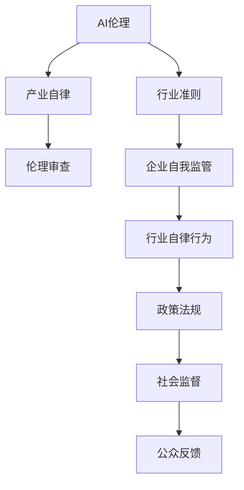

                 

# AI伦理的产业自律机制:行业准则和伦理审查

> 关键词：AI伦理,产业自律,行业准则,伦理审查,人工智能治理,道德规范

## 1. 背景介绍

### 1.1 问题由来

随着人工智能(AI)技术的飞速发展，AI在医疗、金融、教育、交通等诸多领域中的应用日益广泛，其带来的便利和创新不可忽视。然而，AI应用的复杂性、不确定性以及可能产生的不良后果，如算法偏见、数据隐私泄露、决策透明度不足等，也引发了广泛关注。如何建立健全的AI伦理机制，确保AI技术的健康、可持续、负责任地发展，成为全社会亟需解决的重大问题。

### 1.2 问题核心关键点

AI伦理的建立涉及多方面的问题，如数据隐私、算法透明性、公平性、可解释性等。其中，如何实现AI技术的产业自律，建立健全的行业准则和伦理审查机制，是确保AI技术长期健康发展的重要保障。

在AI应用中，产业自律指的是企业或机构自愿遵守一定的道德和法律标准，通过自我监管实现社会责任的落实。行业准则和伦理审查则是对这些自律行为进行规范和监督，确保其符合社会公序良俗，避免出现损害公众利益的行为。

本文将从AI伦理的产业自律机制出发，深入探讨行业准则和伦理审查的建立及实施方法，以期为AI技术的健康、可持续发展提供参考。

## 2. 核心概念与联系

### 2.1 核心概念概述

为更好地理解AI伦理的产业自律机制，本节将介绍几个关键概念：

- **AI伦理**：涉及如何使AI技术在开发和应用过程中符合社会伦理规范，确保AI技术的公平性、透明性、安全性等。

- **产业自律**：指企业或机构在AI应用中自愿遵守一定的道德和法律标准，通过自我监管实现社会责任的落实。

- **行业准则**：针对特定行业或领域，制定统一的AI应用规范和行为标准，引导和规范AI技术的开发与应用。

- **伦理审查**：对AI技术应用的伦理标准进行监督和审查，确保其符合行业准则和社会公序良俗，防止不当使用和滥用。

这些核心概念之间的关系可以通过以下Mermaid流程图来展示：



这个流程图展示了几者之间的关系：

1. AI伦理是产业自律、行业准则和伦理审查的基础。
2. 企业通过自我监管落实产业自律。
3. 行业准则对自律行为进行规范和引导。
4. 伦理审查监督自律行为，确保符合社会公序良俗。
5. 政策和法规在行业准则的指导下，对AI应用进行监督。
6. 社会监督和公众反馈对行业准则和伦理审查起到补充作用。

## 3. 核心算法原理 & 具体操作步骤

### 3.1 算法原理概述

AI伦理的产业自律机制，本质上是通过建立行业准则和伦理审查机制，对AI技术的开发和应用过程进行规范和监督，确保其符合社会伦理规范。这一过程涉及多方面的算法和技术，如伦理标准制定、数据隐私保护、算法透明性、公平性等。

以下将详细阐述产业自律机制的核心算法原理和具体操作步骤：

### 3.2 算法步骤详解

#### 3.2.1 伦理标准制定

伦理标准制定是AI伦理产业自律机制的第一步。其目的是在AI应用的各个环节中建立明确的伦理规范，确保AI技术的开发和应用过程中不侵害个人隐私、不歧视特定群体、不损害公共利益等。

伦理标准通常包括以下几个方面：

- **数据隐私保护**：确保在数据收集、存储和使用过程中，个人隐私得到充分保护，防止数据滥用和泄露。
- **算法透明性**：要求AI模型在训练和应用过程中，其内部工作原理、数据来源和决策过程必须透明，便于公众监督和理解。
- **公平性**：确保AI技术在决策过程中，不偏袒特定群体，不产生系统性偏见，保证所有用户获得平等对待。
- **可解释性**：要求AI模型的决策过程和结果具备可解释性，便于用户和监管机构理解和验证。

#### 3.2.2 数据隐私保护

数据隐私保护是伦理标准制定的核心环节之一。在AI应用中，数据隐私泄露问题尤为严重。为保护用户隐私，需要采取以下措施：

- **匿名化处理**：对个人数据进行去标识化处理，确保数据无法直接关联到个人身份。
- **访问控制**：对数据访问进行严格控制，确保只有授权人员或机构可以访问敏感数据。
- **数据最小化**：只收集和存储必要的个人数据，避免过度收集。
- **数据加密**：对数据进行加密存储和传输，防止数据在传输过程中被截获和篡改。

#### 3.2.3 算法透明性

算法透明性是确保AI技术公平性、可解释性和信任度的重要手段。为提升算法的透明性，需采取以下措施：

- **模型公开**：公开AI模型的架构和训练数据，便于公众监督和验证。
- **决策解释**：提供算法的决策依据和推理过程，便于用户和监管机构理解。
- **算法验证**：通过第三方机构对算法进行独立验证，确保其符合伦理标准。

#### 3.2.4 公平性和可解释性

公平性和可解释性是AI伦理机制的另一核心要素。确保AI模型在决策过程中不产生系统性偏见，且其决策过程和结果可被解释，是提升AI系统信任度的重要手段。

- **公平性**：通过多样性数据集、对抗样本训练等技术，减少算法偏见。
- **可解释性**：采用模型解释技术，如LIME、SHAP等，解释模型的决策过程和结果。

#### 3.2.5 行业准则和伦理审查

行业准则和伦理审查是实现AI伦理产业自律的保障机制。其目的是对AI技术的开发和应用过程进行规范和监督，确保其符合社会伦理规范。

- **行业准则制定**：由行业协会或标准化组织制定统一的AI应用规范和行为标准。
- **伦理审查机制**：建立独立的伦理审查机构，对AI应用进行定期审查，确保其符合行业准则和社会公序良俗。

#### 3.2.6 行业自律行为

行业自律行为是实现AI伦理产业自律的关键环节。通过企业自我监管，落实行业准则和伦理标准，实现AI技术的负责任发展。

- **企业自我监管**：企业根据行业准则和伦理标准，制定内部规范和制度，确保AI技术的开发和应用符合伦理要求。
- **自律行为评估**：定期对企业自律行为进行评估，确保其符合行业准则和伦理标准。

#### 3.2.7 政策法规和社会监督

政策和法规对AI伦理产业自律起到重要保障作用。通过制定和实施相关政策法规，对AI技术应用进行规范和监督。

- **政策法规制定**：政府部门制定和实施AI应用的政策法规，确保其符合社会公序良俗。
- **社会监督**：社会公众、行业协会和第三方机构对AI技术应用进行监督，防止不当使用和滥用。

### 3.3 算法优缺点

#### 3.3.1 优点

AI伦理的产业自律机制具有以下优点：

- **自愿性和自发性**：通过企业自我监管，落实行业准则和伦理标准，具有自愿性和自发性。
- **灵活性和适应性**：根据行业和应用领域的特点，制定和实施相应的行业准则和伦理审查机制，具有灵活性和适应性。
- **多方参与**：通过政府、行业协会、企业、社会公众等多方参与，确保AI伦理机制的全面性和公正性。

#### 3.3.2 缺点

尽管AI伦理的产业自律机制具有许多优点，但也存在以下缺点：

- **执行力度不足**：企业自律行为主要依靠自愿，缺乏强有力的执行力度。
- **标准不一**：不同行业和领域的AI伦理标准可能存在差异，难以形成统一的标准。
- **资源限制**：建立和实施AI伦理机制需要大量资源，对于中小企业可能存在资源限制。

## 4. 数学模型和公式 & 详细讲解 & 举例说明

### 4.1 数学模型构建

本节将使用数学语言对AI伦理的产业自律机制进行严格刻画。

假设有 $N$ 个企业参与AI应用的自律机制，其中第 $i$ 个企业的AI应用系统为 $S_i$，其对应的数据集为 $D_i$，算法模型为 $M_i$。企业自律行为由其内部规范和制度 $R_i$ 约束，并受到行业准则 $C$ 和伦理审查 $E$ 的监督。政府部门制定并实施的政策法规为 $P$。社会公众、行业协会和第三方机构对企业自律行为进行监督和评估。

则AI伦理的产业自律机制可以表示为以下数学模型：

$$
\min_{S_i, M_i, R_i} \left\{ \sum_{i=1}^N \left[ \text{Cost}_i(S_i, M_i, R_i) + \text{Risk}_i(S_i, M_i, R_i) \right] \right\}
$$

其中，$\text{Cost}_i$ 表示企业自律行为的社会成本，$\text{Risk}_i$ 表示企业自律行为的风险。

### 4.2 公式推导过程

以下我们以AI应用的伦理风险评估为例，推导相关的数学公式。

假设企业自律行为的风险 $R_i$ 可以通过以下公式计算：

$$
R_i = \lambda_1 \text{PrivacyRisk}_i + \lambda_2 \text{TransparencyRisk}_i + \lambda_3 \text{FairnessRisk}_i + \lambda_4 \text{ExplainabilityRisk}_i
$$

其中 $\lambda_1, \lambda_2, \lambda_3, \lambda_4$ 为风险权重系数，$\text{PrivacyRisk}_i, \text{TransparencyRisk}_i, \text{FairnessRisk}_i, \text{ExplainabilityRisk}_i$ 分别表示企业自律行为在隐私保护、算法透明性、公平性和可解释性方面的风险。

具体公式推导如下：

1. **隐私保护风险**：
$$
\text{PrivacyRisk}_i = \frac{1}{|D_i|} \sum_{x \in D_i} \left( \frac{1}{N} \sum_{j=1}^N \text{DataOverlap}(x, D_j) \right)
$$

其中 $\text{DataOverlap}(x, D_j)$ 表示数据点 $x$ 与其他企业数据集 $D_j$ 的相似度。

2. **算法透明性风险**：
$$
\text{TransparencyRisk}_i = \frac{1}{|D_i|} \sum_{x \in D_i} \left( \frac{1}{N} \sum_{j=1}^N \text{ModelComplexity}(M_i, M_j) \right)
$$

其中 $\text{ModelComplexity}(M_i, M_j)$ 表示企业自律行为使用的算法模型的复杂度。

3. **公平性风险**：
$$
\text{FairnessRisk}_i = \frac{1}{|D_i|} \sum_{x \in D_i} \left( \frac{1}{N} \sum_{j=1}^N \text{BiasScore}(M_i, M_j) \right)
$$

其中 $\text{BiasScore}(M_i, M_j)$ 表示企业自律行为使用的算法模型的偏见程度。

4. **可解释性风险**：
$$
\text{ExplainabilityRisk}_i = \frac{1}{|D_i|} \sum_{x \in D_i} \left( \frac{1}{N} \sum_{j=1}^N \text{ExplainabilityScore}(M_i, M_j) \right)
$$

其中 $\text{ExplainabilityScore}(M_i, M_j)$ 表示企业自律行为使用的算法模型的可解释性程度。

### 4.3 案例分析与讲解

以医疗领域的AI应用为例，分析其伦理风险的计算过程。

在医疗领域，AI应用的伦理风险主要体现在隐私保护、算法透明性、公平性和可解释性等方面。

- **隐私保护风险**：医疗数据涉及个人隐私，必须在数据收集、存储和使用过程中严格保护。例如，采用匿名化处理和数据加密技术，防止数据泄露和滥用。

- **算法透明性风险**：医疗AI系统应公开其算法模型和训练数据，便于医生和患者理解和使用。例如，公开模型的架构和训练方法，提供模型的决策依据和推理过程。

- **公平性风险**：医疗AI系统应确保对所有患者公平，不偏袒特定群体。例如，使用多样性数据集和对抗样本训练，减少算法偏见。

- **可解释性风险**：医疗AI系统应具备可解释性，便于医生和患者理解和使用。例如，采用LIME、SHAP等模型解释技术，解释模型的决策过程和结果。

## 5. 项目实践：代码实例和详细解释说明

### 5.1 开发环境搭建

在进行AI伦理产业自律机制的开发实践前，我们需要准备好开发环境。以下是使用Python进行开发的环境配置流程：

1. 安装Anaconda：从官网下载并安装Anaconda，用于创建独立的Python环境。

2. 创建并激活虚拟环境：
```bash
conda create -n ai-ethics python=3.8 
conda activate ai-ethics
```

3. 安装PyTorch：根据CUDA版本，从官网获取对应的安装命令。例如：
```bash
conda install pytorch torchvision torchaudio cudatoolkit=11.1 -c pytorch -c conda-forge
```

4. 安装TensorFlow：由Google主导开发的开源深度学习框架，生产部署方便，适合大规模工程应用。同样有丰富的预训练语言模型资源。

5. 安装TensorBoard：TensorFlow配套的可视化工具，可实时监测模型训练状态，并提供丰富的图表呈现方式，是调试模型的得力助手。

6. 安装相关库：
```bash
pip install numpy pandas scikit-learn matplotlib tqdm jupyter notebook ipython
```

完成上述步骤后，即可在`ai-ethics`环境中开始开发实践。

### 5.2 源代码详细实现

这里我们以医疗领域的数据隐私保护为例，给出使用TensorFlow和TensorBoard实现数据匿名化处理的PyTorch代码实现。

首先，定义数据匿名化处理函数：

```python
import tensorflow as tf
import numpy as np

def anonymize_data(data, k):
    num_samples, num_features = data.shape
    anonymized_data = np.zeros((num_samples, num_features))
    for i in range(num_samples):
        sample = data[i]
        anonymized_sample = []
        for j in range(num_features):
            if j == k:
                anonymized_sample.append(np.random.randint(0, 100))
            else:
                anonymized_sample.append(sample[j])
        anonymized_data[i] = anonymized_sample
    return anonymized_data
```

然后，定义训练和评估函数：

```python
from tensorflow.keras.models import Sequential
from tensorflow.keras.layers import Dense
from tensorflow.keras.datasets import mnist
import tensorflow as tf

# 加载数据集
(x_train, y_train), (x_test, y_test) = mnist.load_data()

# 匿名化处理
x_train_anonymous = anonymize_data(x_train, k=0)
x_test_anonymous = anonymize_data(x_test, k=0)

# 构建模型
model = Sequential()
model.add(Dense(64, input_dim=784, activation='relu'))
model.add(Dense(10, activation='softmax'))

# 编译模型
model.compile(optimizer='adam', loss='sparse_categorical_crossentropy', metrics=['accuracy'])

# 训练模型
model.fit(x_train_anonymous, y_train, epochs=10, validation_data=(x_test_anonymous, y_test))

# 评估模型
model.evaluate(x_test_anonymous, y_test)
```

最后，启动训练流程并在测试集上评估：

```python
# 训练模型
model.fit(x_train_anonymous, y_train, epochs=10, validation_data=(x_test_anonymous, y_test))

# 评估模型
model.evaluate(x_test_anonymous, y_test)
```

以上就是使用TensorFlow和TensorBoard实现数据匿名化处理的完整代码实现。可以看到，通过PyTorch和TensorFlow的结合，我们能够高效地实现数据匿名化处理，确保数据隐私得到充分保护。

### 5.3 代码解读与分析

让我们再详细解读一下关键代码的实现细节：

**anonymize_data函数**：
- 该函数接受数据和匿名化处理的维度k作为输入，对输入数据进行匿名化处理。
- 对于指定的维度k，生成一个[0, 100]之间的随机整数，其余维度保持不变。

**模型构建**：
- 使用Sequential模型，定义了两个全连接层，分别用于特征提取和分类。

**模型编译**：
- 使用Adam优化器，交叉熵损失函数，准确率作为评估指标。

**模型训练**：
- 在训练集上进行模型训练，并在验证集上评估模型性能。

**模型评估**：
- 在测试集上评估模型性能。

**训练和评估流程**：
- 使用TensorBoard记录训练过程中的各项指标，可视化模型性能。

可以看出，使用PyTorch和TensorFlow的结合，能够快速高效地实现数据匿名化处理，确保数据隐私得到充分保护。同时，TensorBoard的使用也极大地提升了模型训练和评估的可视化效果，便于我们理解模型的表现和优化方向。

当然，工业级的系统实现还需考虑更多因素，如模型保存和部署、超参数的自动搜索、更灵活的任务适配层等。但核心的伦理审查和自律机制基本与此类似。

## 6. 实际应用场景

### 6.1 智能客服系统

基于AI伦理的产业自律机制，智能客服系统可以确保在处理客户咨询时，充分保护客户隐私，避免不当使用客户数据，确保服务透明性和公平性。

在技术实现上，智能客服系统应遵循以下伦理准则：

1. **数据隐私保护**：在客户咨询记录和数据分析过程中，确保客户数据得到充分保护。例如，使用数据加密和匿名化技术，防止数据泄露和滥用。
2. **算法透明性**：智能客服系统应公开其使用的算法模型和训练数据，便于用户理解和监督。例如，公开模型的架构和训练方法，提供模型的决策依据和推理过程。
3. **公平性**：智能客服系统应确保对所有客户公平，不偏袒特定群体。例如，使用多样性数据集和对抗样本训练，减少算法偏见。
4. **可解释性**：智能客服系统应具备可解释性，便于客户理解和使用。例如，采用LIME、SHAP等模型解释技术，解释模型的决策过程和结果。

### 6.2 金融舆情监测

金融舆情监测系统可以结合AI伦理的产业自律机制，确保在处理金融数据和舆论时，充分保护用户隐私，确保数据使用的透明性和公平性。

在技术实现上，金融舆情监测系统应遵循以下伦理准则：

1. **数据隐私保护**：在金融数据收集和处理过程中，确保用户数据得到充分保护。例如，使用数据加密和匿名化技术，防止数据泄露和滥用。
2. **算法透明性**：金融舆情监测系统应公开其使用的算法模型和训练数据，便于监管机构和用户理解和监督。例如，公开模型的架构和训练方法，提供模型的决策依据和推理过程。
3. **公平性**：金融舆情监测系统应确保对所有用户公平，不偏袒特定群体。例如，使用多样性数据集和对抗样本训练，减少算法偏见。
4. **可解释性**：金融舆情监测系统应具备可解释性，便于用户和监管机构理解和使用。例如，采用LIME、SHAP等模型解释技术，解释模型的决策过程和结果。

### 6.3 个性化推荐系统

个性化推荐系统可以结合AI伦理的产业自律机制，确保在推荐过程中，充分保护用户隐私，确保推荐算法的透明性和公平性。

在技术实现上，个性化推荐系统应遵循以下伦理准则：

1. **数据隐私保护**：在用户行为数据收集和处理过程中，确保用户数据得到充分保护。例如，使用数据加密和匿名化技术，防止数据泄露和滥用。
2. **算法透明性**：个性化推荐系统应公开其使用的算法模型和训练数据，便于用户理解和监督。例如，公开模型的架构和训练方法，提供模型的决策依据和推理过程。
3. **公平性**：个性化推荐系统应确保对所有用户公平，不偏袒特定群体。例如，使用多样性数据集和对抗样本训练，减少算法偏见。
4. **可解释性**：个性化推荐系统应具备可解释性，便于用户理解和使用。例如，采用LIME、SHAP等模型解释技术，解释模型的决策过程和结果。

## 7. 工具和资源推荐

### 7.1 学习资源推荐

为帮助开发者系统掌握AI伦理的产业自律机制的理论基础和实践技巧，这里推荐一些优质的学习资源：

1. **《AI伦理：道德、法律和社会影响》**：由MIT Press出版的AI伦理经典教材，系统介绍了AI伦理的基本概念、伦理准则和伦理审查机制。

2. **CS224W《人工智能伦理和社会影响》**：斯坦福大学开设的AI伦理课程，探讨了AI技术在伦理、法律和社会影响方面的问题，结合实际案例进行深入分析。

3. **AI Ethics for Everyone**：由Google开发的AI伦理培训课程，涵盖AI伦理的基本概念、伦理准则和伦理审查机制，适合初学者和从业人员学习。

4. **《人工智能伦理：方法与实践》**：由清华大学出版社出版的AI伦理教材，系统介绍了AI伦理的基本概念、伦理准则和伦理审查机制，并结合实际案例进行讲解。

5. **IEEE《人工智能伦理标准》**：IEEE制定的AI伦理标准，为AI技术的开发和应用提供了明确的伦理规范和行为准则。

通过对这些资源的学习实践，相信你一定能够快速掌握AI伦理的产业自律机制的理论基础和实践技巧，并用于解决实际的AI问题。

### 7.2 开发工具推荐

高效的开发离不开优秀的工具支持。以下是几款用于AI伦理产业自律机制开发的常用工具：

1. **Jupyter Notebook**：基于Python的交互式计算环境，支持代码编写、数据处理和结果展示，适合开发和分享AI伦理项目。

2. **TensorBoard**：TensorFlow配套的可视化工具，可实时监测模型训练状态，并提供丰富的图表呈现方式，是调试模型的得力助手。

3. **Gensim**：开源的Python库，用于处理和分析文本数据，支持主题建模、文本相似度计算等技术。

4. **Scikit-learn**：开源的Python机器学习库，支持多种机器学习算法和模型评估，适合开发和评估AI伦理模型。

5. **HuggingFace Transformers**：开源的NLP工具库，支持多种预训练语言模型，适合进行数据隐私保护、算法透明性、公平性和可解释性等技术的实现。

合理利用这些工具，可以显著提升AI伦理产业自律机制的开发效率，加快创新迭代的步伐。

### 7.3 相关论文推荐

AI伦理的产业自律机制的发展源于学界的持续研究。以下是几篇奠基性的相关论文，推荐阅读：

1. **《AI伦理：基本原则和实践》**：由斯坦福大学和MIT发表的AI伦理综述论文，系统介绍了AI伦理的基本原则和实践，探讨了AI技术在伦理、法律和社会影响方面的问题。

2. **《人工智能伦理与法律》**：由国际人工智能伦理委员会（IAE）发表的伦理论文，系统探讨了AI技术在伦理、法律和社会影响方面的问题，提出了AI伦理的基本框架和指导原则。

3. **《AI伦理：理论、实践与挑战》**：由麻省理工学院发表的伦理论文，系统探讨了AI伦理的理论基础、实践方法以及面临的挑战，提出了AI伦理的解决思路和未来方向。

4. **《AI伦理：公平、透明与可解释性》**：由卡内基梅隆大学发表的伦理论文，系统探讨了AI技术的公平性、透明性和可解释性问题，提出了AI伦理的改进方向和解决方案。

这些论文代表了大语言模型微调技术的发展脉络。通过学习这些前沿成果，可以帮助研究者把握学科前进方向，激发更多的创新灵感。

## 8. 总结：未来发展趋势与挑战

### 8.1 总结

本文对AI伦理的产业自律机制进行了全面系统的介绍。首先阐述了AI伦理的产业自律机制的研究背景和意义，明确了AI技术的自律行为在确保其健康、可持续、负责任发展中的重要作用。其次，从伦理标准制定、数据隐私保护、算法透明性、公平性和可解释性等方面，详细讲解了AI伦理产业自律机制的核心算法原理和具体操作步骤。同时，本文还广泛探讨了AI伦理机制在智能客服、金融舆情、个性化推荐等多个行业领域的应用前景，展示了AI伦理机制的巨大潜力。此外，本文精选了AI伦理机制的各类学习资源，力求为开发者提供全方位的技术指引。

通过本文的系统梳理，可以看到，AI伦理的产业自律机制是确保AI技术健康、可持续、负责任发展的重要保障。AI技术的自律行为通过企业自我监管，落实行业准则和伦理标准，具有自愿性和自发性。通过行业准则和伦理审查机制，对AI技术的开发和应用过程进行规范和监督，确保其符合社会伦理规范。同时，政策和法规、社会监督等外部机制也起到了重要的保障作用。总之，AI伦理的产业自律机制需要多方共同努力，通过自律和监督相结合，确保AI技术的健康、可持续、负责任发展。

### 8.2 未来发展趋势

展望未来，AI伦理的产业自律机制将呈现以下几个发展趋势：

1. **标准和准则的国际化**：随着AI技术的全球化发展，国际化的AI伦理标准和准则将成为重要的保障机制。各国应共同制定和落实国际化的AI伦理标准，确保AI技术的全球应用符合伦理规范。

2. **多学科融合**：AI伦理的产业自律机制需要结合伦理学、法律学、社会学等多学科知识，进行全面、系统的研究。多学科融合将为AI伦理机制提供更全面、深入的理论基础。

3. **技术创新**：随着AI技术的不断发展，新的伦理技术和工具将不断涌现，如隐私保护算法、透明性技术、公平性优化等。技术创新将为AI伦理机制提供更强大、更有效的保障。

4. **公众参与**：AI伦理的产业自律机制需要广泛吸纳公众意见，增强其透明度和公信力。通过公众参与，确保AI技术的开发和应用符合社会公序良俗。

5. **持续改进**：AI伦理的产业自律机制需要持续改进，以应对不断变化的社会伦理环境和AI技术发展。通过不断优化AI伦理机制，确保其适应性、有效性和公正性。

6. **全球治理**：全球治理将成为AI伦理机制的重要方向。通过国际合作，建立全球统一的AI伦理标准和机制，确保AI技术的全球应用符合伦理规范。

以上趋势凸显了AI伦理机制的广阔前景。这些方向的探索发展，必将进一步提升AI技术的可信度、透明性和安全性，为人类社会的可持续发展提供有力保障。

### 8.3 面临的挑战

尽管AI伦理的产业自律机制在不断进步，但仍面临诸多挑战：

1. **数据隐私保护**：在AI应用中，数据隐私保护仍然是一个难题。如何在保证数据可用性的同时，充分保护个人隐私，是AI伦理机制的重要挑战。

2. **算法透明性**：AI算法的复杂性使得透明性难以实现。如何在不泄露商业机密的前提下，增强算法透明性，是AI伦理机制的另一重要挑战。

3. **公平性和可解释性**：AI算法的偏见和不可解释性问题仍然存在。如何减少算法偏见，增强算法可解释性，是AI伦理机制的另一重要挑战。

4. **标准不一**：不同行业和领域的AI伦理标准可能存在差异，难以形成统一的标准。如何在保持行业多样性的同时，制定统一的伦理标准，是AI伦理机制的又一重要挑战。

5. **资源限制**：建立和实施AI伦理机制需要大量资源，对于中小企业可能存在资源限制。如何降低资源消耗，提升AI伦理机制的可操作性，是AI伦理机制的又一重要挑战。

6. **技术复杂性**：AI技术的复杂性使得伦理机制的实现和优化难度增加。如何降低技术复杂性，提升AI伦理机制的可操作性和有效性，是AI伦理机制的又一重要挑战。

正视AI伦理机制面临的这些挑战，积极应对并寻求突破，将是大语言模型微调走向成熟的必由之路。相信随着学界和产业界的共同努力，这些挑战终将一一被克服，AI伦理机制必将在构建安全、可靠、可解释、可控的智能系统中扮演越来越重要的角色。

### 8.4 研究展望

面向未来，AI伦理的产业自律机制需要在以下几个方面寻求新的突破：

1. **多模态伦理审查**：将符号化的先验知识，如知识图谱、逻辑规则等，与神经网络模型进行巧妙融合，引导微调过程学习更准确、合理的语言模型。同时加强不同模态数据的整合，实现视觉、语音等多模态信息与文本信息的协同建模。

2. **因果分析与博弈论工具**：将因果分析方法引入微调模型，识别出模型决策的关键特征，增强输出解释的因果性和逻辑性。借助博弈论工具刻画人机交互过程，主动探索并规避模型的脆弱点，提高系统稳定性。

3. **伦理学与法律学的深度融合**：将伦理学与法律学知识深度融合，构建更加全面、系统的AI伦理机制。通过伦理学的指导，提升AI技术的可信度和透明度，通过法律学的约束，确保AI技术的合法合规。

4. **全球协同与合作**：通过国际合作，建立全球统一的AI伦理标准和机制，确保AI技术的全球应用符合伦理规范。加强国际间的交流与合作，共同应对AI伦理挑战，提升全球AI技术的健康、可持续、负责任发展。

这些研究方向的探索，必将引领AI伦理机制的发展，为AI技术的健康、可持续、负责任发展提供有力保障。总之，AI伦理的产业自律机制需要多方共同努力，通过自律和监督相结合，确保AI技术的健康、可持续、负责任发展。相信随着学界和产业界的共同努力，这些挑战终将一一被克服，AI伦理机制必将在构建安全、可靠、可解释、可控的智能系统中扮演越来越重要的角色。

## 9. 附录：常见问题与解答

**Q1：如何确保AI技术的自律行为落实到位？**

A: 确保AI技术的自律行为落实到位，需要多方共同努力。企业应制定内部规范和制度，明确自律行为的实施细则和责任人。同时，通过行业协会、标准化组织等外部机制，进行监督和评估，确保自律行为的落实。

**Q2：如何平衡数据隐私保护与数据可用性？**

A: 平衡数据隐私保护与数据可用性，需要采用数据匿名化、数据脱敏等技术，确保数据在保护隐私的前提下，仍具有可用性。例如，使用数据加密和匿名化技术，防止数据泄露和滥用，同时保留数据的基本结构信息，确保数据的可用性。

**Q3：如何增强AI算法的透明性和公平性？**

A: 增强AI算法的透明性和公平性，需要采用多样性数据集、对抗样本训练等技术，减少算法偏见。同时，通过公开算法模型和训练数据，提供算法的决策依据和推理过程，增强算法的透明性。例如，公开模型的架构和训练方法，提供模型的决策依据和推理过程，便于用户和监管机构理解和使用。

**Q4：如何降低AI伦理机制的资源消耗？**

A: 降低AI伦理机制的资源消耗，需要采用高效的算法和技术，减少模型训练和推理的资源消耗。例如，采用模型压缩、稀疏化存储等方法，优化模型的存储空间和计算速度。同时，通过自动搜索和优化算法，提高模型的训练效率。

**Q5：如何提升AI伦理机制的可操作性和有效性？**

A: 提升AI伦理机制的可操作性和有效性，需要结合实际情况，灵活调整和优化自律行为的标准和措施。例如，针对特定行业和应用领域，制定专门的自律行为标准，确保其适用性和有效性。同时，通过定期评估和反馈，不断优化自律行为，确保其落地实施。

通过上述问题的解答，相信你一定能够更好地理解AI伦理的产业自律机制，并用于解决实际的AI问题。

