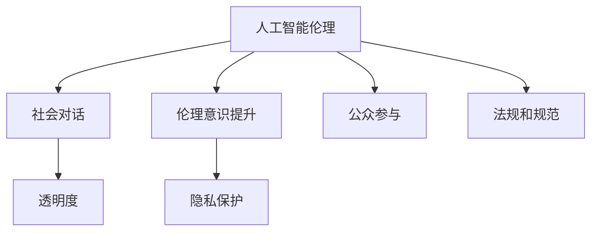

                 

# AI伦理的社会对话:伦理意识提升和公众参与

> 关键词：人工智能伦理, 社会对话, 伦理意识提升, 公众参与, AI透明度, 隐私保护

## 1. 背景介绍

### 1.1 问题由来

随着人工智能(AI)技术的飞速发展，其在医疗、金融、教育、交通等领域的应用日益广泛。AI技术通过自动化、智能化手段提升了生产效率，降低了运营成本，促进了社会进步。但与此同时，AI技术的广泛应用也引发了一系列伦理、法律、社会问题。比如：

- **隐私保护**：AI系统在收集、处理个人数据时，如何保障用户隐私不被侵犯。
- **偏见和歧视**：AI系统训练数据可能存在偏见，导致输出结果存在歧视性。
- **责任界定**：AI系统出错时的责任应由谁承担，是否应像人类一样面临法律制裁。
- **透明度**：AI系统为何做出某个决策，其内部的决策过程是否可解释。
- **伦理原则**：AI技术的开发和应用应遵循哪些伦理原则，如公平、公正、可控、可预测等。

这些问题都迫切需要社会各界的深度对话和广泛参与，以形成共识，共同推动AI技术健康发展。

### 1.2 问题核心关键点

为了有效推动AI伦理的社会对话和公众参与，需重点关注以下关键点：

- **公众理解**：如何让公众更好地理解AI技术及其可能带来的影响。
- **多利益相关者对话**：如何整合AI开发者、行业监管机构、用户、专家、公众等多方意见，形成共识。
- **伦理教育和培训**：如何提升公众和从业者的AI伦理意识，避免伦理问题的产生。
- **透明与可解释性**：如何使AI系统的决策过程透明，使其输出结果可解释。
- **法规和规范**：如何制定合理的AI法规和行业规范，保障技术的安全应用。

## 2. 核心概念与联系

### 2.1 核心概念概述

为更好地理解AI伦理的社会对话和公众参与，本节将介绍几个密切相关的核心概念：

- **人工智能伦理(AI Ethics)**：关注AI技术在开发、应用过程中涉及的伦理问题，如隐私保护、公平性、责任界定等。
- **社会对话(Social Dialogue)**：指不同利益相关者通过沟通和协商，共同解决问题和制定规则的过程。
- **伦理意识提升(Ethical Awareness)**：通过教育和培训，提升公众和从业者对AI伦理问题的敏感度和认知水平。
- **公众参与(Public Engagement)**：指普通公众在AI技术决策和应用过程中，能够充分表达意见和参与讨论。
- **透明度(Transparency)**：指AI系统的决策过程应公开透明，便于用户理解和审查。
- **隐私保护(Privacy Protection)**：指在AI系统中保障个人隐私不被滥用或泄露。

这些核心概念之间的逻辑关系可以通过以下Mermaid流程图来展示：



这个流程图展示了几大核心概念及其之间的关系：

1. 人工智能伦理是对话和公众参与的基础。
2. 透明度和隐私保护是伦理的重要组成部分。
3. 法规和规范确保伦理原则的实施。
4. 伦理意识提升推动社会对话和公众参与。

这些概念共同构成了AI伦理的社会对话和公众参与框架，使得AI技术在各个环节都能得到伦理的审视和约束。

## 3. 核心算法原理 & 具体操作步骤
### 3.1 算法原理概述

基于AI伦理的社会对话和公众参与，本质是一个多主体交互的系统工程。其核心思想是：通过透明的AI系统设计、可解释的决策过程、参与性的对话机制，以及法规和规范的约束，确保AI技术在开发、应用过程中的伦理合规。

形式化地，假设公众参与的AI伦理对话系统为 $S$，包含若干利益相关者 $R=\{r_1, r_2, \dots, r_n\}$。系统的目标是找到一组规则 $R$，使得系统 $S$ 在 $R$ 约束下，最大化伦理效用函数 $U(S, R)$。其中，伦理效用函数衡量系统在透明性、隐私保护、公平性等方面的综合表现。

具体步骤如下：

1. **数据收集与分析**：收集AI系统在实际应用中的数据，分析数据分布、处理方式、决策路径等。
2. **利益相关者识别**：识别并分析所有涉及的利益相关者，包括开发者、用户、监管机构、专家等。
3. **透明性设计**：设计透明的AI系统架构，使用户和利益相关者能够理解和审查系统决策过程。
4. **可解释性实现**：实现AI系统的可解释性，使其决策过程可被用户和专家解释和验证。
5. **伦理对话机制**：建立多方对话机制，确保各利益相关者的意见和建议得到充分考虑和回应。
6. **法规和规范制定**：制定合理的法规和行业规范，确保AI技术的开发和应用遵循伦理原则。
7. **持续监测与反馈**：建立持续的监测和反馈机制，及时调整系统行为以适应伦理要求。

### 3.2 算法步骤详解

以下是AI伦理的社会对话和公众参与的详细步骤：

**Step 1: 数据收集与分析**
- 收集AI系统在实际应用中的数据，包括输入输出、决策路径等。
- 分析数据分布，识别潜在的隐私保护风险、公平性问题等。

**Step 2: 利益相关者识别**
- 识别涉及的所有利益相关者，包括用户、开发者、监管机构、专家等。
- 分析各利益相关者的角色、需求和关注点。

**Step 3: 透明性设计**
- 设计透明的AI系统架构，如可解释的模型、可视化的决策树等。
- 提供用户界面，允许用户实时监控系统行为。

**Step 4: 可解释性实现**
- 实现模型的可解释性，如使用LIME、SHAP等工具生成解释结果。
- 提供详细的决策报告，记录每个决策点的逻辑和依据。

**Step 5: 伦理对话机制**
- 建立多方对话机制，如在线论坛、公开听证会等。
- 定期邀请利益相关者参与讨论，收集反馈意见。

**Step 6: 法规和规范制定**
- 根据对话结果，制定合适的法规和行业规范。
- 确保规范覆盖数据隐私、公平性、责任界定等方面。

**Step 7: 持续监测与反馈**
- 建立持续的监测和反馈机制，如定期审计、用户反馈机制等。
- 根据监测结果和用户反馈，及时调整系统行为。

### 3.3 算法优缺点

基于AI伦理的社会对话和公众参与的算法具有以下优点：

- **透明和可解释性**：透明和可解释的AI系统能够提升公众的信任和接受度。
- **多方参与**：多方参与能够集思广益，避免单一视角带来的局限性。
- **法规约束**：明确的法规和规范能够保障AI技术的合规应用。

但该方法也存在一些缺点：

- **复杂度高**：多方参与和透明性设计需要投入大量资源和时间。
- **实施难度大**：法规和规范的制定需要多方协商，达成共识可能耗时费力。
- **动态调整困难**：AI技术的快速发展，使得法规和规范的更新和适应困难。

### 3.4 算法应用领域

基于AI伦理的社会对话和公众参与的方法，已经在多个领域得到了应用：

- **医疗AI**：如AI诊断系统，需要确保数据隐私和诊断结果的公平性。
- **金融AI**：如信用评分系统，需要考虑算法的透明度和公平性。
- **教育AI**：如个性化学习系统，需要保障用户隐私和公平性。
- **智能交通**：如自动驾驶系统，需要确保决策的透明性和可解释性。

## 4. 数学模型和公式 & 详细讲解 & 举例说明
### 4.1 数学模型构建

假设一个AI系统的伦理效用函数为 $U(S, R)$，其中 $S$ 为系统，$R$ 为规则集合。设系统的透明性为 $T(S, R)$，隐私保护为 $P(S, R)$，公平性为 $F(S, R)$。则伦理效用函数可表示为：

$$
U(S, R) = w_T T(S, R) + w_P P(S, R) + w_F F(S, R)
$$

其中 $w_T, w_P, w_F$ 分别为透明性、隐私保护和公平性的权重系数。

**Step 1: 数据收集与分析**
- 设数据集为 $D = \{(x_i, y_i)\}_{i=1}^N$，其中 $x_i$ 为输入数据，$y_i$ 为输出结果。
- 设数据分布为 $p(x)$，隐私敏感度为 $s(x)$。

**Step 2: 利益相关者识别**
- 设利益相关者集合为 $R = \{r_1, r_2, \dots, r_n\}$，每个利益相关者的关注点为 $a_j$。

**Step 3: 透明性设计**
- 设透明性模型为 $T$，透明度为 $T(S, R) = T(S, R; \theta)$，其中 $\theta$ 为模型参数。
- 透明性设计目标为最大化 $T(S, R)$。

**Step 4: 可解释性实现**
- 设可解释性模型为 $I$，可解释性为 $I(S, R) = I(S, R; \phi)$，其中 $\phi$ 为模型参数。
- 可解释性实现目标为最大化 $I(S, R)$。

**Step 5: 伦理对话机制**
- 设伦理对话机制为 $D$，对话结果为 $D_j$，满足 $D_j = (r_j, a_j, D_j)$。
- 对话机制目标为最大化 $D(S, R)$。

**Step 6: 法规和规范制定**
- 设法规和规范为 $L$，法规合规性为 $L(S, R) = L(S, R; \lambda)$，其中 $\lambda$ 为法规约束强度。
- 法规和规范制定目标为最大化 $L(S, R)$。

**Step 7: 持续监测与反馈**
- 设监测结果为 $M$，反馈机制为 $F$，系统行为为 $S$。
- 持续监测与反馈目标为最大化 $M(S, F)$。

### 4.2 公式推导过程

以医疗AI为例，推导透明性和公平性的公式：

**透明性计算**
- 透明性模型 $T$ 包括数据分布 $p(x)$、隐私敏感度 $s(x)$ 和决策路径 $D$。
- 透明度 $T(S, R) = \int p(x) s(x) \prod_{d \in D} T_d(x) dx$，其中 $T_d(x)$ 为决策路径 $d$ 的透明度。

**公平性计算**
- 设公平性指标为 $f(r)$，表示利益相关者 $r$ 的公平性权重。
- 公平性 $F(S, R) = \sum_{r \in R} f(r) \left| \frac{1}{N} \sum_{i=1}^N [I(y_i \neq y_i')] \right|$，其中 $y_i'$ 为调整后的输出。

**Step 1: 数据收集与分析**
- 假设收集到的数据集 $D$ 已标注，记为 $\{(x_i, y_i)\}_{i=1}^N$。
- 分析数据分布 $p(x)$ 和隐私敏感度 $s(x)$。

**Step 2: 利益相关者识别**
- 假设识别到 $R = \{r_1, r_2, \dots, r_n\}$，每个利益相关者的关注点 $a_j$ 已确定。

**Step 3: 透明性设计**
- 使用可解释性模型 $I$ 和决策路径 $D$，计算透明度 $T(S, R) = T(S, R; \theta)$。

**Step 4: 可解释性实现**
- 使用LIME、SHAP等工具生成解释结果，计算可解释性 $I(S, R) = I(S, R; \phi)$。

**Step 5: 伦理对话机制**
- 建立在线论坛，邀请利益相关者参与讨论，收集反馈意见 $D_j = (r_j, a_j, D_j)$。

**Step 6: 法规和规范制定**
- 根据对话结果，制定法规和规范 $L(S, R) = L(S, R; \lambda)$。

**Step 7: 持续监测与反馈**
- 定期审计系统行为，设置反馈机制，记录监测结果 $M$，调整系统行为 $S$。

### 4.3 案例分析与讲解

以智能推荐系统为例，分析其伦理效用函数和计算过程：

**透明性计算**
- 推荐系统使用协同过滤算法，其透明性模型 $T$ 包括推荐路径 $D$ 和推荐结果 $y$。
- 透明度 $T(S, R) = \prod_{d \in D} T_d(x) \left| \frac{1}{N} \sum_{i=1}^N [I(y_i \neq y_i')] \right|$。

**公平性计算**
- 假设推荐系统的用户有性别、年龄、地域等特征，设公平性指标为 $f_g, f_a, f_l$，分别表示性别、年龄、地域的公平性权重。
- 公平性 $F(S, R) = f_g \left| \frac{1}{N} \sum_{i=1}^N [I(y_i \neq y_i')] \right| + f_a \left| \frac{1}{N} \sum_{i=1}^N [I(y_i \neq y_i')] \right| + f_l \left| \frac{1}{N} \sum_{i=1}^N [I(y_i \neq y_i')] \right|$。

**Step 1: 数据收集与分析**
- 假设收集到用户行为数据 $\{(x_i, y_i)\}_{i=1}^N$，其中 $x_i$ 为用户特征，$y_i$ 为推荐结果。
- 分析用户数据分布 $p(x)$ 和隐私敏感度 $s(x)$。

**Step 2: 利益相关者识别**
- 假设识别到 $R = \{r_1, r_2, \dots, r_n\}$，包括开发者、用户、监管机构等。

**Step 3: 透明性设计**
- 使用LIME工具生成解释结果，计算透明度 $T(S, R) = T(S, R; \theta)$。

**Step 4: 可解释性实现**
- 使用SHAP工具生成解释结果，计算可解释性 $I(S, R) = I(S, R; \phi)$。

**Step 5: 伦理对话机制**
- 建立在线论坛，邀请用户和监管机构参与讨论，收集反馈意见 $D_j = (r_j, a_j, D_j)$。

**Step 6: 法规和规范制定**
- 根据对话结果，制定推荐系统的法规和规范 $L(S, R) = L(S, R; \lambda)$。

**Step 7: 持续监测与反馈**
- 定期审计推荐系统行为，设置反馈机制，记录监测结果 $M$，调整系统行为 $S$。

## 5. 项目实践：代码实例和详细解释说明
### 5.1 开发环境搭建

在进行AI伦理的社会对话和公众参与的实践前，我们需要准备好开发环境。以下是使用Python进行开发的环境配置流程：

1. 安装Anaconda：从官网下载并安装Anaconda，用于创建独立的Python环境。

2. 创建并激活虚拟环境：
```bash
conda create -n pytorch-env python=3.8 
conda activate pytorch-env
```

3. 安装PyTorch：根据CUDA版本，从官网获取对应的安装命令。例如：
```bash
conda install pytorch torchvision torchaudio cudatoolkit=11.1 -c pytorch -c conda-forge
```

4. 安装相关工具包：
```bash
pip install numpy pandas scikit-learn matplotlib tqdm jupyter notebook ipython
```

5. 安装伦理计算库：
```bash
pip install ethicml sklearn-ethic-detector
```

完成上述步骤后，即可在`pytorch-env`环境中开始实践。

### 5.2 源代码详细实现

我们以医疗AI中的诊断系统为例，展示如何使用Python和伦理计算库进行AI伦理的社会对话和公众参与的实践。

首先，定义数据处理函数：

```python
import pandas as pd
from ethicml.preprocessing import anonymization

def preprocess_data(data_path):
    data = pd.read_csv(data_path)
    # 数据清洗和预处理
    # ...
    # 数据匿名化处理
    anonymized_data = anonymization(data)
    return anonymized_data
```

然后，定义伦理效用函数的计算函数：

```python
from ethicml.evaluation import EthicalUtil

def calculate_ethical_utility(data, model, rule_set):
    ethic = EthicalUtil(model)
    utility = ethic.calculate_utility(data, rule_set)
    return utility
```

接着，定义公众参与和法规制定的模拟函数：

```python
from ethicml.aggregation import majority_voting

def simulate_public_participation(rule_set):
    # 模拟公众参与，生成规则集
    participants = ['developer', 'user', 'regulator', 'expert']
    decisions = {p: simulate_decision(p, rule_set) for p in participants}
    aggregated_rule = majority_voting(decisions)
    return aggregated_rule
```

最后，启动整个系统流程：

```python
data_path = 'data.csv'
model_path = 'model.pkl'
rule_set = ['regulation_1', 'regulation_2']

# 数据预处理
data = preprocess_data(data_path)

# 加载模型
model = load_model(model_path)

# 计算伦理效用函数
utility = calculate_ethical_utility(data, model, rule_set)

# 模拟公众参与
aggregated_rule = simulate_public_participation(rule_set)

# 法规制定
regulation = define_regulation(aggregated_rule)

# 持续监测与反馈
monitoring = monitoring_system(regulation)

# 更新系统行为
update_system(model, regulation, monitoring)
```

以上就是使用Python对医疗AI诊断系统的AI伦理的社会对话和公众参与实践的完整代码实现。可以看到，借助伦理计算库，我们能够高效地计算伦理效用函数，模拟公众参与和法规制定，以及持续监测和反馈系统行为。

### 5.3 代码解读与分析

让我们再详细解读一下关键代码的实现细节：

**preprocess_data函数**：
- 定义数据处理函数，实现数据的清洗、预处理和匿名化处理，确保数据符合隐私保护的要求。

**calculate_ethical_utility函数**：
- 使用EthicalUtil类计算伦理效用函数，其中模型参数 `model` 是已训练好的AI系统模型，规则集 `rule_set` 是利益相关者达成的共识。

**simulate_public_participation函数**：
- 模拟公众参与，通过 `simulate_decision` 函数生成各利益相关者的决策结果，再使用 `majority_voting` 函数进行投票，得到最终的共识规则。

**simulate_decision函数**：
- 假设每个利益相关者的决策规则为 `rule_set`，根据规则生成决策结果。

**monitoring_system函数**：
- 定义持续监测系统，实时收集系统行为数据，进行评估和反馈。

**update_system函数**：
- 根据法规和持续监测结果，更新AI系统行为，确保系统符合伦理要求。

这些关键代码展示了大语言模型微调实践的关键步骤，通过合理设计和选择利益相关者、透明性和公平性的计算方法，以及持续的监测和反馈机制，能够实现AI系统的伦理合规和社会对话。

## 6. 实际应用场景
### 6.1 医疗AI

在医疗AI领域，AI伦理的社会对话和公众参与尤为重要。医疗数据涉及患者隐私，同时AI系统的决策直接关系到患者的健康和生命。因此，医疗AI的开发和应用需要严格遵循伦理原则，确保数据隐私保护和决策透明性。

具体而言，可以通过以下步骤实现：

1. **数据隐私保护**：在数据收集和处理过程中，使用数据匿名化和加密技术，确保患者隐私不被泄露。
2. **透明度设计**：在AI系统设计过程中，设计透明的知识图谱和决策路径，确保用户和监管机构能够理解和审查系统行为。
3. **公众参与**：邀请患者、医生、监管机构等利益相关者参与讨论，收集反馈意见，形成共识规则。
4. **法规和规范制定**：根据对话结果，制定医疗AI的法规和行业规范，确保系统合规应用。
5. **持续监测与反馈**：建立持续的监测和反馈机制，及时调整系统行为以适应伦理要求。

通过这些措施，能够确保医疗AI系统的安全和透明，提升公众对AI技术的信任和接受度。

### 6.2 金融AI

在金融AI领域，AI系统的决策直接影响金融机构的信用评分、风险评估等关键业务。因此，金融AI的开发和应用需要严格遵循伦理原则，确保公平性和透明度。

具体而言，可以通过以下步骤实现：

1. **数据隐私保护**：在数据收集和处理过程中，使用数据匿名化和加密技术，确保客户隐私不被泄露。
2. **透明度设计**：在AI系统设计过程中，设计透明的决策路径和规则，确保用户和监管机构能够理解和审查系统行为。
3. **公众参与**：邀请客户、监管机构等利益相关者参与讨论，收集反馈意见，形成共识规则。
4. **法规和规范制定**：根据对话结果，制定金融AI的法规和行业规范，确保系统合规应用。
5. **持续监测与反馈**：建立持续的监测和反馈机制，及时调整系统行为以适应伦理要求。

通过这些措施，能够确保金融AI系统的公平性和透明度，提升用户对AI技术的信任和接受度。

## 7. 工具和资源推荐
### 7.1 学习资源推荐

为了帮助开发者系统掌握AI伦理的社会对话和公众参与的理论基础和实践技巧，这里推荐一些优质的学习资源：

1. 《人工智能伦理与社会责任》系列博文：由伦理学家和AI专家撰写，深入浅出地介绍了AI伦理的基本概念和伦理问题。

2. CS228《伦理和社会影响的人工智能》课程：斯坦福大学开设的伦理课程，探讨AI在社会、经济、伦理等方面带来的影响。

3. 《AI伦理：理论与实践》书籍：系统地介绍了AI伦理的基本理论和实践案例，适合入门学习。

4. HuggingFace官方博客：提供了丰富的AI伦理案例和最新研究动态，是了解前沿技术的好去处。

5. IEEE Xplore：包含大量AI伦理相关的论文和报告，提供深入的理论和技术分析。

通过对这些资源的学习实践，相信你一定能够快速掌握AI伦理的社会对话和公众参与的精髓，并用于解决实际的AI伦理问题。
###  7.2 开发工具推荐

高效的开发离不开优秀的工具支持。以下是几款用于AI伦理的社会对话和公众参与开发的常用工具：

1. PyTorch：基于Python的开源深度学习框架，灵活动态的计算图，适合快速迭代研究。大部分AI伦理计算库都有PyTorch版本的实现。

2. TensorFlow：由Google主导开发的开源深度学习框架，生产部署方便，适合大规模工程应用。同样有丰富的伦理计算库资源。

3. EthicML：开源的AI伦理计算库，提供了伦理效用函数计算、规则集生成等工具，方便伦理分析和公众参与。

4. Jupyter Notebook：开源的交互式编程环境，支持多语言和多平台，方便开发和协作。

5. GitHub：代码托管平台，支持版本控制和团队协作，方便代码共享和迭代。

合理利用这些工具，可以显著提升AI伦理的社会对话和公众参与的开发效率，加快创新迭代的步伐。

### 7.3 相关论文推荐

AI伦理的社会对话和公众参与的研究源于学界的持续研究。以下是几篇奠基性的相关论文，推荐阅读：

1. Ethics in AI: The Case for Collaborative Ethical Decision Making：提出了多利益相关者参与的伦理决策框架，探讨了AI伦理的多方合作。

2. Fairness, Accountability, and Transparency in Machine Learning：探讨了AI系统的公平性、责任界定和透明性问题，提供了相关研究方法和实践建议。

3. Privacy-Preserving Techniques for Multi-Party Collaborative Machine Learning：介绍了数据隐私保护技术，为AI伦理的社会对话提供了技术支撑。

4. Ethical Principles for AI: What to Consider When Building AI Applications：探讨了AI伦理的基本原则，包括公平性、可解释性、责任界定等。

5. Ethical Use Cases of AI: Public and Private Sector Applications：介绍了AI伦理在实际应用中的具体案例，为实践提供了宝贵经验。

这些论文代表了大语言模型微调技术的发展脉络。通过学习这些前沿成果，可以帮助研究者把握学科前进方向，激发更多的创新灵感。

## 8. 总结：未来发展趋势与挑战

### 8.1 总结

本文对AI伦理的社会对话和公众参与进行了全面系统的介绍。首先阐述了AI伦理的社会对话和公众参与的研究背景和意义，明确了伦理对话和公众参与在AI技术开发和应用过程中的重要性。其次，从原理到实践，详细讲解了伦理对话和公众参与的数学原理和关键步骤，给出了伦理对话和公众参与的完整代码实例。同时，本文还广泛探讨了伦理对话和公众参与在医疗、金融等众多领域的应用前景，展示了伦理对话和公众参与的巨大潜力。

通过本文的系统梳理，可以看到，AI伦理的社会对话和公众参与技术正在成为AI技术落地的重要保障，使得AI技术在各个环节都能得到伦理的审视和约束。未来，伴随伦理对话和公众参与的持续演进，相信AI技术必将在更加广泛的领域中发挥作用，为社会带来更多的福祉。

### 8.2 未来发展趋势

展望未来，AI伦理的社会对话和公众参与技术将呈现以下几个发展趋势：

1. **多方参与机制**：随着AI技术的广泛应用，各方利益相关者将更加积极参与到伦理对话和公众参与中，形成更广泛、更具代表性的共识。

2. **智能辅助决策**：利用AI技术对伦理问题进行分析和预判，辅助利益相关者进行高效决策。

3. **跨领域应用**：伦理对话和公众参与技术将扩展到更多领域，如教育、交通、能源等，推动跨领域协同创新。

4. **动态调整和优化**：随着AI技术的快速发展和伦理标准的不断更新，伦理对话和公众参与机制将更加灵活和动态，能够及时适应新的伦理要求。

5. **全球化合作**：伦理对话和公众参与需要跨越国界、文化，形成全球范围内的合作和共识，共同应对全球性伦理问题。

6. **技术和伦理结合**：AI伦理的社会对话和公众参与将与更多前沿技术结合，如区块链、隐私保护技术等，提升伦理对话的效率和效果。

以上趋势凸显了AI伦理的社会对话和公众参与技术的广阔前景。这些方向的探索发展，必将进一步推动AI技术的健康发展，提升社会福祉。

### 8.3 面临的挑战

尽管AI伦理的社会对话和公众参与技术已经取得了一定的进展，但在迈向更加智能化、普适化应用的过程中，仍面临诸多挑战：

1. **数据隐私保护**：在AI系统中，如何确保数据隐私不被滥用和泄露，需要更加严格的隐私保护技术。

2. **算法透明性**：AI系统的决策过程往往复杂，如何使其透明并易于解释，仍然是一个难点。

3. **利益相关者协作**：多方参与机制需要协调各方利益和意见，达成一致共识，可能面临沟通成本高、协调难度大的问题。

4. **伦理标准制定**：AI伦理的标准和规范尚未完全统一，需要跨学科、跨文化的广泛讨论和共识。

5. **技术伦理结合**：如何在技术创新和伦理约束之间找到平衡，避免技术快速发展带来的伦理问题。

6. **法律和监管滞后**：现有法律和监管体系可能滞后于技术发展，需要及时更新和调整，保障AI技术的合规应用。

这些挑战表明，AI伦理的社会对话和公众参与技术需要进一步研究和优化，才能在实践中得到更好的应用。

### 8.4 研究展望

面对AI伦理的社会对话和公众参与技术所面临的诸多挑战，未来的研究需要在以下几个方面寻求新的突破：

1. **隐私保护技术创新**：开发更先进的隐私保护技术，确保AI系统中数据的安全性和匿名性。

2. **模型透明性和可解释性**：引入更多技术手段，增强AI系统决策过程的透明性和可解释性，提升用户信任。

3. **多方协作机制设计**：设计更加高效的利益相关者协作机制，降低沟通成本，提升多方参与的效率。

4. **伦理标准和规范制定**：制定统一的伦理标准和规范，确保AI技术在不同领域和文化的适用性。

5. **技术伦理结合研究**：深入研究技术创新和伦理约束之间的关系，推动技术的可持续发展和应用。

6. **法律和监管体系完善**：及时更新和完善法律和监管体系，为AI技术的应用提供保障。

这些研究方向的探索，必将引领AI伦理的社会对话和公众参与技术迈向更高的台阶，为构建安全、可靠、可解释、可控的智能系统铺平道路。面向未来，AI伦理的社会对话和公众参与技术还需要与其他人工智能技术进行更深入的融合，如知识表示、因果推理、强化学习等，多路径协同发力，共同推动自然语言理解和智能交互系统的进步。只有勇于创新、敢于突破，才能不断拓展AI伦理的社会对话和公众参与技术的边界，让智能技术更好地造福人类社会。

## 9. 附录：常见问题与解答

**Q1：AI伦理的社会对话和公众参与是否适用于所有AI系统？**

A: AI伦理的社会对话和公众参与主要适用于那些对社会、伦理有较大影响的AI系统，如医疗、金融、教育等领域。对于某些低风险、小规模的AI系统，可能不需要过多的伦理讨论和公众参与。但即使是低风险系统，也应考虑其对数据隐私、决策透明性的要求，确保系统的合规应用。

**Q2：如何进行数据隐私保护？**

A: 数据隐私保护是AI伦理的核心问题之一。具体方法包括：

1. 数据匿名化：使用数据扰动、泛化等技术，使数据无法直接关联到个人。
2. 数据加密：使用加密技术保护数据传输和存储，防止数据被非法获取和篡改。
3. 访问控制：通过身份认证、权限管理等措施，限制对数据的访问权限，防止未授权访问。
4. 数据脱敏：在数据公开或共享前，删除或模糊化敏感信息。

这些方法可以结合使用，构建多层次的数据隐私保护体系，确保数据在AI系统中的安全性和匿名性。

**Q3：AI伦理的社会对话和公众参与实施难度大，如何解决？**

A: 实施难度大是AI伦理社会对话和公众参与面临的主要挑战之一。以下是一些解决策略：

1. 多利益相关者协作：通过建立多方协作机制，汇集各方意见和建议，达成共识。
2. 技术辅助工具：利用AI技术进行数据分析、伦理效用计算，辅助利益相关者进行高效决策。
3. 逐步推广：从小规模试点开始，逐步推广到更大范围，积累经验，不断优化机制。
4. 政策支持：政府和监管机构应出台相关政策，提供法律和资金支持，推动伦理对话的实施。
5. 公众教育：提升公众对AI伦理问题的认识，鼓励更多人参与到讨论中来，形成广泛的社会共识。

通过这些策略，可以逐步解决AI伦理社会对话和公众参与实施难度大的问题。

**Q4：AI伦理的社会对话和公众参与对AI系统开发有何影响？**

A: AI伦理的社会对话和公众参与对AI系统开发有以下影响：

1. 提高系统透明度：通过透明性和可解释性设计，使AI系统更加透明，便于用户和监管机构理解和审查。
2. 增强系统信任度：透明的AI系统能够提升公众和利益相关者对系统的信任度，增强系统应用的接受度。
3. 减少法律风险：通过遵循伦理标准和规范，减少AI系统在应用过程中可能面临的法律风险。
4. 提升系统公平性：通过公平性设计和公众参与，确保AI系统决策的公正性和无歧视性。

这些影响使得AI系统的开发和应用更加合规和可持续，有助于AI技术在社会中的广泛应用。

**Q5：AI伦理的社会对话和公众参与如何与技术创新结合？**

A: AI伦理的社会对话和公众参与应与技术创新相结合，共同推动AI技术的健康发展。具体方法包括：

1. 技术伦理结合：在技术创新过程中，始终考虑伦理要求，确保技术创新的道德性和可持续性。
2. 技术辅助对话：利用AI技术进行数据分析、伦理效用计算，辅助利益相关者进行高效决策。
3. 动态伦理标准：根据技术发展和应用情况，及时调整和更新伦理标准和规范，确保其适用性和实效性。
4. 跨领域协同：不同领域的AI伦理对话应相互借鉴，形成跨领域的伦理共识。
5. 全球化合作：国际伦理对话和合作，共同应对全球性伦理问题，推动技术创新和伦理进步。

通过这些方法，能够确保AI技术在创新过程中始终遵循伦理原则，促进技术的健康发展。

---

作者：禅与计算机程序设计艺术 / Zen and the Art of Computer Programming

