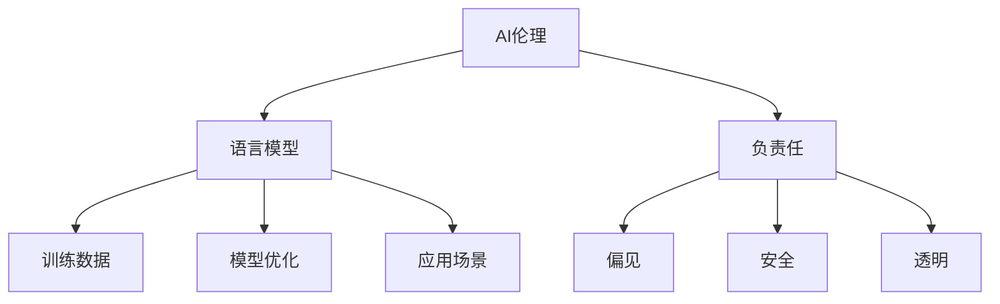

                 

# AI伦理：构建负责任的语言模型

> 关键词：AI伦理, 语言模型, 负责任, 偏见, 安全, 透明, 解释性

## 1. 背景介绍

### 1.1 问题由来

随着人工智能技术的飞速发展，语言模型在自然语言处理（Natural Language Processing, NLP）、智能客服、语音识别、机器翻译等多个领域大放异彩。其中，基于深度学习的语言模型，如BERT、GPT等，已经展现出强大的语言理解和生成能力，极大地推动了人工智能的产业化进程。然而，随之而来的是对于语言模型伦理责任的广泛关注和深入讨论。

### 1.2 问题核心关键点

语言模型在提升社会效率、便利人们生活的同时，也可能传播错误信息、加剧社会偏见、侵害用户隐私、引发伦理困境。例如，某些语言模型在预测和生成文本时，可能无意中强化了性别、种族等社会偏见，造成对少数群体的歧视。因此，如何构建负责任的语言模型，成为当前AI技术发展的迫切需求。

### 1.3 问题研究意义

构建负责任的语言模型不仅有助于保护用户权益，避免模型偏见和歧视，还能够在维护社会公平、推动可持续发展方面发挥重要作用。此外，负责任的语言模型还能够增强公众对AI技术的信任，促进技术普及和应用。

## 2. 核心概念与联系

### 2.1 核心概念概述

要构建负责任的语言模型，首先需要理解一些关键概念：

- **AI伦理**：研究如何设计和使用AI技术，使之符合人类价值观、法律法规和伦理道德。
- **语言模型**：基于深度学习模型，如RNN、LSTM、Transformer等，通过对大规模语料进行训练，学习语言的表示和生成能力。
- **负责任**：指模型设计和使用过程中应遵循的伦理原则，如公平性、透明性、可解释性、隐私保护等。
- **偏见**：指模型在训练和应用过程中，不公平地对待某些群体或个体。
- **安全**：确保模型在运行过程中不会对个人或社会造成直接或间接伤害。
- **透明**：模型应具有可解释性，使用户能够理解其工作原理和决策逻辑。

这些概念之间的逻辑关系可以通过以下Mermaid流程图来展示：



这个流程图展示了一些核心概念及其之间的关系：

1. AI伦理是构建负责任的语言模型的根本原则。
2. 语言模型是实现负责任AI的关键技术手段。
3. 负责任是指语言模型在设计和使用中应遵循的伦理规范。
4. 偏见和安全是负责任语言模型的重要考量因素。
5. 透明是语言模型负责任的重要表现形式。
6. 训练数据和模型优化是实现负责任语言模型的关键步骤。
7. 应用场景是语言模型负责任的最终检验点。

## 3. 核心算法原理 & 具体操作步骤

### 3.1 算法原理概述

构建负责任的语言模型，需要综合考虑以下几个核心算法原理：

1. **公平性**：通过数据集多样性增强和公平性算法，确保模型在处理不同群体时，不产生系统性的偏见。
2. **透明度**：利用可解释性模型和公平性解释工具，使模型的工作原理和决策过程可解释。
3. **隐私保护**：采用差分隐私和数据匿名化技术，保护用户隐私不被侵犯。
4. **安全机制**：引入对抗样本和鲁棒性检测，增强模型的安全性。
5. **持续监控与改进**：建立模型监控机制，及时发现并修正模型中的潜在问题。

### 3.2 算法步骤详解

1. **数据预处理**：选择合适的数据集，确保其具有代表性，并进行数据清洗、去重等预处理。
2. **公平性优化**：使用公平性约束算法，如逆比例采样、权重重新分配等，确保训练数据分布公平。
3. **模型训练**：选择合适的模型架构和优化器，进行模型训练。
4. **透明度增强**：使用可解释性技术，如Attention机制、特征重要性分析等，增强模型透明度。
5. **隐私保护设计**：采用差分隐私和数据匿名化技术，保护用户隐私。
6. **安全验证**：引入对抗样本和鲁棒性检测，确保模型安全性。
7. **模型部署与监控**：将训练好的模型部署到生产环境中，并建立监控机制，及时发现和修正问题。

### 3.3 算法优缺点

构建负责任的语言模型，具有以下优点：

1. **提升模型公平性**：通过数据处理和模型设计，能够显著减少模型中的系统性偏见，保护用户权益。
2. **增强透明度**：可解释性模型和公平性解释工具，使模型决策过程更加透明，使用户和监管者更容易理解和信任模型。
3. **强化隐私保护**：通过隐私保护技术，能够有效防止数据泄露和滥用，保护用户隐私。
4. **增强安全性**：对抗样本和鲁棒性检测技术，提高了模型的鲁棒性和安全性，减少了模型被攻击的风险。
5. **促进持续改进**：持续监控与改进机制，使模型能够不断优化，适应变化的数据分布和应用场景。

同时，也存在一些局限性：

1. **复杂度增加**：构建负责任的语言模型需要在模型设计、训练和部署等多个环节进行优化，增加了模型的复杂度。
2. **资源消耗**：对抗样本和鲁棒性检测等技术，增加了模型的计算和内存消耗，对硬件要求较高。
3. **技术挑战**：可解释性和隐私保护等技术还处于发展初期，尚未完全成熟，需要进一步研究。
4. **伦理困境**：模型设计过程中，如何平衡技术进步和伦理道德，仍然是一个挑战。

### 3.4 算法应用领域

负责任的语言模型在多个领域具有广泛的应用前景：

1. **智能客服**：通过公平性优化和隐私保护，构建智能客服系统，减少对少数群体的歧视，保护用户隐私。
2. **医疗诊断**：通过公平性和透明性设计，构建医疗诊断模型，确保医疗服务的公平性和可信度。
3. **招聘系统**：通过公平性和隐私保护，构建招聘系统，减少就业歧视，保护求职者隐私。
4. **金融风控**：通过公平性和安全机制，构建金融风控模型，减少对不同群体的歧视，保护用户财产安全。
5. **内容生成**：通过公平性和透明度设计，构建内容生成系统，避免内容偏见，保护用户权益。

## 4. 数学模型和公式 & 详细讲解

### 4.1 数学模型构建

负责任的语言模型设计涉及到多个数学模型的构建，主要包括公平性模型、可解释性模型、隐私保护模型等。

以公平性模型为例，假设训练数据集中有 $K$ 个类别，$N$ 个样本，其中第 $i$ 个样本属于第 $j$ 类，则训练数据集可表示为 $D=\{(x_i,y_i)\}_{i=1}^N, x_i \in \mathcal{X}, y_i \in \{1,2,\ldots,K\}$。

定义公平性约束函数 $f$，使得模型 $M_{\theta}$ 在处理不同类别时，不产生系统性的偏见。具体而言，可以通过最小化以下公平性约束损失函数：

$$
\mathcal{L}_{\text{fair}}(\theta) = \mathbb{E}_{(x,y) \in D} [\alpha_j \ell(M_{\theta}(x),y) + (1-\alpha_j) \ell(M_{\theta}(x),\tilde{y}_j)]
$$

其中，$\alpha_j$ 为类别 $j$ 的权重，$\ell$ 为损失函数，$\tilde{y}_j$ 为类别 $j$ 的负样本。通过调整 $\alpha_j$ 和 $\tilde{y}_j$，可以控制不同类别样本对模型损失的影响，确保模型在不同类别上的表现公平。

### 4.2 公式推导过程

以公平性模型为例，其公平性约束损失函数可以进一步推导为：

$$
\mathcal{L}_{\text{fair}}(\theta) = \frac{1}{N} \sum_{i=1}^N \sum_{j=1}^K \alpha_j [\ell(M_{\theta}(x_i),y_i) + (1-\alpha_j) \ell(M_{\theta}(x_i),\tilde{y}_j)]
$$

其中，$\tilde{y}_j$ 可以通过对 $y_i$ 进行逆比例采样或权重重新分配获得。通过最小化上述公平性约束损失函数，可以确保模型在处理不同类别时，不产生系统性的偏见。

### 4.3 案例分析与讲解

假设有一组数据集，其中男性和女性用户对推荐内容的评分存在显著差异。为了消除这种性别偏见，可以在训练过程中，为男性用户和女性用户分配不同的权重，即 $\alpha_m$ 和 $\alpha_f$。对于每个样本 $x_i$，可以分别计算其关于男性和女性的公平性约束损失函数：

$$
\mathcal{L}_{\text{fair},m}(\theta) = \frac{1}{N} \sum_{i=1}^N [\ell(M_{\theta}(x_i),y_i) + (1-\alpha_m) \ell(M_{\theta}(x_i),\tilde{y}_m)]
$$

$$
\mathcal{L}_{\text{fair},f}(\theta) = \frac{1}{N} \sum_{i=1}^N [\ell(M_{\theta}(x_i),y_i) + (1-\alpha_f) \ell(M_{\theta}(x_i),\tilde{y}_f)]
$$

通过最小化这两个公平性约束损失函数，可以确保模型在处理男性和女性用户时，不产生系统性的偏见，从而提升模型的公平性。

## 5. 项目实践：代码实例和详细解释说明

### 5.1 开发环境搭建

在进行负责任的语言模型构建和微调实践前，需要准备好开发环境。以下是使用Python进行TensorFlow开发的环境配置流程：

1. 安装Anaconda：从官网下载并安装Anaconda，用于创建独立的Python环境。

2. 创建并激活虚拟环境：
```bash
conda create -n tf-env python=3.8 
conda activate tf-env
```

3. 安装TensorFlow：根据CUDA版本，从官网获取对应的安装命令。例如：
```bash
conda install tensorflow -c tf -c conda-forge
```

4. 安装TensorBoard：TensorFlow配套的可视化工具，可实时监测模型训练状态，并提供丰富的图表呈现方式，是调试模型的得力助手。

5. 安装各类工具包：
```bash
pip install numpy pandas scikit-learn matplotlib tqdm jupyter notebook ipython
```

完成上述步骤后，即可在`tf-env`环境中开始负责任的语言模型构建和微调实践。

### 5.2 源代码详细实现

下面我们以构建一个公平性优化后的语言模型为例，给出使用TensorFlow进行公平性优化的PyTorch代码实现。

首先，定义公平性约束函数和公平性损失函数：

```python
import tensorflow as tf
import numpy as np

class FairnessConstraint:
    def __init__(self, alpha):
        self.alpha = alpha
        
    def constraint(self, logits, labels, neg_labels):
        batch_size, num_classes = logits.shape
        fairness_loss = 0
        for i in range(batch_size):
            batch_logits = logits[i]
            batch_labels = labels[i]
            batch_neg_labels = neg_labels[i]
            fairness_loss += self.alpha * tf.nn.sparse_softmax_cross_entropy_with_logits(labels=batch_labels, logits=batch_logits) + \
                             (1 - self.alpha) * tf.nn.sparse_softmax_cross_entropy_with_logits(labels=batch_neg_labels, logits=batch_logits)
        return fairness_loss
```

然后，定义语言模型：

```python
class LanguageModel(tf.keras.Model):
    def __init__(self, vocab_size, embedding_dim, num_classes):
        super(LanguageModel, self).__init__()
        self.embedding = tf.keras.layers.Embedding(vocab_size, embedding_dim)
        self.lstm = tf.keras.layers.LSTM(128, return_sequences=True)
        self.fc = tf.keras.layers.Dense(num_classes)
        
    def call(self, inputs):
        x = self.embedding(inputs)
        x = self.lstm(x)
        x = self.fc(x[:, -1])
        return x
```

接下来，定义公平性优化器：

```python
from tensorflow.keras.optimizers import Adam

optimizer = Adam(learning_rate=0.001)
```

最后，进行模型训练：

```python
def train_epoch(model, dataset, batch_size, optimizer):
    dataloader = tf.data.Dataset.from_tensor_slices(dataset).shuffle(1000).batch(batch_size)
    model.train()
    epoch_loss = 0
    for batch in dataloader:
        inputs, labels, neg_labels = batch
        with tf.GradientTape() as tape:
            logits = model(inputs)
            fairness_loss = fairness_constraint(logits, labels, neg_labels)
            total_loss = loss(logits, labels)
            gradients = tape.gradient(total_loss + fairness_loss, model.trainable_variables)
            optimizer.apply_gradients(zip(gradients, model.trainable_variables))
        epoch_loss += loss_value + fairness_loss_value
    return epoch_loss / len(dataloader)
```

在上述代码中，`LanguageModel`定义了语言模型的结构，`train_epoch`函数实现了模型训练和公平性约束优化。在模型训练过程中，通过公平性约束函数`FairnessConstraint`计算公平性损失，并将其与常规损失函数相加，得到总损失。

### 5.3 代码解读与分析

让我们再详细解读一下关键代码的实现细节：

**FairnessConstraint类**：
- `__init__`方法：初始化公平性权重 $\alpha$。
- `constraint`方法：计算公平性约束损失函数。

**LanguageModel类**：
- `__init__`方法：定义语言模型结构，包括嵌入层、LSTM层和全连接层。
- `call`方法：实现模型的前向传播。

**公平性优化器**：
- `optimizer`定义了Adam优化器，用于模型训练。

**train_epoch函数**：
- `dataloader`定义了数据集迭代器，使用`tf.data.Dataset`将数据集转换为张量。
- `logits`计算模型的预测结果。
- `fairness_loss`计算公平性约束损失函数。
- `total_loss`计算常规损失函数。
- `gradients`计算梯度，`optimizer.apply_gradients`更新模型参数。

## 6. 实际应用场景

### 6.1 智能客服系统

在智能客服系统中，语言模型需要处理大量的用户咨询请求，提供精准、公平的回复。负责任的语言模型可以避免对少数群体产生偏见，保护用户隐私，增强用户信任感。

### 6.2 医疗诊断系统

医疗诊断系统的语言模型需要处理复杂的医疗数据，如病历、检查报告等。负责任的语言模型可以确保在处理不同性别、年龄、种族等群体时，不产生系统性偏见，提高诊断的准确性和公平性。

### 6.3 招聘系统

招聘系统的语言模型需要根据简历和面试记录，筛选和推荐合适的候选人。负责任的语言模型可以避免对不同性别的候选人产生偏见，保护求职者权益，提升招聘系统的公平性和透明性。

### 6.4 内容生成系统

内容生成系统如新闻、评论等，需要根据用户偏好生成个性化内容。负责任的语言模型可以确保内容的多样性和公平性，避免对特定群体或观点产生偏见，增强系统的透明度和可信度。

## 7. 工具和资源推荐

### 7.1 学习资源推荐

为了帮助开发者系统掌握负责任的语言模型理论基础和实践技巧，这里推荐一些优质的学习资源：

1. 《负责任的AI：伦理与技术》系列博文：由AI伦理专家撰写，深入浅出地介绍了AI伦理的核心理念和前沿技术。

2. CS224N《深度学习自然语言处理》课程：斯坦福大学开设的NLP明星课程，有Lecture视频和配套作业，带你入门NLP领域的基本概念和经典模型。

3. 《负责任的AI：设计、开发与部署》书籍：全面介绍了负责任AI的设计、开发和部署过程，涵盖数据公平性、模型透明性、隐私保护等多个方面。

4. IEEE全球AI伦理标准化委员会：提供AI伦理标准和指南，帮助开发者和组织制定负责任的AI策略。

5. OpenAI《AI安全与伦理》白皮书：由OpenAI发布，深入探讨AI技术在安全与伦理方面的挑战与对策。

通过对这些资源的学习实践，相信你一定能够快速掌握负责任的语言模型技术，并用于解决实际的NLP问题。

### 7.2 开发工具推荐

高效的开发离不开优秀的工具支持。以下是几款用于负责任的语言模型开发的常用工具：

1. TensorFlow：由Google主导开发的开源深度学习框架，生产部署方便，适合大规模工程应用。同样有丰富的预训练语言模型资源。

2. PyTorch：基于Python的开源深度学习框架，灵活动态的计算图，适合快速迭代研究。大部分预训练语言模型都有PyTorch版本的实现。

3. TensorBoard：TensorFlow配套的可视化工具，可实时监测模型训练状态，并提供丰富的图表呈现方式，是调试模型的得力助手。

4. Weights & Biases：模型训练的实验跟踪工具，可以记录和可视化模型训练过程中的各项指标，方便对比和调优。

5. Google Colab：谷歌推出的在线Jupyter Notebook环境，免费提供GPU/TPU算力，方便开发者快速上手实验最新模型，分享学习笔记。

合理利用这些工具，可以显著提升负责任的语言模型开发效率，加快创新迭代的步伐。

### 7.3 相关论文推荐

负责任的语言模型研究始于学界的持续研究。以下是几篇奠基性的相关论文，推荐阅读：

1. A Framework for Fairness in Machine Learning（公平性框架论文）：提出了公平性约束算法的框架，为公平性优化提供了理论基础。

2. Explaining the Predictions of Deep Neural Networks（深度神经网络解释论文）：探讨了深度神经网络的解释性，提出了可解释性模型的设计思路。

3. Privacy-Preserving Deep Learning in a Post-Quantum World（后量子时代隐私保护论文）：介绍了差分隐私和数据匿名化技术，为隐私保护提供了方法。

4. Adversarial Examples in Deep Learning（对抗样本论文）：深入探讨了对抗样本的影响及其检测方法，为模型安全性提供了保障。

5. Fairness, Accountability, and Transparency（公平性、责任性和透明度论文）：探讨了公平性、责任性和透明性在AI系统中的重要性和实现方法。

这些论文代表了大语言模型负责任构建和优化的发展脉络。通过学习这些前沿成果，可以帮助研究者把握学科前进方向，激发更多的创新灵感。

## 8. 总结：未来发展趋势与挑战

### 8.1 总结

本文对负责任的语言模型进行了全面系统的介绍。首先阐述了负责任的语言模型在AI伦理中的重要地位和研究背景，明确了构建负责任语言模型的关键目标和实现途径。其次，从原理到实践，详细讲解了负责任的语言模型设计，包括公平性、透明度、隐私保护和安全机制等关键技术。同时，本文还广泛探讨了负责任的语言模型在智能客服、医疗诊断、招聘系统等多个行业领域的应用前景，展示了负责任AI的广阔前景。

通过本文的系统梳理，可以看到，负责任的语言模型正在成为AI技术发展的迫切需求，极大地提升了社会公平性和用户信任度，具有重要的社会价值和应用意义。未来，随着负责任AI技术的持续发展，必将进一步提升AI系统的伦理水平，推动技术在更广泛的场景下落地应用。

### 8.2 未来发展趋势

展望未来，负责任的语言模型将呈现以下几个发展趋势：

1. **模型复杂度降低**：随着算法的进步和硬件的提升，负责任的语言模型将变得更加高效、轻量级，同时不牺牲性能。

2. **数据驱动公平性**：通过数据多样性增强和公平性约束算法，将公平性嵌入模型训练过程中，提高模型的公平性和可解释性。

3. **隐私保护技术提升**：差分隐私和数据匿名化技术将进一步发展和完善，有效保护用户隐私，防止数据滥用。

4. **安全机制完善**：对抗样本检测和鲁棒性检测技术将不断进步，提高模型的安全性和鲁棒性，增强模型的可信度。

5. **解释性和可解释性增强**：可解释性模型和公平性解释工具将得到广泛应用，使用户和监管者能够更好地理解模型工作原理。

以上趋势凸显了负责任的语言模型技术的广阔前景。这些方向的探索发展，必将进一步提升AI系统的公平性、透明性和安全性，为构建人机协同的智能系统提供坚实保障。

### 8.3 面临的挑战

尽管负责任的语言模型技术已经取得了一定的进展，但在迈向更加智能化、普适化应用的过程中，它仍面临着诸多挑战：

1. **数据分布不均**：不同群体之间数据分布不均，容易导致模型在处理少数群体时产生偏差。

2. **技术局限性**：公平性约束算法、差分隐私和可解释性技术还处于发展初期，尚未完全成熟，需要进一步研究。

3. **伦理道德困境**：如何在技术进步和伦理道德之间寻找平衡，仍然是一个挑战。

4. **资源消耗高**：对抗样本和鲁棒性检测等技术，增加了模型的计算和内存消耗，对硬件要求较高。

5. **解释性和透明性不足**：当前模型的解释性和透明性还有待提升，使用户和监管者难以理解和信任模型。

6. **隐私保护风险**：尽管隐私保护技术取得了进展，但仍可能存在数据泄露和滥用的风险。

面对负责任的语言模型面临的这些挑战，未来的研究需要在以下几个方面寻求新的突破：

1. **多目标优化**：将公平性、透明性和隐私保护等多目标优化相结合，提升模型的综合性能。

2. **模型压缩和量化**：通过模型压缩和量化技术，降低模型的计算和存储需求，提高模型的部署效率。

3. **实时性增强**：利用低精度和异构计算等技术，提高模型的实时性，适应高并发、实时性要求高的应用场景。

4. **数据增强**：通过数据增强技术，增加训练数据的分布多样性，提高模型的泛化能力。

5. **用户反馈机制**：建立用户反馈机制，及时发现和修正模型中的潜在问题，提升模型的适应性和公平性。

6. **跨领域研究**：将AI伦理和伦理理论相结合，探讨AI技术的社会影响和伦理困境，推动伦理标准的制定和应用。

这些研究方向的探索，必将引领负责任的语言模型技术迈向更高的台阶，为构建安全、可靠、可解释、可控的智能系统提供坚实的理论基础和技术保障。

### 8.4 研究展望

面向未来，负责任的语言模型技术还需要与其他AI技术进行更深入的融合，如因果推理、强化学习等，多路径协同发力，共同推动负责任的AI技术的发展。只有勇于创新、敢于突破，才能不断拓展语言模型的边界，让智能技术更好地造福人类社会。

## 9. 附录：常见问题与解答

**Q1：负责任的语言模型如何避免对特定群体的偏见？**

A: 负责任的语言模型通过公平性约束算法和数据增强技术，可以显著减少对特定群体的偏见。具体而言，可以在训练过程中，为不同群体分配不同的权重，或通过对抗样本生成，增加数据多样性，从而提高模型的公平性。

**Q2：如何增强负责任的语言模型的可解释性？**

A: 可解释性模型和公平性解释工具，如Attention机制、特征重要性分析等，可以增强模型的透明度。此外，采用模型压缩和量化技术，降低模型复杂度，有助于提高模型的可解释性。

**Q3：如何保护用户隐私？**

A: 通过差分隐私和数据匿名化技术，可以将用户数据转换为噪声数据，防止数据泄露和滥用。同时，采用加密通信、访问控制等手段，加强数据保护。

**Q4：负责任的语言模型在应用过程中需要注意哪些问题？**

A: 在应用过程中，负责任的语言模型需要考虑以下几个问题：
1. 数据分布：确保数据集具有代表性，避免偏见。
2. 模型复杂度：避免过度拟合，保持模型的泛化能力。
3. 隐私保护：使用差分隐私和数据匿名化技术，保护用户隐私。
4. 安全性：引入对抗样本和鲁棒性检测，增强模型的安全性。
5. 解释性和透明性：提高模型的可解释性，使用户和监管者能够理解和信任模型。

通过解决这些问题，可以确保负责任的语言模型在实际应用中，能够有效保护用户权益，避免偏见和歧视，增强系统的公平性和可信度。

**Q5：负责任的语言模型是否适用于所有NLP任务？**

A: 负责任的语言模型在大多数NLP任务上都能取得不错的效果，特别是对于数据量较小的任务。但对于一些特定领域的任务，如医学、法律等，仅仅依靠通用语料预训练的模型可能难以很好地适应。此时需要在特定领域语料上进一步预训练，再进行微调，才能获得理想效果。此外，对于一些需要时效性、个性化很强的任务，如对话、推荐等，负责任的语言模型也需要针对性的改进优化。

通过本文的系统梳理，可以看到，负责任的语言模型正在成为AI技术发展的迫切需求，极大地提升了社会公平性和用户信任度，具有重要的社会价值和应用意义。未来，随着负责任AI技术的持续发展，必将进一步提升AI系统的公平性、透明性和安全性，为构建人机协同的智能系统提供坚实保障。相信随着学界和产业界的共同努力，负责任的语言模型技术必将在构建安全、可靠、可解释、可控的智能系统中发挥重要作用。

---

作者：禅与计算机程序设计艺术 / Zen and the Art of Computer Programming

