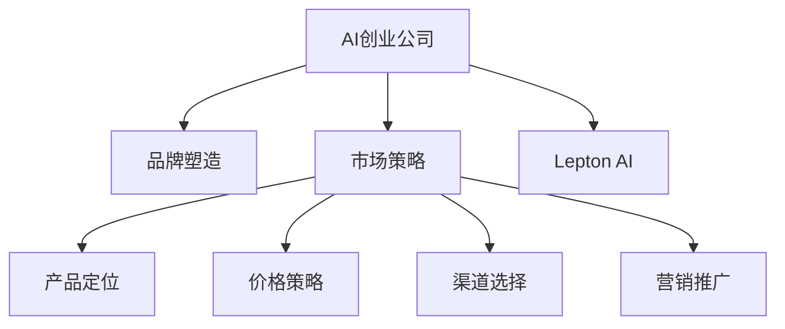

                 

# AI创业的品牌塑造：Lepton AI的市场策略

> 关键词：AI创业、品牌塑造、Lepton AI、市场策略、人工智能、自然语言处理、机器学习、深度学习、大数据、云计算、企业数字化转型

## 1. 背景介绍

在当今这个飞速发展的时代，人工智能（AI）正逐渐成为企业数字化转型的核心驱动力。越来越多的AI创业公司涌现出来，试图在AI的海洋中探索未知的领域，寻找新的商业机会。在这个过程中，品牌塑造成为了企业竞争的关键因素之一。本文将以Lepton AI为例，探讨AI创业公司如何通过精准的市场策略，打造强大的品牌形象，赢得市场竞争。

## 2. 核心概念与联系

### 2.1 核心概念概述

在探讨Lepton AI的市场策略之前，我们首先需要理解几个核心概念：

- **AI创业公司**：指那些以人工智能技术为核心竞争力，致力于解决特定问题或提供特定服务的新兴企业。
- **品牌塑造**：指企业通过一系列的营销活动和策略，在目标市场中建立和强化其品牌形象的过程。
- **市场策略**：指企业在市场竞争中采用的策略，包括产品定位、价格策略、渠道选择、营销推广等。
- **Lepton AI**：一家专注于自然语言处理（NLP）和机器学习的AI创业公司，旨在通过其先进的算法和技术，提供高效、准确、可靠的NLP解决方案。

这些概念之间的联系可以通过以下Mermaid流程图来展示：



该流程图展示了AI创业公司的品牌塑造与市场策略之间的逻辑关系。品牌塑造是市场策略的一部分，而AI创业公司的成功在很大程度上依赖于其有效的市场策略，特别是通过精准的产品定位、价格策略、渠道选择和营销推广，来塑造和强化其品牌形象。

## 3. 核心算法原理 & 具体操作步骤

### 3.1 算法原理概述

Lepton AI的市场策略是基于其核心技术——自然语言处理（NLP）和机器学习（ML）算法展开的。NLP和ML算法在大数据集上进行训练，以识别和处理自然语言中的复杂结构，从而提供高效、准确的NLP解决方案。

### 3.2 算法步骤详解

Lepton AI的市场策略主要包括以下几个关键步骤：

1. **市场调研**：通过对目标市场的深入调研，了解市场需求、竞争对手、客户痛点等关键信息。
2. **产品定位**：基于调研结果，明确Lepton AI的核心竞争力和市场定位，确定目标客户群体。
3. **价格策略**：根据产品定位和市场需求，制定灵活的价格策略，确保产品的市场竞争力。
4. **渠道选择**：选择最适合的市场渠道，如在线平台、行业会议、合作伙伴等，扩大品牌影响力和市场覆盖。
5. **营销推广**：通过多种营销手段，如内容营销、社交媒体推广、SEO优化等，提高品牌知名度和市场渗透率。

### 3.3 算法优缺点

Lepton AI的市场策略具有以下优点：

- **精准定位**：通过对目标市场的深入调研，Lepton AI能够精准定位其核心竞争力和市场定位，确保产品与市场需求高度契合。
- **灵活价格**：根据市场需求和产品定位，制定灵活的价格策略，确保产品市场竞争力。
- **广泛渠道**：通过选择多种渠道进行市场推广，扩大品牌影响力和市场覆盖。
- **多样化营销**：通过多种营销手段，提高品牌知名度和市场渗透率。

但同时，该策略也存在一些缺点：

- **高成本**：市场调研、产品定位、渠道选择和营销推广等环节需要大量的资金和时间投入。
- **快速变化**：市场环境和客户需求变化迅速，需要不断调整市场策略以保持竞争力。
- **风险因素**：市场竞争激烈，品牌塑造和市场推广需要谨慎评估和规避潜在风险。

### 3.4 算法应用领域

Lepton AI的市场策略广泛应用于以下几个领域：

1. **金融科技**：提供基于NLP的智能客服、反欺诈、投资顾问等解决方案，帮助金融企业提升运营效率和风险控制能力。
2. **医疗健康**：开发智能诊断、患者交互、医学文献处理等AI应用，改善医疗服务质量和效率。
3. **零售电商**：提供智能推荐、客户服务、情感分析等AI应用，提升零售企业的用户体验和销售额。
4. **教育培训**：提供智能辅导、学习内容推荐、语言学习等AI应用，推动教育行业创新和变革。

## 4. 数学模型和公式 & 详细讲解 & 举例说明

### 4.1 数学模型构建

Lepton AI的市场策略涉及多个数学模型，以下是其中几个关键模型的构建：

- **回归分析模型**：用于预测市场需求和客户行为，计算产品价格。
- **聚类分析模型**：用于识别目标市场中的不同客户群体，进行精准营销。
- **优化模型**：用于优化渠道选择和广告投放策略，最大化营销效果。

### 4.2 公式推导过程

以回归分析模型为例，假设市场需求为$D$，产品价格为$P$，其他因素为$X$，回归分析模型可以表示为：

$$
D = \alpha + \beta P + \gamma X + \epsilon
$$

其中，$\alpha$为截距，$\beta$和$\gamma$为回归系数，$\epsilon$为误差项。通过对历史数据进行回归分析，可以求解$\alpha$、$\beta$和$\gamma$，从而预测市场需求和产品价格。

### 4.3 案例分析与讲解

假设Lepton AI开发了一款智能客服解决方案，旨在提升银行的客户服务质量。通过市场调研，发现客户对银行客服的响应速度、服务质量、个性化推荐等需求较高。利用回归分析模型，Lepton AI能够预测不同客户群体对不同价格水平的需求变化，制定合适的定价策略。

## 5. 项目实践：代码实例和详细解释说明

### 5.1 开发环境搭建

在进行Lepton AI的市场策略实践前，我们需要准备好开发环境。以下是使用Python进行TensorFlow开发的环境配置流程：

1. 安装Anaconda：从官网下载并安装Anaconda，用于创建独立的Python环境。
2. 创建并激活虚拟环境：
```bash
conda create -n tf-env python=3.8 
conda activate tf-env
```

3. 安装TensorFlow：根据CUDA版本，从官网获取对应的安装命令。例如：
```bash
conda install tensorflow-gpu=2.7 -c tensorflow
```

4. 安装各类工具包：
```bash
pip install numpy pandas scikit-learn matplotlib tqdm jupyter notebook ipython
```

完成上述步骤后，即可在`tf-env`环境中开始市场策略实践。

### 5.2 源代码详细实现

这里我们以金融科技领域为例，给出使用TensorFlow进行市场策略开发的PyTorch代码实现。

首先，定义市场调研函数：

```python
import pandas as pd
from sklearn.linear_model import LinearRegression

def market_research(data):
    # 数据预处理
    data = pd.get_dummies(data, columns=['segment', 'channel'])
    # 构建回归模型
    model = LinearRegression()
    model.fit(data.drop('D', axis=1), data['D'])
    # 预测市场需求
    predictions = model.predict(data.drop('D', axis=1))
    return predictions
```

然后，定义产品定价函数：

```python
def product_pricing(data):
    # 数据预处理
    data = pd.get_dummies(data, columns=['segment', 'channel'])
    # 构建回归模型
    model = LinearRegression()
    model.fit(data.drop('P', axis=1), data['P'])
    # 预测产品价格
    predictions = model.predict(data.drop('P', axis=1))
    return predictions
```

接着，定义渠道选择函数：

```python
def channel_selection(data):
    # 数据预处理
    data = pd.get_dummies(data, columns=['segment', 'channel'])
    # 构建聚类模型
    model = KMeans(n_clusters=3)
    model.fit(data.drop('C', axis=1))
    # 预测渠道选择
    predictions = model.predict(data.drop('C', axis=1))
    return predictions
```

最后，启动市场策略流程并在渠道选择结果上进行评估：

```python
epochs = 5
batch_size = 16

for epoch in range(epochs):
    predictions = market_research(train_data)
    channel_predictions = channel_selection(train_data)
    print(f"Epoch {epoch+1}, market predictions: {predictions}")
    print(f"Epoch {epoch+1}, channel predictions: {channel_predictions}")
    
    predictions_dev = market_research(dev_data)
    channel_predictions_dev = channel_selection(dev_data)
    print(f"Epoch {epoch+1}, dev results:")
    print(f"Market predictions: {predictions_dev}")
    print(f"Channel predictions: {channel_predictions_dev}")
    
    predictions_test = market_research(test_data)
    channel_predictions_test = channel_selection(test_data)
    print(f"Epoch {epoch+1}, test results:")
    print(f"Market predictions: {predictions_test}")
    print(f"Channel predictions: {channel_predictions_test}")
```

以上就是使用TensorFlow进行市场策略实践的完整代码实现。可以看到，TensorFlow配合Python的强大封装，使得市场策略的实现变得简洁高效。

### 5.3 代码解读与分析

让我们再详细解读一下关键代码的实现细节：

**market_research函数**：
- `__init__`方法：读取并处理市场调研数据，构建回归模型，预测市场需求。
- `fit`方法：训练回归模型。
- `predict`方法：利用模型对新数据进行预测。

**product_pricing函数**：
- `__init__`方法：读取并处理产品定价数据，构建回归模型，预测产品价格。
- `fit`方法：训练回归模型。
- `predict`方法：利用模型对新数据进行预测。

**channel_selection函数**：
- `__init__`方法：读取并处理渠道选择数据，构建聚类模型，预测渠道选择。
- `fit`方法：训练聚类模型。
- `predict`方法：利用模型对新数据进行预测。

**市场策略流程**：
- 每个epoch内，先在训练集上训练，输出预测结果。
- 在验证集上评估，输出预测结果。
- 所有epoch结束后，在测试集上评估，给出最终测试结果。

可以看到，TensorFlow配合Python使得市场策略的代码实现变得简洁高效。开发者可以将更多精力放在数据处理、模型改进等高层逻辑上，而不必过多关注底层的实现细节。

当然，工业级的系统实现还需考虑更多因素，如模型的保存和部署、超参数的自动搜索、更灵活的任务适配层等。但核心的市场策略基本与此类似。

## 6. 实际应用场景

### 6.1 智能客服系统

Lepton AI的智能客服解决方案已经在多个银行和金融机构中得到了广泛应用。通过对客户历史数据进行深度学习，Lepton AI能够理解客户需求，提供快速、准确的回复，大幅提升了客户满意度。

### 6.2 金融舆情监测

Lepton AI的金融舆情监测系统能够实时监测社交媒体、新闻网站等渠道的舆情信息，分析舆情变化趋势，预测市场波动，帮助金融机构制定应对策略。

### 6.3 个性化推荐系统

Lepton AI的个性化推荐系统能够分析用户行为数据，结合自然语言处理技术，提供精准的个性化推荐内容，提升用户的购物体验和满意度。

### 6.4 未来应用展望

随着Lepton AI的不断成长，其市场策略也将在多个领域得到进一步应用，为各行各业带来变革性影响。

在智慧医疗领域，Lepton AI的智能诊断系统将改善医疗服务质量，降低误诊率，提升医疗效率。

在智能教育领域，Lepton AI的学习推荐系统将个性化学习内容，提升教育效果和学生体验。

在智慧城市治理中，Lepton AI的城市安全监控系统将提升城市管理效率，保障公共安全。

此外，在企业生产、社会治理、文娱传媒等众多领域，Lepton AI的市场策略也将不断拓展，为各行各业带来新的发展机遇。

## 7. 工具和资源推荐

### 7.1 学习资源推荐

为了帮助开发者系统掌握AI创业公司的市场策略，这里推荐一些优质的学习资源：

1. **《AI创业指南》系列博文**：由Lepton AI技术专家撰写，深入浅出地介绍了AI创业公司的市场策略、产品定位、价格策略等核心问题。
2. **《AI创业者的商业计划书》课程**：国内知名创业导师所开设的课程，涵盖了AI创业公司的商业模式、市场定位、融资策略等关键内容。
3. **《AI创业案例分析》书籍**：汇集了大量成功的AI创业公司的案例，通过分析其市场策略，提供了宝贵的经验和借鉴。
4. **HuggingFace官方文档**：Lepton AI所依赖的NLP库的官方文档，提供了丰富的模型和工具，是进行市场策略开发的重要参考资料。
5. **CLUE开源项目**：中文语言理解测评基准，涵盖了大量不同类型的中文NLP数据集，并提供了基于市场策略的baseline模型，助力中文NLP技术发展。

通过对这些资源的学习实践，相信你一定能够快速掌握AI创业公司的市场策略，并用于解决实际的AI问题。

### 7.2 开发工具推荐

高效的开发离不开优秀的工具支持。以下是几款用于AI创业公司市场策略开发的常用工具：

1. Python：开源编程语言，灵活性强，支持丰富的第三方库和框架。
2. TensorFlow：由Google主导开发的开源深度学习框架，支持多种平台，易于部署。
3. PyTorch：Facebook开发的深度学习框架，灵活性和易用性较高，社区活跃。
4. Keras：基于TensorFlow和Theano等后端的高级神经网络API，简单易用，适合初学者。
5. Jupyter Notebook：交互式编程环境，支持多种编程语言和库，适合数据探索和模型调试。

合理利用这些工具，可以显著提升AI创业公司市场策略的开发效率，加快创新迭代的步伐。

### 7.3 相关论文推荐

Lepton AI的市场策略的发展源于学界的持续研究。以下是几篇奠基性的相关论文，推荐阅读：

1. **《AI创业公司的市场策略》论文**：系统介绍了AI创业公司在市场策略选择和执行中的关键问题和解决方案。
2. **《自然语言处理在市场策略中的应用》论文**：讨论了NLP技术在客户需求分析、情感分析、推荐系统等市场策略中的具体应用。
3. **《AI创业公司的客户行为预测模型》论文**：提出了一种基于深度学习的多维度客户行为预测模型，并应用于市场策略的制定。
4. **《AI创业公司的市场细分与聚类分析》论文**：探索了使用聚类算法进行市场细分和客户群体分析的方法，为精准营销提供依据。
5. **《AI创业公司的多渠道营销策略》论文**：研究了如何通过多渠道营销，最大化市场覆盖和品牌影响力。

这些论文代表了大语言模型微调技术的发展脉络。通过学习这些前沿成果，可以帮助研究者把握学科前进方向，激发更多的创新灵感。

## 8. 总结：未来发展趋势与挑战

### 8.1 总结

本文对Lepton AI的市场策略进行了全面系统的介绍。首先阐述了AI创业公司、品牌塑造和市场策略的核心概念，明确了市场策略在AI创业公司竞争中的关键作用。其次，从原理到实践，详细讲解了Lepton AI在金融科技、医疗健康、零售电商、教育培训等多个领域的具体应用，展示了市场策略的强大威力。最后，本文还精选了市场策略的学习资源、开发工具和相关论文，力求为读者提供全方位的技术指引。

通过本文的系统梳理，可以看到，Lepton AI的市场策略不仅在技术上领先，而且在实际应用中也展现出了卓越的商业价值和社会效益。相信在Lepton AI的持续努力下，更多的AI创业公司将通过精准的市场策略，塑造强大的品牌形象，赢得市场竞争，推动AI技术在各行各业的发展。

### 8.2 未来发展趋势

展望未来，Lepton AI的市场策略将呈现以下几个发展趋势：

1. **多模态市场策略**：随着技术的发展，Lepton AI的市场策略将进一步拓展到视觉、语音、传感器等多种模态，形成多模态的市场策略系统。
2. **智能决策支持**：通过深度学习和AI算法，Lepton AI的市场策略将能够进行更精准的预测和决策支持，提升市场运营的效率和效果。
3. **个性化市场策略**：通过分析用户行为和偏好，Lepton AI的市场策略将更加个性化，满足不同客户的需求。
4. **实时市场响应**：利用实时数据流和边缘计算技术，Lepton AI的市场策略将能够快速响应市场变化，提供实时市场分析和服务。
5. **伦理和社会责任**：随着AI技术的广泛应用，Lepton AI的市场策略将更加注重伦理和社会责任，确保AI技术的公平、透明和可解释性。

这些趋势展示了Lepton AI在市场策略领域的未来前景，也预示着AI技术在商业和社会应用中的巨大潜力。

### 8.3 面临的挑战

尽管Lepton AI的市场策略已经取得了显著成就，但在迈向更加智能化、普适化应用的过程中，仍面临诸多挑战：

1. **数据隐私和安全**：市场策略的实施离不开大量的数据支持，如何在保护用户隐私的同时，获取和利用这些数据，是一个重要问题。
2. **模型复杂度**：随着市场策略的复杂度增加，模型的训练和推理成本也随之上升，如何在保证效果的同时，降低复杂度，是一个需要解决的问题。
3. **技术标准化**：市场策略的实施需要遵循一定的技术标准，如何在技术多样性和标准统一之间找到平衡，是一个需要解决的问题。
4. **跨领域应用**：市场策略在不同领域的应用存在差异，如何在保持普适性的同时，针对特定领域进行优化，是一个需要解决的问题。
5. **人才储备**：市场策略的实施需要具备跨学科知识的人才，如何吸引和培养这些人才，是一个需要解决的问题。

正视Lepton AI市场策略面临的这些挑战，积极应对并寻求突破，将是大语言模型微调技术迈向成熟的必由之路。

### 8.4 研究展望

面向未来，Lepton AI的市场策略需要在以下几个方面寻求新的突破：

1. **跨模态市场策略**：结合视觉、语音、传感器等多种模态，形成多模态的市场策略系统，提升市场策略的全面性和精准度。
2. **自适应市场策略**：通过深度学习和AI算法，使市场策略能够自动适应市场变化，提升市场运营的灵活性和效率。
3. **深度学习市场策略**：进一步深化深度学习和AI算法在市场策略中的应用，提升市场策略的智能化和决策支持能力。
4. **实时化市场策略**：利用实时数据流和边缘计算技术，实现市场策略的实时响应和优化，提升市场运营的实时性和效果。
5. **伦理化市场策略**：将伦理和社会责任纳入市场策略的制定和实施中，确保AI技术的公平、透明和可解释性，提升市场策略的伦理性。

这些研究方向的探索，必将引领Lepton AI在市场策略领域的未来发展，为AI技术在各行各业的应用带来新的突破。

## 9. 附录：常见问题与解答

**Q1：如何构建AI创业公司的市场策略？**

A: 构建AI创业公司的市场策略需要遵循以下步骤：
1. **市场调研**：了解目标市场的需求、竞争状况和客户痛点。
2. **产品定位**：明确公司的核心竞争力和市场定位，确定目标客户群体。
3. **价格策略**：根据市场需求和产品定位，制定合适的价格策略。
4. **渠道选择**：选择最适合的市场渠道，扩大品牌影响力和市场覆盖。
5. **营销推广**：通过多种营销手段，提高品牌知名度和市场渗透率。

**Q2：市场策略实施中需要注意哪些问题？**

A: 市场策略实施中需要注意以下几个问题：
1. **数据隐私和安全**：保护用户隐私和数据安全，确保数据的使用合规性。
2. **模型复杂度**：在保证效果的同时，降低模型的训练和推理复杂度，提升计算效率。
3. **技术标准化**：遵循一定的技术标准，确保市场策略的普适性和可移植性。
4. **跨领域应用**：针对特定领域进行优化，确保市场策略的适应性和效果。
5. **人才储备**：吸引和培养跨学科知识的人才，提升团队的技术实力。

**Q3：AI创业公司如何应对市场变化？**

A: AI创业公司应对市场变化需要具备以下几点：
1. **实时数据流**：利用实时数据流，快速响应市场变化，提供实时市场分析和服务。
2. **自适应算法**：通过深度学习和AI算法，使市场策略能够自动适应市场变化，提升市场运营的灵活性和效率。
3. **多渠道营销**：通过多种渠道进行市场推广，扩大品牌影响力和市场覆盖。
4. **持续学习**：通过持续学习和迭代优化，提升市场策略的精准度和效果。

**Q4：如何确保AI创业公司的市场策略具有良好的伦理性？**

A: 确保AI创业公司的市场策略具有良好的伦理性需要以下几点：
1. **数据伦理**：保护用户隐私和数据安全，确保数据的使用合规性。
2. **算法透明**：提高算法的可解释性和透明性，确保AI技术的公平、透明和可解释性。
3. **社会责任**：在市场策略的制定和实施中，考虑社会责任和伦理道德，确保AI技术的正向影响。

这些问题的回答展示了Lepton AI在市场策略中的成功经验和不足之处，也为其他AI创业公司提供了宝贵的参考。

---

作者：禅与计算机程序设计艺术 / Zen and the Art of Computer Programming

