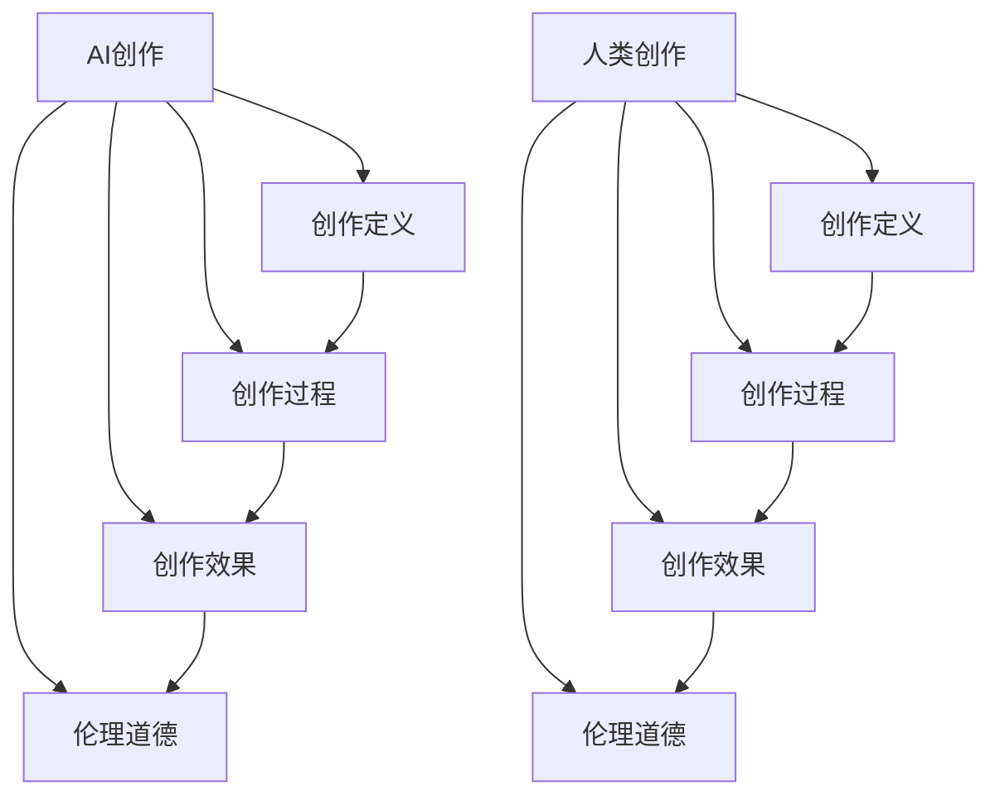

                 

# AI创作vs人类创作：界限与融合

在技术日新月异的今天，人工智能（AI）与人类创作之间的界限变得愈发模糊。AI创作，即通过计算机程序和算法生成的创作物，正日益成为人类创作的重要补充和延伸。本文将深入探讨AI创作与人类创作之间的界限，并分析二者如何相互融合，推动文化艺术与科技的交叉发展。

## 1. 背景介绍

### 1.1 问题由来

AI创作的概念最初源于计算机科学领域。随着深度学习、自然语言处理、计算机视觉等技术的快速发展，AI创作开始涉及文学、音乐、绘画、设计等多个领域。这些创作物的生成不仅提高了效率，还带来了新的创作形式和可能性。

然而，AI创作与人类创作之间存在显著差异。人类创作通常伴随着情感、直觉、主观经验等因素，具有独特性和创造性。而AI创作则更多依赖于算法和数据，可能缺乏这种深层次的情感和个性。这种差异引发了广泛的社会讨论，也催生了AI创作是否会取代人类创作的疑问。

### 1.2 问题核心关键点

探讨AI创作与人类创作的界限与融合，主要集中在以下几个关键点上：
- **创作定义**：如何定义创作？AI创作是否为创作？
- **创作过程**：AI创作与人类创作的过程有何异同？
- **创作效果**：AI创作是否能达到人类创作的效果？
- **伦理道德**：AI创作涉及的伦理和道德问题有哪些？

## 2. 核心概念与联系

### 2.1 核心概念概述

为更好地理解AI创作与人类创作的界限和融合，本节将介绍几个密切相关的核心概念：

- **AI创作**：通过计算机算法生成的创作物，如AI绘画、AI音乐、AI文学等。
- **人类创作**：由人类主观经验和情感驱动的创作过程，如文学创作、绘画、音乐演奏等。
- **创作定义**：通常指通过构思、表达和交流实现原创作品的过程。
- **创作过程**：从构思、创作到完成的整个流程，涉及技术、情感、文化等多个方面。
- **创作效果**：作品的原创性、情感深度、艺术价值等综合评价标准。
- **伦理道德**：创作过程中的伦理规范和道德责任，如版权问题、隐私保护等。

这些核心概念之间的关系可以用以下Mermaid流程图来展示：



这个流程图展示了AI创作与人类创作在定义、过程、效果和伦理道德等方面的联系。

## 3. 核心算法原理 & 具体操作步骤

### 3.1 算法原理概述

AI创作的算法原理主要包括：

- **生成对抗网络(GANs)**：通过两个神经网络对抗训练，生成与真实数据难以区分的伪造数据。
- **变分自编码器(VAEs)**：通过优化损失函数，生成与原始数据分布相似的样本。
- **语言模型**：如Transformer、GPT等，通过大量文本数据训练，生成连贯、自然的文本。

这些算法的核心在于利用数据和算法生成创作物，并通过不断迭代优化，提高创作物的质量。

### 3.2 算法步骤详解

以生成对抗网络为例，生成对抗网络的基本步骤如下：

1. **初始化**：选择生成器网络 $G$ 和判别器网络 $D$，并进行初始化。
2. **对抗训练**：通过不断交替训练 $G$ 和 $D$，使得 $G$ 能够生成与 $D$ 难以区分的样本，$D$ 能够准确判断样本的真实性。
3. **损失函数**：定义生成器和判别器的损失函数，并进行优化。
4. **生成创作物**：通过训练好的 $G$ 网络，生成高质量的创作物。

以下是详细的代码实现步骤：

**Step 1: 准备数据集**

```python
import torch
from torch.utils.data import DataLoader
from torchvision import datasets, transforms

# 加载MNIST数据集
train_dataset = datasets.MNIST(root='./data', train=True, download=True, transform=transforms.ToTensor())
test_dataset = datasets.MNIST(root='./data', train=False, download=True, transform=transforms.ToTensor())

# 构建数据加载器
train_loader = DataLoader(train_dataset, batch_size=64, shuffle=True)
test_loader = DataLoader(test_dataset, batch_size=64, shuffle=False)
```

**Step 2: 定义生成器和判别器网络**

```python
import torch.nn as nn
import torch.nn.functional as F

class Generator(nn.Module):
    def __init__(self):
        super(Generator, self).__init__()
        self.main = nn.Sequential(
            nn.Linear(100, 256),
            nn.ReLU(),
            nn.Linear(256, 512),
            nn.ReLU(),
            nn.Linear(512, 28*28),
            nn.Tanh()
        )
    
    def forward(self, x):
        return self.main(x)

class Discriminator(nn.Module):
    def __init__(self):
        super(Discriminator, self).__init__()
        self.main = nn.Sequential(
            nn.Linear(28*28, 512),
            nn.LeakyReLU(0.2),
            nn.Linear(512, 256),
            nn.LeakyReLU(0.2),
            nn.Linear(256, 1),
            nn.Sigmoid()
        )
    
    def forward(self, x):
        return self.main(x)
```

**Step 3: 定义损失函数和优化器**

```python
# 定义损失函数
def D_loss(real, fake):
    return -torch.mean(torch.log(real)) - torch.mean(torch.log(1 - fake))

def G_loss(fake, real):
    return -torch.mean(torch.log(fake)) + torch.mean(torch.log(1 - real))

# 定义优化器
G_optimizer = torch.optim.Adam(g_net.parameters(), lr=0.0002)
D_optimizer = torch.optim.Adam(d_net.parameters(), lr=0.0002)
```

**Step 4: 训练生成对抗网络**

```python
# 定义训练函数
def train_GAN(model, train_loader, num_epochs, batch_size, lr):
    for epoch in range(num_epochs):
        for i, (real_images, _) in enumerate(train_loader):
            real_images = real_images.view(real_images.size(0), -1)
            fake_images = model.G(real_images)
            d_real = model.D(real_images)
            d_fake = model.D(fake_images)
            d_loss_real = D_loss(d_real, real_images)
            d_loss_fake = D_loss(d_fake, fake_images)
            g_loss_fake = G_loss(d_fake, real_images)
            g_loss_real = G_loss(d_real, fake_images)
            d_optimizer.zero_grad()
            g_optimizer.zero_grad()
            d_loss_real.backward(d_loss_real)
            d_loss_fake.backward(d_loss_fake)
            g_loss_fake.backward(g_loss_fake)
            g_loss_real.backward(g_loss_real)
            D_optimizer.step()
            G_optimizer.step()
            if i % 10 == 0:
                print(f"Epoch [{epoch+1}/{num_epochs}], Step [{i+1}/{len(train_loader)}], D loss: {d_loss_real:.4f}, G loss: {g_loss_fake:.4f}")
```

### 3.3 算法优缺点

AI创作与人类创作的比较，可以从以下几个方面进行：

**优点**：
- **高效性**：AI创作可以快速生成大量作品，节省时间和人力成本。
- **多样性**：AI创作能够尝试各种风格和形式，突破人类创作的局限。
- **持续创新**：AI创作可以不断迭代优化，产生新颖的作品。

**缺点**：
- **缺乏情感**：AI创作可能缺乏人类创作中的情感和个性。
- **质量控制**：AI创作的质量和效果依赖于算法和数据，可能存在偏差。
- **伦理问题**：AI创作可能涉及版权、隐私等伦理问题。

### 3.4 算法应用领域

AI创作已经在多个领域得到应用，包括：

- **艺术创作**：如AI绘画、AI音乐、AI文学等。
- **建筑设计**：利用AI生成建筑设计方案。
- **产品设计**：利用AI生成新产品设计草图。
- **内容创作**：如AI新闻生成、AI视频剪辑等。

## 4. 数学模型和公式 & 详细讲解 & 举例说明

### 4.1 数学模型构建

以生成对抗网络为例，其数学模型可以表示为：

1. **生成器模型**：
   $$
   G(z) = W_2 \sigma(W_1 z + b_1) + b_2
   $$
   其中，$z$ 为随机噪声向量，$\sigma$ 为激活函数。

2. **判别器模型**：
   $$
   D(x) = W_4 \phi(W_3 \phi(W_2 x + b_2) + b_3) + b_4
   $$
   其中，$x$ 为输入数据，$\phi$ 为激活函数。

### 4.2 公式推导过程

在生成对抗网络中，生成器和判别器通过对抗训练优化损失函数：

1. **生成器的损失函数**：
   $$
   L_G = E_{z \sim p(z)} [-\log D(G(z))]
   $$

2. **判别器的损失函数**：
   $$
   L_D = E_{x \sim p(x)} [\log D(x)] + E_{z \sim p(z)} [-\log (1 - D(G(z)))]
   $$

### 4.3 案例分析与讲解

以MNIST手写数字数据集为例，分析生成对抗网络的训练过程。训练过程中，生成器通过优化损失函数，生成逼真的手写数字图像，判别器通过优化损失函数，准确判断图像的真实性。通过不断迭代训练，生成器和判别器互相博弈，最终生成器能够生成高质量的伪造手写数字图像。

## 5. 项目实践：代码实例和详细解释说明

### 5.1 开发环境搭建

在进行AI创作实践前，我们需要准备好开发环境。以下是使用Python进行PyTorch开发的环境配置流程：

1. 安装Anaconda：从官网下载并安装Anaconda，用于创建独立的Python环境。

2. 创建并激活虚拟环境：
```bash
conda create -n pytorch-env python=3.8 
conda activate pytorch-env
```

3. 安装PyTorch：根据CUDA版本，从官网获取对应的安装命令。例如：
```bash
conda install pytorch torchvision torchaudio cudatoolkit=11.1 -c pytorch -c conda-forge
```

4. 安装TensorFlow：由Google主导开发的开源深度学习框架，生产部署方便，适合大规模工程应用。同样有丰富的预训练语言模型资源。

5. 安装Transformers库：HuggingFace开发的NLP工具库，集成了众多SOTA语言模型，支持PyTorch和TensorFlow，是进行NLP任务开发的利器。

6. 安装各类工具包：
```bash
pip install numpy pandas scikit-learn matplotlib tqdm jupyter notebook ipython
```

完成上述步骤后，即可在`pytorch-env`环境中开始AI创作实践。

### 5.2 源代码详细实现

这里我们以生成对抗网络生成手写数字图像为例，给出使用PyTorch实现的完整代码。

```python
import torch
import torch.nn as nn
import torch.nn.functional as F
from torchvision import datasets, transforms

class Generator(nn.Module):
    def __init__(self):
        super(Generator, self).__init__()
        self.main = nn.Sequential(
            nn.Linear(100, 256),
            nn.ReLU(),
            nn.Linear(256, 512),
            nn.ReLU(),
            nn.Linear(512, 28*28),
            nn.Tanh()
        )
    
    def forward(self, x):
        return self.main(x)

class Discriminator(nn.Module):
    def __init__(self):
        super(Discriminator, self).__init__()
        self.main = nn.Sequential(
            nn.Linear(28*28, 512),
            nn.LeakyReLU(0.2),
            nn.Linear(512, 256),
            nn.LeakyReLU(0.2),
            nn.Linear(256, 1),
            nn.Sigmoid()
        )
    
    def forward(self, x):
        return self.main(x)

# 定义训练函数
def train_GAN(model, train_loader, num_epochs, batch_size, lr):
    for epoch in range(num_epochs):
        for i, (real_images, _) in enumerate(train_loader):
            real_images = real_images.view(real_images.size(0), -1)
            fake_images = model.G(real_images)
            d_real = model.D(real_images)
            d_fake = model.D(fake_images)
            d_loss_real = D_loss(d_real, real_images)
            d_loss_fake = D_loss(d_fake, fake_images)
            g_loss_fake = G_loss(d_fake, real_images)
            g_loss_real = G_loss(d_real, fake_images)
            d_optimizer.zero_grad()
            g_optimizer.zero_grad()
            d_loss_real.backward(d_loss_real)
            d_loss_fake.backward(d_loss_fake)
            g_loss_fake.backward(g_loss_fake)
            g_loss_real.backward(g_loss_real)
            D_optimizer.step()
            G_optimizer.step()
            if i % 10 == 0:
                print(f"Epoch [{epoch+1}/{num_epochs}], Step [{i+1}/{len(train_loader)}], D loss: {d_loss_real:.4f}, G loss: {g_loss_fake:.4f}")
```

### 5.3 代码解读与分析

让我们再详细解读一下关键代码的实现细节：

**GAN实现步骤**：
- **定义生成器和判别器网络**：生成器和判别器网络采用多层感知机（MLP）结构，通过多次卷积和激活函数实现。
- **定义损失函数和优化器**：生成器和判别器的损失函数分别用于训练自身，优化器采用Adam算法进行参数更新。
- **训练生成对抗网络**：在训练过程中，生成器和判别器交替训练，不断优化自身参数，最终生成高质量的伪造手写数字图像。

**训练过程**：
- **加载数据集**：使用PyTorch内置的MNIST数据集，将手写数字图像转换为向量形式。
- **定义生成器和判别器网络**：生成器通过多层感知机生成手写数字图像，判别器通过多层感知机判断图像的真实性。
- **定义损失函数和优化器**：生成器和判别器的损失函数采用对抗损失函数，优化器采用Adam算法进行参数更新。
- **训练生成对抗网络**：通过不断迭代训练，生成器和判别器互相博弈，最终生成高质量的伪造手写数字图像。

## 6. 实际应用场景

### 6.1 智能创作系统

智能创作系统可以应用于多种领域，如文学创作、艺术创作、建筑设计等。智能创作系统通过分析用户需求，利用AI技术生成符合要求的创作物，可以极大地提升创作效率，丰富创作形式。

在文学创作方面，智能创作系统可以根据用户的写作风格和主题，生成符合要求的文章、小说等。在艺术创作方面，智能创作系统可以生成各种风格的画作、音乐等。

### 6.2 广告设计

广告设计是创意和技术的融合，AI创作在广告设计中的应用尤为广泛。通过分析用户的兴趣爱好，AI创作可以生成符合要求的广告文案、图像等，提高广告的吸引力和转化率。

### 6.3 视频制作

视频制作通常需要大量的创意和编辑工作，AI创作可以辅助视频制作过程，生成高质量的视频素材和剪辑方案。

## 7. 工具和资源推荐

### 7.1 学习资源推荐

为了帮助开发者系统掌握AI创作的技术基础和实践技巧，这里推荐一些优质的学习资源：

1. 《深度学习》系列书籍：深入浅出地介绍了深度学习的基本概念和实现方法。
2. 《计算机视觉：算法与应用》书籍：系统介绍了计算机视觉的各个方面，包括图像生成、目标检测、图像分割等。
3. 《自然语言处理综论》课程：斯坦福大学开设的NLP明星课程，涵盖自然语言处理的基本概念和前沿技术。
4. Coursera《AI创作》课程：涵盖AI创作的基本原理和实现方法，适合初学者入门。
5. GitHub开源项目：大量的AI创作项目和代码实现，可以快速学习AI创作的基本流程和实现细节。

通过对这些资源的学习实践，相信你一定能够快速掌握AI创作的核心技术，并用于解决实际的创作问题。

### 7.2 开发工具推荐

高效的开发离不开优秀的工具支持。以下是几款用于AI创作开发的常用工具：

1. PyTorch：基于Python的开源深度学习框架，灵活动态的计算图，适合快速迭代研究。大部分AI创作项目都有PyTorch版本的实现。
2. TensorFlow：由Google主导开发的开源深度学习框架，生产部署方便，适合大规模工程应用。同样有丰富的AI创作模型资源。
3. Transformers库：HuggingFace开发的NLP工具库，集成了众多SOTA语言模型，支持PyTorch和TensorFlow，是进行AI创作任务开发的利器。
4. Weights & Biases：模型训练的实验跟踪工具，可以记录和可视化模型训练过程中的各项指标，方便对比和调优。与主流深度学习框架无缝集成。
5. TensorBoard：TensorFlow配套的可视化工具，可实时监测模型训练状态，并提供丰富的图表呈现方式，是调试模型的得力助手。

合理利用这些工具，可以显著提升AI创作任务的开发效率，加快创新迭代的步伐。

### 7.3 相关论文推荐

AI创作的研究源于学界的持续研究。以下是几篇奠基性的相关论文，推荐阅读：

1. Generative Adversarial Nets（即GANs论文）：提出了生成对抗网络，开启了AI创作的先河。
2. Progressive Growing of GANs for Improved Quality, Stability, and Variation：提出渐进式生成对抗网络，提升了生成器的稳定性和多样性。
3. Variational Autoencoders (VAEs) for Creative Style Transfer：提出变分自编码器，用于生成艺术风格转换等应用。
4. Stable Diffusion Model：提出稳定的扩散模型，生成高质量的图像和视频。
5. GPT-3：提出GPT-3模型，通过大规模文本数据训练，生成高质量的文本内容。

这些论文代表了大语言模型创作技术的发展脉络。通过学习这些前沿成果，可以帮助研究者把握学科前进方向，激发更多的创新灵感。

## 8. 总结：未来发展趋势与挑战

### 8.1 总结

本文对AI创作与人类创作的界限与融合进行了全面系统的介绍。首先阐述了AI创作与人类创作的概念、定义和核心概念，明确了二者的联系和区别。其次，从原理到实践，详细讲解了AI创作的生成对抗网络原理和具体操作步骤，给出了AI创作任务开发的完整代码实例。同时，本文还探讨了AI创作在多个领域的应用场景，展示了AI创作的前景和潜力。最后，本文精选了AI创作的相关学习资源、开发工具和前沿论文，力求为读者提供全方位的技术指引。

通过本文的系统梳理，可以看到，AI创作与人类创作在技术上越来越融合，相互促进，为文化艺术与科技的交叉发展提供了新的可能性。未来，随着AI创作技术的不断演进，其在多个领域的应用将更加广泛，成为人类创作的重要补充和延伸。

### 8.2 未来发展趋势

展望未来，AI创作技术将呈现以下几个发展趋势：

1. **多模态融合**：AI创作将更加注重多模态数据的融合，如视觉、音频、文本等的融合，生成更加全面和立体的创作物。
2. **个性化定制**：AI创作将更加注重个性化，根据用户需求生成定制化的创作物，提高创作物的实用性和吸引力。
3. **开放创新平台**：AI创作平台将更加开放，鼓励用户创作和分享，形成用户与AI创作互动的生态系统。
4. **伦理和安全**：AI创作将更加注重伦理和安全性，保护用户的隐私和版权，避免有害内容的生成。
5. **跨领域融合**：AI创作将与其他领域的技术进行更深入的融合，如知识图谱、因果推理、强化学习等，推动人工智能技术的发展。

### 8.3 面临的挑战

尽管AI创作技术已经取得了显著进展，但在迈向更加智能化、普适化应用的过程中，它仍面临诸多挑战：

1. **质量控制**：AI创作的创作物质量如何控制，需要保证生成物的质量和多样性。
2. **伦理问题**：AI创作的创作物可能涉及版权、隐私等伦理问题，如何确保其合法性和合规性。
3. **算力要求**：AI创作需要大量的算力和存储空间，如何优化算法，提高计算效率。
4. **创意限制**：AI创作可能存在创意限制，如何提高生成物的创意性和独特性。

### 8.4 研究展望

面对AI创作面临的挑战，未来的研究需要在以下几个方面寻求新的突破：

1. **多模态生成**：将视觉、音频、文本等数据融合，生成更加全面和立体的创作物。
2. **个性化生成**：根据用户需求生成定制化的创作物，提高创作物的实用性和吸引力。
3. **伦理规范**：制定AI创作的伦理规范，保护用户的隐私和版权，确保其合法性和合规性。
4. **创意增强**：通过引入更多的创意和灵感，提高生成物的创意性和独特性。

这些研究方向的探索，必将引领AI创作技术迈向更高的台阶，为人类创作带来新的可能性，推动文化艺术与科技的交叉发展。

## 9. 附录：常见问题与解答

**Q1：AI创作是否会取代人类创作？**

A: AI创作在生成效率和多样性方面具有显著优势，但缺乏人类创作中的情感和个性。在许多领域，人类创作的独特性和创造性仍然不可替代，AI创作更多是作为人类创作的补充和延伸。

**Q2：AI创作的创作物如何保证质量？**

A: AI创作的创作物质量取决于算法和数据，可以通过优化算法、扩充数据集、引入人工审核等方法提高创作物质量。

**Q3：AI创作涉及哪些伦理和道德问题？**

A: AI创作的创作物可能涉及版权、隐私、有害内容等伦理和道德问题，需要制定相应的规范和法律法规进行约束。

**Q4：AI创作在实际应用中需要注意哪些问题？**

A: AI创作的实际应用需要注意数据隐私保护、版权问题、模型安全等，需要通过技术和管理手段进行保障。

**Q5：AI创作与人类创作如何融合？**

A: AI创作与人类创作可以相互补充，如通过AI生成草稿，再由人工进行精细化修改；或者通过AI辅助创作，提升创作效率和创新性。

总之，AI创作与人类创作在技术上越来越融合，未来将更多地体现在创作过程中。AI创作将成为人类创作的重要工具和平台，推动文化艺术与科技的交叉发展。

---

作者：禅与计算机程序设计艺术 / Zen and the Art of Computer Programming

