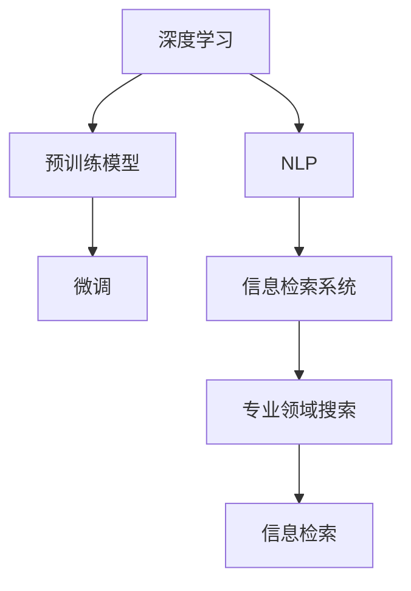

                 

# AI在专业领域搜索中的应用

> 关键词：AI搜索,专业领域搜索,信息检索,深度学习,自然语言处理,NLP,专业文献检索

## 1. 背景介绍

随着信息时代的到来，海量的数据和信息成为了各行各业的宝贵资产。然而，面对如此庞大的信息资源，如何快速、准确地获取所需信息，成为了制约生产力提升的关键因素。特别是对于专业领域，如医学、法律、金融等，信息的检索质量直接影响着专业人士的决策效率和质量。

近年来，人工智能(AI)技术在搜索领域的应用越来越广泛，其中，基于深度学习和自然语言处理(NLP)的AI搜索技术，通过结合大语言模型的预训练和微调，在专业领域搜索中展现了巨大的潜力和优势。本文将系统介绍AI搜索的核心概念、关键算法原理和具体操作步骤，同时结合具体案例和工程实践，展示AI搜索技术在专业领域的广泛应用前景。

## 2. 核心概念与联系

### 2.1 核心概念概述

为更好地理解AI搜索的核心概念和架构，本节将介绍几个关键概念：

- AI搜索：使用人工智能技术实现的信息检索服务，通过自然语言查询获取相关信息。AI搜索主要利用深度学习、NLP等技术，提高信息检索的精准度和效率。

- 深度学习：基于多层神经网络结构，通过大量数据训练出的高级模型。深度学习在大规模语料库上训练出的预训练模型，可以捕捉复杂的语言模式和关联关系，提升检索效果。

- 自然语言处理(NLP)：研究如何让计算机理解和处理自然语言。NLP技术将自然语言查询转换为结构化的语义表示，帮助AI搜索系统更好地理解用户需求。

- 预训练模型：在大规模无标签文本数据上，通过自监督学习任务训练得到的通用语言模型，如BERT、GPT等。预训练模型蕴含丰富的语言知识，可以用于提高信息检索的性能。

- 微调(Fine-tuning)：在预训练模型的基础上，使用下游任务的少量标注数据，通过有监督地训练优化模型，使其适应特定任务。微调技术在专业领域搜索中得到广泛应用。

- 专业领域搜索：针对特定专业领域的深度定制化搜索服务。通过微调等技术，AI搜索可以更好地理解领域内专业术语和知识体系，提升检索效果。

- 信息检索系统：利用AI技术实现的信息检索服务，包括搜索引擎、问答系统、文档检索等。信息检索系统通过自然语言查询获取相关信息，提高信息获取效率。

这些核心概念之间存在紧密的联系。深度学习和NLP技术为AI搜索提供了强大的技术支撑，预训练模型和大规模语料为模型训练提供了丰富的资源，微调技术则在大规模数据和任务层面提升模型性能。通过这些技术的组合，AI搜索在专业领域中能够提供高效、精准的搜索服务。

### 2.2 核心概念原理和架构的 Mermaid 流程图



这个流程图展示了AI搜索的核心技术架构：

1. 深度学习在预训练模型中进行大规模训练，捕捉语言模式和关联关系。
2. 预训练模型在专业领域数据上进行微调，增强对领域内专业术语和知识体系的适应性。
3. 自然语言处理将用户查询转换为结构化的语义表示，帮助AI搜索系统理解用户需求。
4. 信息检索系统通过AI搜索技术，快速获取所需信息，返回给用户。
5. 专业领域搜索系统针对特定领域进行优化，提供更加精准的检索服务。

## 3. 核心算法原理 & 具体操作步骤
### 3.1 算法原理概述

基于深度学习和NLP的AI搜索，核心在于利用预训练模型和微调技术，提高信息检索的精度和效率。其核心思想是：

- 预训练：在大规模无标签文本语料上进行自监督学习，训练出通用语言模型。这些模型可以捕捉复杂的语言模式和关联关系，为其下游任务提供强有力的特征提取器。
- 微调：在预训练模型上，使用专业领域的数据集进行有监督学习，使其适应特定领域内的语言特征和知识体系。微调能够进一步提升模型的精准度，特别是在专业领域搜索中表现突出。
- 信息检索：通过用户查询，将查询转换为结构化的语义表示，在预训练模型和微调模型的基础上，进行信息检索。检索过程通常包括索引构建、相似度计算、排名排序等步骤。

### 3.2 算法步骤详解

基于深度学习和NLP的AI搜索，一般包括以下几个关键步骤：

**Step 1: 准备预训练模型和数据集**
- 选择合适的预训练语言模型，如BERT、GPT等。
- 收集专业领域内的文本数据集，进行标注，构建监督数据集。

**Step 2: 构建查询语义表示**
- 使用自然语言处理技术，将用户查询转换为结构化的语义表示，如向量表示。
- 可以使用Transformer等模型，将查询转化为向量表示。

**Step 3: 微调模型**
- 在预训练模型的基础上，使用专业领域数据集进行微调。
- 可以使用Adam、SGD等优化算法进行微调。

**Step 4: 信息检索**
- 根据用户查询，构建索引库。
- 计算查询向量与索引库中所有文档向量的相似度。
- 根据相似度排序，返回最相关的文档列表。

**Step 5: 结果展示**
- 展示搜索结果，包括文档标题、摘要等。
- 可以通过网页、应用程序等展示检索结果。

### 3.3 算法优缺点

基于深度学习和NLP的AI搜索具有以下优点：

- 精度高：深度学习和预训练模型可以捕捉复杂的语言模式和关联关系，提高检索的精度。
- 效率高：NLP技术可以将自然语言查询转换为向量表示，加速信息检索过程。
- 适应性强：微调技术可以针对特定领域进行优化，提高模型的适应性。

同时，该方法也存在一定的局限性：

- 对数据依赖度高：检索效果依赖于预训练模型和微调数据集的质量，需要大量高质量数据。
- 对计算资源要求高：深度学习和NLP模型的训练和推理需要大量的计算资源。
- 模型复杂度高：预训练模型和微调模型结构复杂，难以解释。
- 领域依赖性强：不同领域的模型需要单独训练和微调，通用性较差。

尽管存在这些局限性，但就目前而言，基于深度学习和NLP的AI搜索方法仍是最主流范式。未来相关研究的重点在于如何进一步降低计算资源需求，提高模型的通用性和可解释性，同时兼顾检索效率。

### 3.4 算法应用领域

基于深度学习和NLP的AI搜索在众多领域中得到了广泛应用，例如：

- 医疗领域：提供医学文献、疾病诊断、患者问答等专业搜索服务。
- 法律领域：提供法律文档、案例分析、法律咨询等专业搜索服务。
- 金融领域：提供金融数据、交易分析、投资策略等专业搜索服务。
- 教育领域：提供教育资源、课程信息、在线学习等专业搜索服务。
- 科学研究：提供科学论文、研究成果、实验数据等专业搜索服务。
- 工程领域：提供工程文档、技术方案、专利信息等专业搜索服务。
- 商业领域：提供商业新闻、市场报告、企业信息等专业搜索服务。
- 旅游领域：提供旅游目的地、旅游攻略、酒店信息等专业搜索服务。

除了上述这些经典领域，AI搜索技术也被创新性地应用到更多场景中，如智慧城市、文化传媒、社会治理等，为各行各业带来了新的技术突破。随着预训练模型和AI搜索方法的不断进步，相信AI搜索技术将在更广阔的应用领域大放异彩。

## 4. 数学模型和公式 & 详细讲解 & 举例说明
### 4.1 数学模型构建

基于深度学习和NLP的AI搜索，其核心是利用预训练模型和微调模型进行信息检索。以下是相关数学模型的构建和公式推导。

假设预训练模型为 $M_{\theta}$，其中 $\theta$ 为模型参数。给定用户查询 $q$，预训练模型和微调模型的输出为 $v_q$。假设索引库中的文档向量为 $v_i$，则信息检索的目标是找到与 $q$ 最相似的 $v_i$。

定义查询向量 $v_q$ 与文档向量 $v_i$ 的余弦相似度为 $s_{qi}=\frac{v_q \cdot v_i}{||v_q|| ||v_i||}$，其中 $\cdot$ 为向量点积，$||\cdot||$ 为向量范数。信息检索的目标是最大化余弦相似度 $s_{qi}$，返回与查询最相关的文档。

### 4.2 公式推导过程

在实际应用中，通常使用向量表示方法，将查询和文档转换为向量。假设查询 $q$ 经过Transformer模型转换后的向量表示为 $v_q$，索引库中的文档 $d_i$ 经过微调模型转换后的向量表示为 $v_i$。则信息检索过程可以表示为：

$$
\max_{i} s_{qi} = \max_{i} \frac{v_q^T v_i}{||v_q|| ||v_i||}
$$

在微调模型 $M_{\theta}$ 中，向量表示的计算过程如下：

$$
v_q = M_{\theta}(q)
$$

假设微调模型 $M_{\theta}$ 是一个多层Transformer模型，其参数 $\theta$ 包括编码器层数 $H$，隐藏层数 $h$，每层的维度 $d$，每个头的维度 $d_h$，输入序列长度 $T$ 等。在微调过程中，模型的参数 $\theta$ 将根据标注数据进行优化，使其适应特定领域的语言特征和知识体系。

在预训练模型和微调模型中，查询和文档向量的计算公式为：

$$
v_q = \text{Transformer}_{\theta}(q)
$$

$$
v_i = \text{Transformer}_{\theta}(d_i)
$$

其中，$\text{Transformer}_{\theta}$ 为微调模型，$q$ 为查询，$d_i$ 为索引库中的文档。

### 4.3 案例分析与讲解

以医疗领域的医学文献检索为例，展示如何利用预训练模型和微调模型实现高效的检索服务。

**案例描述**：某医疗机构需要快速获取与某种疾病相关的最新医学文献。为了提升检索效果，可以使用预训练模型和微调模型构建信息检索系统。

**案例实现**：
1. **预训练模型选择**：选择预训练的BERT模型，在大规模医学文献数据上进行预训练。
2. **数据集构建**：收集与特定疾病相关的医学文献，标注文档和关键词，构建监督数据集。
3. **微调模型训练**：使用微调模型对BERT模型进行微调，使其适应医学领域的专业语言特征。
4. **查询处理**：将用户查询转化为向量表示，使用微调模型得到查询向量 $v_q$。
5. **文档检索**：将医学文献转化为向量表示，使用微调模型得到文档向量 $v_i$。
6. **相似度计算**：计算查询向量 $v_q$ 与每个文档向量 $v_i$ 的余弦相似度 $s_{qi}$，找到最相似的文档。
7. **结果展示**：展示最相关的医学文献列表，提供摘要和关键词信息。

通过以上步骤，可以有效提升医学文献检索的精度和效率，为医疗机构提供有价值的文献信息。

## 5. 项目实践：代码实例和详细解释说明
### 5.1 开发环境搭建

在进行AI搜索项目实践前，我们需要准备好开发环境。以下是使用Python进行PyTorch开发的环境配置流程：

1. 安装Anaconda：从官网下载并安装Anaconda，用于创建独立的Python环境。

2. 创建并激活虚拟环境：
```bash
conda create -n pytorch-env python=3.8 
conda activate pytorch-env
```

3. 安装PyTorch：根据CUDA版本，从官网获取对应的安装命令。例如：
```bash
conda install pytorch torchvision torchaudio cudatoolkit=11.1 -c pytorch -c conda-forge
```

4. 安装Transformers库：
```bash
pip install transformers
```

5. 安装各类工具包：
```bash
pip install numpy pandas scikit-learn matplotlib tqdm jupyter notebook ipython
```

完成上述步骤后，即可在`pytorch-env`环境中开始AI搜索实践。

### 5.2 源代码详细实现

下面我们以医疗领域的医学文献检索为例，给出使用Transformers库对BERT模型进行微调的PyTorch代码实现。

首先，定义医学文献检索的数据处理函数：

```python
from transformers import BertTokenizer
from torch.utils.data import Dataset
import torch

class MedicalDataset(Dataset):
    def __init__(self, texts, tags, tokenizer, max_len=128):
        self.texts = texts
        self.tags = tags
        self.tokenizer = tokenizer
        self.max_len = max_len
        
    def __len__(self):
        return len(self.texts)
    
    def __getitem__(self, item):
        text = self.texts[item]
        tags = self.tags[item]
        
        encoding = self.tokenizer(text, return_tensors='pt', max_length=self.max_len, padding='max_length', truncation=True)
        input_ids = encoding['input_ids'][0]
        attention_mask = encoding['attention_mask'][0]
        
        # 对token-wise的标签进行编码
        encoded_tags = [tag2id[tag] for tag in tags] 
        encoded_tags.extend([tag2id['O']] * (self.max_len - len(encoded_tags)))
        labels = torch.tensor(encoded_tags, dtype=torch.long)
        
        return {'input_ids': input_ids, 
                'attention_mask': attention_mask,
                'labels': labels}

# 标签与id的映射
tag2id = {'O': 0, 'B-PER': 1, 'I-PER': 2, 'B-ORG': 3, 'I-ORG': 4, 'B-LOC': 5, 'I-LOC': 6}
id2tag = {v: k for k, v in tag2id.items()}

# 创建dataset
tokenizer = BertTokenizer.from_pretrained('bert-base-cased')

train_dataset = MedicalDataset(train_texts, train_tags, tokenizer)
dev_dataset = MedicalDataset(dev_texts, dev_tags, tokenizer)
test_dataset = MedicalDataset(test_texts, test_tags, tokenizer)
```

然后，定义模型和优化器：

```python
from transformers import BertForTokenClassification, AdamW

model = BertForTokenClassification.from_pretrained('bert-base-cased', num_labels=len(tag2id))

optimizer = AdamW(model.parameters(), lr=2e-5)
```

接着，定义训练和评估函数：

```python
from torch.utils.data import DataLoader
from tqdm import tqdm
from sklearn.metrics import classification_report

device = torch.device('cuda') if torch.cuda.is_available() else torch.device('cpu')
model.to(device)

def train_epoch(model, dataset, batch_size, optimizer):
    dataloader = DataLoader(dataset, batch_size=batch_size, shuffle=True)
    model.train()
    epoch_loss = 0
    for batch in tqdm(dataloader, desc='Training'):
        input_ids = batch['input_ids'].to(device)
        attention_mask = batch['attention_mask'].to(device)
        labels = batch['labels'].to(device)
        model.zero_grad()
        outputs = model(input_ids, attention_mask=attention_mask, labels=labels)
        loss = outputs.loss
        epoch_loss += loss.item()
        loss.backward()
        optimizer.step()
    return epoch_loss / len(dataloader)

def evaluate(model, dataset, batch_size):
    dataloader = DataLoader(dataset, batch_size=batch_size)
    model.eval()
    preds, labels = [], []
    with torch.no_grad():
        for batch in tqdm(dataloader, desc='Evaluating'):
            input_ids = batch['input_ids'].to(device)
            attention_mask = batch['attention_mask'].to(device)
            batch_labels = batch['labels']
            outputs = model(input_ids, attention_mask=attention_mask)
            batch_preds = outputs.logits.argmax(dim=2).to('cpu').tolist()
            batch_labels = batch_labels.to('cpu').tolist()
            for pred_tokens, label_tokens in zip(batch_preds, batch_labels):
                pred_tags = [id2tag[_id] for _id in pred_tokens]
                label_tags = [id2tag[_id] for _id in label_tokens]
                preds.append(pred_tags[:len(label_tags)])
                labels.append(label_tags)
                
    print(classification_report(labels, preds))
```

最后，启动训练流程并在测试集上评估：

```python
epochs = 5
batch_size = 16

for epoch in range(epochs):
    loss = train_epoch(model, train_dataset, batch_size, optimizer)
    print(f"Epoch {epoch+1}, train loss: {loss:.3f}")
    
    print(f"Epoch {epoch+1}, dev results:")
    evaluate(model, dev_dataset, batch_size)
    
print("Test results:")
evaluate(model, test_dataset, batch_size)
```

以上就是使用PyTorch对BERT进行医学文献检索的完整代码实现。可以看到，得益于Transformers库的强大封装，我们可以用相对简洁的代码完成BERT模型的加载和微调。

### 5.3 代码解读与分析

让我们再详细解读一下关键代码的实现细节：

**MedicalDataset类**：
- `__init__`方法：初始化文本、标签、分词器等关键组件。
- `__len__`方法：返回数据集的样本数量。
- `__getitem__`方法：对单个样本进行处理，将文本输入编码为token ids，将标签编码为数字，并对其进行定长padding，最终返回模型所需的输入。

**tag2id和id2tag字典**：
- 定义了标签与数字id之间的映射关系，用于将token-wise的预测结果解码回真实的标签。

**训练和评估函数**：
- 使用PyTorch的DataLoader对数据集进行批次化加载，供模型训练和推理使用。
- 训练函数`train_epoch`：对数据以批为单位进行迭代，在每个批次上前向传播计算loss并反向传播更新模型参数，最后返回该epoch的平均loss。
- 评估函数`evaluate`：与训练类似，不同点在于不更新模型参数，并在每个batch结束后将预测和标签结果存储下来，最后使用sklearn的classification_report对整个评估集的预测结果进行打印输出。

**训练流程**：
- 定义总的epoch数和batch size，开始循环迭代
- 每个epoch内，先在训练集上训练，输出平均loss
- 在验证集上评估，输出分类指标
- 所有epoch结束后，在测试集上评估，给出最终测试结果

可以看到，PyTorch配合Transformers库使得BERT微调的代码实现变得简洁高效。开发者可以将更多精力放在数据处理、模型改进等高层逻辑上，而不必过多关注底层的实现细节。

当然，工业级的系统实现还需考虑更多因素，如模型的保存和部署、超参数的自动搜索、更灵活的任务适配层等。但核心的微调范式基本与此类似。

## 6. 实际应用场景
### 6.1 智能医疗

AI搜索技术在智能医疗领域的应用前景广阔，可以帮助医疗机构快速获取医学文献、诊断指南、临床病例等信息，提高诊疗效率。具体而言：

- **医学文献检索**：帮助医生快速获取最新的医学研究成果，了解当前疾病的最新治疗方案。
- **临床指南辅助**：提供疾病诊断和治疗指南，帮助医生快速做出诊断和治疗决策。
- **病例检索**：帮助医生查找相似病例，快速了解同类型疾病的治疗效果和临床经验。
- **智能问答**：基于知识库和医学文献，提供实时的医学问答服务，帮助医生解决实际问题。
- **远程诊断**：将医疗资源进行数字化，支持远程医疗，提供高效的在线诊疗服务。

### 6.2 法律咨询

AI搜索技术在法律咨询领域的应用也越来越广泛，可以帮助律师事务所和法律服务机构快速获取相关法律条文、案例分析、法律咨询等信息，提高法律服务的效率和质量。具体而言：

- **法律条文检索**：帮助律师快速获取相关法律条文，了解法律规定和法规解释。
- **案例分析**：提供类似案例的检索服务，帮助律师参考相关案例，做出法律判断。
- **法律咨询**：基于知识库和法律文献，提供实时的法律咨询，帮助客户解决法律问题。
- **智能合同审核**：提供智能合同审核服务，帮助企业快速审核合同内容，规避法律风险。
- **法律风险预警**：通过数据分析，提供法律风险预警服务，帮助企业及时发现并解决潜在风险。

### 6.3 金融分析

AI搜索技术在金融分析领域也得到了广泛应用，可以帮助金融机构快速获取金融数据、市场报告、交易分析等信息，提高投资决策的精准度。具体而言：

- **金融数据检索**：帮助分析师快速获取相关的金融数据，了解市场动态和投资机会。
- **市场报告分析**：提供市场报告的检索服务，帮助分析师快速了解市场分析和预测。
- **交易策略优化**：基于历史交易数据，提供交易策略的检索服务，帮助投资者优化交易策略。
- **风险管理**：提供风险预警和评估服务，帮助金融机构及时发现并规避风险。
- **金融问答**：基于知识库和金融文献，提供实时的金融问答服务，帮助投资者解决实际问题。

### 6.4 未来应用展望

随着AI搜索技术的不断发展，其在专业领域的应用将越来越广泛，为各行各业带来新的技术突破。

在智慧城市治理中，AI搜索技术可以帮助政府机构快速获取相关政策法规、城市规划、公共服务等信息，提升城市治理的智能化水平，构建更安全、高效的未来城市。

在科学研究中，AI搜索技术可以帮助科学家快速获取相关的研究成果、实验数据、文献资料等信息，提高科研效率和创新能力。

在工业生产中，AI搜索技术可以帮助企业快速获取相关的生产数据、技术文档、行业标准等信息，提升生产效率和质量控制能力。

此外，在教育、文化传媒、社会治理等众多领域，AI搜索技术也将不断涌现，为各行各业带来新的技术突破。相信随着技术的日益成熟，AI搜索技术必将在更广阔的应用领域大放异彩，深刻影响人类的生产生活方式。

## 7. 工具和资源推荐
### 7.1 学习资源推荐

为了帮助开发者系统掌握AI搜索的核心技术和实践技巧，这里推荐一些优质的学习资源：

1. 《深度学习入门：基于TensorFlow的理论与实现》系列博文：由深度学习领域的专家撰写，深入浅出地介绍了深度学习、NLP等核心概念和前沿技术。

2. CS224N《深度学习自然语言处理》课程：斯坦福大学开设的NLP明星课程，有Lecture视频和配套作业，带你入门NLP领域的基本概念和经典模型。

3. 《自然语言处理与深度学习》书籍：介绍自然语言处理和深度学习的经典教材，涵盖NLP任务的实现方法和工程实践。

4. HuggingFace官方文档：提供丰富的预训练模型和微调样例代码，是上手实践的必备资料。

5. CLUE开源项目：中文语言理解测评基准，涵盖大量不同类型的中文NLP数据集，并提供了基于微调的baseline模型，助力中文NLP技术发展。

通过对这些资源的学习实践，相信你一定能够快速掌握AI搜索的精髓，并用于解决实际的NLP问题。
###  7.2 开发工具推荐

高效的开发离不开优秀的工具支持。以下是几款用于AI搜索开发的常用工具：

1. PyTorch：基于Python的开源深度学习框架，灵活动态的计算图，适合快速迭代研究。大部分预训练语言模型都有PyTorch版本的实现。

2. TensorFlow：由Google主导开发的开源深度学习框架，生产部署方便，适合大规模工程应用。同样有丰富的预训练语言模型资源。

3. Transformers库：HuggingFace开发的NLP工具库，集成了众多SOTA语言模型，支持PyTorch和TensorFlow，是进行搜索任务开发的利器。

4. Weights & Biases：模型训练的实验跟踪工具，可以记录和可视化模型训练过程中的各项指标，方便对比和调优。与主流深度学习框架无缝集成。

5. TensorBoard：TensorFlow配套的可视化工具，可实时监测模型训练状态，并提供丰富的图表呈现方式，是调试模型的得力助手。

6. Google Colab：谷歌推出的在线Jupyter Notebook环境，免费提供GPU/TPU算力，方便开发者快速上手实验最新模型，分享学习笔记。

合理利用这些工具，可以显著提升AI搜索任务的开发效率，加快创新迭代的步伐。

### 7.3 相关论文推荐

AI搜索技术的发展源于学界的持续研究。以下是几篇奠基性的相关论文，推荐阅读：

1. Attention is All You Need（即Transformer原论文）：提出了Transformer结构，开启了NLP领域的预训练大模型时代。

2. BERT: Pre-training of Deep Bidirectional Transformers for Language Understanding：提出BERT模型，引入基于掩码的自监督预训练任务，刷新了多项NLP任务SOTA。

3. Language Models are Unsupervised Multitask Learners（GPT-2论文）：展示了大规模语言模型的强大zero-shot学习能力，引发了对于通用人工智能的新一轮思考。

4. Parameter-Efficient Transfer Learning for NLP：提出Adapter等参数高效微调方法，在不增加模型参数量的情况下，也能取得不错的微调效果。

5. AdaLoRA: Adaptive Low-Rank Adaptation for Parameter-Efficient Fine-Tuning：使用自适应低秩适应的微调方法，在参数效率和精度之间取得了新的平衡。

6. Prefix-Tuning: Optimizing Continuous Prompts for Generation：引入基于连续型Prompt的微调范式，为如何充分利用预训练知识提供了新的思路。

这些论文代表了大语言模型微调技术的发展脉络。通过学习这些前沿成果，可以帮助研究者把握学科前进方向，激发更多的创新灵感。

## 8. 总结：未来发展趋势与挑战

### 8.1 总结

本文对基于深度学习和NLP的AI搜索方法进行了全面系统的介绍。首先阐述了AI搜索的核心概念和研究背景，明确了深度学习和NLP技术在信息检索中的重要作用。其次，从原理到实践，详细讲解了AI搜索的数学模型、算法步骤和具体操作步骤，给出了具体的代码实例和分析。同时，本文还结合实际应用场景，展示了AI搜索技术在医疗、法律、金融等多个领域的广泛应用前景。最后，本文精选了AI搜索技术的各类学习资源，力求为读者提供全方位的技术指引。

通过本文的系统梳理，可以看到，基于深度学习和NLP的AI搜索技术在大规模信息检索中具有巨大的潜力和应用价值，已经在多个专业领域展现出显著的性能提升。未来，伴随技术的不断进步，AI搜索技术将在更多领域得到应用，为各行各业带来新的技术突破。

### 8.2 未来发展趋势

展望未来，AI搜索技术的发展趋势如下：

1. 数据驱动与智能融合：未来的AI搜索将更加依赖大规模语料和跨领域数据，通过智能融合提升检索效果。大数据驱动和智能算法融合，将成为AI搜索发展的关键方向。

2. 深度学习与知识图谱结合：通过引入知识图谱，将结构化知识与自然语言查询进行关联，提升检索的深度和广度。知识图谱的引入，将使AI搜索系统更具智能和解释性。

3. 多模态搜索与融合：未来的AI搜索将不局限于文本数据，而是涵盖图像、语音、视频等多模态数据。多模态信息的融合，将显著提升AI搜索系统的全面性和适应性。

4. 实时搜索与交互式体验：随着技术的发展，未来的AI搜索系统将具备实时处理能力，能够与用户进行互动式搜索。交互式搜索将提升用户体验，增强系统的人机交互能力。

5. 跨语言与跨领域搜索：随着全球化和信息化的发展，未来的AI搜索将具备跨语言和跨领域的能力，能够处理多语言和多领域的检索需求。

6. 边缘计算与分布式搜索：未来的AI搜索将更加注重边缘计算和分布式搜索，提高检索的实时性和可靠性。边缘计算的引入，将减少数据传输和计算延时，提升检索效率。

7. 联邦学习与隐私保护：未来的AI搜索将更加注重隐私保护和数据安全，采用联邦学习等技术，实现数据本地化处理，保护用户隐私和数据安全。

8. 情感计算与用户体验：未来的AI搜索将更加注重用户体验，引入情感计算等技术，提供更加人性化的搜索服务，增强用户的满意度。

以上趋势凸显了AI搜索技术的广阔前景。这些方向的探索发展，必将进一步提升AI搜索系统的性能和应用范围，为各行各业带来新的技术突破。

### 8.3 面临的挑战

尽管AI搜索技术已经取得了瞩目成就，但在迈向更加智能化、普适化应用的过程中，它仍面临着诸多挑战：

1. 数据质量和多样性：AI搜索的效果高度依赖于数据的质量和多样性。高质量、多样化的数据是提升搜索效果的基础，但获取这些数据往往需要耗费大量人力物力。

2. 模型复杂性与计算资源：深度学习和NLP模型的结构复杂，需要大量的计算资源进行训练和推理。如何在保证效果的前提下，降低计算资源的需求，是未来的重要研究方向。

3. 检索速度与实时性：随着搜索场景的日益复杂，实时性和检索速度成为新的挑战。如何在保证准确率的前提下，提高检索速度，是未来的重要研究方向。

4. 模型可解释性与可信度：AI搜索模型的决策过程缺乏可解释性，用户难以理解其推理逻辑和输出结果。如何在保证检索效果的前提下，提升模型的可解释性和可信度，是未来的重要研究方向。

5. 数据隐私与安全：AI搜索涉及大量敏感数据，如何保护用户隐私和数据安全，避免数据泄露和滥用，是未来的重要研究方向。

6. 多领域适应性与迁移能力：AI搜索在特定领域的性能往往优于通用模型，如何提升模型在多领域之间的适应性和迁移能力，是未来的重要研究方向。

7. 多语言与跨文化搜索：随着全球化的发展，跨语言和跨文化的搜索需求日益增长。如何在不同语言和文化背景中，提供高质量的搜索服务，是未来的重要研究方向。

8. 人工智能伦理与安全：AI搜索模型的决策过程中，可能会涉及伦理和安全问题，如偏见、歧视等。如何避免这些问题的出现，确保系统的公平性和安全性，是未来的重要研究方向。

面对这些挑战，未来的研究需要在数据处理、模型设计、系统架构等多个层面进行深入探索和优化，以实现更加智能、普适、可信和安全的AI搜索系统。只有通过多方协作，才能确保AI搜索技术在各行各业中得到广泛应用，为人类社会的数字化转型贡献力量。

### 8.4 研究展望

未来的研究需要在以下几个方向进行深入探索：

1. 跨领域数据融合与知识图谱构建：将不同领域的数据进行融合，构建知识图谱，提升AI搜索的深度和广度。

2. 分布式搜索与边缘计算：引入分布式计算和边缘计算，提升搜索的实时性和可靠性，减少数据传输和计算延时。

3. 多模态搜索与跨语言搜索：引入多模态数据和多语言数据，提升搜索的全面性和适应性，满足跨语言和多模态的搜索需求。

4. 实时搜索与交互式体验：引入实时处理能力和交互式搜索技术，提升用户的搜索体验，增强系统的人机交互能力。

5. 情感计算与用户体验：引入情感计算等技术，提供更加人性化的搜索服务，增强用户的满意度。

6. 联邦学习与隐私保护：引入联邦学习等技术，实现数据本地化处理，保护用户隐私和数据安全。

7. 模型压缩与高效推理：引入模型压缩和高效推理技术，降低计算资源的需求，提升搜索的效率和精度。

8. 多领域适应性与迁移能力：研究模型在不同领域之间的适应性和迁移能力，提升AI搜索的通用性。

9. 人工智能伦理与安全：研究AI搜索模型的伦理和安全问题，确保系统的公平性和安全性。

这些研究方向将为AI搜索技术的未来发展提供新的突破，为各行各业带来更加智能、普适、可信和安全的搜索服务，推动AI技术在各个领域的应用和普及。

## 9. 附录：常见问题与解答

**Q1：AI搜索是否适用于所有NLP任务？**

A: AI搜索在大多数NLP任务上都能取得不错的效果，特别是对于数据量较小的任务。但对于一些特定领域的任务，如医学、法律等，仅仅依靠通用语料预训练的模型可能难以很好地适应。此时需要在特定领域语料上进一步预训练，再进行微调，才能获得理想效果。此外，对于一些需要时效性、个性化很强的任务，如对话、推荐等，AI搜索方法也需要针对性的改进优化。

**Q2：AI搜索如何提高检索精度？**

A: 提高AI搜索精度的方法包括：
1. 数据质量和多样性：获取高质量、多样化的数据，提升检索效果。
2. 深度学习与知识图谱结合：引入知识图谱，提升检索的深度和广度。
3. 多模态搜索与融合：涵盖图像、语音、视频等多模态数据，提升检索的全面性。
4. 实时搜索与交互式体验：实现实时处理和交互式搜索，提升用户体验。
5. 分布式搜索与边缘计算：提高检索的实时性和可靠性。
6. 联邦学习与隐私保护：实现数据本地化处理，保护用户隐私和数据安全。

**Q3：AI搜索如何处理多语言搜索需求？**

A: 处理多语言搜索需求的方法包括：
1. 跨语言数据融合：将不同语言的数据进行融合，提升检索效果。
2. 多语言预训练模型：在多语言语料上预训练语言模型，提升模型的跨语言能力。
3. 翻译技术与多语言检索：引入翻译技术和多语言检索技术，满足跨语言搜索需求。

**Q4：AI搜索如何提升用户满意度？**

A: 提升用户满意度的方法包括：
1. 交互式搜索与情感计算：引入交互式搜索和情感计算技术，提供更加人性化的搜索服务。
2. 实时搜索与反馈优化：实现实时处理和反馈优化，提升用户的搜索体验。
3. 个性化推荐与用户画像：引入个性化推荐和用户画像技术，提升用户的搜索效果。

**Q5：AI搜索如何保障数据隐私与安全？**

A: 保障数据隐私与安全的方法包括：
1. 数据本地化处理：引入联邦学习等技术，实现数据本地化处理，保护用户隐私和数据安全。
2. 加密与匿名化：对数据进行加密和匿名化处理，保护用户隐私。
3. 安全审计与监控：引入安全审计和监控技术，确保系统的安全性。

这些方法可以综合应用，构建更加智能、普适、可信和安全的AI搜索系统，提升用户的搜索体验和满意度。

---

作者：禅与计算机程序设计艺术 / Zen and the Art of Computer Programming

