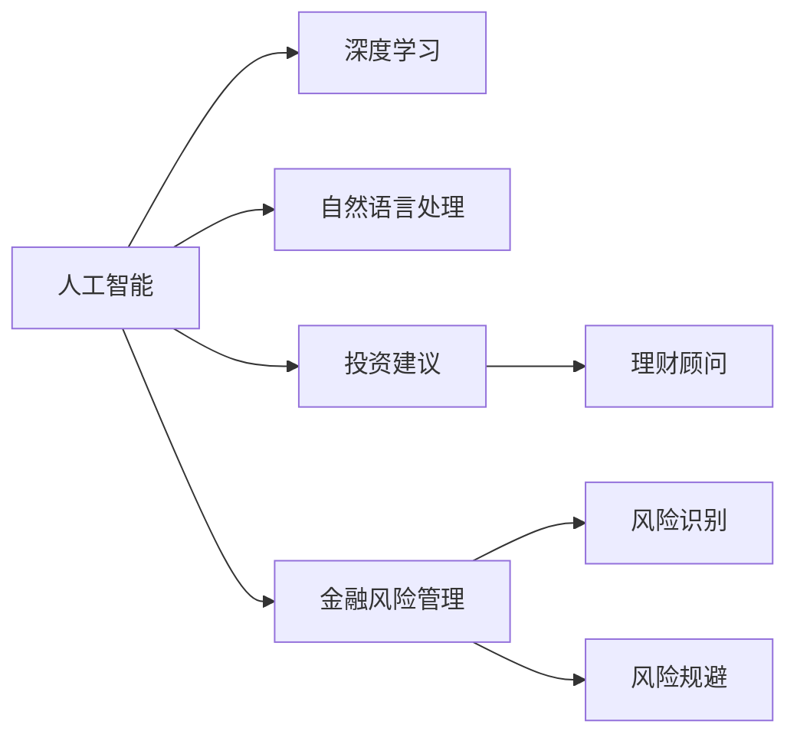

                 

# AI在个人理财中的应用：智能投资建议

> 关键词：人工智能, 投资建议, 理财顾问, 金融风险管理, 自然语言处理, 深度学习

## 1. 背景介绍

### 1.1 问题由来
随着金融科技的快速发展，AI技术在个人理财领域的应用变得越来越广泛。尤其是在投资建议、理财规划和金融风险管理方面，AI正逐步取代传统的人工方法，为个人投资者提供更加精准、高效的服务。然而，AI在个人理财中的应用并非一片坦途，仍面临诸多挑战。本文将详细探讨AI在投资建议中的核心概念与关键技术，展望未来发展趋势，并提出应对挑战的策略。

## 2. 核心概念与联系

### 2.1 核心概念概述

要深入理解AI在投资建议中的应用，首先需要了解几个关键概念：

- **人工智能(AI)**：一种模拟人类智能行为的技术，包括机器学习、深度学习、自然语言处理(NLP)等子领域。
- **投资建议**：基于历史数据、市场分析和用户偏好，为投资者提供买卖建议的服务。
- **理财顾问**：提供专业财务建议的专家，包括但不限于投资、税务规划、风险管理等。
- **金融风险管理**：通过量化模型和统计分析，识别和规避潜在的金融风险。
- **自然语言处理(NLP)**：使计算机能够理解、解释和生成人类语言的技术。
- **深度学习**：一种模拟人脑神经网络处理信息的技术，常用于图像、语音和文本处理。

这些概念之间的联系可以通过以下Mermaid流程图来展示：



这个流程图展示了人工智能技术在投资建议、理财顾问和金融风险管理中的应用，以及NLP和深度学习在这一过程中的重要作用。

## 3. 核心算法原理 & 具体操作步骤
### 3.1 算法原理概述

基于AI的投资建议通常分为两个阶段：预训练和微调。预训练阶段使用大规模历史数据和金融知识，训练一个通用的AI模型。微调阶段使用特定用户的数据和偏好，对模型进行微调，生成个性化的投资建议。

形式化地，假设预训练模型为 $M_{\theta}$，其中 $\theta$ 为预训练得到的模型参数。设 $D_{train}$ 为预训练数据集，$D_{user}$ 为用户数据，$D_{market}$ 为市场数据。则微调的目标是找到新的模型参数 $\hat{\theta}$，使得模型在特定用户数据上的投资建议更接近最优决策：

$$
\hat{\theta} = \arg\min_{\theta} \mathcal{L}(M_{\theta}, D_{user}, D_{market})
$$

其中 $\mathcal{L}$ 为损失函数，衡量模型预测与真实投资决策之间的差异。

### 3.2 算法步骤详解

基于AI的投资建议微调一般包括以下几个关键步骤：

**Step 1: 数据收集与预处理**
- 收集历史交易数据、市场数据和用户偏好数据。
- 清洗和标准化数据，如去除缺失值、归一化等。
- 划分数据集为训练集、验证集和测试集。

**Step 2: 构建预训练模型**
- 选择或设计预训练模型，如基于Transformer的神经网络、卷积神经网络等。
- 在预训练数据集 $D_{train}$ 上训练模型，获取预训练参数 $\theta_{pretrained}$。

**Step 3: 微调模型**
- 根据用户数据 $D_{user}$ 和市场数据 $D_{market}$，构建微调数据集 $D_{fine-tune}$。
- 在微调数据集上对预训练模型进行微调，更新参数 $\theta$。
- 在验证集上评估微调后的模型性能，确保模型没有过拟合。
- 在测试集上测试微调后的模型，输出投资建议。

**Step 4: 风险评估与规避**
- 对投资建议进行风险评估，如计算夏普比率、VaR等指标。
- 根据风险评估结果，调整投资建议或进行组合优化。
- 持续收集新数据，定期重新微调模型，以适应数据分布的变化。

### 3.3 算法优缺点

基于AI的投资建议具有以下优点：
1. 自动化决策：AI可以快速处理大量数据，生成实时投资建议。
2. 个性化服务：通过微调模型，AI可以根据用户偏好提供定制化的投资方案。
3. 高精度预测：利用深度学习和统计分析，AI能够提供更准确的投资预测。

同时，该方法也存在以下局限性：
1. 依赖数据质量：AI的投资建议依赖于高质量、完整的历史数据和市场数据。
2. 模型泛化能力有限：当市场变化较大时，AI模型可能无法及时适应。
3. 数据隐私问题：收集和处理用户数据时，需要严格遵守隐私保护法规。
4. 模型复杂度高：深度学习模型的训练和推理计算量大，对计算资源要求高。

尽管存在这些局限性，但基于AI的投资建议方法已在许多投资公司中得到应用，显示出其巨大的潜力。未来相关研究的重点在于如何进一步提高模型的泛化能力，降低对数据的要求，同时兼顾风险控制和用户隐私保护。

### 3.4 算法应用领域

AI在投资建议中的应用广泛，覆盖了股票、债券、期货、外汇等多个金融领域。以下是几个典型的应用场景：

- **股票投资建议**：根据市场数据和用户偏好，生成买入或卖出的建议。
- **债券投资建议**：分析债券市场趋势，预测收益率变化，提供投资策略。
- **外汇交易建议**：利用全球市场数据，生成汇率预测和交易策略。
- **大宗商品投资建议**：分析商品市场趋势，提供买卖建议。

此外，AI技术还被应用于资产配置、风险管理、客户关系管理等方面，为金融服务机构带来了显著的效率提升和成本节约。

## 4. 数学模型和公式 & 详细讲解 & 举例说明

### 4.1 数学模型构建

基于AI的投资建议模型通常采用回归模型、分类模型或强化学习模型进行构建。这里以回归模型为例，构建一个简单的线性回归模型：

假设预训练模型为 $M_{\theta}$，输入为 $x$，输出为 $y$。微调目标为最小化预测值 $\hat{y}$ 与真实值 $y$ 之间的误差 $e$。则损失函数 $\mathcal{L}$ 可以表示为：

$$
\mathcal{L}(M_{\theta}, D_{user}, D_{market}) = \frac{1}{N}\sum_{i=1}^N (y_i - \hat{y}_i)^2
$$

其中 $N$ 为样本数量。

### 4.2 公式推导过程

对于线性回归模型，其预测值 $\hat{y}_i$ 可以表示为：

$$
\hat{y}_i = \theta_0 + \sum_{j=1}^d \theta_j x_{ij}
$$

其中 $\theta_0$ 为截距，$\theta_j$ 为第 $j$ 个特征的系数。

则预测误差 $e_i$ 为：

$$
e_i = y_i - \hat{y}_i = y_i - (\theta_0 + \sum_{j=1}^d \theta_j x_{ij})
$$

根据均方误差 (MSE) 损失函数，损失函数 $\mathcal{L}$ 可以表示为：

$$
\mathcal{L}(M_{\theta}, D_{user}, D_{market}) = \frac{1}{N}\sum_{i=1}^N e_i^2
$$

进一步展开得到：

$$
\mathcal{L}(M_{\theta}, D_{user}, D_{market}) = \frac{1}{N}\sum_{i=1}^N (y_i - \theta_0 - \sum_{j=1}^d \theta_j x_{ij})^2
$$

对模型参数 $\theta$ 进行梯度下降优化，最小化损失函数 $\mathcal{L}$。

### 4.3 案例分析与讲解

假设我们有一个用户 $A$，他的历史交易数据为 $D_A$，市场数据为 $D_{market}$。我们希望根据这些数据，预测用户 $A$ 在未来一周的投资回报。

1. 首先，我们使用历史数据 $D_{train}$ 对模型进行预训练，得到预训练参数 $\theta_{pretrained}$。
2. 接着，我们构建微调数据集 $D_{fine-tune}$，包括用户数据 $D_A$ 和市场数据 $D_{market}$。
3. 在微调数据集 $D_{fine-tune}$ 上，对预训练模型进行微调，得到微调参数 $\theta$。
4. 使用微调后的模型 $M_{\theta}$ 对用户数据 $D_A$ 进行预测，得到预测值 $\hat{y}_A$。
5. 最后，根据预测值 $\hat{y}_A$，生成投资建议，如买入或卖出某只股票。

## 5. 项目实践：代码实例和详细解释说明
### 5.1 开发环境搭建

在进行AI投资建议的开发之前，我们需要准备好开发环境。以下是使用Python进行PyTorch开发的环境配置流程：

1. 安装Anaconda：从官网下载并安装Anaconda，用于创建独立的Python环境。

2. 创建并激活虚拟环境：
```bash
conda create -n pytorch-env python=3.8 
conda activate pytorch-env
```

3. 安装PyTorch：根据CUDA版本，从官网获取对应的安装命令。例如：
```bash
conda install pytorch torchvision torchaudio cudatoolkit=11.1 -c pytorch -c conda-forge
```

4. 安装相关库：
```bash
pip install pandas numpy matplotlib
```

完成上述步骤后，即可在`pytorch-env`环境中开始开发。

### 5.2 源代码详细实现

以下是一个简单的基于线性回归模型的AI投资建议微调代码实现，使用PyTorch进行开发：

```python
import torch
import torch.nn as nn
import torch.optim as optim
import pandas as pd

# 构建线性回归模型
class LinearRegression(nn.Module):
    def __init__(self, input_size):
        super(LinearRegression, self).__init__()
        self.linear = nn.Linear(input_size, 1)

    def forward(self, x):
        return self.linear(x)

# 构建数据集
df = pd.read_csv('data.csv')
X = df.drop(['y'], axis=1)
y = df['y']
X = torch.tensor(X, dtype=torch.float32)
y = torch.tensor(y, dtype=torch.float32)

# 构建模型
model = LinearRegression(input_size=X.shape[1])
optimizer = optim.Adam(model.parameters(), lr=0.01)

# 训练模型
for epoch in range(1000):
    optimizer.zero_grad()
    y_pred = model(X)
    loss = nn.MSELoss()(y_pred, y)
    loss.backward()
    optimizer.step()
    if epoch % 100 == 0:
        print('Epoch {}, Loss: {:.4f}'.format(epoch, loss.item()))

# 微调模型
X_train = X[:100]
X_val = X[100:]
y_train = y[:100]
y_val = y[100:]
model.train()
for epoch in range(100):
    optimizer.zero_grad()
    y_pred = model(X_train)
    loss = nn.MSELoss()(y_pred, y_train)
    loss.backward()
    optimizer.step()
    if epoch % 10 == 0:
        print('Epoch {}, Loss: {:.4f}'.format(epoch, loss.item()))

# 测试模型
X_test = X_val
y_test = y_val
y_pred = model(X_test)
print('Test Loss: {:.4f}'.format(nn.MSELoss()(y_pred, y_test).item()))
```

### 5.3 代码解读与分析

让我们再详细解读一下关键代码的实现细节：

**LinearRegression类**：
- `__init__`方法：定义模型的线性层。
- `forward`方法：定义模型前向传播。

**数据集构建**：
- 使用Pandas库读取CSV文件，构建特征矩阵 $X$ 和标签向量 $y$。
- 将数据转换为PyTorch张量，并指定数据类型。

**模型训练**：
- 定义线性回归模型，使用Adam优化器进行训练。
- 在每个epoch内，计算损失函数，更新模型参数。
- 每100个epoch输出一次损失值，用于监控训练进度。

**模型微调**：
- 划分数据集为训练集和验证集。
- 在训练集上微调模型，调整模型参数。
- 每10个epoch输出一次损失值，用于监控微调进度。

**模型测试**：
- 在验证集上测试模型，计算测试损失。

这个代码实现展示了线性回归模型的基本流程，包括数据准备、模型构建、训练和微调。对于实际应用中的复杂模型，开发者需要进一步优化模型架构、调整超参数、引入正则化技术等，以提高模型性能。

## 6. 实际应用场景

### 6.1 智能投资组合管理

基于AI的投资建议可以应用于智能投资组合管理，帮助投资者构建最优的投资组合。通过收集用户的风险偏好、投资期限等数据，AI模型可以自动生成最优的资产配置建议，如股票、债券、基金等。

在技术实现上，可以使用多变量线性回归模型，结合用户数据和市场数据，优化投资组合的配置策略。同时，还可以引入风险管理技术，如VaR、夏普比率等，确保投资组合的风险收益比最优。

### 6.2 动态调整投资策略

AI模型可以根据市场动态实时调整投资策略，帮助投资者在复杂多变的市场环境中保持竞争优势。例如，当市场出现重大事件时，AI模型可以自动生成新的投资建议，帮助投资者捕捉市场机会或规避风险。

在技术实现上，可以使用强化学习模型，如Q-learning或DQN，构建投资决策模型。模型通过学习历史交易数据和市场数据，不断调整投资策略，以最大化投资回报。

### 6.3 智能理财顾问

AI投资建议可以应用于智能理财顾问系统，提供个性化的财务规划服务。通过收集用户的历史交易数据、收入支出情况等，AI模型可以自动生成个性化的理财建议，如消费优化、资产配置、税务规划等。

在技术实现上，可以使用分类模型，如决策树、随机森林等，构建理财顾问模型。模型通过学习用户的财务数据，预测未来的财务变化，提供个性化的理财建议。

### 6.4 未来应用展望

随着AI技术的不断进步，未来AI在投资建议中的应用将更加广泛和深入。以下是几个未来应用趋势：

1. **深度学习模型的应用**：深度学习模型在投资建议中的应用将更加广泛，尤其是卷积神经网络 (CNN) 和循环神经网络 (RNN) 等，可以处理复杂的非线性关系。
2. **多模态数据的融合**：除了股票、债券等金融数据外，AI模型还可以结合社交媒体、新闻等非金融数据，提供更加全面的投资建议。
3. **个性化服务**：AI模型可以根据用户的偏好、行为等数据，提供更加个性化的投资建议，提升用户体验。
4. **风险管理**：AI模型可以结合风险评估技术，如蒙特卡洛模拟、时间序列分析等，提供更加精准的风险管理服务。
5. **智能投顾系统**：AI模型可以构建智能投顾系统，提供全方位的投资建议、财务规划、风险管理等服务。

这些趋势将进一步提升AI在投资建议中的应用水平，为用户带来更加智能、高效的金融服务。

## 7. 工具和资源推荐

### 7.1 学习资源推荐

为了帮助开发者系统掌握AI在投资建议中的应用，这里推荐一些优质的学习资源：

1. 《机器学习实战》系列博文：由大模型技术专家撰写，深入浅出地介绍了机器学习的基本概念和应用场景。
2. 《深度学习入门》课程：斯坦福大学开设的深度学习入门课程，讲解深度学习的基本原理和常见模型。
3. 《自然语言处理与深度学习》书籍：深度学习在自然语言处理中的应用，介绍了NLP的基本概念和前沿技术。
4. 《金融风险管理》书籍：介绍了金融风险评估和管理的原理和方法，是金融领域从业者的必备读物。
5. Coursera《Python for Data Science》课程：讲解Python在数据科学中的应用，包括数据处理、数据分析等。

通过对这些资源的学习实践，相信你一定能够快速掌握AI在投资建议中的应用，并用于解决实际的投资问题。

### 7.2 开发工具推荐

高效的开发离不开优秀的工具支持。以下是几款用于AI投资建议开发的常用工具：

1. PyTorch：基于Python的开源深度学习框架，灵活动态的计算图，适合快速迭代研究。
2. TensorFlow：由Google主导开发的开源深度学习框架，生产部署方便，适合大规模工程应用。
3. Weights & Biases：模型训练的实验跟踪工具，可以记录和可视化模型训练过程中的各项指标，方便对比和调优。
4. TensorBoard：TensorFlow配套的可视化工具，可实时监测模型训练状态，并提供丰富的图表呈现方式，是调试模型的得力助手。
5. Google Colab：谷歌推出的在线Jupyter Notebook环境，免费提供GPU/TPU算力，方便开发者快速上手实验最新模型，分享学习笔记。

合理利用这些工具，可以显著提升AI投资建议的开发效率，加快创新迭代的步伐。

### 7.3 相关论文推荐

AI在投资建议中的应用源于学界的持续研究。以下是几篇奠基性的相关论文，推荐阅读：

1. LSTM: A Research Framework for Deep Learning in Finance：介绍LSTM模型在金融领域的潜在应用，涉及时间序列分析和预测。
2. AlphaGo Zero: Mastering the Game of Go without Human Knowledge：展示了深度强化学习在复杂博弈问题中的应用，为AI投资决策提供新的思路。
3. Neural Architecture Search with Reinforcement Learning：介绍神经网络架构搜索技术，为构建高效的AI投资模型提供新的方法。
4. Deep Learning in Financial Markets: A Review：综述深度学习在金融市场中的应用，包括投资预测、风险管理等。
5. Machine Learning and Financial Engineering: The Case of Statistical Learning Models for Pricing and Risk Management：介绍统计学习模型在金融工程中的应用，包括定价和风险管理。

这些论文代表了大模型在投资建议领域的发展脉络。通过学习这些前沿成果，可以帮助研究者把握学科前进方向，激发更多的创新灵感。

## 8. 总结：未来发展趋势与挑战

### 8.1 总结

本文对基于AI的投资建议方法进行了全面系统的介绍。首先阐述了AI在投资建议中的核心概念与关键技术，明确了AI在投资建议的应用价值。其次，从原理到实践，详细讲解了AI在投资建议中的数学模型和具体操作步骤，给出了AI投资建议的完整代码实例。同时，本文还广泛探讨了AI在投资建议中的应用场景，展示了AI在金融领域的巨大潜力。

通过本文的系统梳理，可以看到，基于AI的投资建议方法正在成为金融领域的重要工具，极大地提升了投资决策的准确性和效率。未来，伴随AI技术的不断演进，基于AI的投资建议将能够更好地服务于投资者，推动金融市场的健康发展。

### 8.2 未来发展趋势

展望未来，AI在投资建议中的应用将呈现以下几个发展趋势：

1. **深度学习模型的应用**：深度学习模型将更加广泛地应用于金融数据处理和分析，提升投资建议的精度和泛化能力。
2. **多模态数据的融合**：金融数据将结合非金融数据，如社交媒体、新闻等，提供更加全面的投资建议。
3. **个性化服务**：AI模型可以根据用户的行为、偏好等数据，提供更加个性化的投资建议，提升用户体验。
4. **智能投顾系统**：AI模型可以构建智能投顾系统，提供全方位的投资建议、财务规划、风险管理等服务。
5. **跨领域融合**：AI模型可以与其他领域的技术进行结合，如区块链、物联网等，提供更加全面和创新的金融服务。

这些趋势将进一步提升AI在投资建议中的应用水平，为用户带来更加智能、高效的金融服务。

### 8.3 面临的挑战

尽管AI在投资建议中的应用已经取得了显著进展，但在迈向更加智能化、普适化应用的过程中，仍面临诸多挑战：

1. **数据隐私问题**：收集和处理用户数据时，需要严格遵守隐私保护法规，防止数据泄露和滥用。
2. **模型泛化能力有限**：当市场变化较大时，AI模型可能无法及时适应，导致投资建议失效。
3. **计算资源消耗**：深度学习模型的训练和推理计算量大，对计算资源要求高，需要优化算法和硬件配置。
4. **模型复杂度高**：AI模型的结构和参数复杂，难以解释其内部工作机制，导致模型可解释性不足。
5. **算法安全性问题**：AI模型可能存在算法漏洞，如模型泛化、对抗攻击等，需要进一步研究算法安全性问题。

尽管存在这些挑战，但基于AI的投资建议方法在金融领域的应用前景广阔。未来相关研究需要在数据隐私、模型泛化、计算效率、模型可解释性等方面寻求新的突破，以进一步提升AI在投资建议中的应用效果。

### 8.4 研究展望

面对AI在投资建议中面临的诸多挑战，未来的研究需要在以下几个方面寻求新的突破：

1. **数据隐私保护**：采用差分隐私、联邦学习等技术，保护用户隐私，同时利用用户数据进行个性化推荐。
2. **模型泛化能力**：研究新的模型架构和方法，提高AI模型的泛化能力，适应市场变化。
3. **计算资源优化**：采用分布式计算、模型压缩等技术，优化计算资源配置，提高模型推理效率。
4. **模型可解释性**：引入可解释性技术，如模型可视化、因果推断等，提升AI模型的可解释性。
5. **算法安全性**：研究算法安全性问题，如对抗攻击、模型泛化等，确保AI模型的安全性。

这些研究方向将进一步推动AI在投资建议中的应用，提升金融服务的智能化和普适化水平，为投资者提供更加精准、可靠的投资建议。总之，AI在投资建议中的应用前景广阔，但也需要不断的技术创新和突破，才能真正实现其价值。

## 9. 附录：常见问题与解答

**Q1: AI在投资建议中的应用前景如何？**

A: AI在投资建议中的应用前景非常广阔，能够提供更加精准、个性化的投资建议，提升投资决策的效率和准确性。未来随着AI技术的不断进步，AI投资建议将更加深入地应用于金融市场，为用户带来更加智能、高效的服务。

**Q2: AI投资建议如何平衡风险与收益？**

A: AI投资建议通过风险评估和优化策略，可以在风险可控的前提下提升收益。例如，通过VaR、夏普比率等指标，量化风险与收益，并根据这些指标调整投资策略。同时，AI还可以结合市场动态，实时调整投资组合，确保投资组合的风险收益比最优。

**Q3: AI投资建议的模型选择有哪些？**

A: AI投资建议的模型选择包括回归模型、分类模型、强化学习模型等。不同模型适用于不同的投资场景和任务。例如，回归模型适用于预测未来的市场价格，分类模型适用于判断股票是否值得投资，强化学习模型适用于动态调整投资策略。

**Q4: AI投资建议如何处理数据隐私问题？**

A: 处理AI投资建议中的数据隐私问题，可以采用差分隐私、联邦学习等技术，保护用户隐私。同时，需要制定严格的数据收集和处理规范，确保数据的安全性和合规性。

**Q5: AI投资建议的未来发展方向是什么？**

A: AI投资建议的未来发展方向包括深度学习模型的应用、多模态数据的融合、个性化服务、智能投顾系统等。通过不断优化模型和算法，提升AI投资建议的精度和泛化能力，为用户提供更加智能、高效的金融服务。

通过以上对AI在个人理财中的应用进行详细介绍，相信读者能够对AI投资建议有更深入的了解，并能够应用于实际的金融场景中。AI技术的应用将推动金融市场的健康发展，为用户提供更加智能、高效的投资建议。

