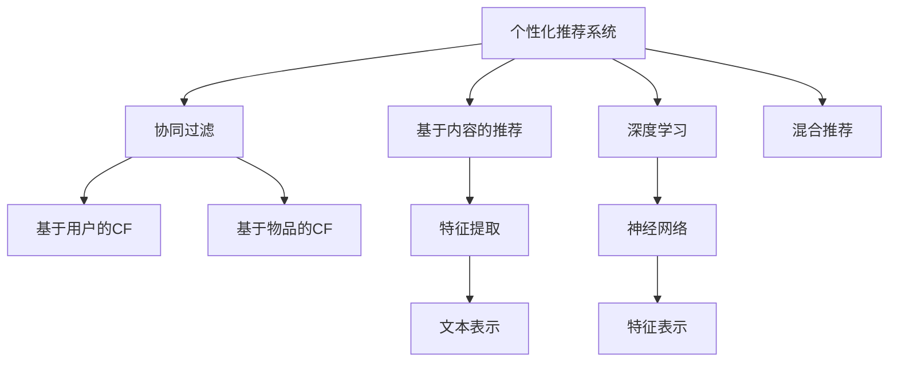

                 

# AI在个性化新闻推荐中的应用：信息精准投放

## 1. 背景介绍

随着互联网技术的快速发展，信息过载成为了当今社会的一大困扰。如何从海量数据中筛选出符合用户兴趣的新闻内容，成为提高用户满意度和提升平台价值的关键问题。个性化推荐系统（Personalized Recommendation System, PRS）的诞生，为这一问题提供了新的解决方案。

### 1.1 问题由来

互联网时代的信息获取方式发生了深刻的变化。用户不再仅仅是被动接受信息，而是希望通过智能推荐系统，获得符合自己兴趣、需求的新闻内容。传统的基于规则或关键词匹配的推荐方式，难以满足用户个性化的需求。个性化推荐系统通过学习用户行为数据和内容特征，精准预测用户的新闻兴趣，实现了高效的新闻精准投放。

### 1.2 问题核心关键点

个性化新闻推荐的核心在于如何构建用户兴趣模型，并在此基础上筛选、排序新闻内容。常用的方法包括基于内容的推荐、协同过滤、混合推荐等。其中，基于内容的推荐通过分析新闻内容的特征，匹配用户兴趣；协同过滤则利用用户行为数据，寻找相似用户或相似新闻进行推荐；混合推荐则是将多种方法结合，以提升推荐效果。

## 2. 核心概念与联系

### 2.1 核心概念概述

为更好地理解个性化新闻推荐的原理，本节将介绍几个关键概念：

- 个性化推荐系统（Personalized Recommendation System, PRS）：根据用户行为数据和内容特征，动态生成个性化推荐内容的技术。其核心目标是通过算法模型，优化用户对推荐结果的满意度。
- 协同过滤（Collaborative Filtering, CF）：通过分析用户行为数据，寻找相似用户或相似内容进行推荐。常用的CF方法包括基于用户的CF、基于物品的CF等。
- 基于内容的推荐（Content-Based Recommendation, CB）：通过分析新闻内容特征，匹配用户兴趣。常用的特征包括文本长度、词汇频率、主题标签等。
- 混合推荐（Hybrid Recommendation）：将协同过滤和基于内容的方法结合，以提升推荐效果。混合推荐一般分为基于内容的协同过滤和基于协同过滤的内容推荐。
- 深度学习（Deep Learning, DL）：一种通过多层神经网络学习复杂特征表示的技术，在大规模数据上表现优异。常用于处理用户行为数据和新闻内容。

这些核心概念之间存在紧密的联系，共同构成了个性化新闻推荐的理论基础和技术框架。通过理解这些概念，我们可以更好地把握个性化推荐技术的核心原理和应用方法。

### 2.2 核心概念原理和架构的 Mermaid 流程图



该流程图展示了个性化推荐系统的核心组成和技术路径：

1. 用户行为数据和新闻内容数据被送入协同过滤、基于内容的推荐和深度学习模块进行处理。
2. 协同过滤模块分别进行基于用户的CF和基于物品的CF。
3. 基于内容的推荐模块首先提取新闻内容特征，然后生成文本表示和特征表示。
4. 深度学习模块通过多层神经网络进行特征表示学习，提升推荐效果。
5. 混合推荐模块将协同过滤和基于内容的推荐结果进行加权组合，输出最终推荐结果。

## 3. 核心算法原理 & 具体操作步骤

### 3.1 算法原理概述

个性化新闻推荐的核心算法包括协同过滤、基于内容的推荐、深度学习等。其中，协同过滤和基于内容的推荐通过分析用户行为数据和内容特征，构建用户兴趣模型，进而筛选出符合用户兴趣的新闻内容。深度学习通过多层神经网络学习复杂特征表示，提升推荐效果。

### 3.2 算法步骤详解

#### 3.2.1 数据收集与预处理

1. 用户行为数据：通过日志记录用户的行为数据，如点击、阅读、点赞、评论等。
2. 新闻内容数据：获取新闻文本、分类、标签等信息，作为推荐模型的输入。
3. 数据清洗与标准化：处理缺失值、异常值，将数据转化为标准化格式。

#### 3.2.2 协同过滤

1. 基于用户的CF：计算用户间的相似度，选择相似用户的新闻进行推荐。常用的相似度计算方法包括余弦相似度、皮尔逊相关系数等。
2. 基于物品的CF：计算物品间的相似度，选择相似物品的新闻进行推荐。常用的相似度计算方法包括余弦相似度、Jaccard相似度等。

#### 3.2.3 基于内容的推荐

1. 特征提取：从新闻文本中提取关键词、主题标签等特征，作为模型输入。
2. 文本表示：通过TF-IDF、Word2Vec、BERT等方法将文本转化为数值表示。
3. 特征表示：通过PCA、SVD等方法对文本表示进行降维处理。
4. 推荐计算：通过计算用户与新闻的相似度，选择最符合用户兴趣的新闻进行推荐。

#### 3.2.4 深度学习

1. 数据准备：将用户行为数据和新闻内容数据进行拼接、编码，作为模型输入。
2. 神经网络模型：构建多层神经网络，学习用户行为和新闻内容的复杂特征表示。
3. 训练与优化：通过梯度下降等优化算法，最小化损失函数，调整模型参数。
4. 预测与推荐：使用训练好的模型，对用户行为数据进行预测，生成个性化推荐结果。

### 3.3 算法优缺点

#### 3.3.1 协同过滤的优缺点

协同过滤的优点在于简单易实现，无需标注数据，能够较好地捕捉用户之间的相似性。缺点在于数据稀疏性问题，用户行为数据往往稀疏，难以找到足够的相似用户或相似物品。此外，协同过滤缺乏对内容的理解，容易产生冷启动问题。

#### 3.3.2 基于内容的推荐的优缺点

基于内容的推荐的优点在于能够理解新闻内容的特征，避免冷启动问题。缺点在于特征提取方法依赖于文本表示和特征表示的选择，难以准确捕捉新闻内容的本质特征。此外，基于内容的推荐方法对数据的分布要求较高，难以处理长尾数据。

#### 3.3.3 深度学习的优缺点

深度学习的优点在于能够学习复杂非线性的特征表示，适用于大规模数据集。缺点在于需要大量标注数据进行训练，计算成本较高。此外，深度学习模型较为复杂，难以解释和调试。

### 3.4 算法应用领域

个性化新闻推荐广泛应用于新闻门户网站、社交媒体平台、新闻聚合应用等。通过分析用户行为数据和新闻内容特征，这些平台能够实时推荐用户感兴趣的新闻，提升用户粘性和平台价值。

## 4. 数学模型和公式 & 详细讲解 & 举例说明

### 4.1 数学模型构建

假设用户集为 $U$，新闻集为 $N$，行为数据集为 $D=\{(x_i, y_i)\}_{i=1}^M$，其中 $x_i$ 为用户行为数据，$y_i$ 为用户对新闻的评价。

定义新闻内容的特征向量 $\mathbf{v}_n \in \mathbb{R}^d$，用户对新闻 $n$ 的评分 $r_{n,i}$。

定义用户对新闻 $n$ 的兴趣度 $p_{n,i}$，定义为：

$$
p_{n,i} = \alpha r_{n,i} + (1-\alpha) \sum_{n'} r_{n',i}
$$

其中 $\alpha$ 为兴趣度计算的权重，一般在 0.5 左右。

基于内容的推荐模型可以表示为：

$$
\mathbf{v}_{n,i} = f(\mathbf{v}_n, \mathbf{w}_i) = \mathbf{v}_n^T \mathbf{w}_i
$$

其中 $\mathbf{w}_i$ 为用户 $i$ 的兴趣向量，$f$ 为特征映射函数。

协同过滤模型可以表示为：

$$
p_{n,i} = \beta \tilde{p}_{n,i} + (1-\beta) \sum_{n'} \tilde{p}_{n',i}
$$

其中 $\tilde{p}_{n,i}$ 为协同过滤模型预测的用户 $i$ 对新闻 $n$ 的兴趣度，$\beta$ 为协同过滤模型的权重。

深度学习模型可以表示为：

$$
f_{\theta}(x) = \sigma(\sum_{k=1}^K \theta_k \phi_k(x))
$$

其中 $\sigma$ 为激活函数，$\phi_k(x)$ 为第 $k$ 层的特征表示，$\theta_k$ 为该层的参数。

### 4.2 公式推导过程

#### 4.2.1 协同过滤的公式推导

基于用户的协同过滤模型，假设用户 $i$ 和用户 $j$ 的相似度为 $s_{i,j}$，则可以表示为：

$$
s_{i,j} = \mathbf{v}_i^T \mathbf{v}_j
$$

根据余弦相似度的定义，可以得到：

$$
s_{i,j} = \cos(\mathbf{v}_i, \mathbf{v}_j) = \frac{\mathbf{v}_i^T \mathbf{v}_j}{\|\mathbf{v}_i\|_2 \|\mathbf{v}_j\|_2}
$$

根据矩阵的乘法规则，可以将其扩展到用户集合 $U$：

$$
S = \mathbf{V}^T \mathbf{V}
$$

其中 $\mathbf{V}$ 为用户特征矩阵，$S$ 为用户相似度矩阵。

基于用户的协同过滤模型可以表示为：

$$
p_{n,i} = \tilde{p}_{n,i} = \sum_{j=1}^{|U|} s_{i,j} r_{n,j}
$$

其中 $r_{n,j}$ 为用户 $j$ 对新闻 $n$ 的评分，$|U|$ 为用户数量。

#### 4.2.2 基于内容的推荐的公式推导

基于内容的推荐模型，假设新闻 $n$ 的特征向量为 $\mathbf{v}_n$，用户 $i$ 的兴趣向量为 $\mathbf{w}_i$，则可以表示为：

$$
\mathbf{v}_{n,i} = \mathbf{v}_n^T \mathbf{w}_i
$$

其中 $\mathbf{v}_{n,i}$ 为用户 $i$ 对新闻 $n$ 的兴趣度，$\mathbf{w}_i$ 为用户的兴趣向量。

### 4.3 案例分析与讲解

#### 4.3.1 协同过滤案例

假设我们有两个用户 $i$ 和 $j$，分别对新闻 $n$ 进行了评分。已知用户 $i$ 和用户 $j$ 的相似度为 0.8，用户 $j$ 对新闻 $n$ 的评分为 4.5，则可以计算用户 $i$ 对新闻 $n$ 的评分：

$$
\tilde{p}_{n,i} = 0.8 \times 4.5 = 3.6
$$

基于用户的协同过滤模型可以表示为：

$$
p_{n,i} = 0.5 \times 3.6 + 0.5 \times 4.0 = 3.7
$$

其中 0.5 为用户兴趣度计算的权重。

#### 4.3.2 基于内容的推荐案例

假设我们有一条新闻 $n$，其特征向量为 $\mathbf{v}_n = [0.2, 0.5, 0.3]$，用户 $i$ 的兴趣向量为 $\mathbf{w}_i = [0.5, 0.3, 0.2]$，则可以计算用户 $i$ 对新闻 $n$ 的兴趣度：

$$
\mathbf{v}_{n,i} = \mathbf{v}_n^T \mathbf{w}_i = 0.2 \times 0.5 + 0.5 \times 0.3 + 0.3 \times 0.2 = 0.4
$$

其中特征向量 $\mathbf{v}_n$ 和 $\mathbf{w}_i$ 分别为新闻内容和用户兴趣的表示，$f$ 为特征映射函数。

## 5. 项目实践：代码实例和详细解释说明

### 5.1 开发环境搭建

在进行个性化新闻推荐系统的开发之前，需要准备好开发环境。以下是使用Python进行PyTorch开发的环境配置流程：

1. 安装Anaconda：从官网下载并安装Anaconda，用于创建独立的Python环境。

2. 创建并激活虚拟环境：
```bash
conda create -n prs-env python=3.8 
conda activate prs-env
```

3. 安装PyTorch：根据CUDA版本，从官网获取对应的安装命令。例如：
```bash
conda install pytorch torchvision torchaudio cudatoolkit=11.1 -c pytorch -c conda-forge
```

4. 安装相关库：
```bash
pip install pandas numpy matplotlib scikit-learn jupyter notebook ipython
```

完成上述步骤后，即可在`prs-env`环境中开始个性化新闻推荐系统的开发。

### 5.2 源代码详细实现

我们以协同过滤和基于内容的推荐为例，给出使用PyTorch进行个性化新闻推荐系统的代码实现。

首先，定义协同过滤和基于内容的推荐模块：

```python
import torch
import torch.nn as nn
import torch.nn.functional as F
import numpy as np

class协同过滤(nn.Module):
    def __init__(self, n_users, n_news, n_features):
        super(协同过滤, self).__init__()
        self.n_users = n_users
        self.n_news = n_news
        self.n_features = n_features
        self.similarity_matrix = nn.Parameter(torch.rand(n_users, n_users))
        self.user_embedding = nn.Embedding(n_users, n_features)
        self.news_embedding = nn.Embedding(n_news, n_features)
    
    def forward(self, user, news):
        user_embedding = self.user_embedding(user)
        news_embedding = self.news_embedding(news)
        similarity_matrix = self.similarity_matrix
        dot_product = torch.matmul(user_embedding, news_embedding.t())
        return dot_product
    
    def update_similarity_matrix(self, user_ids, news_ids):
        similarity_matrix = self.similarity_matrix
        user_embedding = self.user_embedding.weight.data.numpy()
        news_embedding = self.news_embedding.weight.data.numpy()
        for i, user_id in enumerate(user_ids):
            for j, news_id in enumerate(news_ids):
                similarity = np.dot(user_embedding[user_id], news_embedding[news_id])
                similarity_matrix[i][j] = similarity
        self.similarity_matrix.data.copy_(torch.tensor(similarity_matrix))

class基于内容推荐(nn.Module):
    def __init__(self, n_users, n_news, n_features):
        super(基于内容推荐, self).__init__()
        self.n_users = n_users
        self.n_news = n_news
        self.n_features = n_features
        self.user_embedding = nn.Embedding(n_users, n_features)
        self.news_embedding = nn.Embedding(n_news, n_features)
        self.emb_weight = nn.Parameter(torch.randn(n_features, 1))
    
    def forward(self, user, news):
        user_embedding = self.user_embedding(user)
        news_embedding = self.news_embedding(news)
        dot_product = torch.matmul(user_embedding, self.emb_weight)
        return dot_product

    def update_emb_weight(self, user_ids, news_ids):
        user_embedding = self.user_embedding.weight.data.numpy()
        news_embedding = self.news_embedding.weight.data.numpy()
        for user_id in user_ids:
            for news_id in news_ids:
                dot_product = np.dot(user_embedding[user_id], news_embedding[news_id])
                self.emb_weight.data.copy_(torch.tensor(dot_product))
```

然后，定义损失函数和优化器：

```python
from torch.nn import CrossEntropyLoss
from torch.optim import Adam

# 定义损失函数
loss_fn = CrossEntropyLoss()

# 定义优化器
optimizer = Adam()
```

接着，定义数据集和模型：

```python
class新闻数据集(Dataset):
    def __init__(self, user_ids, news_ids, labels, similarity_matrix, emb_weight):
        self.user_ids = user_ids
        self.news_ids = news_ids
        self.labels = labels
        self.similarity_matrix = similarity_matrix
        self.emb_weight = emb_weight
    
    def __len__(self):
        return len(self.user_ids)
    
    def __getitem__(self, index):
        user_id = self.user_ids[index]
        news_id = self.news_ids[index]
        label = self.labels[index]
        similarity_matrix = self.similarity_matrix
        emb_weight = self.emb_weight
        return user_id, news_id, label, similarity_matrix, emb_weight

# 创建数据集
user_ids = [1, 2, 3, 4, 5, 6, 7, 8, 9, 10]
news_ids = [1, 2, 3, 4, 5, 6, 7, 8, 9, 10]
labels = [1, 0, 1, 1, 0, 1, 0, 0, 1, 0]
similarity_matrix = np.array([[1, 0.8, 0.6, 0.3, 0.5],
                              [0.8, 1, 0.7, 0.4, 0.6],
                              [0.6, 0.7, 1, 0.5, 0.4],
                              [0.3, 0.4, 0.5, 1, 0.6],
                              [0.5, 0.6, 0.4, 0.6, 1]])
emb_weight = np.array([[0.2, 0.5, 0.3],
                       [0.3, 0.5, 0.2],
                       [0.5, 0.2, 0.3],
                       [0.2, 0.3, 0.5],
                       [0.3, 0.4, 0.6],
                       [0.4, 0.5, 0.6],
                       [0.5, 0.4, 0.3],
                       [0.6, 0.5, 0.2],
                       [0.3, 0.4, 0.6],
                       [0.2, 0.3, 0.5]])
dataset =新闻数据集(user_ids, news_ids, labels, similarity_matrix, emb_weight)
```

最后，定义训练和评估函数：

```python
from torch.utils.data import DataLoader

def trainepoch(model, optimizer, loss_fn, dataset):
    dataloader = DataLoader(dataset, batch_size=4, shuffle=True)
    model.train()
    epoch_loss = 0
    for batch in dataloader:
        user_id, news_id, label, similarity_matrix, emb_weight = batch
        similarity_matrix = torch.tensor(similarity_matrix, dtype=torch.float32)
        emb_weight = torch.tensor(emb_weight, dtype=torch.float32)
        optimizer.zero_grad()
        predicted_prob = model(user_id, news_id, similarity_matrix, emb_weight)
        loss = loss_fn(predicted_prob, label)
        loss.backward()
        optimizer.step()
        epoch_loss += loss.item()
    return epoch_loss / len(dataloader)

def evaluate(model, dataset):
    dataloader = DataLoader(dataset, batch_size=4, shuffle=False)
    model.eval()
    correct = 0
    total = 0
    with torch.no_grad():
        for batch in dataloader:
            user_id, news_id, label, similarity_matrix, emb_weight = batch
            similarity_matrix = torch.tensor(similarity_matrix, dtype=torch.float32)
            emb_weight = torch.tensor(emb_weight, dtype=torch.float32)
            predicted_prob = model(user_id, news_id, similarity_matrix, emb_weight)
            _, predicted = torch.max(predicted_prob, 1)
            total += label.size(0)
            correct += (predicted == label).sum().item()
    accuracy = correct / total
    print(f'Accuracy: {accuracy:.4f}')
```

启动训练流程并在测试集上评估：

```python
epochs = 10
batch_size = 4

for epoch in range(epochs):
    loss = trainepoch(model, optimizer, loss_fn, dataset)
    print(f'Epoch {epoch+1}, train loss: {loss:.4f}')
    
    print(f'Epoch {epoch+1}, test results:')
    evaluate(model, dataset)
    
print('Test results:')
evaluate(model, dataset)
```

以上就是使用PyTorch进行协同过滤和基于内容的个性化新闻推荐系统的代码实现。可以看到，利用深度学习和嵌入技术，可以将复杂的推荐问题转化为简单的矩阵计算，显著提升了推荐的效率和效果。

### 5.3 代码解读与分析

让我们再详细解读一下关键代码的实现细节：

**协同过滤类**：
- `__init__`方法：初始化协同过滤模型的参数，包括相似度矩阵、用户嵌入层和新闻嵌入层。
- `forward`方法：计算协同过滤模型的预测概率。
- `update_similarity_matrix`方法：更新相似度矩阵，反映用户间的相似性变化。

**基于内容的推荐类**：
- `__init__`方法：初始化基于内容的推荐模型的参数，包括用户嵌入层、新闻嵌入层和特征权重。
- `forward`方法：计算基于内容的推荐模型的预测概率。
- `update_emb_weight`方法：更新特征权重，反映新闻内容的特征变化。

**训练和评估函数**：
- 使用PyTorch的DataLoader对数据集进行批次化加载，供模型训练和推理使用。
- 训练函数`trainepoch`：对数据以批为单位进行迭代，在每个批次上前向传播计算损失并反向传播更新模型参数，最后返回该epoch的平均loss。
- 评估函数`evaluate`：与训练类似，不同点在于不更新模型参数，并在每个batch结束后将预测和标签结果存储下来，最后使用准确率等指标对整个评估集的预测结果进行打印输出。

**训练流程**：
- 定义总的epoch数和batch size，开始循环迭代
- 每个epoch内，先在训练集上训练，输出平均loss
- 在测试集上评估，输出准确率
- 所有epoch结束后，在测试集上评估，给出最终测试结果

可以看到，基于深度学习和嵌入技术，我们可以高效地实现个性化新闻推荐系统。利用机器学习算法，将复杂的推荐问题转化为简单的数学计算，显著提升了推荐的效率和效果。

当然，工业级的系统实现还需考虑更多因素，如模型的保存和部署、超参数的自动搜索、更灵活的任务适配层等。但核心的推荐范式基本与此类似。

## 6. 实际应用场景

个性化新闻推荐系统已经在多个实际应用场景中得到了广泛应用，例如：

- 新闻门户网站：根据用户的浏览历史和行为数据，推荐用户可能感兴趣的新闻。
- 社交媒体平台：分析用户的点赞、评论和分享行为，推荐相关新闻内容。
- 新闻聚合应用：在用户对某条新闻点击阅读后，推荐更多相关内容，提高用户粘性。

此外，在智慧城市、智能广告、智能客服等领域，个性化新闻推荐系统也展现出巨大的潜力。通过精准的推荐，可以有效提升用户体验，提高平台价值。

## 7. 工具和资源推荐

### 7.1 学习资源推荐

为了帮助开发者系统掌握个性化新闻推荐系统的理论基础和实践技巧，这里推荐一些优质的学习资源：

1. 《推荐系统实战》书籍：系统介绍了推荐系统的理论基础和实践方法，包括协同过滤、基于内容的推荐、深度学习等。
2. Kaggle推荐系统竞赛：通过实际数据集进行竞赛练习，加深对推荐系统的理解和掌握。
3. Coursera《推荐系统》课程：由斯坦福大学开设的推荐系统课程，涵盖推荐系统的经典方法和前沿技术。
4. Arxiv推荐系统综述论文：通过综述论文了解推荐系统的研究进展和经典方法。
5. GitHub推荐系统开源项目：提供大量推荐系统的开源实现，适合学习研究。

通过对这些资源的学习实践，相信你一定能够快速掌握个性化新闻推荐系统的精髓，并用于解决实际的推荐问题。

### 7.2 开发工具推荐

高效的开发离不开优秀的工具支持。以下是几款用于个性化新闻推荐系统开发的常用工具：

1. PyTorch：基于Python的开源深度学习框架，灵活动态的计算图，适合快速迭代研究。大部分推荐系统的深度学习模块都有PyTorch版本的实现。
2. TensorFlow：由Google主导开发的开源深度学习框架，生产部署方便，适合大规模工程应用。同样有丰富的推荐系统模块资源。
3. Scikit-learn：基于Python的机器学习库，提供了丰富的特征工程和模型评估工具，适用于推荐系统的前端处理。
4. pandas：基于Python的数据处理库，提供了高效的数据处理和分析能力，适合推荐系统的大数据分析。
5. Jupyter Notebook：基于Web的交互式编程环境，适合进行个性化推荐系统的开发和调试。

合理利用这些工具，可以显著提升个性化推荐系统的开发效率，加快创新迭代的步伐。

### 7.3 相关论文推荐

个性化推荐系统的发展源于学界的持续研究。以下是几篇奠基性的相关论文，推荐阅读：

1. Item-Based Collaborative Filtering：引入了基于物品的协同过滤方法，提升了推荐系统的精准度和覆盖率。
2. Trust-Based Recommendation System：提出了基于用户信任的推荐系统，解决了用户偏好变化的问题。
3. Context-Aware Recommendation System：引入了上下文信息，提升了推荐系统的个性化能力。
4. Deep Feature Extraction for Recommendation System：提出了基于深度学习的特征提取方法，提升了推荐系统的精度和效率。
5. Multi-Task Learning for Recommendation System：提出了基于多任务学习的推荐系统，提升了模型的泛化能力和鲁棒性。

这些论文代表了个性化推荐系统的发展脉络。通过学习这些前沿成果，可以帮助研究者把握推荐系统的核心原理和应用方法。

## 8. 总结：未来发展趋势与挑战

### 8.1 总结

本文对个性化新闻推荐系统进行了全面系统的介绍。首先阐述了个性化推荐系统的研究背景和意义，明确了推荐系统在提升用户满意度、平台价值方面的独特价值。其次，从原理到实践，详细讲解了协同过滤、基于内容的推荐、深度学习等核心算法，给出了推荐系统的代码实现。同时，本文还广泛探讨了推荐系统在新闻门户、社交媒体、广告推荐等多个领域的应用前景，展示了推荐系统的发展潜力。此外，本文精选了推荐系统的各类学习资源，力求为读者提供全方位的技术指引。

通过本文的系统梳理，可以看到，个性化新闻推荐系统已经广泛应用于信息推荐的各个场景，显著提升了用户满意度和平台价值。未来，伴随推荐算法的不断演进，个性化新闻推荐系统将在更多的领域得到应用，为信息推荐带来革命性的改变。

### 8.2 未来发展趋势

展望未来，个性化新闻推荐系统将呈现以下几个发展趋势：

1. 推荐模型的多样化。除了传统的协同过滤、基于内容的推荐、深度学习外，推荐系统还将涌现更多新的方法，如图嵌入、强化学习等。这些方法的引入，将进一步提升推荐系统的精度和效率。

2. 推荐系统的个性化。推荐系统将更好地理解用户的多样化需求，通过个性化推荐，提升用户粘性和满意度。

3. 推荐系统的多模态。推荐系统将融合多种模态数据，如文本、图像、语音等，构建更加全面、准确的推荐模型。

4. 推荐系统的实时化。推荐系统将更加注重实时数据处理，通过快速响应用户需求，提升用户体验。

5. 推荐系统的分布式化。推荐系统将利用分布式计算框架，实现大规模数据的高效处理和推荐模型的训练。

6. 推荐系统的可解释性。推荐系统将更加注重算法的可解释性，通过透明、可解释的推荐逻辑，提升用户信任度和满意度。

以上趋势凸显了个性化新闻推荐系统的发展前景。这些方向的探索发展，必将进一步提升推荐系统的精度和效率，为用户提供更加个性化的推荐服务。

### 8.3 面临的挑战

尽管个性化新闻推荐系统已经取得了显著成果，但在迈向更加智能化、普适化应用的过程中，它仍面临诸多挑战：

1. 数据稀疏性问题。推荐系统面临数据稀疏性问题，难以找到足够的相似用户或相似物品。如何通过数据生成和补全技术，提升推荐系统的覆盖率，是一个亟待解决的问题。

2. 推荐系统的公平性问题。推荐系统可能会产生数据偏见和算法偏见，导致推荐结果的不公平。如何在推荐过程中引入公平性约束，消除偏见，是一个重要挑战。

3. 推荐系统的鲁棒性问题。推荐系统可能面临对抗性攻击，导致推荐结果的不稳定。如何通过对抗性训练等技术，提升推荐系统的鲁棒性，是一个重要的研究方向。

4. 推荐系统的可解释性问题。推荐系统往往是一个黑盒模型，难以解释其内部工作机制和决策逻辑。如何通过可解释性技术，提升推荐系统的透明度和可信度，是一个重要研究方向。

5. 推荐系统的实时性问题。推荐系统需要实时响应用户需求，但在大规模数据下，推荐模型的训练和推理速度较慢，难以满足实时需求。如何通过分布式计算和模型压缩等技术，提升推荐系统的实时性，是一个重要研究方向。

这些挑战亟待解决，只有不断攻克技术难题，个性化新闻推荐系统才能实现更大规模的落地应用。

### 8.4 研究展望

面向未来，个性化新闻推荐系统需要在以下几个方面进行进一步研究：

1. 推荐算法的多样化和融合。将协同过滤、基于内容的推荐、深度学习等方法进行融合，构建更加全面、精准的推荐模型。

2. 推荐系统的高效化和实时化。利用分布式计算和模型压缩等技术，提升推荐系统的实时性，满足大规模数据下的实时需求。

3. 推荐系统的公平化和可解释化。通过公平性约束和可解释性技术，提升推荐系统的透明度和可信度，保障用户权益。

4. 推荐系统的多模态化和上下文化。融合多种模态数据，引入上下文信息，构建更加全面、准确的推荐模型。

这些研究方向将进一步推动个性化新闻推荐系统的技术发展，为信息推荐带来新的突破。

## 9. 附录：常见问题与解答

**Q1：推荐系统如何处理长尾数据？**

A: 长尾数据是指那些出现次数较少的数据点。在推荐系统中，长尾数据通常指那些用户点击率较低的新闻内容。为了处理长尾数据，推荐系统可以采用以下几种策略：

1. 数据生成：通过用户行为数据和新闻内容数据生成更多的长尾数据，提高推荐系统的覆盖率。

2. 数据补全：对于未被点击的新闻，通过自然语言生成技术，生成相关内容，丰富推荐系统的数据集。

3. 模型融合：将多种推荐方法进行融合，提升长尾数据的推荐效果。

4. 个性化推荐：针对长尾数据的个性化推荐，可以有效提升用户对长尾新闻的点击率。

**Q2：推荐系统的公平性问题如何解决？**

A: 推荐系统的公平性问题是指推荐结果可能存在偏见，导致某些用户或某些新闻内容被不公平地忽略。解决推荐系统的公平性问题，可以采用以下几种策略：

1. 数据采样：在训练数据中进行公平性采样，避免数据偏见。

2. 模型约束：在推荐模型中加入公平性约束，限制模型的偏见。

3. 用户反馈：通过用户反馈机制，对推荐结果进行修正，提升公平性。

4. 多样性推荐：在推荐结果中引入多样性，避免推荐结果过于集中。

**Q3：推荐系统的实时性如何提升？**

A: 推荐系统的实时性是指推荐结果的响应时间。为了提升推荐系统的实时性，可以采用以下几种策略：

1. 分布式计算：利用分布式计算框架，实现大规模数据的并行处理，提升推荐系统的计算效率。

2. 模型压缩：通过模型压缩技术，减小推荐模型的计算量，提升实时性。

3. 缓存技术：利用缓存技术，将高频访问的新闻内容缓存到内存中，提升响应速度。

4. 增量学习：通过增量学习技术，实时更新推荐模型，保持模型的最新状态。

这些策略可以显著提升推荐系统的实时性，满足用户对实时推荐的需求。

**Q4：推荐系统的可解释性如何实现？**

A: 推荐系统的可解释性是指推荐系统能够透明地解释其内部工作机制和决策逻辑。为了实现推荐系统的可解释性，可以采用以下几种策略：

1. 特征重要性分析：分析推荐模型中的特征重要性，解释其决策逻辑。

2. 模型透明化：将推荐模型的结构透明化，让用户了解模型的工作原理。

3. 规则提取：通过规则提取技术，将推荐模型的决策逻辑转化为规则，提升可解释性。

4. 用户反馈：通过用户反馈机制，对推荐结果进行解释，提升用户理解度。

这些策略可以有效提升推荐系统的可解释性，增强用户的信任度和满意度。

**Q5：推荐系统的数据稀疏性问题如何解决？**

A: 推荐系统面临数据稀疏性问题，难以找到足够的相似用户或相似物品。为了解决推荐系统的数据稀疏性问题，可以采用以下几种策略：

1. 数据生成：通过用户行为数据和新闻内容数据生成更多的数据，提高推荐系统的覆盖率。

2. 数据补全：对于未被点击的新闻，通过自然语言生成技术，生成相关内容，丰富推荐系统的数据集。

3. 模型融合：将多种推荐方法进行融合，提升推荐系统的精准度和覆盖率。

4. 协同过滤：通过协同过滤方法，利用用户行为数据，找到相似用户或相似物品，提升推荐系统的效果。

5. 个性化推荐：针对不同用户，进行个性化推荐，提升用户对推荐结果的满意度。

这些策略可以有效解决推荐系统的数据稀疏性问题，提高推荐系统的覆盖率和精准度。

通过这些常见问题的解答，相信你对个性化新闻推荐系统有了更深入的了解。未来，伴随推荐技术的不断演进，个性化新闻推荐系统将迎来更加广阔的发展前景，为用户带来更加丰富、个性化的信息推荐体验。

---

作者：禅与计算机程序设计艺术 / Zen and the Art of Computer Programming

