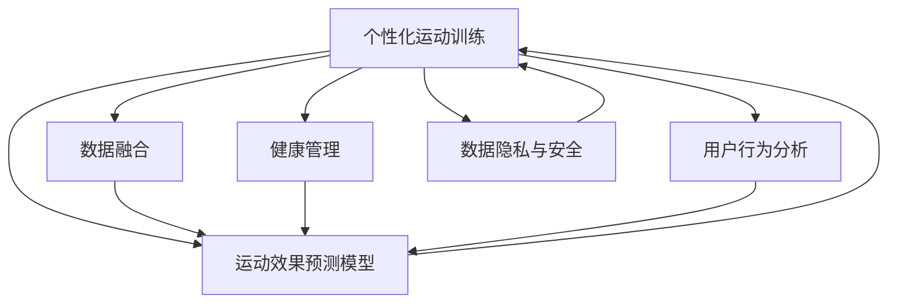

                 

# AI在个性化运动训练中的应用：优化训练效果

> 关键词：个性化运动训练, 运动效果优化, 预测模型, 数据融合, 健康管理, 用户行为分析

## 1. 背景介绍

### 1.1 问题由来

随着人们生活水平的提高和健康意识的增强，个性化运动训练逐渐成为人们关注的热点。运动训练不仅仅是为了增强体质，更是一种健康管理的重要手段。然而，传统的运动训练往往缺乏科学的指导和个性化的设计，导致训练效果不佳，甚至可能造成运动损伤。为了解决这些问题，AI技术被引入到个性化运动训练中，通过数据驱动的方法，为用户量身定制科学的训练计划，从而提高训练效果，降低运动损伤风险。

### 1.2 问题核心关键点

个性化运动训练的核心在于如何通过AI技术，根据用户的身体状况、运动习惯、目标需求等信息，为其设计个性化的训练方案。具体而言，需要解决以下几个关键问题：

- 用户数据的收集与处理：如何高效收集用户的运动数据，并对数据进行清洗、标注和预处理。
- 运动效果预测模型：如何构建预测模型，准确预测不同训练方案对用户运动效果的影响。
- 训练计划的优化与推荐：如何根据预测结果，为用户推荐最优的训练计划，并进行动态调整。
- 数据隐私与安全：如何保护用户的运动数据隐私，防止数据泄露和滥用。

这些关键问题构成了一个复杂的AI应用系统，需要通过多学科的协同合作来解决。

### 1.3 问题研究意义

个性化运动训练的应用研究具有重要的现实意义：

1. **提高训练效果**：通过科学的训练计划，可以更好地激发用户的运动潜力，提高训练效果。
2. **降低运动损伤风险**：个性化的训练方案能够根据用户的身体状况和训练进度，合理分配训练强度和内容，降低运动损伤的风险。
3. **促进健康管理**：个性化的训练不仅关注运动效果，还结合健康监测数据，进行全面的健康管理。
4. **提升用户体验**：个性化的训练计划能够满足用户的个性化需求，提升用户的运动体验。
5. **推动运动产业升级**：AI技术的引入，将推动传统运动产业向智能化、个性化方向升级，带来新的商业机会。

## 2. 核心概念与联系

### 2.1 核心概念概述

为更好地理解AI在个性化运动训练中的应用，本节将介绍几个密切相关的核心概念：

- **个性化运动训练**：根据用户的身体状况、运动习惯、目标需求等信息，为其量身定制个性化的训练方案，以提高训练效果，降低运动损伤风险。
- **运动效果预测模型**：通过机器学习算法，预测不同训练方案对用户运动效果的影响，包括心率、体脂率、肌肉强度等指标。
- **数据融合**：将不同来源的运动数据进行整合，生成更为全面、准确的训练效果预测模型。
- **健康管理**：结合用户的运动数据和健康监测数据，进行全面的健康管理，提升用户的整体健康水平。
- **用户行为分析**：通过分析用户的运动行为，发现其运动规律和偏好，进一步优化训练计划。
- **数据隐私与安全**：保护用户的运动数据隐私，防止数据泄露和滥用，确保数据安全。

这些核心概念之间的逻辑关系可以通过以下Mermaid流程图来展示：



这个流程图展示了个性化运动训练的核心概念及其之间的关系：

1. 个性化运动训练通过收集用户数据，结合运动效果预测模型，生成个性化的训练方案。
2. 数据融合将不同来源的运动数据整合，提升预测模型的准确性。
3. 健康管理结合用户的运动数据和健康监测数据，进行全面的健康评估和管理。
4. 用户行为分析通过分析用户的运动行为，发现其运动规律和偏好，进一步优化训练计划。
5. 数据隐私与安全保护用户的运动数据隐私，防止数据泄露和滥用。

这些概念共同构成了AI在个性化运动训练中的应用框架，使其能够更好地满足用户的个性化需求，提升训练效果，促进健康管理。

## 3. 核心算法原理 & 具体操作步骤
### 3.1 算法原理概述

AI在个性化运动训练中的核心算法原理主要包括以下几个方面：

- **数据预处理**：对用户运动数据进行清洗、归一化、特征提取等预处理操作，以便于后续模型的训练。
- **运动效果预测模型**：利用机器学习算法，预测不同训练方案对用户运动效果的影响，如心率、体脂率、肌肉强度等指标。
- **训练计划优化**：根据预测结果，为用户推荐最优的训练计划，并进行动态调整，以适应用户的训练进度和身体状况变化。
- **数据隐私与安全**：采用数据加密、访问控制等技术，保护用户数据的隐私和安全。

### 3.2 算法步骤详解

基于AI的个性化运动训练主要包括以下几个关键步骤：

**Step 1: 数据收集与处理**
- 设计运动数据收集设备，如运动手表、智能健身器材等，收集用户的运动数据。
- 对数据进行清洗、标注、归一化等预处理操作，生成可用于训练和推理的数据集。

**Step 2: 构建运动效果预测模型**
- 选择合适的机器学习算法，如随机森林、支持向量机、神经网络等，设计特征工程流程，提取关键特征。
- 在标注好的训练数据集上训练模型，并使用验证集进行超参数调优。

**Step 3: 训练计划优化与推荐**
- 根据预测模型输出，生成个性化的训练计划。
- 对训练计划进行优化，如调整训练强度、休息时间等，以适应用户的训练进度和身体状况变化。
- 使用推荐算法，如协同过滤、基于矩阵分解的方法等，为用户推荐训练计划。

**Step 4: 健康管理与行为分析**
- 结合用户的运动数据和健康监测数据，进行全面的健康评估和管理，生成健康报告。
- 分析用户的运动行为，发现其运动规律和偏好，进一步优化训练计划。

**Step 5: 数据隐私与安全**
- 采用数据加密、访问控制等技术，保护用户数据的隐私和安全。
- 定期进行数据备份，防止数据丢失。

### 3.3 算法优缺点

基于AI的个性化运动训练具有以下优点：

- **高效性**：通过机器学习算法，可以高效地预测不同训练方案对用户运动效果的影响，生成个性化的训练计划。
- **准确性**：结合多源数据进行数据融合，生成更为全面、准确的预测模型。
- **灵活性**：可以动态调整训练计划，适应用户的训练进度和身体状况变化。
- **个性化**：根据用户的身体状况、运动习惯、目标需求等信息，量身定制个性化的训练方案。

同时，该方法也存在一定的局限性：

- **数据依赖**：模型的性能很大程度上取决于数据的质量和数量，数据收集和处理的成本较高。
- **算法复杂度**：构建预测模型和优化训练计划，需要较复杂的技术实现。
- **隐私风险**：用户的运动数据涉及隐私，数据泄露和滥用风险较大。
- **模型泛化能力**：不同的用户群体和运动场景，可能需要不同的模型，模型泛化能力有限。

尽管存在这些局限性，但就目前而言，基于AI的个性化运动训练方法仍是个性化运动训练的重要范式。未来相关研究的重点在于如何进一步降低数据收集和处理的成本，提高模型的泛化能力，同时兼顾数据隐私和安全等因素。

### 3.4 算法应用领域

基于AI的个性化运动训练已经在诸多领域得到了应用，例如：

- **运动健身**：为用户提供个性化的健身计划，提高运动效果，降低运动损伤风险。
- **康复训练**：为康复患者提供个性化的康复训练方案，加速康复进程。
- **运动医学**：结合运动数据和健康监测数据，进行全面的健康评估和管理。
- **运动竞技**：为运动员提供个性化的训练计划，提高竞技水平。
- **体育赛事**：为运动员和教练提供训练效果分析工具，优化训练方案。
- **企业健康管理**：为企业员工提供个性化的运动指导，提升员工健康水平，减少健康成本。

除了上述这些经典应用外，基于AI的个性化运动训练还被创新性地应用于运动科研、运动心理干预等多个领域，为运动训练和健康管理带来了新的突破。

## 4. 数学模型和公式 & 详细讲解 & 举例说明
### 4.1 数学模型构建

本节将使用数学语言对AI在个性化运动训练中的应用进行更加严格的刻画。

记用户的运动数据为 $X = (x_1, x_2, ..., x_n)$，其中 $x_i$ 表示第 $i$ 次运动的数据，包括时间、距离、心率等指标。设运动效果预测模型为 $f(X; \theta)$，其中 $\theta$ 为模型参数。

定义用户运动效果的预测指标为 $Y = (y_1, y_2, ..., y_n)$，其中 $y_i$ 表示第 $i$ 次运动的预测效果，如心率、体脂率、肌肉强度等指标。

目标是最小化预测误差 $L(f(X; \theta), Y)$，即：

$$
\min_{\theta} L(f(X; \theta), Y)
$$

在实践中，我们通常使用损失函数来近似求解上述最优化问题。常用的损失函数包括均方误差损失、交叉熵损失等。

### 4.2 公式推导过程

以均方误差损失函数为例，其公式如下：

$$
L(f(X; \theta), Y) = \frac{1}{N} \sum_{i=1}^N (y_i - f(x_i; \theta))^2
$$

其中 $N$ 为数据集的大小。

根据梯度下降算法，模型的参数更新公式为：

$$
\theta \leftarrow \theta - \eta \nabla_{\theta} L(f(X; \theta), Y)
$$

其中 $\eta$ 为学习率，$\nabla_{\theta} L(f(X; \theta), Y)$ 为损失函数对模型参数 $\theta$ 的梯度。

### 4.3 案例分析与讲解

以下我们以心率预测为例，给出一个具体的案例分析。

假设我们有一批用户的运动数据，每条数据包含时间、距离、心率等指标。我们的目标是通过这些数据，预测用户的平均心率，以指导训练计划的制定。

首先，我们设计特征工程流程，提取出关键特征，如运动时间、距离、强度等级等。然后，在训练集上训练模型，并使用验证集进行超参数调优。假设我们选择了随机森林作为预测模型，其核心代码如下：

```python
from sklearn.ensemble import RandomForestRegressor
from sklearn.metrics import mean_squared_error
from sklearn.model_selection import train_test_split

X_train, X_test, y_train, y_test = train_test_split(X, y, test_size=0.2, random_state=42)
model = RandomForestRegressor(n_estimators=100, random_state=42)
model.fit(X_train, y_train)
y_pred = model.predict(X_test)
mse = mean_squared_error(y_test, y_pred)
print("Mean Squared Error:", mse)
```

上述代码实现了随机森林模型的训练和预测，并计算了均方误差。通过不断调整模型参数和特征工程流程，可以得到较为准确的预测结果。

## 5. 项目实践：代码实例和详细解释说明
### 5.1 开发环境搭建

在进行AI在个性化运动训练中的应用实践前，我们需要准备好开发环境。以下是使用Python进行TensorFlow开发的环境配置流程：

1. 安装Anaconda：从官网下载并安装Anaconda，用于创建独立的Python环境。

2. 创建并激活虚拟环境：
```bash
conda create -n tf-env python=3.8 
conda activate tf-env
```

3. 安装TensorFlow：根据CUDA版本，从官网获取对应的安装命令。例如：
```bash
conda install tensorflow tensorflow-gpu -c conda-forge -c pypi
```

4. 安装各类工具包：
```bash
pip install numpy pandas scikit-learn matplotlib tqdm jupyter notebook ipython
```

完成上述步骤后，即可在`tf-env`环境中开始AI在个性化运动训练中的应用实践。

### 5.2 源代码详细实现

下面我们以心率预测为例，给出使用TensorFlow对用户运动数据进行预测的代码实现。

首先，定义数据预处理函数：

```python
import tensorflow as tf
from tensorflow.keras.preprocessing import sequence

def preprocess_data(X, y):
    X = tf.keras.preprocessing.text.text_to_word_sequence(X)
    X = sequence.pad_sequences(X, maxlen=max_length, padding='post', truncating='post')
    y = tf.keras.utils.to_categorical(y, num_classes=num_classes)
    return X, y
```

然后，定义模型和损失函数：

```python
from tensorflow.keras.models import Sequential
from tensorflow.keras.layers import Dense, LSTM, Dropout

model = Sequential([
    LSTM(64, input_shape=(max_length, input_dim)),
    Dropout(0.2),
    Dense(num_classes, activation='softmax')
])

loss = tf.keras.losses.CategoricalCrossentropy()
```

接着，定义训练和评估函数：

```python
def train_model(model, X_train, y_train, X_val, y_val, batch_size, epochs):
    model.compile(optimizer='adam', loss=loss, metrics=['accuracy'])
    model.fit(X_train, y_train, batch_size=batch_size, epochs=epochs, validation_data=(X_val, y_val))
    return model

def evaluate_model(model, X_test, y_test):
    _, accuracy = model.evaluate(X_test, y_test, verbose=0)
    return accuracy
```

最后，启动训练流程并在测试集上评估：

```python
X_train, X_val, X_test, y_train, y_val, y_test = train_test_split(X, y, test_size=0.2, random_state=42)

model = train_model(model, X_train, y_train, X_val, y_val, batch_size=32, epochs=50)
accuracy = evaluate_model(model, X_test, y_test)
print("Test Accuracy:", accuracy)
```

以上就是使用TensorFlow对用户运动数据进行预测的完整代码实现。可以看到，TensorFlow的强大封装使得模型训练和推理变得简单高效。

### 5.3 代码解读与分析

让我们再详细解读一下关键代码的实现细节：

**preprocess_data函数**：
- 将文本数据转化为数字序列，并进行填充和截断处理。
- 将标签进行one-hot编码，以便于模型训练。

**train_model函数**：
- 定义模型结构，包括LSTM层、Dropout层和输出层。
- 使用交叉熵损失函数和Adam优化器进行模型训练。
- 在训练过程中，使用验证集进行模型评估和参数调优。

**evaluate_model函数**：
- 在测试集上评估模型的性能，返回测试准确率。

**训练流程**：
- 划分训练集、验证集和测试集。
- 在训练集上训练模型，并在验证集上评估模型性能。
- 在测试集上评估模型性能，并输出测试准确率。

可以看到，TensorFlow提供了丰富的工具和接口，使得模型训练和推理变得简单高效。开发者可以将更多精力放在数据预处理、模型改进等高层逻辑上，而不必过多关注底层的实现细节。

当然，工业级的系统实现还需考虑更多因素，如模型的保存和部署、超参数的自动搜索、更灵活的任务适配层等。但核心的训练范式基本与此类似。

## 6. 实际应用场景
### 6.1 智能健身

基于AI的个性化运动训练技术，可以广泛应用于智能健身设备的开发中。智能健身设备通过收集用户的运动数据，结合AI算法，为用户提供个性化的健身方案，从而提高训练效果，降低运动损伤风险。

在技术实现上，可以结合用户的生理数据（如心率、体脂率等）和运动数据（如运动时间、距离等），构建运动效果预测模型。通过模型预测，生成个性化的训练计划，并进行动态调整。智能健身设备还可以实时监测用户的运动状态，及时调整训练计划，确保训练安全和有效性。

### 6.2 康复训练

康复训练是另一个典型应用场景。康复训练往往需要个性化的训练方案，以适应不同患者的身体状况和康复进度。基于AI的个性化运动训练技术，可以为康复患者提供个性化的康复方案，加速康复进程。

在技术实现上，可以收集患者的运动数据和健康监测数据，结合AI算法，构建运动效果预测模型。通过模型预测，生成个性化的康复训练计划，并进行动态调整。康复设备可以实时监测患者的运动状态，及时调整训练强度和内容，确保康复训练的安全和有效性。

### 6.3 运动医学

运动医学是另一个重要应用领域。运动医学不仅关注运动效果，还涉及身体健康和心理健康的综合评估和管理。基于AI的个性化运动训练技术，可以为运动医学专家提供训练效果分析工具，优化训练方案，提升运动效果。

在技术实现上，可以结合用户的运动数据和健康监测数据，构建运动效果预测模型。通过模型预测，生成个性化的训练计划，并进行动态调整。运动医学专家可以通过AI工具，对训练效果进行全面评估，提出改进建议。

### 6.4 运动竞技

运动竞技是另一个重要应用领域。运动员的训练效果直接影响其竞技水平，基于AI的个性化运动训练技术，可以为运动员提供个性化的训练方案，提升竞技水平。

在技术实现上，可以收集运动员的运动数据和健康监测数据，结合AI算法，构建运动效果预测模型。通过模型预测，生成个性化的训练计划，并进行动态调整。运动教练可以通过AI工具，对训练效果进行全面评估，优化训练方案。

### 6.5 体育赛事

体育赛事是另一个重要应用领域。赛事的训练效果直接影响运动员的表现，基于AI的个性化运动训练技术，可以为运动员提供个性化的训练方案，提升竞技水平。

在技术实现上，可以收集运动员的运动数据和健康监测数据，结合AI算法，构建运动效果预测模型。通过模型预测，生成个性化的训练计划，并进行动态调整。运动教练可以通过AI工具，对训练效果进行全面评估，优化训练方案。

### 6.6 企业健康管理

企业健康管理是另一个重要应用领域。企业员工的身体健康和心理健康直接影响企业的运营效率。基于AI的个性化运动训练技术，可以为员工提供个性化的运动指导，提升健康水平。

在技术实现上，可以收集员工的运动数据和健康监测数据，结合AI算法，构建运动效果预测模型。通过模型预测，生成个性化的运动指导，并进行动态调整。企业可以通过AI工具，对员工的健康状态进行全面评估，提出改进建议。

## 7. 工具和资源推荐
### 7.1 学习资源推荐

为了帮助开发者系统掌握AI在个性化运动训练中的应用理论基础和实践技巧，这里推荐一些优质的学习资源：

1. **《深度学习》课程**：斯坦福大学开设的深度学习课程，全面介绍了深度学习的理论基础和实践技巧，是学习AI技术的必备资源。

2. **《Python深度学习》书籍**：TensorFlow的官方文档，全面介绍了TensorFlow的使用方法和应用场景，是学习TensorFlow的重要资源。

3. **《运动生理学》书籍**：了解运动生理学的基本原理和应用，为设计运动训练方案提供科学依据。

4. **《个性化运动训练》论文**：相关领域的最新研究成果，了解AI在个性化运动训练中的应用进展和挑战。

5. **《健康管理》课程**：了解健康管理的理论基础和实践方法，为设计个性化的运动训练方案提供理论支撑。

通过对这些资源的学习实践，相信你一定能够快速掌握AI在个性化运动训练中的应用精髓，并用于解决实际的训练问题。

### 7.2 开发工具推荐

高效的开发离不开优秀的工具支持。以下是几款用于AI在个性化运动训练中的应用开发的常用工具：

1. **TensorFlow**：基于Python的开源深度学习框架，灵活动态的计算图，适合快速迭代研究。

2. **PyTorch**：基于Python的开源深度学习框架，灵活性高，适合科学研究。

3. **Keras**：基于TensorFlow和Theano的高级神经网络API，简单易用，适合快速原型开发。

4. **Jupyter Notebook**：开源的交互式笔记本，支持多种编程语言，适合数据科学和机器学习的研究和开发。

5. **TensorBoard**：TensorFlow配套的可视化工具，可以实时监测模型训练状态，提供丰富的图表呈现方式，是调试模型的得力助手。

6. **Weights & Biases**：模型训练的实验跟踪工具，可以记录和可视化模型训练过程中的各项指标，方便对比和调优。

合理利用这些工具，可以显著提升AI在个性化运动训练中的应用开发效率，加快创新迭代的步伐。

### 7.3 相关论文推荐

AI在个性化运动训练中的应用源于学界的持续研究。以下是几篇奠基性的相关论文，推荐阅读：

1. **《个性化运动训练：基于机器学习的运动效果预测》**：介绍了基于机器学习算法，预测不同训练方案对用户运动效果的影响，并生成个性化的训练计划。

2. **《运动训练的AI化：基于深度学习的运动效果评估与预测》**：介绍了基于深度学习算法，预测不同训练方案对用户运动效果的影响，并进行运动效果的评估和预测。

3. **《AI在康复训练中的应用：基于运动数据的个性化康复方案设计》**：介绍了基于AI技术，为康复患者设计个性化的康复训练方案，加速康复进程。

4. **《运动竞技的AI化：基于深度学习的运动员训练效果评估与优化》**：介绍了基于深度学习算法，对运动员训练效果进行全面评估，并优化训练方案。

5. **《企业健康管理的AI化：基于个性化运动训练的员工健康管理》**：介绍了基于AI技术，为员工提供个性化的运动指导，提升健康水平。

这些论文代表了大AI在个性化运动训练中的应用的发展脉络。通过学习这些前沿成果，可以帮助研究者把握学科前进方向，激发更多的创新灵感。

## 8. 总结：未来发展趋势与挑战

### 8.1 总结

本文对AI在个性化运动训练中的应用进行了全面系统的介绍。首先阐述了个性化运动训练的研究背景和意义，明确了AI技术在提升训练效果、降低运动损伤风险等方面的独特价值。其次，从原理到实践，详细讲解了AI在个性化运动训练中的应用过程，包括数据预处理、运动效果预测模型、训练计划优化与推荐等关键环节，给出了AI在个性化运动训练中的应用实践代码实例。同时，本文还广泛探讨了AI在个性化运动训练中的应用场景，展示了AI技术在不同领域的应用前景。

通过本文的系统梳理，可以看到，AI在个性化运动训练中的应用正在成为运动训练的重要范式，极大地拓展了运动训练的智能化水平，推动了运动训练技术的产业化进程。未来，伴随AI技术的不断进步，基于AI的个性化运动训练必将引领运动训练的变革，带来更科学、高效、个性化的运动训练方案。

### 8.2 未来发展趋势

展望未来，AI在个性化运动训练中的应用将呈现以下几个发展趋势：

1. **模型精度提升**：随着数据量和计算资源的增加，AI模型将越来越精确，能够更好地预测不同训练方案对用户运动效果的影响，生成更加个性化的训练方案。

2. **多模态数据融合**：除了运动数据和生理数据，未来的AI模型还将融合视觉、语音等多模态数据，提供更加全面、准确的训练效果预测。

3. **实时训练优化**：未来的AI模型将具备实时训练和优化能力，能够动态调整训练计划，适应用户的训练进度和身体状况变化。

4. **跨领域应用推广**：AI在个性化运动训练中的应用将逐步推广到其他领域，如康复训练、运动医学、运动竞技等，带来更多创新应用场景。

5. **人工智能与运动科学的结合**：未来的AI模型将与运动科学深度结合，提供更加科学、合理的训练方案，推动运动科学的进步。

6. **数据隐私与安全**：未来的AI模型将更加注重数据隐私与安全，通过区块链、联邦学习等技术，保护用户数据的隐私和安全。

以上趋势凸显了AI在个性化运动训练中的应用前景。这些方向的探索发展，必将进一步提升AI在个性化运动训练中的应用效果，推动运动训练技术的全面升级。

### 8.3 面临的挑战

尽管AI在个性化运动训练中的应用已经取得了显著成果，但在迈向更加智能化、普适化应用的过程中，它仍面临诸多挑战：

1. **数据质量与数量**：AI模型性能很大程度上取决于数据的质量和数量，高质量数据的获取和处理成本较高。如何降低数据收集和处理的成本，提高数据质量，将是未来的一个重要研究方向。

2. **模型泛化能力**：不同用户群体和运动场景，可能需要不同的模型，模型泛化能力有限。如何构建更加泛化的AI模型，适应不同的运动场景和用户需求，将是未来的挑战。

3. **训练时间与资源**：AI模型的训练需要大量的计算资源和时间，如何优化训练算法，提高训练效率，将是未来的一个重要研究方向。

4. **数据隐私与安全**：用户的运动数据涉及隐私，数据泄露和滥用风险较大。如何保护用户数据隐私，防止数据泄露和滥用，将是未来的一个重要研究方向。

5. **算法的可解释性**：AI模型的决策过程缺乏可解释性，难以进行调试和优化。如何赋予AI模型更强的可解释性，将是未来的一个重要研究方向。

6. **伦理道德问题**：AI模型在应用过程中，可能出现偏见、歧视等问题，如何确保AI模型的公平性、透明性和伦理性，将是未来的一个重要研究方向。

正视AI在个性化运动训练中所面临的这些挑战，积极应对并寻求突破，将是大AI在个性化运动训练中走向成熟的重要保障。相信随着学界和产业界的共同努力，这些挑战终将一一被克服，AI在个性化运动训练中的应用必将更加广泛和深入。

### 8.4 研究展望

面对AI在个性化运动训练中所面临的挑战，未来的研究需要在以下几个方面寻求新的突破：

1. **无监督学习和半监督学习**：摆脱对大规模标注数据的依赖，利用无监督学习和半监督学习，最大限度利用非结构化数据，实现更加灵活高效的个性化训练。

2. **深度强化学习**：结合深度强化学习技术，实现更加智能化的训练计划生成和动态优化。

3. **联邦学习和分布式训练**：采用联邦学习和分布式训练技术，保护用户数据的隐私和安全，提高数据处理效率。

4. **多模态数据融合**：将视觉、语音等多模态数据融合到运动数据中，提供更加全面、准确的训练效果预测。

5. **AI与运动科学的结合**：将AI技术与运动科学深度结合，提供更加科学、合理的训练方案，推动运动科学的进步。

6. **数据隐私与安全**：采用区块链、联邦学习等技术，保护用户数据的隐私和安全，确保数据安全。

这些研究方向的探索，必将引领AI在个性化运动训练中的应用走向更高的台阶，为运动训练技术的全面升级和智能化发展铺平道路。面向未来，AI在个性化运动训练中的应用需要与其他人工智能技术进行更深入的融合，如知识表示、因果推理、强化学习等，多路径协同发力，共同推动运动训练技术的进步。只有勇于创新、敢于突破，才能不断拓展AI在个性化运动训练中的应用边界，让运动训练更加科学、高效、个性化。

## 9. 附录：常见问题与解答

**Q1：AI在个性化运动训练中的应用是否适用于所有运动场景？**

A: AI在个性化运动训练中的应用，主要适用于需要进行科学训练的场景，如健身、康复训练、运动医学、运动竞技等。对于日常生活中的休闲运动场景，AI的应用可能不如人工指导。

**Q2：如何降低AI在个性化运动训练中的应用成本？**

A: 降低AI在个性化运动训练中的应用成本，可以从以下几个方面入手：
1. 数据收集与处理自动化：使用自动数据收集设备和高效的数据处理算法，降低数据收集和处理的成本。
2. 模型压缩与优化：使用模型压缩和优化技术，减小模型的存储空间和计算量，降低算力需求。
3. 联邦学习和分布式训练：采用联邦学习和分布式训练技术，减少数据传输和存储成本。

**Q3：AI在个性化运动训练中的应用是否需要高精度的设备？**

A: AI在个性化运动训练中的应用，确实需要高精度的设备进行数据收集和处理。高精度设备可以提高数据的质量和可靠性，从而提高AI模型的性能和效果。

**Q4：AI在个性化运动训练中的应用是否会侵犯用户的隐私？**

A: AI在个性化运动训练中的应用，需要收集用户的运动数据和健康监测数据，确实存在隐私风险。为保护用户隐私，可以采用数据加密、访问控制等技术，确保数据安全。同时，用户可以通过匿名化数据，降低隐私风险。

**Q5：AI在个性化运动训练中的应用是否会过拟合？**

A: AI在个性化运动训练中的应用，可能会面临过拟合问题，特别是在数据量较小的情况下。为避免过拟合，可以采用数据增强、正则化、模型集成等技术，提高模型的泛化能力。

这些回答提供了对AI在个性化运动训练中应用的深入理解，帮助开发者更好地应对实际问题。

---

作者：禅与计算机程序设计艺术 / Zen and the Art of Computer Programming

