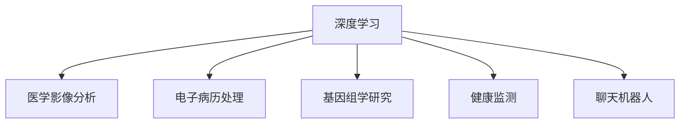

                 

## 1. 背景介绍

### 1.1 问题由来

随着人工智能技术的飞速发展，AI在医疗诊断和健康管理领域的应用逐渐成为热门话题。其中，基于深度学习的AI系统通过分析医疗图像、病历、基因信息等大量数据，在辅助诊断、疾病预测、个性化治疗方案制定等方面显示出巨大潜力。但是，面对繁杂的医学数据和多变的医疗场景，AI在医疗领域的应用仍面临诸多挑战。

### 1.2 问题核心关键点

目前，AI在医疗诊断和健康管理中的主要应用包括以下几个方面：

- **医学影像分析**：如X光片、CT、MRI等影像数据的自动分析和异常检测。
- **电子病历处理**：从电子病历中提取关键信息，辅助医生进行决策。
- **基因组学研究**：基于基因信息进行疾病预测和个性化治疗方案制定。
- **健康监测**：通过可穿戴设备和传感器监测用户的健康状态，如心率、血压、血糖等生理指标。
- **聊天机器人**：提供智能问答和情感支持，减轻医生的工作负担。

AI在医疗领域的应用不仅能够提高医疗服务的效率和质量，还能在一定程度上缓解医疗资源短缺的问题，具有巨大的社会和经济价值。但同时，AI的应用也带来了数据隐私、算法透明性、道德伦理等诸多挑战，需要各方共同努力解决。

### 1.3 问题研究意义

AI在医疗诊断和健康管理中的应用，具有重要的研究意义：

- **提升医疗服务质量**：通过AI辅助诊断，能够提高诊断的准确性和速度，减少误诊和漏诊。
- **优化资源配置**：利用AI分析大量医疗数据，优化医院和医疗资源的配置，提升医疗效率。
- **支持个性化医疗**：通过基因组学和大数据技术，实现个性化治疗方案的制定，提高治疗效果。
- **降低医疗成本**：AI在健康管理中的应用，如远程医疗、智能监护等，能够降低患者的就医成本和时间。
- **推动医疗创新**：AI技术的应用，推动医疗模式和医疗服务创新，促进医疗行业的数字化转型。

## 2. 核心概念与联系

### 2.1 核心概念概述

为更好地理解AI在医疗诊断和健康管理中的应用，本节将介绍几个密切相关的核心概念：

- **深度学习**：一种基于多层神经网络的机器学习方法，能够自动提取特征和建立复杂模型。
- **医学影像分析**：通过深度学习对医疗影像数据进行自动分析，辅助医生进行异常检测和诊断。
- **电子病历处理**：利用自然语言处理(NLP)技术，从电子病历中提取关键信息，支持临床决策。
- **基因组学研究**：通过深度学习和大数据分析，研究基因信息与疾病的关系，辅助个性化医疗。
- **健康监测**：利用传感器和可穿戴设备收集生理数据，通过深度学习进行健康分析和预测。
- **聊天机器人**：基于NLP和机器学习技术，提供智能问答和情感支持，提升用户体验。

这些核心概念之间的逻辑关系可以通过以下Mermaid流程图来展示：



这个流程图展示了大规模医疗数据的多样化处理路径，以及各核心概念之间的联系和相互作用。

## 3. 核心算法原理 & 具体操作步骤
### 3.1 算法原理概述

AI在医疗诊断和健康管理中的应用，主要基于深度学习技术。深度学习通过多层神经网络结构，自动从数据中提取特征和模式，能够处理复杂的非线性关系。在医疗领域，深度学习算法被广泛应用于医学影像分析、电子病历处理、基因组学研究、健康监测和聊天机器人等多个方面。

### 3.2 算法步骤详解

AI在医疗诊断和健康管理中的应用，主要包括以下几个步骤：

**Step 1: 数据准备和预处理**

- **医学影像数据**：收集和整理医疗影像数据，如X光片、CT、MRI等，并进行预处理，如归一化、增强、裁剪等操作。
- **电子病历数据**：从医院信息系统中提取电子病历数据，进行清洗和标注，准备训练样本。
- **基因组数据**：收集和整理基因组学数据，如DNA序列、基因表达数据等，并进行预处理。
- **生理数据**：通过可穿戴设备和传感器收集用户的生理数据，如心率、血压、血糖等，并进行清洗和标注。

**Step 2: 特征提取和模型训练**

- **医学影像特征提取**：使用卷积神经网络(CNN)或自编码器(AE)等深度学习模型，从医学影像数据中提取特征。
- **电子病历特征提取**：使用自然语言处理(NLP)技术，如BERT、GPT等，从电子病历中提取关键信息。
- **基因组特征提取**：使用深度学习模型，如循环神经网络(RNN)、长短时记忆网络(LSTM)等，分析基因组数据中的特征。
- **生理数据特征提取**：使用时间序列分析方法，如LSTM、GRU等，从生理数据中提取时间序列特征。
- **模型训练**：使用训练集数据，对上述特征提取模型进行训练，优化模型参数，获得最佳性能。

**Step 3: 模型评估和部署**

- **模型评估**：使用验证集和测试集数据，评估模型在实际医疗场景中的性能，如准确率、召回率、F1值等。
- **模型部署**：将训练好的模型部署到医疗系统中，进行实时分析和预测。

### 3.3 算法优缺点

AI在医疗诊断和健康管理中的应用，具有以下优点：

- **自动化分析**：能够自动处理大量医疗数据，减少医生和护士的工作负担，提高诊断和治疗的效率。
- **精准预测**：通过深度学习模型，能够从复杂的数据中提取特征，提高诊断和治疗的准确性。
- **个性化医疗**：能够根据患者的具体情况，制定个性化的治疗方案，提高治疗效果。
- **数据驱动决策**：基于大量数据分析，支持医生进行科学决策，减少误诊和漏诊。

同时，AI在医疗领域的应用也存在一些局限性：

- **数据隐私**：医疗数据涉及患者的隐私，需要严格的数据保护措施，以防止数据泄露。
- **算法透明性**：深度学习模型具有黑盒特性，模型的决策过程难以解释和理解。
- **伦理问题**：AI在医疗决策中的应用，可能带来伦理问题，如责任归属、公平性等。
- **数据质量**：医疗数据的标注和处理需要大量人力和时间，数据质量对模型的性能影响较大。
- **模型泛化性**：模型在特定医疗场景下的表现可能受数据分布的影响，泛化性较弱。

### 3.4 算法应用领域

AI在医疗诊断和健康管理中的应用，涵盖了多个领域，包括但不限于：

- **医学影像分析**：如CT影像、MRI影像、X光片等的自动分析和异常检测。
- **电子病历处理**：从电子病历中提取关键信息，辅助医生进行诊断和治疗决策。
- **基因组学研究**：基于基因组信息进行疾病预测和个性化治疗方案制定。
- **健康监测**：通过可穿戴设备和传感器监测用户的生理指标，进行健康分析和预测。
- **聊天机器人**：提供智能问答和情感支持，辅助患者进行健康管理和咨询。

## 4. 数学模型和公式 & 详细讲解 & 举例说明

### 4.1 数学模型构建

AI在医疗诊断和健康管理中的应用，主要基于深度学习模型。这里以医学影像分析为例，构建深度学习模型。

假设医学影像数据为 $X \in \mathbb{R}^{n \times m}$，其中 $n$ 为图像的像素数，$m$ 为颜色通道数。医学影像的标签为 $Y \in \{0, 1\}^N$，其中 $0$ 表示正常，$1$ 表示异常。

定义深度学习模型为 $f_{\theta}(X)$，其中 $\theta$ 为模型参数。模型的输出为 $f_{\theta}(X) \in \{0, 1\}^N$，表示对每个像素是否异常的预测。

定义损失函数为二分类交叉熵损失函数：

$$
\mathcal{L}(\theta) = -\frac{1}{N} \sum_{i=1}^N [y_i \log f_{\theta}(X_i) + (1-y_i) \log (1-f_{\theta}(X_i))]
$$

其中 $y_i$ 为第 $i$ 个像素的标签，$f_{\theta}(X_i)$ 为模型对第 $i$ 个像素的预测结果。

### 4.2 公式推导过程

深度学习模型 $f_{\theta}(X)$ 的输出为：

$$
f_{\theta}(X) = \sigma(\text{CNN}(X))
$$

其中 $\sigma$ 为激活函数，$\text{CNN}$ 为卷积神经网络模型。

假设卷积神经网络模型由 $L$ 层组成，每层包括 $K$ 个卷积核和 $N$ 个输出节点，则模型的参数为：

$$
\theta = \{\text{卷积核权重}\}_{1 \leq i \leq L} \cup \{\text{全连接层权重}\}_{1 \leq i \leq L}
$$

深度学习模型的损失函数为二分类交叉熵损失函数：

$$
\mathcal{L}(\theta) = -\frac{1}{N} \sum_{i=1}^N [y_i \log f_{\theta}(X_i) + (1-y_i) \log (1-f_{\theta}(X_i))]
$$

模型的参数更新公式为：

$$
\theta \leftarrow \theta - \eta \nabla_{\theta} \mathcal{L}(\theta)
$$

其中 $\eta$ 为学习率，$\nabla_{\theta} \mathcal{L}(\theta)$ 为损失函数对模型参数的梯度，可通过反向传播算法高效计算。

### 4.3 案例分析与讲解

以医学影像分析为例，使用卷积神经网络(CNN)进行异常检测。以下是一个简单的医学影像分类模型：

1. **输入层**：接收 $X \in \mathbb{R}^{n \times m}$ 的医学影像数据。
2. **卷积层**：通过多个卷积核对输入数据进行特征提取，得到 $X' \in \mathbb{R}^{n' \times m'}$ 的特征图。
3. **池化层**：对特征图进行最大池化操作，得到 $X'' \in \mathbb{R}^{n'' \times m''}$ 的特征图。
4. **全连接层**：将特征图展开成一维向量，通过全连接层得到分类结果 $f_{\theta}(X) \in \{0, 1\}^N$。

模型的训练过程如下：

1. **数据准备**：收集和整理医疗影像数据，并进行预处理。
2. **模型定义**：定义卷积神经网络模型，设置卷积核数量、层数、激活函数等参数。
3. **模型训练**：使用训练集数据，对模型进行训练，优化模型参数。
4. **模型评估**：使用验证集数据，评估模型的性能。
5. **模型部署**：将训练好的模型部署到医疗系统中，进行实时分析和预测。

## 5. 项目实践：代码实例和详细解释说明

### 5.1 开发环境搭建

在进行AI在医疗诊断和健康管理中的应用项目实践前，我们需要准备好开发环境。以下是使用Python进行PyTorch开发的环境配置流程：

1. 安装Anaconda：从官网下载并安装Anaconda，用于创建独立的Python环境。

2. 创建并激活虚拟环境：
```bash
conda create -n pytorch-env python=3.8 
conda activate pytorch-env
```

3. 安装PyTorch：根据CUDA版本，从官网获取对应的安装命令。例如：
```bash
conda install pytorch torchvision torchaudio cudatoolkit=11.1 -c pytorch -c conda-forge
```

4. 安装TensorFlow：
```bash
conda install tensorflow
```

5. 安装各类工具包：
```bash
pip install numpy pandas scikit-learn matplotlib tqdm jupyter notebook ipython
```

完成上述步骤后，即可在`pytorch-env`环境中开始项目实践。

### 5.2 源代码详细实现

下面我们以医学影像分析为例，给出使用PyTorch进行医学影像分类模型的PyTorch代码实现。

首先，定义医学影像分类任务的数据处理函数：

```python
import torch
from torch.utils.data import Dataset
import numpy as np
import matplotlib.pyplot as plt

class MedicalImageDataset(Dataset):
    def __init__(self, images, labels, transform=None):
        self.images = images
        self.labels = labels
        self.transform = transform
        
    def __len__(self):
        return len(self.images)
    
    def __getitem__(self, idx):
        image = self.images[idx]
        label = self.labels[idx]
        
        if self.transform:
            image = self.transform(image)
        
        return {'image': image, 'label': label}

# 加载图像数据
images = np.load('medical_images.npy')
labels = np.load('medical_labels.npy')

# 数据预处理
transform = torchvision.transforms.Compose([
    torchvision.transforms.ToTensor(),
    torchvision.transforms.Normalize(mean=[0.5, 0.5, 0.5], std=[0.5, 0.5, 0.5])
])

# 创建dataset
dataset = MedicalImageDataset(images, labels, transform=transform)
```

然后，定义医学影像分类模型：

```python
from torch.nn import nn
from torch.nn import functional as F

class MedicalImageModel(nn.Module):
    def __init__(self, num_classes):
        super(MedicalImageModel, self).__init__()
        self.conv1 = nn.Conv2d(3, 32, kernel_size=3, stride=1, padding=1)
        self.conv2 = nn.Conv2d(32, 64, kernel_size=3, stride=1, padding=1)
        self.pool = nn.MaxPool2d(kernel_size=2, stride=2)
        self.fc1 = nn.Linear(64 * 28 * 28, 512)
        self.fc2 = nn.Linear(512, num_classes)
        
    def forward(self, x):
        x = F.relu(self.conv1(x))
        x = self.pool(x)
        x = F.relu(self.conv2(x))
        x = self.pool(x)
        x = x.view(-1, 64 * 28 * 28)
        x = F.relu(self.fc1(x))
        x = self.fc2(x)
        return x

# 定义模型
model = MedicalImageModel(num_classes=2)

# 定义优化器
optimizer = torch.optim.Adam(model.parameters(), lr=0.001)
```

接着，定义训练和评估函数：

```python
from torch.utils.data import DataLoader
from tqdm import tqdm

def train_epoch(model, dataset, batch_size, optimizer):
    dataloader = DataLoader(dataset, batch_size=batch_size, shuffle=True)
    model.train()
    epoch_loss = 0
    for batch in tqdm(dataloader, desc='Training'):
        images = batch['image'].to(device)
        labels = batch['label'].to(device)
        model.zero_grad()
        outputs = model(images)
        loss = F.cross_entropy(outputs, labels)
        epoch_loss += loss.item()
        loss.backward()
        optimizer.step()
    return epoch_loss / len(dataloader)

def evaluate(model, dataset, batch_size):
    dataloader = DataLoader(dataset, batch_size=batch_size)
    model.eval()
    preds, labels = [], []
    with torch.no_grad():
        for batch in tqdm(dataloader, desc='Evaluating'):
            images = batch['image'].to(device)
            labels = batch['label'].to(device)
            outputs = model(images)
            batch_preds = outputs.argmax(dim=1).to('cpu').tolist()
            batch_labels = labels.to('cpu').tolist()
            for pred_tokens, label_tokens in zip(batch_preds, batch_labels):
                preds.append(pred_tokens)
                labels.append(label_tokens)
    
    print(classification_report(labels, preds))
```

最后，启动训练流程并在测试集上评估：

```python
epochs = 10
batch_size = 32

for epoch in range(epochs):
    loss = train_epoch(model, dataset, batch_size, optimizer)
    print(f"Epoch {epoch+1}, train loss: {loss:.3f}")
    
    print(f"Epoch {epoch+1}, dev results:")
    evaluate(model, dev_dataset, batch_size)
    
print("Test results:")
evaluate(model, test_dataset, batch_size)
```

以上就是使用PyTorch进行医学影像分类模型的完整代码实现。可以看到，通过定义自定义的医学影像数据集，并使用PyTorch的模型定义和优化器，可以很方便地实现医学影像分类模型的训练和评估。

### 5.3 代码解读与分析

让我们再详细解读一下关键代码的实现细节：

**MedicalImageDataset类**：
- `__init__`方法：初始化图像、标签、数据增强等关键组件。
- `__len__`方法：返回数据集的样本数量。
- `__getitem__`方法：对单个样本进行处理，将图像输入转换为tensor，并进行归一化。

**MedicalImageModel类**：
- `__init__`方法：定义卷积层、池化层、全连接层等模型组件。
- `forward`方法：定义模型的前向传播过程，通过卷积、池化、全连接等操作，输出预测结果。

**训练和评估函数**：
- 使用PyTorch的DataLoader对数据集进行批次化加载，供模型训练和推理使用。
- 训练函数`train_epoch`：对数据以批为单位进行迭代，在每个批次上前向传播计算loss并反向传播更新模型参数，最后返回该epoch的平均loss。
- 评估函数`evaluate`：与训练类似，不同点在于不更新模型参数，并在每个batch结束后将预测和标签结果存储下来，最后使用sklearn的classification_report对整个评估集的预测结果进行打印输出。

**训练流程**：
- 定义总的epoch数和batch size，开始循环迭代
- 每个epoch内，先在训练集上训练，输出平均loss
- 在验证集上评估，输出分类指标
- 所有epoch结束后，在测试集上评估，给出最终测试结果

可以看到，PyTorch配合TensorFlow提供了强大的深度学习框架支持，使得AI在医疗诊断和健康管理中的应用开发变得高效便捷。开发者可以将更多精力放在算法设计和数据处理上，而不必过多关注底层实现细节。

当然，工业级的系统实现还需考虑更多因素，如模型的保存和部署、超参数的自动搜索、更灵活的任务适配层等。但核心的应用范式基本与此类似。

## 6. 实际应用场景
### 6.1 医学影像分析

医学影像分析是AI在医疗诊断和健康管理中应用最广泛的技术之一。通过深度学习模型，对医学影像数据进行自动分析和异常检测，能够显著提升诊断的准确性和效率。

具体应用场景包括：

- **X光片分析**：自动识别胸片中的肺部结节、钙化点等异常结构。
- **CT和MRI影像分析**：自动识别肿瘤、出血、脑梗等病变。
- **心脏影像分析**：自动识别心脏结构和功能异常。

例如，在X光片分析中，可以使用卷积神经网络(CNN)对胸片进行分类。在训练过程中，收集和整理大量带有标签的X光片数据，使用CNN模型进行训练，最终得到一个能够自动识别肺部结节、钙化点的模型。在实际应用中，将新的X光片输入模型，输出预测结果，辅助医生进行诊断。

### 6.2 电子病历处理

电子病历是医院信息系统中存储的患者健康数据，包含病史、症状、诊断、治疗等信息。通过深度学习技术，从电子病历中提取关键信息，能够辅助医生进行诊断和治疗决策。

具体应用场景包括：

- **疾病诊断**：从电子病历中提取症状、体征等信息，辅助医生进行疾病诊断。
- **治疗方案制定**：从电子病历中提取患者病史、药物过敏等信息，辅助医生制定个性化治疗方案。
- **患者跟踪管理**：从电子病历中提取患者的病史和诊疗记录，跟踪和管理患者健康状况。

例如，在电子病历处理中，可以使用自然语言处理(NLP)技术，从电子病历中提取关键信息。在训练过程中，收集和整理大量带有标签的电子病历数据，使用BERT等模型进行训练，最终得到一个能够自动识别病史、症状、体征等信息模型。在实际应用中，将新的电子病历输入模型，输出预测结果，辅助医生进行诊断和治疗决策。

### 6.3 基因组学研究

基因组学是研究基因序列和基因表达的学科。通过深度学习技术，分析基因组数据中的特征，能够预测疾病风险和制定个性化治疗方案。

具体应用场景包括：

- **疾病预测**：分析基因序列数据，预测个体患某种疾病的风险。
- **个性化治疗**：分析基因表达数据，制定个性化治疗方案。
- **药物研发**：分析基因与药物的关系，指导新药研发。

例如，在基因组学研究中，可以使用深度学习模型，分析基因序列和基因表达数据中的特征。在训练过程中，收集和整理大量带有标签的基因组数据，使用RNN、LSTM等模型进行训练，最终得到一个能够预测疾病风险和制定个性化治疗方案的模型。在实际应用中，将新的基因组数据输入模型，输出预测结果，辅助医生进行诊断和治疗决策。

### 6.4 健康监测

通过可穿戴设备和传感器，实时收集用户的生理数据，如心率、血压、血糖等。利用深度学习技术，分析生理数据中的特征，能够预测健康状况和提供个性化健康建议。

具体应用场景包括：

- **心率监测**：通过可穿戴设备实时监测用户的心率，预测心律失常等异常情况。
- **血压监测**：通过可穿戴设备实时监测用户的血压，预测高血压等疾病。
- **血糖监测**：通过可穿戴设备实时监测用户的血糖，预测糖尿病等疾病。

例如，在健康监测中，可以使用LSTM等时间序列模型，分析用户的生理数据中的特征。在训练过程中，收集和整理大量带有标签的生理数据，使用LSTM模型进行训练，最终得到一个能够预测健康状况和提供个性化健康建议的模型。在实际应用中，将用户的生理数据输入模型，输出预测结果，提供健康建议。

### 6.5 聊天机器人

聊天机器人通过NLP技术，提供智能问答和情感支持，能够减轻医生的工作负担，提升患者的就医体验。

具体应用场景包括：

- **医学咨询**：通过智能问答，解答患者的医学问题，提供健康建议。
- **心理支持**：通过情感分析，识别患者的情绪状态，提供情感支持。
- **健康管理**：通过跟踪用户的健康数据，提供个性化的健康管理建议。

例如，在聊天机器人中，可以使用NLP技术，对用户的输入文本进行理解。在训练过程中，收集和整理大量带有标签的医学问答数据，使用BERT等模型进行训练，最终得到一个能够自动回答问题并提供健康建议的模型。在实际应用中，将患者的输入文本输入模型，输出预测结果，提供智能问答和情感支持。

## 7. 工具和资源推荐
### 7.1 学习资源推荐

为了帮助开发者系统掌握AI在医疗诊断和健康管理中的应用理论基础和实践技巧，这里推荐一些优质的学习资源：

1. 《深度学习在医疗健康中的应用》系列博文：由大模型技术专家撰写，深入浅出地介绍了深度学习在医疗健康中的应用原理和案例。

2. CS231n《深度学习中的卷积神经网络》课程：斯坦福大学开设的深度学习课程，涵盖卷积神经网络的原理和应用，是学习医学影像分析的基础课程。

3. 《TensorFlow实战医学影像分析》书籍：基于TensorFlow进行医学影像分析的实战教程，涵盖模型构建、训练和评估等关键技术。

4. 《医疗AI实战》书籍：基于TensorFlow进行医疗AI应用的实战教程，涵盖电子病历处理、基因组学研究、健康监测等多个应用场景。

5. ArXiv.org：深度学习领域的顶级预印本平台，涵盖大量的医学影像分析、电子病历处理、基因组学研究等领域的论文，是获取最新研究进展的好去处。

通过对这些资源的学习实践，相信你一定能够快速掌握AI在医疗诊断和健康管理中的应用精髓，并用于解决实际的医疗问题。

### 7.2 开发工具推荐

高效的开发离不开优秀的工具支持。以下是几款用于AI在医疗诊断和健康管理中的应用开发的常用工具：

1. PyTorch：基于Python的开源深度学习框架，灵活动态的计算图，适合快速迭代研究。大部分预训练语言模型都有PyTorch版本的实现。

2. TensorFlow：由Google主导开发的开源深度学习框架，生产部署方便，适合大规模工程应用。同样有丰富的预训练语言模型资源。

3. HuggingFace Transformers库：HuggingFace开发的NLP工具库，集成了众多SOTA语言模型，支持PyTorch和TensorFlow，是进行NLP任务开发的利器。

4. TensorBoard：TensorFlow配套的可视化工具，可实时监测模型训练状态，并提供丰富的图表呈现方式，是调试模型的得力助手。

5. Weights & Biases：模型训练的实验跟踪工具，可以记录和可视化模型训练过程中的各项指标，方便对比和调优。与主流深度学习框架无缝集成。

6. Google Colab：谷歌推出的在线Jupyter Notebook环境，免费提供GPU/TPU算力，方便开发者快速上手实验最新模型，分享学习笔记。

合理利用这些工具，可以显著提升AI在医疗诊断和健康管理中的应用开发效率，加快创新迭代的步伐。

### 7.3 相关论文推荐

AI在医疗诊断和健康管理中的应用源于学界的持续研究。以下是几篇奠基性的相关论文，推荐阅读：

1. "Early diagnosis of breast cancer with deep convolutional neural networks"（基于深度卷积神经网络早期乳腺癌诊断）：提出使用卷积神经网络对乳腺X光片进行自动分析，提高早期乳腺癌的诊断准确性。

2. "RNN-based framework for next generation electronic health record research"（基于RNN的电子病历研究框架）：提出使用循环神经网络对电子病历进行文本分析和信息提取，支持临床决策。

3. "Deep learning in genomics"（深度学习在基因组学中的应用）：总结了深度学习在基因组学中的多个应用场景，包括疾病预测、个性化治疗、药物研发等。

4. "Deep learning for personalized health management"（基于深度学习的个性化健康管理）：提出使用深度学习模型分析生理数据，预测健康状况和提供个性化健康建议。

5. "A survey on AI chatbots for medical applications"（医疗应用中的AI聊天机器人综述）：总结了AI聊天机器人在医学咨询、心理支持、健康管理等多个应用场景中的研究进展和应用实例。

这些论文代表了大规模医疗数据的多样化处理路径，以及各核心概念之间的联系和相互作用。

## 8. 总结：未来发展趋势与挑战

### 8.1 总结

本文对AI在医疗诊断和健康管理中的应用进行了全面系统的介绍。首先阐述了AI在医疗领域的应用背景和意义，明确了AI在医学影像分析、电子病历处理、基因组学研究、健康监测、聊天机器人等多个方面的应用潜力。其次，从原理到实践，详细讲解了深度学习模型在医疗数据处理中的构建和训练，给出了医学影像分类模型的完整代码实现。同时，本文还广泛探讨了AI在医疗领域的应用场景，展示了其在医学影像分析、电子病历处理、基因组学研究、健康监测、聊天机器人等多个领域的实践效果。此外，本文精选了AI在医疗领域的学习资源，力求为读者提供全方位的技术指引。

通过本文的系统梳理，可以看到，AI在医疗诊断和健康管理中的应用，正成为医疗领域的重要技术手段，极大地提升了医疗服务的效率和质量。AI技术的应用不仅能够提高诊断的准确性和速度，还能在一定程度上缓解医疗资源短缺的问题，具有巨大的社会和经济价值。未来，伴随AI技术的不断进步，其在医疗领域的应用前景将更加广阔，深刻影响人类的健康水平和生活方式。

### 8.2 未来发展趋势

展望未来，AI在医疗诊断和健康管理中的应用，将呈现以下几个发展趋势：

1. **模型规模增大**：随着算力成本的下降和数据规模的扩张，深度学习模型的参数量还将持续增长。超大规模模型蕴含的丰富知识，有望支撑更加复杂多变的医疗应用。

2. **数据集多样化**：收集和整理更多样化的医疗数据，如基因组数据、生理数据、医学影像数据等，提升模型的泛化能力。

3. **个性化医疗**：利用深度学习模型，结合基因组学和个体化数据，实现更精准、个性化的医疗服务。

4. **跨模态融合**：融合多模态数据，如基因组数据、生理数据、医学影像数据等，提升模型的综合分析能力。

5. **智能决策支持**：利用深度学习模型，支持医生的决策过程，减少误诊和漏诊。

6. **自动化诊断系统**：通过AI技术，实现自动化的诊断系统，提高诊断的效率和准确性。

以上趋势凸显了AI在医疗诊断和健康管理中的应用潜力。这些方向的探索发展，必将进一步提升AI系统的性能和应用范围，为医疗行业的数字化转型提供新的动力。

### 8.3 面临的挑战

尽管AI在医疗诊断和健康管理中的应用取得了瞩目成就，但在迈向更加智能化、普适化应用的过程中，它仍面临诸多挑战：

1. **数据隐私**：医疗数据涉及患者的隐私，需要严格的数据保护措施，以防止数据泄露。

2. **算法透明性**：深度学习模型具有黑盒特性，模型的决策过程难以解释和理解。

3. **伦理问题**：AI在医疗决策中的应用，可能带来伦理问题，如责任归属、公平性等。

4. **数据质量**：医疗数据的标注和处理需要大量人力和时间，数据质量对模型的性能影响较大。

5. **模型泛化性**：模型在特定医疗场景下的表现可能受数据分布的影响，泛化性较弱。

6. **计算资源**：深度学习模型的训练和推理需要大量的计算资源，需要高效的数据存储和计算优化。

7. **模型公平性**：AI模型在医疗决策中的应用，可能带来公平性问题，如不同群体的诊断和治疗效果差异。

以上挑战凸显了AI在医疗领域的应用复杂性。解决这些挑战，需要多方合作，共同努力，才能充分发挥AI在医疗诊断和健康管理中的潜力。

### 8.4 研究展望

面向未来，AI在医疗诊断和健康管理中的应用，需要在以下几个方面寻求新的突破：

1. **隐私保护**：开发更加安全的数据保护技术，保障医疗数据的隐私和安全。

2. **算法透明性**：探索可解释的AI模型，提高模型的透明度和可信度。

3. **伦理道德**：制定AI医疗应用的伦理指南，确保算法的公平性和安全性。

4. **数据增强**：利用数据增强技术，提高医疗数据的质量和多样性。

5. **跨模态融合**：融合多模态数据，提升模型的综合分析能力。

6. **模型优化**：开发高效的模型压缩和优化技术，提升模型的计算效率和推理速度。

7. **公平性研究**：研究AI模型在医疗决策中的应用公平性，确保不同群体的诊断和治疗效果差异。

这些研究方向的探索，必将引领AI在医疗诊断和健康管理中的应用迈向更高的台阶，为医疗行业的数字化转型提供新的动力。相信随着学界和产业界的共同努力，这些挑战终将一一被克服，AI在医疗领域的应用必将取得更加丰硕的成果。

## 9. 附录：常见问题与解答

**Q1：深度学习在医疗领域的应用有哪些优点？**

A: 深度学习在医疗领域的应用具有以下优点：

1. **自动化分析**：能够自动处理大量医疗数据，减少医生和护士的工作负担，提高诊断和治疗的效率。
2. **精准预测**：通过深度学习模型，能够从复杂的数据中提取特征，提高诊断和治疗的准确性。
3. **个性化医疗**：能够根据患者的具体情况，制定个性化的治疗方案，提高治疗效果。
4. **数据驱动决策**：基于大量数据分析，支持医生进行科学决策，减少误诊和漏诊。

**Q2：在医疗领域，如何保护患者的隐私？**

A: 在医疗领域，保护患者隐私是至关重要的。以下是一些常用的保护措施：

1. **数据匿名化**：在数据收集和处理过程中，对患者的个人信息进行匿名化处理，如使用假名代替真实姓名。
2. **数据加密**：使用加密技术，对医疗数据进行加密保护，防止数据泄露。
3. **访问控制**：设置严格的访问权限控制，确保只有授权人员才能访问医疗数据。
4. **审计记录**：记录数据的访问和使用情况，及时发现和应对异常行为。
5. **合规性审查**：确保数据处理过程符合相关法律法规，如HIPAA（美国健康保险可携性和责任法案）等。

**Q3：AI在医疗诊断中的局限性有哪些？**

A: AI在医疗诊断中的局限性包括：

1. **数据质量问题**：医疗数据的标注和处理需要大量人力和时间，数据质量对模型的性能影响较大。
2. **模型泛化性不足**：模型在特定医疗场景下的表现可能受数据分布的影响，泛化性较弱。
3. **伦理问题**：AI在医疗决策中的应用，可能带来伦理问题，如责任归属、公平性等。
4. **计算资源需求高**：深度学习模型的训练和推理需要大量的计算资源，需要高效的数据存储和计算优化。

**Q4：在AI医疗应用中，如何提升模型的公平性？**

A: 在AI医疗应用中，提升模型的公平性需要考虑以下几个方面：

1. **数据多样化**：收集和整理更多样化的医疗数据，确保模型在各种人群中的公平性。
2. **公平性算法**：开发和使用公平性算法，如Calibrated odds ratio（校正比率）、Equal opportunity（同等机会）等，确保不同群体的诊断和治疗效果差异。
3. **隐私保护**：在数据收集和处理过程中，确保患者的隐私和安全，防止数据泄露和滥用。
4. **透明度和可解释性**：提高模型的透明度和可解释性，帮助医生和患者理解模型的决策过程。
5. **定期审查和评估**：定期审查和评估模型的性能和公平性，及时发现和纠正问题。

**Q5：在AI医疗应用中，如何处理异常数据？**

A: 在AI医疗应用中，处理异常数据的方法包括：

1. **数据清洗**：对医疗数据进行清洗和预处理，去除异常值和噪声。
2. **异常检测**：使用异常检测算法，如孤立森林（Isolation Forest）、局部异常因子（LOF）等，识别和处理异常数据。
3. **数据增强**：使用数据增强技术，扩充训练集，减少异常数据的影响。
4. **异常处理规则**：定义和应用异常处理规则，如删除异常数据、替换异常值等。

通过这些方法，可以有效处理异常数据，提升模型的性能和鲁棒性。

---

作者：禅与计算机程序设计艺术 / Zen and the Art of Computer Programming

