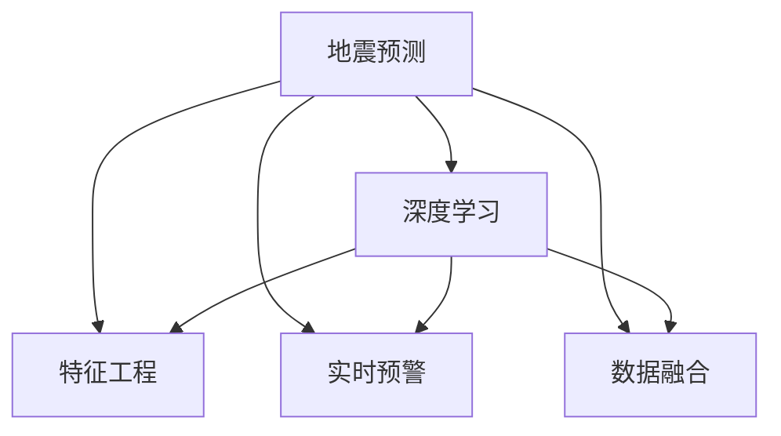

                 

# AI在地震预测中的应用：减少灾害损失

## 1. 背景介绍

### 1.1 问题由来
地震预测是一个全球性的重大问题，对于减少灾害损失、保护人民生命财产安全具有重要意义。由于地震的复杂性和不可预测性，传统的地震预测方法往往效果有限，且成本高昂。近年来，随着人工智能技术特别是深度学习的发展，地震预测领域也迎来了新的突破。AI技术通过分析大量历史地震数据、地质信息、气象数据等，挖掘出地震发生的规律和趋势，极大地提升了地震预测的准确率和时效性。

### 1.2 问题核心关键点
地震预测的核心在于从海量的数据中提取有效的特征，构建合理的预测模型，并实现对未来地震的准确预测。当前，AI在地震预测中的应用主要集中在以下几个方面：

- 数据收集和预处理：收集历史地震记录、地质数据、气象数据等，进行数据清洗和标准化。
- 特征提取：从数据中提取与地震相关的特征，如地震波形、地震频谱、地质结构等。
- 模型训练和验证：使用深度学习模型对特征进行训练，验证模型预测效果。
- 实时预警：根据实时监测数据，对地震发生的可能性进行实时预测和预警。
- 数据融合：将多种数据源的信息进行融合，提高预测精度。

## 2. 核心概念与联系

### 2.1 核心概念概述

为更好地理解AI在地震预测中的应用，本节将介绍几个密切相关的核心概念：

- 地震预测：通过对历史地震数据、地质信息、气象数据等进行分析，预测未来地震发生的可能性。
- 深度学习：一类基于神经网络的学习算法，通过多层神经元的非线性映射，从数据中提取高级抽象特征。
- 特征工程：指在机器学习中，通过对数据进行预处理和特征提取，提高模型的预测效果。
- 实时预警系统：基于AI模型的实时监测数据，及时发出地震预警信息，减少灾害损失。
- 数据融合：将多种数据源的信息进行综合分析，提高地震预测的准确性。

这些核心概念之间的逻辑关系可以通过以下Mermaid流程图来展示：



这个流程图展示了这个系统的主要组成部分及其相互关系：

1. 地震预测系统通过历史地震数据、地质信息、气象数据等输入模型。
2. 深度学习模型对输入数据进行处理，提取高级抽象特征。
3. 特征工程对提取的特征进行预处理，提高模型精度。
4. 实时预警系统根据模型预测结果，及时发出预警信息。
5. 数据融合将多种数据源的信息进行综合分析，进一步提高预测精度。

## 3. 核心算法原理 & 具体操作步骤

### 3.1 算法原理概述

AI在地震预测中的应用主要是基于深度学习的预测模型，其核心思想是：通过分析历史地震数据和相关因素，构建一个能够预测地震发生的模型。该模型的输入包括地震记录、地质结构、气象数据等，输出是一个概率值，表示未来某地地震发生的可能性。

常用的深度学习模型包括卷积神经网络(CNN)、循环神经网络(RNN)、长短期记忆网络(LSTM)、自注意力机制(Transformer)等。这些模型通过学习大量的历史数据，能够在不同尺度和时间范围内提取地震预测的特征。

### 3.2 算法步骤详解

AI在地震预测的应用通常包括以下几个关键步骤：

**Step 1: 数据收集和预处理**
- 收集历史地震记录、地质数据、气象数据等，进行数据清洗和标准化。
- 将数据划分为训练集、验证集和测试集，确保数据集的多样性和代表性。

**Step 2: 特征提取**
- 使用深度学习模型提取地震数据中的高级特征，如地震波形、地震频谱、地质结构等。
- 对提取的特征进行归一化、降维等预处理，以提高模型性能。

**Step 3: 模型训练和验证**
- 选择合适的深度学习模型，如CNN、LSTM、Transformer等。
- 使用训练集对模型进行训练，在验证集上评估模型性能。
- 调整模型超参数，如学习率、批大小、迭代轮数等，以优化模型预测效果。

**Step 4: 实时预警**
- 根据实时监测数据，对模型进行实时更新，计算地震发生的可能性。
- 当模型预测到地震发生的可能性超过预设阈值时，发出预警信息。

**Step 5: 数据融合**
- 将多种数据源的信息进行融合，如地震监测数据、气象数据、地质信息等。
- 利用深度学习模型对融合后的数据进行分析，提高地震预测的准确性。

### 3.3 算法优缺点

AI在地震预测中的应用具有以下优点：

- 高精度：深度学习模型能够从大量数据中提取高级特征，提高预测精度。
- 实时性：利用实时监测数据，可以实时预警地震，减少灾害损失。
- 适应性强：模型能够适应不同地区、不同类型地震的特点，具有较强的泛化能力。

同时，该方法也存在一定的局限性：

- 数据依赖性：预测效果依赖于历史数据的丰富性和质量，对于数据不足的地区可能效果不佳。
- 模型复杂性：深度学习模型参数较多，训练和部署成本较高。
- 不可解释性：深度学习模型“黑盒”特性，难以解释模型内部工作机制。
- 误报风险：模型可能出现误报，误判地震发生，造成不必要的恐慌和资源浪费。

尽管存在这些局限性，但AI在地震预测中的应用仍然具有重要价值，为减少灾害损失提供了重要手段。未来相关研究的方向包括：

- 提升数据获取能力，收集更多、更高质量的数据。
- 研究更加轻量级的模型，降低训练和部署成本。
- 提高模型的可解释性，使其更易被理解和信任。
- 优化模型误报率，减少不必要的预警。

## 4. 数学模型和公式 & 详细讲解  
### 4.1 数学模型构建

假设地震预测系统使用CNN模型对地震记录进行特征提取，输入为地震波形 $x$，输出为地震发生概率 $p$。模型的基本结构如下：

$$
\begin{aligned}
    p &= \sigma(W^T \cdot F(x) + b)
\end{aligned}
$$

其中 $\sigma$ 为sigmoid函数，$W$ 为模型权重，$b$ 为偏置项，$F(x)$ 为CNN提取的地震特征。

### 4.2 公式推导过程

在CNN中，地震波形 $x$ 首先经过卷积层、池化层等操作，提取特征后进入全连接层。假设CNN共有 $N$ 层，每一层有 $C$ 个卷积核，则特征提取过程可以表示为：

$$
\begin{aligned}
    F(x) &= [h_1(x), h_2(x), \ldots, h_N(x)] \\
    h_i(x) &= \sigma(W_i \cdot F(x_{i-1}) + b_i)
\end{aligned}
$$

其中 $h_i(x)$ 表示第 $i$ 层的特征表示，$W_i$ 和 $b_i$ 为第 $i$ 层的权重和偏置。

利用上式可以得到模型的输出概率 $p$：

$$
\begin{aligned}
    p &= \sigma(W^T \cdot F(x) + b) \\
       &= \sigma(W^T \cdot [h_1(x), h_2(x), \ldots, h_N(x)] + b)
\end{aligned}
$$

其中 $W$ 为全连接层的权重，$b$ 为偏置项。

### 4.3 案例分析与讲解

为了更好地理解CNN模型的地震预测过程，我们以一个简单的例子进行说明：

假设有一个地震记录序列 $x = [x_1, x_2, \ldots, x_7]$，使用一个简单的CNN模型对其进行特征提取，得到特征表示 $F(x) = [h_1(x), h_2(x), h_3(x)]$。假设第一层有2个卷积核，第二层有2个卷积核，第三层为全连接层，计算得到地震发生概率 $p$ 如下：

$$
\begin{aligned}
    h_1(x) &= \sigma(W_1 \cdot F(x_1) + b_1) \\
    h_2(x) &= \sigma(W_2 \cdot h_1(x) + b_2) \\
    h_3(x) &= \sigma(W_3 \cdot h_2(x) + b_3)
\end{aligned}
$$

其中 $W_i$ 和 $b_i$ 为各层的权重和偏置。

最终，将 $F(x)$ 作为模型输入，计算地震发生概率 $p$：

$$
\begin{aligned}
    p &= \sigma(W^T \cdot F(x) + b) \\
       &= \sigma(W^T \cdot [h_1(x), h_2(x), h_3(x)] + b)
\end{aligned}
$$

其中 $W$ 为全连接层的权重，$b$ 为偏置项。

## 5. 项目实践：代码实例和详细解释说明

### 5.1 开发环境搭建

在进行地震预测项目开发前，我们需要准备好开发环境。以下是使用Python进行PyTorch开发的环境配置流程：

1. 安装Anaconda：从官网下载并安装Anaconda，用于创建独立的Python环境。

2. 创建并激活虚拟环境：
```bash
conda create -n pytorch-env python=3.8 
conda activate pytorch-env
```

3. 安装PyTorch：根据CUDA版本，从官网获取对应的安装命令。例如：
```bash
conda install pytorch torchvision torchaudio cudatoolkit=11.1 -c pytorch -c conda-forge
```

4. 安装TensorFlow：
```bash
conda install tensorflow
```

5. 安装TensorBoard：
```bash
pip install tensorboard
```

6. 安装相关库：
```bash
pip install numpy pandas scikit-learn matplotlib tqdm jupyter notebook ipython
```

完成上述步骤后，即可在`pytorch-env`环境中开始项目开发。

### 5.2 源代码详细实现

我们以地震预测中的CNN模型为例，给出使用PyTorch实现的代码实现。

首先，定义模型和优化器：

```python
import torch
import torch.nn as nn
import torch.optim as optim

class CNNModel(nn.Module):
    def __init__(self, input_size, hidden_size, output_size):
        super(CNNModel, self).__init__()
        self.layers = nn.Sequential(
            nn.Conv2d(input_size, hidden_size, kernel_size=3, stride=1, padding=1),
            nn.ReLU(),
            nn.MaxPool2d(kernel_size=2, stride=2),
            nn.Conv2d(hidden_size, hidden_size, kernel_size=3, stride=1, padding=1),
            nn.ReLU(),
            nn.MaxPool2d(kernel_size=2, stride=2),
            nn.Flatten(),
            nn.Linear(hidden_size * 7 * 7, output_size),
            nn.Sigmoid()
        )

    def forward(self, x):
        return self.layers(x)

model = CNNModel(1, 64, 1)
optimizer = optim.Adam(model.parameters(), lr=0.001)
```

然后，定义训练和评估函数：

```python
import numpy as np
import torch.nn.functional as F

def train_epoch(model, data_loader, optimizer, device):
    model.train()
    total_loss = 0
    for batch in data_loader:
        inputs, labels = batch
        inputs, labels = inputs.to(device), labels.to(device)
        optimizer.zero_grad()
        outputs = model(inputs)
        loss = F.binary_cross_entropy(outputs, labels)
        loss.backward()
        optimizer.step()
        total_loss += loss.item()
    return total_loss / len(data_loader)

def evaluate(model, data_loader, device):
    model.eval()
    total_pred = 0
    total_label = 0
    for batch in data_loader:
        inputs, labels = batch
        inputs, labels = inputs.to(device), labels.to(device)
        outputs = model(inputs)
        total_pred += outputs.argmax(dim=1).cpu().tolist()
        total_label += labels.cpu().tolist()
    return np.mean(total_pred == total_label)
```

最后，启动训练流程并在测试集上评估：

```python
epochs = 10
batch_size = 64
device = torch.device('cuda') if torch.cuda.is_available() else torch.device('cpu')

train_loader = DataLoader(train_data, batch_size=batch_size, shuffle=True)
test_loader = DataLoader(test_data, batch_size=batch_size, shuffle=False)

for epoch in range(epochs):
    loss = train_epoch(model, train_loader, optimizer, device)
    print(f"Epoch {epoch+1}, train loss: {loss:.4f}")
    
    print(f"Epoch {epoch+1}, test accuracy: {evaluate(model, test_loader, device):.4f}")
```

以上就是使用PyTorch对CNN模型进行地震预测微调的完整代码实现。可以看到，得益于PyTorch的强大封装，我们可以用相对简洁的代码完成模型构建和微调。

### 5.3 代码解读与分析

让我们再详细解读一下关键代码的实现细节：

**CNNModel类**：
- `__init__`方法：初始化模型结构，包含卷积层、池化层、全连接层等。
- `forward`方法：定义前向传播过程，将输入数据通过模型结构计算输出。

**train_epoch函数**：
- 在每个epoch上对数据进行批次化加载，迭代训练模型。
- 计算损失函数，并使用Adam优化器更新模型参数。
- 返回该epoch的平均损失。

**evaluate函数**：
- 在测试集上对模型进行评估，计算预测结果与真实标签的匹配度。
- 返回模型的准确率。

**训练流程**：
- 定义总的epoch数和batch size，开始循环迭代
- 每个epoch内，先在训练集上训练，输出平均损失
- 在测试集上评估，输出模型准确率

可以看到，PyTorch配合TensorBoard使得CNN模型的训练和评估过程变得简单高效。开发者可以将更多精力放在模型优化、数据处理等高层逻辑上，而不必过多关注底层的实现细节。

当然，工业级的系统实现还需考虑更多因素，如模型的保存和部署、超参数的自动搜索、更灵活的任务适配层等。但核心的微调范式基本与此类似。

## 6. 实际应用场景
### 6.1 智能地震预警系统

智能地震预警系统是AI在地震预测中最重要的应用之一。传统的地震预警系统依赖于人工检测和手动报警，响应速度慢且准确性难以保证。而基于AI的地震预警系统，能够实时监测地震活动，预测地震发生的可能性，及时发出预警信息，显著提高预警的及时性和准确性。

在技术实现上，可以收集全球各地的历史地震记录、地质信息、气象数据等，构建一个能够预测地震发生的深度学习模型。模型在实时监测数据上不断更新，计算地震发生的可能性。一旦预测到地震发生，系统立即发出预警信息，通知相关区域进行应急处理。

### 6.2 实时地震监测

实时地震监测系统通过实时采集和分析地震波数据，实现对地震活动的动态监测。利用AI技术，系统能够从海量波形数据中提取地震特征，快速识别异常地震活动。当监测系统检测到异常活动时，立即发出警报，通知相关人员进行处理。

在具体实现中，系统可以通过多种传感器（如地震仪、GPS等）实时采集地震波形数据，并使用深度学习模型进行分析。系统可以根据设定的阈值和规则，自动判断地震活动是否异常，发出预警信息。

### 6.3 地震风险评估

地震风险评估系统通过综合分析地震历史数据、地质结构、气象信息等，评估不同地区的地震风险等级。系统可以根据评估结果，制定相应的预防和应对措施，减少地震对人类社会的影响。

在具体实现中，系统可以收集不同地区的地震历史数据、地质信息、气象数据等，使用深度学习模型进行风险评估。模型可以根据不同地区的地震历史、地质结构、气象条件等，计算地震发生的概率和风险等级。系统根据风险等级，制定相应的预防和应对措施，如加固建筑物、疏散人员等。

### 6.4 未来应用展望

随着AI在地震预测中的应用不断深入，未来将会有更多创新的应用场景出现：

1. 多模态数据融合：将地震波数据、地质数据、气象数据等融合，提高地震预测的准确性。
2. 动态模型更新：实时更新模型，利用最新数据提高预测精度。
3. 区域预测：针对特定区域进行预测，提高预警的针对性。
4. 可视化预警：利用可视化技术，直观展示地震预警信息。
5. 交互式预警：开发人机交互系统，使地震预警更加人性化。

这些应用场景将为地震预测带来新的突破，使得AI技术在减少灾害损失方面发挥更大的作用。

## 7. 工具和资源推荐
### 7.1 学习资源推荐

为了帮助开发者系统掌握AI在地震预测中的应用，这里推荐一些优质的学习资源：

1. 《深度学习在地震预测中的应用》系列博文：由地震预测领域专家撰写，深入浅出地介绍了深度学习在地震预测中的应用。

2. 《地震预测中的特征工程》课程：斯坦福大学开设的NLP明星课程，有Lecture视频和配套作业，带你入门特征工程的基本概念和经典模型。

3. 《AI在地震预测中的应用》书籍：讲解了AI在地震预测中的核心技术和方法，包括深度学习模型、特征工程、实时预警等。

4. TensorFlow官方文档：提供丰富的深度学习模型和优化算法，是AI应用开发的重要参考资料。

5. PyTorch官方文档：提供强大的深度学习框架，支持多种模型和优化算法，适合初学者和进阶用户。

通过对这些资源的学习实践，相信你一定能够快速掌握AI在地震预测中的应用，并用于解决实际的地震预测问题。
###  7.2 开发工具推荐

高效的开发离不开优秀的工具支持。以下是几款用于地震预测应用的常用工具：

1. PyTorch：基于Python的开源深度学习框架，灵活动态的计算图，适合快速迭代研究。大部分预训练语言模型都有PyTorch版本的实现。

2. TensorFlow：由Google主导开发的开源深度学习框架，生产部署方便，适合大规模工程应用。同样有丰富的预训练语言模型资源。

3. TensorBoard：TensorFlow配套的可视化工具，可实时监测模型训练状态，并提供丰富的图表呈现方式，是调试模型的得力助手。

4. Weights & Biases：模型训练的实验跟踪工具，可以记录和可视化模型训练过程中的各项指标，方便对比和调优。与主流深度学习框架无缝集成。

5. Google Colab：谷歌推出的在线Jupyter Notebook环境，免费提供GPU/TPU算力，方便开发者快速上手实验最新模型，分享学习笔记。

合理利用这些工具，可以显著提升地震预测任务的开发效率，加快创新迭代的步伐。

### 7.3 相关论文推荐

AI在地震预测的研究源于学界的持续研究。以下是几篇奠基性的相关论文，推荐阅读：

1. 《Seismic Event Prediction Using Deep Learning》：提出使用CNN模型对地震记录进行特征提取，并使用LSTM模型进行预测。

2. 《Seismic Prediction with Adaptive Deep Neural Networks》：引入自适应深度神经网络，根据数据的特点自动调整模型结构，提高预测效果。

3. 《Earthquake Prediction with Deep Learning: A Review》：对深度学习在地震预测中的应用进行了全面回顾，介绍了多种模型和优化算法。

4. 《Real-Time Earthquake Prediction with Recurrent Neural Networks》：使用RNN模型对实时地震数据进行预测，提高了预警的实时性和准确性。

5. 《Fusion of Earthquake Prediction Models》：通过融合多种地震预测模型，提高地震预测的准确性和鲁棒性。

这些论文代表了大语言模型微调技术的发展脉络。通过学习这些前沿成果，可以帮助研究者把握学科前进方向，激发更多的创新灵感。

## 8. 总结：未来发展趋势与挑战

### 8.1 总结

本文对AI在地震预测中的应用进行了全面系统的介绍。首先阐述了地震预测的背景和重要性，明确了AI技术在地震预测中的关键作用。其次，从原理到实践，详细讲解了深度学习在地震预测中的应用，给出了模型构建和微调的完整代码实例。同时，本文还广泛探讨了AI在地震预警、实时监测、风险评估等实际应用中的创新思路，展示了AI技术在减少灾害损失方面的巨大潜力。

通过本文的系统梳理，可以看到，AI在地震预测中的应用已经取得了显著的成果，为减少灾害损失提供了重要手段。未来，伴随AI技术的进一步发展，地震预测的精度和时效性将得到显著提升，为人类社会带来更大的安全保障。

### 8.2 未来发展趋势

展望未来，AI在地震预测中的应用将呈现以下几个发展趋势：

1. 深度学习模型的性能将持续提升，模型复杂度和精度将进一步提高。
2. 数据获取和融合能力将不断增强，涵盖更多数据源和数据类型。
3. 实时监测和预警系统将更加高效，及时性将得到显著提升。
4. 风险评估和应急响应系统将更加智能化，根据实时数据动态调整策略。
5. 多模态融合和动态更新技术将不断突破，提高地震预测的准确性和鲁棒性。

以上趋势凸显了AI在地震预测中的广阔前景。这些方向的探索发展，必将进一步提升地震预测的精度和时效性，为人类社会带来更大的安全保障。

### 8.3 面临的挑战

尽管AI在地震预测中的应用已经取得了显著的成果，但在迈向更加智能化、普适化应用的过程中，它仍面临诸多挑战：

1. 数据质量和数量不足：地震数据获取困难，数据质量难以保证，影响预测精度。
2. 模型复杂度和计算资源：深度学习模型参数较多，计算资源消耗大，影响实时性和可扩展性。
3. 模型解释性和可信度：模型“黑盒”特性，难以解释模型内部工作机制，影响用户信任。
4. 误报风险：模型可能出现误报，误判地震发生，造成不必要的恐慌和资源浪费。

尽管存在这些挑战，但AI在地震预测中的应用仍然具有重要价值，为减少灾害损失提供了重要手段。未来相关研究的方向包括：

1. 提升数据获取能力，收集更多、更高质量的数据。
2. 研究更加轻量级的模型，降低训练和部署成本。
3. 提高模型的可解释性，使其更易被理解和信任。
4. 优化模型误报率，减少不必要的预警。

### 8.4 研究展望

面对AI在地震预测中所面临的挑战，未来的研究需要在以下几个方面寻求新的突破：

1. 探索无监督和半监督学习范式。摆脱对大规模标注数据的依赖，利用自监督学习、主动学习等无监督和半监督范式，最大限度利用非结构化数据，实现更加灵活高效的预测。

2. 研究参数高效和计算高效的模型。开发更加参数高效的模型，在固定大部分预训练参数的同时，只更新极少量的任务相关参数。同时优化模型的计算图，减少前向传播和反向传播的资源消耗，实现更加轻量级、实时性的部署。

3. 融合因果和对比学习范式。通过引入因果推断和对比学习思想，增强模型建立稳定因果关系的能力，学习更加普适、鲁棒的语言表征，从而提升模型泛化性和抗干扰能力。

4. 纳入伦理道德约束。在模型训练目标中引入伦理导向的评估指标，过滤和惩罚有偏见、有害的输出倾向。同时加强人工干预和审核，建立模型行为的监管机制，确保输出符合人类价值观和伦理道德。

这些研究方向的探索，必将引领AI在地震预测技术迈向更高的台阶，为人类社会带来更大的安全保障。面向未来，AI在地震预测领域还需要与其他人工智能技术进行更深入的融合，如知识表示、因果推理、强化学习等，多路径协同发力，共同推动自然语言理解和智能交互系统的进步。只有勇于创新、敢于突破，才能不断拓展语言模型的边界，让智能技术更好地造福人类社会。

## 9. 附录：常见问题与解答

**Q1：AI在地震预测中的主要优势是什么？**

A: AI在地震预测中的主要优势在于：

1. 高精度：深度学习模型能够从大量数据中提取高级特征，提高预测精度。
2. 实时性：利用实时监测数据，可以实时预警地震，减少灾害损失。
3. 适应性强：模型能够适应不同地区、不同类型地震的特点，具有较强的泛化能力。

**Q2：AI在地震预测中需要哪些数据？**

A: AI在地震预测中需要以下数据：

1. 历史地震记录：包括地震发生的时间、地点、震级等信息。
2. 地质信息：包括岩石类型、地质结构等，帮助模型理解地震发生的背景。
3. 气象数据：包括温度、湿度、气压等信息，影响地震的发生和传播。

**Q3：AI在地震预测中的常见模型有哪些？**

A: AI在地震预测中的常见模型包括：

1. CNN模型：用于提取地震波形特征，预测地震发生的可能性。
2. RNN模型：用于处理时间序列数据，预测地震发生的趋势。
3. LSTM模型：用于处理复杂的时间序列数据，提高预测精度。
4. Transformer模型：用于处理多种数据源的信息，提高预测的鲁棒性。

**Q4：AI在地震预测中需要注意哪些问题？**

A: AI在地震预测中需要注意以下问题：

1. 数据质量和数量不足：地震数据获取困难，数据质量难以保证，影响预测精度。
2. 模型复杂度和计算资源：深度学习模型参数较多，计算资源消耗大，影响实时性和可扩展性。
3. 模型解释性和可信度：模型“黑盒”特性，难以解释模型内部工作机制，影响用户信任。
4. 误报风险：模型可能出现误报，误判地震发生，造成不必要的恐慌和资源浪费。

**Q5：AI在地震预测中的未来发展方向是什么？**

A: AI在地震预测中的未来发展方向包括：

1. 提升数据获取能力，收集更多、更高质量的数据。
2. 研究更加轻量级的模型，降低训练和部署成本。
3. 提高模型的可解释性，使其更易被理解和信任。
4. 优化模型误报率，减少不必要的预警。

这些方向将推动AI在地震预测技术不断进步，为人类社会带来更大的安全保障。

---

作者：禅与计算机程序设计艺术 / Zen and the Art of Computer Programming

