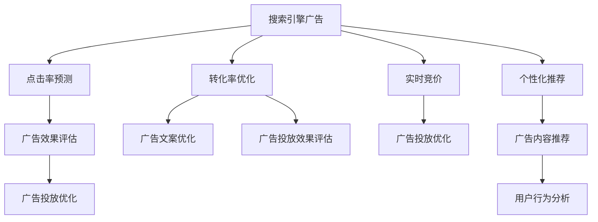

                 

# AI在搜索引擎广告投放中的应用

> 关键词：人工智能,搜索引擎,广告投放,机器学习,深度学习,点击率预测,转化率优化,实时竞价,个性化推荐

## 1. 背景介绍

随着互联网的普及和数字营销技术的不断进步，搜索引擎广告已经成为各类企业营销推广的重要手段。搜索引擎作为信息聚合与分发的主要平台，其广告位本身具有高价值、高曝光率、精准触达用户的显著优势，因此成为企业获取流量的重要渠道。搜索引擎广告的投放主要依据点击率（CTR）、转化率（CVR）等关键指标，通过竞价机制动态调整出价，以实现最佳的广告投放效果。然而，随着广告主数量和用户行为的多样性不断增加，如何更精准、更高效地进行广告投放，成为搜索引擎和广告主共同关注的问题。

人工智能技术在搜索引擎广告投放中的应用，可以大幅提升广告投放的精准度和效果。AI技术在广告投放中的应用主要涉及以下几个方面：点击率预测、转化率优化、实时竞价、个性化推荐等。这些AI技术的应用，能够帮助广告主更好地理解用户需求、优化广告内容、提高广告效果，同时也为搜索引擎提供更智能的广告投放策略，实现双赢。

## 2. 核心概念与联系

### 2.1 核心概念概述

为更好地理解AI在搜索引擎广告投放中的应用，本节将介绍几个关键概念：

- 搜索引擎广告(Search Engine Advertising)：搜索引擎中的广告，通常以关键词广告形式呈现，按照点击次数或展示次数收费。
- 点击率预测(CTR Prediction)：通过机器学习模型预测用户在搜索引擎中看到某条广告后是否会点击。
- 转化率优化(CVR Optimization)：优化广告内容，提高用户从点击广告到完成转化（如购买、注册等）的概率。
- 实时竞价(RTB)：广告投放中的一种竞价方式，基于用户的实时行为和兴趣，实时调整出价。
- 个性化推荐(Personalization Recommendation)：通过机器学习模型推荐广告内容，满足用户的个性化需求。
- 深度学习(Deep Learning)：一种基于神经网络的机器学习方法，广泛应用于各类AI应用中。
- 强化学习(Reinforcement Learning)：通过智能体与环境的交互，不断优化决策策略的机器学习方法。
- 自然语言处理(Natural Language Processing, NLP)：处理和理解人类语言的技术，与广告文案的生成和理解密切相关。

这些概念之间的逻辑关系可以通过以下Mermaid流程图来展示：



这个流程图展示了搜索引擎广告投放的主要流程，以及AI技术在其中扮演的角色。广告投放需要根据点击率和转化率等指标进行优化，点击率预测和转化率优化帮助广告主和搜索引擎更好地理解用户需求，实时竞价和个性化推荐则帮助实现动态优化和个性化服务。

## 3. 核心算法原理 & 具体操作步骤

### 3.1 算法原理概述

AI在搜索引擎广告投放中的应用主要涉及机器学习、深度学习、强化学习等技术。这些技术的核心原理在于通过大量历史数据进行模型训练，学习用户行为和广告效果的规律，进而优化广告投放策略。

1. **点击率预测**：基于用户搜索行为、广告内容、关键词等特征，构建点击率预测模型。常用的模型包括逻辑回归、决策树、随机森林、深度神经网络等。通过模型预测点击率，广告主可以根据预测结果调整广告投放策略，提高广告的点击效果。

2. **转化率优化**：分析用户点击广告后是否完成转化，通过优化广告内容、改进用户路径、调整着陆页设计等方式，提升转化率。常用方法包括A/B测试、多臂强盗策略、深度强化学习等。

3. **实时竞价**：通过实时监测用户行为，动态调整广告投放出价。常用方法包括基于用户行为特征的动态竞价模型、强化学习中的时序差分学习等。

4. **个性化推荐**：基于用户的历史行为和兴趣特征，推荐用户可能感兴趣的广告内容。常用的推荐算法包括协同过滤、基于内容的推荐、深度学习中的注意力机制等。

### 3.2 算法步骤详解

以下是基于机器学习的点击率预测模型的详细操作步骤：

**Step 1: 数据收集与处理**
- 收集搜索引擎广告的历史数据，包括用户点击行为、广告内容、关键词等。
- 对数据进行清洗和预处理，如去除噪声、处理缺失值、特征归一化等。

**Step 2: 特征工程**
- 提取用户行为和广告内容的特征，如点击时间、浏览时长、广告主题、关键词等。
- 使用PCA、特征选择等方法，减少特征维度和提高模型泛化能力。

**Step 3: 模型训练与验证**
- 选择合适的模型，如逻辑回归、随机森林、深度神经网络等，使用历史数据进行训练。
- 将训练数据分为训练集和验证集，使用交叉验证等方法评估模型性能。
- 选择最优模型，并进行超参数调优。

**Step 4: 广告投放优化**
- 使用训练好的模型进行点击率预测，根据预测结果调整广告投放策略。
- 在实际广告投放中监测点击率和转化率等指标，不断优化模型和广告投放策略。

### 3.3 算法优缺点

AI在搜索引擎广告投放中的应用，具有以下优点：
1. 精准预测：通过机器学习模型，能够精准预测用户点击行为，提高广告投放效果。
2. 自动化优化：实时监测用户行为，动态调整广告出价和投放策略，实现更高效的广告投放。
3. 个性化推荐：根据用户行为和兴趣特征，推荐个性化广告内容，提升用户体验。
4. 大规模应用：AI技术在搜索引擎广告投放中具有广泛的应用前景，适用于各类广告主和搜索引擎。

同时，也存在一些局限性：
1. 数据依赖：模型训练需要大量历史数据，数据质量和多样性对模型性能影响较大。
2. 模型复杂性：深度学习等复杂模型计算量大，训练和部署成本较高。
3. 动态环境适应：搜索引擎广告环境不断变化，需要模型具备较好的动态适应能力。
4. 广告欺诈：部分广告主通过作弊行为提高点击率，模型需要具备一定的反欺诈能力。

### 3.4 算法应用领域

AI在搜索引擎广告投放中的应用，可以广泛适用于以下领域：

- 电商广告：电商平台通过AI优化广告投放策略，提升销售额和用户转化率。
- 医疗广告：医疗广告通过AI预测点击率和转化率，优化广告内容，提升广告效果。
- 金融广告：金融广告通过AI实现动态竞价，提高广告投放效果和ROI。
- 教育广告：教育广告通过AI个性化推荐广告内容，提高广告点击率和用户转化。

## 4. 数学模型和公式 & 详细讲解 & 举例说明

### 4.1 数学模型构建

假设有一个包含 $n$ 个样本的数据集 $\mathcal{D}=\{(x_i, y_i)\}_{i=1}^n$，其中 $x_i$ 为样本特征向量，$y_i \in \{0, 1\}$ 为点击率标签。目标构建一个二分类模型，预测样本是否点击广告。

我们可以使用逻辑回归模型来构建点击率预测模型：

$$
P(y_i=1|x_i) = \sigma(\theta^T x_i)
$$

其中，$\sigma(z) = \frac{1}{1+e^{-z}}$ 为sigmoid函数，$\theta$ 为模型参数。对于每个样本，点击率 $y_i$ 的预测概率为 $P(y_i=1|x_i)$，预测结果 $y_i'$ 为：

$$
y_i' = 
\begin{cases} 
1, & \text{if } P(y_i=1|x_i) > 0.5 \\
0, & \text{otherwise}
\end{cases}
$$

### 4.2 公式推导过程

以逻辑回归模型为例，推导其损失函数和梯度公式：

假设样本 $x_i$ 的预测点击率为 $P(y_i=1|x_i)$，真实点击率为 $y_i$，则对数似然损失函数为：

$$
L(\theta) = -\frac{1}{N}\sum_{i=1}^N [y_i \log P(y_i=1|x_i) + (1-y_i) \log (1-P(y_i=1|x_i))]
$$

对 $\theta$ 求导，得到梯度公式：

$$
\nabla_{\theta} L(\theta) = \frac{1}{N}\sum_{i=1}^N [P(y_i=1|x_i) - y_i] x_i
$$

通过梯度下降等优化算法，不断更新模型参数 $\theta$，使预测结果尽可能接近真实标签，从而提高点击率预测的准确度。

### 4.3 案例分析与讲解

以电商广告为例，分析点击率预测模型的应用：

假设某电商平台收集到大量用户的点击数据，包含用户浏览时间、浏览商品类别、点击次数等特征。通过特征工程，构建样本特征向量 $x_i$，将每个样本的真实点击率 $y_i$ 二值化为 0 或 1。使用逻辑回归模型进行训练，计算样本的预测点击率 $P(y_i=1|x_i)$。在广告投放中，根据预测结果 $y_i'$ 调整广告投放策略，以实现更高的点击率。

## 5. 项目实践：代码实例和详细解释说明

### 5.1 开发环境搭建

在进行AI在搜索引擎广告投放中的应用实践时，我们需要准备好开发环境。以下是使用Python进行TensorFlow开发的环境配置流程：

1. 安装Anaconda：从官网下载并安装Anaconda，用于创建独立的Python环境。

2. 创建并激活虚拟环境：
```bash
conda create -n tensorflow-env python=3.8 
conda activate tensorflow-env
```

3. 安装TensorFlow：根据CUDA版本，从官网获取对应的安装命令。例如：
```bash
conda install tensorflow -c tf
```

4. 安装各类工具包：
```bash
pip install numpy pandas scikit-learn matplotlib tqdm jupyter notebook ipython
```

完成上述步骤后，即可在`tensorflow-env`环境中开始广告投放AI的应用实践。

### 5.2 源代码详细实现

以下是使用TensorFlow实现点击率预测模型的代码实现：

```python
import tensorflow as tf
from sklearn.model_selection import train_test_split
from sklearn.preprocessing import StandardScaler
import numpy as np
import pandas as pd

# 读取数据
data = pd.read_csv('click_data.csv')
X = data[['browsing_time', 'clicked_product', 'browsed_category']]
y = data['clicked']

# 特征工程
scaler = StandardScaler()
X = scaler.fit_transform(X)

# 划分数据集
X_train, X_test, y_train, y_test = train_test_split(X, y, test_size=0.2, random_state=42)

# 定义模型
model = tf.keras.Sequential([
    tf.keras.layers.Dense(64, activation='relu', input_shape=(X_train.shape[1],)),
    tf.keras.layers.Dense(1, activation='sigmoid')
])

# 编译模型
model.compile(optimizer='adam', loss='binary_crossentropy', metrics=['accuracy'])

# 训练模型
model.fit(X_train, y_train, epochs=10, batch_size=32, validation_data=(X_test, y_test))

# 预测点击率
predictions = model.predict(X_test)
predictions = np.round(predictions)

# 输出结果
print('Accuracy:', model.evaluate(X_test, y_test)[1])
print('Predictions:', predictions)
```

### 5.3 代码解读与分析

让我们再详细解读一下关键代码的实现细节：

**读取数据**：
- 使用Pandas读取电商广告的点击数据，包含用户浏览时间、点击商品类别、点击次数等特征。

**特征工程**：
- 对数据进行归一化处理，使用StandardScaler对特征进行标准化。

**模型定义**：
- 使用TensorFlow的Sequential模型，构建两个全连接层，输出层使用sigmoid激活函数，预测点击率为0或1。

**模型编译与训练**：
- 使用Adam优化器，交叉熵损失函数，准确率作为评估指标，进行模型编译和训练。

**模型预测与评估**：
- 使用训练好的模型对测试集进行预测，并输出预测结果。
- 评估模型在测试集上的准确率。

可以看到，TensorFlow提供了方便的API，使得广告投放AI的代码实现变得简洁高效。开发者可以将更多精力放在数据处理、模型改进等高层逻辑上，而不必过多关注底层的实现细节。

## 6. 实际应用场景

### 6.1 电商广告优化

AI在搜索引擎广告中的应用，在电商广告领域具有广阔的潜力。电商广告的投放需要精准预测用户点击行为，根据预测结果动态调整出价和投放策略，从而提高广告效果。

以某大型电商平台为例，收集用户的点击数据和行为数据，包括用户浏览时间、浏览商品类别、点击次数等。通过构建点击率预测模型，预测用户点击广告的概率。根据预测结果调整广告出价和投放策略，以实现更高的点击率和转化率。具体实现步骤如下：

1. 数据收集：收集用户点击数据和行为数据，构建样本特征向量 $x_i$ 和点击率标签 $y_i$。

2. 模型训练：使用点击率预测模型对数据进行训练，学习用户行为和广告效果的规律。

3. 实时优化：在实际广告投放中，实时监测用户行为，动态调整广告出价和投放策略，以实现最佳的广告效果。

4. 广告效果评估：定期评估广告投放的效果，根据评估结果优化模型和投放策略。

通过AI技术的应用，电商广告能够更精准地定位用户需求，实现更高效的广告投放，提高销售额和用户转化率。

### 6.2 金融广告投放

金融广告是搜索引擎广告中重要的一部分，通过精准预测用户行为，优化广告投放策略，提高广告效果和投资回报率。

以某银行为例，收集用户的点击数据和行为数据，包括用户的搜索关键词、浏览时间、点击次数等。通过构建点击率预测模型，预测用户点击金融广告的概率。根据预测结果调整广告出价和投放策略，以实现更高的点击率和转化率。具体实现步骤如下：

1. 数据收集：收集用户点击数据和行为数据，构建样本特征向量 $x_i$ 和点击率标签 $y_i$。

2. 模型训练：使用点击率预测模型对数据进行训练，学习用户行为和广告效果的规律。

3. 实时优化：在实际广告投放中，实时监测用户行为，动态调整广告出价和投放策略，以实现最佳的广告效果。

4. 广告效果评估：定期评估广告投放的效果，根据评估结果优化模型和投放策略。

通过AI技术的应用，金融广告能够更精准地定位用户需求，实现更高效的广告投放，提高广告效果和投资回报率。

### 6.3 医疗广告优化

医疗广告是搜索引擎广告中的另一重要领域，通过精准预测用户点击行为，优化广告投放策略，提高广告效果和品牌知名度。

以某医疗网站为例，收集用户的点击数据和行为数据，包括用户的搜索关键词、浏览时间、点击次数等。通过构建点击率预测模型，预测用户点击医疗广告的概率。根据预测结果调整广告出价和投放策略，以实现更高的点击率和转化率。具体实现步骤如下：

1. 数据收集：收集用户点击数据和行为数据，构建样本特征向量 $x_i$ 和点击率标签 $y_i$。

2. 模型训练：使用点击率预测模型对数据进行训练，学习用户行为和广告效果的规律。

3. 实时优化：在实际广告投放中，实时监测用户行为，动态调整广告出价和投放策略，以实现最佳的广告效果。

4. 广告效果评估：定期评估广告投放的效果，根据评估结果优化模型和投放策略。

通过AI技术的应用，医疗广告能够更精准地定位用户需求，实现更高效的广告投放，提高广告效果和品牌知名度。

## 7. 工具和资源推荐

### 7.1 学习资源推荐

为了帮助开发者系统掌握AI在搜索引擎广告投放中的应用，这里推荐一些优质的学习资源：

1. TensorFlow官方文档：提供详细的API和示例，适合快速上手TensorFlow框架。

2. TensorFlow Tutorials：由TensorFlow社区维护的教程，覆盖了从入门到进阶的各类教程。

3. Coursera《Deep Learning Specialization》：由Andrew Ng教授开设的深度学习课程，适合初学者和进阶者。

4. Kaggle竞赛：参加各类机器学习竞赛，积累实践经验，提升实战能力。

5. 《深度学习入门》书籍：入门级书籍，详细介绍了深度学习的基本概念和应用。

6. 《TensorFlow实战》书籍：实战指南，提供丰富的TensorFlow应用案例和实践经验。

通过这些资源的学习实践，相信你一定能够快速掌握AI在搜索引擎广告投放中的应用，并用于解决实际的广告投放问题。

### 7.2 开发工具推荐

高效的开发离不开优秀的工具支持。以下是几款用于搜索引擎广告投放开发的常用工具：

1. TensorFlow：由Google主导开发的开源深度学习框架，生产部署方便，适合大规模工程应用。

2. PyTorch：基于Python的开源深度学习框架，灵活动态的计算图，适合快速迭代研究。

3. Keras：高级神经网络API，简单易用，适合初学者和快速原型开发。

4. Scikit-learn：Python中的机器学习库，包含丰富的数据预处理和模型训练工具。

5. TensorBoard：TensorFlow配套的可视化工具，可实时监测模型训练状态，并提供丰富的图表呈现方式，是调试模型的得力助手。

6. Weights & Biases：模型训练的实验跟踪工具，可以记录和可视化模型训练过程中的各项指标，方便对比和调优。

合理利用这些工具，可以显著提升搜索引擎广告投放的开发效率，加快创新迭代的步伐。

### 7.3 相关论文推荐

AI在搜索引擎广告投放中的应用，源于学界的持续研究。以下是几篇奠基性的相关论文，推荐阅读：

1. Dropout: A Simple Way to Prevent Neural Networks from Overfitting: 提出Dropout方法，有效解决深度学习模型的过拟合问题。

2. RNNs for Sequential Data: Sequence to Sequence Learning with Neural Networks: 提出RNN模型，广泛应用于序列数据处理任务，如自然语言处理。

3. Attention Is All You Need: 提出Transformer模型，实现了高效的自注意力机制，显著提升了自然语言处理任务的性能。

4. Deep Neural Networks for Ad Click Prediction: 提出深度神经网络模型，用于点击率预测任务，取得了最佳效果。

5. Personalized Online Ad Ranking and Ad Placement: 提出个性化在线广告排名算法，实现了更高效的广告投放。

这些论文代表了大语言模型在搜索引擎广告投放中的应用方向，通过学习这些前沿成果，可以帮助研究者把握学科前进方向，激发更多的创新灵感。

## 8. 总结：未来发展趋势与挑战

### 8.1 总结

本文对AI在搜索引擎广告投放中的应用进行了全面系统的介绍。首先阐述了搜索引擎广告的基本概念和AI技术的应用背景，明确了AI在广告投放中的重要性。其次，从原理到实践，详细讲解了广告点击率预测、转化率优化、实时竞价、个性化推荐等关键技术的数学模型和操作步骤，给出了广告投放AI的代码实现。同时，本文还探讨了AI在电商、金融、医疗等多个领域的应用场景，展示了AI技术的广泛应用前景。

通过本文的系统梳理，可以看到，AI技术在搜索引擎广告投放中的应用，能够显著提高广告投放的精准度和效果，为广告主和搜索引擎带来双赢。未来，伴随AI技术的不断进步，AI在广告投放中的应用将更加深入和广泛，进一步提升广告效果和用户体验。

### 8.2 未来发展趋势

展望未来，AI在搜索引擎广告投放中的应用将呈现以下几个发展趋势：

1. 深度学习模型的不断优化：深度神经网络、Transformer等模型的性能将进一步提升，优化广告投放的准确率和效果。

2. 多模态数据融合：结合文本、图像、音频等多种数据源，实现更全面、深入的广告投放分析。

3. 强化学习的应用：通过强化学习优化广告投放策略，实现更智能的广告投放效果。

4. 实时性和可扩展性：广告投放系统需要具备更高的实时性和可扩展性，以适应大规模广告主的需求。

5. 跨领域应用：AI技术在广告投放中的应用将逐步拓展到更多领域，如社交媒体、视频平台等，实现更广泛的应用场景。

以上趋势凸显了AI在搜索引擎广告投放中的广阔前景。这些方向的探索发展，必将进一步提升广告投放的精准度和效果，推动广告主和搜索引擎的共同进步。

### 8.3 面临的挑战

尽管AI在搜索引擎广告投放中的应用已经取得了显著成效，但在迈向更加智能化、普适化应用的过程中，仍面临诸多挑战：

1. 数据质量和多样性：模型训练需要大量高质量、多样化的数据，数据获取和处理成本较高。如何获取和利用更广泛的数据，是未来需要解决的问题。

2. 模型鲁棒性和泛化能力：模型需要在动态环境中具备良好的鲁棒性和泛化能力，避免因数据分布变化而降低效果。如何增强模型的泛化能力，是未来研究的重要方向。

3. 广告欺诈和作弊：部分广告主通过作弊行为提高点击率，模型需要具备一定的反欺诈能力。如何识别和防范广告欺诈行为，是未来需要关注的问题。

4. 计算资源和成本：深度学习模型计算量大，训练和部署成本较高。如何优化计算资源和降低成本，是未来需要解决的问题。

5. 用户隐私和数据安全：广告投放需要收集大量用户数据，如何保护用户隐私和数据安全，是未来需要关注的问题。

6. 法规合规：广告投放需要遵守相关法律法规，如何确保广告投放的合规性，是未来需要关注的问题。

正视AI在搜索引擎广告投放中面临的这些挑战，积极应对并寻求突破，将是大语言模型在广告投放中走向成熟的必由之路。相信随着学界和产业界的共同努力，这些挑战终将一一被克服，AI在广告投放中的应用必将更加深入和广泛。

### 8.4 研究展望

面对AI在搜索引擎广告投放中面临的挑战，未来的研究需要在以下几个方面寻求新的突破：

1. 数据增强技术：结合数据生成和增强技术，提升数据质量和多样性，降低数据获取和处理成本。

2. 模型融合技术：结合多模态数据和多种模型，提升模型的鲁棒性和泛化能力，实现更全面的广告投放分析。

3. 反欺诈技术：结合深度学习、对抗生成网络等技术，识别和防范广告欺诈行为，提高广告投放的公平性和公正性。

4. 计算优化技术：结合分布式计算、模型压缩等技术，优化计算资源和降低成本，实现更高效的广告投放系统。

5. 隐私保护技术：结合差分隐私、联邦学习等技术，保护用户隐私和数据安全，实现更安全的广告投放系统。

6. 法规合规技术：结合法律法规和技术手段，确保广告投放的合规性，实现更可靠的广告投放系统。

这些研究方向的探索，必将引领AI在搜索引擎广告投放技术迈向更高的台阶，为广告主和搜索引擎带来更多创新和突破。面向未来，AI在广告投放中的应用需要从数据、模型、工程、伦理等多个维度协同发力，共同推动广告投放技术的进步和发展。

