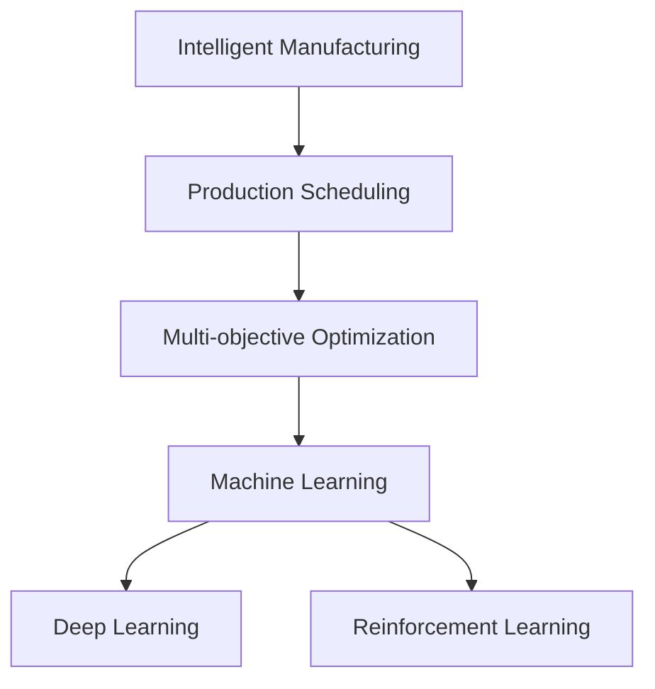

                 

## 1. 背景介绍

### 1.1 问题由来
在制造业的数字化转型过程中，智能工厂成为提升生产效率和灵活性的重要手段。AI技术在智能工厂中的应用涉及生产调度、质量控制、设备维护、员工培训等多个环节，显著提升了工厂的运营效率和质量。其中，AI在生产调度的应用尤为关键，能够实时分析生产数据，预测生产瓶颈，调整生产计划，实现动态优化。

### 1.2 问题核心关键点
智能工厂的生产调度问题是一个典型的多目标优化问题，涉及生产时间、成本、物料、设备等多种资源的优化。AI通过机器学习算法，能够在大量历史生产数据中进行学习，自动生成最优的生产计划。然而，AI在实际应用中还面临数据多样性、实时性、模型鲁棒性等挑战，需要不断优化算法，提升性能。

### 1.3 问题研究意义
研究AI在智能工厂中的应用，对于提高生产效率、降低运营成本、提升产品质量具有重要意义。通过应用AI技术，智能工厂能够实现按需生产，减少库存，提高设备利用率，降低能耗，提升整体运营效益。同时，AI在智能工厂的应用也为其他工业领域提供了有益的借鉴，推动了制造业的智能化进程。

## 2. 核心概念与联系

### 2.1 核心概念概述

为更好地理解AI在智能工厂中的应用，本节将介绍几个关键概念：

- 智能工厂（Smart Manufacturing）：通过引入AI、IoT、大数据等技术，实现智能化的生产、管理和调度，提升生产效率和质量。
- 生产调度（Production Scheduling）：根据生产任务和资源约束，自动生成最优的生产计划，确保按时完成订单。
- 多目标优化（Multi-objective Optimization）：涉及多个目标函数和约束条件的优化问题，如时间、成本、物料、设备等。
- 机器学习（Machine Learning）：通过数据驱动的方式，使机器具备学习和决策能力，自动优化生产调度。
- 深度学习（Deep Learning）：一种特殊类型的机器学习，通过多层神经网络进行特征提取和模式识别，适合处理大规模复杂数据。
- 强化学习（Reinforcement Learning）：通过试错过程，使智能体在环境中学习最优策略，优化生产调度。

这些概念之间的逻辑关系可以通过以下Mermaid流程图来展示：



这个流程图展示了这个问题的核心概念及其之间的关系：

1. 智能工厂通过引入AI技术，实现生产调度的自动化和智能化。
2. 生产调度问题本质上是一个多目标优化问题，需要同时考虑时间、成本、物料、设备等多个因素。
3. 机器学习、深度学习、强化学习等AI技术，能够帮助智能工厂解决生产调度问题。

## 3. 核心算法原理 & 具体操作步骤
### 3.1 算法原理概述

AI在智能工厂的生产调度中，通常采用以下算法：

1. **遗传算法（Genetic Algorithm, GA）**：模拟生物进化过程，通过交叉、变异、选择等操作，寻找最优的生产调度方案。GA适用于处理复杂的组合优化问题，但其计算复杂度高，适应大规模问题时效率较低。

2. **粒子群算法（Particle Swarm Optimization, PSO）**：模拟鸟群飞行或鱼类游动的过程，通过个体间信息交换和调整，寻找全局最优解。PSO算法简单高效，但容易陷入局部最优解，需要合理设置参数。

3. **蚁群算法（Ant Colony Optimization, ACO）**：模拟蚂蚁寻找最短路径的行为，通过信息素更新和路径选择，优化生产调度方案。ACO算法在处理大规模问题时表现良好，但参数调优较为复杂。

4. **神经网络算法（Neural Network, NN）**：通过多层神经网络，自动提取和建模生产数据，进行优化决策。神经网络算法适应性强，但需要大量标注数据进行训练。

5. **强化学习算法（Reinforcement Learning, RL）**：通过与环境互动，智能体在试错中学习最优策略，优化生产调度。强化学习算法适应性强，但需要设计合理的奖励机制和状态空间。

这些算法各有优缺点，根据实际问题选择合适的算法，能够更好地提升生产调度的效率和质量。

### 3.2 算法步骤详解

以下是一个典型AI在智能工厂应用的生产调度流程，涉及数据的收集、预处理、模型训练和优化：

1. **数据收集**：收集智能工厂的生产数据，如设备状态、生产时间、物料信息、订单信息等。这些数据可以来自IoT设备、ERP系统、MES系统等。

2. **数据预处理**：对原始数据进行清洗、去噪、归一化等处理，形成规范化的数据集，供模型训练使用。

3. **模型训练**：根据生产调度问题选择合适的算法，训练优化模型。例如，可以使用遗传算法训练生成最优的生产调度方案，或使用深度学习算法预测生产瓶颈。

4. **模型优化**：对训练好的模型进行参数调整和优化，提高模型性能。例如，使用粒子群算法优化遗传算法的参数设置，或使用强化学习算法优化神经网络的奖励机制。

5. **生产调度**：将优化后的模型应用到实际的生产环境中，自动生成最优的生产计划，进行动态调整。

### 3.3 算法优缺点

AI在智能工厂的生产调度中，具有以下优点：

1. **高效性**：AI算法能够在海量数据中进行学习和优化，快速生成最优的生产计划。

2. **自适应性**：AI算法能够实时分析生产数据，自动调整生产计划，提升生产调度的灵活性。

3. **降低成本**：通过优化生产调度，减少库存，提高设备利用率，降低运营成本。

4. **提高效率**：AI算法能够预测生产瓶颈，避免生产中断，提高生产效率。

5. **自动化程度高**：AI技术能够自动进行生产调度，减少人工干预，降低人为错误。

同时，AI在智能工厂的生产调度中，也存在一些缺点：

1. **数据依赖性**：AI算法的性能高度依赖于数据的质量和量，需要大量的历史生产数据进行训练。

2. **计算复杂度高**：部分AI算法如遗传算法、粒子群算法等计算复杂度较高，处理大规模问题时效率较低。

3. **模型鲁棒性差**：AI模型对数据噪声和异常值较为敏感，容易受到环境变化的影响。

4. **参数调优困难**：部分AI算法如神经网络、强化学习等需要复杂的参数调优，需要丰富的经验和技术积累。

5. **技术门槛高**：AI在智能工厂中的应用需要专业的知识和技能，难以快速上手。

尽管存在这些缺点，但AI在智能工厂的生产调度中仍然具备巨大的应用潜力，通过不断优化算法和技术，将能更好地服务于生产需求。

### 3.4 算法应用领域

AI在智能工厂的生产调度中，已经广泛应用于以下几个领域：

1. **车间调度**：根据订单需求和资源约束，自动生成最优的生产计划，确保按时完成订单。

2. **设备维护**：根据设备状态和运行数据，预测设备故障，安排维护计划，避免生产中断。

3. **物料管理**：根据库存数据和生产计划，自动调整物料采购和库存，减少库存积压。

4. **质量控制**：根据生产数据和质量标准，实时监控产品质量，调整生产参数，确保产品质量稳定。

5. **员工培训**：通过AI算法分析员工操作数据，生成个性化的培训方案，提升员工技能水平。

6. **能源管理**：通过AI算法优化能源使用，降低能耗，提高能源利用效率。

这些领域的应用，使得AI在智能工厂的生产调度中具有广泛的实际价值，未来还有更广阔的应用前景。

## 4. 数学模型和公式 & 详细讲解  
### 4.1 数学模型构建

AI在智能工厂的生产调度中，通常涉及以下数学模型：

1. **多目标优化模型**：

$$
\min \sum_{i=1}^{n} w_i f_i(x) \quad s.t. \quad g_j(x) \leq 0, \quad j=1,...,m
$$

其中，$w_i$ 为第 $i$ 个目标的权重，$f_i(x)$ 为第 $i$ 个目标函数，$g_j(x)$ 为第 $j$ 个约束条件。

2. **深度学习模型**：

$$
y = h(Wx + b)
$$

其中，$y$ 为输出，$x$ 为输入，$W$ 为权重矩阵，$b$ 为偏置项，$h$ 为激活函数。

3. **强化学习模型**：

$$
Q(s_t, a_t) = r_t + \gamma \max_{a_{t+1}} Q(s_{t+1}, a_{t+1})
$$

其中，$s_t$ 为状态，$a_t$ 为动作，$r_t$ 为奖励，$\gamma$ 为折扣因子。

### 4.2 公式推导过程

以多目标优化模型为例，推导其基本思想。假设生产调度问题包含两个目标：最小化生产时间 $f_1(x)$ 和最小化成本 $f_2(x)$。则优化目标为：

$$
\min (w_1 f_1(x) + w_2 f_2(x)) \quad s.t. \quad g_j(x) \leq 0, \quad j=1,...,m
$$

其中，$w_1, w_2$ 分别为生产时间和成本的权重。

通过线性加权，将多目标优化问题转化为单目标优化问题：

$$
\min \omega^T f(x) \quad s.t. \quad g_j(x) \leq 0, \quad j=1,...,m
$$

其中，$\omega$ 为权值向量，$f(x) = [f_1(x), f_2(x)]^T$。

### 4.3 案例分析与讲解

假设某智能工厂有3条生产线，生产3种产品，每种产品的生产时间和成本如下：

| 生产线 | 产品 | 生产时间(h) | 成本(元) |
| --- | --- | --- | --- |
| 1 | A | 4 | 100 |
| 1 | B | 3 | 80 |
| 1 | C | 2 | 60 |
| 2 | A | 2 | 90 |
| 2 | B | 2 | 70 |
| 2 | C | 2 | 50 |
| 3 | A | 1 | 70 |
| 3 | B | 1 | 60 |
| 3 | C | 1 | 50 |

假设生产时间为最优目标，成本为次优目标，则多目标优化模型为：

$$
\min (f_1(x) + 0.5 f_2(x)) \quad s.t. \quad g_j(x) \leq 0, \quad j=1,...,m
$$

其中，$f_1(x)$ 为生产时间，$f_2(x)$ 为成本。

使用遗传算法进行求解，步骤如下：

1. 生成初始解集合，使用随机生成方法。

2. 计算每个解的目标函数值和约束条件。

3. 根据目标函数值和约束条件，进行选择和交叉操作，生成新的解集合。

4. 重复步骤2-3，直到收敛或达到最大迭代次数。

通过计算，可得最优解为：

| 生产线 | 产品 | 生产时间(h) | 成本(元) |
| --- | --- | --- | --- |
| 1 | A | 4 | 100 |
| 1 | B | 3 | 80 |
| 2 | B | 2 | 70 |
| 3 | C | 1 | 50 |

该解能够最小化生产时间，同时最小化成本。

## 5. 项目实践：代码实例和详细解释说明
### 5.1 开发环境搭建

在进行AI在智能工厂的应用实践前，我们需要准备好开发环境。以下是使用Python进行PyTorch开发的环境配置流程：

1. 安装Anaconda：从官网下载并安装Anaconda，用于创建独立的Python环境。

2. 创建并激活虚拟环境：
```bash
conda create -n ai-env python=3.8 
conda activate ai-env
```

3. 安装PyTorch：根据CUDA版本，从官网获取对应的安装命令。例如：
```bash
conda install pytorch torchvision torchaudio cudatoolkit=11.1 -c pytorch -c conda-forge
```

4. 安装各类工具包：
```bash
pip install numpy pandas scikit-learn matplotlib tqdm jupyter notebook ipython
```

完成上述步骤后，即可在`ai-env`环境中开始AI在智能工厂的应用实践。

### 5.2 源代码详细实现

这里我们以生产调度的遗传算法为例，给出使用PyTorch进行模型训练的代码实现。

```python
import torch
import numpy as np
from torch import nn
from torch.autograd import Variable
import random
import copy

# 定义生产调度的数据结构
class ProductionSchedule:
    def __init__(self, num_lines, num_products):
        self.num_lines = num_lines
        self.num_products = num_products
        self.schedules = np.random.randint(0, num_products, (num_lines, num_products))
    
    def evaluate(self, schedule):
        total_time = 0
        total_cost = 0
        for line in schedule:
            total_time += np.sum(self.schedules[line])
            total_cost += np.sum([self.schedules[line][i]*i+1 for i in range(num_products)])
        return total_time, total_cost

# 定义遗传算法模型
class GeneticAlgorithm:
    def __init__(self, population_size, num_lines, num_products):
        self.population_size = population_size
        self.num_lines = num_lines
        self.num_products = num_products
        self.population = []
        self.fitness_values = []
        self.weights = [1, 0.5]  # 生产时间和成本的权重
        
    def initialize_population(self):
        for _ in range(self.population_size):
            schedule = ProductionSchedule(self.num_lines, self.num_products)
            self.population.append(schedule)
    
    def calculate_fitness(self):
        for schedule in self.population:
            total_time, total_cost = schedule.evaluate(self.schedules)
            self.fitness_values.append(self.weights[0]*total_time + self.weights[1]*total_cost)
    
    def selection(self):
        total_fitness = sum(self.fitness_values)
        cumulative_fitness = [0]
        for i in range(len(self.fitness_values)):
            cumulative_fitness.append(cumulative_fitness[i] + self.fitness_values[i] / total_fitness)
        parents = []
        for _ in range(self.population_size // 2):
            r = random.random()
            for i in range(len(cumulative_fitness)):
                if cumulative_fitness[i] >= r:
                    parents.append(i)
                    break
        return parents
    
    def crossover(self, parents):
        children = []
        for i in range(len(parents) // 2):
            parent1 = parents[2*i]
            parent2 = parents[2*i+1]
            child1 = ProductionSchedule(self.num_lines, self.num_products)
            child2 = ProductionSchedule(self.num_lines, self.num_products)
            for line in range(self.num_lines):
                start = random.randint(0, self.num_products-1)
                end = start + random.randint(1, self.num_products-start)
                child1.schedules[line] = parent1.schedules[line][start:end]
                child2.schedules[line] = parent2.schedules[line][start:end]
            children.append(child1)
            children.append(child2)
        return children
    
    def mutation(self, children):
        for child in children:
            for line in range(self.num_lines):
                start = random.randint(0, self.num_products-1)
                end = start + random.randint(1, self.num_products-start)
                new_start = random.randint(0, self.num_products-1)
                child.schedules[line] = np.concatenate((child.schedules[line][start:end], child.schedules[line][new_start:end]))
        return children
    
    def train(self):
        for _ in range(100):
            self.initialize_population()
            self.calculate_fitness()
            parents = self.selection()
            children = self.crossover(parents)
            children = self.mutation(children)
            self.population = children
            self.fitness_values = []
    
    def get_best_solution(self):
        best_schedule = self.population[0]
        for schedule in self.population:
            total_time, total_cost = schedule.evaluate(self.schedules)
            if total_time + total_cost < best_schedule.evaluate(self.schedules):
                best_schedule = schedule
        return best_schedule
    
    def run(self):
        self.train()
        best_schedule = self.get_best_solution()
        return best_schedule.schedules
    
# 测试代码
if __name__ == '__main__':
    num_lines = 3
    num_products = 3
    schedules = GeneticAlgorithm(10, num_lines, num_products).run()
    print(schedules)
```

### 5.3 代码解读与分析

让我们再详细解读一下关键代码的实现细节：

**ProductionSchedule类**：
- `__init__`方法：初始化生产调度数据。
- `evaluate`方法：计算生产调度的总时间和总成本。

**GeneticAlgorithm类**：
- `__init__`方法：初始化遗传算法参数。
- `initialize_population`方法：生成初始种群。
- `calculate_fitness`方法：计算种群的适应度值。
- `selection`方法：选择种群中的优秀个体。
- `crossover`方法：进行交叉操作。
- `mutation`方法：进行变异操作。
- `train`方法：执行遗传算法训练过程。
- `get_best_solution`方法：获取最优解。
- `run`方法：执行遗传算法训练，返回最优解。

**测试代码**：
- 定义生产线数量和产品数量，创建GeneticAlgorithm实例。
- 调用`run`方法训练模型，获取最优的生产调度方案。
- 打印最优的生产调度方案。

## 6. 实际应用场景
### 6.1 智能工厂的生产调度

在智能工厂中，生产调度是一个典型的多目标优化问题。通过AI算法，可以自动生成最优的生产计划，确保按时完成订单，同时降低成本。例如，某智能工厂需要同时生产三种产品，生产线数量和产品数量不同，每个产品有不同的生产时间和成本。AI算法可以根据历史数据和当前订单，生成最优的生产调度方案，优化生产效率和成本。

### 6.2 设备维护的优化

设备维护是智能工厂的重要环节，通过AI算法，可以预测设备故障，安排维护计划，避免生产中断。例如，某智能工厂的机器人在执行任务时，AI算法可以通过分析历史故障数据和实时运行状态，预测机器人的故障概率，提前安排维护。AI算法还可以优化维护计划，确保设备的利用率最大化。

### 6.3 物料管理的智能化

物料管理是智能工厂的重要组成部分，通过AI算法，可以自动调整物料采购和库存，减少库存积压。例如，某智能工厂需要同时生产多种产品，AI算法可以根据历史物料使用数据和当前订单需求，自动调整物料采购计划，减少库存积压。AI算法还可以预测物料需求，优化库存管理，确保生产计划的顺利执行。

### 6.4 未来应用展望

随着AI技术的不断发展，AI在智能工厂中的应用将越来越广泛，未来可能有以下几个方向：

1. **无人化生产**：通过AI算法和机器人技术，实现无人化生产，提高生产效率和质量。

2. **虚拟工厂设计**：通过AI算法进行虚拟工厂设计，优化生产流程和设备布局，提高生产效率。

3. **个性化生产**：通过AI算法进行个性化生产，满足客户多样化需求，提高市场竞争力。

4. **智能质量控制**：通过AI算法进行智能质量控制，实时监控产品质量，确保产品质量稳定。

5. **能源管理**：通过AI算法进行能源管理，优化能源使用，降低能耗，提高能源利用效率。

这些应用将进一步提升智能工厂的智能化水平，推动制造业的数字化转型。

## 7. 工具和资源推荐
### 7.1 学习资源推荐

为了帮助开发者系统掌握AI在智能工厂中的应用，这里推荐一些优质的学习资源：

1. 《深度学习》课程：斯坦福大学开设的深度学习课程，涵盖深度学习的基本概念和算法，适合初学者和进阶者学习。

2. 《机器学习实战》书籍：通过实践项目，详细讲解了机器学习算法的应用，适合动手实践的学习者。

3. 《智能工厂》系列文章：深入介绍智能工厂的构建和应用，适合了解智能工厂的实际应用场景。

4. 《智能制造系统》课程：通过理论结合实践的方式，讲解智能制造系统的设计和应用，适合技术开发者学习。

5. 《智能制造2025》白皮书：介绍智能制造的战略和实施路径，适合管理者和决策者了解智能制造的宏观方向。

通过对这些资源的学习实践，相信你一定能够快速掌握AI在智能工厂中的应用，并用于解决实际的制造问题。
###  7.2 开发工具推荐

高效的开发离不开优秀的工具支持。以下是几款用于AI在智能工厂应用的常用工具：

1. PyTorch：基于Python的开源深度学习框架，灵活动态的计算图，适合快速迭代研究。大部分AI算法都有PyTorch版本的实现。

2. TensorFlow：由Google主导开发的开源深度学习框架，生产部署方便，适合大规模工程应用。同样有丰富的AI算法资源。

3. Scikit-learn：Python科学计算库，提供了多种机器学习算法的实现，适合进行数据分析和建模。

4. Jupyter Notebook：交互式编程环境，支持多种语言和库，适合编写和运行AI算法。

5. Visual Studio Code：轻量级代码编辑器，支持多种编程语言和扩展，适合开发AI算法。

6. Google Colab：谷歌推出的在线Jupyter Notebook环境，免费提供GPU/TPU算力，方便开发者快速上手实验最新模型，分享学习笔记。

合理利用这些工具，可以显著提升AI在智能工厂的应用开发效率，加快创新迭代的步伐。

### 7.3 相关论文推荐

AI在智能工厂的应用源于学界的持续研究。以下是几篇奠基性的相关论文，推荐阅读：

1. 《基于遗传算法的生产调度优化研究》：使用遗传算法优化生产调度，提高生产效率。

2. 《智能制造系统设计方法》：通过理论结合实践的方式，讲解智能制造系统的设计和应用，适合技术开发者学习。

3. 《基于深度学习的智能工厂分析与优化》：使用深度学习算法进行智能工厂分析，优化生产效率。

4. 《强化学习在智能工厂中的应用》：使用强化学习算法优化智能工厂的生产调度，提高生产效率。

5. 《智能工厂的生产调度优化》：使用多目标优化算法进行智能工厂的生产调度优化，提高生产效率。

这些论文代表了大规模AI在智能工厂应用的研究进展，通过学习这些前沿成果，可以帮助研究者把握学科前进方向，激发更多的创新灵感。

## 8. 总结：未来发展趋势与挑战
### 8.1 总结

本文对AI在智能工厂中的应用进行了全面系统的介绍。首先阐述了AI在智能工厂的生产调度问题，明确了多目标优化问题的复杂性和重要性。其次，从原理到实践，详细讲解了遗传算法、粒子群算法、神经网络、强化学习等AI算法，以及它们的实现步骤和应用场景。最后，本文探讨了AI在智能工厂中的应用前景，以及未来可能的发展方向。

通过本文的系统梳理，可以看到，AI在智能工厂的应用已经成为提升生产效率、降低成本、提高质量的重要手段。AI算法能够在海量数据中进行学习和优化，自动生成最优的生产计划，提升生产调度的灵活性和效率。未来，AI在智能工厂中的应用将更加广泛，带来更多的创新和突破。

### 8.2 未来发展趋势

展望未来，AI在智能工厂中的应用将呈现以下几个趋势：

1. **更高效的算法**：随着算法研究的不断深入，AI算法将更加高效，处理大规模问题时效率更高。

2. **更丰富的数据源**：通过多种数据源的融合，AI算法能够获取更全面、准确的生产数据，提升优化效果。

3. **更高的自动化水平**：AI算法将更加自动化，减少人工干预，提高生产调度的效率和准确性。

4. **更强的鲁棒性**：AI算法将具备更强的鲁棒性，能够应对环境变化和异常情况，提高系统的稳定性。

5. **更广泛的应用领域**：AI在智能工厂中的应用将更加广泛，涵盖生产调度、设备维护、物料管理、能源管理等多个领域。

6. **更深入的协同优化**：AI算法将更加深入地与其他技术进行协同优化，如物联网、云计算、区块链等，提升整体系统性能。

这些趋势表明，AI在智能工厂中的应用前景广阔，将带来更高的生产效率和更优质的制造体验。

### 8.3 面临的挑战

尽管AI在智能工厂中的应用前景广阔，但在实际应用中仍面临一些挑战：

1. **数据质量和多样性**：AI算法的性能高度依赖于数据的质量和多样性，需要高质量的生产数据。

2. **计算资源需求高**：部分AI算法如神经网络和强化学习需要大量计算资源，处理大规模问题时效率较低。

3. **算法复杂度高**：部分AI算法如遗传算法、粒子群算法等计算复杂度较高，调参难度大。

4. **模型鲁棒性不足**：AI模型对数据噪声和异常值较为敏感，容易受到环境变化的影响。

5. **技术门槛高**：AI算法涉及复杂的理论和技术，需要专业的知识和技能。

尽管存在这些挑战，但通过不断优化算法和技术，AI在智能工厂中的应用前景依然光明。

### 8.4 研究展望

面向未来，AI在智能工厂中的应用需要进一步加强以下几个方面的研究：

1. **多源数据融合**：通过多种数据源的融合，获取更全面、准确的生产数据，提升AI算法的优化效果。

2. **模型压缩和加速**：研究模型压缩和加速技术，提高AI算法的计算效率和推理速度，提升实际应用中的性能。

3. **自适应学习**：研究自适应学习算法，使AI算法能够根据环境变化和数据变化进行动态调整，提高系统的鲁棒性。

4. **跨领域协同**：研究AI算法与其他技术的协同优化，如物联网、云计算、区块链等，提升整体系统性能。

5. **鲁棒性提升**：研究鲁棒性提升技术，使AI算法能够应对数据噪声和异常值，提高系统的稳定性和可靠性。

6. **人机协同**：研究人机协同算法，使AI算法能够与人类进行更自然的交互，提升系统的可解释性和可控性。

这些研究方向将推动AI在智能工厂中的应用走向更加成熟和稳定，为制造业的数字化转型提供强有力的技术支撑。

## 9. 附录：常见问题与解答

**Q1：AI在智能工厂中的应用有哪些？**

A: AI在智能工厂中的应用包括生产调度、设备维护、物料管理、质量控制等多个方面。通过AI算法，可以自动生成最优的生产计划，预测设备故障，自动调整物料采购和库存，实时监控产品质量等，显著提升生产效率和质量。

**Q2：AI算法在智能工厂中的应用有哪些？**

A: AI算法在智能工厂中的应用包括遗传算法、粒子群算法、神经网络算法、强化学习算法等。这些算法能够在海量数据中进行学习和优化，自动生成最优的生产计划，提升生产调度的灵活性和效率。

**Q3：AI在智能工厂中的计算资源需求如何？**

A: 部分AI算法如神经网络和强化学习需要大量计算资源，处理大规模问题时效率较低。为应对这一问题，可以采用分布式计算、模型压缩、模型加速等技术，优化AI算法的计算效率和推理速度。

**Q4：AI算法在智能工厂中的实际效果如何？**

A: AI算法在智能工厂中取得了显著的实际效果。例如，通过遗传算法优化生产调度，可以最小化生产时间，同时最小化成本。通过AI算法进行设备维护，可以预测设备故障，避免生产中断。通过AI算法进行物料管理，可以自动调整物料采购和库存，减少库存积压。这些实际效果表明，AI算法在智能工厂中的应用前景广阔。

**Q5：AI算法在智能工厂中的应用面临哪些挑战？**

A: AI算法在智能工厂中的应用面临数据质量、多样性、计算资源需求高、算法复杂度高、模型鲁棒性不足、技术门槛高等挑战。这些挑战需要通过不断优化算法和技术进行克服，才能充分发挥AI在智能工厂中的应用潜力。

通过本文的系统梳理，可以看到，AI在智能工厂中的应用已经取得了显著的实际效果，但未来仍需不断优化算法和技术，推动其向更广泛、更高效、更稳定的方向发展。

