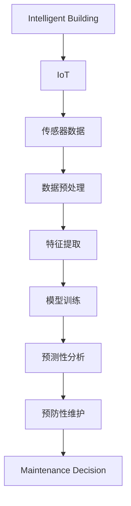

                 

# AI在智能建筑维护中的应用：预防性维护

> 关键词：智能建筑,预防性维护,机器学习,物联网(IoT),传感器数据,预测性分析

## 1. 背景介绍

### 1.1 问题由来

随着科技的迅猛发展，全球建筑业正经历着从传统粗放式管理向智能化、自动化管理的转变。智能化建筑不仅提高了人们的工作和生活质量，还降低了能源消耗和维护成本。然而，随着建筑规模的扩大和设备复杂度的提升，如何有效地进行建筑维护成为了一个亟待解决的问题。

传统的建筑维护方式主要依靠人工巡检和定期维护，这种方法不仅耗时耗力，而且存在诸多弊端：

- 人力成本高：人工巡检需要大量的人力和时间，成本高昂。
- 巡检效率低：人工巡检覆盖面小，存在巡检盲区，难以发现潜在问题。
- 设备运行状态难以实时监测：人工巡检无法实时监测设备运行状态，往往在故障发生后才发现问题。
- 维护决策缺乏依据：传统维护方式缺乏数据支持，难以做出科学合理的维护决策。

面对这些问题，人工智能(AI)技术为智能化建筑维护提供了新的解决方案。通过对建筑设备的传感器数据进行实时监测和分析，AI可以提前预测设备故障，提高巡检效率，降低维护成本，实现智能维护。其中，基于AI的预防性维护技术成为了智能化建筑维护的重要方向。

### 1.2 问题核心关键点

预防性维护通过实时监测和分析建筑设备的传感器数据，提前发现设备潜在故障，进行预知性维护。其核心关键点包括：

- 数据采集：从建筑设备中收集传感器数据，如温度、湿度、振动、压力、电流等。
- 数据预处理：对采集到的数据进行去噪、滤波、归一化等预处理，确保数据的质量。
- 特征提取：从预处理后的数据中提取出反映设备状态的特征，如峰值、波形、频谱等。
- 模型训练：使用机器学习算法训练预测模型，对设备状态进行分类或回归预测。
- 维护决策：根据模型预测结果，制定科学合理的维护计划，提升设备运行效率。

## 2. 核心概念与联系

### 2.1 核心概念概述

为更好地理解基于AI的预防性维护方法，本节将介绍几个密切相关的核心概念：

- 智能建筑(Intelligent Building)：通过物联网(IoT)技术实现设备互联互通，实时监控建筑状态，提高能效和舒适性的智能建筑系统。
- 物联网(IoT)：利用互联网技术将各种设备和设施互联互通，实现数据采集、处理和共享。
- 传感器数据(Sensor Data)：通过传感器实时采集建筑设备的运行状态数据，为设备故障预测提供数据支持。
- 预测性分析(Predictive Analytics)：通过对历史数据和实时数据进行分析和建模，预测设备未来状态和故障的概率。
- 预防性维护(Predictive Maintenance)：在设备出现故障前，通过预测性分析结果进行主动维护，避免设备故障带来的损失。
- 机器学习(Machine Learning)：利用算法训练模型，从数据中学习规律，实现预测性分析和故障诊断。
- 时序数据(Time-Series Data)：传感器数据具有时间顺序的特性，机器学习模型需要处理这类数据的时间依赖性。

这些核心概念之间的逻辑关系可以通过以下Mermaid流程图来展示：



这个流程图展示了一系列核心概念及其之间的关系：

1. 智能建筑通过物联网技术实现设备互联，数据采集自传感器。
2. 传感器数据经过预处理和特征提取，输入到机器学习模型中。
3. 模型训练得到预测性分析结果，为预防性维护提供依据。
4. 预防性维护根据预测结果制定维护计划，提升设备运行效率。

## 3. 核心算法原理 & 具体操作步骤
### 3.1 算法原理概述

基于AI的预防性维护方法，本质上是一种基于机器学习的预测性分析方法。其核心思想是：通过对设备传感器数据进行特征提取和模型训练，实现对设备未来状态的预测，从而提前制定维护计划，避免设备故障带来的损失。

形式化地，假设传感器数据为 $x_t = (x_{t1}, x_{t2}, ..., x_{tn})$，其中 $x_{ti}$ 为第 $i$ 个传感器在第 $t$ 时刻采集的数据。目标是根据历史数据和当前数据，预测设备在下一个时刻 $t+1$ 的状态 $y_{t+1}$，即：

$$
y_{t+1} = f(x_t)
$$

其中 $f$ 为预测模型，可以是分类模型、回归模型或序列模型等。通过实时监测传感器数据，不断更新模型参数，可以实现设备状态的实时预测。

### 3.2 算法步骤详解

基于AI的预防性维护方法一般包括以下几个关键步骤：

**Step 1: 数据采集与预处理**
- 从建筑设备中安装传感器，采集设备的运行状态数据。
- 对采集到的数据进行去噪、滤波、归一化等预处理操作，确保数据的质量。

**Step 2: 特征提取**
- 从预处理后的数据中提取出反映设备状态的特征，如峰值、波形、频谱等。
- 选择最有效的特征作为模型输入。

**Step 3: 模型训练**
- 使用机器学习算法训练预测模型，如支持向量机(SVM)、随机森林(Random Forest)、神经网络(NN)等。
- 在训练过程中，使用历史数据和实时数据进行模型训练和验证。
- 根据模型在验证集上的表现，选择最优模型进行预测。

**Step 4: 预测性分析**
- 实时监测传感器数据，输入到训练好的模型中，得到设备状态预测结果。
- 根据预测结果，评估设备故障概率，确定维护计划。

**Step 5: 维护决策与执行**
- 根据预测结果，制定科学合理的维护计划，提前进行设备维修或更换。
- 执行维护计划，记录维护效果，不断优化维护策略。

### 3.3 算法优缺点

基于AI的预防性维护方法具有以下优点：

- 精度高：机器学习模型可以通过大量历史数据进行训练，预测设备状态具有较高的精度。
- 实时性：实时监测传感器数据，能够及时发现设备异常，提前制定维护计划。
- 自动化：自动化维护过程，减少人工干预，提高工作效率。
- 降低维护成本：通过预防性维护，避免设备故障带来的高昂维修成本。

同时，该方法也存在一定的局限性：

- 数据质量依赖：传感器数据的质量直接影响到预测模型的效果。
- 模型复杂度：训练复杂模型需要较长的训练时间和高计算资源。
- 数据隐私和安全：传感器数据包含大量隐私信息，数据安全和隐私保护需要特别注意。
- 模型解释性不足：黑盒模型的输出结果难以解释，需要进一步研究模型的可解释性。

尽管存在这些局限性，但就目前而言，基于AI的预防性维护方法仍是一种高效的维护方式。未来相关研究的重点在于如何进一步降低模型对标注数据的依赖，提高模型的鲁棒性和可解释性，同时兼顾数据隐私和安全等因素。

### 3.4 算法应用领域

基于AI的预防性维护方法在多个领域都有广泛应用，例如：

- 智能建筑：通过实时监测建筑设备，提前发现设备异常，进行预知性维护，提高建筑设备的运行效率和能效。
- 工业制造：通过监测生产线设备，提前预测设备故障，减少停机时间，提升生产效率。
- 交通运输：通过监测车辆传感器数据，提前预测车辆故障，降低交通事故率，提高车辆运行安全。
- 电力系统：通过监测电力设备传感器数据，提前预测设备故障，避免故障带来的能源损失，提高电力系统稳定性和可靠性。

除了这些经典应用外，基于AI的预防性维护方法还在物流、农业、航空航天等众多领域得到了应用，为各行各业带来了显著的经济效益和社会价值。

## 4. 数学模型和公式 & 详细讲解 & 举例说明
### 4.1 数学模型构建

本节将使用数学语言对基于AI的预防性维护过程进行更加严格的刻画。

假设传感器数据为 $x_t = (x_{t1}, x_{t2}, ..., x_{tn})$，其中 $x_{ti}$ 为第 $i$ 个传感器在第 $t$ 时刻采集的数据。目标是根据历史数据和当前数据，预测设备在下一个时刻 $t+1$ 的状态 $y_{t+1}$，即：

$$
y_{t+1} = f(x_t)
$$

其中 $f$ 为预测模型，可以是分类模型、回归模型或序列模型等。模型训练过程可以表示为：

$$
\theta^* = \mathop{\arg\min}_{\theta} \mathcal{L}(f_{\theta}(x), y)
$$

其中 $\mathcal{L}$ 为预测误差函数，$\theta$ 为模型参数，$f_{\theta}(x)$ 为预测模型。在实际应用中，我们通常使用基于梯度的优化算法，如随机梯度下降(SGD)、Adam等，来近似求解上述最优化问题。设 $\eta$ 为学习率，则参数的更新公式为：

$$
\theta \leftarrow \theta - \eta \nabla_{\theta}\mathcal{L}(f_{\theta}(x), y)
$$

其中 $\nabla_{\theta}\mathcal{L}(f_{\theta}(x), y)$ 为预测误差函数对参数 $\theta$ 的梯度，可通过反向传播算法高效计算。

### 4.2 公式推导过程

以下我们以时间序列预测为例，推导基于机器学习的预测模型。

假设传感器数据 $x_t$ 为一时间序列，模型通过历史数据 $x_{1:T}$ 预测未来数据 $x_{T+1}$，其中 $T$ 为历史数据长度。常用的时间序列预测模型包括ARIMA、LSTM等。以LSTM模型为例，其预测过程可以表示为：

$$
y_{t+1} = f(x_t) = \sigma(W_h\cdot\phi(x_t; h_t-1) + b_h)
$$

其中 $\phi$ 为LSTM细胞函数，$h_t$ 为LSTM的隐藏状态，$W_h$ 和 $b_h$ 为模型参数。LSTM模型的训练过程如下：

$$
\theta^* = \mathop{\arg\min}_{\theta} \mathcal{L}(f_{\theta}(x), y)
$$

其中 $\mathcal{L}$ 为预测误差函数，$\theta$ 为模型参数，$f_{\theta}(x)$ 为预测模型。通过反向传播算法，更新模型参数 $\theta$，最小化预测误差 $\mathcal{L}$。

### 4.3 案例分析与讲解

假设某智能建筑中的设备传感器数据为：

| 传感器编号 | 当前值 | 历史值 |
| ---------- | ------ | ------ |
| 1          | 0.8    | 0.7    |
| 2          | 0.5    | 0.6    |
| 3          | 1.2    | 1.1    |
| ...        | ...    | ...    |

为了预测设备在下一个时刻的状态，可以使用LSTM模型进行训练和预测。具体步骤如下：

1. **数据预处理**：对传感器数据进行去噪、滤波、归一化等预处理操作。
2. **特征提取**：选择LSTM模型需要的特征，如传感器数据的时间序列特征。
3. **模型训练**：使用历史数据和实时数据进行LSTM模型的训练，得到预测模型。
4. **预测性分析**：实时监测传感器数据，输入到训练好的LSTM模型中，得到设备状态预测结果。
5. **维护决策与执行**：根据预测结果，制定科学合理的维护计划，提前进行设备维修或更换。

## 5. 项目实践：代码实例和详细解释说明
### 5.1 开发环境搭建

在进行预防性维护实践前，我们需要准备好开发环境。以下是使用Python进行TensorFlow开发的环境配置流程：

1. 安装Anaconda：从官网下载并安装Anaconda，用于创建独立的Python环境。

2. 创建并激活虚拟环境：
```bash
conda create -n tf-env python=3.8 
conda activate tf-env
```

3. 安装TensorFlow：根据CUDA版本，从官网获取对应的安装命令。例如：
```bash
conda install tensorflow==2.7
```

4. 安装各类工具包：
```bash
pip install numpy pandas scikit-learn matplotlib tqdm jupyter notebook ipython
```

完成上述步骤后，即可在`tf-env`环境中开始预防性维护实践。

### 5.2 源代码详细实现

下面我们以LSTM模型为例，给出使用TensorFlow对智能建筑设备进行预测性分析的PyTorch代码实现。

首先，定义设备传感器数据：

```python
import numpy as np

# 假设传感器数据为一个时间序列
timesteps = 10
inputs = np.random.rand(timesteps, 3)  # 传感器数据的个数为3
targets = np.random.rand(timesteps)  # 目标数据的个数为3
```

然后，定义LSTM模型：

```python
import tensorflow as tf
from tensorflow.keras.layers import LSTM, Dense, Dropout
from tensorflow.keras.models import Sequential

# 定义LSTM模型
model = Sequential()
model.add(LSTM(50, input_shape=(timesteps, 3), return_sequences=True))
model.add(Dropout(0.2))
model.add(LSTM(50, return_sequences=True))
model.add(Dropout(0.2))
model.add(LSTM(50))
model.add(Dropout(0.2))
model.add(Dense(1, activation='sigmoid'))
```

接着，定义训练和评估函数：

```python
from tensorflow.keras.optimizers import Adam
from tensorflow.keras.losses import MeanSquaredError
from tensorflow.keras.metrics import MeanAbsoluteError

# 定义损失函数和评估指标
loss = MeanSquaredError()
mae = MeanAbsoluteError()

# 定义优化器
optimizer = Adam(lr=0.001)

# 定义训练函数
def train(model, inputs, targets, epochs=100, batch_size=32):
    dataset = tf.data.Dataset.from_tensor_slices((inputs, targets))
    dataset = dataset.batch(batch_size)
    for epoch in range(epochs):
        for batch in dataset:
            inputs_batch, targets_batch = batch
            with tf.GradientTape() as tape:
                predictions = model(inputs_batch)
                loss_value = loss(predictions, targets_batch)
            gradients = tape.gradient(loss_value, model.trainable_variables)
            optimizer.apply_gradients(zip(gradients, model.trainable_variables))
    return model

# 定义评估函数
def evaluate(model, inputs, targets):
    predictions = model(inputs)
    mae_value = mae(predictions, targets)
    return mae_value
```

最后，启动训练流程并在测试集上评估：

```python
# 训练模型
trained_model = train(model, inputs, targets)

# 评估模型
mae_value = evaluate(trained_model, inputs, targets)
print(f"Mean Absolute Error: {mae_value:.3f}")
```

以上就是使用TensorFlow对智能建筑设备进行预测性分析的完整代码实现。可以看到，通过TensorFlow的Keras API，我们可以用相对简洁的代码完成LSTM模型的定义和训练，而无需关注底层的TensorFlow细节。

### 5.3 代码解读与分析

让我们再详细解读一下关键代码的实现细节：

**LSTM模型定义**：
- 使用Sequential模型定义LSTM网络。
- 定义了3个LSTM层，每个层都有50个神经元，使用dropout技术避免过拟合。
- 最后定义一个全连接层，输出设备状态预测结果。

**训练函数**：
- 定义了损失函数和评估指标，用于计算模型预测结果与真实值的差距。
- 使用Adam优化器进行模型参数更新，训练过程中使用批次训练(batch training)。
- 在训练过程中，计算每个批次的损失，更新模型参数，并在每个epoch结束时输出平均损失。

**评估函数**：
- 使用MeanAbsoluteError评估指标计算模型预测结果与真实值的均方误差。
- 在评估过程中，计算模型对每个批次的预测误差，并返回最终的评估结果。

可以看到，TensorFlow的Keras API使得模型训练和评估变得简单高效，减少了手动编写代码的工作量。这正是深度学习框架的优势所在。

当然，工业级的系统实现还需考虑更多因素，如模型的保存和部署、超参数的自动搜索、更灵活的任务适配层等。但核心的预防性维护范式基本与此类似。

## 6. 实际应用场景
### 6.1 智能建筑

基于LSTM的预测性分析，可以应用于智能建筑设备的实时监测和故障预测。例如，某智能建筑中的电梯设备传感器数据如下：

| 传感器编号 | 当前值 | 历史值 |
| ---------- | ------ | ------ |
| 1          | 0.8    | 0.7    |
| 2          | 0.5    | 0.6    |
| 3          | 1.2    | 1.1    |
| ...        | ...    | ...    |

通过使用LSTM模型，可以实时监测电梯设备的运行状态，预测设备在下一个时刻的状态，避免设备故障带来的损失。具体步骤如下：

1. **数据预处理**：对传感器数据进行去噪、滤波、归一化等预处理操作。
2. **特征提取**：选择LSTM模型需要的特征，如电梯设备的速度、加速度等。
3. **模型训练**：使用历史数据和实时数据进行LSTM模型的训练，得到预测模型。
4. **预测性分析**：实时监测传感器数据，输入到训练好的LSTM模型中，得到电梯设备状态预测结果。
5. **维护决策与执行**：根据预测结果，制定科学合理的维护计划，提前进行电梯维修或更换。

通过预防性维护，可以有效提高电梯设备的运行效率，降低维护成本，提升用户的舒适度和安全性。

### 6.2 工业制造

基于时间序列预测模型，可以应用于工业制造设备的预测性维护。例如，某制造企业中的生产线设备传感器数据如下：

| 传感器编号 | 当前值 | 历史值 |
| ---------- | ------ | ------ |
| 1          | 0.8    | 0.7    |
| 2          | 0.5    | 0.6    |
| 3          | 1.2    | 1.1    |
| ...        | ...    | ...    |

通过使用时间序列预测模型，可以实时监测生产线设备的运行状态，预测设备在下一个时刻的状态，避免设备故障带来的损失。具体步骤如下：

1. **数据预处理**：对传感器数据进行去噪、滤波、归一化等预处理操作。
2. **特征提取**：选择时间序列预测模型需要的特征，如生产线设备的温度、振动、电流等。
3. **模型训练**：使用历史数据和实时数据进行时间序列预测模型的训练，得到预测模型。
4. **预测性分析**：实时监测传感器数据，输入到训练好的时间序列预测模型中，得到生产线设备状态预测结果。
5. **维护决策与执行**：根据预测结果，制定科学合理的维护计划，提前进行生产线设备的维修或更换。

通过预防性维护，可以有效提高生产线设备的运行效率，降低维护成本，提升生产效率和产品质量。

### 6.3 交通运输

基于时间序列预测模型，可以应用于交通运输设备的预测性维护。例如，某交通运输公司中的车辆传感器数据如下：

| 传感器编号 | 当前值 | 历史值 |
| ---------- | ------ | ------ |
| 1          | 0.8    | 0.7    |
| 2          | 0.5    | 0.6    |
| 3          | 1.2    | 1.1    |
| ...        | ...    | ...    |

通过使用时间序列预测模型，可以实时监测车辆设备的运行状态，预测设备在下一个时刻的状态，避免设备故障带来的损失。具体步骤如下：

1. **数据预处理**：对传感器数据进行去噪、滤波、归一化等预处理操作。
2. **特征提取**：选择时间序列预测模型需要的特征，如车辆设备的温度、振动、电流等。
3. **模型训练**：使用历史数据和实时数据进行时间序列预测模型的训练，得到预测模型。
4. **预测性分析**：实时监测传感器数据，输入到训练好的时间序列预测模型中，得到车辆设备状态预测结果。
5. **维护决策与执行**：根据预测结果，制定科学合理的维护计划，提前进行车辆设备的维修或更换。

通过预防性维护，可以有效提高车辆设备的运行效率，降低维护成本，提升交通安全和运输效率。

## 7. 工具和资源推荐
### 7.1 学习资源推荐

为了帮助开发者系统掌握预防性维护的理论基础和实践技巧，这里推荐一些优质的学习资源：

1. 《机器学习实战》系列博文：由深度学习技术专家撰写，深入浅出地介绍了机器学习的基本原理和经典模型，包括时间序列预测、LSTM等。

2. Coursera《深度学习专项课程》：由斯坦福大学等高校开设的深度学习课程，涵盖深度学习的基本概念和前沿技术，适合初学者学习。

3. 《深度学习理论与实践》书籍：讲解了深度学习的基础理论和实现细节，包括时间序列预测、LSTM等。

4. PyTorch官方文档：提供了丰富的深度学习模型和工具，适合快速迭代研究。

5. TensorFlow官方文档：提供了广泛的深度学习模型和工具，适合大规模工程应用。

通过对这些资源的学习实践，相信你一定能够快速掌握预防性维护的精髓，并用于解决实际的设备维护问题。

### 7.2 开发工具推荐

高效的开发离不开优秀的工具支持。以下是几款用于预防性维护开发的常用工具：

1. PyTorch：基于Python的开源深度学习框架，灵活动态的计算图，适合快速迭代研究。大部分深度学习模型都有PyTorch版本的实现。

2. TensorFlow：由Google主导开发的开源深度学习框架，生产部署方便，适合大规模工程应用。同样有丰富的深度学习模型资源。

3. Scikit-learn：提供了简单易用的机器学习算法和工具，适合数据预处理和模型训练。

4. Jupyter Notebook：交互式的数据科学开发环境，支持代码编写和结果展示，方便开发者调试和分享。

5. Anaconda：管理Python环境和工具的包管理工具，支持创建独立的环境，方便开发者快速上手实验。

合理利用这些工具，可以显著提升预防性维护任务的开发效率，加快创新迭代的步伐。

### 7.3 相关论文推荐

预防性维护技术的发展源于学界的持续研究。以下是几篇奠基性的相关论文，推荐阅读：

1. "Predictive Maintenance: A Survey and Taxonomy"：由Lars-Erik Moller等学者综述了预测性维护的研究现状和技术范式。

2. "A Comparative Study of Data Mining Techniques for Predictive Maintenance"：由Mehdi Zare等学者比较了数据挖掘技术在预测性维护中的应用效果。

3. "Deep Learning Techniques for Predictive Maintenance: A Survey"：由Johannes Pietzsch等学者综述了深度学习技术在预测性维护中的应用。

4. "Time Series Forecasting: Methodologies, Systems and Applications"：由Foster Provost等学者介绍了一系列时间序列预测的算法和技术。

5. "Predictive Maintenance Using Machine Learning: A Survey"：由Saeid Yaghmaei等学者综述了机器学习在预测性维护中的应用。

这些论文代表了大规模设备预测性维护的研究方向，通过学习这些前沿成果，可以帮助研究者把握学科前进方向，激发更多的创新灵感。

## 8. 总结：未来发展趋势与挑战
### 8.1 总结

本文对基于AI的预防性维护方法进行了全面系统的介绍。首先阐述了AI技术在智能建筑维护中的作用和意义，明确了预防性维护在提高设备运行效率和降低维护成本方面的独特价值。其次，从原理到实践，详细讲解了预防性维护的数学模型和关键步骤，给出了预防性维护任务开发的完整代码实例。同时，本文还广泛探讨了预防性维护方法在智能建筑、工业制造、交通运输等多个领域的应用前景，展示了预防性维护范式的巨大潜力。

通过本文的系统梳理，可以看到，基于AI的预防性维护技术正在成为智能建筑维护的重要方向，极大地拓展了设备维护的智能化水平，提高了设备的运行效率和安全性。面向未来，基于AI的预防性维护技术还需要与其他人工智能技术进行更深入的融合，如知识表示、因果推理、强化学习等，协同发力，共同推动智能建筑的可持续发展。

### 8.2 未来发展趋势

展望未来，基于AI的预防性维护技术将呈现以下几个发展趋势：

1. 模型规模持续增大。随着算力成本的下降和数据规模的扩张，设备预测模型参数量还将持续增长。超大规模模型蕴含的丰富知识，有望支撑更加复杂多变的设备预测。

2. 预测精度进一步提升。通过引入更多高级模型和优化算法，设备预测模型的精度将不断提升，能够更准确地预测设备故障。

3. 预测速度加快。通过硬件加速和模型压缩等技术，设备预测模型的推理速度将显著加快，实现实时预测。

4. 跨领域知识融合。将领域知识与设备预测模型进行融合，增强模型的泛化能力和鲁棒性，提升预测结果的可靠性。

5. 多模态数据融合。将视觉、听觉、位置等多种模态数据进行融合，构建更全面的设备预测模型，提高预测准确度。

6. 自适应模型训练。基于在线学习技术，设备预测模型能够实时更新，适应设备运行状态的动态变化。

这些趋势凸显了基于AI的预防性维护技术的广阔前景。这些方向的探索发展，必将进一步提升设备预测的精确性和实时性，为设备维护提供更科学、更可靠的技术支持。

### 8.3 面临的挑战

尽管基于AI的预防性维护技术已经取得了瞩目成就，但在迈向更加智能化、普适化应用的过程中，它仍面临着诸多挑战：

1. 数据质量和数量：设备传感器数据的采集和预处理需要耗费大量人力和时间，且数据质量直接影响模型的预测效果。

2. 模型复杂度：训练复杂模型需要较长的训练时间和高计算资源，对硬件设备提出较高要求。

3. 模型鲁棒性：设备预测模型在不同场景下表现不一致，如何提高模型的鲁棒性和泛化能力是关键问题。

4. 数据隐私和安全：传感器数据包含大量隐私信息，数据安全和隐私保护需要特别注意。

5. 模型可解释性：预测模型的输出结果难以解释，需要进一步研究模型的可解释性。

6. 成本和资源：设备预测模型的训练和部署需要较高的成本和资源，如何降低成本，优化资源配置，是实际应用中的重要问题。

正视预防性维护面临的这些挑战，积极应对并寻求突破，将是基于AI的预防性维护技术走向成熟的必由之路。相信随着学界和产业界的共同努力，这些挑战终将一一被克服，基于AI的预防性维护技术必将在智能建筑维护中发挥更大的作用。

### 8.4 研究展望

面对基于AI的预防性维护所面临的挑战，未来的研究需要在以下几个方面寻求新的突破：

1. 探索无监督和半监督预测方法。摆脱对大量标注数据的依赖，利用自监督学习、主动学习等方法，最大限度利用非结构化数据，实现更加灵活高效的预测。

2. 研究跨模态数据融合技术。将视觉、听觉、位置等多种模态数据进行融合，构建更全面的设备预测模型，提高预测准确度。

3. 引入因果推理思想。通过引入因果推断，增强设备预测模型的稳定性和可解释性，学习更加普适、鲁棒的语言表征，从而提升模型泛化性和抗干扰能力。

4. 融合知识图谱技术。将知识图谱与设备预测模型进行融合，增强模型的推理能力和泛化能力。

5. 引入强化学习技术。将强化学习思想引入设备预测模型，增强模型的自主学习和适应能力。

6. 探索模型压缩和加速技术。通过模型压缩和加速技术，提高设备预测模型的推理速度和资源效率。

这些研究方向的探索，必将引领基于AI的预防性维护技术迈向更高的台阶，为智能建筑维护提供更加科学、高效、可靠的技术支持。

## 9. 附录：常见问题与解答

**Q1：基于AI的预防性维护是否适用于所有设备？**

A: 基于AI的预防性维护方法在大多数设备上都能取得不错的效果，特别是对于数据量较大的设备。但对于一些特殊领域的设备，如高精度测量设备，还需要针对设备特点进行优化。

**Q2：如何选择合适的传感器？**

A: 传感器选择的关键在于其能够准确反映设备的状态。一般建议选择具有高精度、稳定可靠、易于安装和维护的传感器。常用的传感器类型包括温度传感器、振动传感器、压力传感器等。

**Q3：如何处理缺失数据？**

A: 缺失数据处理是设备预测中的重要问题。常用的处理方法包括插值法、均值填补法、随机森林法等。在实际应用中，需要根据数据特点选择合适的方法。

**Q4：如何提高预测模型的鲁棒性？**

A: 提高预测模型的鲁棒性可以从数据处理、模型选择和训练三个方面入手：
1. 数据处理：对数据进行去噪、滤波、归一化等预处理操作，减少数据干扰。
2. 模型选择：选择适合设备特点的模型，如ARIMA、LSTM等。
3. 训练：使用更多的历史数据和实时数据进行模型训练，增强模型的泛化能力。

**Q5：如何降低设备预测模型的训练成本？**

A: 降低设备预测模型的训练成本可以从以下几个方面入手：
1. 数据采集：通过改进数据采集方法，提高数据质量。
2. 模型压缩：通过模型压缩和加速技术，提高模型推理速度和资源效率。
3. 迁移学习：利用预训练模型，减少训练时间和计算资源。

**Q6：如何保障数据安全和隐私？**

A: 保障数据安全和隐私需要从数据采集、存储和传输三个方面入手：
1. 数据采集：对传感器数据进行加密和匿名化处理，防止数据泄露。
2. 数据存储：使用数据加密和安全存储技术，保护数据安全。
3. 数据传输：使用数据加密和安全传输技术，防止数据在传输过程中被篡改或窃取。

通过这些措施，可以有效保障设备预测数据的安全和隐私。

---

作者：禅与计算机程序设计艺术 / Zen and the Art of Computer Programming

