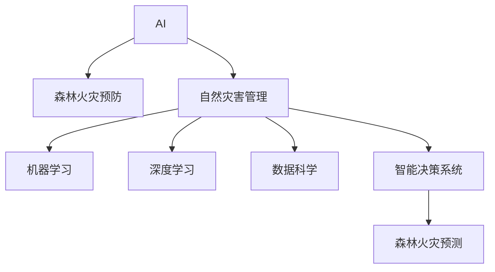

                 

# AI在智能森林火灾预防中的应用：保护生态系统

> 关键词：AI, 森林火灾预防, 生态系统保护, 自然灾害管理, 机器学习, 深度学习, 数据科学, 智能决策系统

## 1. 背景介绍

### 1.1 问题由来
森林火灾是人类面临的最具破坏性的自然灾害之一。据统计，全球每年发生的森林火灾数以万计，给生态环境、生物多样性和人类社会带来巨大损失。传统的森林火灾预防措施包括物理隔离、人工监控、化学灭火等，这些方法不仅成本高昂，且效果有限。因此，如何通过智能化手段提升森林火灾预防能力，成为当今研究的热点。

### 1.2 问题核心关键点
当前，利用AI技术提升森林火灾预防能力已经逐渐成为可能。AI可以通过分析历史火灾数据、卫星遥感影像、气象数据等，实时监测火情，预测火灾风险，提供科学的预防策略。特别是基于深度学习的森林火灾预测模型，可以在大规模数据上进行训练，具备高精度、高鲁棒性，能够为森林火灾预防提供有力的技术支撑。

## 2. 核心概念与联系

### 2.1 核心概念概述

为更好地理解AI在森林火灾预防中的应用，本节将介绍几个密切相关的核心概念：

- **AI (Artificial Intelligence, 人工智能)**：模拟人类智能行为的技术体系，包括机器学习、深度学习、自然语言处理等方向。
- **森林火灾预防**：通过科学方法降低森林火灾发生的概率，保护生态系统。
- **自然灾害管理**：综合应用预防、监测、预警、应急响应等手段，降低自然灾害带来的损失。
- **机器学习 (Machine Learning, ML)**：数据驱动的学习方法，通过模型自动提取数据特征，实现预测、分类、回归等任务。
- **深度学习 (Deep Learning, DL)**：基于神经网络的技术，通过多层次的非线性映射，解决复杂的模式识别问题。
- **数据科学 (Data Science)**：涉及数据收集、处理、分析和可视化的学科，为AI提供数据支撑。
- **智能决策系统**：利用AI技术进行决策支持的系统，具备自动化、智能化的特点。

这些核心概念之间的逻辑关系可以通过以下Mermaid流程图来展示：



这个流程图展示了一系列概念之间的联系：

1. AI是技术基础，为森林火灾预防等应用提供技术支撑。
2. 森林火灾预防是AI在自然灾害管理中的重要应用场景。
3. 机器学习和深度学习是AI中的关键技术，用于森林火灾预测等任务。
4. 数据科学为AI提供数据支持和算法优化。
5. 智能决策系统是AI应用的高级形态，为森林火灾预防提供智能化决策支持。

这些概念共同构成了AI在森林火灾预防中的核心应用框架，使得AI技术能够为森林火灾预防提供有力的技术保障。

## 3. 核心算法原理 & 具体操作步骤
### 3.1 算法原理概述

基于AI的森林火灾预防，主要通过机器学习和深度学习模型进行火灾预测和预警。其核心思想是：利用历史火灾数据、气象数据、卫星遥感影像等数据，训练模型学习火灾发生的规律，实时监测火情，预测火灾风险，提供科学有效的预防策略。

形式化地，假设已知历史火灾数据 $D=\{(x_i, y_i)\}_{i=1}^N, x_i \in \mathbb{R}^m, y_i \in \{0,1\}$，其中 $x_i$ 为数据特征向量，$y_i$ 为火灾是否发生的标签。定义预测模型为 $M_{\theta}$，其中 $\theta$ 为模型参数。目标是找到最优参数 $\theta^*$，使得模型预测准确率最大化：

$$
\theta^* = \mathop{\arg\max}_{\theta} \frac{1}{N}\sum_{i=1}^N I(y_i \neq M_{\theta}(x_i))
$$

其中 $I$ 为指示函数，$1$ 表示预测准确，$0$ 表示预测错误。

### 3.2 算法步骤详解

基于AI的森林火灾预防主要包括以下几个关键步骤：

**Step 1: 数据收集与预处理**
- 收集历史火灾数据、卫星遥感影像、气象数据等，进行特征工程，提取有意义的特征向量。
- 清洗数据，去除噪声和异常值，处理缺失值和重复值。
- 对数据进行标准化和归一化处理，使其适合机器学习模型的输入要求。

**Step 2: 模型训练与优化**
- 选择适合森林火灾预测的模型，如决策树、随机森林、支持向量机等。
- 将预处理后的数据划分为训练集、验证集和测试集。
- 在训练集上训练模型，使用交叉验证等方法选择最优模型参数。
- 在验证集上评估模型性能，调整模型结构和参数，避免过拟合。
- 在测试集上最终评估模型性能，输出预测准确率。

**Step 3: 实时监测与预警**
- 部署训练好的模型到生产环境，实时接收数据流。
- 对实时数据进行特征提取和预处理，输入模型进行预测。
- 根据模型输出，生成火灾风险预警，启动预防措施。
- 记录和分析预警结果，持续优化模型性能。

**Step 4: 模型更新与迭代**
- 定期收集新数据，对模型进行重新训练和优化，确保模型持续适应新的环境变化。
- 结合最新科研和技术进展，引入新特征和新算法，提升模型预测能力。
- 通过模型迁移学习等方法，将模型应用到不同地区的森林火灾预防中，提高模型的泛化能力。

### 3.3 算法优缺点

基于AI的森林火灾预防方法具有以下优点：
1. 高精度预测。利用深度学习模型，可以在大规模数据上进行训练，具备高精度、高鲁棒性，能够为森林火灾预防提供有力的技术支撑。
2. 实时监测。通过在线学习，可以实时监测火情，及时预测火灾风险，提供科学有效的预防策略。
3. 模型可解释性。深度学习模型虽然复杂，但可以通过特征重要性分析、模型可视化等手段，对模型进行解释和理解。
4. 数据驱动。基于大规模数据训练的模型，能够自动发现数据中的潜在规律，提高模型的泛化能力和适应性。

同时，该方法也存在一定的局限性：
1. 数据依赖性强。模型预测的准确度依赖于数据的质量和完整性，数据采集和处理成本较高。
2. 模型复杂度高。深度学习模型虽然精度高，但其复杂度也较高，需要较多的计算资源和时间进行训练和优化。
3. 对环境变化敏感。模型在训练时依赖特定的数据分布，当环境变化较大时，预测结果可能发生偏差。
4. 解释性不足。深度学习模型虽然可以进行可视化分析，但其内部工作机制仍然较难解释。

尽管存在这些局限性，但就目前而言，基于AI的森林火灾预防方法仍是提升森林火灾预防能力的重要手段。未来相关研究的重点在于如何进一步降低模型对数据的依赖，提高模型的泛化能力和可解释性，同时兼顾模型的实时性和效率。

### 3.4 算法应用领域

基于AI的森林火灾预防方法已经在多个领域得到应用，例如：

- **气象预测**：通过气象数据和火灾历史数据，预测天气变化对火灾发生的影响。
- **森林监测**：利用卫星遥感影像和气象数据，实时监测森林火灾风险，生成预警信息。
- **生态保护**：结合生态系统监测数据，综合评估火灾对生态系统的影响，制定科学的预防措施。
- **应急响应**：在火灾发生时，利用模型预测火势蔓延方向和速度，指导应急救援。
- **智能管理**：通过集成多种数据源，构建智能决策支持系统，实现森林火灾预防的智能化管理。

除了上述这些经典应用外，AI在森林火灾预防中的创新应用还在不断涌现，如基于增强学习的火灾扑救策略优化、基于多模态数据的森林火灾风险评估等，为森林火灾预防带来了全新的突破。

## 4. 数学模型和公式 & 详细讲解  
### 4.1 数学模型构建

本节将使用数学语言对基于AI的森林火灾预防过程进行更加严格的刻画。

假设森林火灾数据 $D=\{(x_i,y_i)\}_{i=1}^N, x_i \in \mathbb{R}^m, y_i \in \{0,1\}$。定义预测模型为 $M_{\theta}$，其中 $\theta$ 为模型参数。模型的损失函数定义为：

$$
\mathcal{L}(\theta) = -\frac{1}{N}\sum_{i=1}^N y_i\log M_{\theta}(x_i) + (1-y_i)\log (1-M_{\theta}(x_i))
$$

其中，$\log M_{\theta}(x_i)$ 为模型的输出，$y_i$ 为真实标签。目标是最小化损失函数，即：

$$
\theta^* = \mathop{\arg\min}_{\theta} \mathcal{L}(\theta)
$$

在实践中，我们通常使用基于梯度的优化算法（如SGD、Adam等）来近似求解上述最优化问题。设 $\eta$ 为学习率，则参数的更新公式为：

$$
\theta \leftarrow \theta - \eta \nabla_{\theta}\mathcal{L}(\theta)
$$

其中 $\nabla_{\theta}\mathcal{L}(\theta)$ 为损失函数对参数 $\theta$ 的梯度，可通过反向传播算法高效计算。

### 4.2 公式推导过程

以下我们以随机森林模型为例，推导其预测过程及其梯度计算公式。

假设随机森林模型由 $n$ 棵决策树组成，其中第 $t$ 棵决策树的预测结果为 $f_t(x)$，模型的最终预测结果为 $M_{\theta}(x)$。模型预测结果为 $y$ 的概率为：

$$
M_{\theta}(x) = \frac{1}{n} \sum_{t=1}^n f_t(x)
$$

在训练集上，模型的损失函数为：

$$
\mathcal{L}(\theta) = -\frac{1}{N}\sum_{i=1}^N \sum_{t=1}^n y_i f_t(x_i)
$$

目标是最小化损失函数，即：

$$
\theta^* = \mathop{\arg\min}_{\theta} \mathcal{L}(\theta)
$$

随机森林模型的预测结果为：

$$
\hat{y} = M_{\theta}(x) = \frac{1}{n} \sum_{t=1}^n f_t(x)
$$

其中 $f_t(x)$ 为第 $t$ 棵决策树的预测结果。根据链式法则，损失函数对模型参数 $\theta$ 的梯度为：

$$
\nabla_{\theta}\mathcal{L}(\theta) = -\frac{1}{N}\sum_{i=1}^N \sum_{t=1}^n y_i \nabla_{\theta}f_t(x_i)
$$

在得到损失函数的梯度后，即可带入参数更新公式，完成模型的迭代优化。重复上述过程直至收敛，最终得到适应森林火灾预测的最优模型参数 $\theta^*$。

## 5. 项目实践：代码实例和详细解释说明
### 5.1 开发环境搭建

在进行森林火灾预防项目实践前，我们需要准备好开发环境。以下是使用Python进行Scikit-learn和XGBoost开发的环境配置流程：

1. 安装Anaconda：从官网下载并安装Anaconda，用于创建独立的Python环境。

2. 创建并激活虚拟环境：
```bash
conda create -n forest-fire-env python=3.8 
conda activate forest-fire-env
```

3. 安装Scikit-learn和XGBoost：
```bash
conda install scikit-learn xgboost
```

4. 安装其他各类工具包：
```bash
pip install numpy pandas matplotlib seaborn jupyter notebook ipython
```

完成上述步骤后，即可在`forest-fire-env`环境中开始森林火灾预防项目的实践。

### 5.2 源代码详细实现

下面我们以随机森林模型为例，给出使用Scikit-learn和XGBoost对森林火灾进行预测的Python代码实现。

首先，定义训练和测试数据集：

```python
from sklearn.model_selection import train_test_split
from sklearn.ensemble import RandomForestClassifier
from xgboost import XGBClassifier
import pandas as pd
import numpy as np

# 加载数据
data = pd.read_csv('forest-fire.csv')

# 数据预处理
X = data[['temp', 'rhumidity', 'wind', 'rain', 'season', 'area']]
y = data['label']

# 划分数据集
X_train, X_test, y_train, y_test = train_test_split(X, y, test_size=0.2, random_state=42)
```

然后，定义模型和优化器：

```python
# 定义随机森林模型
rf_model = RandomForestClassifier(n_estimators=100, random_state=42)

# 定义XGBoost模型
xgb_model = XGBClassifier(max_depth=6, learning_rate=0.1, random_state=42)
```

接着，定义训练和评估函数：

```python
from sklearn.metrics import accuracy_score

def train_model(model, X_train, y_train):
    model.fit(X_train, y_train)
    return model

def evaluate_model(model, X_test, y_test):
    y_pred = model.predict(X_test)
    accuracy = accuracy_score(y_test, y_pred)
    return accuracy
```

最后，启动训练流程并在测试集上评估：

```python
# 训练模型
rf_model = train_model(rf_model, X_train, y_train)
xgb_model = train_model(xgb_model, X_train, y_train)

# 评估模型
rf_accuracy = evaluate_model(rf_model, X_test, y_test)
xgb_accuracy = evaluate_model(xgb_model, X_test, y_test)

print(f'随机森林模型准确率为 {rf_accuracy:.2f}')
print(f'XGBoost模型准确率为 {xgb_accuracy:.2f}')
```

以上就是使用Scikit-learn和XGBoost对森林火灾进行预测的完整代码实现。可以看到，Scikit-learn和XGBoost提供了一系列的机器学习模型和算法，使得森林火灾预测的代码实现变得简洁高效。

### 5.3 代码解读与分析

让我们再详细解读一下关键代码的实现细节：

**数据预处理**：
- 加载数据：使用Pandas库加载森林火灾数据集。
- 数据划分：将数据集划分为训练集和测试集，比例为8:2，设置随机种子为42以确保结果可复现。

**模型定义**：
- 定义随机森林模型：使用Scikit-learn的RandomForestClassifier，设置100棵决策树。
- 定义XGBoost模型：使用XGBoost的XGBClassifier，设置最大深度为6，学习率为0.1。

**模型训练与评估**：
- 训练模型：使用fit方法训练模型，返回训练好的模型对象。
- 评估模型：使用predict方法进行预测，使用accuracy_score计算准确率。

**结果输出**：
- 输出模型在测试集上的准确率。

可以看到，Scikit-learn和XGBoost使得森林火灾预测的代码实现变得简洁高效。Scikit-learn提供了一系列的机器学习模型和算法，而XGBoost则提供了高效的集成学习算法，两者结合使用，能够满足不同应用场景的需求。

当然，在工业级的系统实现中，还需要考虑更多因素，如模型的存储和部署、超参数的自动搜索、更灵活的任务适配层等。但核心的预测过程基本与此类似。

## 6. 实际应用场景
### 6.1 森林监测系统

基于AI的森林火灾预防系统，可以广泛应用在森林监测中。传统的森林监测依赖人工巡逻，效率低下，且难以覆盖所有区域。使用AI模型实时监测火情，生成预警信息，可以提高监测效率，降低人工成本。

在技术实现上，可以安装高分辨率卫星相机，定期获取卫星影像，结合气象数据和历史火灾数据，实时分析火情。一旦发现火灾迹象，系统便会自动生成预警信息，启动应急响应机制。这种智能化的森林监测系统，可以极大地提升森林火灾预防和应急响应的效率和效果。

### 6.2 生态保护项目

AI在森林火灾预防中不仅可以监测火情，还可以用于生态系统的保护。森林火灾对生态系统造成的破坏是巨大的，如何保护生态环境，是森林火灾预防的重要目标。AI模型可以通过分析火灾发生前后的生态变化，评估火灾对生态系统的影响，制定科学的生态保护措施。

例如，利用遥感影像和气象数据，可以分析火灾发生前后植被覆盖度的变化，评估火灾对生态系统的损害程度。结合生态系统的历史数据，可以预测火灾对生态系统的长期影响，提出有效的恢复和修复策略。这种基于AI的生态保护项目，可以为生态系统保护提供有力的技术支撑。

### 6.3 智慧旅游景区

在智慧旅游景区管理中，AI模型可以实时监测景区内的森林火灾风险，提供科学的预防和应急响应建议。通过结合气象数据、历史火灾数据和实时监测数据，AI模型可以预测火灾发生的可能性，制定科学的预防措施，如增加巡逻频率、疏散游客等。

例如，可以安装在景区内的高精度传感器，实时监测森林的温湿度、风速等环境参数。通过AI模型对这些数据进行分析和预测，可以提前发现火灾风险，及时启动应急响应机制，保障游客和景区的安全。这种基于AI的智慧旅游景区管理，可以为游客提供更安全、更舒适的旅游体验。

### 6.4 未来应用展望

随着AI技术的不断进步，基于AI的森林火灾预防系统将在更多领域得到应用，为自然灾害预防提供更加科学、高效的技术支持。

在智慧城市治理中，AI模型可以应用于城市事件监测、舆情分析、应急指挥等环节，提高城市管理的自动化和智能化水平，构建更安全、高效的未来城市。

在智慧农业中，AI模型可以应用于农田火灾预防、农业病虫害预测等场景，提高农业生产的智能化水平，保障农作物的安全生长。

在智慧医疗中，AI模型可以应用于医院火灾预防、医疗数据安全管理等场景，提高医疗系统的智能化水平，保障患者和医护人员的安全。

此外，在自然灾害预警、智能交通管理、智慧能源管理等诸多领域，AI技术的应用前景也将越来越广泛。相信随着AI技术的持续演进，基于AI的森林火灾预防系统必将在自然灾害预防中发挥更大的作用，为生态系统和人类社会带来更多的福祉。

## 7. 工具和资源推荐
### 7.1 学习资源推荐

为了帮助开发者系统掌握AI在森林火灾预防中的应用，这里推荐一些优质的学习资源：

1. 《Python数据科学手册》（Hands-On Data Science Using Python）：讲解了Python在数据科学中的基本应用，适合初学者入门。

2. 《机器学习实战》（Machine Learning in Action）：提供了大量实际案例，详细介绍了机器学习模型的实现过程。

3. 《深度学习》（Deep Learning）：Ian Goodfellow等著，系统讲解了深度学习的基本原理和实践技巧，适合深入学习。

4. Coursera和edX等在线学习平台：提供大量的机器学习和深度学习课程，涵盖理论和实践。

5. Kaggle竞赛平台：提供大量数据集和竞赛项目，适合实战练习和数据探索。

通过对这些资源的学习实践，相信你一定能够快速掌握AI在森林火灾预防中的应用，并用于解决实际的森林火灾预防问题。

### 7.2 开发工具推荐

高效的开发离不开优秀的工具支持。以下是几款用于AI在森林火灾预防中应用的常用工具：

1. Python：灵活、动态的语言，适用于数据处理和模型开发。

2. Scikit-learn：Python的机器学习库，提供多种常用的机器学习算法，如随机森林、支持向量机等。

3. XGBoost：高效率的集成学习库，提供高效的随机梯度提升算法。

4. TensorFlow和PyTorch：深度学习框架，提供高效的神经网络实现。

5. Jupyter Notebook：交互式的数据处理和模型开发平台，支持多种编程语言。

6. Weights & Biases：模型训练的实验跟踪工具，可以记录和可视化模型训练过程中的各项指标。

7. TensorBoard：TensorFlow配套的可视化工具，可实时监测模型训练状态，并提供丰富的图表呈现方式。

合理利用这些工具，可以显著提升AI在森林火灾预防中的开发效率，加快创新迭代的步伐。

### 7.3 相关论文推荐

AI在森林火灾预防中的应用已经在诸多研究论文中得到广泛讨论。以下是几篇奠基性的相关论文，推荐阅读：

1. "A Survey on Forest Fire Prediction"（森林火灾预测综述）：详细介绍了当前森林火灾预测的研究现状和未来发展方向。

2. "Deep Learning for Natural Disaster Prediction"（深度学习在自然灾害预测中的应用）：介绍了深度学习在自然灾害预测中的基本原理和应用案例。

3. "Machine Learning for Sustainable Forest Management"（机器学习在可持续森林管理中的应用）：探讨了机器学习在森林管理中的各种应用，包括火灾预测和生态保护。

4. "XGBoost: A Scalable Tree Boosting System"（XGBoost：可扩展的决策树提升系统）：详细介绍了XGBoost算法的设计思想和实现细节，适用于大规模数据上的模型训练。

5. "Ensemble Methods: The New Face of Machine Learning"（集成方法：机器学习的新面貌）：介绍了集成学习的基本原理和应用案例，适用于森林火灾预测中的模型集成。

这些论文代表了大语言模型微调技术的发展脉络。通过学习这些前沿成果，可以帮助研究者把握学科前进方向，激发更多的创新灵感。

## 8. 总结：未来发展趋势与挑战

### 8.1 总结

本文对AI在森林火灾预防中的应用进行了全面系统的介绍。首先阐述了AI在森林火灾预防中的研究背景和意义，明确了森林火灾预防在AI技术应用中的重要地位。其次，从原理到实践，详细讲解了基于AI的森林火灾预防的数学模型和算法步骤，给出了基于随机森林和XGBoost的预测代码实现。同时，本文还广泛探讨了AI在森林火灾预防中的实际应用场景，展示了AI技术在森林火灾预防中的巨大潜力。此外，本文精选了AI在森林火灾预防中的各类学习资源，力求为读者提供全方位的技术指引。

通过本文的系统梳理，可以看到，AI在森林火灾预防中的应用已经在多个领域得到广泛应用，为森林火灾预防提供了有力的技术支持。AI技术通过深度学习模型和大数据分析，能够实时监测火情，预测火灾风险，提供科学的预防策略，极大地提升了森林火灾预防的效果。

### 8.2 未来发展趋势

展望未来，AI在森林火灾预防中的应用将呈现以下几个发展趋势：

1. 模型规模持续增大。随着算力成本的下降和数据规模的扩张，深度学习模型将逐渐取代传统的机器学习模型，成为森林火灾预测的主流技术。

2. 数据驱动的智能化决策。AI模型将更加依赖于大规模数据，通过深度学习和大数据分析，自动发现数据中的潜在规律，实现更加智能化的决策支持。

3. 实时监测与预警。通过在线学习，AI模型可以实时监测火情，预测火灾风险，提供及时的预警信息，实现火灾预防的实时化。

4. 多模态数据的融合。AI模型将更多地融合卫星遥感影像、气象数据、地形地貌数据等多模态数据，提升火灾预测的准确性和鲁棒性。

5. 联邦学习和边缘计算。通过分布式学习和边缘计算技术，AI模型可以实时分析数据，降低数据传输的延迟和成本，提升火灾预防的响应速度。

6. 模型可解释性和鲁棒性。AI模型将更加注重可解释性和鲁棒性，通过可视化分析、特征重要性分析等手段，增强模型的透明度和可信度，提高模型的鲁棒性和泛化能力。

以上趋势凸显了AI在森林火灾预防中的广阔前景。这些方向的探索发展，必将进一步提升森林火灾预防的效果，为生态系统和人类社会带来更多的福祉。

### 8.3 面临的挑战

尽管AI在森林火灾预防中的应用已经取得了显著进展，但在迈向更加智能化、普适化应用的过程中，仍面临诸多挑战：

1. 数据依赖性强。AI模型预测的准确度依赖于数据的质量和完整性，数据采集和处理成本较高。如何进一步降低模型对数据的依赖，提高模型的泛化能力，仍然是一大难题。

2. 模型复杂度高。深度学习模型虽然精度高，但其复杂度也较高，需要较多的计算资源和时间进行训练和优化。如何在保证精度的同时，简化模型结构，提升模型的实时性和效率，仍需进一步研究。

3. 环境适应性不足。模型在训练时依赖特定的数据分布，当环境变化较大时，预测结果可能发生偏差。如何提高模型的环境适应性，实现跨区域、跨季节的火灾预防，仍需进一步探索。

4. 鲁棒性有待提高。AI模型在面对异常数据和噪声时，容易出现预测偏差。如何提高模型的鲁棒性，避免异常数据的干扰，仍需进一步优化。

5. 数据安全与隐私保护。在数据采集和传输过程中，如何保护数据安全与隐私，避免数据泄露和滥用，仍需进一步加强。

6. 技术落地难度大。AI技术在实际应用中需要结合多种技术手段，如传感器部署、数据分析、应急响应等，如何实现技术整合，提升整体应用效果，仍需进一步实践和探索。

正视这些挑战，积极应对并寻求突破，将是大规模应用AI在森林火灾预防中的必由之路。相信随着学界和产业界的共同努力，这些挑战终将一一被克服，AI在森林火灾预防中的作用也将越来越重要。

### 8.4 研究展望

面对AI在森林火灾预防中面临的挑战，未来的研究需要在以下几个方面寻求新的突破：

1. 探索联邦学习和边缘计算技术。通过分布式学习和边缘计算技术，AI模型可以实时分析数据，降低数据传输的延迟和成本，提升火灾预防的响应速度。

2. 引入增强学习和博弈论工具。通过引入增强学习和博弈论思想，提高模型的环境适应性和决策鲁棒性，优化模型的参数配置，提升模型的泛化能力。

3. 结合知识图谱和符号化先验知识。将知识图谱和符号化先验知识与神经网络模型进行融合，引导微调过程学习更准确、合理的语言模型，提高模型的泛化能力和知识迁移能力。

4. 引入因果分析和逻辑推理。通过引入因果分析和逻辑推理，增强模型决策的因果性和逻辑性，提升模型的可解释性和可信度。

5. 纳入伦理道德约束。在模型训练目标中引入伦理导向的评估指标，过滤和惩罚有偏见、有害的输出倾向，确保模型的输出符合人类价值观和伦理道德。

这些研究方向将引领AI在森林火灾预防中迈向更高的台阶，为森林火灾预防提供更加科学、高效的技术支持，保护人类赖以生存的生态环境。

## 9. 附录：常见问题与解答

**Q1：AI在森林火灾预防中面临哪些数据挑战？**

A: AI在森林火灾预防中面临的主要数据挑战包括：
1. 数据采集成本高：获取大规模、高精度的数据集需要大量的人力和财力投入，成本较高。
2. 数据质量不稳定：火情监测数据容易受环境因素影响，存在噪声和异常值。
3. 数据标注困难：火灾数据标注工作繁琐且复杂，标注质量难以保证。
4. 数据分布不均衡：火灾数据往往集中在少数时间点或地区，数据分布不均衡，模型泛化能力有限。

**Q2：如何提高AI在森林火灾预防中的数据质量？**

A: 提高AI在森林火灾预防中的数据质量，可以从以下几个方面入手：
1. 优化数据采集：选择合适的传感器和设备，提高数据采集的精度和可靠性。
2. 数据清洗与预处理：通过清洗和预处理，去除噪声和异常值，处理缺失值和重复值。
3. 数据增强：通过数据增强技术，扩充训练集，增加数据的多样性和覆盖范围。
4. 数据标注：引入人工标注和自动化标注相结合的方式，提高数据标注的质量和效率。
5. 数据融合：将多源数据融合在一起，提高数据质量和一致性。

**Q3：AI在森林火灾预防中的模型选择有哪些？**

A: AI在森林火灾预防中常用的模型包括：
1. 决策树和随机森林：简单高效，适用于小规模数据集。
2. 支持向量机和KNN：适用于高维数据集。
3. 深度学习模型：如神经网络、卷积神经网络、循环神经网络等，适用于大规模数据集和高精度需求。
4. 集成学习模型：如Adaboost、XGBoost、LightGBM等，适用于高准确率和泛化能力。

**Q4：AI在森林火灾预防中的模型优化有哪些策略？**

A: 优化AI在森林火灾预防中的模型，可以从以下几个方面入手：
1. 模型参数调优：选择合适的模型参数和超参数，如学习率、正则化系数等。
2. 特征选择与工程：通过特征选择和特征工程，提高模型的特征利用率。
3. 模型融合：通过模型融合技术，结合多种模型预测结果，提高模型的泛化能力和准确率。
4. 模型集成：通过集成学习技术，如Bagging、Boosting等，提高模型的鲁棒性和泛化能力。
5. 模型优化器选择：选择合适的优化器，如Adam、SGD等，提高模型的收敛速度和稳定性。

**Q5：AI在森林火灾预防中的模型应用有哪些实际场景？**

A: AI在森林火灾预防中的模型应用主要包括以下几个方面：
1. 实时监测与预警：通过在线学习，实时分析火情，生成预警信息，及时启动应急响应机制。
2. 数据驱动决策：通过分析历史数据和实时数据，自动发现数据中的潜在规律，提供科学的预防和应急响应建议。
3. 多模态数据融合：融合卫星遥感影像、气象数据、地形地貌数据等多模态数据，提升火灾预测的准确性和鲁棒性。
4. 智慧景区管理：应用于智慧旅游景区管理，提高景区火灾预防和应急响应的效率和效果。
5. 生态保护项目：应用于生态系统的保护，评估火灾对生态系统的影响，制定科学的生态保护措施。

---

作者：禅与计算机程序设计艺术 / Zen and the Art of Computer Programming

