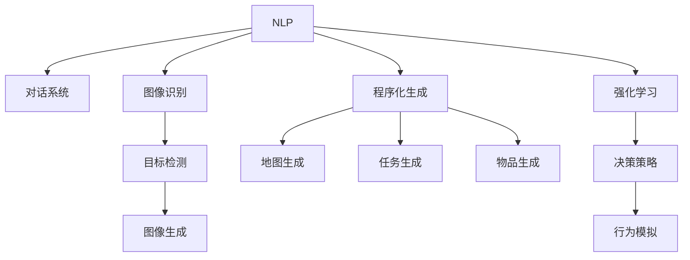

                 

# AI在游戏开发中的应用：从NPC到程序化生成

## 1. 背景介绍

### 1.1 问题由来

近年来，人工智能(AI)技术在游戏开发中的应用越来越广泛，从简单的NPC对话到复杂的生成式环境设计，AI为游戏开发者提供了更多的可能性和创意空间。在传统游戏开发中，每个NPC的对话、动作和环境生成都需要由开发者手动设计和编程，工作量巨大且易出错。随着AI技术的发展，特别是自然语言处理(NLP)、计算机视觉(CV)和生成对抗网络(GAN)等领域的突破，AI技术已经开始从后台工具逐渐走向前台，成为游戏设计的重要组成部分。

### 1.2 问题核心关键点

AI在游戏开发中的应用，主要集中在以下几个方面：

- **NPC对话生成**：通过AI技术实现NPC的自然语言对话，提升游戏世界的交互性和沉浸感。
- **角色行为模拟**：使用AI技术实现角色的行为决策，如行走、战斗等，提升游戏的逼真性和智能性。
- **环境生成与优化**：通过AI技术自动生成游戏环境，优化地图和场景，减少开发者工作量。
- **程序化生成**：利用AI技术实现地图、任务、物品等的程序化生成，提升游戏的可玩性和随机性。

## 2. 核心概念与联系

### 2.1 核心概念概述

为更好地理解AI在游戏开发中的应用，本节将介绍几个密切相关的核心概念：

- **自然语言处理(NLP)**：处理和理解人类语言的技术，包括文本分类、情感分析、对话系统等。
- **计算机视觉(CV)**：使计算机能够“看”懂图像和视频的技术，包括图像识别、目标检测、图像生成等。
- **生成对抗网络(GAN)**：一种生成模型，用于生成逼真、高质感的图像、音频、视频等。
- **程序化生成(Procedural Generation)**：使用算法自动生成游戏元素的技术，如地图、任务、物品等。
- **强化学习(RL)**：通过试错学习最优策略的技术，用于训练AI角色在复杂环境下的决策能力。

这些核心概念之间的逻辑关系可以通过以下Mermaid流程图来展示：



这个流程图展示了大语言模型在游戏开发中的核心概念及其之间的关系：

1. 自然语言处理提供对话、情感分析等能力。
2. 计算机视觉用于图像识别、目标检测、图像生成等。
3. 生成对抗网络用于生成高质感的视觉内容。
4. 程序化生成提供自动生成地图、任务、物品等功能。
5. 强化学习训练角色决策策略，提升AI智能性。

这些核心概念共同构成了AI在游戏开发中的应用框架，使得开发者能够高效地利用AI技术，提升游戏开发效率和游戏体验。

## 3. 核心算法原理 & 具体操作步骤

### 3.1 算法原理概述

AI在游戏开发中的应用，主要依赖于多种人工智能技术，如自然语言处理、计算机视觉、生成对抗网络和程序化生成等。这些技术相互配合，可以提升游戏的交互性、逼真性和随机性。

### 3.2 算法步骤详解

**Step 1: 选择AI技术**

根据具体需求，选择合适的AI技术。例如，需要生成自然语言对话时，可以使用GPT等语言模型；需要生成逼真场景时，可以使用GAN等生成模型；需要自动生成地图和物品时，可以使用程序化生成算法。

**Step 2: 数据准备**

收集和标注用于训练AI模型所需的数据集。例如，收集大量的对话语料，进行情感分析标注；使用标注好的图像数据训练图像生成模型；设计程序化生成算法所需的规则和约束条件。

**Step 3: 模型训练**

使用收集到的数据集训练AI模型。例如，使用监督学习训练NLP模型，使用对抗训练增强GAN模型的生成能力，使用强化学习优化角色的决策策略。

**Step 4: 集成与测试**

将训练好的AI模型集成到游戏中，进行功能测试和性能评估。例如，测试对话系统的流畅度和自然性，测试生成的图像和环境的逼真度，测试程序化生成元素的随机性和可玩性。

**Step 5: 迭代优化**

根据测试结果，对AI模型和游戏设计进行迭代优化。例如，调整对话系统的参数，优化生成的图像质量，改进程序化生成算法。

### 3.3 算法优缺点

AI在游戏开发中的应用，具有以下优点：

- **提高开发效率**：自动化生成游戏元素，减少手工设计的工作量，加快开发进程。
- **增强游戏体验**：提升游戏的交互性、逼真性和随机性，提升玩家沉浸感。
- **降低开发成本**：避免重复设计，降低游戏开发的成本。

同时，也存在一些缺点：

- **数据依赖性强**：AI模型的效果依赖于训练数据的数量和质量。
- **技术复杂度高**：AI技术的应用需要较强的技术积累和专业知识。
- **模型可解释性差**：部分AI模型（如GAN）的决策过程难以解释，难以调试和优化。
- **性能不稳定**：AI模型的性能受多种因素影响，如模型参数、训练数据、硬件环境等。

### 3.4 算法应用领域

AI在游戏开发中的应用，涉及多个领域，包括但不限于：

- **NPC对话系统**：通过NLP技术实现NPC的自然语言对话，提升游戏世界的交互性。
- **角色行为模拟**：使用RL技术训练角色的决策策略，提升游戏的智能性。
- **环境生成与优化**：使用GAN和程序化生成技术自动生成游戏环境，优化地图和场景。
- **任务与物品生成**：使用程序化生成算法随机生成任务和物品，增加游戏的随机性和可玩性。

## 4. 数学模型和公式 & 详细讲解 & 举例说明

### 4.1 数学模型构建

以下是几个核心AI模型和算法的基本数学模型构建：

**NLP对话系统模型**：
- 基于Transformer的NLP模型，如GPT-3，用于生成自然语言对话。
- 数学模型：$\hat{y}=f(x; \theta)=softmax(Wx+b)$，其中$x$为输入文本，$y$为输出概率分布，$W$和$b$为模型参数。

**GAN生成模型**：
- 生成对抗网络模型，由生成器和判别器组成。
- 数学模型：生成器$G(z)$将随机噪声$z$映射到图像$x$；判别器$D(x)$判断$x$是否为真实图像。目标函数为$V(D,G)=E_{x}logD(x)+E_{z}log(1-D(G(z)))$。

**程序化生成算法**：
- 如Perlin噪声算法，用于生成自然地图和地形。
- 数学模型：$P(x)=\sum_{i=1}^{n}p_i\cdot Perlin(x_i)$，其中$x$为生成位置，$x_i$为Perlin噪声函数参数，$p_i$为权重系数。

### 4.2 公式推导过程

**NLP对话系统公式推导**：
- 使用交叉熵损失函数：$\mathcal{L}=-\frac{1}{N}\sum_{i=1}^{N}y_i\log\hat{y_i}+(1-y_i)\log(1-\hat{y_i})$。
- 使用梯度下降优化算法，更新模型参数$\theta$。

**GAN生成模型公式推导**：
- 使用对抗损失函数：$V(D,G)=\frac{1}{N}\sum_{x\sim p_{data}}logD(x)+(1-D(G(z)))$。
- 使用梯度上升和梯度下降相结合的优化算法，交替训练生成器和判别器。

**程序化生成算法公式推导**：
- 使用线性插值公式：$P(x)=\sum_{i=1}^{n}p_i\cdot Perlin(x_i)$。
- 使用随机数生成器，生成随机噪声$z$，代入生成函数计算$x$。

### 4.3 案例分析与讲解

**案例1：NPC对话系统**

假设我们有一个简单的NPC对话系统，使用GPT-3模型生成对话。具体步骤如下：

1. 收集大量的对话语料，进行情感分析标注。
2. 使用GPT-3模型训练对话系统，输入“你好”，输出“欢迎光临”。
3. 将训练好的模型集成到游戏中，测试其对话的流畅度和自然性。

**案例2：GAN生成地图**

假设我们有一个游戏需要随机生成的地图，使用Perlin噪声算法和GAN生成地图。具体步骤如下：

1. 设计地图生成的规则和约束条件，如地形高度、水系分布等。
2. 使用Perlin噪声算法生成地形和建筑，进行初步渲染。
3. 使用GAN模型对生成的地图进行优化和增强，提升地图的逼真度。

**案例3：程序化生成物品**

假设我们有一个游戏需要随机生成的物品，使用程序化生成算法生成物品。具体步骤如下：

1. 设计物品生成的规则和约束条件，如物品属性、颜色、形状等。
2. 使用程序化生成算法生成随机物品，进行初步渲染。
3. 测试生成的物品的随机性和可玩性，根据测试结果优化算法参数。

## 5. 项目实践：代码实例和详细解释说明

### 5.1 开发环境搭建

在进行AI在游戏开发中的应用实践前，我们需要准备好开发环境。以下是使用Python进行PyTorch开发的环境配置流程：

1. 安装Anaconda：从官网下载并安装Anaconda，用于创建独立的Python环境。

2. 创建并激活虚拟环境：
```bash
conda create -n pytorch-env python=3.8 
conda activate pytorch-env
```

3. 安装PyTorch：根据CUDA版本，从官网获取对应的安装命令。例如：
```bash
conda install pytorch torchvision torchaudio cudatoolkit=11.1 -c pytorch -c conda-forge
```

4. 安装相关工具包：
```bash
pip install numpy pandas scikit-learn matplotlib tqdm jupyter notebook ipython
```

完成上述步骤后，即可在`pytorch-env`环境中开始AI在游戏开发中的应用实践。

### 5.2 源代码详细实现

这里我们以生成对抗网络(GAN)为例，给出使用PyTorch实现图像生成的完整代码实现。

```python
import torch
import torch.nn as nn
import torch.optim as optim
from torchvision.datasets import MNIST
from torchvision.transforms import ToTensor
from torch.utils.data import DataLoader

# 定义生成器和判别器
class Generator(nn.Module):
    def __init__(self):
        super(Generator, self).__init__()
        self.fc = nn.Linear(100, 256)
        self.conv1 = nn.Conv2d(256, 256, 4, 1, 0)
        self.conv2 = nn.Conv2d(256, 256, 4, 2, 1)
        self.conv3 = nn.Conv2d(256, 256, 4, 2, 1)
        self.conv4 = nn.Conv2d(256, 1, 4, 2, 1)
        
    def forward(self, x):
        x = self.fc(x)
        x = nn.functional.leaky_relu(self.conv1(x))
        x = nn.functional.leaky_relu(self.conv2(x))
        x = nn.functional.leaky_relu(self.conv3(x))
        x = torch.tanh(self.conv4(x))
        return x

class Discriminator(nn.Module):
    def __init__(self):
        super(Discriminator, self).__init__()
        self.conv1 = nn.Conv2d(1, 256, 4, 2, 1)
        self.conv2 = nn.Conv2d(256, 256, 4, 2, 1)
        self.conv3 = nn.Conv2d(256, 256, 4, 2, 1)
        self.fc = nn.Linear(256, 1)
        
    def forward(self, x):
        x = nn.functional.leaky_relu(self.conv1(x))
        x = nn.functional.leaky_relu(self.conv2(x))
        x = nn.functional.leaky_relu(self.conv3(x))
        x = self.fc(x)
        return x

# 加载数据集
mnist = MNIST(root='data', train=True, transform=ToTensor(), download=True)
train_loader = DataLoader(mnist, batch_size=128, shuffle=True)

# 定义模型和优化器
generator = Generator()
discriminator = Discriminator()
optimizer_G = optim.Adam(generator.parameters(), lr=0.0002, betas=(0.5, 0.999))
optimizer_D = optim.Adam(discriminator.parameters(), lr=0.0002, betas=(0.5, 0.999))

# 定义损失函数
criterion = nn.BCELoss()

# 定义训练函数
def train(epochs, device):
    device = torch.device('cuda')
    generator.to(device)
    discriminator.to(device)
    
    for epoch in range(epochs):
        for i, (images, _) in enumerate(train_loader):
            images = images.to(device)
            real_images = images
            real_labels = torch.ones(batch_size, 1).to(device)
            
            fake_images = generator(torch.randn(batch_size, 100, device=device))
            fake_labels = torch.zeros(batch_size, 1).to(device)
            
            # 更新判别器
            optimizer_D.zero_grad()
            real_outputs = discriminator(real_images)
            fake_outputs = discriminator(fake_images)
            real_loss = criterion(real_outputs, real_labels)
            fake_loss = criterion(fake_outputs, fake_labels)
            d_loss = real_loss + fake_loss
            d_loss.backward()
            optimizer_D.step()
            
            # 更新生成器
            optimizer_G.zero_grad()
            fake_outputs = discriminator(fake_images)
            g_loss = criterion(fake_outputs, real_labels)
            g_loss.backward()
            optimizer_G.step()
            
            if i % 100 == 0:
                print('Epoch [{}/{}], Step [{}/{}], D Loss: {:.4f}, G Loss: {:.4f}'
                      .format(epoch+1, epochs, i, len(train_loader), d_loss.item(), g_loss.item()))

# 启动训练
train(100, device)
```

### 5.3 代码解读与分析

让我们再详细解读一下关键代码的实现细节：

**GAN模型定义**：
- `Generator`和`Discriminator`类分别定义生成器和判别器模型，使用卷积神经网络(CNN)结构。
- 生成器模型接收随机噪声，通过多层卷积和激活函数生成逼真的图像。
- 判别器模型接收图像，通过多层卷积和激活函数判断图像的真实性。

**数据集加载**：
- `mnist`变量加载MNIST数据集，进行归一化和标准化。
- `train_loader`变量定义数据加载器，每次随机取出128个图像样本进行训练。

**模型和优化器定义**：
- `generator`和`discriminator`变量定义生成器和判别器模型。
- `optimizer_G`和`optimizer_D`变量定义生成器和判别器模型的优化器，使用Adam优化算法。
- `criterion`变量定义二分类交叉熵损失函数。

**训练函数定义**：
- `train`函数定义训练过程，每次迭代更新判别器和生成器的模型参数。
- 使用`real_images`和`fake_images`作为训练样本，`real_labels`和`fake_labels`作为训练标签。
- 交替更新判别器和生成器的模型参数，计算损失函数并反向传播。
- 每100次迭代输出一次训练过程中的损失函数值。

**启动训练**：
- 调用`train`函数，指定训练轮数和设备（GPU或CPU）。

可以看到，PyTorch提供了一套强大的框架，使得AI在游戏开发中的应用代码实现变得简单高效。开发者可以快速上手，进行模型训练和测试，加速开发进程。

## 6. 实际应用场景

### 6.1 NPC对话系统

在传统的游戏设计中，NPC的对话系统通常由脚本编写和手动配音完成，成本高、效率低。使用AI技术，可以实现NPC的自然语言对话，提升游戏的交互性和沉浸感。例如，NPC可以根据玩家的动作和对话历史，进行自然、连贯的回复。这不仅减少了开发工作量，还能提升玩家的体验感。

### 6.2 环境生成与优化

在大型开放世界游戏中，需要生成大量的地图和环境，手工设计成本巨大。使用程序化生成算法和GAN生成模型，可以实现自动生成地图和环境，提升游戏的丰富度和可玩性。例如，程序化生成算法可以根据地图规则和约束条件，生成随机但合理的地图地形，GAN模型可以生成逼真、高质感的建筑物和装饰物，提升游戏的视觉体验。

### 6.3 程序化生成物品

在游戏设计中，需要大量随机生成物品，手工设计复杂且耗时。使用程序化生成算法，可以自动生成各种物品，提升游戏的随机性和可玩性。例如，程序化生成算法可以根据物品属性、颜色、形状等规则，生成随机但合理的物品，满足不同场景的需求。

### 6.4 未来应用展望

随着AI技术的发展，AI在游戏开发中的应用将不断扩展，带来更多创新的游戏体验。未来，AI技术可能会在以下几个方面进一步突破：

- **情感计算**：通过NLP技术，实现情感识别和情感生成，提升游戏的互动性和代入感。
- **角色智能**：使用RL技术，训练角色的智能行为，提升游戏的挑战性和复杂度。
- **动态生成**：使用程序化生成和GAN技术，实现动态生成的地图、物品和任务，提升游戏的可玩性和随机性。
- **跨平台体验**：通过AI技术，实现游戏内容的跨平台适配，提升游戏的用户体验。

## 7. 工具和资源推荐

### 7.1 学习资源推荐

为了帮助开发者系统掌握AI在游戏开发中的应用，这里推荐一些优质的学习资源：

1. **《深度学习游戏开发》系列博文**：由AI游戏开发专家撰写，深入浅出地介绍了AI在游戏开发中的应用范式和技术要点。

2. **CS565《深度学习游戏》课程**：斯坦福大学开设的AI游戏开发课程，有Lecture视频和配套作业，带你入门AI游戏开发的基本概念和经典模型。

3. **《Python游戏编程》书籍**：全面介绍使用Python进行游戏编程的技术，包括AI、NLP、CV等在内的多种技术。

4. **PyTorch官方文档**：PyTorch框架的官方文档，提供了大量的AI模型和算法的实现代码，是AI游戏开发的重要工具。

5. **Unity AI插件**：Unity官方提供的AI插件，支持多种AI技术的实现，包括NPC对话、角色行为模拟等。

通过对这些资源的学习实践，相信你一定能够快速掌握AI在游戏开发中的应用，并用于解决实际的游戏问题。

### 7.2 开发工具推荐

高效的开发离不开优秀的工具支持。以下是几款用于AI在游戏开发中的应用开发的常用工具：

1. **PyTorch**：基于Python的开源深度学习框架，灵活动态的计算图，适合快速迭代研究。大部分AI游戏开发相关的模型都有PyTorch版本的实现。

2. **TensorFlow**：由Google主导开发的开源深度学习框架，生产部署方便，适合大规模工程应用。同样有丰富的AI游戏开发相关的模型资源。

3. **Unity**：一款广泛使用的游戏引擎，支持多种AI技术的实现，包括NPC对话、环境生成等。

4. **Blender**：一款强大的3D建模软件，支持基于AI的生成式建模和环境优化。

5. **Unreal Engine**：一款高性能的游戏引擎，支持多种AI技术的实现，包括动态生成和程序化生成等。

合理利用这些工具，可以显著提升AI在游戏开发中的应用开发效率，加快创新迭代的步伐。

### 7.3 相关论文推荐

AI在游戏开发中的应用源于学界的持续研究。以下是几篇奠基性的相关论文，推荐阅读：

1. **《Deep Generative Adversarial Networks for Game Design》**：提出使用GAN生成逼真游戏环境的思路，为游戏开发提供了新的方向。

2. **《Procedural Content Generation for Games》**：详细介绍了程序化生成算法在游戏设计中的应用，包括地图生成、物品生成等。

3. **《Dialogue Systems for Games》**：介绍了NLP技术在游戏对话系统中的应用，包括情感分析、对话生成等。

4. **《AI and Machine Learning in Game Development》**：总结了AI和机器学习在游戏开发中的最新应用，包括NPC行为模拟、动态生成等。

这些论文代表了大语言模型在游戏开发中的应用发展脉络。通过学习这些前沿成果，可以帮助研究者把握学科前进方向，激发更多的创新灵感。

## 8. 总结：未来发展趋势与挑战

### 8.1 总结

本文对AI在游戏开发中的应用进行了全面系统的介绍。首先阐述了AI技术在游戏开发中的应用背景和意义，明确了AI在游戏开发中的独特价值。其次，从原理到实践，详细讲解了NLP、CV、GAN等核心AI技术在游戏开发中的具体应用，给出了AI在游戏开发中的应用实践代码实例。同时，本文还广泛探讨了AI在游戏开发中的实际应用场景，展示了AI技术在游戏开发中的巨大潜力。最后，本文精选了AI在游戏开发中的应用学习资源，力求为开发者提供全方位的技术指引。

通过本文的系统梳理，可以看到，AI技术在游戏开发中的应用已经成为游戏开发的重要范式，极大地拓展了游戏开发的可能性，提升了游戏的互动性、逼真性和可玩性。未来，伴随AI技术的不断发展，AI在游戏开发中的应用将不断深化，带来更多创新的游戏体验。

### 8.2 未来发展趋势

展望未来，AI在游戏开发中的应用将呈现以下几个发展趋势：

1. **AI技术多样化**：未来将会有更多AI技术在游戏开发中得到应用，如情感计算、角色智能等，提升游戏的互动性和智能性。

2. **游戏体验个性化**：通过AI技术，实现根据玩家行为和偏好动态调整游戏内容和难度，提升游戏体验的个性化和可玩性。

3. **跨平台适配**：使用AI技术，实现游戏内容的跨平台适配，提升游戏用户体验。

4. **实时动态生成**：使用程序化生成和GAN技术，实现实时动态生成的地图、物品和任务，提升游戏的随机性和可玩性。

5. **AI与游戏设计结合**：将AI技术与游戏设计相结合，提升游戏的创新性和趣味性。

以上趋势凸显了AI在游戏开发中的应用前景。这些方向的探索发展，必将进一步提升游戏开发的效率和体验，为玩家带来全新的游戏体验。

### 8.3 面临的挑战

尽管AI在游戏开发中的应用已经取得了瞩目成就，但在迈向更加智能化、普适化应用的过程中，它仍面临诸多挑战：

1. **技术复杂度高**：AI技术的应用需要较强的技术积累和专业知识，开发者需要具备丰富的AI知识。

2. **性能不稳定**：AI模型的性能受多种因素影响，如模型参数、训练数据、硬件环境等，可能导致性能不稳定。

3. **成本高昂**：AI技术的实现需要大量的计算资源和时间，开发成本较高。

4. **可解释性差**：部分AI模型（如GAN）的决策过程难以解释，难以调试和优化。

5. **伦理和隐私问题**：AI技术在游戏中的应用可能涉及数据隐私和伦理问题，需要谨慎处理。

6. **法律和规范问题**：AI技术在游戏中的应用可能涉及法律和规范问题，需要合规处理。

正视AI在游戏开发中的应用所面临的这些挑战，积极应对并寻求突破，将是大语言模型在游戏开发中走向成熟的必由之路。相信随着学界和产业界的共同努力，这些挑战终将一一被克服，AI在游戏开发中的应用必将在构建人机协同的智能时代中扮演越来越重要的角色。

### 8.4 研究展望

面向未来，AI在游戏开发中的应用需要不断创新和突破：

1. **AI与游戏设计的融合**：将AI技术与游戏设计相结合，提升游戏的创新性和趣味性。

2. **跨平台体验的提升**：通过AI技术，实现游戏内容的跨平台适配，提升游戏用户体验。

3. **AI技术的普及**：降低AI技术的应用门槛，推广AI技术在游戏开发中的应用。

4. **实时动态生成的优化**：优化程序化生成和GAN技术的性能，实现实时动态生成的地图、物品和任务，提升游戏的随机性和可玩性。

5. **可解释性和透明度的提升**：提高AI模型的可解释性和透明度，提升AI技术的可信度和可控性。

这些研究方向的探索，必将引领AI在游戏开发中的应用技术迈向更高的台阶，为构建安全、可靠、可解释、可控的智能系统铺平道路。面向未来，AI在游戏开发中的应用还需要与其他AI技术进行更深入的融合，如知识表示、因果推理、强化学习等，多路径协同发力，共同推动游戏开发的进步。

## 9. 附录：常见问题与解答

**Q1：AI在游戏开发中的应用是否适用于所有类型的游戏？**

A: AI在游戏开发中的应用，在各种类型的游戏中都有应用场景。但对于一些需要精确控制和高度复杂性的游戏，如赛车、飞行模拟等，AI技术的应用可能有限。开发者需要根据具体需求，灵活选择AI技术的应用。

**Q2：如何平衡AI技术与传统游戏设计？**

A: 在AI技术的应用过程中，需要平衡AI技术与传统游戏设计的结合。通常，可以从以下几方面入手：
1. 将AI技术应用于辅助决策和模拟，而不是完全取代人工设计。
2. 结合AI技术和传统游戏设计，提升游戏的互动性和智能性，增强游戏的可玩性。
3. 对AI技术的应用进行多次迭代和优化，逐步提升AI技术的精度和可靠性。

**Q3：AI在游戏开发中的应用是否会降低游戏的自由度？**

A: AI技术的应用可能会降低游戏的自由度，尤其是在动态生成和程序化生成过程中。为了确保游戏体验的丰富性和多样性，可以结合用户行为和偏好，动态调整游戏内容，提升游戏的可玩性。同时，游戏设计者需要保证游戏的整体框架和核心玩法不受AI技术的影响。

**Q4：AI在游戏开发中的应用是否会带来新的开发成本？**

A: AI技术在游戏开发中的应用可能会带来一定的开发成本，包括计算资源、算法实现和优化等方面的投入。但长期来看，AI技术的应用可以大幅降低游戏开发和维护的成本，提升游戏的可玩性和用户体验。

**Q5：AI在游戏开发中的应用是否会影响游戏的商业化？**

A: AI技术在游戏开发中的应用可以提升游戏的可玩性和用户体验，从而提升游戏的商业价值。但过度依赖AI技术可能会影响游戏的独特性和创新性，降低玩家的购买意愿。因此，需要根据游戏的特点，灵活应用AI技术，平衡技术创新与商业价值。

---

作者：禅与计算机程序设计艺术 / Zen and the Art of Computer Programming

