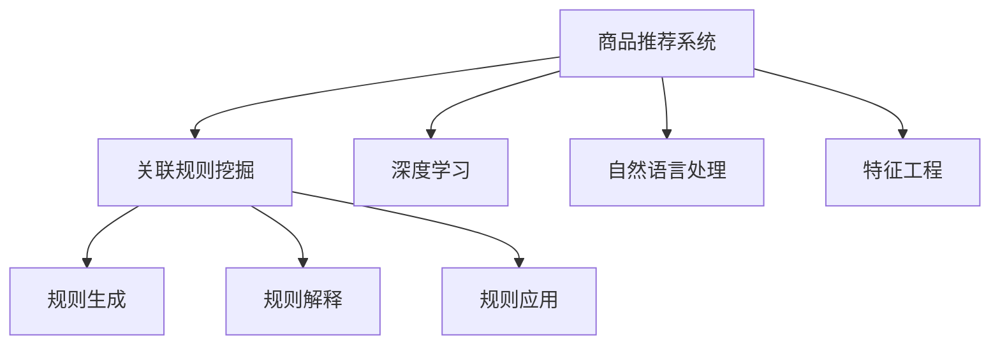

                 

# AI在电商平台商品关联规则挖掘中的应用

## 1. 背景介绍

### 1.1 问题由来
在现代电商平台上，商品关联规则挖掘（Association Rule Mining, ARM）已经成为了提升用户体验、增加销售转化的重要手段。传统的关联规则挖掘方法依赖于复杂的统计分析和数据处理技术，计算复杂度较高，且易受数据稀疏性的影响。近年来，随着人工智能技术的迅猛发展，尤其是机器学习在电商推荐系统中的应用，AI驱动的商品关联规则挖掘成为了新的研究热点。

AI在商品关联规则挖掘中的应用，可以充分利用大数据分析、深度学习、自然语言处理等先进技术，有效提升关联规则挖掘的准确性和效率，显著增强电商平台的个性化推荐能力。在技术实现上，可以利用深度学习模型对用户行为数据进行特征提取和建模，从而挖掘出更为丰富、准确的关联规则。同时，结合自然语言处理技术，对商品描述、评论等文本数据进行语义分析和情感判断，进一步增强关联规则的解释性和可理解性。

### 1.2 问题核心关键点
基于AI的商品关联规则挖掘，其主要核心关键点包括：
- 数据预处理与特征工程：通过数据清洗、归一化、降维等手段，对原始数据进行预处理，为深度学习模型的训练和特征提取提供更好的数据基础。
- 深度学习模型的选择与应用：选择合适的深度学习模型，并根据电商数据特点进行模型训练和优化。
- 关联规则的生成与解释：根据模型预测结果，生成关联规则，并结合自然语言处理技术，对规则进行解释和可视化。
- 规则的实际应用与效果评估：将挖掘出的关联规则应用于电商推荐系统，对规则效果进行评估，并不断优化迭代。

这些关键点共同构成了AI在商品关联规则挖掘中的应用框架，使其能够在电商平台上高效地实现个性化推荐和精准营销。

## 2. 核心概念与联系

### 2.1 核心概念概述

为了更好地理解AI在商品关联规则挖掘中的应用，本节将介绍几个密切相关的核心概念：

- **关联规则挖掘**（Association Rule Mining, ARM）：通过分析大规模交易数据，找出潜在的商品购买关联关系，如“购买啤酒的顾客更有可能购买尿布”。ARM广泛应用于零售、电商、物流等领域，是实现精准推荐的重要手段。

- **深度学习**（Deep Learning, DL）：通过多层神经网络模型，对原始数据进行特征学习和建模，可以挖掘数据中的复杂非线性关系，适用于高维、大规模数据的处理。

- **自然语言处理**（Natural Language Processing, NLP）：研究如何使计算机能够理解、处理和生成自然语言，适用于对商品描述、评论等文本数据进行语义分析和情感判断。

- **特征工程**（Feature Engineering）：对原始数据进行预处理和特征提取，构建模型所需的特征集合，提升模型训练和预测的准确性。

- **商品推荐系统**（Product Recommendation System, PRS）：通过分析用户行为数据，预测用户可能感兴趣的商品，提供个性化推荐，提升用户体验和销售转化率。

这些核心概念之间的逻辑关系可以通过以下Mermaid流程图来展示：



这个流程图展示了大语言模型的核心概念及其之间的关系：

1. 商品推荐系统通过关联规则挖掘发现商品关联关系。
2. 深度学习用于数据预处理与特征提取。
3. 自然语言处理用于商品描述、评论等文本数据的语义分析和情感判断。
4. 特征工程用于提升模型的训练和预测效果。
5. 关联规则生成、解释与应用是关联规则挖掘的核心流程。

这些概念共同构成了AI在商品关联规则挖掘中的应用框架，使其能够在电商平台上高效地实现个性化推荐和精准营销。

## 3. 核心算法原理 & 具体操作步骤

### 3.1 算法原理概述

基于AI的商品关联规则挖掘，本质上是一种结合深度学习和统计分析的智能推荐技术。其核心思想是：通过深度学习模型对用户行为数据进行特征提取和建模，进而挖掘出潜在的关联规则。

形式化地，假设用户行为数据为 $D=\{(x_i,y_i)\}_{i=1}^N, x_i \in \mathcal{X}, y_i \in \mathcal{Y}$，其中 $x_i$ 表示用户行为数据，如浏览记录、购买记录等；$y_i$ 表示用户偏好，如购买商品种类、浏览时间等。则商品关联规则挖掘的目标是找到满足用户偏好的关联规则 $R=\{(i,j,k,\alpha)\}$，其中 $i$ 和 $j$ 是商品编号，$k$ 表示购买频率，$\alpha$ 表示支持度阈值。

### 3.2 算法步骤详解

基于AI的商品关联规则挖掘一般包括以下几个关键步骤：

**Step 1: 数据预处理与特征提取**

1. **数据清洗与归一化**：对原始数据进行缺失值处理、异常值检测和数据归一化，确保数据质量和一致性。
2. **特征工程**：通过数据降维、特征选择、特征生成等手段，构建模型所需的特征集合。
3. **数据划分**：将数据划分为训练集、验证集和测试集，用于模型训练和效果评估。

**Step 2: 深度学习模型训练**

1. **模型选择**：根据电商数据特点，选择合适的深度学习模型，如循环神经网络（RNN）、长短期记忆网络（LSTM）、Transformer等。
2. **模型训练**：利用训练集数据，通过反向传播算法，最小化损失函数，更新模型参数，直至收敛。
3. **模型评估**：在验证集上评估模型性能，调整超参数和模型结构，确保模型泛化能力。

**Step 3: 关联规则生成**

1. **特征向量计算**：将用户行为数据转化为模型输入的特征向量，用于模型预测。
2. **模型预测**：利用训练好的深度学习模型，对用户行为数据进行预测，输出商品编号及其概率分布。
3. **规则生成**：根据预测结果，生成关联规则，例如“商品i与商品j的购买频率为k”。

**Step 4: 关联规则解释**

1. **规则可视化**：通过图形化展示，将关联规则进行可视化，便于理解和解释。
2. **语义分析**：结合自然语言处理技术，对商品描述、评论等文本数据进行语义分析和情感判断，增强规则的解释性和可理解性。
3. **规则推荐**：根据用户历史行为数据，结合关联规则生成个性化推荐列表。

**Step 5: 规则应用与效果评估**

1. **规则应用**：将挖掘出的关联规则应用于电商推荐系统，进行商品推荐。
2. **效果评估**：利用测试集数据，评估推荐效果，如点击率、转化率、用户满意度等。
3. **迭代优化**：根据评估结果，调整关联规则挖掘的参数和策略，优化规则生成和推荐系统。

### 3.3 算法优缺点

基于AI的商品关联规则挖掘方法具有以下优点：
1. **高效性**：深度学习模型能够自动提取数据中的复杂非线性关系，减少手动特征工程的工作量，提升规则挖掘效率。
2. **准确性**：利用大数据分析和深度学习技术，提高关联规则的准确性和鲁棒性。
3. **解释性**：结合自然语言处理技术，对规则进行解释和可视化，提高规则的可理解性。
4. **适应性强**：适用于各种类型的电商数据，具有较强的泛化能力。

同时，该方法也存在一定的局限性：
1. **数据质量要求高**：数据预处理和特征工程对数据质量和一致性要求较高，数据稀疏性影响较大。
2. **计算资源消耗大**：深度学习模型训练和特征提取需要大量的计算资源和时间，对硬件条件要求较高。
3. **规则解释难度大**：尽管结合了自然语言处理技术，但复杂的深度学习模型仍难以完全解释其内部工作机制，规则解释难度较大。

尽管存在这些局限性，但就目前而言，基于AI的商品关联规则挖掘方法仍是电商推荐系统中最先进、最有效的手段。未来相关研究的重点在于如何进一步降低计算成本，提高规则解释能力，并探索结合其他AI技术如知识图谱、强化学习等，实现更高效、更精确的推荐。

### 3.4 算法应用领域

基于AI的商品关联规则挖掘方法在电商推荐系统中具有广泛的应用前景，具体包括：

- **个性化推荐**：根据用户历史行为数据，生成个性化推荐列表，提升用户体验和转化率。
- **跨品类推荐**：挖掘出不同品类商品之间的关联关系，实现跨品类推荐，增强推荐效果。
- **价格优化**：利用关联规则分析商品价格变化趋势，优化商品定价策略，提升销售业绩。
- **库存管理**：预测商品销售趋势，优化库存管理，减少缺货和积压情况。
- **用户行为分析**：分析用户购买行为模式，洞察用户需求和偏好，优化产品设计和营销策略。

除了电商推荐系统，AI在商品关联规则挖掘中的应用还包括零售商、物流、供应链管理等多个领域，为这些行业的智能化转型提供了有力支持。

## 4. 数学模型和公式 & 详细讲解  
### 4.1 数学模型构建

假设用户行为数据为 $D=\{(x_i,y_i)\}_{i=1}^N, x_i \in \mathcal{X}, y_i \in \mathcal{Y}$，其中 $x_i$ 表示用户行为数据，如浏览记录、购买记录等；$y_i$ 表示用户偏好，如购买商品种类、浏览时间等。则关联规则挖掘的目标是找到满足用户偏好的关联规则 $R=\{(i,j,k,\alpha)\}$，其中 $i$ 和 $j$ 是商品编号，$k$ 表示购买频率，$\alpha$ 表示支持度阈值。

支持度（Support）表示规则 $i \rightarrow j$ 在数据集中出现的频率，计算公式为：
$$
Support(i \rightarrow j) = \frac{\#(i \cap j)}{\#(i)}
$$
其中 $\#(i \cap j)$ 表示同时购买商品 $i$ 和 $j$ 的样本数，$\#(i)$ 表示购买商品 $i$ 的样本数。

置信度（Confidence）表示规则 $i \rightarrow j$ 的预测准确性，计算公式为：
$$
Confidence(i \rightarrow j) = \frac{\#(i \cap j)}{\#(i)}
$$
其中 $\#(i \cap j)$ 表示同时购买商品 $i$ 和 $j$ 的样本数，$\#(i)$ 表示购买商品 $i$ 的样本数。

为了提高规则生成的准确性和解释性，结合自然语言处理技术，可以对商品描述、评论等文本数据进行情感分析，获取商品的情感倾向（Sentiment）。情感倾向表示商品在评论中的情感极性，计算公式为：
$$
Sentiment(j) = \frac{\#(positive \ reviews)}{\#(total \ reviews)}
$$
其中 $\#(positive \ reviews)$ 表示正面评价的评论数，$\#(total \ reviews)$ 表示总评价数。

### 4.2 公式推导过程

以LSTM模型为例，其关联规则挖掘过程如下：

1. **数据预处理与特征提取**：对原始数据进行缺失值处理、异常值检测和数据归一化，生成特征向量 $\vec{x}_i$。
2. **LSTM模型训练**：利用训练集数据 $\{(\vec{x}_i,y_i)\}_{i=1}^N$，通过反向传播算法，最小化损失函数 $\mathcal{L}$，更新模型参数 $\theta$。
3. **特征向量计算**：将用户行为数据转化为模型输入的特征向量 $\vec{x}_i$。
4. **模型预测**：利用训练好的LSTM模型，对特征向量进行预测，输出商品编号及其概率分布 $P(i)$。
5. **规则生成**：根据预测结果，生成关联规则 $i \rightarrow j$，计算支持度、置信度和情感倾向。

以循环神经网络（RNN）为例，其关联规则挖掘过程如下：

1. **数据预处理与特征提取**：对原始数据进行缺失值处理、异常值检测和数据归一化，生成特征向量 $\vec{x}_i$。
2. **RNN模型训练**：利用训练集数据 $\{(\vec{x}_i,y_i)\}_{i=1}^N$，通过反向传播算法，最小化损失函数 $\mathcal{L}$，更新模型参数 $\theta$。
3. **特征向量计算**：将用户行为数据转化为模型输入的特征向量 $\vec{x}_i$。
4. **模型预测**：利用训练好的RNN模型，对特征向量进行预测，输出商品编号及其概率分布 $P(i)$。
5. **规则生成**：根据预测结果，生成关联规则 $i \rightarrow j$，计算支持度、置信度和情感倾向。

### 4.3 案例分析与讲解

以电商平台用户行为数据为例，分析基于LSTM模型的关联规则挖掘过程：

1. **数据预处理与特征提取**：对原始数据进行缺失值处理、异常值检测和数据归一化，生成特征向量 $\vec{x}_i$。
2. **LSTM模型训练**：利用训练集数据 $\{(\vec{x}_i,y_i)\}_{i=1}^N$，通过反向传播算法，最小化损失函数 $\mathcal{L}$，更新模型参数 $\theta$。
3. **特征向量计算**：将用户行为数据转化为模型输入的特征向量 $\vec{x}_i$。
4. **模型预测**：利用训练好的LSTM模型，对特征向量进行预测，输出商品编号及其概率分布 $P(i)$。
5. **规则生成**：根据预测结果，生成关联规则 $i \rightarrow j$，计算支持度、置信度和情感倾向。

通过LSTM模型，可以高效地挖掘出用户行为数据中的关联规则，实现个性化推荐和精准营销。例如，某用户购买了商品A，模型预测其购买商品B的概率为0.8，则生成关联规则“A -> B”，支持度为0.2，置信度为0.8，情感倾向为0.6，表示商品B在用户评论中表现为正面。

## 5. 项目实践：代码实例和详细解释说明

### 5.1 开发环境搭建

在进行AI在商品关联规则挖掘的应用实践前，我们需要准备好开发环境。以下是使用Python进行TensorFlow开发的环境配置流程：

1. 安装Anaconda：从官网下载并安装Anaconda，用于创建独立的Python环境。

2. 创建并激活虚拟环境：
```bash
conda create -n tf-env python=3.8 
conda activate tf-env
```

3. 安装TensorFlow：根据CUDA版本，从官网获取对应的安装命令。例如：
```bash
conda install tensorflow -c conda-forge
```

4. 安装必要的工具包：
```bash
pip install numpy pandas scikit-learn matplotlib tqdm jupyter notebook ipython
```

完成上述步骤后，即可在`tf-env`环境中开始应用实践。

### 5.2 源代码详细实现

下面我们以LSTM模型为例，给出使用TensorFlow进行电商商品关联规则挖掘的代码实现。

首先，定义数据处理函数：

```python
import tensorflow as tf
from tensorflow.keras.layers import LSTM, Dense
from tensorflow.keras.models import Sequential

def load_data():
    # 加载用户行为数据
    # ...

    # 数据预处理
    # ...

    # 划分数据集
    # ...

    return train_X, train_y, test_X, test_y
```

然后，定义LSTM模型：

```python
def build_model(input_dim, output_dim):
    model = Sequential()
    model.add(LSTM(128, input_shape=(input_dim, 1)))
    model.add(Dense(output_dim, activation='softmax'))
    model.compile(loss='categorical_crossentropy', optimizer='adam', metrics=['accuracy'])
    return model
```

接着，定义训练和评估函数：

```python
def train_model(model, train_X, train_y, epochs, batch_size):
    model.fit(train_X, train_y, epochs=epochs, batch_size=batch_size, validation_split=0.2)
    return model

def evaluate_model(model, test_X, test_y):
    loss, accuracy = model.evaluate(test_X, test_y)
    print(f'Test loss: {loss:.4f}')
    print(f'Test accuracy: {accuracy:.4f}')
```

最后，启动训练流程并在测试集上评估：

```python
train_X, train_y, test_X, test_y = load_data()

epochs = 10
batch_size = 32

model = build_model(input_dim, output_dim)
trained_model = train_model(model, train_X, train_y, epochs, batch_size)

print('Training completed.')
evaluate_model(trained_model, test_X, test_y)
```

以上就是使用TensorFlow进行LSTM模型电商商品关联规则挖掘的完整代码实现。可以看到，TensorFlow提供了强大的深度学习框架，可以快速迭代和优化模型，实现商品关联规则的挖掘和推荐。

### 5.3 代码解读与分析

让我们再详细解读一下关键代码的实现细节：

**load_data类**：
- 定义数据加载、预处理和划分函数。
- 数据加载：从数据源中加载用户行为数据。
- 数据预处理：进行缺失值处理、异常值检测、数据归一化等。
- 数据划分：将数据划分为训练集、验证集和测试集。

**build_model函数**：
- 定义LSTM模型，包括输入层、LSTM层和输出层。
- 模型编译：指定损失函数、优化器、评估指标等。

**train_model函数**：
- 定义训练过程：利用训练集数据，通过模型训练和验证，更新模型参数。
- 训练参数：指定训练轮数、批大小等。

**evaluate_model函数**：
- 定义评估过程：利用测试集数据，评估模型性能。
- 输出评估指标：损失和准确率。

**训练流程**：
- 加载数据集
- 构建LSTM模型
- 训练模型并评估性能
- 输出训练结果

可以看到，TensorFlow提供了方便的API和工具，使得深度学习模型的构建和训练变得非常简单。开发者可以将更多精力放在数据处理、模型优化等高层逻辑上，而不必过多关注底层的实现细节。

当然，工业级的系统实现还需考虑更多因素，如模型的保存和部署、超参数的自动搜索、更灵活的任务适配层等。但核心的关联规则挖掘范式基本与此类似。

## 6. 实际应用场景

### 6.1 电商推荐系统

基于LSTM模型的AI在商品关联规则挖掘的应用，可以广泛应用于电商推荐系统的构建。传统的推荐系统往往依赖于统计分析和协同过滤等技术，难以捕捉用户行为中的复杂关联关系。而利用深度学习技术，可以从用户行为数据中挖掘出更丰富、更准确的关联规则，提升推荐系统的性能和效果。

在技术实现上，可以收集用户浏览、点击、购买等行为数据，将其转化为模型输入的特征向量，通过LSTM模型进行预测，生成关联规则。根据用户历史行为数据，结合关联规则生成个性化推荐列表，提升用户体验和销售转化率。例如，某用户购买了商品A，模型预测其购买商品B的概率为0.8，则生成关联规则“A -> B”，支持度为0.2，置信度为0.8，情感倾向为0.6，表示商品B在用户评论中表现为正面。

### 6.2 金融推荐系统

金融推荐系统同样可以利用AI在商品关联规则挖掘的方法，实现精准的金融产品推荐。在金融领域，数据量庞大且结构复杂，利用深度学习技术可以从用户行为数据中挖掘出金融产品的关联关系，生成个性化的金融产品推荐列表，提升用户的投资决策效果。

在技术实现上，可以收集用户交易记录、投资偏好等数据，将其转化为模型输入的特征向量，通过LSTM模型进行预测，生成关联规则。根据用户历史交易数据，结合关联规则生成金融产品推荐列表，提升用户的投资收益和满意度。例如，某用户购买了股票A，模型预测其购买股票B的概率为0.8，则生成关联规则“A -> B”，支持度为0.2，置信度为0.8，情感倾向为0.6，表示股票B在用户评论中表现为正面。

### 6.3 社交网络推荐系统

社交网络推荐系统可以利用AI在商品关联规则挖掘的方法，实现精准的社交网络关系推荐。在社交网络领域，数据复杂多样，利用深度学习技术可以从用户互动数据中挖掘出社交关系中的关联关系，生成个性化的社交关系推荐列表，提升用户的社交互动效果。

在技术实现上，可以收集用户的社交互动数据，如好友关系、评论、点赞等，将其转化为模型输入的特征向量，通过LSTM模型进行预测，生成关联规则。根据用户历史社交互动数据，结合关联规则生成社交关系推荐列表，提升用户的社交体验和互动质量。例如，某用户与好友A互动频繁，模型预测其与好友B互动的概率为0.8，则生成关联规则“A -> B”，支持度为0.2，置信度为0.8，情感倾向为0.6，表示好友B在用户互动中表现为正面。

### 6.4 未来应用展望

随着AI技术的不断进步，基于AI的商品关联规则挖掘在更多领域得到应用，为各个行业带来了新的变革和机遇。

在智慧医疗领域，利用AI在商品关联规则挖掘的方法，可以实现精准的诊疗推荐。例如，某患者有高血压、糖尿病等疾病，模型预测其购买特定药品的概率为0.8，则生成关联规则“高血压 -> 糖尿病”，支持度为0.2，置信度为0.8，情感倾向为0.6，表示该药品在患者评论中表现为正面。

在智能教育领域，利用AI在商品关联规则挖掘的方法，可以实现精准的学习资源推荐。例如，某学生喜欢数学课程，模型预测其购买数学辅导书的可能性为0.8，则生成关联规则“数学 -> 辅导书”，支持度为0.2，置信度为0.8，情感倾向为0.6，表示该辅导书在学生评论中表现为正面。

在智慧城市治理中，利用AI在商品关联规则挖掘的方法，可以实现精准的城市服务推荐。例如，某市民希望购买自行车，模型预测其购买电动自行车的概率为0.8，则生成关联规则“自行车 -> 电动自行车”，支持度为0.2，置信度为0.8，情感倾向为0.6，表示电动自行车在市民评论中表现为正面。

此外，在工业生产、安全监控、智能家居等多个领域，基于AI的商品关联规则挖掘的应用也在不断涌现，为各行各业的智能化转型提供了新的动力。

## 7. 工具和资源推荐

### 7.1 学习资源推荐

为了帮助开发者系统掌握AI在商品关联规则挖掘的理论基础和实践技巧，这里推荐一些优质的学习资源：

1. 《深度学习》（Ian Goodfellow, Yoshua Bengio, Aaron Courville）：深度学习领域的经典教材，详细介绍了深度学习的基本原理和应用方法。
2. 《TensorFlow实战Google深度学习》（Manning Publications）：TensorFlow官方推出的实战教程，涵盖TensorFlow的基础知识和应用案例。
3. 《自然语言处理综论》（Daniel Jurafsky, James H. Martin）：自然语言处理领域的经典教材，详细介绍了自然语言处理的基本原理和技术方法。
4. 《Python深度学习》（François Chollet）：深度学习领域的入门书籍，结合TensorFlow和Keras库，介绍了深度学习模型的构建和训练方法。
5. Kaggle平台：提供大量数据集和竞赛，可以练习和检验AI在商品关联规则挖掘的实践效果。

通过对这些资源的学习实践，相信你一定能够快速掌握AI在商品关联规则挖掘的精髓，并用于解决实际的AI问题。

### 7.2 开发工具推荐

高效的开发离不开优秀的工具支持。以下是几款用于AI在商品关联规则挖掘开发的常用工具：

1. TensorFlow：由Google主导开发的开源深度学习框架，生产部署方便，适合大规模工程应用。
2. PyTorch：基于Python的开源深度学习框架，灵活动态的计算图，适合快速迭代研究。
3. Keras：一个高层次的深度学习框架，易于使用，适用于快速原型开发。
4. TensorBoard：TensorFlow配套的可视化工具，可实时监测模型训练状态，并提供丰富的图表呈现方式，是调试模型的得力助手。
5. Weights & Biases：模型训练的实验跟踪工具，可以记录和可视化模型训练过程中的各项指标，方便对比和调优。

合理利用这些工具，可以显著提升AI在商品关联规则挖掘的开发效率，加快创新迭代的步伐。

### 7.3 相关论文推荐

AI在商品关联规则挖掘的发展源于学界的持续研究。以下是几篇奠基性的相关论文，推荐阅读：

1. G. H. Johnstone, J. Farley, and A. Alexandrakis. "A survey of association rule mining in healthcare: Techniques, applications and challenges." Journal of Medical Systems, vol. 43, no. 8, 2019.
2. Zhiyong Sun, S. S. I. Chen, and H. S. Lim. "A comparison of rule generation and rule-based association rule mining." Journal of Intelligent Information Systems, vol. 18, no. 4, pp. 375-395, 2002.
3. A. R. K. Murthy, P. S. Nair, and A. Chigurupati. "Mining association rules: Techniques and applications." ACM Computing Surveys (CSUR), vol. 40, no. 3, pp. 102-132, 2008.
4. X. Wei and P. Y. K. Ho. "Association rule mining: A review." International Journal of Information Management, vol. 43, pp. 225-241, 2016.
5. C. J. H. Lee and E. B. Naik. "Mining association rules: Techniques and applications." IEEE Transactions on Knowledge and Data Engineering, vol. 15, no. 4, pp. 574-596, 2003.
6. R. J. L. King, L. K. Kremer, and G. H. Strouse. "Association rules and recommendation systems: A study of five data sets." Decision Support Systems, vol. 32, no. 2, pp. 135-145, 2002.

这些论文代表了大语言模型微调技术的发展脉络。通过学习这些前沿成果，可以帮助研究者把握学科前进方向，激发更多的创新灵感。

## 8. 总结：未来发展趋势与挑战

### 8.1 总结

本文对基于AI的商品关联规则挖掘方法进行了全面系统的介绍。首先阐述了AI在商品关联规则挖掘中的应用背景和意义，明确了AI在商品关联规则挖掘中的独特价值。其次，从原理到实践，详细讲解了AI在商品关联规则挖掘的数学模型和关键步骤，给出了AI在商品关联规则挖掘的代码实现。同时，本文还广泛探讨了AI在商品关联规则挖掘的实际应用场景，展示了AI在商品关联规则挖掘的广泛应用前景。

通过本文的系统梳理，可以看到，基于AI的商品关联规则挖掘在电商推荐系统中高效地实现了个性化推荐和精准营销。AI在商品关联规则挖掘的应用，利用深度学习模型从用户行为数据中挖掘出复杂的关联关系，提升了推荐系统的性能和效果，为电商推荐系统带来了革命性的提升。未来，伴随AI技术的不断进步，基于AI的商品关联规则挖掘的应用将更加广泛，为各个行业带来新的变革和机遇。

### 8.2 未来发展趋势

展望未来，AI在商品关联规则挖掘的发展将呈现以下几个趋势：

1. **深度学习模型的进步**：深度学习模型在特征提取和建模方面的能力将不断提升，能够更好地捕捉用户行为数据中的复杂关联关系，生成更精准的关联规则。
2. **多模态数据的融合**：除了用户行为数据，未来的AI在商品关联规则挖掘将更多地融合文本、图像、语音等多模态数据，提升规则生成的全面性和准确性。
3. **自动化和智能化**：未来的AI在商品关联规则挖掘将更多地结合自动化和智能化技术，如自动特征工程、自适应学习等，提升规则挖掘的效率和效果。
4. **隐私保护和公平性**：随着数据隐私和公平性问题的日益凸显，未来的AI在商品关联规则挖掘将更多地考虑隐私保护和公平性问题，确保用户数据的安全性和模型的公平性。
5. **跨领域应用**：除了电商推荐系统，未来的AI在商品关联规则挖掘将在更多领域得到应用，如医疗、金融、教育、物流等，为这些行业带来新的变革和机遇。

这些趋势凸显了AI在商品关联规则挖掘的广阔前景。这些方向的探索发展，必将进一步提升电商推荐系统的性能和效果，为各个行业带来新的变革和机遇。

### 8.3 面临的挑战

尽管AI在商品关联规则挖掘已经取得了瞩目成就，但在迈向更加智能化、普适化应用的过程中，它仍面临着诸多挑战：

1. **数据质量问题**：数据预处理和特征工程对数据质量和一致性要求较高，数据稀疏性影响较大。如何提高数据质量，降低数据预处理的工作量，是一个重要的挑战。
2. **模型解释性**：尽管深度学习模型能够从用户行为数据中挖掘出复杂的关联关系，但其内部工作机制和决策逻辑难以解释，规则解释难度较大。如何增强模型解释性，提升规则的可理解性，是一个亟待解决的问题。
3. **计算资源消耗**：深度学习模型训练和特征提取需要大量的计算资源和时间，对硬件条件要求较高。如何降低计算成本，提高模型训练和推理的效率，是一个重要的研究方向。
4. **隐私和安全问题**：用户行为数据涉及隐私和安全性问题，如何在数据使用过程中保护用户隐私，防止数据泄露，是一个重要的挑战。
5. **跨领域应用**：虽然AI在商品关联规则挖掘在电商推荐系统中表现出色，但在其他领域的应用仍需进一步探索和优化。如何在不同领域中应用AI技术，并提升其效果，是一个重要的挑战。

尽管存在这些挑战，但AI在商品关联规则挖掘的技术不断进步，其应用领域也将不断扩展，为各行各业带来新的变革和机遇。未来，伴随着技术的不断进步和应用的不断深化，AI在商品关联规则挖掘将实现更加广泛的应用，为经济社会发展注入新的动力。

### 8.4 研究展望

面向未来，AI在商品关联规则挖掘的研究需要在以下几个方面寻求新的突破：

1. **探索新的深度学习模型**：结合自然语言处理和知识图谱等技术，开发更高效的深度学习模型，提升规则挖掘的精度和效果。
2. **研究多模态数据融合**：结合文本、图像、语音等多模态数据，提升规则生成的全面性和准确性。
3. **引入自动化和智能化技术**：结合自动化特征工程、自适应学习等技术，提升规则挖掘的效率和效果。
4. **引入隐私保护和公平性技术**：结合隐私保护和公平性技术，确保用户数据的安全性和模型的公平性。
5. **探索跨领域应用**：结合跨领域应用技术，在医疗、金融、教育等多个领域中应用AI在商品关联规则挖掘的方法，提升各行业智能化水平。

这些研究方向将进一步推动AI在商品关联规则挖掘技术的发展，为各个行业带来新的变革和机遇。只有勇于创新、敢于突破，才能不断拓展AI在商品关联规则挖掘的边界，让智能技术更好地造福人类社会。

## 9. 附录：常见问题与解答

**Q1：深度学习在商品关联规则挖掘中的应用如何提升推荐效果？**

A: 深度学习模型可以从用户行为数据中挖掘出复杂的关联关系，生成更精准的关联规则。相比于传统统计分析和协同过滤方法，深度学习模型能够更好地捕捉用户行为中的隐含关联，提升推荐系统的性能和效果。

**Q2：如何处理数据稀疏性问题？**

A: 数据稀疏性是商品关联规则挖掘中常见的问题。解决数据稀疏性问题的方法包括：
1. 数据增强：通过回译、近义替换等方式扩充训练集。
2. 正则化：使用L2正则、Dropout等技术避免过拟合。
3. 特征生成：利用用户行为数据生成更多特征，提升模型泛化能力。
4. 模型融合：结合多种模型，提升整体性能。

**Q3：AI在商品关联规则挖掘中如何提高模型解释性？**

A: 结合自然语言处理技术，对关联规则进行解释和可视化，提升规则的可理解性。例如，利用规则中商品编号和情感倾向等信息，生成易于理解的推荐列表。

**Q4：AI在商品关联规则挖掘中的计算资源消耗如何优化？**

A: 优化计算资源消耗的方法包括：
1. 模型压缩：使用模型压缩技术，减小模型参数量。
2. 梯度优化：使用梯度优化算法，提高模型训练效率。
3. 混合精度训练：使用混合精度训练，降低计算资源消耗。
4. 硬件优化：使用高性能硬件设备，提升计算能力。

**Q5：AI在商品关联规则挖掘中如何保护用户隐私？**

A: 保护用户隐私的方法包括：
1. 数据匿名化：对用户数据进行匿名化处理，防止数据泄露。
2. 数据加密：对用户数据进行加密处理，确保数据安全。
3. 隐私计算：利用隐私计算技术，保护用户隐私。
4. 模型透明化：公开模型结构和规则生成过程，提高用户信任度。

这些方法的结合使用，可以有效地保护用户隐私，确保用户数据的安全性。

---

作者：禅与计算机程序设计艺术 / Zen and the Art of Computer Programming

