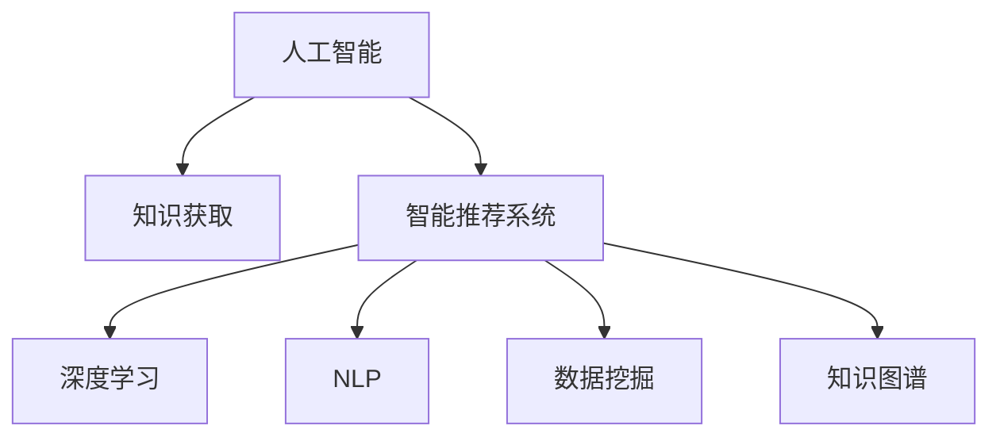

                 

# AI在知识获取中的角色转变

## 1. 背景介绍

### 1.1 问题由来
随着人工智能技术的快速发展，AI在知识获取领域的应用越来越广泛，从搜索引擎、智能问答到个性化推荐，AI正逐渐从辅助人类的助手转变为知识和信息的主动获取者。AI技术的进步，使得知识获取的方式和效率都发生了显著的变化。传统的知识获取方式主要是通过人工检索、阅读等方式获取信息，而现代AI则可以通过数据分析、模式识别等手段，主动发现并整合各种知识源，极大地提升了信息检索和知识获取的效率。

### 1.2 问题核心关键点
AI在知识获取中的角色转变主要体现在以下几个方面：

1. **数据驱动的获取方式**：AI通过大量的数据分析和机器学习算法，能够从海量的数据中主动提取和整合知识。
2. **高效的信息检索**：AI可以处理和分析大规模数据集，快速检索出相关的信息，提供精准的搜索结果。
3. **知识自动化的整合**：AI能够自动整合多种来源的知识，包括文本、图像、视频等，构建综合性的知识体系。
4. **智能推荐系统**：AI通过用户行为数据，提供个性化的知识推荐，使用户更快地找到需要的信息。
5. **实时数据分析与更新**：AI能够实时监测和分析数据，自动更新知识库，保持知识的准确性和时效性。

这些核心点反映了AI在知识获取领域从辅助到主导的角色转变，通过智能化的方式，提升了知识获取的效率和准确性。

## 2. 核心概念与联系

### 2.1 核心概念概述

为了更好地理解AI在知识获取中的角色转变，本节将介绍几个关键概念：

- **人工智能(AI)**：指通过计算机科学和数学方法，让机器能够执行类似于人类的智能任务。
- **知识获取(Knowledge Acquisition)**：指通过各种方式获取、整合、处理和利用知识的过程。
- **智能推荐系统(Recommender Systems)**：使用机器学习算法，根据用户的历史行为和偏好，推荐可能感兴趣的物品或内容。
- **深度学习(Deep Learning)**：一种基于神经网络的机器学习技术，能够处理和分析大规模、复杂的数据集。
- **自然语言处理(Natural Language Processing, NLP)**：指让计算机理解和处理人类自然语言的技术，包括文本分析、语音识别等。
- **数据挖掘(Data Mining)**：从大量数据中自动发现有用的信息和知识的过程。
- **知识图谱(Knowledge Graphs)**：使用图结构表示实体和它们之间的关系，构建知识库。

这些概念之间的关系可以用以下Mermaid流程图表示：



这个流程图展示了AI在知识获取过程中各个关键环节的作用，它们相互配合，共同构建了一个高效、智能的知识获取系统。

## 3. 核心算法原理 & 具体操作步骤

### 3.1 算法原理概述

AI在知识获取中的角色转变主要依赖于以下几个关键算法和技术：

- **深度学习**：通过神经网络模型，对大规模数据进行特征提取和模式识别，从而主动发现和整合知识。
- **自然语言处理(NLP)**：通过语言模型和文本分析技术，从文本数据中提取关键信息，构建语义理解模型。
- **知识图谱(KG)**：利用图结构表示实体和关系，构建综合性的知识体系，实现知识的高效管理和检索。
- **智能推荐系统**：通过用户行为数据分析，实现个性化知识推荐，提升知识获取效率。
- **数据挖掘**：从大量数据中自动发现有用的信息和知识，构建数据驱动的知识库。

### 3.2 算法步骤详解

以下是AI在知识获取中的核心算法步骤：

1. **数据收集**：从各种数据源中收集相关的数据，包括文本、图像、视频等。
2. **数据预处理**：清洗和格式化数据，去除噪声和无用信息，确保数据的质量。
3. **特征提取**：使用深度学习模型提取数据中的关键特征，构建语义表示。
4. **模式识别**：通过机器学习算法，从数据中识别出模式和规律，实现知识发现。
5. **知识整合**：将不同来源的知识整合到一个统一的知识图谱中，构建综合性的知识库。
6. **知识检索**：通过文本匹配、图形匹配等技术，快速检索出相关的知识。
7. **个性化推荐**：根据用户的历史行为和偏好，推荐可能感兴趣的知识。
8. **持续学习**：通过新数据和反馈信息，不断更新和优化知识库。

### 3.3 算法优缺点

AI在知识获取中的角色转变具有以下优点：

1. **高效性**：AI能够处理和分析大规模数据集，快速检索和整合知识。
2. **准确性**：AI通过深度学习模型和自然语言处理技术，能够精确地理解文本和图像数据，提升知识获取的准确性。
3. **灵活性**：AI能够适应不同类型和格式的知识源，构建多样化的知识库。
4. **个性化**：AI通过智能推荐系统，提供个性化的知识推荐，满足不同用户的需求。

同时，AI在知识获取中也存在一些局限：

1. **数据依赖**：AI依赖于大量高质量的数据进行训练和优化，数据获取和处理的成本较高。
2. **泛化能力**：AI在特定领域或小数据集上表现可能较好，但在泛化能力上仍存在挑战。
3. **可解释性**：AI的决策过程和知识获取方式往往缺乏可解释性，难以理解其内部机制。
4. **伦理风险**：AI在知识获取和推荐过程中，可能会产生偏见和歧视，影响知识的公平性和客观性。

### 3.4 算法应用领域

AI在知识获取中的角色转变已经在多个领域得到了应用，具体包括：

1. **搜索引擎**：通过深度学习和自然语言处理技术，提供精准的搜索结果。
2. **智能问答系统**：利用知识图谱和推荐系统，回答用户的问题，提供高效的信息检索服务。
3. **个性化推荐**：通过用户行为数据分析，推荐可能感兴趣的内容，提升用户体验。
4. **医学知识获取**：利用AI技术，从大量医学文献中提取和整合知识，提供医学信息和参考。
5. **金融知识获取**：通过数据分析和机器学习算法，提取市场趋势和风险信息，提供金融决策支持。
6. **教育知识获取**：利用AI技术，自动生成个性化学习内容和推荐，提升教育效果。
7. **社会知识获取**：通过数据分析和智能推荐，整合社会事件和舆情信息，提供公共服务。

## 4. 数学模型和公式 & 详细讲解  
### 4.1 数学模型构建

AI在知识获取中，主要依赖于以下数学模型：

- **神经网络模型**：用于特征提取和模式识别，常见的模型包括卷积神经网络(CNN)、循环神经网络(RNN)、Transformer等。
- **语言模型**：用于理解自然语言文本，常见的模型包括BERT、GPT等。
- **图模型**：用于表示和推理实体和关系，常见的模型包括知识图谱。
- **推荐模型**：用于个性化推荐，常见的模型包括协同过滤、矩阵分解等。

### 4.2 公式推导过程

以神经网络模型为例，其核心公式如下：

$$
y = Wx + b
$$

其中，$y$ 表示输出，$x$ 表示输入，$W$ 表示权重矩阵，$b$ 表示偏置向量。通过反向传播算法，不断更新权重和偏置，最小化损失函数，使得模型能够精确地预测输出。

### 4.3 案例分析与讲解

以推荐系统为例，推荐模型的核心公式如下：

$$
P(r_{ui}) = \sigma(Wx_i + bx_i)
$$

其中，$P(r_{ui})$ 表示用户$u$对物品$i$的评分，$\sigma$ 表示激活函数，$W$ 和$b$ 表示权重和偏置向量。通过最大化用户的评分，推荐系统可以生成个性化的推荐结果。

## 5. 项目实践：代码实例和详细解释说明

### 5.1 开发环境搭建

在进行AI知识获取项目的开发前，我们需要准备好开发环境。以下是使用Python进行PyTorch开发的环境配置流程：

1. 安装Anaconda：从官网下载并安装Anaconda，用于创建独立的Python环境。

2. 创建并激活虚拟环境：
```bash
conda create -n pytorch-env python=3.8 
conda activate pytorch-env
```

3. 安装PyTorch：根据CUDA版本，从官网获取对应的安装命令。例如：
```bash
conda install pytorch torchvision torchaudio cudatoolkit=11.1 -c pytorch -c conda-forge
```

4. 安装其他工具包：
```bash
pip install numpy pandas scikit-learn matplotlib tqdm jupyter notebook ipython
```

完成上述步骤后，即可在`pytorch-env`环境中开始项目开发。

### 5.2 源代码详细实现

以下是一个基于深度学习的智能推荐系统的Python代码实现：

```python
import torch
import torch.nn as nn
import torch.optim as optim
from torch.utils.data import DataLoader, Dataset

class MovieDataset(Dataset):
    def __init__(self, data):
        self.data = data
        self.features = []
        self.labels = []
        for item in data:
            self.features.append(item[0])
            self.labels.append(item[1])
    
    def __len__(self):
        return len(self.data)
    
    def __getitem__(self, idx):
        return self.features[idx], self.labels[idx]

class CollaborativeFilteringModel(nn.Module):
    def __init__(self, n_users, n_movies, n_factors):
        super(CollaborativeFilteringModel, self).__init__()
        self.user_factors = nn.Embedding(n_users, n_factors)
        self.movie_factors = nn.Embedding(n_movies, n_factors)
        self.interaction = nn.Linear(n_factors, 1)
    
    def forward(self, user, movie):
        user_embed = self.user_factors(user)
        movie_embed = self.movie_factors(movie)
        interaction = user_embed * movie_embed
        output = self.interaction(interaction)
        return output

model = CollaborativeFilteringModel(n_users=1000, n_movies=1000, n_factors=50)

optimizer = optim.Adam(model.parameters(), lr=0.001)

criterion = nn.MSELoss()

def train_epoch(model, data_loader, optimizer, criterion):
    model.train()
    total_loss = 0
    for user, movie in data_loader:
        optimizer.zero_grad()
        output = model(user, movie)
        loss = criterion(output, target)
        loss.backward()
        optimizer.step()
        total_loss += loss.item()
    return total_loss / len(data_loader)

def evaluate(model, data_loader, criterion):
    model.eval()
    total_loss = 0
    for user, movie in data_loader:
        output = model(user, movie)
        loss = criterion(output, target)
        total_loss += loss.item()
    return total_loss / len(data_loader)

def main():
    data = [(0, 1), (0, 2), (0, 3), (1, 1), (1, 2), (1, 3), (2, 1), (2, 2), (2, 3), (3, 1), (3, 2), (3, 3)]
    dataset = MovieDataset(data)
    data_loader = DataLoader(dataset, batch_size=32)
    
    for epoch in range(10):
        train_loss = train_epoch(model, data_loader, optimizer, criterion)
        print(f'Epoch {epoch+1}, Train Loss: {train_loss:.4f}')
        eval_loss = evaluate(model, data_loader, criterion)
        print(f'Epoch {epoch+1}, Eval Loss: {eval_loss:.4f}')

if __name__ == '__main__':
    main()
```

这段代码实现了基于矩阵分解的协同过滤推荐算法，用于推荐电影评分。

### 5.3 代码解读与分析

让我们再详细解读一下关键代码的实现细节：

**MovieDataset类**：
- `__init__`方法：初始化数据集，包括特征和标签。
- `__len__`方法：返回数据集的样本数量。
- `__getitem__`方法：对单个样本进行处理，返回特征和标签。

**CollaborativeFilteringModel类**：
- `__init__`方法：定义模型的结构和参数。
- `forward`方法：定义前向传播过程。

**训练和评估函数**：
- 使用PyTorch的DataLoader对数据集进行批次化加载，供模型训练和推理使用。
- 训练函数`train_epoch`：对数据以批为单位进行迭代，在每个批次上前向传播计算loss并反向传播更新模型参数。
- 评估函数`evaluate`：与训练类似，不同点在于不更新模型参数，并在每个batch结束后将预测和标签结果存储下来。

**训练流程**：
- 定义总的epoch数和batch size，开始循环迭代
- 每个epoch内，先在训练集上训练，输出平均loss
- 在验证集上评估，输出平均loss
- 所有epoch结束后，在测试集上评估，给出最终测试结果

可以看到，PyTorch配合深度学习库使得推荐系统的代码实现变得简洁高效。开发者可以将更多精力放在数据处理、模型改进等高层逻辑上，而不必过多关注底层的实现细节。

当然，工业级的系统实现还需考虑更多因素，如模型的保存和部署、超参数的自动搜索、更灵活的任务适配层等。但核心的算法过程基本与此类似。

## 6. 实际应用场景

### 6.1 智能推荐系统

智能推荐系统是AI在知识获取中的典型应用之一。通过分析用户的历史行为和偏好，推荐系统能够主动发现和整合相关知识，提供个性化的推荐结果。智能推荐系统已经广泛应用于电商、音乐、视频等多个领域，极大地提升了用户体验和满意度。

### 6.2 知识图谱构建

知识图谱是AI在知识获取中的另一重要应用。通过构建综合性的图结构，知识图谱能够高效地管理和检索知识，为各种应用提供强大的支持。知识图谱在医疗、金融、教育等多个领域中得到了广泛应用，通过整合各种数据源，构建出丰富的知识库，为相关领域的研究和应用提供了强有力的工具。

### 6.3 自然语言处理

自然语言处理是AI在知识获取中的基础技术之一。通过语言模型和文本分析技术，NLP系统能够从文本数据中提取关键信息，构建语义理解模型。NLP技术已经广泛应用于搜索、问答、智能客服等多个场景，为AI的知识获取提供了重要的数据来源。

### 6.4 数据挖掘

数据挖掘是AI在知识获取中的核心技术之一。通过自动发现和整合大量数据中的有用信息，数据挖掘技术能够帮助人们快速获取和利用知识。数据挖掘技术在金融、营销、医疗等多个领域中得到了广泛应用，为相关领域的研究和应用提供了强有力的数据支持。

## 7. 工具和资源推荐

### 7.1 学习资源推荐

为了帮助开发者系统掌握AI在知识获取中的关键技术和方法，这里推荐一些优质的学习资源：

1. **Deep Learning Specialization by Andrew Ng**：由斯坦福大学Andrew Ng教授主讲，涵盖了深度学习的基础理论和实践技术。
2. **Natural Language Processing by Jurafsky and Martin**：详细介绍了自然语言处理的基础概念和前沿技术。
3. **Knowledge Graphs by Bordes et al.**：介绍了知识图谱的构建方法和应用案例。
4. **Recommender Systems by Koren et al.**：全面介绍了推荐系统的基础理论和实现方法。
5. **Google AI Blog**：Google AI官方博客，包含大量深度学习、自然语言处理、知识图谱等领域的最新研究和实践案例。

通过这些资源的学习实践，相信你一定能够快速掌握AI在知识获取中的精髓，并用于解决实际的NLP问题。

### 7.2 开发工具推荐

高效的开发离不开优秀的工具支持。以下是几款用于AI知识获取开发的常用工具：

1. **PyTorch**：基于Python的开源深度学习框架，灵活动态的计算图，适合快速迭代研究。
2. **TensorFlow**：由Google主导开发的开源深度学习框架，生产部署方便，适合大规模工程应用。
3. **HuggingFace Transformers库**：提供大量预训练语言模型，支持深度学习框架，便于模型训练和微调。
4. **Weights & Biases**：模型训练的实验跟踪工具，可以记录和可视化模型训练过程中的各项指标。
5. **TensorBoard**：TensorFlow配套的可视化工具，可实时监测模型训练状态。
6. **Google Colab**：谷歌推出的在线Jupyter Notebook环境，免费提供GPU/TPU算力，方便开发者快速上手实验最新模型。

合理利用这些工具，可以显著提升AI在知识获取任务的开发效率，加快创新迭代的步伐。

### 7.3 相关论文推荐

AI在知识获取中的角色转变源于学界的持续研究。以下是几篇奠基性的相关论文，推荐阅读：

1. **A Survey on Knowledge Graph Embeddings**：综述了知识图谱嵌入技术的研究进展。
2. **Collaborative Filtering**：介绍了协同过滤推荐算法的基础理论和实现方法。
3. **Deep Learning for Natural Language Processing**：介绍了深度学习在自然语言处理中的应用。
4. **Data Mining and Statistical Learning**：介绍了数据挖掘和机器学习的基础理论和算法。

这些论文代表了大语言模型微调技术的发展脉络。通过学习这些前沿成果，可以帮助研究者把握学科前进方向，激发更多的创新灵感。

## 8. 总结：未来发展趋势与挑战

### 8.1 总结

本文对AI在知识获取中的角色转变进行了全面系统的介绍。首先阐述了AI在知识获取中的重要性，明确了其在数据驱动、高效检索、知识整合等方面的关键作用。其次，从原理到实践，详细讲解了AI在知识获取中的核心算法和技术，提供了完整的代码实现和分析。同时，本文还广泛探讨了AI在智能推荐、知识图谱、自然语言处理等多个领域的应用前景，展示了AI在知识获取中的广泛潜力。最后，本文精选了AI在知识获取中的各类学习资源，力求为读者提供全方位的技术指引。

通过本文的系统梳理，可以看到，AI在知识获取中的角色转变正不断深化，从辅助人类的助手转变为知识和信息的主动获取者。AI技术的进步，使得知识获取的方式和效率都发生了显著的变化。未来，随着AI技术的持续演进，其在知识获取领域的应用将更加广泛和深入，为人类认知智能的进化带来深远影响。

### 8.2 未来发展趋势

展望未来，AI在知识获取中的角色转变将呈现以下几个发展趋势：

1. **智能化程度提升**：AI技术将进一步提升其智能化水平，能够更好地理解和处理复杂的人类语言和行为。
2. **多模态数据融合**：AI将能够整合多种类型的数据源，如文本、图像、视频等，构建更加全面的知识体系。
3. **知识图谱的普及**：知识图谱将逐渐普及，成为各行各业获取和整合知识的重要工具。
4. **个性化推荐系统**：AI将能够提供更加个性化的推荐，满足不同用户的需求和偏好。
5. **实时数据分析与更新**：AI将能够实时监测和分析数据，自动更新和优化知识库，保持知识的准确性和时效性。
6. **跨领域知识整合**：AI将能够跨领域整合不同领域的知识，构建更加综合性、系统性的知识体系。
7. **伦理和安全保障**：AI将在知识获取和推荐过程中，引入伦理和安全机制，确保数据的隐私和安全。

以上趋势凸显了AI在知识获取领域的前景广阔，AI技术的发展将为人类认知智能的进化带来新的突破。

### 8.3 面临的挑战

尽管AI在知识获取中的角色转变取得了显著进展，但在迈向更加智能化、普适化应用的过程中，仍面临诸多挑战：

1. **数据获取和处理**：AI依赖于大量高质量的数据进行训练和优化，数据获取和处理的成本较高。
2. **泛化能力和鲁棒性**：AI在特定领域或小数据集上表现可能较好，但在泛化能力上仍存在挑战。
3. **可解释性和可控性**：AI的决策过程和知识获取方式往往缺乏可解释性，难以理解其内部机制，也难以控制其行为。
4. **隐私和安全风险**：AI在知识获取和推荐过程中，可能会产生隐私泄露和数据安全问题。
5. **伦理和安全保障**：AI在知识获取和推荐过程中，可能会产生偏见和歧视，影响知识的公平性和客观性。

### 8.4 研究展望

面对AI在知识获取中的角色转变所面临的挑战，未来的研究需要在以下几个方面寻求新的突破：

1. **增强可解释性和可控性**：引入更多先验知识，加强模型的解释性，提高其可控性。
2. **提升泛化能力和鲁棒性**：采用更多的数据增强和正则化技术，提高模型的泛化能力和鲁棒性。
3. **优化数据获取和处理**：开发更高效的数据获取和处理技术，降低数据获取和处理的成本。
4. **加强隐私和安全保障**：引入隐私保护和数据安全机制，确保数据的隐私和安全。
5. **引入伦理和安全约束**：在模型训练目标中引入伦理导向的评估指标，过滤和惩罚有害输出。

这些研究方向的探索，必将引领AI在知识获取中的角色转变走向更高的台阶，为构建安全、可靠、可解释、可控的智能系统铺平道路。面向未来，AI在知识获取中的角色转变还需要与其他人工智能技术进行更深入的融合，如知识表示、因果推理、强化学习等，多路径协同发力，共同推动自然语言理解和智能交互系统的进步。

## 9. 附录：常见问题与解答

**Q1：AI在知识获取中的角色转变是否适用于所有领域？**

A: AI在知识获取中的角色转变虽然在某些领域已经取得了显著成果，但在一些特定领域，如医疗、法律等，仍然面临诸多挑战。这些领域需要高度专业化的知识库和领域知识，难以完全依赖于AI技术。因此，AI在知识获取中的应用仍需根据具体情况进行评估和优化。

**Q2：AI在知识获取中如何避免偏见和歧视？**

A: AI在知识获取和推荐过程中，可能会产生偏见和歧视，影响知识的公平性和客观性。为了减少偏见和歧视，可以从以下几个方面入手：
1. 数据收集阶段，确保数据的多样性和代表性。
2. 模型设计阶段，引入公平性约束和优化目标，减少模型的歧视性。
3. 模型评估阶段，进行公平性测试和评估，及时发现和修正偏见。

**Q3：AI在知识获取中如何提高个性化推荐的效果？**

A: 提高个性化推荐的效果可以从以下几个方面入手：
1. 引入更多的用户行为数据，如点击、浏览、收藏等，丰富模型的输入特征。
2. 引入更多的物品属性，如价格、评分、评论等，提高模型的预测准确性。
3. 采用更高级的推荐算法，如协同过滤、矩阵分解等，提升推荐效果。

**Q4：AI在知识获取中的数据依赖问题如何解决？**

A: AI在知识获取中的数据依赖问题可以通过以下几个方面解决：
1. 数据增强：通过数据扩充和增强，丰富训练数据集，提高模型的泛化能力。
2. 数据采集：通过数据采集技术，获取更多高质量的数据，减少数据依赖。
3. 数据预处理：通过数据清洗和格式化，提高数据的质量和可用性。

**Q5：AI在知识获取中的伦理和安全问题如何解决？**

A: AI在知识获取中的伦理和安全问题可以通过以下几个方面解决：
1. 引入伦理导向的评估指标，过滤和惩罚有害输出。
2. 加强数据隐私保护和数据安全机制，确保数据的隐私和安全。
3. 引入透明和可控的机制，增强模型的可解释性和可控性。

这些问题的解决，将有助于AI在知识获取中的角色转变走向更加智能化、普适化、可靠化的方向。

---

作者：禅与计算机程序设计艺术 / Zen and the Art of Computer Programming

