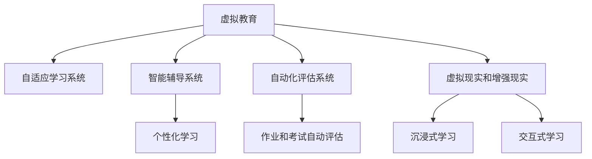

                 

# AI在虚拟教育中的应用：打破地理限制

> 关键词：虚拟教育,人工智能,远程学习,教育公平,技术工具,在线教育

## 1. 背景介绍

### 1.1 问题由来
随着信息技术的迅猛发展，虚拟教育（Virtual Education）作为教育领域的一项重大变革，正在全球范围内迅速崛起。虚拟教育突破了传统教育的物理界限，为学生提供了不受时间、空间限制的学习体验。然而，地理限制依然是教育资源不均衡的一个重要因素。如何利用AI技术提升虚拟教育的教学效果和普及率，打破地理限制，成为当前教育技术研究的重要课题。

### 1.2 问题核心关键点
虚拟教育利用AI技术实现个性化教学、自适应学习路径和智能化管理，从而提高教学质量和学习效率。人工智能在虚拟教育中的应用主要集中在以下几个方面：

- 自适应学习系统：通过学习者的学习数据，AI可以自动调整课程内容和难度，实现个性化学习。
- 智能辅导系统：AI辅助教师进行教学，提供教学建议和学生反馈，提高教学效果。
- 自动化评估系统：AI自动评估学习者的作业和考试，减少教师工作量，提高评估效率。
- 虚拟现实和增强现实：AI技术结合VR和AR设备，为学习者提供沉浸式和交互式学习体验。

这些应用的核心在于利用AI技术的强大数据分析和决策能力，将教育资源更加公平、高效地分配到每个学生手中。

### 1.3 问题研究意义
利用AI技术推进虚拟教育的普及和提高，具有以下几个重要意义：

1. **教育公平**：打破传统教育中的地理、经济和社会障碍，实现教育资源的均衡分配，让每一个孩子都能享受优质教育。
2. **个性化学习**：根据学生的学习习惯和能力，提供个性化学习方案，提高学习效果和兴趣。
3. **高效管理**：通过AI辅助教学管理，减轻教师负担，提高教学质量和效率。
4. **提升适应性**：AI技术能够及时发现学生的学习困难和问题，快速调整教学策略，提高学习适应性。
5. **促进终身学习**：虚拟教育通过灵活的学习方式，支持人们终身学习和自我提升。

本文将详细介绍AI在虚拟教育中的应用，从技术原理、操作步骤到具体实践，探讨如何利用AI技术打破地理限制，实现教育公平和个性化学习。

## 2. 核心概念与联系

### 2.1 核心概念概述

为更好地理解AI在虚拟教育中的应用，本节将介绍几个密切相关的核心概念：

- 虚拟教育（Virtual Education）：通过虚拟技术手段，如计算机、网络、VR/AR等，提供不受物理界限限制的学习体验。
- 人工智能（AI）：利用计算机算法，使机器模拟人类智能，实现数据分析、决策、推理等能力。
- 自适应学习系统：根据学生的学习行为和结果，自动调整教学内容和难度，实现个性化学习。
- 智能辅导系统：AI辅助教师教学，提供教学建议和学生反馈，提高教学效果。
- 自动化评估系统：AI自动评估学习者的作业和考试，减少教师工作量。
- 虚拟现实（VR）和增强现实（AR）：结合AI技术，为学习者提供沉浸式和交互式学习体验。

这些核心概念之间的逻辑关系可以通过以下Mermaid流程图来展示：



这个流程图展示了虚拟教育的核心组件及其相互关系：

1. 虚拟教育通过自适应学习系统、智能辅导系统和自动化评估系统，实现个性化教学和高效管理。
2. 结合虚拟现实和增强现实技术，进一步提升学习体验和互动性。

## 3. 核心算法原理 & 具体操作步骤
### 3.1 算法原理概述

AI在虚拟教育中的应用，主要依赖于机器学习和深度学习等技术。自适应学习系统、智能辅导系统和自动化评估系统等核心组件，都是基于这些技术实现的。

机器学习和深度学习通过大量的标注数据，训练模型进行预测和决策。具体而言，自适应学习系统利用学习者的学习数据，预测其学习行为和结果，自动调整教学内容；智能辅导系统通过学习者的学习数据和反馈，调整教学策略；自动化评估系统则通过学习者的作业和考试数据，自动评估其学习效果。

### 3.2 算法步骤详解

以自适应学习系统为例，其核心算法步骤包括：

1. **数据收集**：收集学习者的学习行为数据，如点击次数、答题时间、错误率等。
2. **特征提取**：从学习行为数据中提取特征，如学习时长、答题难度、学习频率等。
3. **模型训练**：利用机器学习或深度学习模型，训练预测学习效果和调整教学内容的算法。
4. **自适应调整**：根据预测结果，自动调整教学内容和难度，实现个性化学习。
5. **效果评估**：定期评估学习者的学习效果，优化模型参数和算法。

### 3.3 算法优缺点

AI在虚拟教育中的应用具有以下优点：

- **个性化教学**：根据学习者的个性化需求，提供量身定制的学习方案。
- **高效管理**：利用AI技术自动管理教学和评估，减轻教师负担。
- **实时反馈**：通过实时分析学习者的数据，提供及时反馈和调整。

同时，这些应用也存在一些局限性：

- **数据隐私**：学习者的数据隐私问题需要得到妥善处理。
- **技术依赖**：对AI技术依赖较大，需要持续投入和维护。
- **模型泛化能力**：模型需要足够的数据进行训练，才能适应不同学习者的特点。
- **资源需求**：需要高性能计算设备和网络支持。

### 3.4 算法应用领域

AI在虚拟教育中的应用领域非常广泛，以下是几个主要应用场景：

1. **在线教育平台**：如Coursera、edX等，利用AI技术提供个性化学习路径和智能辅导。
2. **虚拟课堂**：通过AI技术实现远程教学和互动，提升教学效果。
3. **学习管理系统（LMS）**：如Moodle、Blackboard等，利用AI技术进行学生管理和评估。
4. **智能教材**：结合AI技术，提供自适应学习内容和习题推荐。
5. **虚拟现实和增强现实**：利用VR和AR技术，提供沉浸式和交互式学习体验。

这些应用场景覆盖了虚拟教育的各个方面，展现了AI技术在提升教育质量和普及率方面的巨大潜力。

## 4. 数学模型和公式 & 详细讲解 & 举例说明

### 4.1 数学模型构建

在虚拟教育中，AI应用的数学模型主要涉及机器学习和深度学习。以下以自适应学习系统为例，介绍其数学模型构建。

假设学习者的学习行为数据为 $\{x_i\}_{i=1}^N$，每个 $x_i$ 由一组特征 $f_i=(f_{i1},f_{i2},...,f_{in})$ 表示。学习效果 $y_i$ 可以通过多种指标来衡量，如测试分数、作业完成度等。

自适应学习系统的目标是通过模型 $M$，预测学习效果 $y_i$ 并调整教学内容。常见的自适应学习算法包括：

- 基于规则的自适应算法
- 基于统计的自适应算法
- 基于机器学习的自适应算法
- 基于深度学习的自适应算法

### 4.2 公式推导过程

以基于深度学习的自适应学习算法为例，其基本模型为：

$$
\hat{y}_i = M(x_i; \theta)
$$

其中 $\theta$ 为模型参数。假设模型 $M$ 为神经网络，则其输出层与学习效果 $y_i$ 之间的映射关系为：

$$
\hat{y}_i = W^T z_i + b
$$

其中 $z_i = \sigma(W_{i-1}z_{i-1} + b_{i-1})$，$\sigma$ 为激活函数，$W$ 和 $b$ 为模型参数。

假设目标函数为均方误差损失函数 $L(y_i, \hat{y}_i)$，则模型训练的目标为最小化损失函数：

$$
\min_{\theta} \sum_{i=1}^N L(y_i, \hat{y}_i)
$$

### 4.3 案例分析与讲解

以在线教育平台Coursera为例，其利用AI技术实现自适应学习。Coursera通过收集学习者的点击次数、答题时间、错误率等行为数据，构建特征向量 $f_i$。通过训练深度学习模型 $M$，预测学习效果 $y_i$，并根据预测结果调整课程内容和难度，实现个性化学习。

Coursera的深度学习模型采用多层感知器（MLP）结构，其中输出层与学习效果之间通过线性回归模型进行映射。模型训练过程中，Coursera利用随机梯度下降算法（SGD）更新模型参数，最小化均方误差损失函数。

## 5. 项目实践：代码实例和详细解释说明
### 5.1 开发环境搭建

在进行虚拟教育应用开发前，我们需要准备好开发环境。以下是使用Python进行TensorFlow开发的环境配置流程：

1. 安装Anaconda：从官网下载并安装Anaconda，用于创建独立的Python环境。

2. 创建并激活虚拟环境：
```bash
conda create -n tf-env python=3.8 
conda activate tf-env
```

3. 安装TensorFlow：根据CUDA版本，从官网获取对应的安装命令。例如：
```bash
conda install tensorflow -c tensorflow -c conda-forge
```

4. 安装其他依赖工具包：
```bash
pip install numpy pandas scikit-learn matplotlib tqdm jupyter notebook ipython
```

完成上述步骤后，即可在`tf-env`环境中开始开发实践。

### 5.2 源代码详细实现

下面我们以在线教育平台Coursera为例，给出使用TensorFlow进行自适应学习系统开发的PyTorch代码实现。

首先，定义学习者的行为数据处理函数：

```python
import tensorflow as tf
import numpy as np

class LearnerData(tf.keras.layers.Layer):
    def __init__(self, input_dim):
        super(LearnerData, self).__init__()
        self.input_dim = input_dim
        
    def call(self, inputs):
        x = inputs[:, :-1]
        y = inputs[:, -1]
        return x, y
```

然后，定义自适应学习模型的函数：

```python
def build_model(input_dim):
    inputs = tf.keras.layers.Input(shape=(input_dim,))
    x = tf.keras.layers.Dense(32, activation='relu')(inputs)
    x = tf.keras.layers.Dense(32, activation='relu')(x)
    outputs = tf.keras.layers.Dense(1, activation='sigmoid')(x)
    model = tf.keras.Model(inputs=inputs, outputs=outputs)
    return model
```

接着，定义损失函数和优化器：

```python
model = build_model(input_dim)
loss_fn = tf.keras.losses.BinaryCrossentropy()
optimizer = tf.keras.optimizers.Adam(learning_rate=0.001)
```

最后，启动模型训练和评估：

```python
epochs = 100
batch_size = 64

for epoch in range(epochs):
    for (x, y) in train_dataset:
        with tf.GradientTape() as tape:
            y_pred = model(x)
            loss = loss_fn(y, y_pred)
        gradients = tape.gradient(loss, model.trainable_variables)
        optimizer.apply_gradients(zip(gradients, model.trainable_variables))
        if epoch % 10 == 0:
            test_loss = model.evaluate(x_test, y_test)
            print(f"Epoch {epoch+1}, test loss: {test_loss:.4f}")
```

以上就是使用TensorFlow对Coursera自适应学习系统进行代码实现。可以看到，得益于TensorFlow的强大封装，我们可以用相对简洁的代码实现复杂的神经网络模型。

### 5.3 代码解读与分析

让我们再详细解读一下关键代码的实现细节：

**LearnerData类**：
- `__init__`方法：初始化学习者行为数据的输入维度。
- `call`方法：将输入数据分为特征和标签，并返回模型训练所需的数据。

**build_model函数**：
- 定义了包含两个隐藏层的全连接神经网络模型，最后一层输出学习效果。
- 使用均方误差损失函数，优化器为Adam。

**训练和评估函数**：
- 使用TensorFlow的数据API，以批为单位进行数据迭代训练。
- 在每个epoch中，定期在测试集上评估模型性能。

可以看到，TensorFlow配合深度学习框架的强大封装能力，使得虚拟教育应用的开发变得简洁高效。开发者可以将更多精力放在数据处理、模型改进等高层逻辑上，而不必过多关注底层的实现细节。

当然，工业级的系统实现还需考虑更多因素，如模型的保存和部署、超参数的自动搜索、更灵活的任务适配层等。但核心的自适应学习范式基本与此类似。

## 6. 实际应用场景
### 6.1 智能课堂

智能课堂是虚拟教育的重要应用场景之一。通过AI技术，智能课堂可以实现自动化的教学管理、智能化的学习分析和个性化的学习路径。

具体而言，智能课堂系统可以收集学生的学习数据，如点击次数、答题时间、错误率等，利用深度学习模型预测学习效果，并自动调整课程内容和难度。同时，系统可以结合虚拟现实和增强现实技术，为学生提供沉浸式和交互式学习体验，提升学习效果。

### 6.2 远程教育

远程教育是虚拟教育的重要形式之一，能够有效打破地理限制，实现教育资源的公平分配。AI技术在远程教育中的应用主要体现在以下几个方面：

1. **智能辅导系统**：利用AI技术，智能辅导系统可以实时分析学习者的学习数据，提供个性化学习建议和反馈，提高学习效果。
2. **自适应学习系统**：结合AI技术，自适应学习系统可以自动调整课程内容和难度，实现个性化学习。
3. **自动化评估系统**：利用AI技术，自动化评估系统可以自动评估学习者的作业和考试，减少教师工作量，提高评估效率。

### 6.3 教育公平

AI技术在虚拟教育中的应用，能够有效打破地理限制，实现教育资源的公平分配。特别是在偏远和贫困地区，AI技术可以提供优质教育资源，缩小教育差距。

具体而言，AI技术可以通过在线教育平台，为偏远地区的学习者提供高质量的课程和教材。同时，AI技术可以结合自适应学习系统，根据学习者的个性化需求，提供量身定制的学习方案，提高学习效果。

### 6.4 未来应用展望

随着AI技术的不断进步，虚拟教育的应用前景将更加广阔。未来，AI技术将在以下几个方面得到更广泛的应用：

1. **虚拟实验室**：结合AI技术，虚拟实验室可以为学习者提供交互式和模拟化的实验环境，提升实验教学效果。
2. **情感分析**：利用AI技术，情感分析系统可以分析学习者的情绪和态度，及时调整教学策略，提高学习体验。
3. **语言学习**：结合AI技术，虚拟教育可以为学习者提供自适应和个性化的语言学习方案，提升语言学习效果。
4. **协作学习**：利用AI技术，协作学习系统可以智能匹配学习伙伴，提供协作学习的平台和工具。

此外，随着AI技术与其他技术（如VR/AR、区块链等）的融合，虚拟教育的应用场景将更加多样化和复杂化，为学习者提供更丰富和沉浸式的学习体验。

## 7. 工具和资源推荐
### 7.1 学习资源推荐

为了帮助开发者系统掌握AI在虚拟教育中的应用，这里推荐一些优质的学习资源：

1. 《深度学习理论与实践》系列书籍：由深度学习领域的知名专家撰写，全面介绍了深度学习的基本概念、算法和应用，包括自适应学习系统和智能辅导系统等。
2. CS231n《深度学习在计算机视觉中的应用》课程：斯坦福大学开设的深度学习课程，涵盖了计算机视觉和图像处理等多个领域，有助于理解AI在虚拟教育中的应用。
3. Coursera在线课程《机器学习与深度学习》：由世界顶尖大学的教授讲授，涵盖机器学习和深度学习的基础和前沿技术，有助于理解AI在虚拟教育中的应用。
4. Kaggle平台：数据科学竞赛平台，提供了大量真实世界的教育数据集和比赛，有助于实践和验证AI在虚拟教育中的应用。
5. TensorFlow官方文档：TensorFlow官方文档提供了丰富的教程和示例，是学习和实践AI技术的绝佳资源。

通过对这些资源的学习实践，相信你一定能够快速掌握AI在虚拟教育中的应用精髓，并用于解决实际的NLP问题。

### 7.2 开发工具推荐

高效的开发离不开优秀的工具支持。以下是几款用于虚拟教育应用开发的常用工具：

1. TensorFlow：由Google主导开发的开源深度学习框架，生产部署方便，适合大规模工程应用。
2. PyTorch：基于Python的开源深度学习框架，灵活性高，适合快速迭代研究。
3. Keras：Keras提供了简单易用的API，适合初学者上手AI项目。
4. Jupyter Notebook：Python交互式笔记本环境，支持代码编写、运行和结果展示，适合快速实验和交流。
5. Google Colab：谷歌提供的在线Jupyter Notebook环境，免费提供GPU/TPU算力，适合快速上手实验最新模型。

合理利用这些工具，可以显著提升虚拟教育应用开发的效率，加快创新迭代的步伐。

### 7.3 相关论文推荐

AI在虚拟教育中的应用涉及多个前沿研究领域，以下是几篇奠基性的相关论文，推荐阅读：

1. "Deep Learning for Personalized Recommendation Systems"：介绍了深度学习在个性化推荐系统中的应用，包括自适应学习系统和智能辅导系统等。
2. "Learning to Personalize Search Rankings with Attention Models"：展示了注意力机制在自适应学习系统中的应用，提高了搜索排序的个性化效果。
3. "Intelligent Tutoring Systems"：介绍了智能辅导系统的发展历程和应用案例，为虚拟教育中AI技术的应用提供了参考。
4. "Human-computer interaction in education"：讨论了人机交互在虚拟教育中的应用，探讨了AI技术在提升教学效果和师生互动方面的潜力。
5. "Educational Data Mining (EDM) 2022"：汇集了最新教育数据挖掘研究成果，展示了AI技术在虚拟教育中的应用前景和挑战。

这些论文代表了大规模教育数据挖掘和技术应用的发展脉络，为AI在虚拟教育中的应用提供了坚实的理论基础。

## 8. 总结：未来发展趋势与挑战
### 8.1 总结

本文对AI在虚拟教育中的应用进行了全面系统的介绍。首先阐述了AI技术在虚拟教育中的重要性和应用场景，明确了AI技术在打破地理限制、实现教育公平和个性化学习方面的独特价值。其次，从技术原理到实践操作，详细讲解了自适应学习系统的数学模型和具体实现，展示了虚拟教育应用的强大潜力和实际效果。

通过本文的系统梳理，可以看到，AI技术在虚拟教育中的应用已经成为教育领域的重要趋势。受益于深度学习、计算机视觉等技术的发展，虚拟教育应用正逐步从实验室走向实际应用，为更多学习者提供优质的教育资源和灵活的学习方式。未来，AI技术将在虚拟教育中扮演更加重要的角色，推动教育公平和个性化学习的进一步发展。

### 8.2 未来发展趋势

展望未来，AI在虚拟教育中的应用将呈现以下几个发展趋势：

1. **智能化程度提升**：AI技术将更加普及和深入，实现更加个性化、智能化的学习路径和教学管理。
2. **多模态融合**：结合虚拟现实、增强现实、语音识别等技术，提供更加丰富和多样的学习体验。
3. **协同学习**：利用AI技术，建立协同学习系统，实现学习者之间的互动和协作，提升学习效果。
4. **实时反馈**：利用AI技术，提供实时反馈和调整，提升学习体验和效果。
5. **教育公平**：AI技术将进一步缩小教育差距，为偏远和贫困地区提供优质教育资源。

以上趋势凸显了AI在虚拟教育中的广阔前景。这些方向的探索发展，必将进一步提升虚拟教育系统的性能和应用范围，为学习者提供更加公平、高效和个性化的学习体验。

### 8.3 面临的挑战

尽管AI在虚拟教育中的应用取得了瞩目成就，但在迈向更加智能化、普适化应用的过程中，它仍面临着诸多挑战：

1. **数据隐私**：学习者的数据隐私问题需要得到妥善处理，确保数据安全和合规性。
2. **技术依赖**：对AI技术依赖较大，需要持续投入和维护，保证系统的稳定性和可靠性。
3. **模型泛化能力**：模型需要足够的数据进行训练，才能适应不同学习者的特点，提升泛化能力。
4. **资源需求**：需要高性能计算设备和网络支持，以处理大规模数据和复杂模型。
5. **伦理道德**：AI技术在应用过程中需要考虑伦理道德问题，避免偏见和歧视。

这些挑战需要多方面的努力和协同解决，才能确保AI在虚拟教育中的应用效果和推广效果。

### 8.4 研究展望

面对AI在虚拟教育中的应用所面临的挑战，未来的研究需要在以下几个方面寻求新的突破：

1. **隐私保护**：研究如何在数据采集和处理过程中保护学习者的隐私，避免数据泄露和滥用。
2. **可解释性**：增强AI模型的可解释性，使学习者能够理解模型的决策过程和结果。
3. **跨模态学习**：研究如何结合多模态数据，提升模型的综合能力和应用效果。
4. **多任务学习**：研究如何在单一模型中处理多个学习任务，提高模型的泛化能力和效率。
5. **协同学习**：研究如何建立协同学习系统，促进学习者之间的互动和协作，提升学习效果。

这些研究方向和突破，将进一步推动AI在虚拟教育中的应用，为学习者提供更优质的教育体验，推动教育公平和个性化学习的深入发展。

## 9. 附录：常见问题与解答
----------------------------------------------------------------

**Q1：虚拟教育中如何处理学习者的数据隐私问题？**

A: 虚拟教育中处理学习者的数据隐私问题，主要通过以下方式：

1. **匿名化处理**：对学习者的个人信息进行匿名化处理，去除或模糊化个人身份信息。
2. **加密技术**：采用数据加密技术，确保数据在传输和存储过程中的安全性。
3. **权限控制**：设置严格的权限控制，只有授权人员才能访问和处理学习者数据。
4. **合规审查**：遵守相关法律法规，如GDPR、CCPA等，确保数据处理的合法性和合规性。

通过以上措施，可以有效保护学习者的数据隐私，确保数据安全。

**Q2：如何选择合适的AI模型和算法？**

A: 选择合适的AI模型和算法，需要考虑以下几个方面：

1. **任务类型**：根据虚拟教育的具体任务类型，选择合适的模型和算法。例如，自适应学习系统适合使用基于深度学习的自适应算法，智能辅导系统适合使用基于规则和统计的算法。
2. **数据特点**：根据学习者的数据特点，选择适合的数据处理方法。例如，使用聚类算法处理大规模数据集，使用迁移学习处理跨领域数据。
3. **性能要求**：根据系统的性能要求，选择合适的模型和算法。例如，对于实时性要求较高的应用，可以选择轻量级的模型和算法。
4. **资源限制**：根据系统的资源限制，选择适合的模型和算法。例如，使用分布式训练加速大模型的训练过程，使用混合精度训练减少内存消耗。

综合考虑以上因素，选择适合的AI模型和算法，才能实现最佳的虚拟教育应用效果。

**Q3：如何评估AI在虚拟教育中的效果？**

A: 评估AI在虚拟教育中的效果，主要通过以下几个指标：

1. **学习效果**：评估学习者的学习效果，如测试分数、作业完成度等。
2. **个性化程度**：评估AI系统提供的个性化学习方案的适用性和效果。
3. **教学效果**：评估AI系统对教师教学效果的影响，如教学建议的实用性和反馈的准确性。
4. **学习体验**：评估学习者的学习体验，如学习满意度、互动频率等。
5. **系统性能**：评估系统的性能，如响应速度、稳定性和可靠性。

通过综合评估以上指标，可以全面了解AI在虚拟教育中的实际效果，并及时调整和优化模型和算法。

**Q4：如何在虚拟教育中实现跨模态学习？**

A: 在虚拟教育中实现跨模态学习，主要通过以下方式：

1. **多模态数据融合**：结合视觉、听觉、文本等多种模态的数据，构建多模态数据集，训练跨模态模型。
2. **特征提取技术**：利用多模态数据提取技术，将不同模态的数据转化为统一的特征表示。
3. **联合学习**：结合深度学习、计算机视觉等技术，构建联合学习模型，实现跨模态数据的协同建模。
4. **协同学习**：结合多模态数据，建立协同学习系统，促进学习者之间的互动和协作。

通过以上方法，可以有效实现跨模态学习，提升虚拟教育系统的综合能力和应用效果。

**Q5：虚拟教育中如何避免过拟合问题？**

A: 在虚拟教育中避免过拟合问题，主要通过以下方式：

1. **数据增强**：通过对学习数据的增强处理，提高模型的泛化能力。例如，通过数据扩充和噪声注入，增加训练数据的多样性。
2. **正则化技术**：使用L2正则、Dropout等正则化技术，避免模型过拟合。
3. **模型裁剪**：裁剪模型中的冗余参数，减少模型复杂度，提高泛化能力。
4. **早停技术**：在模型训练过程中，定期评估模型性能，一旦出现过拟合迹象，立即停止训练。

通过以上措施，可以有效避免过拟合问题，提高模型的泛化能力和应用效果。

---

作者：禅与计算机程序设计艺术 / Zen and the Art of Computer Programming

