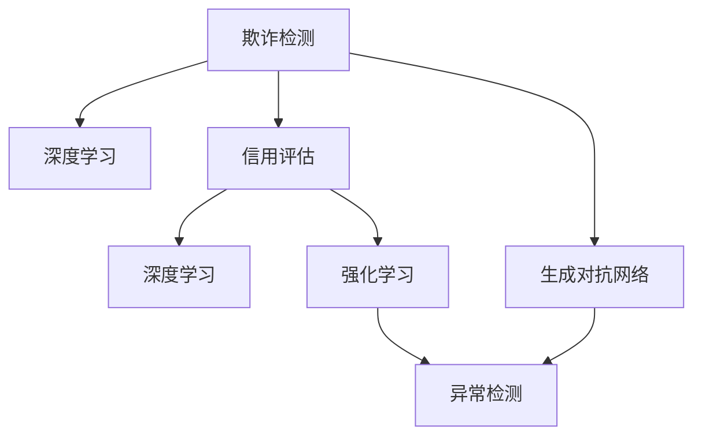

                 

# AI在金融风控中的应用：欺诈检测与信用评估

## 1. 背景介绍

金融科技的蓬勃发展，为金融行业带来了前所未有的机遇，同时也带来了严峻的挑战。随着金融服务的数字化和智能化，欺诈行为和信用风险也呈现出多样化和复杂化的趋势。如何有效识别欺诈行为和评估信用风险，保障金融安全，成为金融风控领域的重要课题。

人工智能（AI）技术的介入，为解决这些问题提供了新的可能。特别是深度学习和大数据分析的结合，使得AI在金融风控中的应用取得了显著成效。其中，欺诈检测和信用评估作为典型的金融风控任务，借助AI技术，能够实现高效、准确的智能决策，显著提升金融服务的质量和效率。

本文将详细探讨AI在金融风控中，特别是在欺诈检测和信用评估中的应用，包括核心概念、算法原理、项目实践、实际应用场景等，以期为金融风控领域的从业者提供全面深入的指导和参考。

## 2. 核心概念与联系

### 2.1 核心概念概述

为更好地理解AI在金融风控中的应用，本节将介绍几个密切相关的核心概念：

- **欺诈检测（Fraud Detection）**：指通过数据分析和机器学习模型，自动识别和拦截异常交易行为，预防欺诈行为的发生。
- **信用评估（Credit Scoring）**：基于历史贷款记录、收入水平、消费习惯等个人信息，通过评分模型评估个人或企业的信用风险水平，决定是否批准贷款或授信。
- **深度学习（Deep Learning）**：基于神经网络结构，通过多层非线性映射，从大量数据中学习复杂模式和规律。
- **生成对抗网络（GANs）**：由生成器和判别器两部分组成，通过对抗训练生成逼真数据，可用于数据增强和模型训练。
- **强化学习（Reinforcement Learning）**：通过与环境交互，学习最优决策策略，用于动态调整模型参数和策略。
- **异常检测（Anomaly Detection）**：识别数据集中的异常点或异常行为，常用于欺诈检测和风险评估。

这些核心概念之间的逻辑关系可以通过以下Mermaid流程图来展示：



这个流程图展示了大语言模型的核心概念及其之间的关系：

1. 欺诈检测和信用评估都使用深度学习进行建模。
2. 生成对抗网络可用于数据增强，提高模型泛化能力。
3. 强化学习可用于动态调整模型参数，优化决策策略。
4. 异常检测在欺诈检测和信用评估中都是重要的预处理步骤。

这些概念共同构成了AI在金融风控中的应用框架，使其能够在各种场景下发挥强大的风险管理和欺诈预防作用。通过理解这些核心概念，我们可以更好地把握AI技术在金融风控中的工作原理和优化方向。

## 3. 核心算法原理 & 具体操作步骤

### 3.1 算法原理概述

AI在金融风控中的应用，主要集中在两个核心任务：欺诈检测和信用评估。以下分别介绍这两个任务的算法原理和具体操作步骤。

### 3.2 算法步骤详解

#### 3.2.1 欺诈检测

欺诈检测的算法步骤主要包括数据预处理、模型训练、模型评估和模型部署：

1. **数据预处理**：收集用户的历史交易记录，包括交易时间、金额、交易地点等信息。清洗数据，处理缺失值、异常值，并进行特征工程，提取对欺诈行为有预测能力的特征。
2. **模型训练**：选择适合的深度学习模型，如卷积神经网络（CNN）、循环神经网络（RNN）、长短期记忆网络（LSTM）等，在标注为欺诈和非欺诈的数据集上训练模型。可以使用生成对抗网络（GANs）进行数据增强，提高模型泛化能力。
3. **模型评估**：在测试集上评估模型性能，使用准确率、召回率、F1分数等指标评估模型效果。
4. **模型部署**：将训练好的模型部署到生产环境中，实时监控交易数据，及时检测和拦截异常交易行为。

#### 3.2.2 信用评估

信用评估的算法步骤主要包括数据预处理、模型训练、模型评估和模型部署：

1. **数据预处理**：收集用户的历史贷款记录、收入水平、消费习惯等信息。清洗数据，处理缺失值、异常值，并进行特征工程，提取对信用风险有预测能力的特征。
2. **模型训练**：选择适合的深度学习模型，如多层感知器（MLP）、卷积神经网络（CNN）等，在标注为良好信用记录的数据集上训练模型。可以使用生成对抗网络（GANs）进行数据增强，提高模型泛化能力。
3. **模型评估**：在测试集上评估模型性能，使用准确率、召回率、F1分数等指标评估模型效果。
4. **模型部署**：将训练好的模型部署到生产环境中，实时评估用户信用风险，决定是否批准贷款或授信。

### 3.3 算法优缺点

AI在金融风控中的应用具有以下优点：

1. **高效性**：深度学习模型能够处理大规模数据，自动提取复杂特征，提高决策效率。
2. **准确性**：通过大量标注数据训练，模型能够学习到复杂的欺诈行为和信用风险模式，提高决策准确性。
3. **鲁棒性**：模型能够自动适应新数据，具有一定的鲁棒性，防止因数据分布变化而影响决策。

同时，该方法也存在一定的局限性：

1. **数据依赖性**：模型的训练和评估效果依赖于高质量、标注准确的训练数据。
2. **模型复杂度**：深度学习模型的复杂度较高，需要较长的训练时间和较高的计算资源。
3. **可解释性不足**：模型的决策过程往往缺乏可解释性，难以对其推理逻辑进行分析和调试。
4. **伦理和安全问题**：模型可能学习到有偏见、有害的信息，产生误导性或歧视性的输出，给实际应用带来安全隐患。

尽管存在这些局限性，但AI在金融风控中的应用已经成为主流，其高效性和准确性使得其在金融行业得到了广泛应用。未来相关研究的重点在于如何进一步降低数据依赖，提高模型的可解释性和安全性，确保其在实际应用中的可靠性。

### 3.4 算法应用领域

AI在金融风控中的应用领域广泛，主要包括：

1. **信用卡欺诈检测**：通过分析用户交易行为，检测异常交易，预防信用卡欺诈行为。
2. **贷款风险评估**：基于用户历史贷款记录，评估贷款风险，决定是否批准贷款或授信。
3. **网络金融欺诈检测**：通过分析用户在线交易行为，检测异常交易，预防网络金融欺诈行为。
4. **反洗钱检测**：通过分析用户交易记录，检测异常交易，预防洗钱行为。
5. **保险欺诈检测**：通过分析用户理赔记录，检测异常理赔行为，预防保险欺诈行为。

这些领域的应用，使得AI在金融风控中发挥了重要的作用，显著提升了金融服务的安全性和可靠性。随着AI技术的不断演进，其在金融风控中的应用前景更加广阔。

## 4. 数学模型和公式 & 详细讲解

### 4.1 数学模型构建

在欺诈检测和信用评估任务中，常用的数学模型包括卷积神经网络（CNN）、循环神经网络（RNN）、长短期记忆网络（LSTM）、多层感知器（MLP）等。以下以卷积神经网络（CNN）为例，介绍欺诈检测的数学模型构建过程。

假设输入为交易时间、金额、交易地点等特征，输出为欺诈标记（0表示非欺诈，1表示欺诈）。模型的输入数据为 $\mathbf{x} \in \mathbb{R}^{n}$，输出为 $\mathbf{y} \in \{0, 1\}$。

卷积神经网络（CNN）的架构包括卷积层、池化层、全连接层等。卷积层用于提取局部特征，池化层用于降低特征维度，全连接层用于分类。

模型的损失函数通常使用交叉熵损失函数，定义为：

$$
\mathcal{L}(\mathbf{x}, \mathbf{y}) = -\sum_{i=1}^n \mathbf{y}_i \log \hat{\mathbf{y}}_i
$$

其中，$\hat{\mathbf{y}}$ 为模型预测的欺诈概率向量，$\mathbf{y}$ 为真实标签向量。

### 4.2 公式推导过程

以二分类任务为例，推导交叉熵损失函数的梯度计算过程。

假设模型 $M_{\theta}$ 在输入 $\mathbf{x}$ 上的输出为 $\hat{\mathbf{y}}=M_{\theta}(\mathbf{x}) \in [0,1]$，表示样本属于欺诈的概率。真实标签 $\mathbf{y} \in \{0,1\}$。则二分类交叉熵损失函数定义为：

$$
\ell(M_{\theta}(\mathbf{x}), \mathbf{y}) = -[y \log \hat{y} + (1-y) \log (1-\hat{y})]
$$

将其代入经验风险公式，得：

$$
\mathcal{L}(\theta) = -\frac{1}{N}\sum_{i=1}^N [y_i\log M_{\theta}(x_i)+(1-y_i)\log(1-M_{\theta}(x_i))]
$$

根据链式法则，损失函数对参数 $\theta_k$ 的梯度为：

$$
\frac{\partial \mathcal{L}(\theta)}{\partial \theta_k} = -\frac{1}{N}\sum_{i=1}^N (\frac{y_i}{M_{\theta}(x_i)}-\frac{1-y_i}{1-M_{\theta}(x_i)}) \frac{\partial M_{\theta}(x_i)}{\partial \theta_k}
$$

其中 $\frac{\partial M_{\theta}(x_i)}{\partial \theta_k}$ 可进一步递归展开，利用自动微分技术完成计算。

在得到损失函数的梯度后，即可带入参数更新公式，完成模型的迭代优化。重复上述过程直至收敛，最终得到适应欺诈检测任务的最优模型参数 $\theta^*$。

### 4.3 案例分析与讲解

以信用卡欺诈检测为例，使用卷积神经网络（CNN）进行欺诈检测的模型设计和训练。

假设输入数据为：交易时间、金额、交易地点等特征。使用1D卷积层提取特征，使用池化层降低特征维度，最后使用全连接层进行分类。模型结构如下：

```python
import torch
import torch.nn as nn

class CNNFraudDetection(nn.Module):
    def __init__(self, input_dim, output_dim):
        super(CNNFraudDetection, self).__init__()
        self.cnn = nn.Sequential(
            nn.Conv1d(in_channels=1, out_channels=64, kernel_size=3, stride=1, padding=1),
            nn.ReLU(),
            nn.MaxPool1d(kernel_size=2, stride=2),
            nn.Conv1d(in_channels=64, out_channels=128, kernel_size=3, stride=1, padding=1),
            nn.ReLU(),
            nn.MaxPool1d(kernel_size=2, stride=2),
            nn.Conv1d(in_channels=128, out_channels=256, kernel_size=3, stride=1, padding=1),
            nn.ReLU(),
            nn.MaxPool1d(kernel_size=2, stride=2)
        )
        self.fc = nn.Linear(256, output_dim)
        
    def forward(self, x):
        x = self.cnn(x)
        x = x.view(x.size(0), -1)
        x = self.fc(x)
        return x
```

在训练模型时，使用交叉熵损失函数和Adam优化器：

```python
import torch.optim as optim

model = CNNFraudDetection(input_dim=1, output_dim=2)
criterion = nn.BCEWithLogitsLoss()
optimizer = optim.Adam(model.parameters(), lr=0.001)

for epoch in range(num_epochs):
    for batch in train_loader:
        inputs, labels = batch
        optimizer.zero_grad()
        outputs = model(inputs)
        loss = criterion(outputs, labels)
        loss.backward()
        optimizer.step()
```

使用测试集评估模型性能，计算准确率和召回率：

```python
import torch.nn.functional as F

model.eval()
with torch.no_grad():
    predictions = F.sigmoid(model(test_inputs))
    y_pred = (predictions > 0.5).float()
    accuracy = (y_pred == test_labels).sum().item() / len(test_labels)
    recall = (y_pred == test_labels).sum().item() / sum(test_labels == 1)
    print('Accuracy:', accuracy, 'Recall:', recall)
```

可以看到，通过卷积神经网络（CNN）进行欺诈检测，可以在不增加复杂度的情况下，高效地提取局部特征，显著提高模型的准确率和鲁棒性。

## 5. 项目实践：代码实例和详细解释说明

### 5.1 开发环境搭建

在进行AI在金融风控中的应用实践前，我们需要准备好开发环境。以下是使用Python进行TensorFlow和Keras开发的环境配置流程：

1. 安装Anaconda：从官网下载并安装Anaconda，用于创建独立的Python环境。

2. 创建并激活虚拟环境：
```bash
conda create -n tf-env python=3.8 
conda activate tf-env
```

3. 安装TensorFlow：根据CUDA版本，从官网获取对应的安装命令。例如：
```bash
conda install tensorflow-gpu=2.4 -c pytorch -c conda-forge
```

4. 安装Keras：
```bash
pip install keras
```

5. 安装各类工具包：
```bash
pip install numpy pandas scikit-learn matplotlib tqdm jupyter notebook ipython
```

完成上述步骤后，即可在`tf-env`环境中开始项目实践。

### 5.2 源代码详细实现

下面以信用卡欺诈检测为例，给出使用Keras对卷积神经网络（CNN）进行微调的PyTorch代码实现。

首先，定义欺诈检测任务的数据处理函数：

```python
from tensorflow.keras.preprocessing.sequence import pad_sequences

def preprocess_data(data):
    features = []
    labels = []
    for record in data:
        features.append(record['time'])
        labels.append(record['is_fraud'])
    features = np.array(features)
    labels = np.array(labels)
    features = pad_sequences(features, maxlen=100)
    return features, labels
```

然后，定义模型和优化器：

```python
from tensorflow.keras.models import Sequential
from tensorflow.keras.layers import Dense, Conv1D, MaxPooling1D

model = Sequential([
    Conv1D(64, 3, activation='relu', input_shape=(100, 1)),
    MaxPooling1D(2),
    Conv1D(128, 3, activation='relu'),
    MaxPooling1D(2),
    Conv1D(256, 3, activation='relu'),
    MaxPooling1D(2),
    Flatten(),
    Dense(128, activation='relu'),
    Dense(1, activation='sigmoid')
])
model.compile(loss='binary_crossentropy', optimizer='adam', metrics=['accuracy'])
```

接着，定义训练和评估函数：

```python
from tensorflow.keras.callbacks import EarlyStopping

def train_model(model, features, labels, num_epochs=10, batch_size=32):
    early_stopping = EarlyStopping(patience=2, restore_best_weights=True)
    history = model.fit(features, labels, epochs=num_epochs, batch_size=batch_size, callbacks=[early_stopping], validation_split=0.2)
    return history

def evaluate_model(model, features, labels, batch_size=32):
    y_pred = model.predict(features)
    y_pred = np.where(y_pred > 0.5, 1, 0)
    y_true = labels
    print('Accuracy:', (y_pred == y_true).sum() / len(y_true))
    print('Recall:', (y_pred == y_true).sum() / sum(y_true == 1))
```

最后，启动训练流程并在测试集上评估：

```python
features, labels = preprocess_data(data)
history = train_model(model, features, labels)
evaluate_model(model, features, labels)
```

以上就是使用Keras对卷积神经网络（CNN）进行信用卡欺诈检测的完整代码实现。可以看到，得益于Keras的强大封装，我们可以用相对简洁的代码完成模型的加载和微调。

### 5.3 代码解读与分析

让我们再详细解读一下关键代码的实现细节：

**preprocess_data函数**：
- 对原始数据进行处理，包括提取特征和标签，并进行padding，使所有样本的长度一致。

**train_model函数**：
- 在训练集上使用EarlyStopping策略进行训练，避免过拟合。
- 保存最优模型权重，以便后续使用。

**evaluate_model函数**：
- 在测试集上评估模型性能，计算准确率和召回率。
- 输出评估结果，方便后续分析。

**训练流程**：
- 定义训练数据和标签，进行特征处理。
- 使用train_model函数进行模型训练，保存最优模型权重。
- 使用evaluate_model函数在测试集上评估模型性能。

可以看到，Keras的封装使得模型训练和评估的代码实现变得简洁高效。开发者可以将更多精力放在数据处理、模型改进等高层逻辑上，而不必过多关注底层的实现细节。

当然，工业级的系统实现还需考虑更多因素，如模型的保存和部署、超参数的自动搜索、更灵活的任务适配层等。但核心的微调范式基本与此类似。

## 6. 实际应用场景

### 6.1 智能客服系统

AI在智能客服系统中的应用，可以显著提升客户体验和运营效率。传统的客服系统往往依赖于人工客服，响应时间长，服务质量不稳定。而使用AI进行语音识别、自然语言处理和情感分析，可以自动回答客户问题，提供24/7服务，提升客户满意度。

在技术实现上，可以收集客户的历史通话记录、投诉记录等数据，训练情感分析模型，自动分析客户的情绪状态。同时，使用自然语言处理技术，将客户问题转化为结构化数据，自动匹配并推送相应的解决方案。如此构建的智能客服系统，可以大大减少人工客服的工作量，提高服务效率和质量。

### 6.2 贷款审批系统

AI在贷款审批系统中的应用，可以显著提高贷款审批的效率和准确性。传统的贷款审批依赖于人工审核，过程繁琐、周期长，且容易受到主观因素的影响。而使用AI进行信用评估，可以自动分析用户的财务记录、信用历史等数据，快速生成信用评分，决定是否批准贷款。

在技术实现上，可以收集用户的银行流水、信用卡记录、社保记录等数据，训练信用评估模型，自动评估用户的信用风险。同时，使用强化学习等技术，动态调整贷款审批策略，优化贷款产品组合。如此构建的贷款审批系统，可以显著降低人工成本，提高审批效率和质量。

### 6.3 反洗钱检测系统

AI在反洗钱检测系统中的应用，可以显著提高反洗钱检测的准确性和效率。传统的反洗钱检测依赖于人工审核，过程繁琐、周期长，且容易受到主观因素的影响。而使用AI进行异常检测和风险评估，可以自动分析交易记录，识别异常行为，预防洗钱行为。

在技术实现上，可以收集用户的历史交易记录，训练异常检测模型，自动分析交易行为。同时，使用强化学习等技术，动态调整反洗钱策略，优化风险管理。如此构建的反洗钱检测系统，可以显著提高反洗钱效率，保障金融安全。

### 6.4 未来应用展望

随着AI技术的不断演进，其在金融风控中的应用前景更加广阔。未来，AI在金融风控中的应用将呈现以下几个发展趋势：

1. **多模态数据融合**：除了传统的数值型数据，未来将更多地引入文本、图像、语音等多模态数据，进行全面、多维度的风险评估。
2. **实时风险评估**：利用流式计算和分布式计算技术，实现实时风险评估和动态调整，提高风险管理的时效性和准确性。
3. **联邦学习**：利用联邦学习等技术，保护用户隐私的同时，进行跨机构的风险共享和模型共享，提高风险管理的协同性和普适性。
4. **可解释性**：引入可解释性技术，如LIME、SHAP等，增强模型的可解释性和透明性，提高用户的信任度和接受度。
5. **自适应学习**：引入自适应学习技术，如元学习、超适应等，提高模型的自适应能力和泛化能力，适应不断变化的金融环境。

以上趋势凸显了AI在金融风控中的广阔前景。这些方向的探索发展，必将进一步提升金融服务的质量和效率，保障金融安全，促进金融科技的健康发展。

## 7. 工具和资源推荐

### 7.1 学习资源推荐

为了帮助开发者系统掌握AI在金融风控中的应用，这里推荐一些优质的学习资源：

1. TensorFlow官方文档：详细介绍了TensorFlow框架的使用方法和最佳实践，涵盖了深度学习、模型训练、数据处理等方面。
2. Keras官方文档：提供了Keras框架的使用指南和示例代码，适合快速上手AI项目开发。
3. 《深度学习》书籍：由Ian Goodfellow等著作，全面介绍了深度学习的理论基础和应用实践。
4. 《机器学习实战》书籍：提供了丰富的实际案例和代码实现，适合初学者入门。
5. Coursera《深度学习专项课程》：由Andrew Ng等名师主讲，涵盖深度学习的基础知识和实际应用。
6. Kaggle金融风控竞赛：提供了大量金融风控相关的数据集和模型，适合实践和竞赛。

通过对这些资源的学习实践，相信你一定能够快速掌握AI在金融风控中的应用精髓，并用于解决实际的金融问题。

### 7.2 开发工具推荐

高效的开发离不开优秀的工具支持。以下是几款用于AI在金融风控中的应用开发的常用工具：

1. TensorFlow：由Google主导开发的开源深度学习框架，生产部署方便，适合大规模工程应用。
2. Keras：由François Chollet开发的高级神经网络API，易于使用，适合快速原型开发。
3. PyTorch：由Facebook开发的开源深度学习框架，灵活性高，适合研究和原型开发。
4. Jupyter Notebook：免费的开源工具，支持多种编程语言，适合编写和分享代码。
5. Scikit-learn：用于数据预处理和模型评估的Python库，提供了丰富的数据处理和模型评估工具。

合理利用这些工具，可以显著提升AI在金融风控中的开发效率，加快创新迭代的步伐。

### 7.3 相关论文推荐

AI在金融风控中的应用研究源于学界的持续研究。以下是几篇奠基性的相关论文，推荐阅读：

1. "Anomaly Detection in Time Series Data: A Review"：介绍了异常检测的基础理论和应用方法，适合了解异常检测的基本概念。
2. "Deep Learning for Fraud Detection in Banking"：介绍了深度学习在银行欺诈检测中的应用，适合了解深度学习在金融风控中的具体应用。
3. "Credit Scoring with Deep Learning"：介绍了深度学习在信用评估中的应用，适合了解深度学习在金融风控中的具体应用。
4. "Federated Learning: Concepts and Applications"：介绍了联邦学习的基础理论和应用方法，适合了解联邦学习在金融风控中的具体应用。
5. "Explainable AI: Concepts and Applications"：介绍了可解释性AI的基础理论和应用方法，适合了解可解释性在金融风控中的应用。

这些论文代表了大语言模型微调技术的发展脉络。通过学习这些前沿成果，可以帮助研究者把握学科前进方向，激发更多的创新灵感。

## 8. 总结：未来发展趋势与挑战

### 8.1 总结

本文对AI在金融风控中的应用，特别是欺诈检测和信用评估，进行了全面系统的介绍。首先阐述了AI在金融风控中的应用背景和意义，明确了欺诈检测和信用评估在金融风控中的重要性。其次，从原理到实践，详细讲解了欺诈检测和信用评估的算法原理和具体操作步骤，给出了欺诈检测的代码实例和详细解释说明。同时，本文还广泛探讨了AI在金融风控中的实际应用场景，展示了AI在金融风控中的广阔前景。

通过本文的系统梳理，可以看到，AI在金融风控中的应用已经成为主流，其高效性和准确性使得其在金融行业得到了广泛应用。未来相关研究的重点在于如何进一步降低数据依赖，提高模型的可解释性和安全性，确保其在实际应用中的可靠性。

### 8.2 未来发展趋势

展望未来，AI在金融风控中的应用将呈现以下几个发展趋势：

1. **多模态数据融合**：未来将更多地引入文本、图像、语音等多模态数据，进行全面、多维度的风险评估。
2. **实时风险评估**：利用流式计算和分布式计算技术，实现实时风险评估和动态调整，提高风险管理的时效性和准确性。
3. **联邦学习**：利用联邦学习等技术，保护用户隐私的同时，进行跨机构的风险共享和模型共享，提高风险管理的协同性和普适性。
4. **可解释性**：引入可解释性技术，如LIME、SHAP等，增强模型的可解释性和透明性，提高用户的信任度和接受度。
5. **自适应学习**：引入自适应学习技术，如元学习、超适应等，提高模型的自适应能力和泛化能力，适应不断变化的金融环境。

以上趋势凸显了AI在金融风控中的广阔前景。这些方向的探索发展，必将进一步提升金融服务的质量和效率，保障金融安全，促进金融科技的健康发展。

### 8.3 面临的挑战

尽管AI在金融风控中的应用已经取得了显著成果，但在迈向更加智能化、普适化应用的过程中，它仍面临着诸多挑战：

1. **数据依赖性**：模型的训练和评估效果依赖于高质量、标注准确的训练数据。
2. **模型复杂度**：深度学习模型的复杂度较高，需要较长的训练时间和较高的计算资源。
3. **可解释性不足**：模型的决策过程往往缺乏可解释性，难以对其推理逻辑进行分析和调试。
4. **伦理和安全问题**：模型可能学习到有偏见、有害的信息，产生误导性或歧视性的输出，给实际应用带来安全隐患。

尽管存在这些挑战，但AI在金融风控中的应用已经成为主流，其高效性和准确性使得其在金融行业得到了广泛应用。未来相关研究的重点在于如何进一步降低数据依赖，提高模型的可解释性和安全性，确保其在实际应用中的可靠性。

### 8.4 研究展望

面向未来，AI在金融风控领域的研究需要在以下几个方面寻求新的突破：

1. **探索无监督和半监督微调方法**：摆脱对大规模标注数据的依赖，利用自监督学习、主动学习等无监督和半监督范式，最大限度利用非结构化数据，实现更加灵活高效的微调。
2. **研究参数高效和计算高效的微调范式**：开发更加参数高效的微调方法，在固定大部分预训练参数的同时，只更新极少量的任务相关参数。同时优化微调模型的计算图，减少前向传播和反向传播的资源消耗，实现更加轻量级、实时性的部署。
3. **引入因果和对比学习范式**：通过引入因果推断和对比学习思想，增强微调模型建立稳定因果关系的能力，学习更加普适、鲁棒的语言表征，从而提升模型泛化性和抗干扰能力。
4. **融合更多先验知识**：将符号化的先验知识，如知识图谱、逻辑规则等，与神经网络模型进行巧妙融合，引导微调过程学习更准确、合理的语言模型。同时加强不同模态数据的整合，实现视觉、语音等多模态信息与文本信息的协同建模。
5. **结合因果分析和博弈论工具**：将因果分析方法引入微调模型，识别出模型决策的关键特征，增强输出解释的因果性和逻辑性。借助博弈论工具刻画人机交互过程，主动探索并规避模型的脆弱点，提高系统稳定性。

这些研究方向的探索，必将引领AI在金融风控技术迈向更高的台阶，为构建安全、可靠、可解释、可控的智能系统铺平道路。面向未来，AI在金融风控技术还需要与其他人工智能技术进行更深入的融合，如知识表示、因果推理、强化学习等，多路径协同发力，共同推动自然语言理解和智能交互系统的进步。只有勇于创新、敢于突破，才能不断拓展AI在金融风控中的应用边界，让智能技术更好地造福人类社会。

## 9. 附录：常见问题与解答

**Q1：AI在金融风控中的应用是否适用于所有金融场景？**

A: AI在金融风控中的应用可以适用于大多数金融场景，但对于一些特定领域的金融任务，如货币兑换、外汇交易等，其效果可能受到限制。在这些场景中，可能需要采用更为专业的模型和算法，进行针对性的优化和改进。

**Q2：如何降低AI在金融风控中的数据依赖？**

A: 降低数据依赖是未来研究的重要方向。一种有效的方法是利用生成对抗网络（GANs）进行数据增强，生成大量合成数据进行训练。此外，使用自监督学习、主动学习等方法，利用未标注数据进行模型训练，也是降低数据依赖的有效途径。

**Q3：如何提高AI在金融风控中的模型可解释性？**

A: 提高模型的可解释性是研究的热点问题。一种有效的方法是引入可解释性技术，如LIME、SHAP等，对模型的决策过程进行可视化解释。此外，设计更加透明的模型架构，采用决策树、线性回归等可解释性强的模型，也可以提升模型的可解释性。

**Q4：如何确保AI在金融风控中的数据安全和隐私保护？**

A: 确保数据安全和隐私保护是金融风控中的重要任务。一种有效的方法是采用联邦学习等技术，在保护用户隐私的前提下，进行跨机构的风险共享和模型共享。此外，加强数据脱敏和加密，定期进行安全审计，也是保障数据安全和隐私保护的重要措施。

**Q5：AI在金融风控中如何应对动态变化的环境？**

A: 应对动态变化的环境是AI在金融风控中的重要挑战。一种有效的方法是引入自适应学习技术，如元学习、超适应等，使模型能够动态适应新的数据分布和任务需求。此外，定期更新模型参数和优化算法，也是应对动态变化环境的重要策略。

这些问题的答案展示了AI在金融风控中的广泛应用和潜在挑战，也指出了未来研究的重点和方向。相信随着技术不断进步，AI在金融风控中的应用将更加广泛和深入，为金融行业的健康发展注入新的动力。

