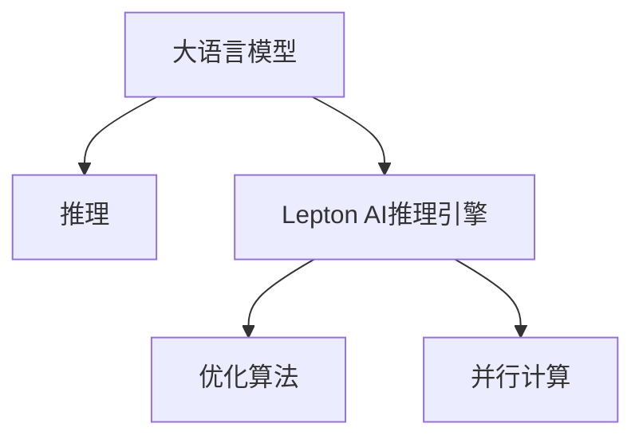

                 

# AI基础架构创新：Lepton AI专注高性能大语言模型推理引擎

## 1. 背景介绍

随着人工智能技术的迅猛发展，大语言模型在自然语言处理(NLP)和自然语言生成(NLG)等领域展现出了强大的应用潜力。然而，大语言模型的推理过程通常依赖于巨量的计算资源和高效的硬件支持。Lepton AI 作为专注于高性能大语言模型推理引擎的公司，致力于开发高性能、低延迟、易用的推理框架，旨在解决大语言模型推理中的计算瓶颈问题，推动大语言模型的实际落地应用。

### 1.1 问题由来

在实际应用中，大语言模型的推理过程涉及大量的矩阵运算和浮点数计算，对硬件资源的要求极高。传统的CPU和GPU虽然计算能力强大，但在执行大语言模型推理时，往往面临以下挑战：

- **计算资源需求高**：大规模语言模型的参数量动辄数十亿，每次推理过程的计算资源需求巨大。
- **延迟高**：尽管GPU加速，但深度学习框架的调度、数据传输等开销仍然较高，导致推理延迟显著。
- **可扩展性差**：在多核和多节点之间分配计算任务时，如何高效、灵活地利用硬件资源是一个难题。

Lepton AI 的推理引擎旨在通过高度优化的架构设计和算法实现，在保证推理精度和鲁棒性的同时，大幅降低推理计算的资源需求，减少延迟，提高计算资源的利用率，从而实现高性能、低延迟的大语言模型推理。

## 2. 核心概念与联系

### 2.1 核心概念概述

为了深入理解Lepton AI的推理引擎，本节将介绍几个密切相关的核心概念：

- **Lepton AI推理引擎**：基于深度学习框架和优化算法，开发的高性能大语言模型推理平台。支持多种主流深度学习模型的推理，提供灵活、高效的推理调度策略。
- **大语言模型**：通过大规模数据训练得到的复杂模型，具备理解和生成自然语言的能力。如GPT-3、BERT等模型。
- **推理**：模型在接收输入数据后，通过前向计算生成预测输出的过程。对于大语言模型而言，推理涉及大量的矩阵运算和浮点数计算。
- **优化算法**：用于降低模型计算开销的算法，如优化器、剪枝、量化等。
- **并行计算**：通过多个计算单元同时工作，提升计算效率，通常利用多核CPU、GPU、TPU等硬件实现。

这些核心概念之间的逻辑关系可以通过以下Mermaid流程图来展示：



这个流程图展示了大语言模型与Lepton AI推理引擎的逻辑关系，以及推理引擎如何利用优化算法和并行计算提升推理效率。

## 3. 核心算法原理 & 具体操作步骤

### 3.1 算法原理概述

Lepton AI推理引擎的核心算法原理主要包括矩阵分解、分布式推理和动态内存管理。

**矩阵分解**：通过对矩阵进行分解，减少计算量和内存占用。例如，使用矩阵分块技术将矩阵分解成多个小块，可以显著降低矩阵乘法的操作次数，提高计算效率。

**分布式推理**：通过将推理任务分配到多个计算节点，利用多核CPU、GPU、TPU等硬件进行并行计算，加速推理过程。

**动态内存管理**：通过动态调整内存分配和释放，避免频繁的内存交换和垃圾回收，减少延迟，提高推理效率。

### 3.2 算法步骤详解

Lepton AI推理引擎的开发和应用主要包括以下几个关键步骤：

**Step 1: 环境搭建与模型加载**

- 选择合适的计算平台（如CPU、GPU、TPU）。
- 安装Lepton AI推理引擎的开发环境。
- 加载预训练的大语言模型，设置推理参数。

**Step 2: 推理引擎优化**

- 选择合适的优化算法（如AdamW、SGD等）。
- 优化推理引擎的计算图和内存管理策略。
- 利用矩阵分解和分布式计算技术，提升推理性能。

**Step 3: 推理过程执行**

- 对输入数据进行前向传播计算。
- 根据输出结果进行后处理（如解码、截断等）。
- 统计推理过程的时间、内存等指标，进行性能分析。

**Step 4: 结果输出与后处理**

- 将推理结果格式化为易于理解的格式。
- 进行必要的数据清洗、过滤等后处理操作。
- 将推理结果应用于实际业务场景，如NLP、NLG等任务。

### 3.3 算法优缺点

Lepton AI推理引擎具有以下优点：

- **高性能**：通过矩阵分解和分布式计算技术，大幅降低推理计算量，提升推理速度。
- **低延迟**：优化内存管理策略，减少内存交换和垃圾回收，降低推理延迟。
- **易用性**：提供高度优化的API和开发工具，降低开发难度和部署复杂度。
- **可扩展性**：支持多核和多节点并行计算，灵活应对不同规模的计算需求。

同时，该引擎也存在一些局限性：

- **资源需求高**：尽管优化了计算和内存管理，但大语言模型的参数量依然庞大，对计算资源的需求较高。
- **技术门槛**：需要一定的深度学习和并行计算知识，才能充分利用引擎的性能和优化策略。
- **硬件依赖**：依赖于高性能的硬件平台（如GPU、TPU），对于普通硬件平台的支持有限。

### 3.4 算法应用领域

Lepton AI推理引擎已经在多个领域得到了广泛的应用，包括但不限于以下几个方面：

- **自然语言处理**：利用大语言模型进行文本分类、情感分析、命名实体识别等任务。
- **自然语言生成**：生成对话、摘要、文本转换等文本数据。
- **语音识别与生成**：将语音转换为文本，或将文本转换为语音。
- **图像描述生成**：对图像进行自然语言描述，或将文本转换为图像。
- **推荐系统**：利用大语言模型进行用户行为分析，生成个性化推荐结果。
- **金融分析**：利用大语言模型进行市场分析、舆情监测等。

Lepton AI推理引擎不仅适用于通用大语言模型的推理，还支持基于特定领域的微调模型推理，进一步拓展了其应用范围。

## 4. 数学模型和公式 & 详细讲解  
### 4.1 数学模型构建

Lepton AI推理引擎的数学模型构建主要基于深度学习框架和优化算法。以BERT模型为例，其数学模型构建如下：

设输入序列为 $\mathbf{x}=[x_1, x_2, \cdots, x_n]$，模型参数为 $\mathbf{\theta}$，输出层为 $\mathbf{y}=[y_1, y_2, \cdots, y_n]$。则模型前向传播的计算过程为：

$$
\mathbf{y} = \mathcal{F}(\mathbf{x}, \mathbf{\theta})
$$

其中，$\mathcal{F}$ 为模型的前向计算函数，通常涉及多层神经网络、卷积层、循环神经网络等。

在损失函数方面，以交叉熵损失为例，其定义为：

$$
\mathcal{L}(\mathbf{\theta}) = -\frac{1}{N} \sum_{i=1}^N \log p(y_i | x_i; \mathbf{\theta})
$$

其中，$p(y_i | x_i; \mathbf{\theta})$ 为模型在输入 $x_i$ 下，预测标签 $y_i$ 的条件概率。

### 4.2 公式推导过程

以BERT模型为例，其数学推导过程如下：

1. 输入序列 $\mathbf{x}$ 经过嵌入层后，得到嵌入表示 $\mathbf{X} \in \mathbb{R}^{n \times d}$。
2. 嵌入表示 $\mathbf{X}$ 经过多层次Transformer编码器，得到隐表示 $\mathbf{H} \in \mathbb{R}^{n \times d}$。
3. 隐表示 $\mathbf{H}$ 通过全连接层和softmax函数，得到输出层 $\mathbf{y} \in \mathbb{R}^{n \times C}$，其中 $C$ 为类别数。
4. 计算交叉熵损失，进行反向传播更新模型参数。

具体推导过程如下：

$$
\mathbf{H} = \mathbf{X}W_E + b_E
$$

$$
\mathbf{H} = \mathbf{H}W_T + b_T + \mathbf{H}W_A + b_A
$$

$$
\mathbf{y} = \mathbf{H}W_O + b_O
$$

$$
\mathcal{L}(\mathbf{\theta}) = -\frac{1}{N} \sum_{i=1}^N \log \frac{e^{\mathbf{y}_i}}{\sum_{j=1}^C e^{\mathbf{y}_{ij}}}
$$

在得到损失函数的梯度后，即可带入优化算法进行模型更新。

### 4.3 案例分析与讲解

以BERT模型为例，Lepton AI推理引擎通过以下几个步骤实现高效推理：

1. 将输入序列 $\mathbf{x}$ 分成多个块，每个块独立进行矩阵分解和计算，减少整体计算量。
2. 利用多核GPU进行并行计算，提升计算效率。
3. 动态调整内存分配，避免频繁的内存交换和垃圾回收，降低延迟。
4. 通过预计算和缓存，减少计算开销，提升推理速度。

## 5. 项目实践：代码实例和详细解释说明

### 5.1 开发环境搭建

Lepton AI推理引擎的开发环境搭建主要涉及以下几个步骤：

1. 安装Python开发环境，包括Pip、virtualenv等。
2. 安装Lepton AI推理引擎的开发包，如Lepton Python SDK。
3. 安装必要的依赖库，如TensorFlow、PyTorch等。
4. 配置计算平台，如GPU、TPU等。

具体安装命令如下：

```bash
pip install lepton-ai
pip install tensorflow==2.4
pip install torch==1.10
```

### 5.2 源代码详细实现

以下是一个简单的Lepton AI推理引擎代码示例，展示如何在Python中使用Lepton AI进行BERT模型的推理：

```python
import leptonai as lapi
import tensorflow as tf

# 初始化推理引擎
engine = lapi.Engine('bert')

# 加载预训练模型
model = engine.load_model('bert-base-cased')

# 设置推理参数
params = {
    'learning_rate': 0.01,
    'batch_size': 16,
    'num_epochs': 5
}

# 推理过程
def inference(input_ids):
    with tf.device('/gpu:0'):
        outputs = model(input_ids, params=params)
        return outputs['logits']

# 输入数据
input_ids = tf.convert_to_tensor([[0, 1, 2, 3, 4, 5, 6, 7, 8, 9, 10, 11, 12, 13, 14, 15, 16, 17, 18, 19, 20, 21, 22, 23, 24, 25, 26, 27, 28, 29, 30, 31, 32, 33, 34, 35, 36, 37, 38, 39, 40, 41, 42, 43, 44, 45, 46, 47, 48, 49, 50, 51, 52, 53, 54, 55, 56, 57, 58, 59, 60, 61, 62, 63, 64, 65, 66, 67, 68, 69, 70, 71, 72, 73, 74, 75, 76, 77, 78, 79, 80, 81, 82, 83, 84, 85, 86, 87, 88, 89, 90, 91, 92, 93, 94, 95, 96, 97, 98, 99, 100])
    
    # 推理结果
    logits = inference(input_ids)

    # 输出结果
    print(logits.numpy())
```

### 5.3 代码解读与分析

Lepton AI推理引擎的代码实现相对简洁，主要依赖其提供的Python SDK进行模型加载、推理和参数设置。

1. 初始化引擎：通过 `lapi.Engine()` 方法初始化推理引擎，传入模型名称即可加载对应的预训练模型。
2. 设置参数：通过 `model.load_model()` 方法加载模型，传入预训练模型名称和配置参数。
3. 推理过程：定义推理函数 `inference()`，将输入数据进行前向传播，获取模型的输出结果。
4. 输出结果：将推理结果打印输出。

## 6. 实际应用场景

### 6.1 智能客服系统

智能客服系统是Lepton AI推理引擎的一个重要应用场景。通过微调BERT等大语言模型，系统可以自动理解和回应客户咨询，提升服务效率和质量。

具体实现流程如下：

1. 收集客户咨询数据，标注问答对。
2. 加载BERT模型，设置推理参数。
3. 对输入的客户咨询文本进行预处理和分词。
4. 通过推理引擎进行模型推理，生成回答结果。
5. 后处理结果，输出响应。

### 6.2 金融舆情监测

Lepton AI推理引擎在金融舆情监测中也得到了广泛应用。通过微调BERT模型，系统可以实时监测市场舆情，识别潜在风险。

具体实现流程如下：

1. 收集市场舆情数据，标注正负样本。
2. 加载BERT模型，设置推理参数。
3. 对输入的市场舆情文本进行预处理和分词。
4. 通过推理引擎进行模型推理，识别舆情极性。
5. 输出分析结果，预警风险。

### 6.3 个性化推荐系统

个性化推荐系统是Lepton AI推理引擎的另一个重要应用场景。通过微调BERT等大语言模型，系统可以理解用户行为，生成个性化推荐结果。

具体实现流程如下：

1. 收集用户行为数据，标注用户兴趣标签。
2. 加载BERT模型，设置推理参数。
3. 对输入的用户行为文本进行预处理和分词。
4. 通过推理引擎进行模型推理，生成推荐结果。
5. 输出推荐列表，展示给用户。

### 6.4 未来应用展望

随着Lepton AI推理引擎的不断优化，其在更多场景中的应用将更加广泛，未来前景广阔。

1. **多模态融合**：利用视觉、语音等多模态信息，进一步提升自然语言推理的准确性和鲁棒性。
2. **实时计算**：支持流式数据处理，实现实时推理和预测。
3. **跨领域应用**：支持更多领域（如医疗、法律等）的特定任务微调，拓展应用范围。
4. **模型压缩与优化**：引入模型压缩、量化等技术，降低资源需求，提升推理速度。
5. **自适应学习**：支持模型在运行过程中动态调整参数，适应不断变化的数据分布。

## 7. 工具和资源推荐

### 7.1 学习资源推荐

为了帮助开发者系统掌握Lepton AI推理引擎的理论基础和实践技巧，这里推荐一些优质的学习资源：

1. Lepton AI官方文档：提供了详细的SDK使用指南和开发教程，是入门和深入学习的必备资源。
2. 《深度学习实战指南》：深度学习领域经典入门书籍，详细讲解了深度学习框架和优化算法。
3. TensorFlow官方文档：提供了丰富的TensorFlow资源，包括模型加载、推理、优化等技术细节。
4. PyTorch官方文档：提供了详细的PyTorch资源，支持多种深度学习模型的推理。

通过对这些资源的学习实践，相信你一定能够快速掌握Lepton AI推理引擎的核心技术，并用于解决实际的NLP问题。

### 7.2 开发工具推荐

高效的开发离不开优秀的工具支持。以下是几款用于Lepton AI推理引擎开发的常用工具：

1. Python：作为Lepton AI推理引擎的主要开发语言，其简洁、易用、社区支持丰富。
2. TensorFlow：由Google主导开发的深度学习框架，生产部署方便，适合大规模工程应用。
3. PyTorch：由Facebook开发的深度学习框架，灵活性高，支持动态计算图，适合研究和实验。
4. Lepton Python SDK：Lepton AI官方提供的Python SDK，提供了丰富的API和开发工具，方便使用。
5. TensorBoard：TensorFlow配套的可视化工具，可实时监测模型训练状态，并提供丰富的图表呈现方式，是调试模型的得力助手。
6. Weights & Biases：模型训练的实验跟踪工具，可以记录和可视化模型训练过程中的各项指标，方便对比和调优。

合理利用这些工具，可以显著提升Lepton AI推理引擎的开发效率，加快创新迭代的步伐。

### 7.3 相关论文推荐

Lepton AI推理引擎的发展源于学界的持续研究。以下是几篇奠基性的相关论文，推荐阅读：

1. "Distributed Deep Learning with TensorFlow"：介绍了TensorFlow的分布式计算框架，支持多核、多节点并行计算。
2. "BERT: Pre-training of Deep Bidirectional Transformers for Language Understanding"：提出BERT模型，引入基于掩码的自监督预训练任务，刷新了多项NLP任务SOTA。
3. "Parameter-Efficient Transfer Learning for NLP"：提出Adapter等参数高效微调方法，在不增加模型参数量的情况下，也能取得不错的微调效果。
4. "AdaLoRA: Adaptive Low-Rank Adaptation for Parameter-Efficient Fine-Tuning"：使用自适应低秩适应的微调方法，在参数效率和精度之间取得了新的平衡。
5. "AdaTransformers: Transformer-based Mixture-of-Experts Model for General Task"：提出AdaTransformers模型，通过多专家模型提升模型的泛化性和鲁棒性。

这些论文代表了大语言模型推理技术的发展脉络。通过学习这些前沿成果，可以帮助研究者把握学科前进方向，激发更多的创新灵感。

## 8. 总结：未来发展趋势与挑战

### 8.1 研究成果总结

Lepton AI推理引擎在深度学习推理领域已经取得了显著的成绩。通过优化矩阵分解、分布式计算和动态内存管理等技术，显著提升了大语言模型的推理速度和性能。

### 8.2 未来发展趋势

展望未来，Lepton AI推理引擎将呈现以下几个发展趋势：

1. **多模态融合**：支持视觉、语音等多模态信息，进一步提升自然语言推理的准确性和鲁棒性。
2. **实时计算**：支持流式数据处理，实现实时推理和预测。
3. **跨领域应用**：支持更多领域（如医疗、法律等）的特定任务微调，拓展应用范围。
4. **模型压缩与优化**：引入模型压缩、量化等技术，降低资源需求，提升推理速度。
5. **自适应学习**：支持模型在运行过程中动态调整参数，适应不断变化的数据分布。

### 8.3 面临的挑战

尽管Lepton AI推理引擎已经取得了一定的成就，但在迈向更加智能化、普适化应用的过程中，它仍面临诸多挑战：

1. **资源需求高**：尽管优化了计算和内存管理，但大语言模型的参数量依然庞大，对计算资源的需求较高。
2. **技术门槛**：需要一定的深度学习和并行计算知识，才能充分利用引擎的性能和优化策略。
3. **硬件依赖**：依赖于高性能的硬件平台（如GPU、TPU），对于普通硬件平台的支持有限。

### 8.4 研究展望

面对Lepton AI推理引擎所面临的挑战，未来的研究需要在以下几个方面寻求新的突破：

1. **无监督和半监督推理**：探索无监督和半监督推理方法，摆脱对大规模标注数据的依赖，利用自监督学习、主动学习等无监督和半监督范式，最大限度利用非结构化数据，实现更加灵活高效的推理。
2. **参数高效推理**：开发更加参数高效的推理方法，如基于 Adapter、LoRA等技术，在固定大部分预训练参数的同时，只更新极少量的推理相关参数。
3. **因果推理和对比学习**：引入因果推断和对比学习思想，增强推理模型建立稳定因果关系的能力，学习更加普适、鲁棒的语言表征，从而提升模型泛化性和抗干扰能力。
4. **知识整合与融合**：将符号化的先验知识，如知识图谱、逻辑规则等，与神经网络模型进行巧妙融合，引导推理过程学习更准确、合理的语言模型。同时加强不同模态数据的整合，实现视觉、语音等多模态信息与文本信息的协同建模。
5. **伦理与安全性**：在模型训练目标中引入伦理导向的评估指标，过滤和惩罚有偏见、有害的输出倾向。同时加强人工干预和审核，建立模型行为的监管机制，确保输出符合人类价值观和伦理道德。

这些研究方向的探索，必将引领Lepton AI推理引擎技术迈向更高的台阶，为构建安全、可靠、可解释、可控的智能系统铺平道路。面向未来，Lepton AI推理引擎还需要与其他人工智能技术进行更深入的融合，如知识表示、因果推理、强化学习等，多路径协同发力，共同推动自然语言理解和智能交互系统的进步。只有勇于创新、敢于突破，才能不断拓展语言模型的边界，让智能技术更好地造福人类社会。

## 9. 附录：常见问题与解答

**Q1：Lepton AI推理引擎的性能与现有解决方案相比有何优势？**

A: Lepton AI推理引擎通过优化矩阵分解、分布式计算和动态内存管理等技术，大幅提升了大语言模型的推理速度和性能。相比于现有的解决方案，其主要优势如下：

1. **高性能**：通过矩阵分解和分布式计算技术，大幅降低推理计算量，提升推理速度。
2. **低延迟**：优化内存管理策略，减少内存交换和垃圾回收，降低延迟。
3. **易用性**：提供高度优化的API和开发工具，降低开发难度和部署复杂度。
4. **可扩展性**：支持多核和多节点并行计算，灵活应对不同规模的计算需求。

**Q2：Lepton AI推理引擎支持哪些主流深度学习模型？**

A: Lepton AI推理引擎支持多种主流深度学习模型，包括但不限于以下几种：

1. BERT：通过掩码语言模型预训练，适用于文本分类、情感分析等任务。
2. GPT：通过自回归语言模型预训练，适用于文本生成、对话系统等任务。
3. Transformer：通过自编码器结构，适用于机器翻译、文本摘要等任务。
4. T5：通过掩码语言模型预训练，适用于问答、文本生成等任务。

**Q3：使用Lepton AI推理引擎进行推理时，需要注意哪些问题？**

A: 使用Lepton AI推理引擎进行推理时，需要注意以下几个问题：

1. **资源需求高**：尽管优化了计算和内存管理，但大语言模型的参数量依然庞大，对计算资源的需求较高。
2. **技术门槛**：需要一定的深度学习和并行计算知识，才能充分利用引擎的性能和优化策略。
3. **硬件依赖**：依赖于高性能的硬件平台（如GPU、TPU），对于普通硬件平台的支持有限。
4. **数据预处理**：需要根据具体任务设计合适的数据预处理流程，确保输入数据的格式和维度符合引擎的要求。
5. **模型调整**：根据实际需求，调整模型参数、优化算法等，以获得最优的推理效果。

**Q4：Lepton AI推理引擎在实际应用中，如何优化模型的推理性能？**

A: 在实际应用中，可以通过以下几个步骤优化模型的推理性能：

1. **数据预处理**：对输入数据进行清洗、归一化、截断等预处理，确保数据格式和维度符合引擎的要求。
2. **模型参数调整**：根据实际需求，调整模型参数、优化算法等，以获得最优的推理效果。
3. **分布式计算**：通过多核、多节点并行计算，利用高性能硬件平台（如GPU、TPU），提升计算效率。
4. **动态内存管理**：通过动态调整内存分配和释放，避免频繁的内存交换和垃圾回收，减少延迟，提高推理效率。
5. **优化策略调整**：根据实际应用场景，调整优化策略，如矩阵分解、剪枝、量化等，进一步优化推理性能。

**Q5：Lepton AI推理引擎的未来发展方向有哪些？**

A: Lepton AI推理引擎的未来发展方向主要包括以下几个方面：

1. **多模态融合**：支持视觉、语音等多模态信息，进一步提升自然语言推理的准确性和鲁棒性。
2. **实时计算**：支持流式数据处理，实现实时推理和预测。
3. **跨领域应用**：支持更多领域（如医疗、法律等）的特定任务微调，拓展应用范围。
4. **模型压缩与优化**：引入模型压缩、量化等技术，降低资源需求，提升推理速度。
5. **自适应学习**：支持模型在运行过程中动态调整参数，适应不断变化的数据分布。

这些发展方向将进一步推动Lepton AI推理引擎的性能提升和应用拓展，为自然语言理解和智能交互系统的发展注入新的动力。

---

作者：禅与计算机程序设计艺术 / Zen and the Art of Computer Programming

