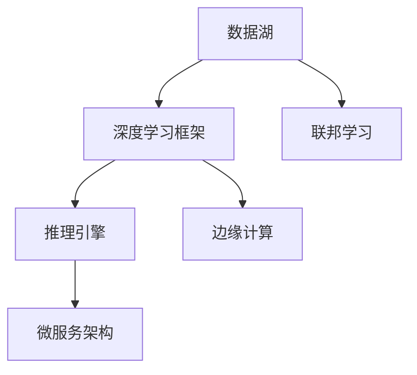

                 

# AI基础设施的未来十年：Lepton AI的长期规划

> 关键词：AI基础设施, Lepton AI, 长期规划, 技术演进, 技术发展, 应用落地

## 1. 背景介绍

### 1.1 问题的由来
近年来，人工智能(AI)技术在各行各业的应用越来越广泛，尤其是AI基础设施的发展，极大地推动了AI技术的进步和应用落地。AI基础设施包括数据管理、模型训练、推理服务等多个方面，是一个复杂且不断发展的系统。

### 1.2 问题核心关键点
AI基础设施的核心目标是实现AI技术的规模化、自动化和普适化。其主要任务包括：

1. 数据高效管理：确保数据高质量、高可用性，支持多源数据的融合和存储。
2. 模型高效训练：通过优化训练过程，提升模型精度和训练效率，降低计算资源消耗。
3. 服务高效推理：提供高性能、低延迟的推理服务，满足不同场景的实时需求。
4. 用户友好接口：提供简单易用的API和工具，支持跨学科、跨领域的AI开发和应用。

本文将从Lepton AI的角度，探讨AI基础设施在未来十年的发展趋势和长期规划，帮助读者深入理解AI基础设施的核心概念和技术演进。

## 2. 核心概念与联系

### 2.1 核心概念概述

为更好地理解AI基础设施的未来发展，本节将介绍几个关键核心概念：

- AI基础设施：指支持AI技术开发、训练、部署和运维的基础设施系统，包括数据管理、模型训练、推理服务等。
- 数据湖(Data Lake)：一种大容量、高性能的数据管理技术，支持多源异构数据的融合存储和高效访问。
- 深度学习框架(Deep Learning Framework)：如TensorFlow、PyTorch等，用于支持AI模型的训练和推理。
- 联邦学习(Federated Learning)：一种分布式机器学习技术，允许多个设备在不共享原始数据的前提下协同学习。
- 推理引擎(Inference Engine)：如ONNX Runtime、TensorRT等，提供高性能、低延迟的推理服务，支持模型在多种硬件平台上的高效运行。
- 微服务架构(Microservices Architecture)：一种现代软件架构模式，将复杂系统拆分成多个小服务，提升系统的可扩展性和维护性。
- 边缘计算(Edge Computing)：将计算和数据存储从中心服务器迁移到靠近用户的边缘设备，降低延迟，提高响应速度。

这些核心概念之间的逻辑关系可以通过以下Mermaid流程图来展示：



这个流程图展示了大规模AI基础设施的核心组件及其相互关系：

1. 数据湖负责数据的高效管理。
2. 深度学习框架支持模型的高效训练和推理。
3. 联邦学习允许多设备协同学习。
4. 推理引擎提供高性能的推理服务。
5. 微服务架构提升系统的可扩展性和维护性。
6. 边缘计算将计算和存储下放到靠近用户的设备上。

这些概念共同构成了AI基础设施的核心框架，为其未来十年的演进提供了明确的方向。

## 3. 核心算法原理 & 具体操作步骤
### 3.1 算法原理概述

AI基础设施的核心算法原理主要集中在数据管理、模型训练和推理服务三个方面：

- 数据管理：包括数据收集、清洗、存储、检索等，通过分布式存储和索引技术实现大规模数据的高效管理。
- 模型训练：通过优化算法和并行计算技术，提升模型训练效率和精度，支持大规模模型的训练。
- 推理服务：通过高效推理引擎和模型压缩技术，降低推理计算资源消耗，提供高性能的推理服务。

### 3.2 算法步骤详解

AI基础设施的构建和优化主要包括以下几个关键步骤：

**Step 1: 数据管理系统的构建**
- 选择合适的分布式存储技术，如Hadoop、Spark等，构建大规模数据湖。
- 设计数据治理和质量管理机制，确保数据的完整性、一致性和安全性。
- 引入索引和搜索技术，支持高效的数据检索和分析。

**Step 2: 模型训练框架的优化**
- 选择合适的深度学习框架，如TensorFlow、PyTorch等，优化模型的训练过程。
- 引入分布式训练技术，支持大规模模型的并行训练。
- 使用自动混合精度、模型剪枝等技术，提升模型训练效率和精度。

**Step 3: 推理引擎的部署**
- 选择合适的推理引擎，如ONNX Runtime、TensorRT等，优化模型的推理过程。
- 引入模型压缩技术，如权重剪枝、量化等，降低推理计算资源消耗。
- 设计高性能计算集群，提供低延迟、高吞吐量的推理服务。

**Step 4: 微服务架构的实现**
- 将系统拆分成多个小服务，如数据管理服务、模型训练服务、推理服务等。
- 设计API和接口，支持跨学科、跨领域的AI开发和应用。
- 引入容器化和Kubernetes等技术，提升系统的可扩展性和管理性。

**Step 5: 边缘计算的部署**
- 在靠近用户的边缘设备上部署计算和存储资源，降低延迟，提高响应速度。
- 引入雾计算和边缘计算技术，支持实时数据处理和本地推理。
- 设计安全机制，确保边缘设备上的数据和模型安全。

通过这些步骤，可以有效构建高效、可靠的AI基础设施，支持AI技术的规模化、自动化和普适化。

### 3.3 算法优缺点

AI基础设施构建的优点在于：

1. 高效管理数据：通过分布式存储和索引技术，实现大规模数据的高效管理。
2. 提升模型精度：通过分布式训练和模型压缩技术，提升模型精度和训练效率。
3. 提供高性能推理：通过高效的推理引擎和模型压缩技术，降低推理计算资源消耗。
4. 支持跨学科应用：通过微服务架构和API设计，支持跨学科、跨领域的AI开发和应用。
5. 提升用户体验：通过边缘计算，降低延迟，提高响应速度。

然而，AI基础设施构建也面临一些挑战：

1. 数据质量管理：数据清洗和质量管理是一个复杂且耗时的过程，需要大量人工干预。
2. 计算资源消耗：大规模模型训练和推理需要大量的计算资源，成本较高。
3. 系统复杂度：微服务架构和边缘计算增加了系统的复杂度和维护难度。
4. 安全性问题：边缘设备上的数据和模型可能面临安全隐患。

通过合理的策略和工具，可以有效应对这些挑战，提升AI基础设施的可靠性、可用性和安全性。

### 3.4 算法应用领域

AI基础设施的应用领域广泛，包括但不限于以下几个方面：

- 智能医疗：通过AI基础设施，支持医疗影像分析、疾病预测、个性化治疗等应用。
- 智能制造：通过AI基础设施，支持智能工厂、质量检测、设备维护等应用。
- 智能交通：通过AI基础设施，支持交通流量预测、智能驾驶、交通管理等应用。
- 智能安防：通过AI基础设施，支持视频监控、人脸识别、异常检测等应用。
- 智能客服：通过AI基础设施，支持智能客服、语音识别、文本分析等应用。
- 智能推荐：通过AI基础设施，支持个性化推荐、内容分发、广告投放等应用。
- 智能游戏：通过AI基础设施，支持游戏智能、虚拟角色、自动匹配等应用。

未来，随着AI技术的不断进步，AI基础设施的应用领域将更加广泛，推动各行各业数字化转型升级。

## 4. 数学模型和公式 & 详细讲解  
### 4.1 数学模型构建

本节将使用数学语言对AI基础设施的核心算法原理进行更加严格的刻画。

记数据湖容量为 $D$，分布式存储技术的效率为 $E$，深度学习框架的训练效率为 $T$，推理引擎的推理效率为 $I$，微服务架构的扩展性为 $S$，边缘计算的延迟为 $L$。

则AI基础设施的总性能可以表示为：

$$
P = \frac{D}{E} \times \frac{T}{L} \times \frac{I}{S}
$$

其中：
- $D$ 为数据湖容量，表示数据存储和处理能力。
- $E$ 为分布式存储技术的效率，表示数据管理能力。
- $T$ 为深度学习框架的训练效率，表示模型训练能力。
- $I$ 为推理引擎的推理效率，表示推理服务能力。
- $S$ 为微服务架构的扩展性，表示系统可维护性和可扩展性。
- $L$ 为边缘计算的延迟，表示边缘设备的响应速度。

### 4.2 公式推导过程

为了优化上述性能模型，可以从以下几个方面入手：

1. **数据管理优化**：通过引入高效的数据存储和索引技术，提升 $E$ 值。
2. **模型训练优化**：通过分布式训练和模型压缩技术，提升 $T$ 值。
3. **推理服务优化**：通过高效的推理引擎和模型压缩技术，提升 $I$ 值。
4. **系统架构优化**：通过微服务架构和容器化技术，提升 $S$ 值。
5. **边缘计算优化**：通过合理的边缘设备部署和边缘计算技术，提升 $L$ 值。

具体的优化策略和算法选择，需根据具体应用场景和需求进行详细设计和实施。

### 4.3 案例分析与讲解

以智能医疗为例，分析AI基础设施的应用和优化策略：

- **数据管理**：医疗数据具有海量、高维度、隐私性强等特点，需要高效的数据管理和隐私保护机制。可以引入数据湖技术，建立安全、高效的医疗数据仓库。
- **模型训练**：医疗影像分析等任务需要高精度模型，计算资源消耗大。可以采用分布式深度学习框架，提升训练效率，并引入模型压缩技术，降低计算成本。
- **推理服务**：实时医疗影像分析和诊断需要低延迟推理服务。可以部署高效的推理引擎，如ONNX Runtime，优化推理过程，并引入边缘计算技术，降低延迟。
- **系统架构**：医疗系统复杂，需要支持跨学科应用。可以采用微服务架构，设计API和接口，支持多学科合作。
- **边缘计算**：远程医疗需要高效的数据处理和推理服务。可以在移动设备或边缘设备上部署模型和数据处理服务，提供实时响应。

通过这些优化策略，可以实现高性能、高可靠性的AI医疗基础设施，支持智能医疗应用落地。

## 5. 项目实践：代码实例和详细解释说明
### 5.1 开发环境搭建

在进行AI基础设施项目开发前，我们需要准备好开发环境。以下是使用Python进行Dask开发的环境配置流程：

1. 安装Anaconda：从官网下载并安装Anaconda，用于创建独立的Python环境。

2. 创建并激活虚拟环境：
```bash
conda create -n ai-env python=3.8 
conda activate ai-env
```

3. 安装Dask：
```bash
pip install dask[complete]
```

4. 安装各类工具包：
```bash
pip install pandas numpy scikit-learn dask[complete]
```

完成上述步骤后，即可在`ai-env`环境中开始AI基础设施项目开发。

### 5.2 源代码详细实现

下面我们以数据湖和深度学习框架为例，给出使用Dask进行数据管理和深度学习开发的PyTorch代码实现。

首先，定义数据湖类：

```python
from dask.distributed import Client
from dask.dataframe import DataFrame
from dask_ml.model_selection import train_test_split

class DataLake:
    def __init__(self, client):
        self.client = client
        self.df = None

    def load_data(self, filename):
        self.df = DataFrame.read_csv(filename)

    def clean_data(self):
        # 数据清洗和预处理逻辑
        pass

    def split_data(self, test_size=0.2):
        self.train_df, self.test_df = train_test_split(self.df, test_size=test_size)

    def save_data(self, filename):
        self.df.to_csv(filename)
```

然后，定义深度学习训练类：

```python
import torch
from torch import nn
from torch.utils.data import DataLoader
from dask.dataframe import from_pandas

class DeepLearningModel(nn.Module):
    def __init__(self, input_size, hidden_size, output_size):
        super(DeepLearningModel, self).__init__()
        self.fc1 = nn.Linear(input_size, hidden_size)
        self.fc2 = nn.Linear(hidden_size, output_size)

    def forward(self, x):
        x = self.fc1(x)
        x = nn.ReLU()(x)
        x = self.fc2(x)
        return x

    def train(self, train_data, test_data, batch_size, num_epochs, learning_rate):
        train_loader = DataLoader(train_data, batch_size=batch_size)
        test_loader = DataLoader(test_data, batch_size=batch_size)

        optimizer = torch.optim.Adam(self.parameters(), lr=learning_rate)

        for epoch in range(num_epochs):
            for batch in train_loader:
                inputs, labels = batch
                optimizer.zero_grad()
                outputs = self(inputs)
                loss = nn.CrossEntropyLoss()(outputs, labels)
                loss.backward()
                optimizer.step()

            test_loss = 0
            with torch.no_grad():
                for batch in test_loader:
                    inputs, labels = batch
                    outputs = self(inputs)
                    test_loss += nn.CrossEntropyLoss()(outputs, labels).item()
            test_loss /= len(test_loader.dataset)
            print(f"Epoch {epoch+1}, test loss: {test_loss:.4f}")
```

最后，启动数据湖和深度学习训练流程：

```python
# 启动Dask Client
client = Client(scheduler='distributed')
dl = DataLake(client)

# 加载和清洗数据
dl.load_data('data.csv')
dl.clean_data()

# 划分数据集
dl.split_data()

# 转换DataFrame为Dask DataFrame
dask_df = dl.df.map_partitions(lambda df: df)

# 训练深度学习模型
model = DeepLearningModel(input_size=10, hidden_size=20, output_size=5)
model.train(dask_df, dl.test_df, batch_size=32, num_epochs=10, learning_rate=0.001)
```

以上就是使用Dask进行数据管理和深度学习开发的完整代码实现。可以看到，Dask的分布式计算和数据管理功能，使得数据湖和深度学习模型的构建更加高效。

### 5.3 代码解读与分析

让我们再详细解读一下关键代码的实现细节：

**DataLake类**：
- `__init__`方法：初始化Dask Client和DataFrame。
- `load_data`方法：从文件加载数据到DataFrame中。
- `clean_data`方法：进行数据清洗和预处理。
- `split_data`方法：将数据集划分为训练集和测试集。
- `save_data`方法：将DataFrame保存到文件中。

**DeepLearningModel类**：
- `__init__`方法：初始化深度学习模型。
- `forward`方法：定义前向传播过程。
- `train`方法：定义模型的训练过程，使用Dask DataLoader进行数据加载。

**训练流程**：
- 启动Dask Client，创建DataLake对象。
- 加载和清洗数据，将DataFrame转换为Dask DataFrame。
- 划分数据集。
- 训练深度学习模型，使用Dask DataLoader加载数据，优化训练过程。

可以看到，Dask的分布式计算和数据管理功能，使得数据湖和深度学习模型的构建更加高效。开发者可以充分利用Dask的能力，提升项目开发效率和性能。

## 6. 实际应用场景
### 6.1 智能医疗

AI基础设施在智能医疗领域的应用前景广阔。通过AI基础设施，可以实现医疗数据的集中管理和高效分析，支持医疗影像分析、疾病预测、个性化治疗等应用。

在实际应用中，可以通过构建数据湖，集中存储和管理医疗数据。引入深度学习框架，训练高精度的医疗影像分析模型。部署高效的推理引擎，提供实时医疗影像分析和诊断服务。通过微服务架构，支持跨学科合作。引入边缘计算技术，提供远程医疗支持。

未来，随着AI基础设施的不断优化，智能医疗将更加高效、智能，为人类健康提供更全面的保障。

### 6.2 智能制造

AI基础设施在智能制造领域的应用同样重要。通过AI基础设施，可以实现生产线的智能化、自动化，提升生产效率和产品质量。

在实际应用中，可以通过数据湖技术，集中存储和管理生产数据。引入深度学习框架，训练智能制造的预测和优化模型。部署高效的推理引擎，提供实时生产过程监控和优化服务。通过微服务架构，支持跨部门合作。引入边缘计算技术，提供工厂自动化和设备维护支持。

未来，随着AI基础设施的不断优化，智能制造将更加智能化、高效化，推动制造业的数字化转型升级。

### 6.3 智能交通

AI基础设施在智能交通领域的应用前景广阔。通过AI基础设施，可以实现交通流量预测、智能驾驶、交通管理等应用。

在实际应用中，可以通过数据湖技术，集中存储和管理交通数据。引入深度学习框架，训练交通流量预测和智能驾驶模型。部署高效的推理引擎，提供实时交通流量分析和预测服务。通过微服务架构，支持跨部门合作。引入边缘计算技术，提供实时交通管理和智能驾驶支持。

未来，随着AI基础设施的不断优化，智能交通将更加智能化、安全化，提升城市交通管理水平。

### 6.4 未来应用展望

未来，随着AI基础设施的不断演进，将呈现以下几个发展趋势：

1. **大数据技术的应用**：随着大数据技术的不断发展，AI基础设施将更加高效、智能，支持更大规模数据的处理和分析。
2. **深度学习框架的优化**：未来深度学习框架将更加高效、灵活，支持更多的深度学习算法和模型。
3. **联邦学习的应用**：联邦学习将使AI基础设施支持多设备协同学习，提升模型的泛化能力和安全性。
4. **边缘计算的普及**：边缘计算将使AI基础设施支持实时数据处理和推理服务，提升系统的响应速度和可靠性。
5. **微服务架构的完善**：微服务架构将使AI基础设施支持跨学科、跨领域的合作，提升系统的可扩展性和维护性。

以上趋势将推动AI基础设施的不断演进，为各行各业带来更多的智能化、自动化和普适化的应用场景。

## 7. 工具和资源推荐
### 7.1 学习资源推荐

为了帮助开发者深入理解AI基础设施的构建和优化，这里推荐一些优质的学习资源：

1. 《分布式系统原理与设计》书籍：深入讲解分布式系统设计原理，是构建高效、可靠AI基础设施的基础。
2. 《深度学习入门》书籍：介绍深度学习框架的使用和优化策略，支持AI模型的高效训练和推理。
3. 《Kubernetes: 分布式系统管理实践》书籍：介绍Kubernetes在AI基础设施中的应用，提升系统的可扩展性和管理性。
4. 《TensorFlow官方文档》：提供TensorFlow的详细使用方法和优化策略，支持深度学习框架的部署和优化。
5. 《ONNX官方文档》：提供ONNX Runtime的使用和优化策略，支持高效的推理服务部署。
6. 《Dask官方文档》：提供Dask的详细使用方法和优化策略，支持分布式计算和数据管理。

通过学习这些资源，相信你一定能够全面掌握AI基础设施的构建和优化，提升AI技术的开发和应用水平。

### 7.2 开发工具推荐

高效的开发离不开优秀的工具支持。以下是几款用于AI基础设施开发的常用工具：

1. Jupyter Notebook：开源的交互式计算环境，支持Python、R等多种语言，适合开发和实验。
2. PyCharm：开源的Python开发工具，提供代码高亮、调试、自动化测试等功能，支持大规模项目开发。
3. Anaconda：Python环境管理工具，支持虚拟环境、包管理等功能，方便Python开发。
4. TensorFlow：开源深度学习框架，提供高效的计算图和优化策略，支持大规模模型训练和推理。
5. PyTorch：开源深度学习框架，提供动态计算图和灵活的API，支持高效模型构建和优化。
6. Kubernetes：开源容器编排工具，提供自动化部署、扩展、管理等功能，支持大规模集群管理。
7. ONNX Runtime：开源推理引擎，支持多种硬件平台和优化策略，提供高效的推理服务。
8. Dask：开源分布式计算框架，提供高效的数据管理和计算功能，支持大规模数据处理和计算。

合理利用这些工具，可以显著提升AI基础设施的开发效率和性能，加速AI技术的落地应用。

### 7.3 相关论文推荐

AI基础设施的研究源于学界的持续探索。以下是几篇奠基性的相关论文，推荐阅读：

1. "Distributed Deep Learning: Pitfalls, Challenges, and Advances"论文：介绍分布式深度学习的挑战和优化策略，支持大规模模型训练。
2. "Big Data Processing with Apache Spark: Solutions and Advances"论文：介绍Apache Spark在大数据处理中的应用和优化策略，支持高效的数据管理和分析。
3. "Kubernetes: A Distributed Systems Control Plane"论文：介绍Kubernetes在分布式系统中的控制和管理功能，支持大规模集群管理。
4. "ONNX: Extending an Open Standard for Machine Learning Models and Data Interchange"论文：介绍ONNX在模型优化和推理服务中的应用，支持高效的推理服务部署。
5. "Deep Learning: A Tutorial"论文：介绍深度学习的基本概念和算法，支持AI模型的构建和优化。

这些论文代表了AI基础设施研究的最新进展，帮助读者深入理解技术的演进和优化策略。

## 8. 总结：未来发展趋势与挑战
### 8.1 总结

本文对AI基础设施的未来十年进行了全面系统的介绍。首先，介绍了AI基础设施的核心概念和技术演进，明确了其重要性和发展方向。其次，从Lepton AI的角度，探讨了AI基础设施的未来发展趋势和长期规划，帮助读者深入理解AI基础设施的构建和优化。

通过本文的系统梳理，可以看到，AI基础设施正在成为支撑AI技术发展的关键基础设施，其发展方向和演进路径具有深远意义。

### 8.2 未来发展趋势

展望未来，AI基础设施的发展趋势如下：

1. **大数据技术的应用**：随着大数据技术的不断发展，AI基础设施将更加高效、智能，支持更大规模数据的处理和分析。
2. **深度学习框架的优化**：未来深度学习框架将更加高效、灵活，支持更多的深度学习算法和模型。
3. **联邦学习的应用**：联邦学习将使AI基础设施支持多设备协同学习，提升模型的泛化能力和安全性。
4. **边缘计算的普及**：边缘计算将使AI基础设施支持实时数据处理和推理服务，提升系统的响应速度和可靠性。
5. **微服务架构的完善**：微服务架构将使AI基础设施支持跨学科、跨领域的合作，提升系统的可扩展性和维护性。

以上趋势凸显了AI基础设施的重要性和未来发展方向，为各行各业带来更多的智能化、自动化和普适化的应用场景。

### 8.3 面临的挑战

尽管AI基础设施取得了瞩目成就，但在迈向更加智能化、普适化应用的过程中，仍面临诸多挑战：

1. **数据质量管理**：数据清洗和质量管理是一个复杂且耗时的过程，需要大量人工干预。
2. **计算资源消耗**：大规模模型训练和推理需要大量的计算资源，成本较高。
3. **系统复杂度**：微服务架构和边缘计算增加了系统的复杂度和维护难度。
4. **安全性问题**：边缘设备上的数据和模型可能面临安全隐患。

通过合理的策略和工具，可以有效应对这些挑战，提升AI基础设施的可靠性、可用性和安全性。

### 8.4 研究展望

未来，AI基础设施的研究方向应聚焦以下几个方面：

1. **大数据处理技术**：研究高效、可靠的大数据处理技术，提升数据管理能力和系统性能。
2. **深度学习算法优化**：研究高效的深度学习算法，提升模型训练和推理效率。
3. **联邦学习优化**：研究联邦学习算法的优化策略，提升模型的泛化能力和安全性。
4. **边缘计算优化**：研究边缘计算技术的应用和优化策略，提升系统的响应速度和可靠性。
5. **微服务架构优化**：研究微服务架构的优化策略，提升系统的可扩展性和维护性。

这些研究方向将推动AI基础设施的不断演进，为各行各业带来更多的智能化、自动化和普适化的应用场景。

## 9. 附录：常见问题与解答

**Q1：AI基础设施的构建和优化主要面临哪些挑战？**

A: AI基础设施的构建和优化主要面临以下挑战：

1. 数据质量管理：数据清洗和质量管理是一个复杂且耗时的过程，需要大量人工干预。
2. 计算资源消耗：大规模模型训练和推理需要大量的计算资源，成本较高。
3. 系统复杂度：微服务架构和边缘计算增加了系统的复杂度和维护难度。
4. 安全性问题：边缘设备上的数据和模型可能面临安全隐患。

通过合理的策略和工具，可以有效应对这些挑战，提升AI基础设施的可靠性、可用性和安全性。

**Q2：如何优化AI基础设施的性能？**

A: AI基础设施的性能优化可以从以下几个方面入手：

1. 数据管理优化：通过引入高效的数据存储和索引技术，提升数据管理能力。
2. 模型训练优化：通过分布式训练和模型压缩技术，提升模型训练效率和精度。
3. 推理服务优化：通过高效的推理引擎和模型压缩技术，降低推理计算资源消耗。
4. 系统架构优化：通过微服务架构和容器化技术，提升系统的可扩展性和管理性。
5. 边缘计算优化：通过合理的边缘设备部署和边缘计算技术，提升系统的响应速度和可靠性。

具体的优化策略和算法选择，需根据具体应用场景和需求进行详细设计和实施。

**Q3：未来AI基础设施的发展趋势是什么？**

A: 未来AI基础设施的发展趋势如下：

1. 大数据技术的应用：随着大数据技术的不断发展，AI基础设施将更加高效、智能，支持更大规模数据的处理和分析。
2. 深度学习框架的优化：未来深度学习框架将更加高效、灵活，支持更多的深度学习算法和模型。
3. 联邦学习的应用：联邦学习将使AI基础设施支持多设备协同学习，提升模型的泛化能力和安全性。
4. 边缘计算的普及：边缘计算将使AI基础设施支持实时数据处理和推理服务，提升系统的响应速度和可靠性。
5. 微服务架构的完善：微服务架构将使AI基础设施支持跨学科、跨领域的合作，提升系统的可扩展性和维护性。

以上趋势凸显了AI基础设施的重要性和未来发展方向，为各行各业带来更多的智能化、自动化和普适化的应用场景。

**Q4：AI基础设施的未来十年展望是什么？**

A: AI基础设施的未来十年展望如下：

1. 大数据技术的应用：随着大数据技术的不断发展，AI基础设施将更加高效、智能，支持更大规模数据的处理和分析。
2. 深度学习框架的优化：未来深度学习框架将更加高效、灵活，支持更多的深度学习算法和模型。
3. 联邦学习的应用：联邦学习将使AI基础设施支持多设备协同学习，提升模型的泛化能力和安全性。
4. 边缘计算的普及：边缘计算将使AI基础设施支持实时数据处理和推理服务，提升系统的响应速度和可靠性。
5. 微服务架构的完善：微服务架构将使AI基础设施支持跨学科、跨领域的合作，提升系统的可扩展性和维护性。

未来，随着AI基础设施的不断演进，将为各行各业带来更多的智能化、自动化和普适化的应用场景。

**Q5：如何确保AI基础设施的安全性和可靠性？**

A: 确保AI基础设施的安全性和可靠性，需要从以下几个方面入手：

1. 数据管理安全：采用数据加密、访问控制等技术，确保数据存储和传输的安全性。
2. 模型训练安全：引入对抗样本和模型蒸馏技术，提升模型的鲁棒性和泛化能力。
3. 推理服务安全：采用模型验证和异常检测技术，确保推理服务的准确性和可靠性。
4. 系统架构安全：采用安全审计和漏洞检测技术，及时发现和修复系统漏洞。
5. 边缘计算安全：采用安全隔离和数据保护技术，确保边缘设备上的数据和模型安全。

通过这些措施，可以有效提升AI基础设施的安全性和可靠性，保障AI技术的健康发展。

---

作者：禅与计算机程序设计艺术 / Zen and the Art of Computer Programming

