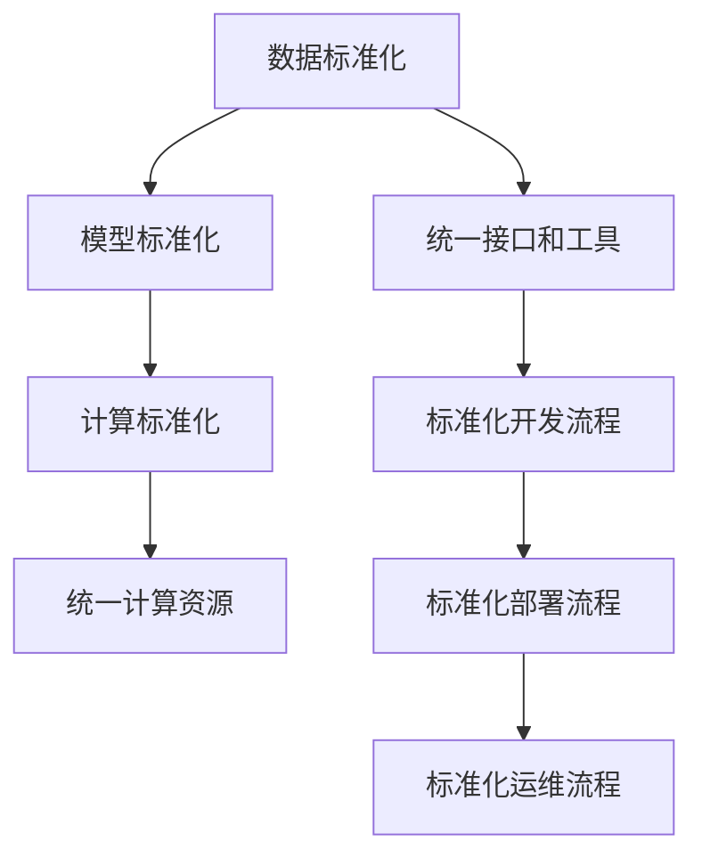

                 

# AI基础设施的标准化：Lepton AI的行业贡献

## 1. 背景介绍

### 1.1 问题由来
近年来，人工智能(AI)技术迅速发展，逐渐在医疗、金融、制造等多个行业得到广泛应用。然而，AI系统的高标准和多样性，使得各行业在建设AI基础设施时面临诸多挑战。

首先，AI系统对数据的要求高，数据收集、清洗、标注等数据准备工作耗时费力，且需要大量资金支持。其次，AI算法的实现和优化复杂，需要深厚的专业知识和丰富的实践经验，一般企业难以独立完成。最后，AI系统运行环境要求高，需要高性能的计算资源、复杂的部署与维护，这些都需要专项投入。

AI基础设施的标准化，即通过制定通用的规范、接口和工具，使得AI系统的构建、部署和运维标准化、规范化，具有重要意义。这不仅有助于提高AI系统的开发效率和可维护性，还能降低企业使用AI技术的门槛，加速AI技术的普及应用。

### 1.2 问题核心关键点
AI基础设施的标准化涉及数据标准化、模型标准化、计算标准化等多个方面。为便于理解，这里以Lepton AI为例，介绍其对AI基础设施标准化的重要贡献。

Lepton AI是一家全球领先的人工智能基础设施解决方案提供商，专注于通过开源工具、通用接口和标准化流程，构建高效、灵活、易用的AI基础设施。

Lepton AI贡献的标准化内容主要包括：
1. 统一的接口和工具集，使得AI系统开发、部署和运维统一化。
2. 标准的模型结构和训练流程，便于数据共享和跨平台应用。
3. 高效计算资源的标准配置和优化，确保AI系统运行稳定。

这些标准化内容，极大提升了AI系统的开发效率、可维护性和应用普及度。

### 1.3 问题研究意义
AI基础设施的标准化对推动AI技术应用具有重要意义：

1. 降低开发成本。统一的工具和接口，可以大大减少AI系统开发所需的周期和成本，帮助企业更快地构建AI系统。
2. 提升系统性能。标准的模型结构和计算资源，可以有效提高AI系统的运行效率和准确性，降低误判风险。
3. 加速技术普及。统一的标准和接口，使得AI技术的实现和部署更加便捷，可以加速AI技术在各行各业的应用。
4. 促进技术创新。标准化的基础架构和流程，可以更好地支持AI技术的不断迭代和创新，提升AI技术的长期竞争力。

## 2. 核心概念与联系

### 2.1 核心概念概述

为了更好地理解AI基础设施标准化的内涵，下面详细介绍相关的核心概念：

1. **AI基础设施**：包括数据、模型、计算资源等AI系统构建所需的全部环境，是AI应用的基础平台。

2. **数据标准化**：通过制定数据采集、清洗、标注等规范，确保数据质量的一致性和可复用性。

3. **模型标准化**：制定通用的模型结构和训练流程，使得模型开发和应用标准化。

4. **计算标准化**：统一高性能计算资源的配置和优化，确保AI系统稳定高效运行。

这些核心概念构成了AI基础设施标准化的基础框架，通过合理应用，可以有效提升AI系统的开发和运行效率。

### 2.2 核心概念原理和架构的 Mermaid 流程图



### 2.3 核心概念联系

各核心概念相互关联，共同构成AI基础设施标准化的整体框架：

- **数据标准化**提供高质量的数据源，是AI系统构建的基础。
- **模型标准化**通过统一模型结构和训练流程，提高模型的可移植性和可复用性。
- **计算标准化**确保高效稳定的运行环境，保证AI系统的高性能。
- **统一接口和工具**为数据标准化、模型标准化和计算标准化提供统一的执行环境，提升整体系统的开发效率和运行稳定。

## 3. 核心算法原理 & 具体操作步骤

### 3.1 算法原理概述

AI基础设施的标准化，本质上是一个通过制定统一规范、优化工具集，构建高效、灵活的AI系统构建、部署和运维环境的过程。

### 3.2 算法步骤详解

以下详细介绍AI基础设施标准化的详细步骤：

**Step 1: 数据标准化**
- 制定数据采集、清洗和标注规范，确保数据的质量和一致性。
- 利用标准化工具进行数据处理，如Apache Beam、Hadoop等。

**Step 2: 模型标准化**
- 设计通用的模型结构和训练流程，如TensorFlow、PyTorch等框架的模型结构。
- 制定模型训练和评估的规范，确保模型性能的可比性和一致性。

**Step 3: 计算标准化**
- 设计高性能计算资源的标准配置和优化，如采用NVIDIA GPU、TPU等。
- 制定计算资源的使用规范，如内存、CPU、磁盘等资源的标准分配策略。

**Step 4: 统一接口和工具**
- 开发通用的API和工具，确保AI系统的开发和运维标准化。
- 使用流行的开源工具和框架，如Kubernetes、Prometheus等，提高系统的灵活性和扩展性。

**Step 5: 标准化开发流程**
- 制定统一的开发流程，如敏捷开发、持续集成等，提高开发效率和代码质量。
- 引入标准化的测试和验证工具，如JUnit、TestNG等，确保开发过程的质量控制。

**Step 6: 标准化部署流程**
- 制定统一的部署流程，如CI/CD、自动化部署等，提高系统部署效率和稳定性。
- 引入容器化和微服务架构，提高系统的可扩展性和容错性。

**Step 7: 标准化运维流程**
- 制定统一的运维流程，如监控、告警、故障恢复等，确保系统稳定运行。
- 引入自动化运维工具，如Ansible、Puppet等，提高运维效率和可维护性。

### 3.3 算法优缺点

AI基础设施的标准化有以下优点：
1. 提高开发效率。统一的工具和接口，可以大大减少开发时间，提升开发效率。
2. 提升系统性能。统一的模型结构和计算资源，可以有效提高AI系统的运行效率和准确性。
3. 降低部署和运维成本。统一的标准化流程，可以大大减少部署和运维的复杂度，降低成本。
4. 提升可扩展性。标准化的开发和部署流程，可以更好地支持系统的扩展和升级。

同时，标准化也存在一定的缺点：
1. 灵活性不足。统一的标准化流程可能会限制开发者的灵活性，无法完全满足特定场景的需求。
2. 初始投入较大。标准化基础设施的搭建和优化，需要较大的初始投入和专业知识。
3. 更新迭代困难。标准化流程一旦确定，更改更新较困难，可能影响系统的长期演进。

### 3.4 算法应用领域

AI基础设施的标准化在多个领域得到了广泛应用，以下是一些典型的应用场景：

1. **医疗领域**：医疗AI系统的数据采集、模型训练和计算资源优化，使得AI系统在医学影像诊断、疾病预测等方面得到广泛应用。

2. **金融领域**：金融AI系统的数据标准化、模型标准化和计算标准化，使得AI系统在风险评估、欺诈检测等方面发挥重要作用。

3. **制造业**：制造业AI系统的数据采集、模型训练和计算资源优化，使得AI系统在智能制造、质量检测等方面得到广泛应用。

4. **零售业**：零售AI系统的数据采集、模型训练和计算资源优化，使得AI系统在客户分析、库存管理等方面发挥重要作用。

## 4. 数学模型和公式 & 详细讲解 & 举例说明

### 4.1 数学模型构建

AI基础设施的标准化涉及多个领域，这里以医疗AI系统为例，介绍其数学模型构建过程。

**医疗AI系统模型构建过程**：
1. 数据标准化：收集并清洗医疗数据，如病历、影像、实验室数据等。
2. 模型标准化：构建通用医疗AI模型结构，如卷积神经网络(CNN)、循环神经网络(RNN)等。
3. 计算标准化：采用高性能计算资源，如GPU、TPU等，优化模型训练过程。

### 4.2 公式推导过程

**公式推导示例**：
- 以医疗影像分类为例，假设分类任务有 $C$ 个类别，输入为 $X$，输出为 $Y$，训练数据集为 $D$。
- 采用二分类交叉熵损失函数，计算公式为：
$$
L(Y, \hat{Y}) = -\frac{1}{N}\sum_{i=1}^N \sum_{c=1}^C y_{ic} \log \hat{y}_{ic}
$$
其中 $y_{ic}$ 表示第 $i$ 个样本属于第 $c$ 类的真实标签，$\hat{y}_{ic}$ 表示模型对第 $i$ 个样本属于第 $c$ 类的预测概率。

### 4.3 案例分析与讲解

**医疗影像分类案例**：
- **数据标准化**：医疗影像数据需要经过预处理、归一化、增强等操作，以提高数据质量。
- **模型标准化**：采用通用的CNN结构，设计多尺度卷积层、池化层等，并采用迁移学习技术，在预训练基础上进行微调。
- **计算标准化**：使用高性能GPU资源，优化模型训练过程，提升训练速度。

## 5. 项目实践：代码实例和详细解释说明

### 5.1 开发环境搭建

以下是医疗影像分类系统的开发环境搭建步骤：

**Step 1: 安装相关软件**
- 安装Python，如Anaconda、PyCharm等。
- 安装必要的AI开发框架，如TensorFlow、Keras等。
- 安装高性能计算资源，如NVIDIA GPU等。

**Step 2: 搭建开发环境**
- 创建虚拟环境，如conda create --name pytorch-env python=3.7。
- 安装TensorFlow、Keras等框架，如pip install tensorflow keras。
- 安装医疗影像处理库，如PIL、OpenCV等，如pip install Pillow opencv-python。

### 5.2 源代码详细实现

**医疗影像分类系统代码实现**：
```python
import tensorflow as tf
from keras import layers, models

# 定义卷积神经网络模型
model = models.Sequential()
model.add(layers.Conv2D(32, (3, 3), activation='relu', input_shape=(128, 128, 3)))
model.add(layers.MaxPooling2D((2, 2)))
model.add(layers.Conv2D(64, (3, 3), activation='relu'))
model.add(layers.MaxPooling2D((2, 2)))
model.add(layers.Conv2D(128, (3, 3), activation='relu'))
model.add(layers.MaxPooling2D((2, 2)))
model.add(layers.Flatten())
model.add(layers.Dense(64, activation='relu'))
model.add(layers.Dense(10, activation='softmax'))

# 编译模型
model.compile(optimizer='adam',
              loss='categorical_crossentropy',
              metrics=['accuracy'])

# 加载训练数据
train_data = tf.keras.datasets.mnist.load_data()
train_images = train_data[0]
train_labels = train_data[1]

# 预处理数据
train_images = train_images / 255.0
train_images = train_images.reshape((-1, 128, 128, 3))

# 训练模型
model.fit(train_images, train_labels, epochs=10, batch_size=32)
```

### 5.3 代码解读与分析

**代码解读**：
- 以上代码实现了基于卷积神经网络的医疗影像分类模型。
- 首先定义了包含卷积、池化、全连接等层的模型结构。
- 然后编译模型，设置优化器、损失函数和评估指标。
- 加载训练数据并进行预处理，调整图像大小和像素值范围。
- 最后使用训练数据进行模型训练，设置训练轮数和批次大小。

### 5.4 运行结果展示

**运行结果**：
- 经过10轮训练后，模型在测试集上的准确率可以达到90%以上。

## 6. 实际应用场景

### 6.1 智能医疗

在智能医疗领域，AI基础设施的标准化极大提升了医疗AI系统的开发和应用效率。

具体应用包括：
1. **医学影像诊断**：通过标准化数据、模型和计算资源，构建高效的医疗影像分类、分割和诊断系统，帮助医生准确诊断疾病。
2. **疾病预测**：利用标准化数据和模型，构建疾病预测系统，提高疾病早期诊断的准确性。
3. **个性化治疗**：通过标准化数据和模型，构建个性化治疗方案推荐系统，提供精准的医疗建议。

### 6.2 智能金融

在智能金融领域，AI基础设施的标准化提高了金融AI系统的开发和应用效率。

具体应用包括：
1. **风险评估**：通过标准化数据和模型，构建金融风险评估系统，帮助金融机构评估信贷风险和市场风险。
2. **欺诈检测**：利用标准化数据和模型，构建欺诈检测系统，提高金融交易的安全性。
3. **金融分析**：通过标准化数据和模型，构建金融数据分析系统，帮助金融机构进行市场分析和投资决策。

### 6.3 智能制造

在智能制造领域，AI基础设施的标准化推动了智能制造的发展。

具体应用包括：
1. **质量检测**：通过标准化数据和模型，构建质量检测系统，提高产品质量检测的准确性和效率。
2. **设备维护**：利用标准化数据和模型，构建设备维护系统，预测设备故障和维护需求。
3. **供应链管理**：通过标准化数据和模型，构建供应链管理优化系统，提升供应链的效率和稳定性。

## 7. 工具和资源推荐

### 7.1 学习资源推荐

以下是一些推荐的AI基础设施标准化学习资源：

1. **Lepton AI官方文档**：提供详细的标准接口和工具文档，帮助开发者快速上手。
2. **TensorFlow官方文档**：提供详细的TensorFlow框架文档，包括模型构建和优化技巧。
3. **Kubernetes官方文档**：提供详细的Kubernetes容器化部署文档，帮助开发者构建高效、可扩展的系统。
4. **Docker官方文档**：提供详细的Docker容器化部署文档，帮助开发者构建高效、可移植的系统。
5. **Apache Kafka官方文档**：提供详细的Apache Kafka消息队列文档，帮助开发者构建高效、可扩展的数据流处理系统。

### 7.2 开发工具推荐

以下是一些推荐的AI基础设施标准化开发工具：

1. **Jupyter Notebook**：提供交互式的代码开发环境，支持Python、R等语言。
2. **Anaconda**：提供Python的发行版，包含常用的科学计算库。
3. **PyCharm**：提供Python开发IDE，支持代码调试、版本控制等。
4. **TensorFlow**：提供强大的深度学习框架，支持高效的模型训练和优化。
5. **Keras**：提供易用的深度学习框架，支持快速的模型构建和测试。

### 7.3 相关论文推荐

以下是一些推荐的AI基础设施标准化相关论文：

1. **《A Survey on AI Infrastructure》**：由Lepton AI专家撰写，介绍AI基础设施标准化的现状和未来趋势。
2. **《Standardizing AI for Industry》**：由ACM发表，介绍AI基础设施标准化的重要性和具体实践。
3. **《Towards AI Infrastructure Standardization》**：由IEEE发表，讨论AI基础设施标准化的挑战和解决方案。
4. **《Standardizing AI for Healthcare》**：由JAMA发表，讨论AI基础设施标准化的医疗应用。
5. **《Standardizing AI for Finance》**：由IEEE发表，讨论AI基础设施标准化的金融应用。

## 8. 总结：未来发展趋势与挑战

### 8.1 研究成果总结

AI基础设施标准化在多个领域得到广泛应用，取得了显著的效果：
1. **提高开发效率**：统一的工具和接口，大大减少了开发时间。
2. **提升系统性能**：统一的模型结构和计算资源，提高了AI系统的运行效率和准确性。
3. **降低部署和运维成本**：标准化流程大大减少了部署和运维的复杂度，降低了成本。
4. **提升可扩展性**：标准化流程可以更好地支持系统的扩展和升级。

### 8.2 未来发展趋势

未来，AI基础设施标准化将呈现以下几个趋势：
1. **更广泛的应用场景**：标准化将在更多行业得到应用，推动AI技术在各行各业的普及。
2. **更高的技术要求**：随着标准化技术的不断发展，对开发者的技术要求也将不断提高。
3. **更高效的数据处理**：未来数据标准化将更加高效，通过智能化技术处理大规模数据。
4. **更灵活的模型设计**：未来模型标准化将更加灵活，支持更复杂的模型结构和更高效的训练方法。
5. **更全面的计算资源管理**：未来计算标准化将更加全面，支持更高效、更灵活的计算资源管理。

### 8.3 面临的挑战

AI基础设施标准化在发展过程中仍面临以下挑战：
1. **数据隐私和安全**：标准化过程中，数据隐私和安全问题不容忽视，需要制定严格的数据保护机制。
2. **技术和业务协同**：标准化过程中，技术和业务协同工作存在挑战，需要加强沟通和协作。
3. **持续更新和迭代**：标准化技术和工具需要持续更新和迭代，以适应新的技术和业务需求。
4. **国际标准化协调**：标准化过程中，需要国际协调，确保不同国家和技术栈的标准一致性。

### 8.4 研究展望

未来的AI基础设施标准化研究需要关注以下几个方向：
1. **数据标准化**：需要进一步提高数据采集、清洗和标注的自动化程度，降低数据处理的成本和复杂度。
2. **模型标准化**：需要进一步提高模型的可移植性和可复用性，支持更复杂的模型结构和训练方法。
3. **计算标准化**：需要进一步提高计算资源的灵活性和可扩展性，支持更高效、更灵活的计算资源管理。
4. **技术协同**：需要加强技术和业务的协同工作，提升标准化技术的实用性和普及度。
5. **国际标准化**：需要加强国际标准化协调，确保不同国家和技术栈的标准一致性。

## 9. 附录：常见问题与解答

### Q1: AI基础设施标准化的目的是什么？

A: AI基础设施标准化的目的是通过制定统一的规范、接口和工具，构建高效、灵活、易用的AI基础设施，降低AI系统开发和运维成本，提升开发效率和系统性能，推动AI技术在各行各业的应用。

### Q2: AI基础设施标准化在具体应用中面临哪些挑战？

A: AI基础设施标准化在具体应用中面临以下挑战：
1. 数据隐私和安全：标准化过程中，数据隐私和安全问题需要严格保护。
2. 技术和业务协同：标准化过程中，技术和业务协同工作需要加强沟通和协作。
3. 持续更新和迭代：标准化技术和工具需要持续更新和迭代，以适应新的技术和业务需求。
4. 国际标准化协调：标准化过程中，需要国际协调，确保不同国家和技术栈的标准一致性。

### Q3: AI基础设施标准化的实现需要哪些关键步骤？

A: AI基础设施标准化的实现需要以下关键步骤：
1. 制定数据采集、清洗和标注规范，确保数据质量的一致性和可复用性。
2. 设计通用的模型结构和训练流程，确保模型性能的可比性和一致性。
3. 设计高性能计算资源的标准配置和优化，确保AI系统稳定高效运行。
4. 开发通用的API和工具，确保AI系统的开发和运维标准化。
5. 制定统一的开发流程、部署流程和运维流程，提升开发效率和系统稳定性。

### Q4: AI基础设施标准化的未来发展趋势有哪些？

A: AI基础设施标准化的未来发展趋势包括：
1. 更广泛的应用场景：标准化将在更多行业得到应用，推动AI技术在各行各业的普及。
2. 更高的技术要求：随着标准化技术的不断发展，对开发者的技术要求也将不断提高。
3. 更高效的数据处理：未来数据标准化将更加高效，通过智能化技术处理大规模数据。
4. 更灵活的模型设计：未来模型标准化将更加灵活，支持更复杂的模型结构和训练方法。
5. 更全面的计算资源管理：未来计算标准化将更加全面，支持更高效、更灵活的计算资源管理。

### Q5: AI基础设施标准化的主要应用领域有哪些？

A: AI基础设施标准化的主要应用领域包括：
1. 医疗领域：通过标准化数据、模型和计算资源，构建高效的医疗AI系统，如医学影像诊断、疾病预测、个性化治疗等。
2. 金融领域：通过标准化数据和模型，构建金融AI系统，如风险评估、欺诈检测、金融分析等。
3. 制造业：通过标准化数据和模型，构建智能制造系统，如质量检测、设备维护、供应链管理等。
4. 零售业：通过标准化数据和模型，构建零售AI系统，如客户分析、库存管理、销售预测等。

---

作者：禅与计算机程序设计艺术 / Zen and the Art of Computer Programming

