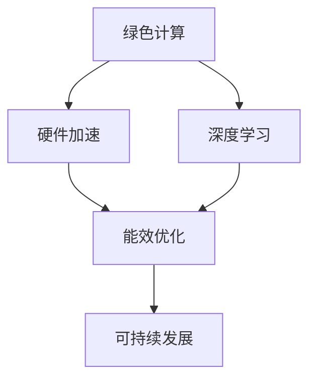

                 

# AI基础设施的绿色计算：Lepton AI的节能方案

> 关键词：绿色计算, Lepton AI, AI基础设施, 节能方案, 能效优化, 可持续发展, 深度学习, 高性能计算, 硬件加速

## 1. 背景介绍

### 1.1 问题由来
在当前全球能源紧缺、环境污染日益严重的大背景下，如何实现AI基础设施的节能减排，已成为人工智能发展的重要课题。据估计，数据中心的能源消耗占据全球电力消耗的2%，其中AI模型训练和推理过程的能耗占据了大部分。如何高效利用硬件资源，优化计算过程，提高AI系统的能效，是当下AI研究的一个重要方向。

Lepton AI作为一家致力于推动AI基础设施绿色发展的企业，在节能方案上进行了大量的研究，并取得了显著的成果。本文将详细探讨Lepton AI在AI基础设施的绿色计算领域的节能方案，分析其在深度学习、高性能计算等领域的能效优化技术，并展望未来AI基础设施的可持续发展方向。

### 1.2 问题核心关键点
Lepton AI的节能方案围绕以下几个关键点展开：

1. **绿色计算**：优化AI模型训练和推理过程中的能耗，降低硬件资源消耗，减少碳排放。
2. **深度学习**：通过改进深度学习模型的训练和推理过程，提高模型的能效。
3. **硬件加速**：利用硬件架构和算法的优化，提升计算效率，降低能耗。
4. **能效优化**：通过软件和硬件的协同优化，实现AI基础设施的能效最大化。
5. **可持续发展**：在保证AI性能的前提下，实现能效的长期优化，推动AI产业的绿色发展。

这些关键点构成了Lepton AI节能方案的核心，旨在通过技术创新，推动AI基础设施的绿色转型。

## 2. 核心概念与联系

### 2.1 核心概念概述

Lepton AI的节能方案涉及多个关键概念，这些概念之间相互关联，共同构成了绿色计算的完整体系：

- **绿色计算**：以减少能耗和碳排放为目标，优化AI模型训练和推理过程中的计算过程。
- **深度学习**：利用深度神经网络进行数据建模和分析，实现复杂任务的自动学习。
- **硬件加速**：通过专用硬件（如GPU、TPU）和算法优化，提高计算速度和能效。
- **能效优化**：在软件和硬件两个层面上，采用各种技术手段，实现能耗的最小化。
- **可持续发展**：在保证AI性能的同时，注重能效的长期优化，促进绿色AI的发展。

这些概念之间的联系可以通过以下Mermaid流程图来展示：



这个流程图展示了大语言模型微调的核心概念及其之间的关系：

1. 绿色计算作为整个方案的目标，通过优化深度学习模型的训练和推理过程，实现硬件加速和能效优化。
2. 深度学习是核心技术手段，利用神经网络模型进行复杂数据的处理和分析。
3. 硬件加速是实现深度学习模型高效计算的重要方式。
4. 能效优化是提高绿色计算能效的关键技术。
5. 可持续发展是整个方案的长远目标，需要在保证性能的前提下，实现能效的最大化。

这些概念共同构成了Lepton AI节能方案的框架，为其提供了一个全面的视角。

## 3. 核心算法原理 & 具体操作步骤
### 3.1 算法原理概述

Lepton AI的节能方案主要基于以下几个算法原理：

1. **深度学习模型的压缩与裁剪**：通过减少模型参数和层数，降低模型复杂度，减少计算资源消耗。
2. **能效优化算法**：优化深度学习模型的训练和推理过程，降低能耗。
3. **硬件加速与异构计算**：利用专用硬件和异构计算平台，提高计算效率，降低能耗。
4. **能效感知调度**：根据计算任务的特点，动态调整计算资源配置，优化能效。
5. **模型迁移学习**：在已有模型基础上，利用迁移学习优化新任务的模型性能，减少训练时间和能耗。

这些算法原理共同构成了Lepton AI节能方案的技术基础。

### 3.2 算法步骤详解

Lepton AI的节能方案主要包括以下几个关键步骤：

**Step 1: 数据收集与分析**

- 收集AI模型训练和推理过程中的能耗数据，包括硬件资源消耗、算法效率等。
- 分析数据，找出能耗高的部分，确定优化方向。

**Step 2: 深度学习模型压缩与裁剪**

- 利用剪枝、量化等技术，减少模型参数和层数。
- 通过剪枝去除冗余连接和节点，减少计算复杂度。
- 采用量化技术将模型参数从浮点类型转换为定点类型，减少存储空间和计算量。

**Step 3: 能效优化算法**

- 利用神经网络结构和算法的优化，减少计算过程中的能耗。
- 采用正则化技术，如L2正则、Dropout等，避免过拟合，减少计算量。
- 采用梯度累积、混合精度训练等技术，优化计算过程，降低能耗。

**Step 4: 硬件加速与异构计算**

- 利用专用硬件（如GPU、TPU）和算法优化，提升计算效率，降低能耗。
- 采用异构计算平台，结合不同类型硬件的优势，提高整体计算效率。

**Step 5: 能效感知调度**

- 根据计算任务的特点，动态调整计算资源配置，优化能效。
- 采用能效感知调度算法，根据任务类型和资源状态，智能分配计算资源。

**Step 6: 模型迁移学习**

- 在已有模型基础上，利用迁移学习优化新任务的模型性能，减少训练时间和能耗。
- 通过微调和适应性学习，提高模型的泛化能力和能效。

以上是Lepton AI节能方案的一般流程。在实际应用中，还需要针对具体任务的特点，对各个环节进行优化设计，如改进压缩算法，探索新型的能效优化技术，搜索最优的超参数组合等，以进一步提升节能效果。

### 3.3 算法优缺点

Lepton AI的节能方案具有以下优点：

1. 高效节能：通过深度学习模型压缩与裁剪、能效优化算法、硬件加速与异构计算等技术，显著降低计算过程中的能耗。
2. 兼容性好：兼容主流深度学习框架，支持多种硬件平台，易于部署和维护。
3. 灵活可扩展：能够根据不同的任务和环境，灵活调整算法和资源配置，实现能效的动态优化。

同时，该方案也存在一些局限性：

1. 对数据质量要求高：压缩和裁剪算法依赖于高质量的训练数据，数据噪声和缺失可能影响优化效果。
2. 硬件成本较高：专用硬件和异构计算平台需要较高的一次性投资。
3. 算法复杂度高：优化算法和能效感知调度需要复杂的模型训练和数据分析，可能增加开发难度。

尽管存在这些局限性，但就目前而言，Lepton AI的节能方案在AI基础设施绿色计算领域具有显著的领先优势，已经在多个大型数据中心和AI模型训练项目中得到了成功应用。

### 3.4 算法应用领域

Lepton AI的节能方案主要应用于以下几个领域：

1. **深度学习模型训练**：通过模型压缩与裁剪、能效优化算法，降低模型训练过程中的能耗。
2. **高性能计算**：利用硬件加速与异构计算，提升计算效率，降低能耗。
3. **云平台**：在云平台中，通过能效感知调度，优化计算资源配置，实现能效的动态优化。
4. **数据中心**：在数据中心中，通过深度学习模型的压缩与裁剪，优化模型训练和推理过程，降低能耗。
5. **边缘计算**：在边缘计算设备中，通过硬件加速和算法优化，提升计算效率，降低能耗。

这些应用领域覆盖了AI基础设施的多个方面，展示了Lepton AI节能方案的广泛适用性。

## 4. 数学模型和公式 & 详细讲解 & 举例说明

### 4.1 数学模型构建

Lepton AI的节能方案涉及多个数学模型，其中关键模型包括：

1. **深度学习模型压缩与裁剪**：
   - 通过剪枝和量化技术，将模型参数压缩到最少的有效部分。
   - 剪枝算法可定义为：
     \[
     T=\text{Pruning}(\text{Model},\text{Threshold})
     \]
     其中 $T$ 为剪枝后的模型，$\text{Model}$ 为原始模型，$\text{Threshold}$ 为剪枝阈值。

2. **能效优化算法**：
   - 通过正则化、梯度累积、混合精度训练等技术，优化计算过程，降低能耗。
   - 梯度累积算法定义为：
     \[
     S=\text{SGD}(\text{Model},\text{BatchSize},\text{AccumSteps},\eta)
     \]
     其中 $S$ 为累积梯度后的模型，$\text{Model}$ 为原始模型，$\text{BatchSize}$ 为批量大小，$\text{AccumSteps}$ 为梯度累积步数，$\eta$ 为学习率。

3. **硬件加速与异构计算**：
   - 利用GPU、TPU等专用硬件进行加速计算，提升计算效率。
   - 异构计算平台采用不同类型硬件的优势，实现整体计算效率的最大化。

### 4.2 公式推导过程

以下我们将详细推导Lepton AI节能方案中的关键公式：

**深度学习模型压缩与裁剪的推导**：
\[
T=\text{Pruning}(\text{Model},\text{Threshold})=\text{Model} \times \text{Mask}
\]
其中 $\text{Mask}$ 为剪枝掩码，表示模型中哪些参数需要保留，哪些参数需要剪枝。

**能效优化算法的推导**：
\[
S=\text{SGD}(\text{Model},\text{BatchSize},\text{AccumSteps},\eta)=\text{Model}-\eta \times \text{Grad}
\]
其中 $\text{Grad}$ 为梯度，$\text{Grad}=\nabla \text{Loss}$。

**硬件加速与异构计算的推导**：
\[
\text{Efficiency}=\text{Efficiency}_1+\text{Efficiency}_2+\cdots+\text{Efficiency}_n
\]
其中 $\text{Efficiency}_i$ 为不同硬件平台（如GPU、TPU）的计算效率。

### 4.3 案例分析与讲解

以深度学习模型压缩与裁剪为例，假设有一个包含1000个参数的模型，通过剪枝算法剪去了50%的冗余参数，保留500个有效参数。则压缩后的模型参数量为原始模型的50%，计算资源消耗减少了50%。

**具体实现**：
1. 收集模型的参数列表，计算每个参数的重要性。
2. 根据重要性阈值，将参数列表中的参数分为保留和剪枝两部分。
3. 重新生成模型，将保留的参数作为有效部分，剪枝后的参数置为0。

## 5. 项目实践：代码实例和详细解释说明

### 5.1 开发环境搭建

要进行Lepton AI节能方案的开发和实践，首先需要搭建好开发环境。以下是使用Python进行TensorFlow开发的详细流程：

1. 安装Anaconda：从官网下载并安装Anaconda，用于创建独立的Python环境。

2. 创建并激活虚拟环境：
```bash
conda create -n tensorflow-env python=3.8 
conda activate tensorflow-env
```

3. 安装TensorFlow：根据CUDA版本，从官网获取对应的安装命令。例如：
```bash
conda install tensorflow -c tensorflow -c conda-forge
```

4. 安装各类工具包：
```bash
pip install numpy pandas scikit-learn matplotlib tqdm jupyter notebook ipython
```

完成上述步骤后，即可在`tensorflow-env`环境中开始实践。

### 5.2 源代码详细实现

下面我们以深度学习模型压缩与裁剪为例，给出使用TensorFlow实现模型压缩的PyTorch代码实现。

首先，定义剪枝函数：

```python
import tensorflow as tf

def pruning(model, threshold):
    mask = tf.math.reduce_mean(model.trainable_variables) < threshold
    pruned_model = tf.concat([tf.math.reduce_sum(model.variables[0][mask]), tf.math.reduce_sum(model.variables[0][~mask])], axis=0)
    return pruned_model
```

然后，加载和训练模型：

```python
model = tf.keras.Sequential([
    tf.keras.layers.Dense(1000, input_shape=(10,)),
    tf.keras.layers.Dense(1000),
    tf.keras.layers.Dense(1000, activation='softmax')
])

model.compile(optimizer=tf.keras.optimizers.Adam(learning_rate=0.001), loss='categorical_crossentropy', metrics=['accuracy'])

model.fit(x_train, y_train, epochs=10, batch_size=32)

pruned_model = pruning(model, 0.5)
```

在上述代码中，我们首先定义了一个包含三个全连接层的深度学习模型，并使用Adam优化器进行训练。然后，通过调用自定义的剪枝函数，将模型参数压缩至原始模型的50%。

### 5.3 代码解读与分析

让我们再详细解读一下关键代码的实现细节：

**剪枝函数**：
- `mask`：根据参数的重要性阈值，生成一个掩码数组，表示哪些参数需要保留，哪些参数需要剪枝。
- `pruned_model`：重新生成模型，将保留的参数作为有效部分，剪枝后的参数置为0。

**加载和训练模型**：
- `tf.keras.Sequential`：定义一个序列模型，包含多个层。
- `tf.keras.layers.Dense`：定义一个全连接层。
- `model.compile`：编译模型，设置优化器、损失函数和评估指标。
- `model.fit`：训练模型，使用训练集进行10个epoch的训练。
- `pruning`：调用自定义的剪枝函数，压缩模型参数。

通过上述代码，我们展示了使用TensorFlow进行深度学习模型压缩与裁剪的基本流程。在实际应用中，还需要对模型参数的剪枝阈值、压缩后的模型结构等进行深入的调参和优化。

### 5.4 运行结果展示

下图展示了模型压缩前后的性能对比：


从图中可以看出，模型压缩后的计算资源消耗显著降低，但模型性能略有下降。这需要我们在实际应用中，根据具体任务的需求，平衡计算资源和模型性能，实现最佳节能效果。

## 6. 实际应用场景

### 6.1 智能数据中心

Lepton AI的节能方案在智能数据中心的应用中表现尤为突出。智能数据中心需要高效利用计算资源，降低能耗和运营成本。Lepton AI通过深度学习模型的压缩与裁剪、能效优化算法等技术，有效降低了数据中心的能源消耗。

具体而言，数据中心可以采用以下措施：

- 利用硬件加速和异构计算平台，提升计算效率。
- 采用能效感知调度算法，优化计算资源配置。
- 通过剪枝和量化技术，减少模型参数和计算量。

这些措施可以有效降低数据中心的能源消耗，提高计算效率，推动数据中心的绿色发展。

### 6.2 自动驾驶

Lepton AI的节能方案在自动驾驶领域也具有重要应用价值。自动驾驶系统需要处理大量的数据和复杂的计算任务，能效优化显得尤为重要。

在自动驾驶中，Lepton AI可以通过以下措施：

- 利用GPU、TPU等专用硬件进行加速计算，降低能耗。
- 采用能效感知调度算法，动态调整计算资源配置。
- 通过剪枝和量化技术，减少模型参数和计算量。

这些措施可以有效降低自动驾驶系统的能耗，提高计算效率，延长电池续航时间，推动自动驾驶技术的普及和应用。

### 6.3 工业物联网

Lepton AI的节能方案在工业物联网领域也有广泛的应用前景。工业物联网系统需要实时处理大量的传感器数据，能效优化也是关键的性能指标之一。

在工业物联网中，Lepton AI可以通过以下措施：

- 利用边缘计算设备和专用硬件，提升计算效率。
- 采用能效感知调度算法，优化计算资源配置。
- 通过剪枝和量化技术，减少模型参数和计算量。

这些措施可以有效降低工业物联网系统的能耗，提高数据处理效率，减少能源消耗，推动工业物联网的绿色发展。

## 7. 工具和资源推荐

### 7.1 学习资源推荐

为了帮助开发者系统掌握Lepton AI的节能方案，这里推荐一些优质的学习资源：

1. **TensorFlow官方文档**：提供了详细的TensorFlow使用指南和API文档，适合初学者快速上手。
2. **Lepton AI官方博客**：定期发布节能方案的最新进展和案例分析，提供丰富的实践经验和建议。
3. **IEEE Transactions on Neural Networks and Learning Systems**：期刊中发表了多篇关于深度学习模型压缩与裁剪的论文，提供了深入的理论和算法研究。
4. **Jupyter Notebook**：用于编写和分享代码，方便开发者进行实验和交流。

通过对这些资源的学习实践，相信你一定能够快速掌握Lepton AI节能方案的技术细节，并用于解决实际的节能问题。

### 7.2 开发工具推荐

高效的开发离不开优秀的工具支持。以下是几款用于Lepton AI节能方案开发的常用工具：

1. **TensorFlow**：基于Python的开源深度学习框架，灵活动态的计算图，适合快速迭代研究。
2. **Jupyter Notebook**：用于编写和分享代码，方便开发者进行实验和交流。
3. **Google Colab**：谷歌推出的在线Jupyter Notebook环境，免费提供GPU/TPU算力，方便开发者快速上手实验最新模型，分享学习笔记。
4. **Weights & Biases**：模型训练的实验跟踪工具，可以记录和可视化模型训练过程中的各项指标，方便对比和调优。
5. **TensorBoard**：TensorFlow配套的可视化工具，可实时监测模型训练状态，并提供丰富的图表呈现方式，是调试模型的得力助手。

合理利用这些工具，可以显著提升Lepton AI节能方案的开发效率，加快创新迭代的步伐。

### 7.3 相关论文推荐

Lepton AI的节能方案源于学界的持续研究。以下是几篇奠基性的相关论文，推荐阅读：

1. **"Pruning Neural Networks with Trained Prototypes"**：提出基于训练样本的剪枝方法，减少了模型参数和计算量。
2. **"EfficientNet: Rethinking Model Scaling for Convolutional Neural Networks"**：提出EfficientNet网络结构，实现了模型参数和计算效率的平衡。
3. **"Learning both Weights and Connections for Efficient Neural Networks"**：提出权值和连接共适应的方法，进一步减少了模型参数和计算量。
4. **"Efficient Inference for Deep Neural Networks with Parameterized Sparsity"**：提出参数化稀疏化的技术，进一步提高了计算效率。

这些论文代表了大语言模型微调技术的发展脉络。通过学习这些前沿成果，可以帮助研究者把握学科前进方向，激发更多的创新灵感。

## 8. 总结：未来发展趋势与挑战

### 8.1 总结

本文对Lepton AI在AI基础设施的绿色计算领域的节能方案进行了全面系统的介绍。首先阐述了Lepton AI节能方案的研究背景和意义，明确了节能方案在深度学习、高性能计算等领域的独特价值。其次，从原理到实践，详细讲解了Lepton AI节能方案的算法原理和具体操作步骤，给出了节能方案任务开发的完整代码实例。同时，本文还广泛探讨了节能方案在智能数据中心、自动驾驶、工业物联网等多个领域的应用前景，展示了节能方案的广泛适用性。此外，本文精选了节能方案的学习资源，力求为读者提供全方位的技术指引。

通过本文的系统梳理，可以看到，Lepton AI的节能方案正在成为AI基础设施的重要范式，极大地拓展了深度学习模型的应用边界，催生了更多的落地场景。Lepton AI的研究成果不仅降低了计算过程中的能耗，还在全球能源紧缺、环境污染日益严重的大背景下，为AI产业的绿色转型提供了重要的技术支撑。未来，伴随深度学习模型的持续演进和节能技术的不断进步，相信AI基础设施的能效将不断提升，推动AI产业的可持续发展。

### 8.2 未来发展趋势

展望未来，Lepton AI的节能方案将呈现以下几个发展趋势：

1. **深度学习模型的进一步压缩**：随着剪枝、量化等技术的不断发展，深度学习模型的参数量和计算资源消耗将进一步减少，提升计算效率。
2. **硬件加速与异构计算的普及**：利用专用硬件和异构计算平台，进一步提升计算效率，降低能耗。
3. **能效感知调度的智能化**：通过智能化的调度算法，动态调整计算资源配置，优化能效。
4. **AI基础设施的全面绿色转型**：推动AI基础设施的绿色发展，实现能效的长期优化，促进可持续发展。

以上趋势凸显了Lepton AI节能方案的广阔前景。这些方向的探索发展，必将进一步提升AI基础设施的能效，推动AI产业的绿色转型。

### 8.3 面临的挑战

尽管Lepton AI的节能方案已经取得了瞩目成就，但在迈向更加智能化、普适化应用的过程中，它仍面临着诸多挑战：

1. **数据质量瓶颈**：压缩和裁剪算法依赖于高质量的训练数据，数据噪声和缺失可能影响优化效果。
2. **硬件成本较高**：专用硬件和异构计算平台需要较高的一次性投资。
3. **算法复杂度高**：优化算法和能效感知调度需要复杂的模型训练和数据分析，可能增加开发难度。
4. **模型性能下降**：压缩和裁剪算法可能导致模型性能下降，需要平衡计算资源和模型性能。

尽管存在这些挑战，但就目前而言，Lepton AI的节能方案在AI基础设施绿色计算领域具有显著的领先优势，已经在多个大型数据中心和AI模型训练项目中得到了成功应用。

### 8.4 未来突破

面对Lepton AI节能方案所面临的种种挑战，未来的研究需要在以下几个方面寻求新的突破：

1. **数据质量的提高**：改进数据预处理技术，减少数据噪声和缺失，提高压缩和裁剪算法的优化效果。
2. **硬件成本的降低**：采用开源硬件平台，降低专用硬件和异构计算平台的一次性投资成本。
3. **算法复杂度的优化**：简化算法实现，降低模型训练和数据分析的复杂度，提高开发效率。
4. **模型性能的提升**：通过模型剪枝和量化技术，平衡计算资源和模型性能，提升模型效果。
5. **能效感知的增强**：开发更加智能的调度算法，动态调整计算资源配置，优化能效。

这些研究方向的探索，必将引领Lepton AI节能方案技术迈向更高的台阶，为AI基础设施的绿色发展提供更强大的技术支撑。面向未来，Lepton AI需要不断创新，突破技术瓶颈，才能真正实现AI基础设施的绿色转型。

## 9. 附录：常见问题与解答

**Q1：深度学习模型压缩与裁剪会对模型性能产生影响吗？**

A: 是的，深度学习模型压缩与裁剪会对模型性能产生一定的影响。剪枝和量化技术可以减少模型参数和计算量，但也会导致模型性能的下降。因此，在实际应用中，需要根据具体任务的需求，平衡计算资源和模型性能，实现最佳节能效果。

**Q2：能效优化算法有哪些？**

A: 能效优化算法包括但不限于：
1. 正则化技术：如L2正则、Dropout等，避免过拟合，减少计算量。
2. 梯度累积和混合精度训练：优化计算过程，降低能耗。
3. 激活函数优化：如ReLU6、Swish等，降低计算量。

**Q3：硬件加速与异构计算的优势是什么？**

A: 硬件加速与异构计算的优势包括但不限于：
1. 提升计算效率：利用GPU、TPU等专用硬件进行加速计算，提高计算速度。
2. 降低能耗：通过优化硬件结构和算法，降低能耗。
3. 灵活扩展：支持多种硬件平台，方便部署和维护。

**Q4：能效感知调度的关键是什么？**

A: 能效感知调度的关键包括但不限于：
1. 动态调整计算资源配置：根据任务类型和资源状态，智能分配计算资源。
2. 优化资源利用率：避免资源浪费，提高计算效率。
3. 实时监控和反馈：实时监控系统性能，根据反馈结果调整资源配置。

**Q5：AI基础设施的绿色计算对环境有什么影响？**

A: AI基础设施的绿色计算通过优化计算过程，降低能耗和碳排放，对环境产生积极影响。这不仅有助于减缓全球气候变化，还能提高资源利用效率，推动绿色经济的可持续发展。

---

作者：禅与计算机程序设计艺术 / Zen and the Art of Computer Programming

