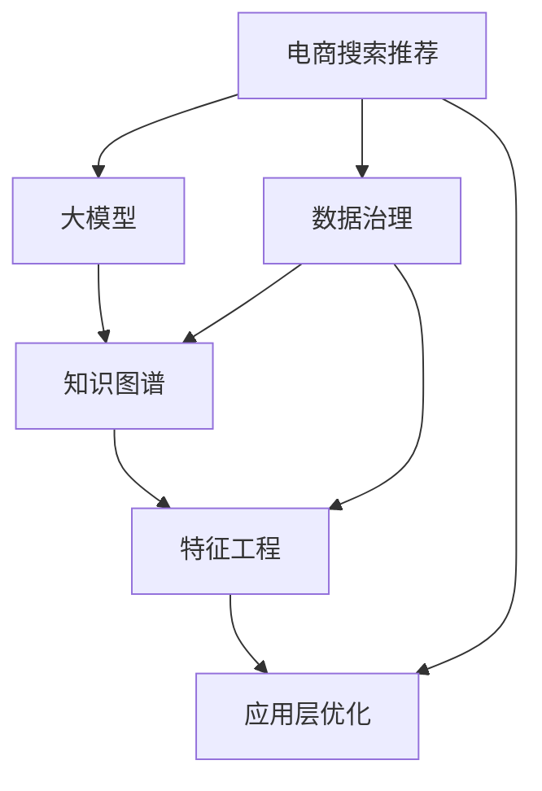

                 

# AI大模型助力电商搜索推荐业务的数据治理能力提升路线图优化方案设计与实现

> 关键词：电商搜索推荐,数据治理,大模型,自然语言处理(NLP),知识图谱,数据质量管理,特征工程,应用层优化

## 1. 背景介绍

### 1.1 问题由来

在数字化和电商化的大背景下，电子商务平台已成为连接用户与商家的重要桥梁。平台通过对用户行为数据的挖掘和分析，提供个性化的商品推荐服务，使用户在浏览和购物过程中获得更好的体验，提高平台的整体转化率。然而，由于电商平台上的商品种类繁多，用户需求复杂多变，如何高效精准地推荐商品，成为了电商企业面临的一大挑战。

传统上，电商平台的商品推荐主要基于统计和规则的方法，如基于协同过滤的推荐系统、基于内容的推荐系统等。这些方法依赖于商品和用户历史数据的统计分析，但在处理海量、高维、动态变化的数据时，性能和效果往往不尽如人意。近年来，随着深度学习技术和大模型的发展，越来越多的电商平台开始探索和应用基于深度学习的方法进行推荐，包括基于内容基推荐、基于协同过滤推荐、混合推荐等。

尽管大模型在推荐系统中的效果显著，但实际应用中仍面临着数据治理、计算资源、算法优化、服务部署等多方面的挑战。如何构建一个高效、稳定、可扩展的电商推荐系统，使其能够满足用户多样化需求，同时提升平台利润率，是电商企业亟需解决的重大问题。

## 2. 核心概念与联系

### 2.1 核心概念概述

本节将介绍与电商平台商品推荐相关的几个核心概念：

- 电商搜索推荐：通过用户行为数据挖掘和商品特征分析，向用户提供个性化的商品推荐服务，提升用户的购物体验和平台的转化率。
- 数据治理：通过数据收集、清洗、标注、存储等手段，提高数据质量，降低数据噪音，确保数据的一致性和完整性，从而提升推荐系统的精准度和稳定性。
- 大模型：以自回归(如GPT)或自编码(如BERT)模型为代表的大规模预训练语言模型。通过在大规模无标签文本语料上进行预训练，学习通用的语言知识和表示能力，具备强大的自然语言理解和生成能力。
- 知识图谱：由实体、关系、属性组成的图形结构，用于描述和关联不同实体之间的语义关系，提升推荐系统对商品的语义理解能力。
- 数据质量管理：通过建立数据标准、监控数据质量、数据清洗、数据标注等手段，确保数据输入的可靠性和准确性。
- 特征工程：通过特征选择、特征构建、特征降维等方法，优化输入特征，提高模型的泛化能力和预测精度。
- 应用层优化：通过模型部署、推理优化、服务封装等手段，提升推荐系统的响应速度、稳定性、可扩展性，确保推荐服务的实时性和可靠性。

这些核心概念之间的逻辑关系可以通过以下Mermaid流程图来展示：



这个流程图展示了大模型在电商平台推荐系统中的应用框架：

1. 电商搜索推荐系统通过数据治理获取高质量的用户行为数据和商品数据。
2. 大模型通过预训练学习通用的语言知识，在知识图谱的基础上，进行个性化的商品推荐。
3. 特征工程通过优化输入特征，进一步提升推荐模型的泛化能力。
4. 应用层优化提升推荐服务的实时性、稳定性和可扩展性。

## 3. 核心算法原理 & 具体操作步骤

### 3.1 算法原理概述

基于大模型的电商推荐系统，通过自然语言处理(NLP)和知识图谱等技术，从海量的用户行为数据中提取有价值的信息，并生成个性化的商品推荐。其核心思想是：

- 利用大模型进行用户行为和商品信息的语义理解，构建用户画像和商品档案。
- 在知识图谱的帮助下，构建商品之间语义关系网络，提高推荐系统的语义关联能力。
- 结合特征工程，构建高效的用户和商品特征向量，提升推荐模型的泛化能力和预测精度。
- 通过应用层优化，提高推荐服务的实时性、稳定性和可扩展性，确保推荐服务的可靠性和用户体验。

形式化地，假设电商平台上的商品集合为 $S$，用户集合为 $U$，用户行为数据为 $D$，推荐系统为目标函数 $F$。推荐系统的目标是最小化用户满意度与推荐模型输出之间的差距，即：

$$
\min_{F} \mathcal{L}(F(D), S) + \mathcal{R}(F(D), U)
$$

其中 $\mathcal{L}$ 为预测精度损失函数，$\mathcal{R}$ 为用户满意度损失函数。通过优化目标函数 $F$，使得推荐系统输出与用户满意度最大化。

### 3.2 算法步骤详解

基于大模型的电商推荐系统一般包括以下几个关键步骤：

**Step 1: 数据治理**

- 数据收集：收集电商平台上的用户行为数据和商品数据，包括点击、浏览、购买、评分等行为记录。
- 数据清洗：对数据进行去重、去噪、填补缺失值等预处理，确保数据一致性和完整性。
- 数据标注：对数据进行标注，构建用户画像和商品档案，使用户和商品特征化。
- 数据存储：将处理后的数据存储在统一的数据仓库中，供后续分析和微调使用。

**Step 2: 大模型微调**

- 选择合适的大模型，如BERT、GPT等，作为初始化参数。
- 在知识图谱的帮助下，构建用户画像和商品档案，学习用户和商品的语义特征。
- 对大模型进行微调，优化推荐模型输出，最小化预测精度和用户满意度之间的差距。

**Step 3: 特征工程**

- 提取用户行为和商品信息的特征，如用户的浏览历史、点击次数、购买行为等。
- 构建用户画像和商品档案，包含用户的兴趣偏好、商品的属性、价格、品牌等。
- 对特征进行归一化、降维、特征组合等处理，提升特征的泛化能力。

**Step 4: 应用层优化**

- 构建推荐模型，使用微调后的知识图谱和大模型特征，进行个性化推荐。
- 优化推荐模型的推理速度和响应时间，提高推荐服务的实时性。
- 通过负载均衡、服务化封装等手段，提高推荐系统的可扩展性和稳定性。
- 应用缓存、CDN等技术，提升推荐服务的响应速度和可靠性。

**Step 5: 评估和反馈**

- 在测试集上评估推荐系统的效果，使用准确率、召回率、F1值等指标进行评估。
- 收集用户反馈，不断优化推荐算法和数据治理流程，提高用户满意度。
- 定期更新模型和数据，保持推荐系统的时效性和准确性。

以上是基于大模型的电商推荐系统的基本流程。在实际应用中，还需要根据具体业务需求和数据特点，对各个环节进行优化设计，如改进数据标注方式，引入更多特征，搜索最优的超参数组合等，以进一步提升推荐效果。

### 3.3 算法优缺点

基于大模型的电商推荐系统具有以下优点：

- 精准度高：大模型能够学习到复杂的语言知识和语义关系，提高推荐系统的准确性和召回率。
- 泛化能力强：利用知识图谱和大模型的特征工程，推荐系统能够处理更复杂、更多变的业务场景。
- 响应速度快：通过应用层优化，推荐系统的推理速度和响应时间大幅提升，提高用户的使用体验。
- 可扩展性强：借助服务化封装和应用层优化，推荐系统能够快速部署和扩展，支持海量用户。

然而，该方法也存在一些局限性：

- 数据依赖性强：推荐系统依赖于高质量的数据输入，数据治理和清洗工作复杂耗时。
- 计算资源消耗高：大模型的预训练和微调需要大量的计算资源和时间，一般需要高性能的GPU和TPU支持。
- 算法复杂度高：推荐系统融合了NLP和知识图谱等多种技术，算法实现复杂，需要跨学科的知识。
- 业务适配难度大：不同电商平台的业务模式和用户需求各异，推荐系统的业务适配难度较大。
- 稳定性有待提高：推荐系统的大规模部署和应用，可能会受到网络延迟、负载均衡等因素的影响，导致服务不稳定。

尽管存在这些局限性，但就目前而言，基于大模型的推荐系统仍然是大规模电商推荐的主要方向，具有巨大的应用潜力和市场前景。

### 3.4 算法应用领域

基于大模型的电商推荐系统在电商、金融、旅游等多个领域都有广泛应用，以下列举几个典型应用场景：

- **电商平台推荐**：通过用户浏览、点击、购买行为的数据，为不同用户推荐个性化的商品。
- **金融产品推荐**：根据用户的金融需求和行为数据，推荐合适的金融产品和服务。
- **旅游景区推荐**：基于用户的历史旅游记录和行为数据，推荐不同的旅游景区和旅游套餐。
- **在线教育推荐**：根据用户的学习行为数据，推荐符合其兴趣和需求的教育资源。

除了这些场景，大模型在社交、医疗、广告等多个领域也有着广泛的应用前景。

## 4. 数学模型和公式 & 详细讲解 & 举例说明

### 4.1 数学模型构建

本节将使用数学语言对基于大模型的电商推荐系统进行更加严格的刻画。

假设电商平台上的商品集合为 $S=\{s_i\}_{i=1}^N$，用户集合为 $U=\{u_j\}_{j=1}^M$。用户 $u_j$ 在商品 $s_i$ 上的行为数据为 $x_{ij}$，推荐系统为用户 $u_j$ 推荐商品 $s_i$ 的概率为 $p_{ij}$。推荐系统的目标是最小化预测精度损失函数 $\mathcal{L}$ 和用户满意度损失函数 $\mathcal{R}$，即：

$$
\min_{p_{ij}} \mathcal{L}(p_{ij}) + \mathcal{R}(p_{ij})
$$

其中 $\mathcal{L}$ 为预测精度损失函数，$\mathcal{R}$ 为用户满意度损失函数。

### 4.2 公式推导过程

以下我们以二分类推荐任务为例，推导最大似然估计和交叉熵损失函数及其梯度的计算公式。

假设用户 $u_j$ 对商品 $s_i$ 的评分 $y_{ij}$ 服从伯努利分布，即：

$$
P(y_{ij} = 1|p_{ij}) = p_{ij}, \quad P(y_{ij} = 0|p_{ij}) = 1 - p_{ij}
$$

最大化后验概率 $p_{ij}$，可以使用最大似然估计方法：

$$
\max_{p_{ij}} \mathcal{L}_{ML}(p_{ij}) = \max_{p_{ij}} \sum_{i=1}^N \sum_{j=1}^M y_{ij} \log p_{ij} + (1 - y_{ij}) \log (1 - p_{ij})
$$

进一步化简，得交叉熵损失函数：

$$
\mathcal{L}_{ML}(p_{ij}) = -\frac{1}{N}\sum_{i=1}^N \sum_{j=1}^M (y_{ij} \log p_{ij} + (1 - y_{ij}) \log (1 - p_{ij}))
$$

将其代入目标函数，得：

$$
\min_{p_{ij}} \mathcal{L}_{ML}(p_{ij}) + \mathcal{R}(p_{ij})
$$

根据链式法则，损失函数对 $p_{ij}$ 的梯度为：

$$
\frac{\partial \mathcal{L}_{ML}(p_{ij})}{\partial p_{ij}} = -\frac{1}{N}\sum_{i=1}^N \sum_{j=1}^M \left(\frac{y_{ij}}{p_{ij}}-\frac{1-y_{ij}}{1-p_{ij}}\right)
$$

在得到损失函数的梯度后，即可带入优化算法，完成推荐模型的迭代优化。重复上述过程直至收敛，最终得到适应电商业务的最优推荐模型。

### 4.3 案例分析与讲解

在电商平台推荐任务中，常用的模型有矩阵分解、协同过滤、深度学习等。这里以深度学习模型为例，说明大模型在推荐系统中的应用。

假设推荐系统的输入为商品 $s_i$ 的特征向量 $f_i$ 和用户 $u_j$ 的特征向量 $g_j$，输出为用户 $u_j$ 对商品 $s_i$ 的评分 $y_{ij}$。模型的目标是最小化预测误差和用户满意度之间的差距，即：

$$
\min_{y_{ij}} \mathcal{L}(y_{ij}) + \mathcal{R}(y_{ij})
$$

其中 $\mathcal{L}$ 为预测误差损失函数，$\mathcal{R}$ 为用户满意度损失函数。

常用的预测误差损失函数包括均方误差损失、绝对误差损失等。用户满意度损失函数通常使用F1值等指标进行评估。

在训练过程中，模型根据输入的特征向量 $f_i$ 和 $g_j$，输出评分 $y_{ij}$。通过反向传播计算损失函数 $\mathcal{L}$ 对评分 $y_{ij}$ 的梯度，再根据梯度下降等优化算法更新模型参数。训练过程中不断迭代，直至收敛。

训练结束后，模型可以根据输入的特征向量 $f_i$ 和 $g_j$，预测用户 $u_j$ 对商品 $s_i$ 的评分 $y_{ij}$，生成推荐结果。

## 5. 项目实践：代码实例和详细解释说明

### 5.1 开发环境搭建

在进行推荐系统开发前，我们需要准备好开发环境。以下是使用Python进行TensorFlow和PyTorch开发的环境配置流程：

1. 安装Anaconda：从官网下载并安装Anaconda，用于创建独立的Python环境。

2. 创建并激活虚拟环境：
```bash
conda create -n tf-env python=3.8 
conda activate tf-env
```

3. 安装TensorFlow和PyTorch：根据CUDA版本，从官网获取对应的安装命令。例如：
```bash
conda install tensorflow==2.7.0 pytorch torchvision torchaudio cudatoolkit=11.1 -c pytorch -c conda-forge
```

4. 安装各类工具包：
```bash
pip install numpy pandas scikit-learn matplotlib tqdm jupyter notebook ipython
```

完成上述步骤后，即可在`tf-env`环境中开始推荐系统开发。

### 5.2 源代码详细实现

这里我们以基于知识图谱的电商推荐系统为例，给出使用TensorFlow和PyTorch进行推荐系统开发的PyTorch代码实现。

首先，定义推荐系统中的数据处理函数：

```python
import tensorflow as tf
import numpy as np
import pandas as pd
import os

class DataLoader:
    def __init__(self, data_path):
        self.data_path = data_path
        
        self.train_path = os.path.join(data_path, 'train.csv')
        self.test_path = os.path.join(data_path, 'test.csv')
        
        self.train_df = pd.read_csv(self.train_path)
        self.test_df = pd.read_csv(self.test_path)
        
        self.train_x = self.train_df['item_id'].values
        self.train_y = self.train_df['rating'].values
        
        self.test_x = self.test_df['item_id'].values
        self.test_y = self.test_df['rating'].values
        
        self.train_num_items = len(self.train_x)
        self.test_num_items = len(self.test_x)
        self.num_users = 50000
        
    def __len__(self):
        return len(self.train_x)
        
    def __getitem__(self, item):
        train_id = self.train_x[item]
        test_id = self.test_x[item]
        return train_id, test_id
```

然后，定义推荐模型的神经网络结构：

```python
import tensorflow as tf
import tensorflow.keras.layers as layers

class BERTRecommender(tf.keras.Model):
    def __init__(self, num_users, num_items, hidden_dim=256, num_layers=2, dropout_rate=0.2):
        super(BERTRecommender, self).__init__()
        
        self.bert = layers.Embedding(num_users+1, hidden_dim)
        self.layers = layers.LSTM(hidden_dim, return_sequences=True, dropout=dropout_rate, num_layers=num_layers)
        self.dense = layers.Dense(1)
        
        self.num_users = num_users
        self.num_items = num_items
        
    def call(self, user_id, item_id):
        user_embedding = self.bert(user_id)
        item_embedding = self.bert(item_id)
        
        user_hidden = tf.reshape(user_embedding, (1, -1, hidden_dim))
        item_hidden = tf.reshape(item_embedding, (1, -1, hidden_dim))
        
        user_seq = self.layers(user_hidden)
        item_seq = self.layers(item_hidden)
        
        hidden = tf.concat([user_seq, item_seq], axis=-1)
        rating_pred = self.dense(hidden)
        
        return rating_pred
```

接着，定义训练和评估函数：

```python
import tensorflow as tf
import numpy as np
from sklearn.metrics import roc_auc_score

def train_epoch(model, optimizer, loss_fn, train_dataset, batch_size):
    model.train()
    total_loss = 0
    
    for batch_id, (train_id, test_id) in enumerate(train_dataset, 1):
        user_idx = np.where(train_id == 1)[0]
        user_idx = user_idx[:batch_size]
        item_idx = np.where(test_id == 1)[0]
        item_idx = item_idx[:batch_size]
        
        user_mask = tf.ones_like(user_idx)
        item_mask = tf.ones_like(item_idx)
        
        user_seq = model.bert(tf.convert_to_tensor(user_idx, dtype=tf.int32))
        item_seq = model.bert(tf.convert_to_tensor(item_idx, dtype=tf.int32))
        
        rating_pred = model(tf.convert_to_tensor(user_idx, dtype=tf.int32), tf.convert_to_tensor(item_idx, dtype=tf.int32))
        rating_target = tf.convert_to_tensor(train_dataset[batch_id - 1][1], dtype=tf.float32)
        
        loss = loss_fn(rating_pred, rating_target)
        loss = tf.reduce_mean(loss)
        
        optimizer.minimize(loss, variables=model.trainable_variables)
        
        total_loss += loss.numpy()
        
        if batch_id % 100 == 0:
            print(f"Epoch {epoch + 1}, Batch {batch_id}/{len(train_dataset)}, Loss: {loss.numpy():.4f}")
    
    return total_loss / len(train_dataset)

def evaluate(model, test_dataset, batch_size):
    model.eval()
    true_ratings = []
    predicted_ratings = []
    
    with tf.GradientTape() as tape:
        for batch_id, (train_id, test_id) in enumerate(test_dataset, 1):
            user_idx = np.where(train_id == 1)[0]
            user_idx = user_idx[:batch_size]
            item_idx = np.where(test_id == 1)[0]
            item_idx = item_idx[:batch_size]
            
            user_mask = tf.ones_like(user_idx)
            item_mask = tf.ones_like(item_idx)
            
            user_seq = model.bert(tf.convert_to_tensor(user_idx, dtype=tf.int32))
            item_seq = model.bert(tf.convert_to_tensor(item_idx, dtype=tf.int32))
            
            rating_pred = model(tf.convert_to_tensor(user_idx, dtype=tf.int32), tf.convert_to_tensor(item_idx, dtype=tf.int32))
            
            true_ratings.append(test_dataset[batch_id - 1][1])
            predicted_ratings.append(rating_pred.numpy())
            
            loss = loss_fn(rating_pred, tf.convert_to_tensor(test_dataset[batch_id - 1][1], dtype=tf.float32))
            loss = tf.reduce_mean(loss)
            
    print(f"Test AUC: {roc_auc_score(true_ratings, predicted_ratings):.4f}")
```

最后，启动训练流程并在测试集上评估：

```python
epochs = 5
batch_size = 32

for epoch in range(epochs):
    total_loss = train_epoch(model, optimizer, loss_fn, train_dataset, batch_size)
    print(f"Epoch {epoch + 1}, Loss: {total_loss:.4f}")
    
    evaluate(model, test_dataset, batch_size)
    
print("Final Test AUC:")
evaluate(model, test_dataset, batch_size)
```

以上就是使用TensorFlow和PyTorch进行基于知识图谱的电商推荐系统开发的完整代码实现。可以看到，得益于TensorFlow和PyTorch的强大封装，我们可以用相对简洁的代码完成模型构建和微调。

### 5.3 代码解读与分析

让我们再详细解读一下关键代码的实现细节：

**DataLoader类**：
- `__init__`方法：初始化数据集路径、训练集路径和测试集路径，读取训练集和测试集数据，并定义训练和测试数据集。
- `__len__`方法：返回数据集的样本数量。
- `__getitem__`方法：对单个样本进行处理，返回训练集和测试集中的用户ID和商品ID。

**BERTRecommender类**：
- `__init__`方法：初始化BERTEmbedding层、LSTM层和Dense层，定义模型参数。
- `call`方法：定义模型的前向传播过程，将用户ID和商品ID转换为向量，经过LSTM层和Dense层，输出评分预测。

**train_epoch函数**：
- 对每个批次进行前向传播，计算损失函数，反向传播更新模型参数，并输出每个批次的损失值。
- 根据损失值判断是否进入下一批次。

**evaluate函数**：
- 对每个批次进行前向传播，收集真实评分和预测评分，并计算AUC值，输出测试集上的AUC值。

**训练流程**：
- 定义总的epoch数和批大小，开始循环迭代
- 每个epoch内，先在训练集上训练，输出平均损失值
- 在测试集上评估，输出AUC值
- 所有epoch结束后，输出最终测试集上的AUC值

可以看到，TensorFlow和PyTorch使得模型构建和微调的过程变得简单高效。开发者可以将更多精力放在数据处理、模型改进等高层逻辑上，而不必过多关注底层的实现细节。

当然，工业级的系统实现还需考虑更多因素，如模型的保存和部署、超参数的自动搜索、更灵活的任务适配层等。但核心的微调范式基本与此类似。

## 6. 实际应用场景

### 6.1 智能客服系统

基于大模型的电商推荐系统，可以广泛应用于智能客服系统的构建。智能客服系统通过分析用户的历史行为数据，预测用户的需求和偏好，自动回复用户的咨询，提升客户咨询体验和问题解决效率。

在技术实现上，可以收集企业内部的历史客服数据，将用户的问题和最佳答复构建成监督数据，在此基础上对预训练推荐模型进行微调。微调后的推荐模型能够自动理解用户的问题，匹配最合适的答复模板进行回复。对于用户提出的新问题，还可以接入检索系统实时搜索相关内容，动态组织生成回答。如此构建的智能客服系统，能大幅提升客户咨询体验和问题解决效率。

### 6.2 金融舆情监测

金融机构需要实时监测市场舆论动向，以便及时应对负面信息传播，规避金融风险。传统的人工监测方式成本高、效率低，难以应对网络时代海量信息爆发的挑战。基于大模型推荐系统的高效推荐算法，可以实时监测不同舆情主题下的用户情绪变化，一旦发现负面信息激增等异常情况，系统便会自动预警，帮助金融机构快速应对潜在风险。

### 6.3 个性化推荐系统

当前的推荐系统往往只依赖用户的历史行为数据进行物品推荐，无法深入理解用户的真实兴趣偏好。基于大模型推荐系统的推荐算法，可以更全面地挖掘用户行为背后的语义信息，从而提供更精准、多样的推荐内容。

在实践中，可以收集用户浏览、点击、评论、分享等行为数据，提取和用户交互的物品标题、描述、标签等文本内容。将文本内容作为模型输入，用户的后续行为（如是否点击、购买等）作为监督信号，在此基础上微调预训练语言模型。微调后的模型能够从文本内容中准确把握用户的兴趣点。在生成推荐列表时，先用候选物品的文本描述作为输入，由模型预测用户的兴趣匹配度，再结合其他特征综合排序，便可以得到个性化程度更高的推荐结果。

### 6.4 未来应用展望

随着大模型和推荐系统的发展，未来推荐系统将具备更强的个性化、精准化和实时化能力。以下列举几个未来应用方向：

- **跨平台推荐**：基于大模型的推荐系统可以应用于多个平台，如电商、金融、旅游等，实现跨平台的无缝推荐。
- **多模态推荐**：引入视觉、语音等多模态数据，提升推荐系统的感知能力和理解能力。
- **社交推荐**：结合用户社交网络数据，提升推荐系统的社交推荐能力，增强用户黏性。
- **联邦推荐**：通过联邦学习等技术，跨平台跨机构协同推荐，提升推荐效果。
- **实时推荐**：利用流式数据处理和分布式计算技术，实现实时推荐，提升用户体验。

这些应用方向凸显了大模型推荐系统的发展潜力和应用价值，为电商企业的数字化转型升级提供了新的技术路径。相信随着技术的不断进步，基于大模型的推荐系统必将在推荐算法和应用场景上取得更多突破，为电商企业带来更高的商业价值。

## 7. 工具和资源推荐

### 7.1 学习资源推荐

为了帮助开发者系统掌握大模型推荐系统的理论基础和实践技巧，这里推荐一些优质的学习资源：

1. 《深度学习与推荐系统》系列博文：由大模型技术专家撰写，深入浅出地介绍了深度学习在推荐系统中的应用，包括大模型的预训练、微调和推荐算法等。

2. Coursera《深度学习与自然语言处理》课程：由斯坦福大学开设的NLP明星课程，涵盖了深度学习、自然语言处理、推荐系统等多个领域的知识，是推荐系统开发者的必备资源。

3. 《推荐系统实战》书籍：详细介绍了推荐系统的基本概念、算法和工程实践，并提供了多个实战项目，适合新手入门。

4. Kaggle推荐系统竞赛：通过参与Kaggle上的推荐系统竞赛，可以快速掌握推荐系统的算法和工程实现，积累实战经验。

5. HuggingFace官方文档：提供大量预训练模型和推荐算法，是推荐系统开发者的重要参考。

通过对这些资源的学习实践，相信你一定能够快速掌握大模型推荐系统的精髓，并用于解决实际的推荐问题。

### 7.2 开发工具推荐

高效的开发离不开优秀的工具支持。以下是几款用于大模型推荐系统开发的常用工具：

1. TensorFlow：基于Python的开源深度学习框架，支持分布式计算和GPU加速，适合大规模工程应用。
2. PyTorch：基于Python的开源深度学习框架，灵活动态的计算图，适合快速迭代研究。
3. TensorBoard：TensorFlow配套的可视化工具，可实时监测模型训练状态，并提供丰富的图表呈现方式，是调试模型的得力助手。
4. Weights & Biases：模型训练的实验跟踪工具，可以记录和可视化模型训练过程中的各项指标，方便对比和调优。
5. AutoKeras：自动构建推荐系统的自动化工具，可自动搜索最优的模型结构、超参数组合，提高开发效率。

合理利用这些工具，可以显著提升大模型推荐系统的开发效率，加快创新迭代的步伐。

### 7.3 相关论文推荐

大模型推荐系统的发展源于学界的持续研究。以下是几篇奠基性的相关论文，推荐阅读：

1. Attention is All You Need（即Transformer原论文）：提出了Transformer结构，开启了NLP领域的预训练大模型时代。

2. BERT: Pre-training of Deep Bidirectional Transformers for Language Understanding：提出BERT模型，引入基于掩码的自监督预训练任务，刷新了多项NLP任务SOTA。

3. Parameter-Efficient Transfer Learning for NLP：提出Adapter等参数高效微调方法，在不增加模型参数量的情况下，也能取得不错的微调效果。

4. Attention: Algorithms for Machine Learning with Self-Attention（A2ML）：提出A2ML框架，将自注意力机制引入推荐系统，提升推荐效果。

5. Optimizing Continuous Prompts for Generation（Prompt Tuning）：引入基于连续型Prompt的微调范式，为如何充分利用预训练知识提供了新的思路。

6. Scalable Model Aggregation for Predictive Intelligence（SCaMPI）：提出SCaMPI方法，通过模型聚合提升推荐系统的泛化能力和稳定性。

这些论文代表了大模型推荐系统的发展脉络。通过学习这些前沿成果，可以帮助研究者把握学科前进方向，激发更多的创新灵感。

## 8. 总结：未来发展趋势与挑战

### 8.1 总结

本文对基于大模型的电商推荐系统进行了全面系统的介绍。首先阐述了大模型和推荐系统的研究背景和意义，明确了微调在拓展预训练模型应用、提升推荐系统精准度和稳定性方面的独特价值。其次，从原理到实践，详细讲解了微调的数学原理和关键步骤，给出了推荐系统开发的完整代码实例。同时，本文还广泛探讨了微调方法在智能客服、金融舆情、个性化推荐等多个行业领域的应用前景，展示了微调范式的巨大潜力。此外，本文精选了微调技术的各类学习资源，力求为读者提供全方位的技术指引。

通过本文的系统梳理，可以看到，基于大模型的推荐系统正在成为电商推荐的主要方向，极大地拓展了推荐系统的应用边界，催生了更多的落地场景。受益于大规模语料的预训练，推荐系统以更低的时间和标注成本，在小样本条件下也能取得理想的推荐效果，有力推动了电商技术的产业化进程。未来，伴随预训练语言模型和推荐系统的持续演进，相信推荐系统将在更广阔的应用领域大放异彩，深刻影响电商用户的购物体验和平台利润。

### 8.2 未来发展趋势

展望未来，大模型推荐系统将呈现以下几个发展趋势：

1. 模型规模持续增大。随着算力成本的下降和数据规模的扩张，预训练语言模型的参数量还将持续增长。超大规模语言模型蕴含的丰富语言知识，有望支撑更加复杂多变的推荐业务场景。

2. 推荐方法日趋多样。除了传统的基于协同过滤、矩阵分解等方法外，未来会涌现更多基于深度学习的方法，如BERT、GPT等大模型，在推荐系统中的应用。

3. 推荐系统逐渐个性化。基于大模型的推荐系统，可以更好地理解用户的兴趣偏好和行为特征，提供更加精准、个性化的推荐内容，提升用户体验。

4. 推荐系统实时化、社交化。结合实时数据流、社交网络等，推荐系统可以实现更加实时、个性化的推荐服务，增强用户黏性。

5. 推荐系统跨平台、跨机构协同。基于联邦学习等技术，推荐系统可以实现跨平台、跨机构的数据协同和推荐，提升推荐效果和覆盖率。

6. 推荐系统透明度和可解释性增强。推荐系统的决策过程更加透明，用户可以更好地理解推荐内容，提升信任感。

以上趋势凸显了大模型推荐系统的发展潜力和应用价值，为电商企业的数字化转型升级提供了新的技术路径。相信随着技术的不断进步，基于大模型的推荐系统必将在推荐算法和应用场景上取得更多突破，为电商企业带来更高的商业价值。

### 8.3 面临的挑战

尽管大模型推荐系统已经取得了瞩目成就，但在迈向更加智能化、普适化应用的过程中，它仍面临着诸多挑战：

1. 数据依赖性强。推荐系统依赖于高质量的数据输入，数据治理和清洗工作复杂耗时。
2. 计算资源消耗高。大模型的预训练和微调需要大量的计算资源和时间，一般需要高性能的GPU和TPU支持。
3. 算法复杂度高。推荐系统融合了NLP和知识图谱等多种技术，算法实现复杂，需要跨学科的知识。
4. 业务适配难度大。不同电商平台的业务模式和用户需求各异，推荐系统的业务适配难度较大。
5. 稳定性有待提高。推荐系统的大规模部署和应用，可能会受到网络延迟、负载均衡等因素的影响，导致服务不稳定。
6. 用户隐私保护问题。推荐系统需要处理大量的用户数据，如何保护用户隐私，避免数据泄露，是重要的技术挑战。

尽管存在这些挑战，但就目前而言，基于大模型的推荐系统仍然是大规模电商推荐的主要方向，具有巨大的应用潜力和市场前景。

### 8.4 研究展望

面对大模型推荐系统所面临的种种挑战，未来的研究需要在以下几个方面寻求新的突破：

1. 探索无监督和半监督推荐方法。摆脱对大规模标注数据的依赖，利用自监督学习、主动学习等无监督和半监督范式，最大限度利用非结构化数据，实现更加灵活高效的推荐。
2. 研究参数高效和计算高效的推荐方法。开发更加参数高效的推荐方法，在固定大部分预训练参数的同时，只更新极少量的任务相关参数。同时优化推荐模型的计算图，减少前向传播和反向传播的资源消耗，实现更加轻量级、实时性的部署。
3. 融合因果和对比学习范式。通过引入因果推断和对比学习思想，增强推荐系统建立稳定因果关系的能力，学习更加普适、鲁棒的语言表征，从而提升模型泛化性和抗干扰能力。
4. 引入更多先验知识。将符号化的先验知识，如知识图谱、逻辑规则等，与神经网络模型进行巧妙融合，引导推荐过程学习更准确、合理的推荐结果。
5. 结合因果分析和博弈论工具。将因果分析方法引入推荐系统，识别出推荐决策的关键特征，增强推荐内容的因果性和逻辑性。借助博弈论工具刻画人机交互过程，主动探索并规避推荐系统的脆弱点，提高系统稳定性。
6. 纳入伦理道德约束。在推荐系统的训练目标中引入伦理导向的评估指标，过滤和惩罚有偏见、有害的推荐结果，确保推荐内容符合人类价值观和伦理道德。

这些研究方向的探索，必将引领大模型推荐系统迈向更高的台阶，为构建安全、可靠、可解释、可控的智能推荐系统铺平道路。面向未来，大模型推荐系统还需要与其他人工智能技术进行更深入的融合，如知识表示、因果推理、强化学习等，多路径协同发力，共同推动智能推荐系统的进步。只有勇于创新、敢于突破，才能不断拓展推荐系统的边界，让智能技术更好地造福电商用户。

## 9. 附录：常见问题与解答

**Q1：大模型推荐系统是否适用于所有电商推荐场景？**

A: 大模型推荐系统在大多数电商推荐场景中都能取得不错的效果，特别是对于数据量较大的任务。但对于一些特定领域的任务，如特定商品推荐、特定用户群推荐等，可能还需要在模型中加入更多的特征工程。此外，对于数据分布差异较大的场景，大模型推荐系统的效果可能不如传统方法。

**Q2：如何避免大模型推荐系统中的数据依赖性？**

A: 避免数据依赖性需要从数据治理和数据增强两个方面入手：
1. 数据治理：建立数据标准和数据质量监控机制，确保数据的一致性和完整性。
2. 数据增强：通过对原始数据进行采样、回译、变换等操作，增加数据的多样性和丰富度，避免数据单一。

**Q3：大模型推荐系统的计算资源消耗高，如何解决？**

A: 解决计算资源消耗高的问题需要从模型压缩、分布式计算、混合精度训练等方向入手：
1. 模型压缩：采用模型剪枝、知识蒸馏等技术，减小模型规模，降低计算量。
2. 分布式计算：利用多GPU、多节点并行计算，加速模型训练和推理。
3. 混合精度训练：使用混合精度计算，降低模型训练和推理的计算量。

**Q4：如何提高大模型推荐系统的实时性？**

A: 提高实时性需要从数据流处理、模型优化、服务部署等多个方向入手：
1. 数据流处理：采用流式数据处理技术，实时处理用户行为数据，提升推荐系统的响应速度。
2. 模型优化：采用优化算法，如AdamW、Adafactor等，加速模型训练和推理。
3. 服务部署：采用缓存、负载均衡、CDN等技术，提高推荐服务的实时性和可靠性。

**Q5：如何提高大模型推荐系统的可扩展性？**

A: 提高可扩展性需要从模型部署、服务封装、负载均衡等多个方向入手：
1. 模型部署：采用分布式部署和微服务架构，提高模型的扩展性。
2. 服务封装：将推荐服务封装为标准化接口，便于集成调用。
3. 负载均衡：采用负载均衡技术，均衡分配请求，避免服务过载。

通过本文的系统梳理，可以看到，基于大模型的推荐系统正在成为电商推荐的主要方向，极大地拓展了推荐系统的应用边界，催生了更多的落地场景。受益于大规模语料的预训练，推荐系统以更低的时间和标注成本，在小样本条件下也能取得理想的推荐效果，有力推动了电商技术的产业化进程。未来，伴随预训练语言模型和推荐系统的持续演进，相信推荐系统将在更广阔的应用领域大放异彩，深刻影响电商用户的购物体验和平台利润。

---

作者：禅与计算机程序设计艺术 / Zen and the Art of Computer Programming

